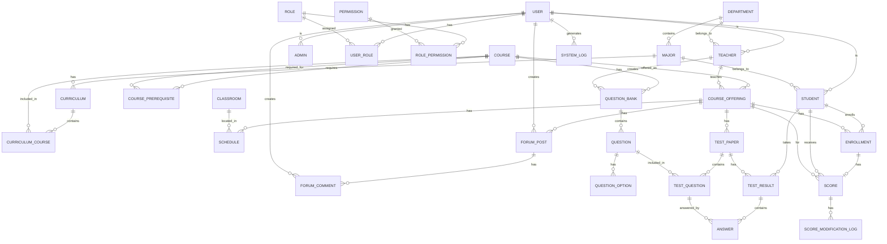

# Smart-Teaching-Service-System 数据库设计

---

## 一、E-R 图概览

**Mermaid 代码：**



---

## 二、核心实体设计

### 2.1 用户管理 (Subsystem A)

#### User - 用户表

| 字段          | 类型         | 约束             | 说明                         |
| ------------- | ------------ | ---------------- | ---------------------------- |
| id            | UUID         | PK               | 用户唯一标识                 |
| username      | VARCHAR(50)  | UNIQUE, NOT NULL | 用户名/学号/工号             |
| password_hash | VARCHAR(255) | NOT NULL         | 密码哈希                     |
| email         | VARCHAR(100) | UNIQUE           | 邮箱                         |
| phone         | VARCHAR(20)  |                  | 手机号                       |
| real_name     | VARCHAR(50)  | NOT NULL         | 真实姓名                     |
| avatar_url    | VARCHAR(500) |                  | 头像URL                      |
| gender        | ENUM         |                  | 性别: male/female/other      |
| status        | ENUM         | NOT NULL         | 状态: active/inactive/banned |
| last_login_at | TIMESTAMP    |                  | 最后登录时间                 |
| created_at    | TIMESTAMP    | NOT NULL         | 创建时间                     |
| updated_at    | TIMESTAMP    | NOT NULL         | 更新时间                     |

#### Student - 学生表

| 字段           | 类型        | 约束             | 说明            |
| -------------- | ----------- | ---------------- | --------------- |
| user_id        | UUID        | PK, FK -> User   | 用户ID          |
| student_number | VARCHAR(20) | UNIQUE, NOT NULL | 学号            |
| major_id       | UUID        | FK -> Major      | 专业ID          |
| grade          | INT         | NOT NULL         | 年级 (入学年份) |
| class_name     | VARCHAR(20) |                  | 班级            |

> **说明**：GPA 和排名不单独存储，每次根据成绩动态计算。

#### Teacher - 教师表

| 字段            | 类型         | 约束             | 说明     |
| --------------- | ------------ | ---------------- | -------- |
| user_id         | UUID         | PK, FK -> User   | 用户ID   |
| teacher_number  | VARCHAR(20)  | UNIQUE, NOT NULL | 工号     |
| department_id   | UUID         | FK -> Department | 院系ID   |
| title           | VARCHAR(50)  |                  | 职称     |
| office_location | VARCHAR(100) |                  | 办公地点 |

#### Admin - 管理员表

| 字段          | 类型 | 约束             | 说明                          |
| ------------- | ---- | ---------------- | ----------------------------- |
| user_id       | UUID | PK, FK -> User   | 用户ID                        |
| admin_type    | ENUM | NOT NULL         | 类型: academic/super/security |
| department_id | UUID | FK -> Department | 所属部门                      |

#### Department - 院系表

| 字段        | 类型         | 约束     | 说明     |
| ----------- | ------------ | -------- | -------- |
| id          | UUID         | PK       | 院系ID   |
| name        | VARCHAR(100) | NOT NULL | 院系名称 |
| code        | VARCHAR(20)  | UNIQUE   | 院系代码 |
| description | TEXT         |          | 描述     |

#### Major - 专业表

| 字段          | 类型         | 约束             | 说明                         |
| ------------- | ------------ | ---------------- | ---------------------------- |
| id            | UUID         | PK               | 专业ID                       |
| department_id | UUID         | FK -> Department | 所属院系                     |
| name          | VARCHAR(100) | NOT NULL         | 专业名称                     |
| code          | VARCHAR(20)  | UNIQUE           | 专业代码                     |
| degree_type   | ENUM         |                  | 学位: bachelor/master/doctor |
| total_credits | DECIMAL(5,1) |                  | 总学分要求                   |

#### Role - 角色表

| 字段        | 类型        | 约束             | 说明     |
| ----------- | ----------- | ---------------- | -------- |
| id          | UUID        | PK               | 角色ID   |
| name        | VARCHAR(50) | UNIQUE, NOT NULL | 角色名称 |
| code        | VARCHAR(50) | UNIQUE, NOT NULL | 角色代码 |
| description | TEXT        |                  | 描述     |

#### Permission - 权限表

| 字段     | 类型         | 约束             | 说明                            |
| -------- | ------------ | ---------------- | ------------------------------- |
| id       | UUID         | PK               | 权限ID                          |
| name     | VARCHAR(100) | NOT NULL         | 权限名称                        |
| code     | VARCHAR(100) | UNIQUE, NOT NULL | 权限代码 (如 user:create)       |
| resource | VARCHAR(50)  | NOT NULL         | 资源类型                        |
| action   | VARCHAR(20)  | NOT NULL         | 操作: create/read/update/delete |

#### UserRole - 用户角色关联表

| 字段        | 类型      | 约束     | 说明     |
| ----------- | --------- | -------- | -------- |
| user_id     | UUID      | PK, FK   | 用户ID   |
| role_id     | UUID      | PK, FK   | 角色ID   |
| assigned_at | TIMESTAMP | NOT NULL | 分配时间 |

#### RolePermission - 角色权限关联表

| 字段          | 类型 | 约束   | 说明   |
| ------------- | ---- | ------ | ------ |
| role_id       | UUID | PK, FK | 角色ID |
| permission_id | UUID | PK, FK | 权限ID |

#### SystemLog - 系统日志表

| 字段          | 类型         | 约束       | 说明       |
| ------------- | ------------ | ---------- | ---------- |
| id            | BIGSERIAL    | PK         | 日志ID     |
| user_id       | UUID         | FK -> User | 操作用户   |
| action        | VARCHAR(100) | NOT NULL   | 操作类型   |
| resource_type | VARCHAR(50)  |            | 资源类型   |
| resource_id   | UUID         |            | 资源ID     |
| ip_address    | INET         |            | IP地址     |
| user_agent    | TEXT         |            | 浏览器信息 |
| details       | JSONB        |            | 详细信息   |
| created_at    | TIMESTAMP    | NOT NULL   | 创建时间   |

---

### 2.2 自动排课 (Subsystem B)

#### Classroom - 教室表

| 字段        | 类型        | 约束     | 说明                                    |
| ----------- | ----------- | -------- | --------------------------------------- |
| id          | UUID        | PK       | 教室ID                                  |
| building    | VARCHAR(50) | NOT NULL | 教学楼                                  |
| room_number | VARCHAR(20) | NOT NULL | 教室号                                  |
| campus      | VARCHAR(50) | NOT NULL | 校区                                    |
| capacity    | INT         | NOT NULL | 容量                                    |
| room_type   | ENUM        | NOT NULL | 类型: lecture/lab/computer/multimedia   |
| equipment   | JSONB       |          | 设备信息                                |
| status      | ENUM        | NOT NULL | 状态: available/maintenance/unavailable |

#### Schedule - 课程时间安排表

| 字段               | 类型 | 约束                 | 说明         |
| ------------------ | ---- | -------------------- | ------------ |
| id                 | UUID | PK                   | 安排ID       |
| course_offering_id | UUID | FK -> CourseOffering | 课程开设ID   |
| classroom_id       | UUID | FK -> Classroom      | 教室ID       |
| day_of_week        | INT  | NOT NULL             | 星期几 (1-7) |
| start_week         | INT  | NOT NULL             | 开始周次     |
| end_week           | INT  | NOT NULL             | 结束周次     |
| start_period       | INT  | NOT NULL             | 开始节次     |
| end_period         | INT  | NOT NULL             | 结束节次     |
| notes              | TEXT |                      | 备注         |

---

### 2.3 智能选课 (Subsystem C)

#### Course - 课程基本信息表

| 字段              | 类型         | 约束             | 说明                            |
| ----------------- | ------------ | ---------------- | ------------------------------- |
| id                | UUID         | PK               | 课程ID                          |
| code              | VARCHAR(20)  | UNIQUE, NOT NULL | 课程代码                        |
| name              | VARCHAR(100) | NOT NULL         | 课程名称                        |
| credits           | DECIMAL(3,1) | NOT NULL         | 学分                            |
| course_type       | ENUM         | NOT NULL         | 类型: required/elective/general |
| category          | VARCHAR(50)  |                  | 课程分类                        |
| description       | TEXT         |                  | 课程描述                        |
| assessment_method | TEXT         |                  | 考核方式                        |
| status            | ENUM         | NOT NULL         | 状态: active/archived           |

#### CourseOffering - 课程开设表 (学期课程)

| 字段           | 类型 | 约束           | 说明                                |
| -------------- | ---- | -------------- | ----------------------------------- |
| id             | UUID | PK             | 开设ID                              |
| course_id      | UUID | FK -> Course   | 课程ID                              |
| semester_id    | UUID | FK -> Semester | 学期ID                              |
| teacher_id     | UUID | FK -> Teacher  | 主讲教师ID                          |
| capacity       | INT  | NOT NULL       | 容量                                |
| enrolled_count | INT  | DEFAULT 0      | 已选人数                            |
| status         | ENUM | NOT NULL       | 状态: planned/open/closed/cancelled |

#### Curriculum - 培养方案表

| 字段             | 类型         | 约束        | 说明       |
| ---------------- | ------------ | ----------- | ---------- |
| id               | UUID         | PK          | 方案ID     |
| major_id         | UUID         | FK -> Major | 专业ID     |
| name             | VARCHAR(100) | NOT NULL    | 方案名称   |
| year             | INT          | NOT NULL    | 适用年级   |
| total_credits    | DECIMAL(5,1) | NOT NULL    | 总学分要求 |
| required_credits | DECIMAL(5,1) |             | 必修学分   |
| elective_credits | DECIMAL(5,1) |             | 选修学分   |

#### CurriculumCourse - 培养方案课程表

| 字段                | 类型 | 约束     | 说明                            |
| ------------------- | ---- | -------- | ------------------------------- |
| curriculum_id       | UUID | PK, FK   | 方案ID                          |
| course_id           | UUID | PK, FK   | 课程ID                          |
| course_type         | ENUM | NOT NULL | 类型: required/elective/general |
| semester_suggestion | INT  |          | 建议修读学期                    |

#### Semester - 学期表

| 字段       | 类型        | 约束     | 说明                         |
| ---------- | ----------- | -------- | ---------------------------- |
| id         | UUID        | PK       | 学期ID                       |
| name       | VARCHAR(50) | NOT NULL | 学期名称 (如 2025-2026-1)    |
| start_date | DATE        | NOT NULL | 开始日期                     |
| end_date   | DATE        | NOT NULL | 结束日期                     |
| status     | ENUM        | NOT NULL | 状态: upcoming/current/ended |

#### CoursePrerequisite - 先修课程关联表

| 字段            | 类型 | 约束             | 说明       |
| --------------- | ---- | ---------------- | ---------- |
| course_id       | UUID | PK, FK -> Course | 课程ID     |
| prerequisite_id | UUID | PK, FK -> Course | 先修课程ID |

**说明**：复合主键，支持多对多自引用关系。

#### Enrollment - 选课记录表

| 字段               | 类型      | 约束                 | 说明                             |
| ------------------ | --------- | -------------------- | -------------------------------- |
| id                 | UUID      | PK                   | 选课ID                           |
| student_id         | UUID      | FK -> Student        | 学生ID                           |
| course_offering_id | UUID      | FK -> CourseOffering | 课程开设ID                       |
| status             | ENUM      | NOT NULL             | 状态: enrolled/dropped/withdrawn |
| enrolled_at        | TIMESTAMP | NOT NULL             | 选课时间                         |
| dropped_at         | TIMESTAMP |                      | 退选时间                         |

#### SelectionPeriod - 选课时间段表

| 字段        | 类型         | 约束           | 说明                                      |
| ----------- | ------------ | -------------- | ----------------------------------------- |
| id          | UUID         | PK             | 时段ID                                    |
| semester_id | UUID         | FK -> Semester | 学期ID                                    |
| phase       | ENUM         | NOT NULL       | 阶段: first_round/second_round/adjustment |
| start_time  | TIMESTAMP    | NOT NULL       | 开始时间                                  |
| end_time    | TIMESTAMP    | NOT NULL       | 结束时间                                  |
| max_credits | DECIMAL(3,1) |                | 最大选课学分                              |
| is_active   | BOOLEAN      | NOT NULL       | 是否启用                                  |

---

### 2.4 论坛交流 (Subsystem D)

#### ForumPost - 论坛帖子表

| 字段               | 类型         | 约束                 | 说明                                         |
| ------------------ | ------------ | -------------------- | -------------------------------------------- |
| id                 | UUID         | PK                   | 帖子ID                                       |
| course_offering_id | UUID         | FK -> CourseOffering | 课程开设ID                                   |
| author_id          | UUID         | FK -> User           | 作者ID                                       |
| title              | VARCHAR(200) | NOT NULL             | 标题                                         |
| content            | TEXT         | NOT NULL             | 内容                                         |
| post_type          | ENUM         | NOT NULL             | 类型: question/discussion/share/announcement |
| is_pinned          | BOOLEAN      | DEFAULT FALSE        | 是否置顶                                     |
| is_announcement    | BOOLEAN      | DEFAULT FALSE        | 是否公告                                     |
| view_count         | INT          | DEFAULT 0            | 浏览量                                       |
| status             | ENUM         | NOT NULL             | 状态: normal/hidden/deleted                  |
| created_at         | TIMESTAMP    | NOT NULL             | 创建时间                                     |
| updated_at         | TIMESTAMP    |                      | 更新时间                                     |

#### ForumComment - 论坛评论表

| 字段       | 类型      | 约束               | 说明                         |
| ---------- | --------- | ------------------ | ---------------------------- |
| id         | UUID      | PK                 | 评论ID                       |
| post_id    | UUID      | FK -> ForumPost    | 帖子ID                       |
| author_id  | UUID      | FK -> User         | 作者ID                       |
| parent_id  | UUID      | FK -> ForumComment | 父评论ID (回复)              |
| content    | TEXT      | NOT NULL           | 内容                         |
| depth      | INT       | DEFAULT 0          | 嵌套深度（优化嵌套评论查询） |
| status     | ENUM      | NOT NULL           | 状态: normal/hidden/deleted  |
| created_at | TIMESTAMP | NOT NULL           | 创建时间                     |

#### ForumAttachment - 附件表

| 字段        | 类型         | 约束            | 说明     |
| ----------- | ------------ | --------------- | -------- |
| id          | UUID         | PK              | 附件ID   |
| post_id     | UUID         | FK -> ForumPost | 帖子ID   |
| file_name   | VARCHAR(255) | NOT NULL        | 文件名   |
| file_path   | VARCHAR(500) | NOT NULL        | 文件路径 |
| file_size   | BIGINT       | NOT NULL        | 文件大小 |
| file_type   | VARCHAR(50)  |                 | 文件类型 |
| uploaded_at | TIMESTAMP    | NOT NULL        | 上传时间 |

---

### 2.5 在线测试 (Subsystem E)

#### QuestionBank - 题库表

| 字段        | 类型         | 约束          | 说明                  |
| ----------- | ------------ | ------------- | --------------------- |
| id          | UUID         | PK            | 题库ID                |
| course_id   | UUID         | FK -> Course  | 课程ID                |
| creator_id  | UUID         | FK -> Teacher | 创建者ID              |
| name        | VARCHAR(100) | NOT NULL      | 题库名称              |
| description | TEXT         |               | 描述                  |
| status      | ENUM         | NOT NULL      | 状态: active/archived |

#### Question - 题目表

| 字段            | 类型         | 约束               | 说明                                        |
| --------------- | ------------ | ------------------ | ------------------------------------------- |
| id              | UUID         | PK                 | 题目ID                                      |
| bank_id         | UUID         | FK -> QuestionBank | 题库ID                                      |
| question_type   | ENUM         | NOT NULL           | 类型: single_choice/multi_choice/true_false |
| content         | TEXT         | NOT NULL           | 题目内容                                    |
| answer          | TEXT         | NOT NULL           | 答案                                        |
| explanation     | TEXT         |                    | 解析                                        |
| default_points  | DECIMAL(5,2) | NOT NULL           | 默认分值                                    |
| difficulty      | ENUM         |                    | 难度: easy/medium/hard                      |
| knowledge_point | VARCHAR(100) |                    | 知识点                                      |
| created_at      | TIMESTAMP    | NOT NULL           | 创建时间                                    |
| updated_at      | TIMESTAMP    |                    | 更新时间                                    |

#### QuestionOption - 题目选项表

替代 Question.options 字段（JSONB），改为关联表实现。

| 字段         | 类型         | 约束           | 说明         |
| ------------ | ------------ | -------------- | ------------ |
| id           | UUID         | PK             | 选项ID       |
| question_id  | UUID         | FK -> Question | 题目ID       |
| option_text  | VARCHAR(500) | NOT NULL       | 选项文本     |
| option_order | INT          | NOT NULL       | 选项顺序     |
| is_correct   | BOOLEAN      | DEFAULT FALSE  | 是否正确答案 |

**索引**：(question_id, option_order)

#### TestPaper - 试卷表

| 字段               | 类型         | 约束                 | 说明                         |
| ------------------ | ------------ | -------------------- | ---------------------------- |
| id                 | UUID         | PK                   | 试卷ID                       |
| course_offering_id | UUID         | FK -> CourseOffering | 课程开设ID                   |
| creator_id         | UUID         | FK -> Teacher        | 创建者ID                     |
| title              | VARCHAR(200) | NOT NULL             | 试卷标题                     |
| total_points       | DECIMAL(5,2) | NOT NULL             | 总分                         |
| duration_minutes   | INT          | NOT NULL             | 考试时长(分钟)               |
| start_time         | TIMESTAMP    |                      | 开始时间                     |
| end_time           | TIMESTAMP    |                      | 结束时间                     |
| is_random          | BOOLEAN      | DEFAULT FALSE        | 是否随机组卷                 |
| description        | TEXT         |                      | 试卷描述                     |
| status             | ENUM         | NOT NULL             | 状态: draft/published/closed |

#### TestQuestion - 试卷题目关联表

支持试卷与题目的多对多关系，每道题可设置不同分值。

| 字段          | 类型         | 约束            | 说明     |
| ------------- | ------------ | --------------- | -------- |
| id            | UUID         | PK              | 关联ID   |
| test_paper_id | UUID         | FK -> TestPaper | 试卷ID   |
| question_id   | UUID         | FK -> Question  | 题目ID   |
| order_num     | INT          | NOT NULL        | 题目顺序 |
| points        | DECIMAL(5,2) | NOT NULL        | 该题分值 |

#### TestResult - 测试结果表

| 字段               | 类型         | 约束            | 说明                                               |
| ------------------ | ------------ | --------------- | -------------------------------------------------- |
| id                 | UUID         | PK              | 结果ID                                             |
| test_paper_id      | UUID         | FK -> TestPaper | 试卷ID                                             |
| student_id         | UUID         | FK -> Student   | 学生ID                                             |
| start_time         | TIMESTAMP    | NOT NULL        | 开始时间                                           |
| submit_time        | TIMESTAMP    |                 | 提交时间                                           |
| total_score        | DECIMAL(5,2) |                 | 总得分                                             |
| status             | ENUM         | NOT NULL        | 状态: in_progress / submitted / graded / cancelled |
| time_spent_seconds | INT          |                 | 用时(秒)                                           |

#### Answer - 学生答案表

| 字段             | 类型         | 约束               | 说明       |
| ---------------- | ------------ | ------------------ | ---------- |
| id               | UUID         | PK                 | 答案ID     |
| test_result_id   | UUID         | FK -> TestResult   | 测试结果ID |
| test_question_id | UUID         | FK -> TestQuestion | 试卷题目ID |
| student_answer   | TEXT         |                    | 学生答案   |
| is_correct       | BOOLEAN      |                    | 是否正确   |
| score            | DECIMAL(5,2) |                    | 得分       |

---

### 2.6 成绩管理 (Subsystem F)

#### Score - 成绩表

| 字段                 | 类型         | 约束                 | 说明                            |
| -------------------- | ------------ | -------------------- | ------------------------------- |
| id                   | UUID         | PK                   | 成绩ID                          |
| enrollment_id        | UUID         | FK -> Enrollment     | 选课记录ID                      |
| student_id           | UUID         | FK -> Student        | 学生ID                          |
| course_offering_id   | UUID         | FK -> CourseOffering | 课程开设ID                      |
| usual_score          | DECIMAL(5,2) |                      | 平时成绩                        |
| midterm_score        | DECIMAL(5,2) |                      | 期中成绩                        |
| final_score          | DECIMAL(5,2) |                      | 期末成绩                        |
| total_score          | DECIMAL(5,2) |                      | 总评成绩                        |
| grade_point          | DECIMAL(3,2) |                      | 绩点                            |
| grade_letter         | VARCHAR(2)   |                      | 等级 (A/B/C/D/F)                |
| entered_by           | UUID         | FK -> Teacher        | 录入教师                        |
| entered_at           | TIMESTAMP    |                      | 录入时间                        |
| modification_request | TEXT         |                      | 修改申请                        |
| modified_at          | TIMESTAMP    |                      | 修改时间                        |
| modified_by          | UUID         | FK -> Admin          | 修改人                          |
| status               | ENUM         | NOT NULL             | 状态: draft/submitted/confirmed |

#### ScoreModificationLog - 成绩修改日志表

| 字段        | 类型      | 约束        | 说明       |
| ----------- | --------- | ----------- | ---------- |
| id          | UUID      | PK          | 日志ID     |
| score_id    | UUID      | FK -> Score | 成绩ID     |
| modifier_id | UUID      | FK -> User  | 修改人ID   |
| old_value   | JSONB     | NOT NULL    | 修改前的值 |
| new_value   | JSONB     | NOT NULL    | 修改后的值 |
| reason      | TEXT      |             | 修改原因   |
| created_at  | TIMESTAMP | NOT NULL    | 创建时间   |

> **说明**：GPA 和排名不单独建表存储，每次根据 Score 表动态计算。

---

## 三、设计考量

### 扩展性

- 使用 JSONB 存储灵活字段（equipment, details）
- 预留扩展字段

### 性能

- 合理的索引设计
- 冗余字段（enrolled_count）减少 JOIN
- 分页查询支持

### 安全性

- 密码哈希存储
- 完整的权限系统
- 操作日志记录

### 数据规范化

- 将 JSONB 字段拆分为关联表（Question.options → QuestionOption）
- 将数组字段改为关联表（Course.prerequisites → CoursePrerequisite）
- 提升查询性能和数据完整性

### 审计追踪

- 新增 ScoreModificationLog 记录成绩修改历史
- Score 表新增修改相关字段（modified_at, modified_by）

### 查询优化

- ForumComment.depth 字段优化嵌套评论查询
- TestQuestion 表支持灵活的试卷题目分值设置

---

**文档版本: 1.3**
**最后更新: 2026-04-01**

---

## 变更记录

### v1.3 (2026-04-01)

- 删除 Student 表中的 class_rank、grade_rank 字段
- 删除 StudentRanking 表（GPA 和排名改为动态计算）
- 更新 E-R 图：删除 STUDENT_RANKING 相关关系
- 新增 ActivationToken 表（用于账号激活流程）
- 新增 PasswordResetToken 表（用于密码重置流程）

### v1.2 (2026-03-26)

- 删除 GPARecord 表
- 新增 StudentRanking 表（记录每学期 GPA 和排名）
- 更新 E-R 图：删除 GPARecord，添加 StudentRanking

### v1.1 (2026-03-22)

- 新增 5 张表：CoursePrerequisite、QuestionOption、TestQuestion、Answer、ScoreModificationLog
- 调整 Course 表：删除 prerequisites 字段
- 调整 Question 表：删除 options 字段，重命名 points 为 default_points，新增时间戳字段
- 调整 ForumComment 表：新增 depth 字段
- 调整 TestPaper 表：新增 description 字段
- 调整 Score 表：新增 entered_at、modification_request、modified_at、modified_by 字段
- 更新 TestStatus 枚举：新增 CANCELLED 状态
- 更新 E-R 图：添加新表关系

### v1.0 (2026-03-22)

- 初始版本

#### ActivationToken - 账号激活令牌表

| 字段      | 类型         | 约束               | 说明         |
| --------- | ------------ | ------------------ | ------------ |
| id        | UUID         | PK                 | 令牌唯一标识 |
| userId    | UUID         | FK -> User, 用户ID |              |
| tokenHash | VARCHAR(255) | UNIQUE             | 令牌哈希     |
| expiresAt | TIMESTAMP    |                    | 过期时间     |
| isUsed    | BOOLEAN      | DEFAULT false      | 是否已使用   |
| createdAt | TIMESTAMP    |                    | 创建时间     |

#### PasswordResetToken - 密码重置令牌表

| 字段      | 类型         | 约束          | 说明         |
| --------- | ------------ | ------------- | ------------ |
| id        | UUID         | PK            | 令牌唯一标识 |
| userId    | UUID         | FK -> User    | 用户ID       |
| tokenHash | VARCHAR(255) | UNIQUE        | 令牌哈希     |
| expiresAt | TIMESTAMP    |               | 过期时间     |
| isUsed    | BOOLEAN      | DEFAULT false | 是否已使用   |
| createdAt | TIMESTAMP    |               | 创建时间     |

#### 模型关系

- User 1:N ActivationToken
- User 1:N PasswordResetToken
- 删除用户时级联删除相关令牌

#### 索引优化

- userId 索引
- expiresAt 索引（过期时间)

#### Prisma Schema

```plaintext
model ActivationToken {
  id        String   @id @default(uuid())
  userId    String
  tokenHash String   @unique @db.VarChar(255)
  expiresAt DateTime
  isUsed    Boolean  @default(false)
  createdAt DateTime @default(now())

  user User @relation(fields: [userId], references: [id], onDelete: Cascade)

  @@index([userId])
  @@index([expiresAt])
  @@map("activation_tokens")
}

model PasswordResetToken {
  id        String   @id @default(uuid())
  userId    String
  tokenHash String   @unique @db.VarChar(255)
  expiresAt DateTime
  isUsed    Boolean  @default(false)
  createdAt DateTime @default(now())

  user User @relation(fields: [userId], references: [id], onDelete: Cascade)

  @@index([userId])
  @@index([expiresAt])
  @@map("password_reset_tokens")
}
```
