# Smart Teaching Service System

## 智能教学服务系统设计报告

- 面向高校教学全过程的综合性教学服务平台
- 覆盖基础信息管理、自动排课、智能选课、论坛交流、在线测试、成绩管理六个子系统
- 以统一身份、统一主数据和跨模块业务协作为核心设计基础
- 目标是支撑教学管理、教学互动、过程评价和成绩分析的完整闭环

> 讲稿：大家好，我们汇报的是 Smart Teaching Service System，简称 STSS。这个系统面向高校教学场景，目标是把教学管理、课程安排、学生选课、课程交流、在线测试和成绩管理连接成一个统一的平台。今天我们会重点说明系统的整体架构、子系统设计、模块协作方式和后续实现计划。

---

# 项目背景与建设目标

- 高校教学活动涉及多角色、多资源、多流程协同
- 学生、教师、教务管理人员和系统管理员需要在统一系统中完成教学相关操作
- 六个子系统之间共享用户、课程、培养方案、开课安排、选课结果和成绩数据
- 系统需要在功能完整性的基础上，保证权限安全、数据一致性和后续可扩展性

> 讲稿：STSS 的背景是高校教学活动本身具有明显的跨角色和跨流程特点。学生选课依赖培养方案和课表，教师测试和成绩录入依赖课程与学生名单，教务管理又需要维护课程、教师、教室和权限。因此系统设计必须先解决统一数据和模块协作问题。

---

# 系统设计主线

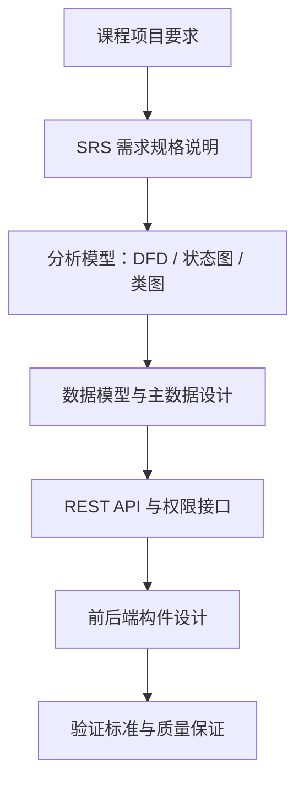

- 需求从课程项目要求和 SRS 文档中抽取
- 分析模型用于明确数据流、状态变化和对象职责
- 数据模型和接口设计保证六个子系统可以协作实现
- 验证标准用于支撑后续开发、测试和验收

> 讲稿：我们的设计主线是从需求出发，先形成 SRS，再抽取数据流图、状态图和类图，之后落到数据库、接口和前后端构件。这样可以保证每个模块不是凭经验直接写页面，而是能从需求追踪到实现和验证。

---

# 项目范围：六个教学服务子系统

STSS 面向高校教学场景，基于校园网络和信息化平台，为教学管理、教学互动、在线评价和成绩分析提供统一服务。系统由 6 个子系统组成：

| 编号 | 子系统 | 核心职责 |
| --- | --- | --- |
| A | 基础信息管理（Information Management） | 用户、权限、课程、组织、培养方案基础数据 |
| B | 自动排课（Automatic Course Arrangement） | 教室资源、自动排课、手动调课、课表输出 |
| C | 智能选课（Smart Course Selection） | 选课约束、选课退选、AI 辅助选课 |
| D | 论坛交流（Discussion Forum） | 公告、发帖、回帖、附件、检索与统计 |
| E | 在线测试（Online Testing） | 题库、组卷、答题、评分、测试统计 |
| F | 成绩管理（Score Management） | 成绩录入、修改控制、查询、分析、GPA |

> 讲稿：STSS 覆盖高校教学活动的完整链路。A 模块提供统一主数据，B 形成课表，C 支持学生选课，D 支持课程交流，E 支持过程性测试，F 负责正式成绩和成绩分析。后续所有设计都围绕这六个模块之间的数据连续性展开。

---

# 系统上下文：角色与子系统边界

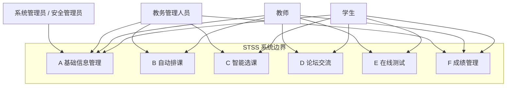

> 讲稿：从系统上下文看，学生、教师、教务管理人员和系统管理员分别访问不同子系统。A 模块承担统一身份和权限入口，其他模块围绕教学活动展开。内部模块之间的数据依赖会在下一页单独说明，避免把访问边界和数据流混在一起。

---

# 总体技术架构

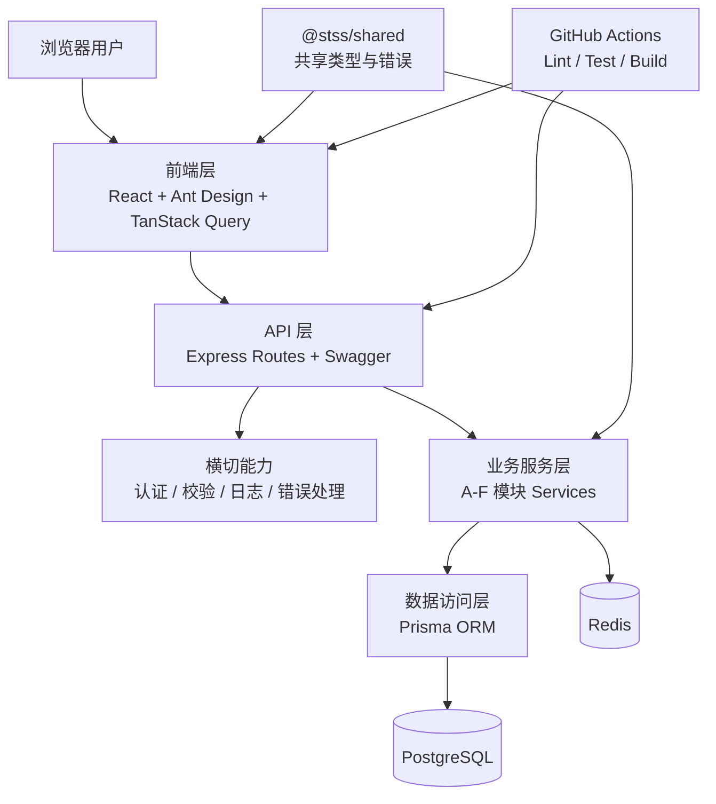

> 讲稿：总体架构按层次拆分：前端层负责交互和状态管理，API 层负责路由和接口文档，横切能力统一处理认证、校验、日志和错误，业务服务层承载 A-F 模块逻辑，数据访问层通过 Prisma 访问 PostgreSQL。共享包和 CI 保证前后端类型口径和质量门禁一致。

---

# 跨子系统数据主线

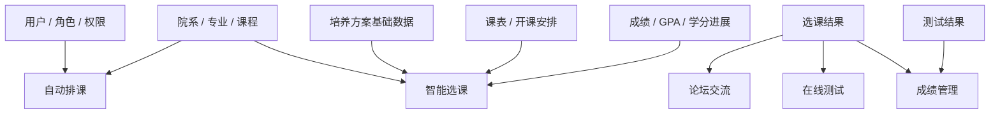

- 用户、权限、课程和培养方案基础数据由 A 模块定义，其他模块复用
- 开课安排来自 B，选课结果来自 C，正式成绩归口 F
- E 的测试结果可以作为 F 成绩分析的辅助输入

> 讲稿：这页强调跨系统一致性。用户、角色、课程、专业和培养方案基础数据不能在每个子系统里各自定义，否则后续实现会出现口径冲突。我们的设计原则是：A 管主数据，B 产生课表，C 基于培养方案约束产生选课记录，E 产生测试结果，F 管正式成绩。

---

# 需求到设计的追踪关系

| 设计对象 | 依据 | 在系统设计中的作用 |
| --- | --- | --- |
| 需求边界 | 课程项目要求 + SRS | 明确每个子系统负责什么、不负责什么 |
| UML / 分析模型 | SRS 第 3-9 章 | 描述数据流、状态变化和对象职责 |
| 数据设计 | `docs/database-design.md` + Prisma Schema | 固化核心实体、字段、关系和约束 |
| 接口设计 | `docs/apis/` + 代码路由 | 定义前后端和跨模块交互方式 |
| 构件设计 | 当前前后端源码结构 | 明确页面、路由、服务、数据访问层拆分 |
| 验证设计 | SRS Validation Criteria + 测试代码 | 将需求落实到可检查的验收标准 |

> 讲稿：需求如果只停留在文字层面，很难保证实现一致。因此我们把需求边界、分析模型、数据结构、接口和构件拆分放在同一条追踪链路中。后续实现时，可以从任意一个功能需求追踪到相关实体、接口、代码构件和验证标准。

---

# A 模块：基础信息管理（Information Management）

## 基础信息管理组的定位

- 为 STSS 提供统一账号、角色、权限和组织基础
- 为 B-F 提供用户、教师、学生、课程、培养方案基础数据等主数据
- 负责认证、密码安全、令牌刷新、系统日志与审计
- 当前代码实现集中在 A 模块，可作为后续模块的工程参考实现
- 因其直接支撑 B-F 的身份、权限和主数据访问，本报告对 A 模块展开更完整的设计说明

> 讲稿：A 模块是整个 STSS 的基础设施模块。其他模块要做排课、选课、论坛、测试和成绩，都需要先知道用户是谁、有什么角色、能访问哪些数据，以及课程和培养方案如何定义。因此 A 模块的设计质量直接影响后续所有模块，我们也会对它展开更完整的设计说明。

---

# A 模块需求边界与角色

| 角色 | 主要能力 | 权限边界 |
| --- | --- | --- |
| 学生 | 登录、维护个人资料、修改密码 | 只能访问本人资料与本人相关业务 |
| 教师 | 登录、维护个人资料、作为课程负责人被引用 | 访问本人资料与所授课程相关业务 |
| 教务管理人员 | 用户管理、院系专业、课程与培养方案基础维护 | 按业务权限管理教学主数据 |
| 系统管理员 | 角色权限、账号状态、安全策略 | 具备最高管理权限 |
| 安全管理员 | 日志查询、安全审计 | 关注系统安全与操作追踪 |

- 范围内：认证、用户、角色权限、院系专业、课程、培养方案、安全审计
- 范围外：各业务模块自己的排课、选课、发帖、测试、成绩规则

> 讲稿：A 模块的边界是主数据和安全能力，不直接实现排课算法或成绩统计。这样切分以后，其他组只需要依赖 A 模块提供的统一身份、权限和课程数据，不需要重复实现用户体系。

---

# A 模块核心流程：认证与访问控制

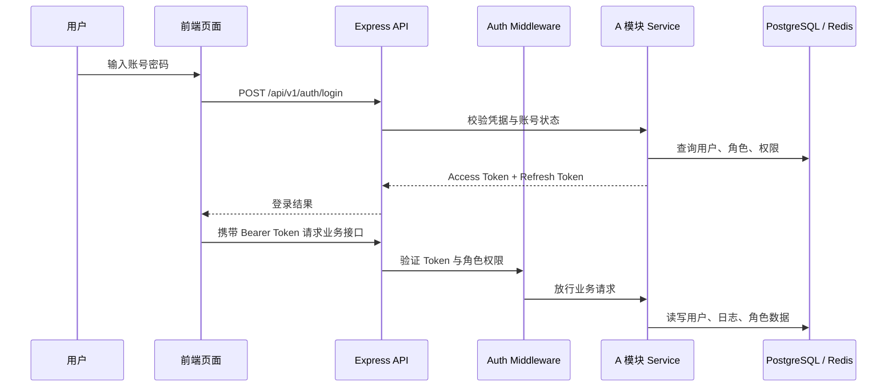

> 讲稿：认证链路体现了 A 模块的核心设计。登录时后端不仅验证密码，还会返回用户角色和权限。后续请求都通过 Bearer Token 进入认证中间件，再按角色或本人权限控制访问。这样可以避免只依赖前端隐藏按钮带来的越权风险。

---

# A 模块数据流图

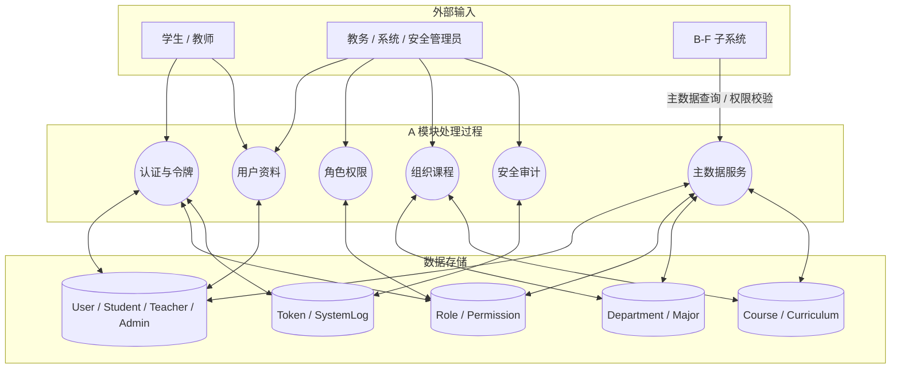

> 讲稿：这张 DFD 展示 A 模块内部的数据处理。用户和管理员通过不同处理过程读写数据；B-F 子系统不直接访问 A 的数据存储，而是通过主数据服务和权限校验接口获取需要的数据。所有关键操作都会进入 Token 和 SystemLog 相关存储，支撑后续审计。

---

# A 模块领域模型

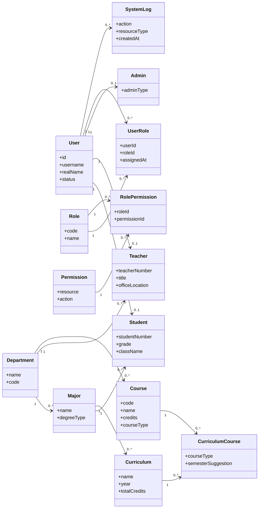

> 讲稿：领域模型分成三类：身份与权限、组织与课程、安全审计。User 是统一账号入口，Student、Teacher 和 Admin 是不同角色的扩展信息；UserRole 和 RolePermission 显式表达 RBAC 的多对多关系；CurriculumCourse 表达培养方案和课程之间的组成关系，避免把复杂关联简化成直接字段。

---

# A 模块接口设计

| 能力 | 已设计 / 已实现的接口方向 | 权限控制 |
| --- | --- | --- |
| 认证 | `POST /api/v1/auth/login`、`refresh`、`logout`、`me` | 登录用户 |
| 注册与激活 | `register`、`activate` | 公开入口 + Token 校验 |
| 密码管理 | `forgot`、`reset`、`change-password` | 本人或有效重置令牌 |
| 用户管理 | `GET/POST/PUT/DELETE /api/v1/users` | `admin` / `super_admin` |
| 批量操作 | `POST /users/batch`、`PATCH /users/batch/status` | 管理员 |
| 角色权限 | `/users/roles`、`/:id/roles`、`/:id/permissions` | 管理员或本人 |
| 日志审计 | `GET /api/v1/users/logs` | `admin` / `super_admin` |
| 院系查询 | `GET /api/v1/departments`、`/:id` | 登录用户 |

> 讲稿：接口设计遵循 REST 风格，以 `/api/v1` 为统一前缀，并通过中间件实现认证、角色检查和请求校验。当前代码中 A 模块已经具备认证、用户管理、角色权限查询、日志查询和院系查询接口；院系专业的完整 CRUD、课程基础信息和培养方案管理属于后续扩展范围。

---

# A 模块构件设计

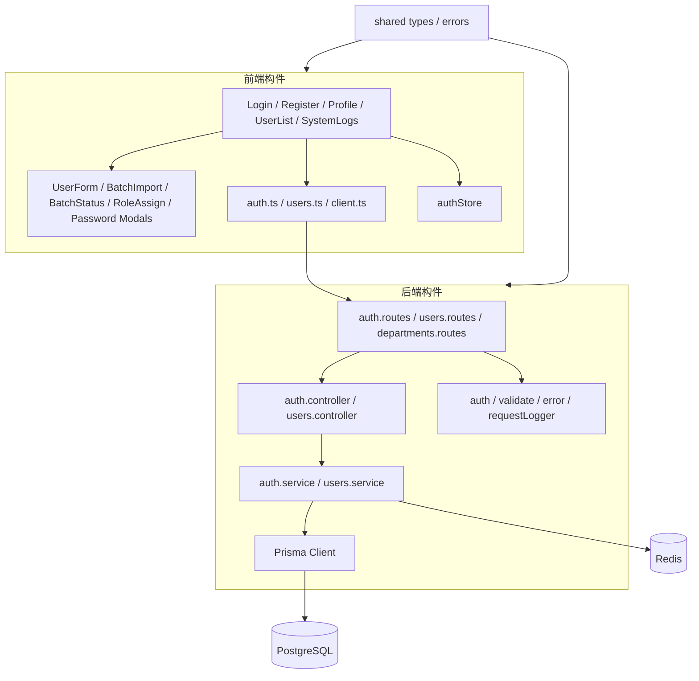

> 讲稿：A 模块的构件拆分已经比较清晰。前端以页面和弹窗组织用户操作，通过 API client 与后端交互；后端按 routes、controller、service、middleware 分层，Prisma 负责数据库访问，Redis 支撑登录安全和缓存类能力。这个结构也可以为 B-F 模块提供一致的工程实现参考。

---

# A 模块状态设计与安全策略

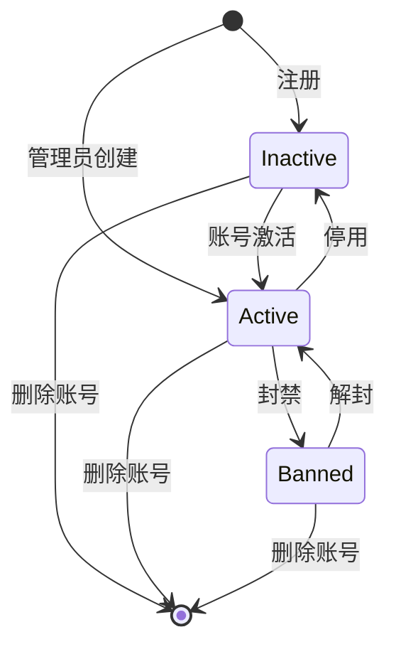

- 密码不明文存储，使用哈希校验
- Refresh Token 哈希存储并采用轮换机制
- 密码修改、重置、角色变更后应吊销相关会话
- 删除用户时先吊销 Refresh Token，再删除用户记录和关联角色
- 关键操作进入 SystemLog，避免日志记录明文密码或令牌

> 讲稿：账号状态图对应用户生命周期。Inactive 不能登录，Active 可以按权限访问，Banned 或停用状态不能继续认证。删除不是当前状态枚举的一部分，而是管理操作：先吊销该用户的刷新令牌，再删除用户记录和相关角色关联。安全策略上，重点是密码哈希、刷新令牌轮换、会话吊销和审计日志。

---

# A 模块设计模式与质量保证

| 设计点 | 采用方式 | 价值 |
| --- | --- | --- |
| 分层架构 | Route → Controller → Service → Prisma | 降低接口、业务、数据访问耦合 |
| RBAC | Role + Permission + middleware | 统一处理多角色权限边界 |
| DTO / Schema Validation | Zod schema + validate middleware | 请求进入业务前完成结构校验 |
| Token Rotation | Access + Refresh 双 Token | 降低长期令牌泄露风险 |
| Audit Logging | SystemLog | 支持用户、权限、安全操作追踪 |
| 统一错误处理 | Shared errors + error middleware | 保持 API 错误响应一致 |

> 讲稿：A 模块不是把逻辑全部写在路由里，而是用分层架构组织代码；权限通过 RBAC 和中间件统一处理；输入校验、令牌轮换、审计日志和统一错误处理共同保证系统可维护、可测试、可追踪。

---

# A 模块实现范围与演示素材

| 类别 | 当前实现与设计范围 |
| --- | --- |
| 后端已实现范围 | 认证、用户 CRUD、批量创建、状态更新、角色分配、权限查询、系统日志、院系查询 |
| 前端已实现范围 | 登录、注册、忘记密码、重置密码、个人资料、用户列表、系统日志、批量操作、角色分配弹窗 |
| 数据库 | Prisma Schema 已覆盖 A-F 核心实体；A 模块实体与令牌/日志模型完整 |
| 测试 | 后端 A 模块包含 auth/users 的单元测试和集成测试；前端包含 authStore 测试 |
| 后续扩展范围 | 院系专业完整 CRUD、课程基础信息管理、培养方案管理、角色权限独立页面 |

[图片占位：A 模块登录页截图]
[图片占位：A 模块用户列表与批量操作截图]
[图片占位：A 模块系统日志或 Swagger API 文档截图]

> 讲稿：A 模块当前实现范围集中在认证、用户管理、角色权限查询、日志审计和部分组织查询能力，前端也有对应页面和弹窗。课程基础信息、培养方案管理和完整角色权限页面会作为后续扩展方向继续推进。演示时可以展示登录页、用户列表、系统日志或 Swagger API 文档。

---

# B-F 子系统设计概览

| 模块 | 核心输入 | 核心处理 | 核心输出 |
| --- | --- | --- | --- |
| B 自动排课 | 课程、教师、教室、时间约束 | 自动排课、冲突检测、手动调课 | 课表与教室安排 |
| C 智能选课 | 培养方案基础数据、开课安排、课程容量 | 课程检索、选课退选、AI 辅助建议 | 选课结果与学生课表 |
| D 论坛交流 | 课程开设、用户身份、选课范围 | 公告、帖子、评论、附件、检索 | 课程讨论内容与统计 |
| E 在线测试 | 课程、题库、试卷配置 | 组卷、答题、自动评分、统计 | 测试结果与统计分析 |
| F 成绩管理 | 选课记录、测试结果、教师录入 | 成绩录入、修改控制、统计分析 | 正式成绩、GPA、学分进展 |

- B-F 模块共享 A 模块提供的用户、角色、权限和课程基础数据
- 各模块的输出继续作为后续模块的输入，形成教学业务闭环
- 每个模块都需要同时定义业务流程、核心对象、接口边界和验证方式

> 讲稿：B 到 F 是围绕教学过程逐步展开的业务模块。B 产生课表，C 基于课表和培养方案产生选课结果，D 和 E 围绕课程开展交流和测试，F 最后沉淀正式成绩和成绩分析。它们的共同基础是 A 模块提供的统一主数据。

---

# B 模块：自动排课（Automatic Course Arrangement）

## 自动排课设计要点

- 需求边界：教学资源管理、自动排课、手动调课、课表查询与打印
- 核心对象：Classroom、CourseOffering、Schedule、Teacher、Course
- 关键约束：教师时间不冲突、教室时间不冲突、容量与用途匹配、排课结果尽可能人性化
- 接口设计：教室资源 CRUD、排课任务创建、冲突检测、手动调整、课表查询/导出

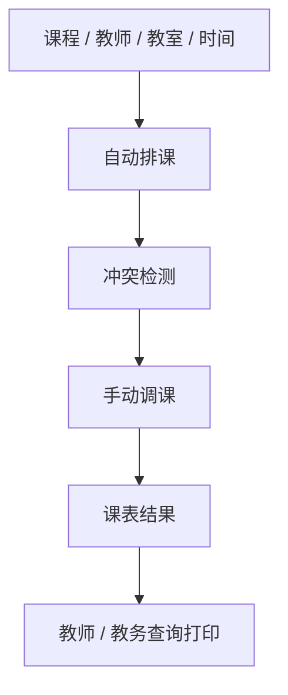

[图片占位：B 组排课任务页面、课表页面或排课算法流程截图]

> 讲稿：B 模块的核心是把课程、教师、教室和时间约束转化为可检查的排课结果。设计重点是冲突检测，包括教师时间冲突、教室占用冲突和容量用途匹配。自动排课结果还需要支持人工调整，并在调整过程中继续提示冲突。

---

# C 模块：智能选课（Smart Course Selection）

## 智能选课设计要点

- 需求边界：培养方案约束使用、课程搜索、选课退选、结果查询、选课管理、AI 辅助
- 核心对象：Curriculum、Course、CourseOffering、SelectionPeriod、Enrollment
- 关键约束：课程容量、时间冲突、培养方案、至少 200 名在线用户并发服务
- 接口设计：课程检索、可选课程列表、选课、退选、选课结果、AI 推荐/解释

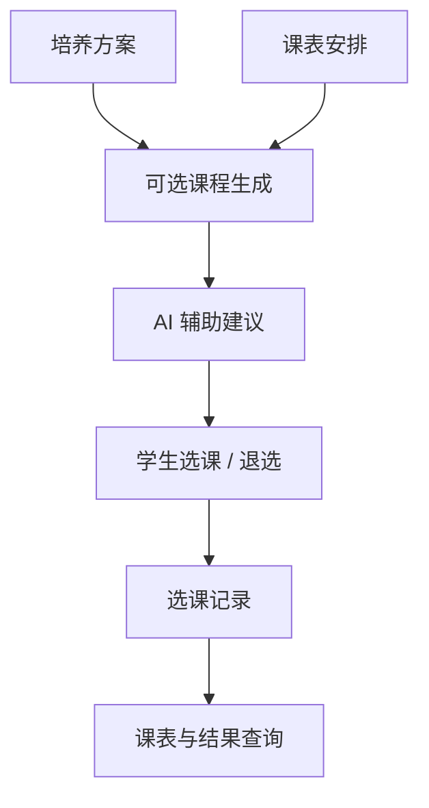

[图片占位：C 组课程列表、AI 推荐、我的选课页面截图]

> 讲稿：C 模块要突出“智能”和“约束”两个关键词。选课不是简单点按钮，而是要综合培养方案、容量、时间冲突和学生已修情况。AI 能力建议定位为辅助建议和解释，不应替代系统约束校验。

---

# D 模块：论坛交流（Discussion Forum）

## 论坛交流设计要点

- 需求边界：论坛公告、发帖、回帖留言、附件、文章统计、全文检索
- 核心对象：ForumPost、ForumComment、ForumAttachment、User、CourseOffering
- 关键约束：帖子状态、评论层级、附件管理、课程范围内交流
- 接口设计：帖子列表、发帖、评论、附件上传、全文检索、热门统计

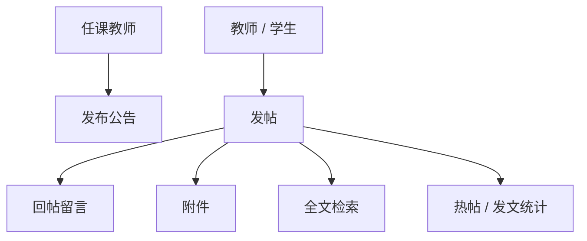

[图片占位：D 组论坛首页、帖子详情、附件上传或检索页面截图]

> 讲稿：D 模块的设计重点是围绕课程实例建立交流空间。需要说明帖子、评论和附件的关系，以及如何支持公告、检索和统计。后续如果有权限控制，也要说明教师、学生和管理员能做的操作边界。

---

# E 模块：在线测试（Online Testing）

## 在线测试设计要点

- 需求边界：题库管理、组卷、学生答题、自动评分、成绩统计
- 核心对象：QuestionBank、Question、QuestionOption、TestPaper、TestResult、Answer
- 关键约束：测试时间、提交状态、中途退出无效、评分规则、统计维度
- 接口设计：题库 CRUD、组卷、发布试卷、开始答题、提交评分、统计查询

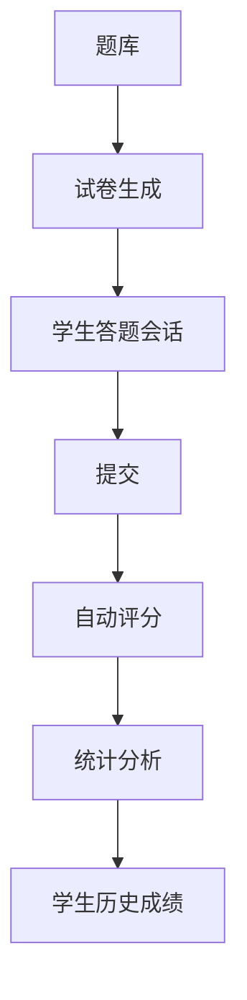

[图片占位：E 组题库页面、组卷页面、在线答题页面、统计图截图]

> 讲稿：E 模块需要讲清楚题库到试卷、试卷到答题会话、答题到评分统计的状态变化。尤其是测试开始计时、中途退出和提交后评分，这些都适合用状态图说明。

---

# F 模块：成绩管理（Score Management）

## 成绩管理设计要点

- 需求边界：任课教师成绩录入、学生成绩查询、成绩修改控制、成绩分析
- 核心对象：Enrollment、Score、ScoreModificationLog、GPARecord、CourseOffering
- 关键约束：初次录入后再次修改需要管理流程，成绩分析包含课程与个人两个维度
- 接口设计：成绩录入、修改申请/审批、学生查询、课程统计、GPA/学分进展

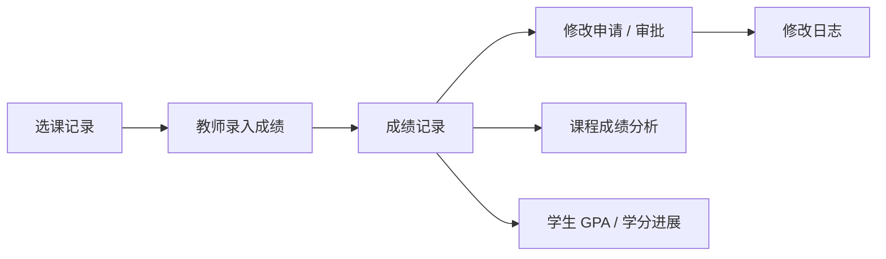

[图片占位：F 组成绩录入、学生成绩查询、成绩分析图表截图]

> 讲稿：F 模块是整个教学闭环的收口。它基于选课记录产生正式成绩，并提供修改控制和分析能力。设计上要特别说明成绩修改日志和审批控制，避免成绩数据被随意覆盖。

---

# 跨系统接口与集成契约

| 提供方 | 消费方 | 共享数据 / 契约 |
| --- | --- | --- |
| A | B-F | 用户、角色、权限、课程、院系、专业、培养方案基础数据 |
| B | C、教师、教务 | 开课安排、教室时间、课表结果 |
| C | D、E、F | 学生选课结果、课程参与范围 |
| E | F | 测试成绩、统计结果、过程性评价数据 |
| F | C、学生 | 学分进展、GPA、已获得成绩 |
| Shared | 前端、后端 | 通用类型、错误、枚举、响应结构 |

- 跨模块共享对象必须使用统一字段和状态枚举
- 所有受保护接口必须走认证中间件
- 接口变更需同步 API 文档、共享类型、前端 client 和测试

> 讲稿：最后回到整体架构。跨系统集成的关键不是每个模块各写各的，而是把数据契约稳定下来。A 提供主数据，B 提供课表，C 提供选课，E 提供测试结果，F 提供成绩。接口变更必须同步文档、类型、前端 client 和测试。

---

# 质量保证措施

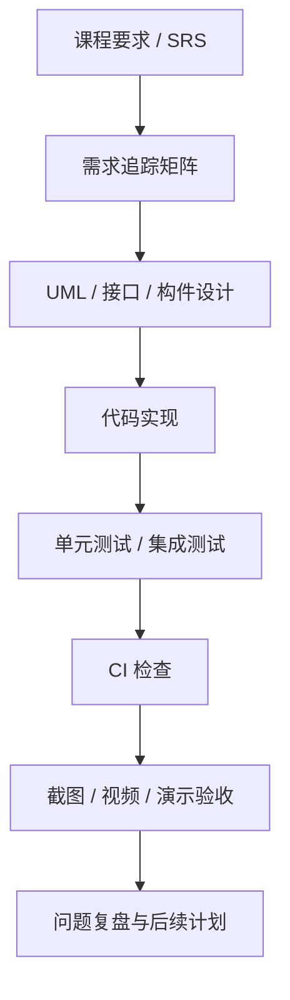

| 层级 | 措施 |
| --- | --- |
| 需求 | SRS 编号、用户场景、Validation Criteria |
| 设计 | DFD、状态图、类图、CRC、接口表、构件图 |
| 实现 | TypeScript、Zod 校验、Prisma Schema、统一错误处理 |
| 代码检查 | Lint、Typecheck、Build 作为基础质量门禁 |
| 测试 | 单元测试、集成测试、关键业务流程测试 |
| 接口一致性 | API 文档、共享类型、前端 API client 同步更新 |
| 交付验证 | 关键流程演示、截图或视频、测试报告 |

> 讲稿：质量保证从需求开始，而不是最后才测试。我们的链路是：需求编号对应设计图和接口，设计再对应代码实现，最后用测试和演示素材验证。基础门槛包括 lint、typecheck、build、单元测试、集成测试和 API 文档一致性检查；当前 A 模块已经具备 auth/users 相关测试基础。

---

# 团队协作与过程管理

| 协作对象 | 主要责任 | 协作接口 |
| --- | --- | --- |
| 基础信息管理 | 统一身份、权限、课程与培养方案基础数据 | 向 B-F 提供用户、角色、课程、培养方案基础数据 |
| 自动排课 | 教室资源、排课、调课、课表输出 | 消费 A 的课程/教师数据，向 C 输出课表 |
| 智能选课 | 培养方案约束、课程检索、选课退选、AI 辅助 | 消费 A/B 数据，向 D/E/F 输出选课结果 |
| 论坛交流 | 公告、帖子、评论、附件、检索统计 | 消费课程和选课范围，服务教学互动 |
| 在线测试 | 题库、组卷、答题、评分统计 | 消费课程和学生名单，向 F 提供测试结果 |
| 成绩管理 | 成绩录入、修改控制、查询分析 | 消费选课和测试数据，输出成绩和学分进展 |

[图片占位：项目会议记录截图或周会纪要列表]
[图片占位：任务看板、分支或 PR 进度截图]

> 讲稿：协作方式上，我们按六个子系统拆分责任，同时通过共享数据和接口契约保证集成。每个模块都有自己的业务边界，也都有明确的上游和下游。过程管理上，我们会用会议记录、任务看板和分支记录来说明任务推进情况。

---

# 后续迭代安排

| 阶段 | 目标 | 交付物 |
| --- | --- | --- |
| 设计细化与一致性校准 | 更新模块 UML、接口契约和关键构件说明 | 模块设计图、接口表、演示截图 |
| 接口联调 | 固化跨模块契约 | API 文档、共享类型、Mock 或真实接口 |
| 功能实现 | 各模块按 SRS 验证标准推进 | 前后端功能、数据库迁移、测试 |
| 集成测试 | 验证主业务链路 | 用户 → 排课 → 选课 → 测试 → 成绩 |
| 最终交付 | 完成演示和验收材料 | 演示视频/截图、测试报告、部署说明 |

> 讲稿：后续安排围绕三个目标推进：先把设计讲清楚，再把接口契约稳定下来，最后按 SRS 的验证标准实现和测试。最终演示不只展示单点页面，而要展示用户、排课、选课、测试、成绩之间的完整业务链路。

---

# 总结：本次设计的三个核心结论

1. STSS 是六个子系统协同的教学服务平台，不是六个孤立功能页面。
2. A 模块是统一身份、权限和主数据基础，决定 B-F 的集成质量。
3. 系统设计可以从需求追踪到 UML、接口、构件、测试和演示材料。

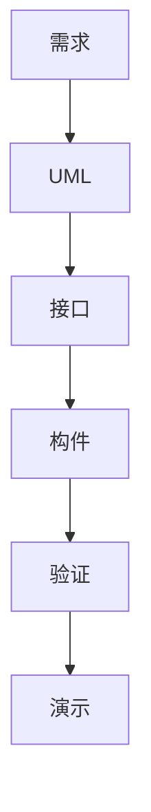

> 讲稿：总结一下，我们的设计重点有三个。第一，系统是六个子系统的协同链路；第二，A 模块提供统一身份和主数据，是集成基础；第三，设计不是停留在图上，而要能继续追踪到接口、构件、测试和演示。后续实现会围绕这条链路推进，保证系统能够形成完整的教学服务闭环。
