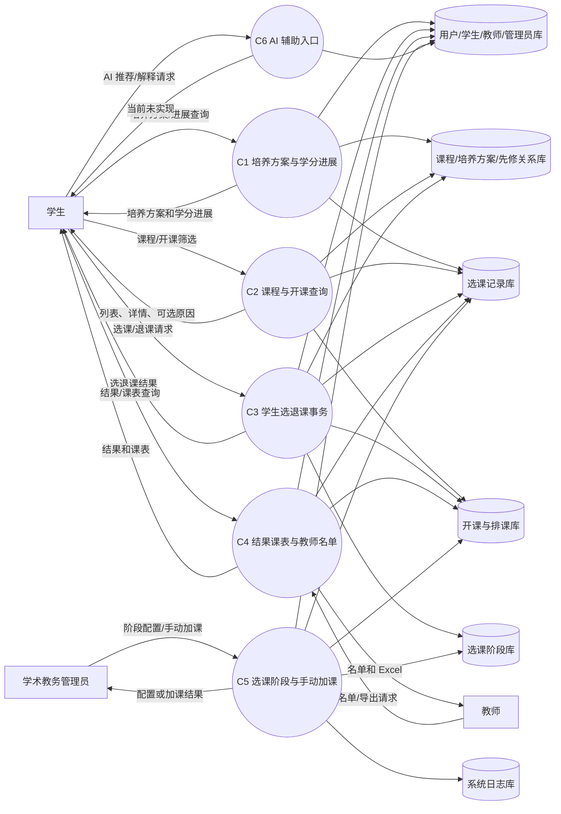
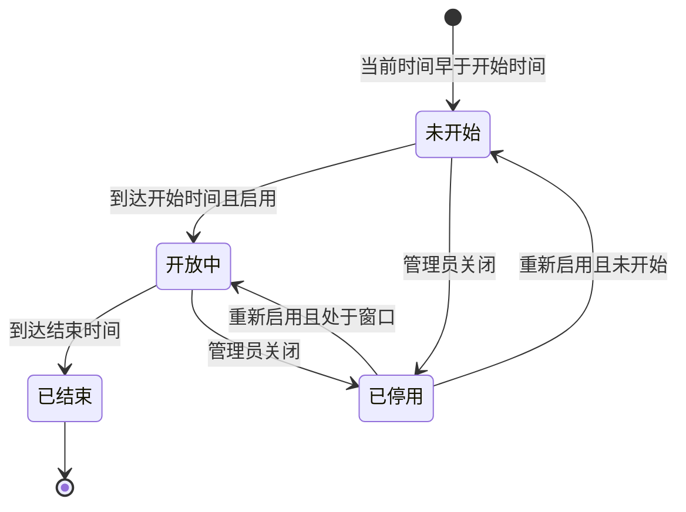
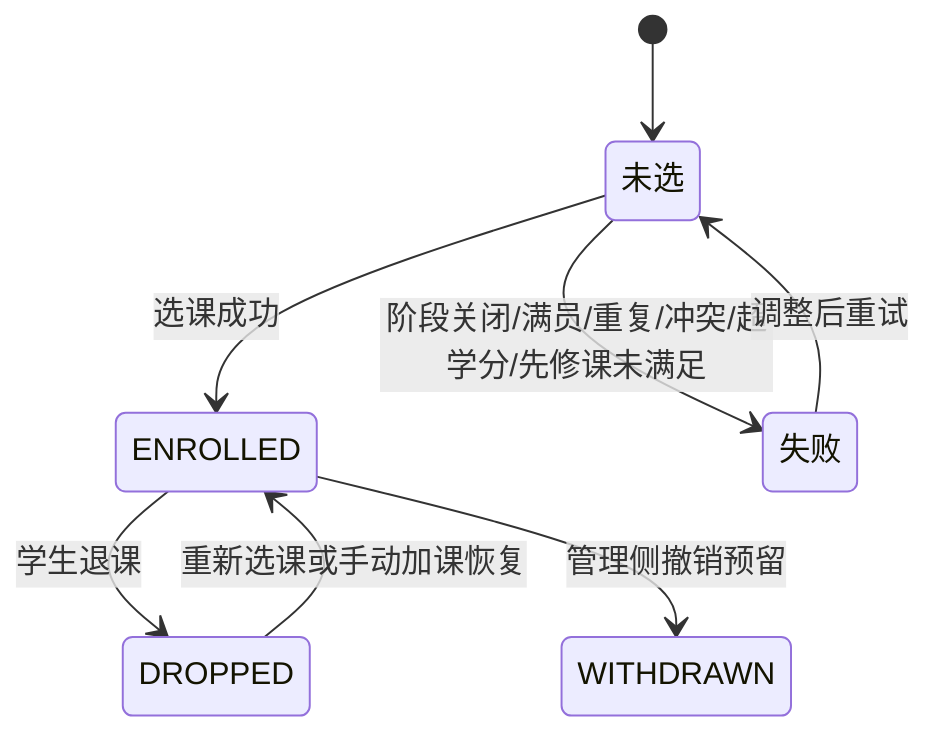
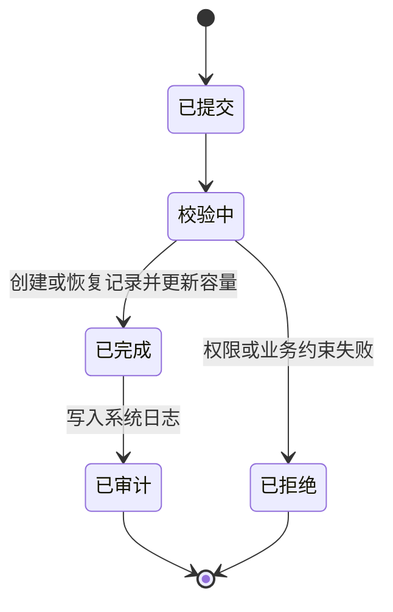
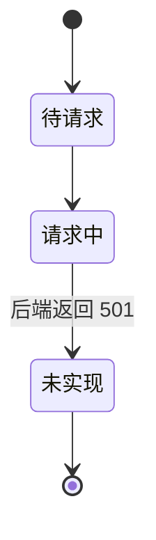
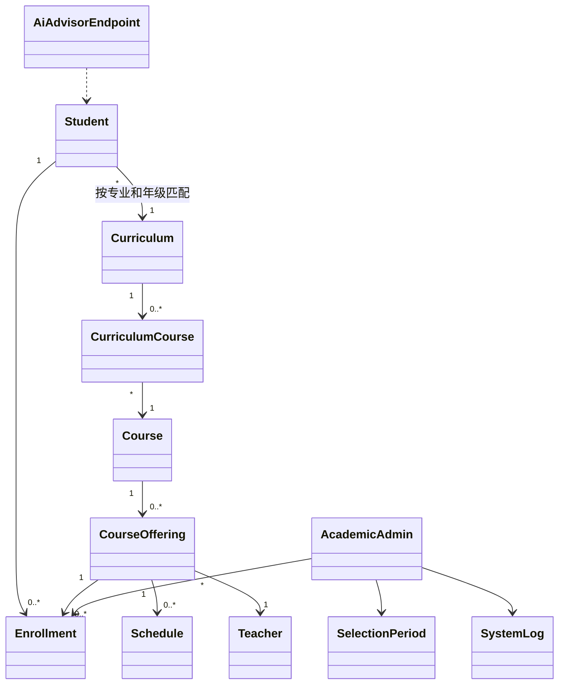

# C 组智能选课需求报告

> 本文只覆盖 C 组“智能选课”子系统，并严格按当前代码实现和可见测试描述需求口径。AI 推荐后端、Redis 连接控制、先修课成绩通过判断、培养方案确认持久化和 200 在线用户压测均未在当前实现中完成，本文不将其写成已实现能力。

## 0. 当前实现依据

| 类别 | 当前依据 |
|---|---|
| 后端模块 | `backend/src/modules/course-selection` |
| 后端路由 | `/api/v1/course-selection` |
| 前端模块 | `frontend/src/modules/course-selection` |
| 核心数据模型 | `Student`、`Teacher`、`Admin`、`Course`、`CourseOffering`、`Schedule`、`Curriculum`、`CurriculumCourse`、`Enrollment`、`SelectionPeriod`、`SystemLog` |
| 关键测试 | `backend/src/__tests__/modules/course-selection/*`、`frontend/src/modules/course-selection/**/*.test.*` |
| 当前未实现项 | `ai-advisor.service` 推荐和解释返回空，控制器返回 501；Redis 连接控制和无操作释放为 TODO |

### 0.1 当前能力状态

| 能力域 | 当前状态 | 说明 |
|---|---|---|
| 培养方案与学分进展 | 已实现，存在限制 | 可按当前学生查询培养方案和进展；公共课最低要求未完整建模，培养方案确认未持久化 |
| 课程与开课查询 | 已实现 | 支持课程目录、开课列表、可选课程和开课详情 |
| 学生选退课 | 已实现，存在限制 | 选课事务包含容量、重复、时间冲突、最大学分等校验；存在先修课时因未接入成绩通过判断会阻断 |
| 选课结果与课表 | 已实现 | 可查询本人选课结果和课表，课表只展示有效已选课程 |
| 教师名单与导出 | 已实现 | 后端校验教师只能访问本人开课名单 |
| 选课阶段和手动加课 | 已实现基础能力 | 要求学术教务管理员，阶段管理和手动加课写系统日志 |
| AI 辅助选课 | 未实现 | 前端入口和接口预留存在，后端返回 501，不产生推荐和选课副作用 |
| 高峰连接控制 | 未实现 | Redis 连接控制、心跳和无操作释放仍为 TODO |

## 1. 系统范围

### 1.1 包含范围

| 编号 | 范围 | 当前实现说明 |
|---|---|---|
| C-S-01 | 学生培养方案查看 | 学生可查看本人专业和年级匹配的培养方案、课程分组和建议修读学期 |
| C-S-02 | 学分进展统计 | 系统基于本人 `ENROLLED` 选课记录和课程学分统计进展 |
| C-S-03 | 课程与开课查询 | 支持按关键词、教师、课程类型、开课状态等查询课程、开课、可选课程和详情 |
| C-S-04 | 选课事务 | 后端在事务中校验选课阶段、容量、重复选课、时间冲突、最大学分、培养方案归属和先修课 |
| C-S-05 | 退课事务 | 学生可退选本人记录；当前只允许第二轮和调整阶段退课 |
| C-S-06 | 选课结果与课表 | 学生可查询本人选课记录、汇总和课表，并使用前端打印样式 |
| C-S-07 | 教师名单与导出 | 教师可查询和导出本人开课学生名单 |
| C-S-08 | 选课阶段管理 | 学术教务管理员可查询、创建和更新选课阶段 |
| C-S-09 | 教务手动加课 | 学术教务管理员可填写原因并为学生手动加课，成功后写入系统日志 |
| C-S-10 | AI 辅助入口 | 仅保留前端入口和后端接口契约，当前返回未实现 |

### 1.2 不包含范围

| 编号 | 不包含内容 | 当前状态 |
|---|---|---|
| C-O-01 | 真实 AI 推荐算法 | 后端未实现 |
| C-O-02 | AI 自动代替学生选课 | 当前不存在 AI 写入 `Enrollment` 的路径 |
| C-O-03 | Redis 连接控制和空闲强制释放 | TODO，未实现 |
| C-O-04 | 成绩驱动的先修课通过判断 | 未接入 F 组成绩数据 |
| C-O-05 | 培养方案确认持久化 | 当前确认状态为非持久化返回 |

### 1.3 对外契约

| 契约类别 | 契约说明 |
|---|---|
| API 契约 | C 组接口统一挂载在 `/api/v1/course-selection` |
| 字段契约 | 外部请求字段使用 `snake_case`；后端 schema 转换为服务层 camelCase |
| 学生身份契约 | 学生端接口使用当前认证上下文识别学生，不接受前端传入 `student_id` |
| 教师权限契约 | 教师名单和导出必须校验目标开课归属当前教师 |
| 教务权限契约 | 阶段管理和手动加课要求管理员角色，并确认 `Admin.adminType = ACADEMIC` |
| 事务契约 | 选课和手动加课必须在后端事务中完成容量校验、记录写入和容量更新 |
| 审计契约 | 阶段配置和教务手动加课写入 `SystemLog` |

## 2. 用户场景

### 2.1 UC-C-01 学生查看培养方案与学分进展

| 项目 | 内容 |
|---|---|
| 主参与者 | 学生 |
| 目标 | 查看本人培养方案、课程分组、建议修读学期和当前学分进展 |
| 前置条件 | 学生已登录；存在学生档案；学生绑定专业和年级；存在匹配培养方案 |
| 主流程 | 学生进入培养方案页，系统按当前用户查找学生档案，返回培养方案、课程分组和本人已选学分进展 |
| 异常流程 | 无学生档案、无专业或年级、无匹配培养方案、重复培养方案、公共课最低要求未建模 |
| 后置条件 | 查询不修改选课数据 |
| 关联需求 | FR-C-01、FR-C-02 |

### 2.2 UC-C-02 学生搜索课程并查看开课详情

| 项目 | 内容 |
|---|---|
| 主参与者 | 学生 |
| 目标 | 搜索课程和开课，查看容量、已选人数、时间地点、先修课和可选性 |
| 前置条件 | 学生已登录；存在课程、开课、教师、学期和排课数据 |
| 主流程 | 学生按关键词、教师、课程类型、状态等筛选课程或开课，查看详情和可选原因 |
| 异常流程 | 无匹配结果、开课不存在、课程归档、开课未开放、容量已满、时间冲突、不在培养方案内、先修课限制 |
| 后置条件 | 查询不产生选课记录 |
| 关联需求 | FR-C-03、FR-C-04、FR-C-05 |

### 2.3 UC-C-03 学生选课

| 项目 | 内容 |
|---|---|
| 主参与者 | 学生 |
| 目标 | 在开放阶段选择符合规则的课程开设 |
| 前置条件 | 学生已登录；目标开课存在；当前服务器时间处于启用选课阶段；开课为 `OPEN`；课程为 `ACTIVE` |
| 主流程 | 学生确认选课后提交 `course_offering_id` 和可选 `client_request_id`；后端在事务中完成阶段、状态、重复、容量、时间冲突、最大学分、培养方案和先修课校验；成功后创建或恢复 `ENROLLED` 记录并更新容量 |
| 异常流程 | 阶段关闭、重复选课、满员、时间冲突、超学分、不在培养方案内、先修课未满足、并发冲突 |
| 后置条件 | 成功时记录和容量一致；失败时不产生部分写入 |
| 关联需求 | FR-C-06 |

### 2.4 UC-C-04 学生退课并查看结果课表

| 项目 | 内容 |
|---|---|
| 主参与者 | 学生 |
| 目标 | 在允许阶段退选本人课程，并查看选课结果和课表 |
| 前置条件 | 学生已登录；本人存在已选记录；当前处于允许退课阶段 |
| 主流程 | 学生确认退课，后端校验记录归属和阶段，更新为 `DROPPED` 并减少容量；学生查询本人选课结果和课表 |
| 异常流程 | 记录不存在、访问他人记录、阶段不允许退课、重复退课、并发更新失败 |
| 后置条件 | 退课成功后课表不再显示该课程 |
| 关联需求 | FR-C-07、FR-C-08、FR-C-09 |

### 2.5 UC-C-05 教师查询并导出课程名单

| 项目 | 内容 |
|---|---|
| 主参与者 | 教师 |
| 目标 | 查看并导出本人开课学生名单 |
| 前置条件 | 教师已登录；目标开课存在且属于当前教师 |
| 主流程 | 教师输入开课编号，按关键词和选课状态查询名单，或导出 Excel |
| 异常流程 | 开课不存在、访问非本人开课、名单为空、导出失败 |
| 后置条件 | 查询和导出不改变选课记录 |
| 关联需求 | FR-C-10、FR-C-11 |

### 2.6 UC-C-06 教务管理人员管理选课阶段并手动加课

| 项目 | 内容 |
|---|---|
| 主参与者 | 学术教务管理员 |
| 目标 | 配置选课阶段，并在特殊情况下手动为学生加课 |
| 前置条件 | 管理员已登录且 `Admin.adminType = ACADEMIC`；相关学期、学生和开课存在 |
| 主流程 | 管理员创建或更新阶段；系统校验时间和重叠；管理员填写学生、开课和原因手动加课；系统校验约束后写入选课记录、更新容量和系统日志 |
| 异常流程 | 非学术教务身份、时间范围非法、阶段重叠、学生或开课不存在、满员、重复、冲突、超学分、原因为空 |
| 后置条件 | 阶段配置或手动加课被保存，敏感操作可审计 |
| 关联需求 | FR-C-12、FR-C-13、FR-C-15 |

### 2.7 UC-C-07 学生访问 AI 辅助选课入口

| 项目 | 内容 |
|---|---|
| 主参与者 | 学生 |
| 目标 | 访问 AI 推荐页面；当前版本获得未实现提示 |
| 前置条件 | 学生已登录；前端页面可访问 |
| 主流程 | 前端请求推荐或解释接口；当前后端返回 501 未实现；前端展示不可用或失败状态 |
| 异常流程 | 后端不可用、参数非法、用户误认为已自动选课 |
| 后置条件 | 不生成 AI 推荐数据，不修改 `Enrollment` |
| 关联需求 | FR-C-14 |

## 3. 功能需求

| 编号 | 功能名称 | 需求描述 | 参与者 | 优先级 | 对应用例 |
|---|---|---|---|---|---|
| FR-C-01 | 本人培养方案查询 | 系统应根据当前登录学生绑定的专业和年级查询匹配培养方案，展示方案名称、总学分、必修/选修学分、课程分组和建议修读学期 | 学生 | 高 | UC-C-01 |
| FR-C-02 | 学分进展查询 | 系统应根据本人有效选课记录和课程学分统计已选课程数、已选学分和课程类型分组；公共课最低要求未建模时应明确提示 | 学生 | 中 | UC-C-01 |
| FR-C-03 | 课程目录搜索 | 系统应支持按关键词、课程代码、课程名称、教师、课程类型和课程状态查询课程目录 | 学生 | 高 | UC-C-02 |
| FR-C-04 | 开课列表与详情 | 系统应支持按学期、关键词、教师、课程类型、开课状态等查询开课，并查看课程、教师、容量、时间、先修课等详情 | 学生 | 高 | UC-C-02 |
| FR-C-05 | 可选课程判断 | 系统应返回已选、满员、时间冲突、课程或开课状态、培养方案归属和先修课限制等可选性原因 | 学生 | 高 | UC-C-02 |
| FR-C-06 | 学生选课事务 | 系统应在开放选课阶段内处理学生选课，并在事务中完成业务校验、选课记录写入和容量更新 | 学生、系统 | 高 | UC-C-03 |
| FR-C-07 | 学生退课事务 | 系统应允许学生在当前实现允许的阶段退选本人记录，将记录更新为 `DROPPED` 并同步扣减容量 | 学生、系统 | 高 | UC-C-04 |
| FR-C-08 | 本人选课结果查询 | 系统应支持学生分页查询本人选课记录并返回课程数、学分等汇总 | 学生 | 中 | UC-C-04 |
| FR-C-09 | 本人课表查询与打印 | 系统应支持学生查看本人有效已选课程课表，并提供前端打印视图 | 学生 | 中 | UC-C-04 |
| FR-C-10 | 教师课程名单查询 | 系统应支持教师分页查询本人开课学生名单，并在后端校验开课归属 | 教师 | 中 | UC-C-05 |
| FR-C-11 | 教师名单导出 | 系统应支持教师导出本人开课名单 Excel，导出前执行相同归属校验 | 教师 | 中 | UC-C-05 |
| FR-C-12 | 选课阶段管理 | 系统应支持学术教务管理员查询、创建和更新选课阶段，拒绝非法时间和重叠配置 | 学术教务管理员 | 高 | UC-C-06 |
| FR-C-13 | 教务手动加课 | 系统应支持学术教务管理员填写原因手动加课，并执行容量、重复、冲突和最大学分校验，成功后写日志 | 学术教务管理员 | 高 | UC-C-06 |
| FR-C-14 | AI 辅助选课接口预留 | 系统保留 AI 推荐和解释接口及前端入口，但当前后端应明确返回未实现状态且不得写入选课记录 | 学生 | 中 | UC-C-07 |
| FR-C-15 | 连接控制与空闲释放预留 | 高峰期连接控制、心跳和无操作释放是需求目标，但当前 Redis 控制未实现，应列为待完成项 | 学生、教务 | 中 | UC-C-06 |
| FR-C-16 | C 组统一接口契约 | C 组接口统一挂载 `/api/v1/course-selection`，外部字段使用 `snake_case`，学生身份以当前认证上下文为准 | 学生、教师、教务、系统 | 高 | UC-C-01～UC-C-06 |

## 4. 非功能需求

### 4.1 性能需求

| 编号 | 性能需求 | 验证方式 |
|---|---|---|
| NFR-C-P-01 | 课程、开课、可选课程、本人选课结果和教师名单查询应支持分页或筛选 | 分页与筛选接口测试 |
| NFR-C-P-02 | 学生选课和教务手动加课应在事务中完成容量校验和容量更新，避免并发超选 | 并发选课和容量一致性测试 |
| NFR-C-P-03 | 目标支持至少 200 名在线用户，但当前未附压测结果 | 后续容器环境压测报告 |
| NFR-C-P-04 | 教师名单导出应限定为指定开课和授权教师，不允许无约束导出全系统数据 | 导出范围测试 |

### 4.2 安全需求

| 编号 | 安全需求 | 验证方式 |
|---|---|---|
| NFR-C-S-01 | 学生端数据必须基于当前登录学生档案查询，不接受前端学生编号访问他人数据 | 本人数据越权测试 |
| NFR-C-S-02 | 学生选课和退课必须要求 `student` 角色，选课创建 schema 不接受 `student_id` | 角色权限与 schema 测试 |
| NFR-C-S-03 | 教师名单查询和导出必须要求 `teacher` 角色并校验开课归属 | 教师越权访问测试 |
| NFR-C-S-04 | 阶段管理和手动加课必须确认管理员类型为 `ACADEMIC` | 管理员类型边界测试 |
| NFR-C-S-05 | AI 辅助接口当前未实现时不得返回伪造推荐，不得写入 `Enrollment` | AI 无副作用测试 |
| NFR-C-S-06 | 阶段配置和手动加课等敏感教务操作应写入系统日志 | 审计日志测试 |

### 4.3 可用性需求

| 编号 | 可用性需求 | 验证方式 |
|---|---|---|
| NFR-C-U-01 | 培养方案页面应展示方案、课程分组、学分进展和限制提示 | 学生端页面验收 |
| NFR-C-U-02 | 课程选择页面应提供搜索筛选，并明确显示满员、冲突、已选、未开放等原因 | 课程列表交互验收 |
| NFR-C-U-03 | 选课、退课、手动加课应有确认和结果反馈，失败时展示后端业务错误 | 关键操作交互测试 |
| NFR-C-U-04 | AI 页面在后端未实现时应展示不可用或失败状态 | AI 页面异常态验收 |
| NFR-C-U-05 | 课表页面应支持学期查看和打印，并提示缺少排课时间的课程 | 课表与打印验收 |

### 4.4 可靠性与异常处理需求

| 编号 | 可靠性需求 | 验证方式 |
|---|---|---|
| NFR-C-R-01 | 选课阶段应按服务器时间判断，阶段关闭、未开始或已结束时拒绝写入 | 阶段时间边界测试 |
| NFR-C-R-02 | 重复提交同一选课请求不得生成多条有效记录，`client_request_id` 应用于幂等处理 | 重复提交测试 |
| NFR-C-R-03 | 退课应保证记录状态和开课容量一致，失败时不得只更新一方 | 退课事务一致性测试 |
| NFR-C-R-04 | 手动加课不得绕过容量、重复、时间冲突和最大学分限制 | 管理员路径一致性测试 |
| NFR-C-R-05 | 依赖数据缺失时应返回明确错误，前端不得显示误导性成功状态 | 依赖缺失与错误提示测试 |
| NFR-C-R-06 | 先修课通过判断未接入成绩模块时，应按当前实现明确阻断而不是默认放行 | 先修课限制测试 |

### 4.5 兼容性需求

| 编号 | 兼容性需求 | 验证方式 |
|---|---|---|
| NFR-C-C-01 | C 组前端主要面向现代桌面浏览器和常见笔记本分辨率 | 浏览器与页面布局检查 |
| NFR-C-C-02 | 课程列表、名单和阶段管理表格应保证关键操作可访问；移动端不是当前主要验收场景 | 响应式页面检查 |
| NFR-C-C-03 | 教师名单导出采用浏览器标准下载 Excel；课表打印采用浏览器打印能力 | 下载与打印验收 |

## 5. 数据流图与数据字典

### 5.1 C 组 1 层 DFD

### 5.2 数据字典

| 数据项 | 来源 | 去向 | 说明 |
|---|---|---|---|
| 学生档案 | A 子系统 | C1、C2、C3、C4 | 当前登录学生的专业、年级等身份数据 |
| 教师档案 | A 子系统 | C4 | 教师名单权限校验 |
| 学术教务管理员身份 | A 子系统 | C5 | 阶段管理和手动加课权限校验 |
| 课程信息 | A 子系统 | C1、C2、C3、C5 | 课程代码、名称、学分、类型、状态 |
| 课程先修关系 | A 子系统 | C2、C3 | 详情展示和选课限制 |
| 培养方案 | A 子系统 | C1、C2、C3 | 专业、年份、学分要求、方案课程 |
| 课程开设 | C 子系统 | C2、C3、C4、C5 | 学期、教师、容量、已选人数、开课状态 |
| 排课时间 | B/C 相关数据 | C2、C3、C4 | 时间地点、冲突检测和课表展示 |
| 选课阶段 | C 子系统 | C3、C5 | 阶段、时间窗口、最大学分、启用状态 |
| 选课记录 | C 子系统 | C1、C2、C3、C4、C5、F 子系统 | 学生与开课关系，状态为 `ENROLLED`、`DROPPED`、`WITHDRAWN` |
| 可选性原因 | C2 | 学生端课程页面 | 满员、已选、冲突、未开放、不在培养方案内等原因 |
| 手动加课请求 | 学术教务管理员 | C5 | 学生、开课、原因和可选通知标记 |
| 教师名单导出文件 | C4 | 教师 | 本人开课名单 Excel |
| AI 请求 | 学生 | C6 | 当前只返回未实现，不产生推荐数据 |
| 系统日志 | C5 | 审计查询 | 阶段配置和手动加课审计记录 |

## 6. 状态图

### 6.1 选课阶段状态

### 6.2 学生选课记录状态

### 6.3 教务手动加课状态

### 6.4 AI 辅助入口状态

## 7. 类图与 CRC

### 7.1 分析类图

### 7.2 CRC 卡

| 类 | 职责 | 协作者 |
|---|---|---|
| Student | 表示当前登录学生业务身份，提供专业和年级 | User、Curriculum、Enrollment |
| Course | 提供课程代码、名称、学分、课程类型、状态和先修关系 | CurriculumCourse、CourseOffering |
| Curriculum | 表示某专业某年份培养方案和学分要求 | Student、CurriculumCourse |
| CurriculumCourse | 表示课程在培养方案中的归属和建议学期 | Curriculum、Course |
| CourseOffering | 表示某学期开课教学班，维护教师、容量、已选人数和状态 | Course、Teacher、Schedule、Enrollment |
| Schedule | 表示开课时间地点，用于详情、课表和冲突检测 | CourseOffering |
| Enrollment | 表示学生选课关系，维护状态和幂等请求标识 | Student、CourseOffering、SelectionPeriod |
| SelectionPeriod | 表示选课阶段时间窗口、阶段类型、最大学分和启用状态 | Semester、AcademicAdmin |
| Teacher | 表示教师身份，用于名单权限校验 | CourseOffering、Enrollment |
| AcademicAdmin | 表示学术教务管理员，用于阶段配置和手动加课 | SelectionPeriod、Enrollment、SystemLog |
| SystemLog | 记录敏感教务操作 | AcademicAdmin、SelectionPeriod、Enrollment |
| AiAdvisorEndpoint | 接收 AI 请求并返回当前未实现状态 | Student |

## 8. 验证标准

| 需求编号 | 验证标准 | 输入/操作 | 预期结果 | 覆盖用例 |
|---|---|---|---|---|
| FR-C-01 | 学生只能查看本人匹配培养方案 | 学生访问培养方案接口 | 返回本人方案；异常档案返回明确错误 | UC-C-01 |
| FR-C-02 | 学分进展基于本人已选课程 | 构造不同类型已选课程后查询 | 返回学分和分组统计，公共课限制有提示 | UC-C-01 |
| FR-C-03 | 课程目录支持筛选和分页 | 按关键词、教师、类型查询 | 返回符合条件分页数据 | UC-C-02 |
| FR-C-04 | 开课详情包含容量、教师、学期、时间和先修课 | 查询开课详情 | 返回完整详情 | UC-C-02 |
| FR-C-05 | 可选课程返回不可选原因 | 构造满员、已选、冲突等场景 | 返回对应原因 | UC-C-02 |
| FR-C-06 | 选课成功时容量和记录一致 | 开放阶段选择合法开课 | 创建或恢复 `ENROLLED`，容量增加 | UC-C-03 |
| FR-C-06 | 重复选课不得生成多条有效记录 | 重复提交同一开课 | 返回已有结果或重复错误 | UC-C-03 |
| FR-C-06 | 满员课程不能继续选 | 已选人数达到容量后选课 | 选课失败，容量不增加 | UC-C-03 |
| FR-C-06 | 时间冲突课程不能选择 | 选择两门时间重叠课程 | 第二次失败并提示冲突 | UC-C-03 |
| FR-C-06 | 先修课未接入成绩通过判断时不能默认放行 | 选择存在先修课的开课 | 返回先修课未满足 | UC-C-03 |
| FR-C-07 | 只能退选本人记录 | 学生退选他人记录 | 后端拒绝 | UC-C-04 |
| FR-C-07 | 退课后记录状态和容量同步变化 | 允许阶段退课 | 记录为 `DROPPED`，容量减少 | UC-C-04 |
| FR-C-08 | 本人选课结果支持筛选和汇总 | 查询本人选课结果 | 返回分页记录和汇总 | UC-C-04 |
| FR-C-09 | 课表只展示有效已选课程 | 查询本人课表 | 退选课程不显示 | UC-C-04 |
| FR-C-10 | 教师只能查询本人开课名单 | 教师访问非本人开课 | 后端拒绝 | UC-C-05 |
| FR-C-11 | 名单导出权限与查询一致 | 导出本人和非本人开课名单 | 本人成功，非本人拒绝 | UC-C-05 |
| FR-C-12 | 阶段时间配置必须合法 | 创建非法时间或重叠阶段 | 系统拒绝 | UC-C-06 |
| FR-C-13 | 手动加课要求权限、原因和核心约束 | 非学术教务、无原因、满员或冲突加课 | 系统拒绝；合法请求写日志 | UC-C-06 |
| FR-C-14 | AI 当前未实现且无选课副作用 | 调用推荐或解释接口 | 返回 501，不写入 `Enrollment` | UC-C-07 |
| FR-C-15 | 连接控制为待完成项 | 检查 Redis 连接控制实现 | 当前不能作为通过项 | UC-C-06 |
| FR-C-16 | 选课请求不接受学生身份字段 | 提交额外 `student_id` | schema 拒绝非法字段 | UC-C-03 |
| NFR-C-P-02 | 并发选课不能超卖容量 | 并发选择同一剩余容量有限开课 | 成功数不超过容量 | UC-C-03 |
| NFR-C-P-03 | 200 在线用户目标需补压测 | 检查压测记录 | 当前报告不能声明已通过 | UC-C-06 |
| NFR-C-S-01～04 | 权限控制必须在后端执行 | 各角色直接调用受控接口 | 未授权请求被拒绝 | UC-C-01～UC-C-06 |

## 9. 需求追踪矩阵

| 需求编号 | 用户场景 | DFD | 状态图 | 类/CRC | 验证标准 |
|---|---|---|---|---|---|
| FR-C-01 | UC-C-01 | C1 | 不适用 | Student、Curriculum | 8 FR-C-01 |
| FR-C-02 | UC-C-01 | C1 | 选课记录状态 | Enrollment、Course | 8 FR-C-02 |
| FR-C-03 | UC-C-02 | C2 | 不适用 | Course | 8 FR-C-03 |
| FR-C-04 | UC-C-02 | C2 | 不适用 | CourseOffering、Schedule | 8 FR-C-04 |
| FR-C-05 | UC-C-02 | C2 | 选课记录状态 | CourseOffering、Enrollment | 8 FR-C-05 |
| FR-C-06 | UC-C-03 | C3 | 选课阶段状态、选课记录状态 | Enrollment、CourseOffering、SelectionPeriod | 8 FR-C-06 |
| FR-C-07 | UC-C-04 | C3 | 选课阶段状态、选课记录状态 | Enrollment、CourseOffering | 8 FR-C-07 |
| FR-C-08 | UC-C-04 | C4 | 选课记录状态 | Enrollment、CourseOffering | 8 FR-C-08 |
| FR-C-09 | UC-C-04 | C4 | 选课记录状态 | Schedule、Enrollment | 8 FR-C-09 |
| FR-C-10 | UC-C-05 | C4 | 不适用 | Teacher、CourseOffering | 8 FR-C-10 |
| FR-C-11 | UC-C-05 | C4 | 不适用 | Teacher、Enrollment | 8 FR-C-11 |
| FR-C-12 | UC-C-06 | C5 | 选课阶段状态 | SelectionPeriod、AcademicAdmin | 8 FR-C-12 |
| FR-C-13 | UC-C-06 | C5 | 手动加课状态 | AcademicAdmin、Enrollment、SystemLog | 8 FR-C-13 |
| FR-C-14 | UC-C-07 | C6 | AI 辅助入口状态 | AiAdvisorEndpoint | 8 FR-C-14 |
| FR-C-15 | UC-C-06 | C5 | 选课阶段状态 | SelectionPeriod | 8 FR-C-15 |
| FR-C-16 | UC-C-01～UC-C-06 | C1～C5 | 不适用 | Student、Teacher、AcademicAdmin | 8 FR-C-16 |
| NFR-C-P-01～04 | UC-C-02～UC-C-06 | C2～C5 | 不适用 | CourseOffering、Enrollment | 8 NFR-C-P |
| NFR-C-S-01～06 | UC-C-01～UC-C-07 | C1～C6 | 选课记录状态、AI 辅助入口状态 | Student、Teacher、AcademicAdmin | 8 NFR-C-S |
| NFR-C-U-01～05 | UC-C-01～UC-C-07 | C1～C6 | 不适用 | 前端页面 | 8 相关页面验收 |
| NFR-C-R-01～06 | UC-C-03、UC-C-04、UC-C-06 | C3、C5 | 选课阶段状态、选课记录状态 | Enrollment、SelectionPeriod | 8 可靠性验证 |
| NFR-C-C-01～03 | UC-C-02、UC-C-04、UC-C-05、UC-C-06 | C2、C4、C5 | 不适用 | 前端页面、导出文件、课表打印 | 8 兼容性验证 |

## 10. 待确认问题

| 编号 | 问题 | 影响范围 | 状态 |
|---|---|---|---|
| F-C-01 | AI 辅助选课推荐与解释后端尚未实现 | C6、学生 AI 推荐页面 | 后续迭代关注 |
| F-C-02 | Redis 连接控制、心跳和无操作强制释放尚未实现 | C5、高峰期选课准入 | 后续验收前需补实现或降级说明 |
| F-C-03 | 先修课通过判断尚未接入成绩模块 | C3 选课事务、F 成绩数据 | 当前存在先修课时按未满足处理 |
| F-C-04 | 培养方案确认状态未持久化，公共课最低要求未完整建模 | C1 培养方案与学分进展 | 后续迭代关注 |
| F-C-05 | 200 在线用户压测结果未在当前报告中提供 | C 组选课高峰性能 | 后续补充压测报告 |
