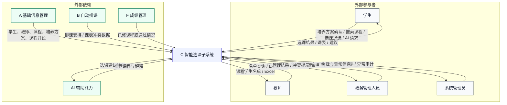
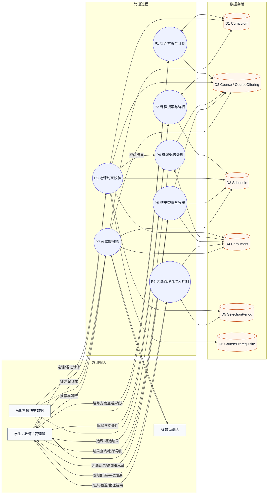
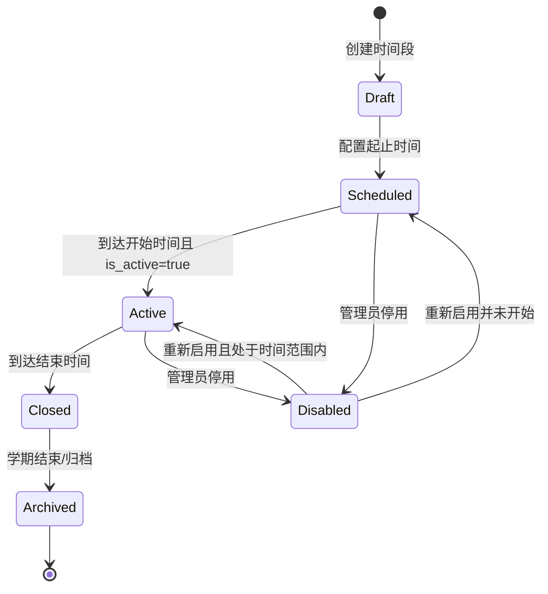
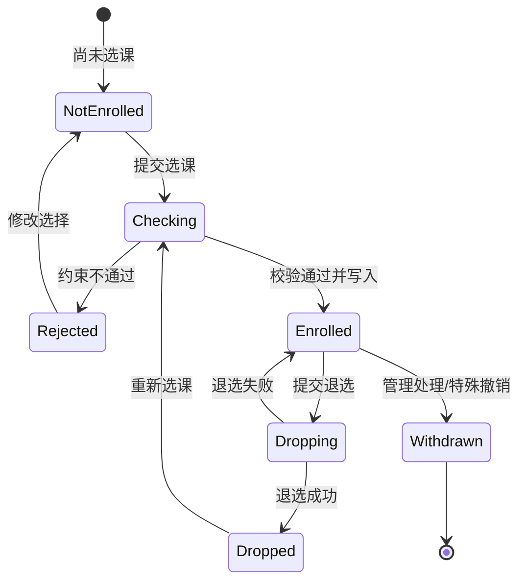
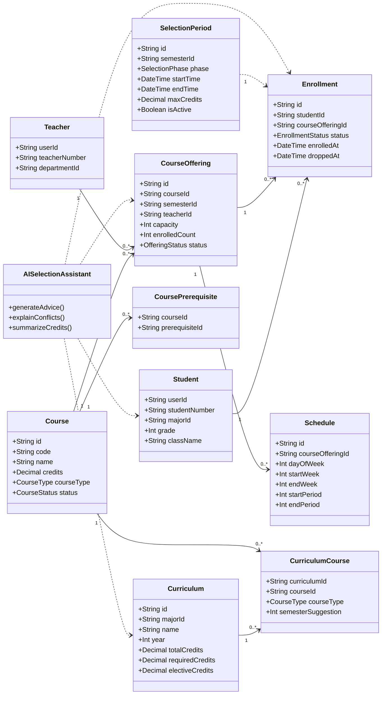

## 6. 子系统 C：智能选课需求

> 责任：C 组主笔。
> 主依据为项目要求中的 C 模块；重点体现培养方案、容量与冲突控制、选课流程、并发要求和 AI 辅助能力。

### 6.1 子系统目标与边界

智能选课子系统是 STSS 中负责“培养方案约束 + 课程搜索查看 + 选课退选 + 结果查询 + 选课管理 + AI 辅助建议”的业务子系统。C 模块在学生、课程、课程开设、排课结果和培养方案等基础数据已经存在的前提下，为学生提供符合培养方案、课程容量和时间冲突约束的选课支持；为教师提供课程选课名单查询与导出能力；为教务管理人员提供选课时间段控制、特殊加课和系统负载控制能力。

#### 6.1.1 建设目标

| 编号 | 目标 | 说明 |
| ---- | ---- | ---- |
| `GOAL-C-01` | 培养方案约束选课 | 基于学生所属专业、年级和培养方案，展示学生可选课程与学分要求。 |
| `GOAL-C-02` | 统一课程搜索与详情查看 | 支持学生按课程名称和教师搜索课程，并查看课程、教师、容量、课表等详情。 |
| `GOAL-C-03` | 可靠选课与退选 | 在选课时间段内支持学生选课、退选，并校验容量、重复选课、时间冲突和培养方案约束。 |
| `GOAL-C-04` | 统一选课结果与课表输出 | 支持学生查看选课结果并打印课表，支持教师导出课程学生名单。 |
| `GOAL-C-05` | 教务选课管理 | 支持教务管理人员控制初选、补退选和调整阶段，并处理特殊情况下的手动加课。 |
| `GOAL-C-06` | 并发与会话保护 | 支持至少 200 名在线用户同时使用选课服务，并对长时间停留用户执行强制退出或释放机制。 |
| `GOAL-C-07` | AI 辅助选课 | 通过 AI 能力提供课程推荐、冲突解释和学分进展说明，但不替代系统硬性规则判断。 |

#### 6.1.2 范围内能力

- 培养方案制定与确认：展示学生所属专业培养方案、课程分类、总学分、必修/选修学分要求和建议修读学期，支持学生据此制定选课计划。
- 课程搜索与查看：按课程名称、教师等条件搜索课程和课程开设，查看课程代码、名称、学分、类型、教师、容量、已选人数、排课安排和考核方式。
- 可选课程展示：根据学生培养方案、课程开设状态、选课阶段和课程容量自动显示可选课程列表。
- 选课与退选：在选课开放窗口内创建或更新选课记录，支持退选，并维护 `Enrollment` 状态。
- 约束校验：校验课程容量、重复选课、课程状态、选课时间段、最大学分、课表冲突、先修课程和培养方案适配性。
- 选课结果查询：学生查看已选课程、退选课程、课表结果和可打印课表。
- 教师名单导出：教师导出本人相关课程的学生名单到 Excel 表格。
- 选课管理：教务管理人员维护初选、补退选和调整阶段，执行特殊情况下的手动加课。
- 连接控制与强制退出：控制同时进入选课系统的连接数，对长时间无操作用户释放会话资源。
- AI 辅助建议：根据培养方案、已选课程、课程容量、课表和学分要求生成选课建议与解释。

#### 6.1.3 范围外能力

| 不属于 C 子系统的内容 | 归属 | 边界说明 |
| -------------------- | ---- | -------- |
| 用户、学生、教师、管理员账号与权限主数据维护 | A 子系统 | C 只读取学生、教师、管理员身份和权限信息，不维护账号生命周期。 |
| 课程基本信息、院系、专业和培养方案主数据维护 | A 子系统 | C 消费课程和培养方案数据，不负责课程目录和专业主数据的创建与删除。 |
| 教室资源维护、自动排课和手动调课 | B 子系统 | C 读取排课结果用于时间冲突检测和课表展示，不生成排课安排。 |
| 课程论坛公告、发帖、回复和全文检索 | D 子系统 | C 的选课结果可作为论坛访问范围参考，但不处理论坛内容。 |
| 在线测试、题库、试卷和自动评分 | E 子系统 | C 的选课结果可作为测试参与范围参考，但不组织测试。 |
| 正式成绩录入、GPA 和成绩分析 | F 子系统 | C 可读取成绩或通过情况用于先修课判断，但不计算正式成绩和 GPA。 |

#### 6.1.4 与其他子系统的数据依赖

| 数据对象 | C 子系统职责 | 主要来源/消费者 |
| -------- | ------------ | --------------- |
| `Student` | 读取学生学号、专业、年级、班级，用于匹配培养方案和限制本人选课范围。 | A、F |
| `Course` | 读取课程代码、名称、学分、课程类型、分类、描述、考核方式和状态。 | A、C、E、F |
| `CourseOffering` | 读取学期课程、教师、容量、已选人数和开设状态；作为选课目标对象。 | A/B、C、D/E/F |
| `Schedule` | 读取课程开设对应的周次、星期和节次，用于课表展示与冲突判断。 | B、C |
| `Curriculum` | 读取专业培养方案、适用年级、总学分、必修学分和选修学分要求。 | A、C、F |
| `CurriculumCourse` | 读取培养方案中的课程构成、课程类型和建议修读学期。 | A、C |
| `CoursePrerequisite` | 读取课程先修关系，用于选课前置约束判断。 | A、C |
| `Enrollment` | 创建、更新和查询学生选课记录，维护 `enrolled`、`dropped`、`withdrawn` 状态。 | C、D/E/F |
| `SelectionPeriod` | 维护或读取选课时间段、阶段、起止时间、最大学分和启用状态。 | C |
| `Semester` | 读取学期名称、起止日期和状态，用于选课阶段与课程开设筛选。 | A/B、C |
| `Teacher` | 读取任课教师信息，用于课程搜索、详情展示和教师名单导出。 | A、C |

#### 6.1.5 SRS 标准符合性补充

| 关注点 | 本章对应内容 | 说明 |
| ------ | ------------ | ---- |
| 范围与边界 | 6.1.1 至 6.1.4 | 明确 C 子系统负责和不负责的内容，避免与 A、B、D、E、F 子系统职责混淆。 |
| 外部接口与依赖 | 6.1.6、6.4 | 明确培养方案、课程搜索、选课、结果查询、选课管理和 AI 辅助的数据流边界。 |
| 功能需求 | 6.3 | 所有主要功能使用 `FR-C-xx` 编号，便于追踪。 |
| 非功能需求 | 6.7 | 覆盖并发能力、连接控制、强制退出、事务一致性、权限隔离和 AI 可解释性。 |
| 验证标准 | 6.8 | 每个核心功能域均关联至少一个可执行验证标准。 |
| 图示辅助说明 | 6.4 至 6.6 | 使用 DFD、状态图、类图和 CRC Cards 说明数据流、状态变化和分析类职责。 |

#### 6.1.6 外部接口、依赖与假设

| 类型 | 对象 | 需求口径 |
| ---- | ---- | -------- |
| 用户界面 | Web 浏览器 | 学生、教师和教务管理人员通过浏览器访问选课页面，界面应根据角色展示可执行操作。 |
| 服务接口 | C 子系统服务 | C 子系统应提供培养方案查看、课程搜索、课程详情、可选课程列表、选课、退选、选课结果查询、名单导出、选课时间段管理、手动加课和 AI 辅助建议能力。 |
| 会话依赖 | 认证与权限服务 | 所有选课、退选、名单导出、手动加课和选课管理操作必须完成身份认证与权限校验。 |
| 数据依赖 | 主数据库 | 课程开设、培养方案、选课记录、选课时间段等业务数据应持久化保存。 |
| 排课依赖 | B 子系统排课结果 | C 子系统依赖 `Schedule` 判断不同课程是否存在时间冲突，并生成学生课表。 |
| AI 依赖 | AI 辅助能力 | AI 仅提供推荐与解释，不得绕过容量、冲突、时间段、培养方案等硬性规则。 |
| 导出依赖 | Excel 文件生成能力 | 教师名单导出应能生成可下载的 Excel 表格，内容与课程选课记录一致。 |

### 6.2 用户角色与用户场景（User Scenarios）

#### 6.2.1 角色定义

| 角色 | 角色代码建议 | 核心权限边界 |
| ---- | ------------ | ------------ |
| 学生 | `student` | 查看本人培养方案、搜索课程、查看课程详情、选课、退选、查看本人选课结果和课表、请求 AI 辅助建议。 |
| 教师 | `teacher` | 查看本人相关课程的选课名单，并导出相关课程学生名单到 Excel 表格。 |
| 教务管理人员 | `academic_admin` | 管理选课时间段、控制初选和补退选阶段、在特殊情况下手动为学生添加课程。 |
| 系统管理员 | `system_admin` | 处理系统级权限、连接控制、异常审计和全局配置，不直接替代教务业务判断。 |
| AI 辅助能力 | `ai_assistant` | 根据学生培养方案、已选课程和课程开设信息给出建议与解释，不拥有写入选课记录的权限。 |

#### 6.2.2 用户场景

| 编号 | 场景名称 | 主要参与者 | 前置条件 | 主成功场景 | 异常与约束 |
| ---- | -------- | ---------- | -------- | ---------- | ---------- |
| `US-C-01` | 学生制定培养方案 | 学生 | 学生已登录；学生所属专业和年级存在对应培养方案 | 系统展示培养方案中的课程分类、学分要求和建议修读学期，学生据此确认拟修课程计划后进入选课流程 | 缺少培养方案时，应提示无法生成可选课程列表并联系教务管理人员。 |
| `US-C-02` | 学生搜索课程 | 学生 | 课程基础信息和课程开设信息已存在 | 学生按课程名称或教师搜索课程，系统返回课程列表、学分、教师、容量和开课状态 | 无匹配结果时返回空列表；未开放课程不应作为可直接选课对象。 |
| `US-C-03` | 学生查看课程详情 | 学生 | 搜索结果中存在目标课程 | 学生进入详情页，查看课程描述、考核方式、学分、教师、容量、已选人数、课表和先修要求 | 课程已归档或开课已关闭时，应提示当前不可选。 |
| `US-C-04` | 系统自动显示可选课程 | 学生 | 学生已确认培养方案；当前存在启用的选课时间段 | 系统根据培养方案、课程开设状态、容量和选课阶段生成可选课程列表 | 若无可选课程，系统应显示原因而不是空白页面。 |
| `US-C-05` | 学生完成选课 | 学生 | 当前处于选课开放时间；目标课程容量未满；无冲突 | 学生点击选课，系统校验所有约束后创建 `enrolled` 状态的选课记录，并更新已选人数 | 容量满、重复选课、时间冲突、超过最大学分或不在选课时间段时应拒绝。 |
| `US-C-06` | 学生退选课程 | 学生 | 当前处于允许退选阶段；学生已选目标课程 | 学生点击退选，系统将选课记录更新为 `dropped` 并记录退选时间，释放课程容量 | 非本人课程、已关闭阶段或已被锁定课程不得退选。 |
| `US-C-07` | 学生查看选课结果与课表 | 学生 | 学生已有选课记录 | 系统展示已选课程列表、选课状态、学分统计和基于排课结果生成的课表，学生可打印课表 | 课程暂无排课时应展示课程结果并提示课表信息缺失。 |
| `US-C-08` | 教师导出课程学生名单 | 教师 | 教师为目标课程开设的任课教师；课程存在选课记录 | 教师选择课程并导出 Excel，文件包含学生学号、姓名、专业、班级和选课状态等信息 | 非任课教师或无权限教师不得导出名单。 |
| `US-C-09` | 教务管理人员控制选课时间段 | 教务管理人员 | 教务管理人员已登录并具备管理权限 | 管理人员设置初选、补退选或调整阶段的开始时间、结束时间、最大学分和启用状态 | 时间范围非法、同一学期阶段冲突或缺少学期信息时应拒绝保存。 |
| `US-C-10` | 教务管理人员手动加课 | 教务管理人员 | 学生存在特殊选课需求；选课阶段已结束或需人工处理 | 管理人员为指定学生和课程开设执行手动加课，系统仍校验容量、冲突和重复选课，并记录操作原因 | 若硬性约束不满足，应拒绝或要求管理人员先处理资源问题。 |
| `US-C-11` | 高并发选课准入控制 | 学生、系统 | 同时访问选课系统的人数接近容量上限 | 系统限制同时进入选课核心流程的连接数，超过上限的用户进入等待或被提示稍后再试 | 系统不得因瞬时高并发导致选课记录重复、容量超卖或服务整体不可用。 |
| `US-C-12` | 长时间停留用户强制退出 | 学生、系统 | 用户长时间停留在选课页面且无有效操作 | 系统释放该用户选课会话或要求重新进入，以保障其他用户可用性 | 强制退出不得删除已成功保存的选课记录。 |
| `US-C-13` | AI 辅助选课建议 | 学生、AI 辅助能力 | 学生已登录；培养方案和课程开设信息可用 | 学生请求 AI 建议，系统返回推荐课程、推荐理由、冲突提示和学分进展解释 | AI 结果仅作参考，不得直接写入选课记录；AI 不可用时应允许学生继续手动选课。 |

### 6.3 功能需求

#### 6.3.1 培养方案制定功能

培养方案制定功能用于支持学生在选课前理解所属专业的学分要求和课程结构，并据此形成选课计划。系统应以培养方案、培养方案课程和课程类型为基础展示专业必修课、专业选修课和公共课等课程类别，不应由 C 模块自行定义与 A 模块冲突的课程主数据。

| 编号 | 功能需求 | 优先级 |
| ---- | -------- | ------ |
| `FR-C-01` | 系统应根据当前登录学生的专业、年级和所属培养方案，展示适用培养方案的名称、总学分要求、必修学分要求、选修学分要求和课程构成。 | Must |
| `FR-C-02` | 系统应按照课程类型展示培养方案课程，课程类型至少覆盖专业必修课、专业选修课和公共课，对应课程数据中的 `required`、`elective`、`general` 分类。 | Must |
| `FR-C-03` | 系统应展示培养方案课程的建议修读学期，辅助学生制定选课计划。 | Should |
| `FR-C-04` | 学生进入正式选课前，系统应提供培养方案查看与确认入口，使学生能够基于相关因素制定个人选课计划。 | Must |
| `FR-C-05` | 系统应根据培养方案、已选课程和课程学分统计学生当前选课计划的学分构成，包括总学分、必修课学分、选修课学分和公共课学分。 | Must |
| `FR-C-06` | 当学生所属专业或年级无法匹配培养方案时，系统应阻止自动生成可选课程列表，并给出明确提示。 | Must |
| `FR-C-07` | 培养方案和课程分类数据应来自系统主数据，C 子系统不得创建与主数据冲突的课程类别、课程代码或培养方案副本。 | Must |

#### 6.3.2 课程搜索与查看功能

| 编号 | 功能需求 | 优先级 |
| ---- | -------- | ------ |
| `FR-C-08` | 系统应支持学生根据课程名称搜索课程，并返回匹配的课程和课程开设列表。 | Must |
| `FR-C-09` | 系统应支持学生根据教师姓名或教师标识搜索课程，并返回该教师相关课程开设列表。 | Must |
| `FR-C-10` | 课程搜索结果应至少包含课程代码、课程名称、学分、课程类型、任课教师、课程容量、已选人数和开设状态。 | Must |
| `FR-C-11` | 系统应支持查看课程详情，详情至少包含课程描述、考核方式、先修课程、任课教师、容量、已选人数和排课安排。 | Must |
| `FR-C-12` | 系统应支持按学期、课程类型、课程状态和是否可选等条件筛选课程列表。 | Should |

#### 6.3.3 选课功能

| 编号 | 功能需求 | 优先级 |
| ---- | -------- | ------ |
| `FR-C-13` | 系统应根据登录学生的培养方案自动显示可选课程列表，并标识课程是否已选、是否容量已满、是否时间冲突和是否满足先修要求。 | Must |
| `FR-C-14` | 系统应仅允许学生在启用且当前时间位于起止时间范围内的 `SelectionPeriod` 中执行选课或退选操作。 | Must |
| `FR-C-15` | 可选课程列表应展示主要课程信息、当前选课人数和课程容量。 | Must |
| `FR-C-16` | 学生提交选课时，系统应校验课程开设状态、课程容量、重复选课、选课时间段、最大学分、培养方案适配性和课表冲突。 | Must |
| `FR-C-17` | 选课成功后，系统应创建或更新学生与课程开设之间的 `Enrollment` 记录，并将状态置为 `enrolled`。 | Must |
| `FR-C-18` | 系统应基于课程开设对应的 `Schedule` 判断学生已选课程之间是否存在周次、星期和节次重叠冲突。 | Must |
| `FR-C-19` | 系统应基于 `CoursePrerequisite` 判断目标课程是否存在先修课程要求，并在学生不满足要求时阻止选课或给出明确提示。 | Should |
| `FR-C-20` | 系统应根据当前选课时间段配置的 `max_credits` 控制学生在该阶段可选课程总学分。 | Must |
| `FR-C-21` | 学生退选时，系统应将对应 `Enrollment` 状态更新为 `dropped` 并记录退选时间，不应直接删除历史选课记录。 | Must |
| `FR-C-22` | 选课和退选成功后，系统应保持课程开设的已选人数与有效选课记录一致，避免容量超卖或人数统计错误。 | Must |
| `FR-C-23` | 同一学生对同一课程开设不得存在多个同时有效的 `enrolled` 选课记录。 | Must |

#### 6.3.4 选课结果查询功能

| 编号 | 功能需求 | 优先级 |
| ---- | -------- | ------ |
| `FR-C-24` | 系统应支持学生查看本人选课结果，结果至少包含课程名称、课程代码、学分、课程类型、任课教师、选课状态和选课时间。 | Must |
| `FR-C-25` | 系统应支持学生基于已选课程和排课安排查看本人课表，并提供适合打印的课表数据。 | Must |
| `FR-C-26` | 学生只能查看本人的选课结果和课表，不得访问其他学生的选课记录。 | Must |
| `FR-C-27` | 系统应支持教师查看本人相关课程开设的学生名单。 | Must |
| `FR-C-28` | 系统应支持教师将相关课程学生名单导出为 Excel 表格，导出内容应与当前有效选课记录一致。 | Must |
| `FR-C-29` | 选课结果查询应支持按学期、课程名称、课程代码和选课状态筛选。 | Should |

#### 6.3.5 选课管理功能

| 编号 | 功能需求 | 优先级 |
| ---- | -------- | ------ |
| `FR-C-30` | 教务管理人员应能创建、修改、启用和停用选课时间段，时间段包含学期、阶段、开始时间、结束时间、最大学分和启用状态。 | Must |
| `FR-C-31` | 选课阶段应至少支持初选、补退选和调整阶段，对应 `first_round`、`second_round`、`adjustment`。 | Must |
| `FR-C-32` | 系统应在学生选课、退选时自动判断当前是否存在有效选课阶段，并按阶段规则允许或拒绝操作。 | Must |
| `FR-C-33` | 选课结束后，教务管理人员应能够根据学生特殊要求手动为学生添加课程。 | Must |
| `FR-C-34` | 管理人员手动加课仍应校验学生、课程开设、容量、重复选课和课表冲突，并返回明确的成功或失败原因。 | Must |
| `FR-C-35` | 系统应提供选课准入控制能力，限制同时进入选课系统核心流程的连接数，防止系统过载导致无法服务。 | Must |
| `FR-C-36` | 系统应能够对长时间停留或长时间无有效操作的用户执行强制退出或释放选课会话。 | Must |
| `FR-C-37` | 教务管理人员执行选课阶段调整、手动加课等关键操作时，系统应保留可追踪的操作记录。 | Should |

#### 6.3.6 AI 辅助选课功能

AI 辅助选课功能用于对学生进行推荐和解释，不负责最终业务决策。所有选课写入仍必须通过 `FR-C-16` 至 `FR-C-23` 中的硬性规则校验。

| 编号 | 功能需求 | 优先级 |
| ---- | -------- | ------ |
| `FR-C-38` | 系统应支持学生请求 AI 辅助选课建议，输入信息应至少包括学生培养方案、已选课程、可选课程、课程容量和课表安排。 | Must |
| `FR-C-39` | AI 辅助结果应以推荐课程列表、推荐理由、学分进展说明、冲突提示和风险提示等形式返回。 | Must |
| `FR-C-40` | AI 辅助建议不得直接写入 `Enrollment`，学生必须通过常规选课入口主动确认并提交选课。 | Must |
| `FR-C-41` | AI 辅助建议不得绕过容量、时间冲突、选课阶段、培养方案和先修课程等硬性规则；若存在风险，应在结果中显式说明。 | Must |
| `FR-C-42` | 当 AI 辅助能力不可用、超时或返回异常时，系统应允许学生继续使用普通课程搜索、查看和选课功能。 | Must |
| `FR-C-43` | AI 输出应尽量使用学生可理解的语言解释推荐原因，并标明建议仅供参考。 | Should |

### 6.4 数据流图（Data Flow Diagram）

智能选课业务由“培养方案读取与计划制定、课程搜索与详情查看、约束校验与选课退选、结果查询与名单导出、选课时间段管理、AI 辅助建议”六类过程组成。

| 图编号 | 图名称 | 用途 |
| ------ | ------ | ---- |
| `FIG-6-01` | C 子系统上下文级 DFD | 展示学生、教师、教务管理人员与 C 子系统及外部依赖的交互边界。 |
| `FIG-6-02` | C 子系统 0 层 DFD | 展示培养方案、课程搜索、选课校验、结果查询、管理和 AI 辅助的数据流。 |
| `FIG-6-03` | 选课时间段状态图 | 展示选课阶段从未开始、开放到结束的状态变化。 |
| `FIG-6-04` | 选课记录状态图 | 展示学生选课记录从未选、已选到退选/撤销的状态变化。 |
| `FIG-6-05` | C 子系统核心分析类图 | 展示培养方案、课程开设、选课记录、选课时间段和 AI 辅助服务的关系。 |

#### 6.4.1 上下文级 DFD

`FIG-6-01` C 子系统上下文级 DFD。

#### 6.4.2 0 层 DFD

`FIG-6-02` C 子系统 0 层 DFD。

#### 6.4.3 关键数据流说明

| 数据流编号 | 来源 | 目标 | 数据内容 |
| ---------- | ---- | ---- | -------- |
| `DF-C-01` | 学生 | 培养方案与计划 | 学生身份、专业、年级、培养方案查看请求 |
| `DF-C-02` | 培养方案存储 | 学生 | 培养方案、学分要求、课程分类、建议修读学期 |
| `DF-C-03` | 学生 | 课程搜索与详情 | 课程名称、教师、学期、课程类型、可选状态等筛选条件 |
| `DF-C-04` | 课程/开课/排课存储 | 学生 | 课程列表、教师、容量、已选人数、排课安排、考核方式 |
| `DF-C-05` | 学生 | 选课约束校验 | 学生 ID、课程开设 ID、当前选课阶段、已选课程集合 |
| `DF-C-06` | 约束校验 | 选课退选处理 | 容量、冲突、学分、先修和时间段校验结果 |
| `DF-C-07` | 选课退选处理 | `Enrollment` | 学生 ID、课程开设 ID、选课状态、选课时间、退选时间 |
| `DF-C-08` | 教师 | 结果查询与导出 | 课程开设 ID、学期、导出字段范围 |
| `DF-C-09` | 结果查询与导出 | 教师/学生 | 选课结果、学生名单、课表数据、Excel 文件 |
| `DF-C-10` | 教务管理人员 | 选课管理 | 选课阶段、起止时间、最大学分、启用状态、手动加课请求 |
| `DF-C-11` | 学生 | AI 辅助建议 | 培养方案、已选课程、可选课程、偏好信息 |
| `DF-C-12` | AI 辅助建议 | 学生 | 推荐课程、推荐理由、冲突提示、学分进展说明 |

### 6.5 状态图（State Diagrams）

#### 6.5.1 选课时间段状态图

`FIG-6-03` 选课时间段状态图。

状态约束：

- `Draft` 表示选课时间段已创建但尚未具备完整起止时间或阶段配置。
- `Scheduled` 表示时间段配置完成但尚未开放。
- `Active` 表示当前时间位于起止时间范围内且处于启用状态，学生可按阶段规则选课或退选。
- `Disabled` 表示管理人员主动停用，停用期间学生不得执行选课或退选。
- `Closed` 表示时间段已结束，不再接受普通学生操作。
- `Archived` 表示该阶段随学期历史归档，仅可查询。

#### 6.5.2 选课记录状态图

`FIG-6-04` 选课记录状态图。

状态约束：

- `NotEnrolled` 表示学生当前没有对该课程开设的有效选课记录。
- `Checking` 表示系统正在进行选课阶段、容量、重复、时间冲突、学分和培养方案约束校验。
- `Enrolled` 对应有效选课状态，应计入课程已选人数。
- `Dropped` 表示学生退选成功，不再计入课程已选人数，但保留退选历史。
- `Withdrawn` 表示因管理处理或特殊原因撤销，不再作为有效选课。

### 6.6 类图与 CRC Cards（Class Diagrams and CRC Cards）

#### 6.6.1 分析类图

`FIG-6-05` C 子系统核心分析类图。

说明：`AISelectionAssistant` 是分析层逻辑类，用于表达 AI 辅助建议职责，不代表必须新增数据库表。所有最终选课写入仍以 `Enrollment` 为准。

#### 6.6.2 CRC Cards

`TAB-6-01` C 子系统核心 CRC Cards。

| Class | Responsibilities | Collaborators |
| ----- | ---------------- | ------------- |
| `Student` | 表示选课主体；提供专业、年级、班级和学生身份，用于匹配培养方案和限定本人选课范围。 | `Curriculum`、`Enrollment`、`AISelectionAssistant` |
| `Course` | 提供课程代码、名称、学分、课程类型、课程描述和考核方式，是课程搜索和培养方案约束的基础。 | `CourseOffering`、`CurriculumCourse`、`CoursePrerequisite` |
| `CourseOffering` | 表示某门课程在某学期由某教师开设的具体教学实例；维护容量、已选人数和开设状态。 | `Course`、`Teacher`、`Schedule`、`Enrollment` |
| `Schedule` | 保存课程开设的时间安排；用于学生课表生成和课程时间冲突检测。 | `CourseOffering`、`Enrollment` |
| `Curriculum` | 表示专业培养方案；提供总学分、必修学分、选修学分和适用年级等约束。 | `Student`、`CurriculumCourse` |
| `CurriculumCourse` | 表示培养方案与课程的关系；保存课程类型和建议修读学期。 | `Curriculum`、`Course` |
| `CoursePrerequisite` | 表示课程先修关系；用于判断学生是否满足目标课程前置要求。 | `Course`、`Enrollment`、F 子系统成绩/通过信息 |
| `Enrollment` | 表示学生对课程开设的一次选课记录；维护选课、退选和撤销状态。 | `Student`、`CourseOffering`、`SelectionPeriod` |
| `SelectionPeriod` | 表示选课时间段；控制初选、补退选和调整阶段，以及最大学分和启用状态。 | `Enrollment`、教务管理人员 |
| `AISelectionAssistant` | 基于培养方案、已选课程、可选课程、容量和排课安排生成建议与解释；不直接写入选课记录。 | `Student`、`Curriculum`、`CourseOffering`、`Enrollment` |

### 6.7 非功能需求与约束

| 编号 | 分类 | 非功能需求 |
| ---- | ---- | ---------- |
| `NFR-C-01` | 并发能力 | 智能选课模块应至少支持 200 名在线用户同时使用选课服务，并保持核心查询和提交操作可用。 |
| `NFR-C-02` | 连接控制 | 系统应对同时进入选课核心流程的连接数进行控制，超过容量时给出等待或稍后重试提示。 |
| `NFR-C-03` | 强制退出 | 系统应对长时间停留或长时间无有效操作的用户执行强制退出或释放选课会话，释放资源不应影响已保存选课记录。 |
| `NFR-C-04` | 事务一致性 | 选课和退选应在事务内完成，`Enrollment` 状态与 `CourseOffering.enrolled_count` 应保持一致。 |
| `NFR-C-05` | 容量正确性 | 并发选同一课程时，系统不得出现课程容量超卖或重复有效选课记录。 |
| `NFR-C-06` | 权限隔离 | 学生只能操作本人选课记录；教师只能导出本人相关课程学生名单；教务管理人员只能在授权范围内进行选课管理。 |
| `NFR-C-07` | 约束可解释性 | 选课失败时，系统应明确提示失败原因，如容量已满、时间冲突、超过最大学分、不在选课时间段或不满足先修要求。 |
| `NFR-C-08` | 数据一致性 | 可选课程、选课结果、课表和名单导出应使用一致的数据来源，避免不同页面显示冲突。 |
| `NFR-C-09` | AI 可解释性 | AI 辅助建议应说明推荐依据、冲突风险和学分影响，不得只给出不可解释的课程列表。 |
| `NFR-C-10` | AI 安全边界 | AI 建议不得自动写入选课记录，不得绕过系统硬性约束；所有最终选课必须通过常规校验流程。 |
| `NFR-C-11` | 可用性 | AI 辅助能力不可用时，普通课程搜索、查看、选课、退选和结果查询功能仍应可用。 |
| `NFR-C-12` | 可追踪性 | 选课、退选、手动加课、选课阶段变更和异常强退等关键操作应具备可追踪记录。 |
| `NFR-C-13` | 查询性能 | 课程搜索、可选课程列表、选课结果和教师名单查询应支持分页或筛选，避免一次性返回过大结果集。 |
| `NFR-C-14` | 时间准确性 | 选课时间段判断应以服务端时间为准，不应依赖客户端本地时间。 |

### 6.8 验证标准（Validation Criteria）

| 编号 | 覆盖需求 | 验证标准 |
| ---- | -------- | -------- |
| `VC-C-01` | `FR-C-01` 至 `FR-C-07` | 使用具有专业和年级信息的学生账号进入培养方案页面，系统能展示对应培养方案、学分要求、课程分类和建议修读学期；缺少培养方案时给出明确提示并阻止生成可选课程列表。 |
| `VC-C-02` | `FR-C-08` 至 `FR-C-12` | 按课程名称和教师搜索课程时，返回结果与条件一致；课程详情包含学分、类型、教师、容量、已选人数、先修要求、排课安排和考核方式。 |
| `VC-C-03` | `FR-C-13`、`FR-C-15` | 学生进入可选课程页面时，系统根据培养方案和课程开设自动显示可选课程，并展示课程信息、选课人数和容量。 |
| `VC-C-04` | `FR-C-14`、`FR-C-30` 至 `FR-C-32`、`NFR-C-14` | 当前时间不在启用选课时间段内时，学生选课和退选被拒绝；在有效初选、补退选或调整阶段内，符合阶段规则的操作允许执行。 |
| `VC-C-05` | `FR-C-16`、`FR-C-18`、`NFR-C-07` | 构造与已选课程在周次、星期和节次重叠的课程，提交选课时系统拒绝并返回明确时间冲突原因。 |
| `VC-C-06` | `FR-C-16`、`FR-C-20` | 当学生选课后总学分超过当前选课时间段 `max_credits` 时，系统拒绝选课并提示超过最大学分。 |
| `VC-C-07` | `FR-C-16`、`FR-C-19` | 对配置了先修课程的目标课程，若学生不满足先修要求，系统阻止选课或返回明确风险提示。 |
| `VC-C-08` | `FR-C-17`、`FR-C-21` 至 `FR-C-23`、`NFR-C-04` | 选课成功后生成 `enrolled` 记录并增加有效已选人数；退选后状态变为 `dropped` 并记录退选时间；重复选择同一课程开设不会生成多个有效记录。 |
| `VC-C-09` | `FR-C-16`、`FR-C-22`、`NFR-C-05` | 构造多人并发选择同一剩余名额课程，最终有效选课人数不得超过课程容量，失败请求返回容量不足提示。 |
| `VC-C-10` | `FR-C-24` 至 `FR-C-26` | 学生可查看本人选课结果和课表；尝试访问其他学生选课记录时返回权限错误或空结果。 |
| `VC-C-11` | `FR-C-27`、`FR-C-28`、`NFR-C-06` | 任课教师可查看并导出本人相关课程学生名单；非任课教师或无权限用户导出时被拒绝；导出内容与有效选课记录一致。 |
| `VC-C-12` | `FR-C-33`、`FR-C-34`、`NFR-C-12` | 选课结束后，教务管理人员可为学生手动加课；系统仍校验容量、重复和冲突，并保留操作记录。 |
| `VC-C-13` | `FR-C-35`、`NFR-C-01`、`NFR-C-02` | 使用至少 200 个并发在线用户模拟访问选课核心流程，系统保持可用；超过连接控制阈值的请求被等待或拒绝，但不影响已进入用户的选课一致性。 |
| `VC-C-14` | `FR-C-36`、`NFR-C-03` | 模拟用户长时间无操作，系统释放选课会话或要求重新进入；用户此前已成功保存的选课记录不被删除。 |
| `VC-C-15` | `FR-C-38` 至 `FR-C-43`、`NFR-C-09` 至 `NFR-C-11` | 学生请求 AI 辅助建议时，系统返回推荐课程、理由、学分说明和风险提示；AI 建议不会自动写入选课记录；AI 服务失败时普通选课流程仍可用。 |
| `VC-C-16` | `NFR-C-06`、`NFR-C-12` | 未认证或越权用户执行选课、退选、名单导出、选课阶段管理和手动加课时被拒绝；关键操作具备可追踪记录。 |
| `VC-C-17` | `NFR-C-08`、`NFR-C-13` | 课程搜索、可选课程、选课结果和名单查询均支持筛选或分页，且不同页面展示的课程容量、已选人数和选课状态一致。 |

#### 6.8.1 需求追踪矩阵

| 功能域 | 需求编号 | 验证编号 |
| ------ | -------- | -------- |
| 培养方案制定 | `FR-C-01` 至 `FR-C-07` | `VC-C-01` |
| 课程搜索与查看 | `FR-C-08` 至 `FR-C-12` | `VC-C-02`、`VC-C-17` |
| 选课与退选 | `FR-C-13` 至 `FR-C-23` | `VC-C-03` 至 `VC-C-09`、`VC-C-16`、`VC-C-17` |
| 选课结果与名单导出 | `FR-C-24` 至 `FR-C-29` | `VC-C-10`、`VC-C-11`、`VC-C-17` |
| 选课管理 | `FR-C-30` 至 `FR-C-37` | `VC-C-04`、`VC-C-12` 至 `VC-C-14`、`VC-C-16` |
| AI 辅助选课 | `FR-C-38` 至 `FR-C-43` | `VC-C-15` |
| 非功能约束 | `NFR-C-01` 至 `NFR-C-14` | `VC-C-09`、`VC-C-13` 至 `VC-C-17` |
