# Smart-Teaching-Service-System Software Requirements Specification

---

## 0. 文档信息

### 0.1 基本文档信息

| 项目         | 内容                                  |
| ------------ | ------------------------------------- |
| 项目名称     | Smart Teaching Service System（STSS） |
| 文档名称     | Software Requirements Specification   |
| 当前版本     | 1.0.0                                 |
| 文档状态     | Final                                 |
| 当前维护人   | 项目组长                              |
| 课程交付时间 | 2026-04-27 24:00                      |
| 文档适用范围 | STSS 六个子系统及跨系统需求           |

### 0.2 统一编号规则

| 类型       | 编号格式        | 示例                     |
| ---------- | --------------- | ------------------------ |
| 用户场景   | `US-模块-序号`  | `US-C-01`                |
| 功能需求   | `FR-模块-序号`  | `FR-A-01`                |
| 非功能需求 | `NFR-范围-序号` | `NFR-SYS-01`、`NFR-E-01` |
| 验证标准   | `VC-模块-序号`  | `VC-F-01`                |
| 图编号     | `FIG-章节-序号` | `FIG-4-01`               |
| 表编号     | `TAB-章节-序号` | `TAB-6-02`               |

---

## 1. 引言（Introduction）

### 1.1 编写目的

本文档用于对 Smart Teaching Service System（STSS）的业务范围、功能需求、非功能需求、验证标准以及六个子系统之间的协作关系进行统一描述。该文档是课程评审与后续子系统 1.0 版本验收的重要依据。通过统一的章节结构、术语口径、编号体系和图示要求，本文档保证需求描述、后续设计与最终验证之间可以建立清晰的追踪关系。

### 1.2 项目范围

STSS 是一个面向高校教学场景的智慧教学服务平台，覆盖基础信息管理、自动排课、智能选课、论坛交流、在线测试和成绩管理六个子系统。本文档描述这些子系统在业务层面需要支持的用户角色、核心功能、状态变化、数据流转关系、质量约束和验证标准。

本文档覆盖内容包括：

- 六个子系统的用户场景、功能需求与非功能需求。
- 系统级上下文、角色边界和跨子系统业务流程。
- 课程要求中明确提出的 Data Flow Diagram、State Diagrams、Class Diagrams、CRC Cards 和 Validation Criteria。

本文档不直接展开以下内容：

- 数据库表字段、索引和 ORM 映射等实现级设计细节。
- REST API 路径、请求响应字段等接口级实现细节。
- 具体前后端页面布局、组件拆分和代码实现方案。

### 1.3 术语、缩略语与定义

| 术语/缩略语      | 定义                                                                            |
| ---------------- | ------------------------------------------------------------------------------- |
| STSS             | Smart Teaching Service System，智慧教学服务系统                                 |
| SRS              | Software Requirements Specification，软件需求规格说明书                         |
| Course Offering  | 某门课程在某一学期、由特定教师开设的具体教学实例                                |
| Curriculum       | 培养方案，用于约束学生在专业学习过程中的课程和学分要求                          |
| Enrollment       | 选课记录，表示学生与课程开设之间的选修关系                                      |
| Selection Period | 选课时间段，表示初选、补退选等窗口期                                            |
| Question Bank    | 题库，表示教师维护的试题集合                                                    |
| Test Paper       | 试卷，由若干题目组成的在线测试载体                                              |
| GPA              | Grade Point Average，平均绩点，用于反映学生成绩水平                             |
| DFD              | Data Flow Diagram，数据流图，用于描述处理过程、数据存储和外部实体之间的数据流动 |
| CRC Card         | Class-Responsibility-Collaborator Card，用于描述类的职责与协作关系              |

---

## 2. 系统总体描述（Overall Description）

### 2.1 产品定位与建设目标

STSS 的目标是构建一个面向高校教学全过程的综合性服务平台，使学生、教师、教务管理人员和系统管理员能够在统一系统中完成基础信息维护、教学资源管理、课程安排、选课决策、课程交流、在线测试与成绩分析等关键活动。与单一工具型系统不同，STSS 强调六个子系统之间的数据联动和业务连续性：基础信息管理提供统一身份与课程基础数据，自动排课决定课程安排，智能选课为学生提供选课支持，论坛交流增强课程互动，在线测试支持过程性评价，成绩管理完成正式成绩记录和分析。

### 2.2 系统边界与上下文

STSS 的系统边界围绕“教学服务”展开，主要服务于校内教学管理与学习活动。系统内部包含六个业务子系统及其共享基础能力，系统外部则是参与系统交互的用户角色、可能依赖的邮件或通知能力，以及课程要求中提到的 AI 能力。

| 系统内部范围                       | 说明                                |
| ---------------------------------- | ----------------------------------- |
| 统一身份、用户、权限与基础课程信息 | 由 A 模块提供，是其他模块的基础支撑 |
| 教室资源、排课和课表输出           | 由 B 模块负责                       |
| 培养方案、选课、退选与 AI 辅助     | 由 C 模块负责                       |
| 公告、发帖、回复、检索与统计       | 由 D 模块负责                       |
| 题库、试卷、作答、评分与统计       | 由 E 模块负责                       |
| 成绩录入、修改、查询与分析         | 由 F 模块负责                       |

| 外部参与者/依赖 | 说明                                                     |
| --------------- | -------------------------------------------------------- |
| 学生            | 使用系统完成选课、交流、测试、成绩查看等活动             |
| 教师            | 使用系统完成课表查看、公告发布、题库维护、成绩录入等活动 |
| 教务管理人员    | 负责资源维护、排课、选课管理和部分跨系统协调             |
| 系统管理员      | 负责系统基础配置、权限管理和安全保障                     |
| AI 辅助能力     | 为 C 模块提供选课建议与解释支持                          |

### 2.3 用户角色与干系人

| 角色                    | 核心职责                                                                         | 关注的主要子系统 |
| ----------------------- | -------------------------------------------------------------------------------- | ---------------- |
| 学生                    | 维护个人信息、制定培养方案、选课退课、参与课程交流、参加测试、查询成绩           | A、C、D、E、F    |
| 教师                    | 维护个人信息、查看课表、发布公告、发帖交流、维护题库、组卷、录入和分析成绩       | A、B、D、E、F    |
| 教务管理人员            | 维护教师和学生基础信息、课程与教室信息、执行排课、控制选课窗口、处理特殊教务事务 | A、B、C、F       |
| 系统管理员              | 管理全局权限与安全策略，保障用户身份、日志与系统运行安全                         | A                |
| 课程教师/TA（验收视角） | 关注系统是否满足教学过程组织和课程考核要求                                       | B、D、E、F       |

在本文档中，若未特别说明，“管理人员”默认指具备相应业务权限的教务管理人员或系统管理员；涉及安全审计时，以系统管理员职责为准。

### 2.4 约束、假设与依赖

- 本次 SRS 文档需在 2026-04-27 24:00 前完成并提交。
- 课程要求中明确指出验证标准的准确性非常重要，后续子系统 1.0 的验收将严格参考本文档中的验证标准。
- C 模块中的 AI 辅助选课能力在本阶段按“辅助建议与解释”理解，具体实现形式可在后续设计与实现阶段细化。

---

## 3. 系统级需求概览

### 3.1 系统目标与核心业务能力

从系统层面看，STSS 至少应具备以下核心能力：

| 编号        | 系统级功能能力                                                                       |
| ----------- | ------------------------------------------------------------------------------------ |
| `FR-SYS-01` | 系统应提供统一的用户、角色、权限和基础课程信息管理能力，为各子系统提供共享基础数据。 |
| `FR-SYS-02` | 系统应支持课程、教师、教室和时间资源的组织与排课处理，并能输出可查询的课表结果。     |
| `FR-SYS-03` | 系统应支持学生基于培养方案完成课程搜索、选课、退选与结果查询。                       |
| `FR-SYS-04` | 系统应支持围绕课程开展公告发布、发帖、回复、附件交流和内容检索。                     |
| `FR-SYS-05` | 系统应支持教师组织在线测试，学生完成作答，并生成自动评分与统计结果。                 |
| `FR-SYS-06` | 系统应支持教师和学生完成正式成绩录入、查询、修改控制和成绩分析。                     |
| `FR-SYS-07` | 系统应保证六个子系统在用户身份、课程对象、时间安排和数据追踪上的一致性。             |

### 3.2 跨子系统业务流程概览

STSS 的主要跨子系统业务链路如下：

1. A 模块首先维护用户身份、院系专业、课程基础信息和权限规则，为其他模块提供统一的业务基础。
2. B 模块基于课程、教师、教室和时间资源完成自动排课或手动调课，并形成可查询的课表。
3. C 模块读取培养方案、课程信息和开课安排，在规定时间窗口内为学生提供选课、退选和结果查询能力，并在需要时提供 AI 辅助建议。
4. D 模块围绕课程和开课实例支持公告发布、讨论交流和内容检索，增强教学过程中的互动。
5. E 模块围绕课程组织在线测试活动，包括题库管理、组卷、作答、自动评分与统计分析。
6. F 模块基于课程开设、选课结果和测试/考核相关数据，支持正式成绩录入、查询、分析与修改追踪。
7. 系统管理员和教务管理人员在全流程中承担跨模块维护、异常处理、权限控制和资源调度职责。

### 3.3 系统级用户场景总览（User Scenarios）

| 场景编号    | 场景名称                           | 参与角色           | 主成功结果                                                           | 前置条件                                           |
| ----------- | ---------------------------------- | ------------------ | -------------------------------------------------------------------- | -------------------------------------------------- |
| `US-SYS-01` | 学生完成从信息确认到选课的全过程   | 学生、教务管理人员 | 学生能够查看符合培养方案的课程并完成选课，系统记录选课结果与课表     | 学生账号、专业和培养方案信息已建立；选课窗口已开放 |
| `US-SYS-02` | 教师围绕课程开展教学互动与测试     | 教师、学生         | 教师能够发布公告、组织讨论、创建测试，学生能够参与交流并完成在线测试 | 课程已开设并存在对应课表                           |
| `US-SYS-03` | 教务管理人员完成资源维护与排课管理 | 教务管理人员、教师 | 管理人员能够生成排课结果、处理调课冲突并输出课表                     | 课程、教师和教室基础信息已存在                     |
| `US-SYS-04` | 教师录入成绩，学生查看结果与进展   | 教师、学生         | 教师完成成绩录入与必要修改，学生可以查询成绩、学分与统计结果         | 课程已结束或达到成绩录入条件；学生已有选课记录     |
| `US-SYS-05` | 系统管理员维护权限与审计安全       | 系统管理员         | 系统管理员能够维护权限、查看日志并保障系统访问安全                   | 系统已投入使用并存在多角色用户                     |

### 3.4 系统级数据流图（Data Flow Diagram）

下图给出 STSS 的系统级 Level 0 视图，用于说明主要外部角色与六个子系统之间的数据流关系：

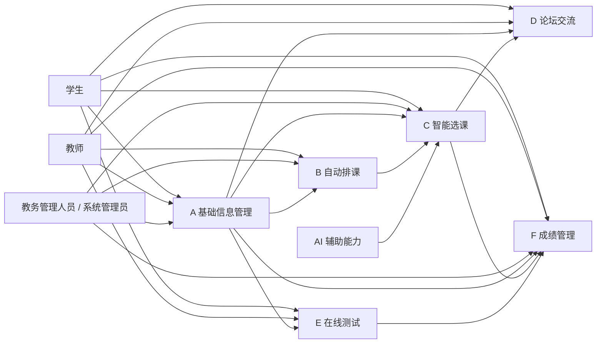
```mermaid
flowchart LR
    student["学生"] --> A["A 基础信息管理"]
    student --> C["C 智能选课"]
    student --> D["D 论坛交流"]
    student --> E["E 在线测试"]
    student --> F["F 成绩管理"]

    teacher["教师"] --> A
    teacher --> B["B 自动排课"]
    teacher --> D
    teacher --> E
    teacher --> F

    admin["教务管理人员 / 系统管理员"] --> A
    admin --> B
    admin --> C
    admin --> F

    A --> B
    A --> C
    A --> D
    A --> E
    A --> F
    B --> C
    C --> D
    C --> F
    E --> F
    ai["AI 辅助能力"] --> C
```

说明：

- A 模块向其他业务模块提供统一用户、角色、权限和基础课程信息。
- B 模块产生的课表安排会影响 C 模块的选课组织以及教师、学生的课表查询。
- C 模块的选课结果会影响 D 模块课程参与范围、E 模块测试参与范围和 F 模块成绩对象范围。
- E 模块的测试结果可作为 F 模块成绩分析的辅助输入。

### 3.5 系统级非功能需求

| 编号         | 非功能需求         | 说明                                                                                           |
| ------------ | ------------------ | ---------------------------------------------------------------------------------------------- |
| `NFR-SYS-01` | 安全与权限控制     | 系统应根据用户角色对功能与数据访问进行控制，防止越权访问。                                     |
| `NFR-SYS-02` | 一致的用户体验     | 系统应保持统一的术语、角色命名、界面风格和业务对象表达方式。                                   |
| `NFR-SYS-03` | 数据一致性         | 跨模块共享的用户、课程、开课、选课与成绩数据应保持口径一致，避免同一对象在不同模块含义冲突。   |
| `NFR-SYS-04` | 审计与可追踪性     | 对用户管理、权限变更、成绩修改等关键操作应具备日志记录与责任追踪能力。                         |
| `NFR-SYS-05` | 基本性能与并发能力 | 系统应支持校园教学场景下的正常使用负载，其中智能选课模块应至少支持 200 名在线用户同时服务。    |
| `NFR-SYS-06` | 可靠的异常处理     | 系统在冲突、超时、非法操作或依赖异常情况下应给出明确反馈，并尽量避免数据损坏。                 |
| `NFR-SYS-07` | 可维护与可扩展     | 文档结构、模块边界和对象命名应支持后续继续实现、修改和扩展。                                   |
| `NFR-SYS-08` | 文档风格统一       | 全文应以中文为主，术语、图例、编号和验证口径保持统一，以满足课程评分中对语言与风格统一的要求。 |

### 3.6 总体验证思路与覆盖率目标（Validation Criteria）

系统级验证采用“需求编号 + 场景编号 + 验证编号”三位一体的追踪方式进行。每个关键功能需求都应至少对应一个用户场景和一个可执行或可检查的验证标准；第 10 章进一步提供功能域级三向追踪矩阵，用于审计主要需求、用户场景和验证标准之间的覆盖关系。每个子系统章节都必须显式包含用户场景、DFD、状态图、类图与 CRC Cards、非功能需求和验证标准，从而满足课程给出的最低内容要求。

本项目当前采用以下系统级验证标准：

| 编号        | 系统级验证标准                                                                                                                                                  |
| ----------- | --------------------------------------------------------------------------------------------------------------------------------------------------------------- |
| `VC-SYS-01` | 文档必须显式包含 `Introduction`、`User Scenarios`、`Data Flow Diagram`、`State Diagrams`、`Class Diagrams`、`CRC Cards`、`Validation Criteria` 等课程要求内容。 |
| `VC-SYS-02` | A-F 六个子系统章节必须采用一致的子章节模板，以保证结构统一和便于追踪。                                                                                          |
| `VC-SYS-03` | 需求追踪矩阵中，主要功能需求中至少 90% 应建立到验证标准的明确映射。                                                                                             |
| `VC-SYS-04` | 全文术语、角色命名、图例和语言风格应保持一致，不得出现明显口径冲突。                                                                                            |

---

## 4. 子系统 A：基础信息管理需求

### 4.1 子系统目标与边界

基础信息管理子系统是 STSS 的基础支撑子系统，负责维护全系统共享的用户身份、角色权限、组织结构、课程基础数据和安全审计数据。其他子系统依赖 A 子系统提供的用户、教师、学生、院系、专业、课程和培养方案等主数据，完成排课、选课、论坛、在线测试和成绩管理业务。

#### 4.1.1 建设目标

| 编号        | 目标             | 说明                                                                              |
| ----------- | ---------------- | --------------------------------------------------------------------------------- |
| `GOAL-A-01` | 统一身份基础     | 为学生、教师、教务管理人员、系统管理员提供统一账号、认证状态和个人资料。          |
| `GOAL-A-02` | 统一权限基础     | 通过角色和权限控制不同用户在各子系统中的可访问资源和可执行操作。                  |
| `GOAL-A-03` | 统一组织基础     | 维护院系、专业、学生、教师和管理员之间的隶属关系。                                |
| `GOAL-A-04` | 统一课程基础     | 维护课程目录、课程分类、学分、学时、考核方式、先修课程和课程负责人等基础数据。    |
| `GOAL-A-05` | 统一培养方案基础 | 维护专业培养方案、总学分要求、必修/选修学分要求和课程组成，供 C、F 等子系统使用。 |
| `GOAL-A-06` | 安全与审计       | 提供登录保护、密码安全、令牌管理、关键操作日志和安全审查能力。                    |

#### 4.1.2 范围内能力

- 用户基本信息管理：新增、编辑、删除、查询、筛选学生和教师用户，并维护用户状态。
- 用户个人管理：用户维护个人联系方式、头像、密码等允许自行修改的信息。
- 认证管理：登录、登出、令牌刷新、注册、账号激活、忘记密码、重置密码、修改密码。
- 角色权限管理：维护角色、权限、用户角色关系，并基于角色控制访问边界。
- 院系与专业管理：维护院系、专业和其关联学生、教师、管理员、培养方案。
- 课程基本信息管理：维护课程代码、名称、学分、学时、类型、类别、院系、负责人、描述、考核方式、先修课程和状态。
- 培养方案基础管理：维护培养方案及其课程构成，为智能选课和成绩学分统计提供基础约束。
- 系统日志管理：记录登录、密码、用户、权限、组织、课程、培养方案等关键操作，并支持查询和审计。

#### 4.1.3 范围外能力

| 不属于 A 子系统的内容                  | 归属     | 边界说明                                                                 |
| -------------------------------------- | -------- | ------------------------------------------------------------------------ |
| 自动排课、教室分配、课表冲突处理       | B 子系统 | A 只提供教师、课程、课程容量等基础数据，不决定排课时间和教室。           |
| 学生选课、退选、容量占用、选课结果确认 | C 子系统 | A 可维护课程目录和培养方案基础，C 负责选课流程、并发控制和 AI 辅助建议。 |
| 课程论坛、公告、帖子、回复、附件交流   | D 子系统 | A 只提供用户身份和课程基础信息。                                         |
| 题库、试卷、在线作答、自动评分         | E 子系统 | A 只提供教师、学生和课程基础信息。                                       |
| 成绩录入、成绩修改审批、GPA 和成绩分析 | F 子系统 | A 只提供用户、课程、培养方案和权限基础。                                 |

#### 4.1.4 与其他子系统的数据依赖

| 数据对象             | A 子系统职责                                                 | 主要消费者       |
| -------------------- | ------------------------------------------------------------ | ---------------- |
| `User`               | 账号、密码哈希、邮箱、手机号、姓名、头像、状态、最后登录时间 | B、C、D、E、F    |
| `Student`            | 学号、专业、年级、班级                                       | C、E、F          |
| `Teacher`            | 工号、院系、职称、办公地点                                   | B、D、E、F       |
| `Admin`              | 管理员类型、所属部门                                         | B、C、F          |
| `Role`/`Permission`  | 角色与权限集合                                               | 全部子系统       |
| `Department`/`Major` | 院系、专业和学分要求                                         | B、C、F          |
| `Course`             | 课程目录、学分、类别、考核方式、先修关系                     | B、C、D、E、F    |
| `Curriculum`         | 专业培养方案与课程要求                                       | C、F             |
| `SystemLog`          | 关键操作审计记录                                             | 管理端、安全审计 |

#### 4.1.5 外部接口、依赖与假设

| 类型       | 对象           | 需求口径                                                                                      |
| ---------- | -------------- | --------------------------------------------------------------------------------------------- |
| 用户界面   | Web 浏览器     | 学生、教师和管理员通过浏览器访问 A 子系统相关页面，界面应根据权限展示可执行操作。             |
| 服务接口   | A 子系统 API   | A 子系统应向前端和 B-F 子系统提供认证、用户、权限、院系、专业、课程、培养方案和日志相关能力。 |
| 消息依赖   | 邮件或通知服务 | 注册激活、忘记密码、密码重置等流程可依赖邮件或通知能力发送一次性令牌。                        |
| 会话依赖   | 令牌和缓存服务 | 登录保护、刷新令牌轮换、失败次数锁定等安全能力可依赖令牌存储和缓存能力。                      |
| 数据依赖   | 主数据库       | 用户、角色、权限、组织、课程、培养方案、令牌哈希和系统日志应持久化保存。                      |
| 跨系统依赖 | B-F 子系统     | B-F 子系统读取 A 子系统主数据，不应自行维护与 A 冲突的用户、课程、培养方案和权限定义。        |

### 4.2 用户角色与用户场景（User Scenarios）

#### 4.2.1 角色定义

| 角色         | 角色代码建议                      | 核心权限边界                                                                         |
| ------------ | --------------------------------- | ------------------------------------------------------------------------------------ |
| 学生         | `student`                         | 查看和维护本人资料，修改本人密码，查看本人权限和与本人相关的课程基础信息。           |
| 教师         | `teacher`                         | 查看和维护本人资料，查看课程基础信息，作为课程负责人参与课程、测试、成绩等后续业务。 |
| 教务管理人员 | `admin`                           | 管理学生、教师、院系、专业、课程和培养方案等教务基础信息。                           |
| 系统管理员   | `super_admin`                     | 具有最高权限，可管理用户、角色、权限、状态、删除操作和全局配置。                     |
| 安全管理员   | `security_admin` 或管理员安全职责 | 审查系统日志、登录异常、密码重置和权限变更记录，处理安全事件。                       |

#### 4.2.2 用户场景

| 编号      | 场景名称         | 主要参与者               | 前置条件                                             | 主成功场景                                                                                                 | 异常与约束                                                                   |
| --------- | ---------------- | ------------------------ | ---------------------------------------------------- | ---------------------------------------------------------------------------------------------------------- | ---------------------------------------------------------------------------- |
| `US-A-01` | 创建学生账号     | 教务管理人员、系统管理员 | 教务管理人员已登录并具备创建用户权限；专业信息已存在 | 管理人员录入用户名、初始密码、姓名、邮箱、学号、专业、年级、班级并分配学生角色；系统创建账号并返回用户详情 | 用户名、邮箱、学号重复时拒绝创建；密码不符合策略时拒绝提交。                 |
| `US-A-02` | 创建教师账号     | 教务管理人员、系统管理员 | 院系信息已存在                                       | 管理人员录入教师工号、姓名、邮箱、所属院系、职称、办公地点并分配教师角色                                   | 工号或邮箱冲突时拒绝创建；普通教师不得创建其他教师账号。                     |
| `US-A-03` | 查询和筛选用户   | 教务管理人员、系统管理员 | 用户数据已存在                                       | 管理人员按关键字、角色、状态、分页条件查询用户列表，并查看用户详情                                         | 未认证用户不能查询；普通用户只能查看本人详情。                               |
| `US-A-04` | 修改用户状态     | 教务管理人员、系统管理员 | 目标用户存在                                         | 管理人员将用户状态设置为启用、未激活或封禁；系统立即影响登录和访问能力                                     | 管理人员不得绕过权限修改更高权限账号；状态变更应记录日志。                   |
| `US-A-05` | 批量维护用户     | 系统管理员               | 待导入用户数据已准备                                 | 系统管理员批量创建用户或批量修改用户状态/角色，系统返回成功和失败统计                                      | 单次批量规模应受限制；任何失败项应给出明确原因。                             |
| `US-A-06` | 用户维护个人资料 | 学生、教师、管理员       | 用户已登录                                           | 用户修改本人邮箱、手机号、头像、性别等允许个人维护的字段                                                   | 用户名、学号、工号、角色、状态、所属组织等敏感字段不得由本人随意修改。       |
| `US-A-07` | 用户修改密码     | 学生、教师、管理员       | 用户已登录且知道旧密码                               | 用户输入旧密码和新密码，系统校验旧密码和密码强度，成功后吊销旧刷新令牌                                     | 旧密码错误或新密码不符合策略时拒绝；新旧密码相同应拒绝。                     |
| `US-A-08` | 忘记密码并重置   | 任意用户                 | 用户邮箱已登记                                       | 用户提交邮箱，系统发送重置链接；用户用有效令牌设置新密码，系统使令牌和旧会话失效                           | 不暴露邮箱是否存在；过期、重复使用或伪造令牌应失效。                         |
| `US-A-09` | 分配或撤销角色   | 教务管理人员、系统管理员 | 目标用户和目标角色存在                               | 管理人员为用户分配角色或撤销角色，系统重新计算用户权限并使旧令牌失效                                       | 非超级管理员不得分配超级管理员角色；管理员不得移除自己的最后一个管理员角色。 |
| `US-A-10` | 维护院系和专业   | 教务管理人员、系统管理员 | 管理人员已登录                                       | 管理人员新增、修改、查询、删除院系和专业，并查看学生、教师、培养方案关联情况                               | 删除院系前应确认无教师和专业关联；删除专业前应确认无学生关联。               |
| `US-A-11` | 维护课程基础信息 | 教务管理人员、系统管理员 | 院系、教师和先修课程信息已存在或可为空               | 管理人员维护课程代码、名称、学分、学时、类别、考核方式、负责人和先修课程                                   | 课程代码必须唯一；被培养方案引用的课程不应直接删除。                         |
| `US-A-12` | 维护培养方案     | 教务管理人员、系统管理员 | 专业和课程基础信息已存在                             | 管理人员创建培养方案，设置总学分、必修学分、选修学分，并增删改方案课程                                     | 方案课程应引用有效课程；课程类别和建议学期应满足基本校验。                   |
| `US-A-13` | 审查系统日志     | 安全管理员、系统管理员   | 系统已产生操作日志                                   | 管理员按用户、操作、资源、时间范围查询日志，追踪登录、密码、权限、删除等关键事件                           | 普通用户不得查看系统日志；日志不得包含明文密码或明文令牌。                   |
| `US-A-14` | 登录保护         | 任意用户                 | 用户账号存在                                         | 用户输入用户名和密码登录，系统返回访问令牌、刷新令牌、角色和权限                                           | 连续登录失败达到阈值后短时锁定；未激活、封禁或禁用账号不得登录。             |

### 4.3 功能需求

#### 4.3.1 用户基本信息管理

| 编号      | 功能需求                                                                                                                                                   | 优先级 |
| --------- | ---------------------------------------------------------------------------------------------------------------------------------------------------------- | ------ |
| `FR-A-01` | 系统应支持系统管理员或具备授权的教务管理人员创建学生、教师和管理员用户。                                                                                   | Must   |
| `FR-A-02` | 创建用户时，系统应至少维护用户名、密码哈希、真实姓名、邮箱、手机号、性别、头像、状态、角色和创建/更新时间。                                                | Must   |
| `FR-A-03` | 创建学生用户时，系统应维护学号、专业、年级、班级；创建教师用户时，系统应维护工号、院系、职称、办公地点；创建管理员用户时，系统应维护管理员类型和所属部门。 | Must   |
| `FR-A-04` | 用户名、邮箱、学号、工号等唯一标识发生冲突时，系统应拒绝保存并返回明确错误。                                                                               | Must   |
| `FR-A-05` | 系统应支持分页查询用户列表，并支持按关键字、状态、角色或用户类型进行筛选。                                                                                 | Must   |
| `FR-A-06` | 系统应支持查看用户详情，包括基础信息、角色、学生/教师/管理员扩展信息、最后登录时间和状态。                                                                 | Must   |
| `FR-A-07` | 系统应支持更新用户基础信息，但应按权限区分本人可改字段和管理员可改字段。                                                                                   | Must   |
| `FR-A-08` | 系统应支持删除用户，删除前应校验操作权限，并清理或失效该用户相关认证令牌。                                                                                 | Should |
| `FR-A-09` | 系统应支持将用户状态维护为启用、未激活、封禁或禁用等状态，并在认证时严格检查状态。                                                                         | Must   |
| `FR-A-10` | 系统应支持批量创建用户，并返回总数、成功数、失败数和失败原因。                                                                                             | Should |
| `FR-A-11` | 系统应支持批量修改用户状态或角色，单次批量操作应设置数量上限。                                                                                             | Should |
| `FR-A-12` | 用户创建、更新、删除、批量状态变更等关键操作应写入系统日志。                                                                                               | Must   |

#### 4.3.2 用户个人管理

| 编号      | 功能需求                                                                                       | 优先级 |
| --------- | ---------------------------------------------------------------------------------------------- | ------ |
| `FR-A-13` | 已登录用户应能查看本人资料、角色和权限。                                                       | Must   |
| `FR-A-14` | 已登录用户应能修改本人邮箱、手机号、头像、性别等个人资料字段。                                 | Must   |
| `FR-A-15` | 用户不得通过个人资料维护功能修改用户名、学号、工号、角色、状态、所属院系、所属专业等管理字段。 | Must   |
| `FR-A-16` | 用户应能通过旧密码修改本人密码；系统应校验旧密码、新密码强度和新旧密码差异。                   | Must   |
| `FR-A-17` | 用户修改密码成功后，系统应使该用户现有刷新令牌失效，要求重新登录。                             | Must   |
| `FR-A-18` | 用户应能发起忘记密码流程；系统应以不泄露账号存在性的方式返回处理结果。                         | Must   |
| `FR-A-19` | 重置密码令牌应具备有效期和一次性使用约束，成功重置后同一用户其他重置令牌和刷新令牌应失效。     | Must   |
| `FR-A-20` | 用户上传或维护头像时，系统应校验头像地址或文件引用格式，避免写入非法资源地址。                 | Should |

#### 4.3.3 课程基本信息管理

| 编号      | 功能需求                                                                                                                                             | 优先级 |
| --------- | ---------------------------------------------------------------------------------------------------------------------------------------------------- | ------ |
| `FR-A-21` | 系统应维护课程基本信息，包括课程代码、课程名称、学分、学时、课程容量或默认容量、课程类型、课程类别、所属院系、课程负责人、课程描述、考核方式和状态。 | Must   |
| `FR-A-22` | 课程类型应至少支持专业必修课、专业选修课、公共课三类，以支撑培养方案和选课约束。                                                                     | Must   |
| `FR-A-23` | 系统应支持分页查询课程，并可按关键字、院系、课程类型和状态筛选。                                                                                     | Must   |
| `FR-A-24` | 系统应支持查看课程详情，包括课程负责人、所属院系、先修课程和更新时间。                                                                               | Must   |
| `FR-A-25` | 系统应支持创建、更新、删除课程；删除课程前应校验课程未被培养方案或其他业务对象引用。                                                                 | Must   |
| `FR-A-26` | 系统应支持维护课程先修关系，且先修课程必须引用已存在课程。                                                                                           | Should |
| `FR-A-27` | 系统应支持批量创建课程，并对每门课程返回成功或失败结果。                                                                                             | Should |
| `FR-A-28` | 课程代码应全局唯一；学分应为非负且符合一位小数精度要求；学时和容量应为非负整数。                                                                     | Must   |
| `FR-A-29` | 课程基础信息应作为 B、C、D、E、F 子系统共享主数据，其他子系统不得维护互相冲突的课程副本。                                                            | Must   |

#### 4.3.4 用户权限管理

| 编号      | 功能需求                                                                                             | 优先级 |
| --------- | ---------------------------------------------------------------------------------------------------- | ------ |
| `FR-A-30` | 系统应采用基于角色的访问控制模型，通过用户、角色、权限、用户角色关系、角色权限关系共同决定访问能力。 | Must   |
| `FR-A-31` | 系统应至少支持学生、教师、教务管理员、超级管理员，并可扩展安全管理员角色。                           | Must   |
| `FR-A-32` | 权限代码应按资源和动作组织，例如 `user:read`、`user:create`、`department:update`、`course:delete`。  | Should |
| `FR-A-33` | 系统应支持查询角色列表和用户权限列表，用户可查看本人权限，管理员可查看授权范围内用户权限。           | Must   |
| `FR-A-34` | 系统应支持为用户分配角色和撤销角色，角色变更后应使目标用户旧令牌失效。                               | Must   |
| `FR-A-35` | 非超级管理员不得分配或撤销会导致越权的高级角色。                                                     | Must   |
| `FR-A-36` | 管理员不得撤销自己的最后一个管理员或超级管理员权限，以避免系统失去管理入口。                         | Must   |
| `FR-A-37` | 所有受保护接口必须先完成身份认证，再进行角色或权限判断；未认证返回认证错误，无权限返回权限错误。     | Must   |
| `FR-A-38` | 系统应在权限变更、角色变更和越权拒绝场景中保留可审计记录。                                           | Should |

#### 4.3.5 系统安全管理

| 编号      | 功能需求                                                                                             | 优先级 |
| --------- | ---------------------------------------------------------------------------------------------------- | ------ |
| `FR-A-39` | 系统应通过访问令牌和刷新令牌支持登录会话，访问令牌用于短期认证，刷新令牌用于续期。                   | Must   |
| `FR-A-40` | 刷新令牌应以哈希形式存储，刷新时应采用轮换机制，已使用、过期或被撤销的刷新令牌不得再次使用。         | Must   |
| `FR-A-41` | 系统应记录登录成功、登出、密码修改、密码重置、用户状态变更、角色变更、课程和培养方案变更等关键事件。 | Must   |
| `FR-A-42` | 密码应以安全哈希形式存储，不得保存或记录明文密码。                                                   | Must   |
| `FR-A-43` | 密码强度应至少要求 8 位，并包含大写字母、小写字母和数字。                                            | Must   |
| `FR-A-44` | 连续登录失败达到阈值时，系统应对用户名和来源地址组合进行短时锁定。                                   | Must   |
| `FR-A-45` | 系统应支持账号注册和账号激活流程；激活令牌应具备有效期和一次性使用约束。                             | Should |
| `FR-A-46` | 系统日志应支持按用户、操作类型、资源类型、时间范围分页查询。                                         | Must   |
| `FR-A-47` | 系统日志不得记录明文密码、明文令牌、完整敏感凭据等信息。                                             | Must   |
| `FR-A-48` | 封禁、禁用或未激活账号不得登录，也不得刷新访问令牌。                                                 | Must   |

#### 4.3.6 院系、专业与培养方案基础管理

| 编号      | 功能需求                                                                                                 | 优先级 |
| --------- | -------------------------------------------------------------------------------------------------------- | ------ |
| `FR-A-49` | 系统应支持维护院系信息，包括院系名称、院系代码和描述。                                                   | Must   |
| `FR-A-50` | 系统应支持查询院系列表和详情，详情应展示关联专业、教师和统计信息。                                       | Must   |
| `FR-A-51` | 删除院系前，系统应校验该院系下无专业、教师、管理员或其他关键关联。                                       | Must   |
| `FR-A-52` | 系统应支持维护专业信息，包括专业名称、专业代码、所属院系、学位类型和总学分要求。                         | Must   |
| `FR-A-53` | 系统应支持按院系和关键字查询专业，并展示学生数量和培养方案信息。                                         | Must   |
| `FR-A-54` | 删除专业前，系统应校验该专业下无学生和关键培养方案约束。                                                 | Must   |
| `FR-A-55` | 系统应支持维护培养方案，包括方案名称、适用专业、适用年级、总学分、必修学分、选修学分。                   | Must   |
| `FR-A-56` | 系统应支持向培养方案添加、批量添加、更新或移除课程，并维护课程类型和建议修读学期。                       | Must   |
| `FR-A-57` | 培养方案中的课程必须引用有效课程，且同一培养方案内不应重复添加同一课程。                                 | Must   |
| `FR-A-58` | 培养方案基础数据应供 C 子系统进行可选课程显示、先修关系和学分约束判断，也应供 F 子系统进行学分进展统计。 | Must   |

### 4.4 数据流图（Data Flow Diagram）

本节图示使用统一编号，图中短标签与 4.4.3 的数据流编号表对应。为保证图示清晰，较长的数据含义不直接写在连线上，而放入表格说明。

| 图编号     | 图名称               | 用途                                              |
| ---------- | -------------------- | ------------------------------------------------- |
| `FIG-4-01` | A 子系统上下文级 DFD | 展示外部参与者、A 子系统和 B-F 子系统之间的边界。 |
| `FIG-4-02` | A 子系统 0 层 DFD    | 展示 A 子系统内部处理过程、数据存储和外部输入。   |
| `FIG-4-03` | 用户账号状态图       | 展示账号生命周期和状态转换。                      |
| `FIG-4-04` | 登录与令牌状态图     | 展示登录、令牌刷新、过期、吊销和登出流程。        |
| `FIG-4-05` | 密码重置状态图       | 展示忘记密码到会话失效的状态变化。                |
| `FIG-4-06` | 身份与权限类图       | 展示用户、角色、权限及关联类。                    |
| `FIG-4-07` | 组织与课程类图       | 展示院系、专业、课程和培养方案类关系。            |
| `FIG-4-08` | 令牌与审计类图       | 展示认证令牌、重置令牌和系统日志类关系。          |

#### 4.4.1 上下文级 DFD

`FIG-4-01` A 子系统上下文级 DFD。

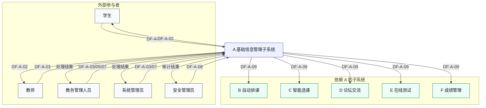
```mermaid
flowchart TB
    classDef actor fill:#f8fafc,stroke:#475569,color:#0f172a
    classDef core fill:#eef2ff,stroke:#4338ca,color:#111827
    classDef module fill:#ecfdf5,stroke:#047857,color:#111827

    subgraph actors["外部参与者"]
        direction LR
        student["学生"]
        teacher["教师"]
        academicAdmin["教务管理人员"]
        systemAdmin["系统管理员"]
        securityAdmin["安全管理员"]
    end

    A["A 基础信息管理子系统"]

    subgraph consumers["依赖 A 的子系统"]
        direction LR
        B["B 自动排课"]
        C["C 智能选课"]
        D["D 论坛交流"]
        E["E 在线测试"]
        F["F 成绩管理"]
    end

    student -- "DF-A-01" --> A
    teacher -- "DF-A-01" --> A
    academicAdmin -- "DF-A-03/05/07" --> A
    systemAdmin -- "DF-A-03/07" --> A
    securityAdmin -- "DF-A-08" --> A

    A -- "DF-A-02" --> student
    A -- "DF-A-02" --> teacher
    A -- "处理结果" --> academicAdmin
    A -- "处理结果" --> systemAdmin
    A -- "审计结果" --> securityAdmin

    A -- "DF-A-09" --> B
    A -- "DF-A-09" --> C
    A -- "DF-A-09" --> D
    A -- "DF-A-09" --> E
    A -- "DF-A-09" --> F

    class student,teacher,academicAdmin,systemAdmin,securityAdmin actor
    class A core
    class B,C,D,E,F module
```

#### 4.4.2 0 层 DFD

`FIG-4-02` A 子系统 0 层 DFD。

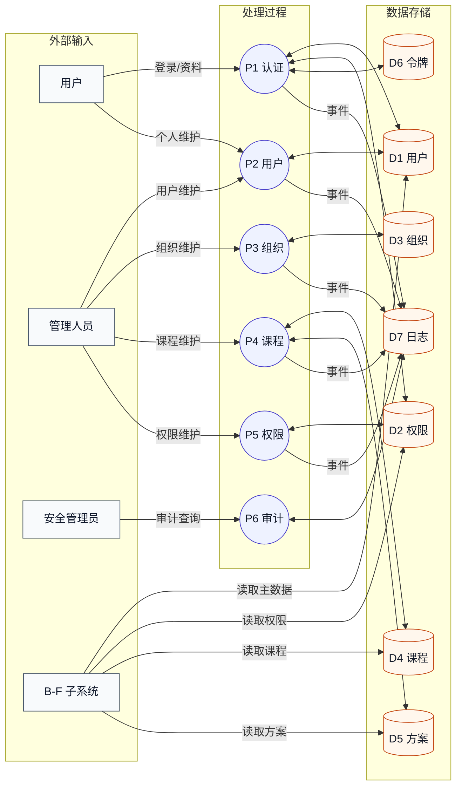
```mermaid
flowchart LR
    classDef external fill:#f8fafc,stroke:#475569,color:#0f172a
    classDef process fill:#eef2ff,stroke:#4338ca,color:#111827
    classDef store fill:#fff7ed,stroke:#c2410c,color:#111827

    subgraph E["外部输入"]
        direction TB
        U["用户"]
        M["管理人员"]
        S["安全管理员"]
        X["B-F 子系统"]
    end

    subgraph P["处理过程"]
        direction TB
        P1(("P1 认证"))
        P2(("P2 用户"))
        P3(("P3 组织"))
        P4(("P4 课程"))
        P5(("P5 权限"))
        P6(("P6 审计"))
    end

    subgraph D["数据存储"]
        direction TB
        D1[("D1 用户")]
        D2[("D2 权限")]
        D3[("D3 组织")]
        D4[("D4 课程")]
        D5[("D5 方案")]
        D6[("D6 令牌")]
        D7[("D7 日志")]
    end

    U -- "登录/资料" --> P1
    U -- "个人维护" --> P2
    M -- "用户维护" --> P2
    M -- "组织维护" --> P3
    M -- "课程维护" --> P4
    M -- "权限维护" --> P5
    S -- "审计查询" --> P6

    P1 <--> D1
    P1 <--> D2
    P1 <--> D6
    P2 <--> D1
    P3 <--> D3
    P4 <--> D4
    P4 <--> D5
    P5 <--> D2
    P6 <--> D7

    P1 -- "事件" --> D7
    P2 -- "事件" --> D7
    P3 -- "事件" --> D7
    P4 -- "事件" --> D7
    P5 -- "事件" --> D7

    X -- "读取主数据" --> D1
    X -- "读取权限" --> D2
    X -- "读取课程" --> D4
    X -- "读取方案" --> D5

    class U,M,S,X external
    class P1,P2,P3,P4,P5,P6 process
    class D1,D2,D3,D4,D5,D6,D7 store
```

#### 4.4.3 关键数据流说明

| 数据流编号 | 来源                   | 目标                   | 数据内容                                                        |
| ---------- | ---------------------- | ---------------------- | --------------------------------------------------------------- |
| `DF-A-01`  | 用户                   | 认证与会话管理         | 用户名、密码、来源 IP、User-Agent                               |
| `DF-A-02`  | 认证与会话管理         | 用户                   | 访问令牌、刷新令牌、用户资料、角色、权限                        |
| `DF-A-03`  | 管理员                 | 用户与个人信息管理     | 用户资料、角色、状态、批量导入数据                              |
| `DF-A-04`  | 用户与个人信息管理     | 用户库                 | 用户基础表和学生/教师/管理员扩展表                              |
| `DF-A-05`  | 管理员                 | 课程与培养方案基础管理 | 课程、先修关系、培养方案、方案课程                              |
| `DF-A-06`  | 课程与培养方案基础管理 | 课程库/培养方案库      | 课程目录、培养方案及课程组成                                    |
| `DF-A-07`  | 角色权限管理           | 角色权限库             | 用户角色关系和角色权限关系                                      |
| `DF-A-08`  | 各处理过程             | 系统日志库             | 操作人、操作类型、资源类型、资源 ID、IP、User-Agent、详情、时间 |
| `DF-A-09`  | A 子系统数据存储       | B-F 子系统             | 用户、角色、课程、培养方案等只读基础数据                        |

### 4.5 状态图（State Diagrams）

#### 4.5.1 用户账号状态图

`FIG-4-03` 用户账号状态图。

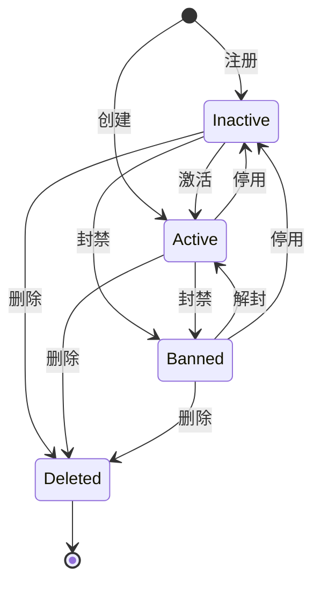
```mermaid
stateDiagram-v2
    [*] --> Inactive: 注册
    [*] --> Active: 创建
    Inactive --> Active: 激活
    Inactive --> Banned: 封禁
    Active --> Banned: 封禁
    Active --> Inactive: 停用
    Banned --> Active: 解封
    Banned --> Inactive: 停用
    Inactive --> Deleted: 删除
    Active --> Deleted: 删除
    Banned --> Deleted: 删除
    Deleted --> [*]
```

状态约束：

- `Inactive` 用户不得登录，允许通过有效激活令牌转为 `Active`。
- `Active` 用户可登录并按权限访问系统。
- `Banned` 或禁用用户不得登录，也不得刷新访问令牌。
- `Deleted` 表示用户被删除或逻辑失效，不再参与认证和业务引用。

#### 4.5.2 登录与令牌状态图

`FIG-4-04` 登录与令牌状态图。

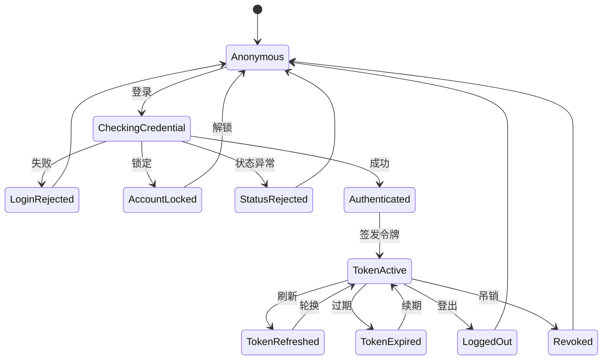
```mermaid
stateDiagram-v2
    [*] --> Anonymous
    Anonymous --> CheckingCredential: 登录
    CheckingCredential --> LoginRejected: 失败
    CheckingCredential --> AccountLocked: 锁定
    CheckingCredential --> StatusRejected: 状态异常
    CheckingCredential --> Authenticated: 成功
    Authenticated --> TokenActive: 签发令牌
    TokenActive --> TokenRefreshed: 刷新
    TokenRefreshed --> TokenActive: 轮换
    TokenActive --> TokenExpired: 过期
    TokenExpired --> TokenActive: 续期
    TokenActive --> LoggedOut: 登出
    TokenActive --> Revoked: 吊销
    LoggedOut --> Anonymous
    Revoked --> Anonymous
    AccountLocked --> Anonymous: 解锁
    LoginRejected --> Anonymous
    StatusRejected --> Anonymous
```

#### 4.5.3 密码重置流程状态图

`FIG-4-05` 密码重置状态图。

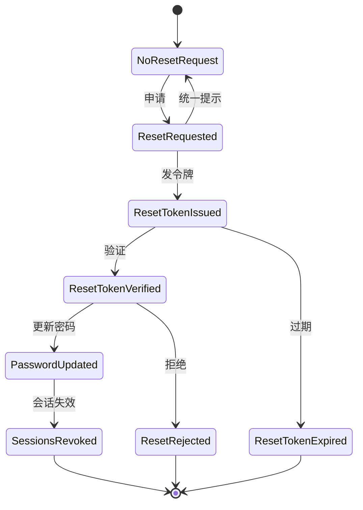
```mermaid
stateDiagram-v2
    [*] --> NoResetRequest
    NoResetRequest --> ResetRequested: 申请
    ResetRequested --> ResetTokenIssued: 发令牌
    ResetRequested --> NoResetRequest: 统一提示
    ResetTokenIssued --> ResetTokenVerified: 验证
    ResetTokenIssued --> ResetTokenExpired: 过期
    ResetTokenVerified --> PasswordUpdated: 更新密码
    ResetTokenVerified --> ResetRejected: 拒绝
    PasswordUpdated --> SessionsRevoked: 会话失效
    SessionsRevoked --> [*]
    ResetTokenExpired --> [*]
    ResetRejected --> [*]
```

### 4.6 类图与 CRC Cards（Class Diagrams and CRC Cards）

#### 4.6.1 分析类图

A 子系统分析类按职责拆分为三个视图：身份与权限、组织与课程、令牌与审计。每张图只保留核心字段和关系，详细字段由 CRC Cards 补充。

类图箭头两端的数字表示对象之间的数量关系：

| 标注   | 含义                   | 示例说明                                                                   |
| ------ | ---------------------- | -------------------------------------------------------------------------- |
| `1`    | 必须且只能有 1 个      | 1 个 `Student` 必须对应 1 个 `User`。                                      |
| `0..1` | 可以没有，也最多 1 个  | 1 个 `User` 可以不是学生；如果是学生，则最多对应 1 条 `Student` 扩展信息。 |
| `0..*` | 可以没有，也可以有多条 | 1 个 `Role` 可以暂时没有用户，也可以分配给多个用户。                       |

**身份与权限视图**

`FIG-4-06` 身份与权限类图。

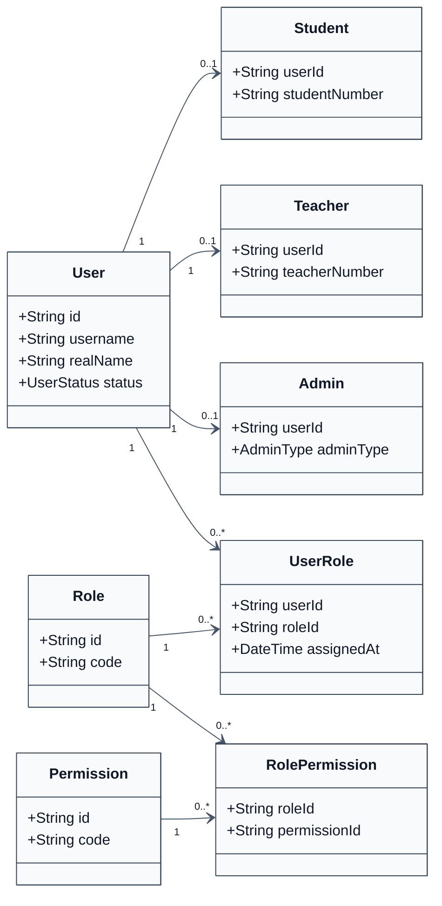
```mermaid
%%{init: {"theme": "base", "themeVariables": {"fontSize": "16px", "fontFamily": "Arial", "primaryColor": "#f8fafc", "primaryTextColor": "#111827", "primaryBorderColor": "#334155", "lineColor": "#475569", "textColor": "#111827"}}}%%
classDiagram
    direction LR
    class User {
      +String id
      +String username
      +String realName
      +UserStatus status
    }

    class Student {
      +String userId
      +String studentNumber
    }

    class Teacher {
      +String userId
      +String teacherNumber
    }

    class Admin {
      +String userId
      +AdminType adminType
    }

    class Role {
      +String id
      +String code
    }

    class Permission {
      +String id
      +String code
    }

    class UserRole {
      +String userId
      +String roleId
      +DateTime assignedAt
    }

    class RolePermission {
      +String roleId
      +String permissionId
    }

    User "1" --> "0..1" Student
    User "1" --> "0..1" Teacher
    User "1" --> "0..1" Admin
    User "1" --> "0..*" UserRole
    Role "1" --> "0..*" UserRole
    Role "1" --> "0..*" RolePermission
    Permission "1" --> "0..*" RolePermission

```

| 关系                            | 数量说明      | 业务含义                           |
| ------------------------------- | ------------- | ---------------------------------- |
| `User` - `Student`              | `1` 对 `0..1` | 一个账号最多有一份学生扩展信息。   |
| `User` - `Teacher`              | `1` 对 `0..1` | 一个账号最多有一份教师扩展信息。   |
| `User` - `Admin`                | `1` 对 `0..1` | 一个账号最多有一份管理员扩展信息。 |
| `User` - `UserRole`             | `1` 对 `0..*` | 一个账号可拥有多个角色。           |
| `Role` - `UserRole`             | `1` 对 `0..*` | 一个角色可分配给多个账号。         |
| `Role` - `RolePermission`       | `1` 对 `0..*` | 一个角色可包含多个权限。           |
| `Permission` - `RolePermission` | `1` 对 `0..*` | 一个权限可被多个角色复用。         |

**组织与课程视图**

`FIG-4-07` 组织与课程类图。

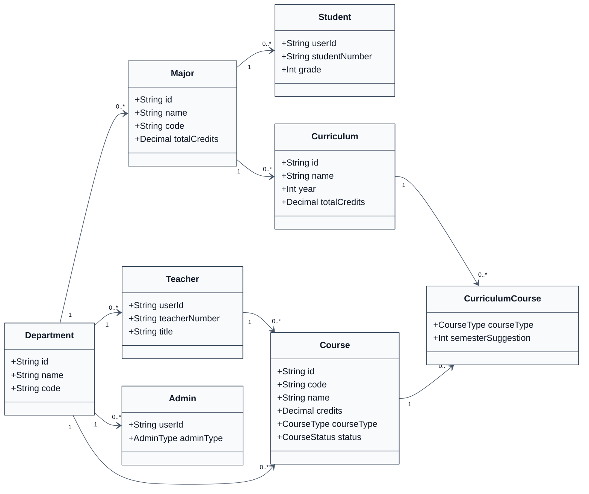
```mermaid
%%{init: {"theme": "base", "themeVariables": {"fontSize": "16px", "fontFamily": "Arial", "primaryColor": "#f8fafc", "primaryTextColor": "#111827", "primaryBorderColor": "#334155", "lineColor": "#475569", "textColor": "#111827"}}}%%
classDiagram
    direction LR
    class Department {
      +String id
      +String name
      +String code
    }

    class Major {
      +String id
      +String name
      +String code
      +Decimal totalCredits
    }

    class Student {
      +String userId
      +String studentNumber
      +Int grade
    }

    class Teacher {
      +String userId
      +String teacherNumber
      +String title
    }

    class Admin {
      +String userId
      +AdminType adminType
    }

    class Course {
      +String id
      +String code
      +String name
      +Decimal credits
      +CourseType courseType
      +CourseStatus status
    }

    class Curriculum {
      +String id
      +String name
      +Int year
      +Decimal totalCredits
    }

    class CurriculumCourse {
      +CourseType courseType
      +Int semesterSuggestion
    }

    Department "1" --> "0..*" Major
    Department "1" --> "0..*" Teacher
    Department "1" --> "0..*" Admin
    Department "1" --> "0..*" Course
    Major "1" --> "0..*" Student
    Major "1" --> "0..*" Curriculum
    Teacher "1" --> "0..*" Course
    Course "1" --> "0..*" CurriculumCourse
    Curriculum "1" --> "0..*" CurriculumCourse

```

| 关系                              | 数量说明      | 业务含义                               |
| --------------------------------- | ------------- | -------------------------------------- |
| `Department` - `Major`            | `1` 对 `0..*` | 一个院系可设置多个专业。               |
| `Department` - `Teacher`          | `1` 对 `0..*` | 一个院系可归属多名教师。               |
| `Department` - `Course`           | `1` 对 `0..*` | 一个院系可管理多门课程。               |
| `Major` - `Student`               | `1` 对 `0..*` | 一个专业可包含多个学生。               |
| `Major` - `Curriculum`            | `1` 对 `0..*` | 一个专业可有多个年级或版本的培养方案。 |
| `Course` - `CurriculumCourse`     | `1` 对 `0..*` | 一门课程可出现在多个培养方案中。       |
| `Curriculum` - `CurriculumCourse` | `1` 对 `0..*` | 一个培养方案由多门课程组成。           |

**令牌与审计视图**

`FIG-4-08` 令牌与审计类图。

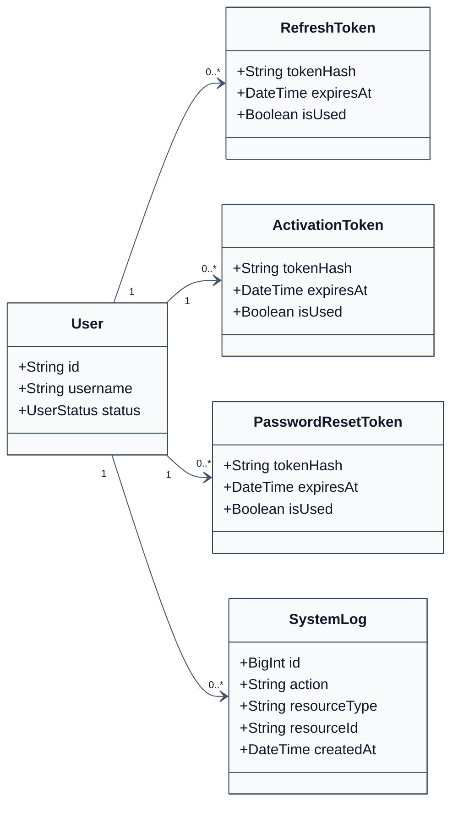
```mermaid
%%{init: {"theme": "base", "themeVariables": {"fontSize": "16px", "fontFamily": "Arial", "primaryColor": "#f8fafc", "primaryTextColor": "#111827", "primaryBorderColor": "#334155", "lineColor": "#475569", "textColor": "#111827"}}}%%
classDiagram
    direction LR
    class User {
      +String id
      +String username
      +UserStatus status
    }

    class RefreshToken {
      +String tokenHash
      +DateTime expiresAt
      +Boolean isUsed
    }

    class ActivationToken {
      +String tokenHash
      +DateTime expiresAt
      +Boolean isUsed
    }

    class PasswordResetToken {
      +String tokenHash
      +DateTime expiresAt
      +Boolean isUsed
    }

    class SystemLog {
      +BigInt id
      +String action
      +String resourceType
      +String resourceId
      +DateTime createdAt
    }

    User "1" --> "0..*" RefreshToken
    User "1" --> "0..*" ActivationToken
    User "1" --> "0..*" PasswordResetToken
    User "1" --> "0..*" SystemLog

```

| 关系                          | 数量说明      | 业务含义                                                     |
| ----------------------------- | ------------- | ------------------------------------------------------------ |
| `User` - `RefreshToken`       | `1` 对 `0..*` | 一个用户可拥有多个登录会话或历史刷新令牌。                   |
| `User` - `ActivationToken`    | `1` 对 `0..*` | 一个用户可能产生多个激活令牌记录，但有效令牌受安全规则限制。 |
| `User` - `PasswordResetToken` | `1` 对 `0..*` | 一个用户可能产生多条密码重置记录，旧令牌应失效。             |
| `User` - `SystemLog`          | `1` 对 `0..*` | 一个用户可产生多条登录、修改、审计日志。                     |

#### 4.6.2 CRC Cards

CRC Cards 用于补充类图中不适合直接展开的职责说明。每张卡片保持三列：Class、Responsibilities、Collaborators。

`TAB-4-01` 身份与权限 CRC Cards。

| Class            | Responsibilities                                                                     | Collaborators                                       |
| ---------------- | ------------------------------------------------------------------------------------ | --------------------------------------------------- |
| `User`           | 保存账号基础信息、认证状态和个人资料；作为学生、教师、管理员扩展信息的统一身份入口。 | `Student`、`Teacher`、`Admin`、`UserRole`、认证服务 |
| `Student`        | 保存学号、专业、年级、班级；为选课、测试和成绩管理提供学生身份。                     | `User`、`Major`、C/E/F 子系统                       |
| `Teacher`        | 保存工号、院系、职称、办公地点；为排课、测试和成绩录入提供教师身份。                 | `User`、`Department`、`Course`、B/E/F 子系统        |
| `Admin`          | 保存管理员类型和所属部门；区分教务、超级、安全等管理职责。                           | `User`、`Department`、`Role`、`SystemLog`           |
| `Role`           | 表示用户角色；聚合一组权限并通过关联表分配给用户。                                   | `UserRole`、`RolePermission`、`Permission`          |
| `Permission`     | 表示资源动作级权限；支持后端访问控制校验。                                           | `RolePermission`、权限校验服务                      |
| `UserRole`       | 保存用户与角色的多对多关系和分配时间。                                               | `User`、`Role`                                      |
| `RolePermission` | 保存角色与权限的多对多关系。                                                         | `Role`、`Permission`                                |

`TAB-4-02` 组织与课程 CRC Cards。

| Class              | Responsibilities                                                   | Collaborators                                           |
| ------------------ | ------------------------------------------------------------------ | ------------------------------------------------------- |
| `Department`       | 维护院系名称、代码和描述；组织专业、教师、管理员和课程。           | `Major`、`Teacher`、`Admin`、`Course`                   |
| `Major`            | 维护专业名称、代码、学位类型和总学分要求；组织学生和培养方案。     | `Department`、`Student`、`Curriculum`                   |
| `Course`           | 维护课程目录、学分、学时、类别、容量、负责人、考核方式和先修关系。 | `Department`、`Teacher`、`CurriculumCourse`、B-F 子系统 |
| `Curriculum`       | 维护专业培养方案、适用年级和学分结构。                             | `Major`、`CurriculumCourse`、`Course`                   |
| `CurriculumCourse` | 表示培养方案和课程的关联；保存课程类型和建议修读学期。             | `Curriculum`、`Course`                                  |

`TAB-4-03` 令牌与审计 CRC Cards。

| Class                | Responsibilities                                                 | Collaborators                                        |
| -------------------- | ---------------------------------------------------------------- | ---------------------------------------------------- |
| `RefreshToken`       | 保存刷新令牌哈希、过期时间和使用状态；支持会话续期和令牌吊销。   | `User`、认证服务                                     |
| `ActivationToken`    | 保存账号激活令牌哈希、过期时间和使用状态。                       | `User`、认证服务                                     |
| `PasswordResetToken` | 保存密码重置令牌哈希、过期时间和使用状态。                       | `User`、认证服务、邮件服务                           |
| `SystemLog`          | 记录关键操作的用户、动作、资源、来源、详情和时间；支持审计追踪。 | `User`、用户管理服务、权限服务、课程服务、安全管理员 |

### 4.7 非功能需求与约束

| 编号       | 分类         | 非功能需求                                                                                                               |
| ---------- | ------------ | ------------------------------------------------------------------------------------------------------------------------ |
| `NFR-A-01` | 安全性       | 所有非公开接口必须要求认证；涉及用户、角色、课程、培养方案和日志的管理接口必须执行角色或权限校验。                       |
| `NFR-A-02` | 密码安全     | 密码不得明文存储或明文输出；密码策略至少要求 8 位且包含大小写字母和数字。                                                |
| `NFR-A-03` | 令牌安全     | 刷新令牌必须哈希存储，一次刷新后旧刷新令牌立即失效；密码修改、密码重置、角色变更后应吊销相关刷新令牌。                   |
| `NFR-A-04` | 登录防护     | 同一用户名和来源地址在 5 分钟内连续失败 5 次后，应锁定 15 分钟或采用等效保护策略。                                       |
| `NFR-A-05` | 权限最小化   | 学生、教师、教务管理员、系统管理员之间的权限应按职责最小授权，不得因前端隐藏按钮替代后端权限校验。                       |
| `NFR-A-06` | 审计性       | 用户创建、删除、状态变更、角色变更、密码重置、课程变更、培养方案变更等关键操作必须记录日志。                             |
| `NFR-A-07` | 日志保密     | 系统日志不得包含明文密码、明文刷新令牌、激活令牌、重置令牌或其他完整敏感凭据。                                           |
| `NFR-A-08` | 数据一致性   | 用户和学生/教师/管理员扩展信息、课程和先修关系、培养方案和方案课程应在同一业务操作中保持一致，失败时不得写入半成品数据。 |
| `NFR-A-09` | 引用完整性   | 删除院系、专业、课程、培养方案、用户前应检查关键引用关系，避免其他子系统出现悬空引用。                                   |
| `NFR-A-10` | 可追踪性     | 每项核心功能需求应能追踪到至少一个验证标准，主要需求追踪覆盖率应达到 90% 以上。                                          |
| `NFR-A-11` | 性能         | 用户、课程、专业、培养方案、日志列表应支持分页查询；默认分页大小应合理，单页最大数量不超过 100。                         |
| `NFR-A-12` | 批量操作约束 | 批量创建或批量更新用户应设置单次数量上限，避免一次请求导致数据库和审计日志压力过大。                                     |
| `NFR-A-13` | 可用性       | 表单校验错误应指出具体字段和原因；批量操作应返回每个失败项的原因。                                                       |
| `NFR-A-14` | 跨系统一致性 | B-F 子系统使用的用户、课程和培养方案数据应来自 A 子系统主数据，不得自行定义冲突字段或状态含义。                          |
| `NFR-A-15` | 隐私保护     | 普通用户只能查看本人敏感资料；管理员查看他人资料应受权限约束并保留审计能力。                                             |

### 4.8 验证标准（Validation Criteria）

| 编号      | 覆盖需求                                                | 验证标准                                                                                                                                     |
| --------- | ------------------------------------------------------- | -------------------------------------------------------------------------------------------------------------------------------------------- |
| `VC-A-01` | `FR-A-01` 至 `FR-A-04`                                  | 使用具备权限的管理员创建学生、教师账号时，系统能保存基础字段和扩展字段；重复用户名、邮箱、学号或工号时返回冲突错误。                         |
| `VC-A-02` | `FR-A-05`、`FR-A-06`                                    | 构造至少 20 个不同角色和状态的用户，按分页、关键字、状态、角色查询时返回结果与条件一致，详情页包含角色和扩展信息。                           |
| `VC-A-03` | `FR-A-07`、`FR-A-15`                                    | 普通用户只能修改本人允许字段；尝试修改本人角色、状态、用户名、学号、工号或他人资料时被拒绝。                                                 |
| `VC-A-04` | `FR-A-08`、`NFR-A-09`                                   | 超级管理员删除用户后，该用户无法登录，相关刷新令牌失效；无权限用户删除时返回权限错误。                                                       |
| `VC-A-05` | `FR-A-09`、`FR-A-48`                                    | 将用户置为未激活、封禁或禁用后，使用正确密码登录和刷新令牌均被拒绝；恢复启用后可按权限登录。                                                 |
| `VC-A-06` | `FR-A-10`、`FR-A-11`、`NFR-A-12`                        | 批量创建和批量状态/角色更新在数量限制内返回成功、失败统计；超过上限或包含不存在用户时返回明确错误。                                          |
| `VC-A-07` | `FR-A-13`、`FR-A-14`                                    | 学生、教师、管理员登录后均可查看本人信息并修改邮箱、手机号、头像、性别等允许字段。                                                           |
| `VC-A-08` | `FR-A-16`、`FR-A-17`、`NFR-A-02`                        | 修改密码时旧密码错误、新密码弱口令、新旧密码相同均失败；成功修改后旧刷新令牌无法继续刷新。                                                   |
| `VC-A-09` | `FR-A-18`、`FR-A-19`                                    | 忘记密码接口对存在和不存在邮箱返回统一提示；有效重置令牌可重置一次，过期或重复使用令牌失败。                                                 |
| `VC-A-10` | `FR-A-21` 至 `FR-A-29`                                  | 管理员可创建、查询、更新课程和先修关系；课程代码重复、无效先修课程、非法学分、非法容量或删除被引用课程时被拒绝。                             |
| `VC-A-11` | `FR-A-30` 至 `FR-A-38`                                  | 未认证访问受保护接口返回认证错误；普通学生访问用户列表、日志、课程创建等管理接口返回权限错误；管理员权限范围内访问成功。                     |
| `VC-A-12` | `FR-A-34` 至 `FR-A-36`                                  | 角色分配后用户权限立即变化且旧令牌失效；非超级管理员分配超级管理员角色失败；管理员撤销自己的最后一个管理员角色失败。                         |
| `VC-A-13` | `FR-A-39`、`FR-A-40`、`NFR-A-03`                        | 登录后获得访问令牌和刷新令牌；刷新成功后旧刷新令牌不可重复使用；过期、伪造、已撤销刷新令牌均失败。                                           |
| `VC-A-14` | `FR-A-43`、`FR-A-44`、`NFR-A-04`                        | 使用弱密码注册、创建用户或重置密码时失败；同一用户名和来源地址连续失败达到阈值后短时间内登录被锁定。                                         |
| `VC-A-15` | `FR-A-41`、`FR-A-46`、`FR-A-47`、`NFR-A-06`、`NFR-A-07` | 执行登录、密码修改、用户状态变更、角色变更、课程变更、培养方案变更后，日志列表可按用户、操作、资源、时间查到记录，且日志中无明文密码或令牌。 |
| `VC-A-16` | `FR-A-49` 至 `FR-A-54`                                  | 管理员可创建、查询、更新院系和专业；院系代码、专业代码冲突被拒绝；存在专业、教师或学生关联时删除被拒绝。                                     |
| `VC-A-17` | `FR-A-55` 至 `FR-A-58`                                  | 管理员可创建培养方案并添加课程；方案详情展示总学分、必修/选修学分和课程列表；添加不存在课程或重复课程时被拒绝。                              |
| `VC-A-18` | `NFR-A-08`                                              | 在创建用户、课程、培养方案等多表操作中人为触发中途失败，数据库不应留下不完整的主表或关联表记录。                                             |
| `VC-A-19` | `NFR-A-11`、`NFR-A-13`                                  | 用户、课程、专业、培养方案、日志列表均支持分页；超过最大分页大小时被限制或返回校验错误；字段错误时返回具体字段原因。                         |
| `VC-A-20` | `NFR-A-14`                                              | B-F 子系统读取用户、课程或培养方案数据时，字段含义、状态枚举和角色名称与 A 子系统文档保持一致。                                              |

#### 4.8.1 需求追踪矩阵

| 功能域           | 需求编号               | 验证编号                                     |
| ---------------- | ---------------------- | -------------------------------------------- |
| 用户创建与维护   | `FR-A-01` 至 `FR-A-12` | `VC-A-01` 至 `VC-A-06`、`VC-A-15`、`VC-A-18` |
| 个人资料与密码   | `FR-A-13` 至 `FR-A-20` | `VC-A-07` 至 `VC-A-09`、`VC-A-14`、`VC-A-15` |
| 课程基础信息     | `FR-A-21` 至 `FR-A-29` | `VC-A-10`、`VC-A-15`、`VC-A-18`、`VC-A-20`   |
| 权限管理         | `FR-A-30` 至 `FR-A-38` | `VC-A-11`、`VC-A-12`、`VC-A-15`              |
| 安全管理         | `FR-A-39` 至 `FR-A-48` | `VC-A-13` 至 `VC-A-15`                       |
| 院系专业培养方案 | `FR-A-49` 至 `FR-A-58` | `VC-A-16`、`VC-A-17`、`VC-A-18`、`VC-A-20`   |

---

## 5. 子系统 B：自动排课需求

### 5.1 子系统目标与边界

自动排课子系统是 STSS 中负责“教室资源维护 + 排课结果生成 + 课表查询输出”的执行层子系统。B 模块在课程开设、学期、教师和教室等基础数据已经存在的前提下，为教务管理人员提供排课创建、冲突校验、手动调课和课表发布能力，同时为教师和学生提供课表查询能力。

#### 5.1.1 建设目标

| 编号        | 目标             | 说明                                                                     |
| ----------- | ---------------- | ------------------------------------------------------------------------ |
| `GOAL-B-01` | 统一教室资源管理 | 为排课提供教室基础资料维护、状态管理、容量管理和设备描述能力。           |
| `GOAL-B-02` | 统一排课结果生成 | 基于课程开设、教室和时间资源生成可执行的排课结果。                       |
| `GOAL-B-03` | 统一冲突校验     | 在保存前完成教室状态、容量与时间重叠检测，避免无效排课写入。             |
| `GOAL-B-04` | 统一课表查询     | 为教务管理人员、教师和学生提供按学期、按教室、按课程开设查询课表的能力。 |
| `GOAL-B-05` | 支持人工调整     | 在自动排课基础上保留人工调课、撤销和重新校验能力，满足教务实际操作。     |
| `GOAL-B-06` | 结果可追踪       | 排课结果、冲突结果和调整记录应可回溯，便于后续审计与问题定位。           |

#### 5.1.2 范围内能力

- 教室信息管理：新增、编辑、查询、删除教室，维护教学楼、校区、房间号、容量、类型、设备和状态。
- 可用教室查询：根据指定时间段、容量、校区和教室类型筛选可排课教室，并排除冲突资源。
- 排课预校验：在写入前完成课程开设存在性、教室状态、容量和时间冲突检查。
- 排课结果管理：新增、更新、删除、查询排课记录，并保留必要的备注信息。
- 自动排课：根据业务约束批量生成排课建议或正式排课结果。
- 手动调课：支持对既有排课进行时间或教室调整，并重新执行冲突校验。
- 课表查询：支持按课程开设、按教室、按学期查询课表，并输出适合前端渲染的数据结构。

#### 5.1.3 范围外能力

| 不属于 B 子系统的内容                    | 归属                     | 边界说明                                                 |
| ---------------------------------------- | ------------------------ | -------------------------------------------------------- |
| 课程基础信息维护、课程代码与课程属性管理 | A 子系统                 | B 只读取课程开设与课程基础信息，不定义课程主数据。       |
| 学期、课程开设、教师编排基础数据维护     | A 子系统或共享基础数据层 | B 依赖这些基础对象进行排课，不负责其生命周期管理。       |
| 培养方案审批、课程可选范围维护           | C 子系统                 | B 可读取培养方案相关数据用于课表展示，但不负责选课规则。 |
| 选课确认、容量占用、退选处理             | C 子系统                 | B 只提供排课结果，不管理学生选课状态。                   |
| 公告、交流、帖子与评论                   | D 子系统                 | B 仅为课表展示提供时间基础，不处理交流业务。             |
| 成绩录入、成绩分析与 GPA 统计            | F 子系统                 | B 只提供课程安排与课表查询，不负责成绩结果。             |

#### 5.1.4 与其他子系统的数据依赖

| 数据对象         | B 子系统职责                                 | 主要消费者                         |
| ---------------- | -------------------------------------------- | ---------------------------------- |
| `Classroom`      | 维护教室基础资料、容量、类型、设备和状态     | 教务管理人员、教师、学生、排课引擎 |
| `Schedule`       | 维护课程开设对应的排课结果、时间范围和备注   | 教务管理人员、教师、学生           |
| `CourseOffering` | 读取课程开设、任课教师和学期信息             | 自动排课、课表查询                 |
| `Semester`       | 读取学期范围、周次和学期归属信息             | 自动排课、课表查询                 |
| `Teacher`        | 读取任课教师基础信息                         | 教室排课、课表展示                 |
| `Course`         | 读取课程名称、学分、容量与基础属性           | 排课结果展示、资源筛选             |
| `A 模块主数据`   | 通过统一主数据提供课程、教师、组织等基础信息 | B 组全部功能                       |

#### 5.1.5 外部接口、依赖与假设

| 类型         | 对象                                                                                                                                                                                                                                                                                                                    | 需求口径                                                                                                              |
| ------------ | ----------------------------------------------------------------------------------------------------------------------------------------------------------------------------------------------------------------------------------------------------------------------------------------------------------------------- | --------------------------------------------------------------------------------------------------------------------- |
| 用户界面     | Web 浏览器                                                                                                                                                                                                                                                                                                              | 教务管理人员、排课管理员、教师和学生通过浏览器访问 B 子系统相关页面，界面应根据权限展示可执行操作。                   |
| 服务接口     | B 子系统 API                                                                                                                                                                                                                                                                                                            | B 子系统应向前端和其他子系统提供教室管理、可用教室查询、排课预校验、排课管理和课表查询能力。                          |
| 核心接口路径 | `/api/v1/course-arrangement/classrooms`、`/api/v1/course-arrangement/classrooms/{id}`、`/api/v1/course-arrangement/classrooms/available`、`/api/v1/course-arrangement/schedules`、`/api/v1/course-arrangement/schedules/{id}`、`/api/v1/course-arrangement/schedules/validate`、`/api/v1/course-arrangement/timetables` | 接口路径应与 B 模块接口规范保持一致，字段命名应尽量与数据模型和前端表单一致。                                         |
| 消息依赖     | 无显式强依赖                                                                                                                                                                                                                                                                                                            | B 子系统核心流程不依赖异步消息即可闭环，后续若扩展排课通知，可再对接通知能力。                                        |
| 会话依赖     | 令牌和权限服务                                                                                                                                                                                                                                                                                                          | 教室管理、排课创建、排课更新和删除等写操作必须携带登录态并通过权限校验。                                              |
| 数据依赖     | 主数据库                                                                                                                                                                                                                                                                                                                | 教室、排课、学期、冲突记录和相关审计信息应持久化保存。                                                                |
| 跨系统依赖   | A、C、D、E、F 子系统                                                                                                                                                                                                                                                                                                    | B 子系统读取 A 子系统主数据，不应自行维护冲突的课程、教师、角色和培养方案定义；课表结果供 C、D、E、F 子系统查询使用。 |

### 5.2 用户角色与用户场景（User Scenarios）

#### 5.2.1 角色定义

| 角色         | 角色代码建议     | 核心权限边界                                                  |
| ------------ | ---------------- | ------------------------------------------------------------- |
| 教务管理人员 | `academic_admin` | 维护教室、执行排课、查看冲突、手动调课、发布课表。            |
| 排课管理员   | `schedule_admin` | 与教务管理人员类似，重点负责排课配置、冲突处理和结果维护。    |
| 教师         | `teacher`        | 查看本人课表、查看教室可用性、参与排课结果确认。              |
| 学生         | `student`        | 仅读取学期课表、课程相关班级安排和公开的课表信息。            |
| 系统管理员   | `system_admin`   | 负责全局配置、权限审计和异常处理，可访问全部 B 模块管理能力。 |

#### 5.2.2 用户场景

| 编号      | 场景名称           | 主要参与者               | 前置条件                       | 主成功场景                                                                                   | 异常与约束                                                         |
| --------- | ------------------ | ------------------------ | ------------------------------ | -------------------------------------------------------------------------------------------- | ------------------------------------------------------------------ |
| `US-B-01` | 维护教室基础资料   | 教务管理人员、排课管理员 | 教室主数据未被锁定，登录态有效 | 管理人员录入或更新教室的教学楼、房间号、校区、容量、类型、设备和状态，系统保存后可供排课使用 | 房间号在同一教学楼和校区内重复时应拒绝保存；容量非法时拒绝提交。   |
| `US-B-02` | 查询可用教室       | 教务管理人员、教师       | 已输入目标星期、周次和节次范围 | 系统按时间、容量、校区和类型筛选教室，并排除状态不可用或存在冲突的教室                       | 参数缺失或时间范围非法时应返回校验错误。                           |
| `US-B-03` | 预校验排课方案     | 教务管理人员、排课管理员 | 课程开设、教室和学期数据已存在 | 用户提交排课信息后，系统检测教室状态、容量和时间冲突，并返回通过或冲突原因                   | 教室维护中、课程开设不存在或时间重叠时应返回冲突结果。             |
| `US-B-04` | 创建排课结果       | 教务管理人员、排课管理员 | 预校验通过                     | 管理人员提交排课信息后，系统写入 Schedule 并生成排课结果                                     | 保存前必须再次进行服务端校验；若发生并发冲突应返回 409。           |
| `US-B-05` | 调整既有排课       | 教务管理人员、排课管理员 | 已存在可编辑的排课记录         | 管理人员修改教室、周次或节次后，系统重新校验并更新排课结果                                   | 修改后产生冲突时应阻止保存，并返回冲突详情。                       |
| `US-B-06` | 查看本人或课程课表 | 教师、学生               | 用户已登录，且课表信息已发布   | 教师或学生按学期查询课表并查看周次、星期和节次安排                                           | 学生仅可访问可见范围内的课表，超范围数据不得返回。                 |
| `US-B-07` | 输出教室使用情况   | 教务管理人员             | 教室和排课数据已存在           | 用户按教室查询课表，系统输出该教室在指定学期内的使用明细                                     | 仅返回该教室相关数据，不得混入其他教室记录。                       |
| `US-B-08` | 处理自动排课失败   | 教务管理人员、系统管理员 | 自动排课任务已启动             | 系统返回失败原因、冲突清单和不可用资源，管理员可据此调整约束后重新执行                       | 若资源不足或约束过严，应明确标识无法排课的原因，而不是返回空结果。 |

### 5.3 功能需求

#### 5.3.1 教学资源管理功能

| 编号      | 功能需求                                                                                               | 优先级 |
| --------- | ------------------------------------------------------------------------------------------------------ | ------ |
| `FR-B-01` | 系统应支持教室基础信息的新增、查询、更新和删除，包括教学楼、房间号、校区、容量、教室类型、设备和状态。 | Must   |
| `FR-B-02` | 系统应支持分页查询教室列表，并支持按校区、教学楼、教室类型、状态和关键字筛选。                         | Must   |
| `FR-B-03` | 系统应支持查询教室详情，详情至少包含容量、类型、设备和状态，但不应强制拼接排课历史明细。               | Must   |
| `FR-B-04` | 系统应支持查询可用教室，并按指定星期、周次和节次范围排除状态不可用或存在时间冲突的教室。               | Must   |
| `FR-B-05` | 教室创建和更新时，系统应校验 `roomNumber` 在同一校区和教学楼范围内唯一。                               | Must   |
| `FR-B-06` | 教室创建和更新时，系统应校验容量大于 0，且 `roomType`、`status` 必须使用枚举值。                       | Must   |
| `FR-B-07` | 当教室状态为 `maintenance` 或 `unavailable` 时，系统应禁止将其作为新增或调整后的排课教室。             | Must   |
| `FR-B-08` | 系统应支持对教室设备信息进行保存和展示，设备字段应作为可扩展 JSON 数据透传。                           | Should |

#### 5.3.2 自动排课功能

| 编号      | 功能需求                                                                                       | 优先级 |
| --------- | ---------------------------------------------------------------------------------------------- | ------ |
| `FR-B-09` | 系统应支持对课程开设创建排课预校验，在保存前完成课程开设存在性、教室状态、容量和时间冲突检测。 | Must   |
| `FR-B-10` | 系统应支持生成自动排课结果，并在结果中记录课程开设、教室、星期、周次、节次和备注信息。         | Must   |
| `FR-B-11` | 系统应支持排课冲突检测，至少覆盖同一教室在相同周次和节次范围内的重叠冲突。                     | Must   |
| `FR-B-12` | 系统应支持对自动排课结果输出冲突清单和不可排原因，便于人工二次调整。                           | Must   |
| `FR-B-13` | 系统应支持按业务配置限制排课规则，例如教室容量下限、教室类型约束和可用状态约束。               | Should |
| `FR-B-14` | 系统应支持同一课程开设的多段排课或连堂排课场景，但彼此之间不得产生时间重叠。                   | Should |
| `FR-B-15` | 自动排课过程应尽量提升教室利用率，但不得以牺牲冲突校验和业务规则为代价。                       | Should |

#### 5.3.3 手动调课功能

| 编号      | 功能需求                                                                 | 优先级 |
| --------- | ------------------------------------------------------------------------ | ------ |
| `FR-B-16` | 系统应支持对既有排课记录进行更新，包括更换教室、调整星期、周次和节次。   | Must   |
| `FR-B-17` | 系统应支持在手动调课时重新执行服务端冲突校验，并在冲突时拒绝保存。       | Must   |
| `FR-B-18` | 系统应支持删除排课记录，删除后应保留必要的业务痕迹或审计记录。           | Must   |
| `FR-B-19` | 系统应支持对调课结果写入备注或调整原因，便于后续追踪和复核。             | Should |
| `FR-B-20` | 系统应支持对调课操作进行权限控制，普通教师不得修改非本人相关的排课记录。 | Must   |

#### 5.3.4 课表查询与打印功能

| 编号      | 功能需求                                                                                 | 优先级 |
| --------- | ---------------------------------------------------------------------------------------- | ------ |
| `FR-B-21` | 系统应支持按课程开设查询课表，返回该课程开设下的全部排课安排和基础摘要信息。             | Must   |
| `FR-B-22` | 系统应支持按教室查询课表，返回该教室在指定学期内的使用情况和排课明细。                   | Must   |
| `FR-B-23` | 系统应支持按学期查询课表，并按周次、星期和节次组织输出，便于前端周课表直接渲染。         | Must   |
| `FR-B-24` | 系统应支持课表导出或打印的需求，导出结果应与查询结果保持一致。                           | Should |
| `FR-B-25` | 系统应支持根据登录用户角色返回不同可见范围的数据，学生仅能查看与本人可见范围相关的课表。 | Must   |
| `FR-B-26` | 系统应支持列表和课表查询的分页或筛选能力，以适配教务场景下的大数据量查询。               | Should |

### 5.4 数据流图（Data Flow Diagram）

教室管理、排课校验、自动排课和课表查询共享同一套数据流。为保证图示清晰，以下仅展示 B 模块的核心上下文和内部处理过程。

| 图编号     | 图名称               | 用途                                                           |
| ---------- | -------------------- | -------------------------------------------------------------- |
| `FIG-5-01` | B 子系统上下文级 DFD | 展示教务管理人员、教师、学生与 B 子系统及其外部数据依赖关系。  |
| `FIG-5-02` | B 子系统 0 层 DFD    | 展示教室管理、排课校验、自动排课、手动调课和课表查询处理过程。 |
| `FIG-5-03` | 排课任务状态图       | 展示排课任务从草稿、校验、生成到发布的状态变化。               |
| `FIG-5-04` | 教室与排课类图       | 展示 Classroom、Schedule、CourseOffering 等核心类关系。        |

#### 5.4.1 上下文级 DFD

`FIG-5-01` B 子系统上下文级 DFD。

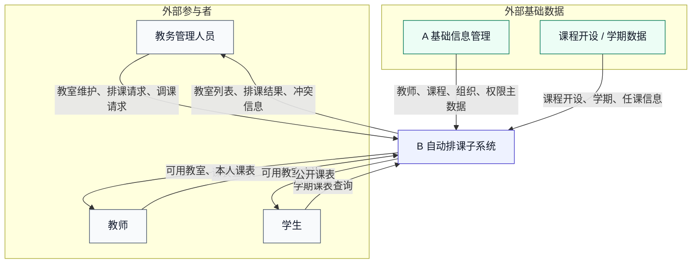
```mermaid
flowchart TB
    classDef actor fill:#f8fafc,stroke:#475569,color:#0f172a
    classDef core fill:#eef2ff,stroke:#4338ca,color:#111827
    classDef module fill:#ecfdf5,stroke:#047857,color:#111827

    subgraph actors["外部参与者"]
        direction LR
        academicAdmin["教务管理人员"]
        teacher["教师"]
        student["学生"]
    end

    B["B 自动排课子系统"]

    subgraph upstream["外部基础数据"]
        direction LR
        A["A 基础信息管理"]
        courseOffering["课程开设 / 学期数据"]
    end

    academicAdmin -- "教室维护、排课请求、调课请求" --> B
    teacher -- "课表查询、可用教室查询" --> B
    student -- "学期课表查询" --> B

    A -- "教师、课程、组织、权限主数据" --> B
    courseOffering -- "课程开设、学期、任课信息" --> B

    B -- "教室列表、排课结果、冲突信息" --> academicAdmin
    B -- "可用教室、本人课表" --> teacher
    B -- "公开课表" --> student

    class academicAdmin,teacher,student actor
    class B core
    class A,courseOffering module
```

#### 5.4.2 0 层 DFD

`FIG-5-02` B 子系统 0 层 DFD。

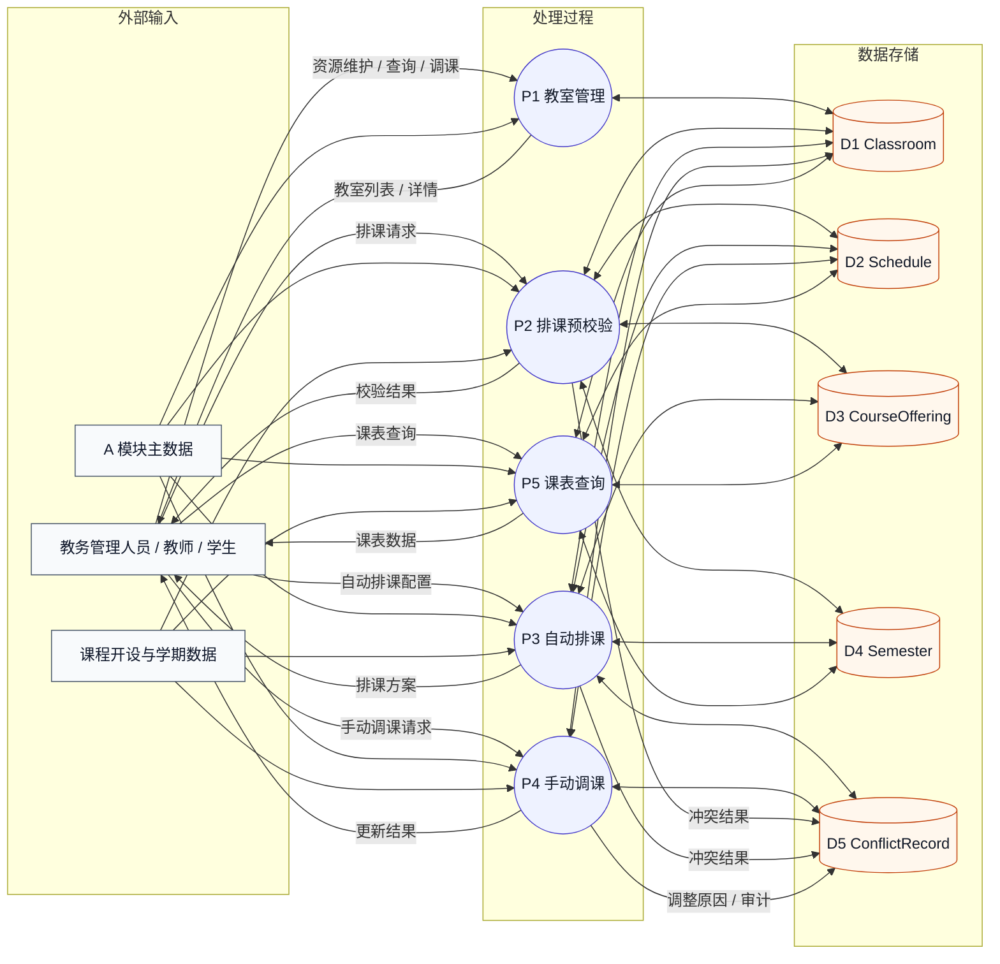
```mermaid
flowchart LR
    classDef external fill:#f8fafc,stroke:#475569,color:#0f172a
    classDef process fill:#eef2ff,stroke:#4338ca,color:#111827
    classDef store fill:#fff7ed,stroke:#c2410c,color:#111827

    subgraph E["外部输入"]
        direction TB
        U["教务管理人员 / 教师 / 学生"]
        X["A 模块主数据"]
        Y["课程开设与学期数据"]
    end

    subgraph P["处理过程"]
        direction TB
        P1(("P1 教室管理"))
        P2(("P2 排课预校验"))
        P3(("P3 自动排课"))
        P4(("P4 手动调课"))
        P5(("P5 课表查询"))
    end

    subgraph D["数据存储"]
        direction TB
        D1[("D1 Classroom")]
        D2[("D2 Schedule")]
        D3[("D3 CourseOffering")]
        D4[("D4 Semester")]
        D5[("D5 ConflictRecord")]
    end

    U -- "资源维护 / 查询 / 调课" --> P1
    U -- "排课请求" --> P2
    U -- "自动排课配置" --> P3
    U -- "手动调课请求" --> P4
    U -- "课表查询" --> P5

    X --> P1
    X --> P2
    X --> P3
    X --> P4
    X --> P5
    Y --> P2
    Y --> P3
    Y --> P4
    Y --> P5

    P1 <--> D1
    P2 <--> D1
    P2 <--> D2
    P2 <--> D3
    P2 <--> D4
    P3 <--> D1
    P3 <--> D2
    P3 <--> D3
    P3 <--> D4
    P3 <--> D5
    P4 <--> D1
    P4 <--> D2
    P4 <--> D5
    P5 <--> D1
    P5 <--> D2
    P5 <--> D3
    P5 <--> D4

    P2 -- "冲突结果" --> D5
    P3 -- "冲突结果" --> D5
    P4 -- "调整原因 / 审计" --> D5

    P1 -- "教室列表 / 详情" --> U
    P2 -- "校验结果" --> U
    P3 -- "排课方案" --> U
    P4 -- "更新结果" --> U
    P5 -- "课表数据" --> U

    class U,X,Y external
    class P1,P2,P3,P4,P5 process
    class D1,D2,D3,D4,D5 store
```

#### 5.4.3 关键数据流说明

| 数据流编号 | 来源         | 目标                       | 数据内容                                         |
| ---------- | ------------ | -------------------------- | ------------------------------------------------ |
| `DF-B-01`  | 教务管理人员 | 教室管理                   | 教学楼、房间号、校区、容量、类型、设备、状态     |
| `DF-B-02`  | 教室管理     | 教室数据存储               | 教室主数据、状态和设备信息                       |
| `DF-B-03`  | 教务管理人员 | 排课预校验                 | 课程开设 ID、教室 ID、星期、周次、节次、备注     |
| `DF-B-04`  | 排课预校验   | 冲突记录                   | 冲突类型、冲突时间段、冲突教室、冲突说明         |
| `DF-B-05`  | 自动排课     | 排课结果存储               | 课程开设、教室、星期、周次、节次、备注、任务编号 |
| `DF-B-06`  | 手动调课     | 排课结果存储               | 调整后的教室、时间、调整原因和审计信息           |
| `DF-B-07`  | 课表查询     | 教务管理人员 / 教师 / 学生 | 学期条件、课程开设条件、教室条件、分页参数       |
| `DF-B-08`  | 课表数据存储 | 查询结果                   | 周次、星期、节次、课程开设摘要、教室信息         |

### 5.5 状态图（State Diagrams）

#### 5.5.1 排课任务状态图

`FIG-5-03` 排课任务状态图。

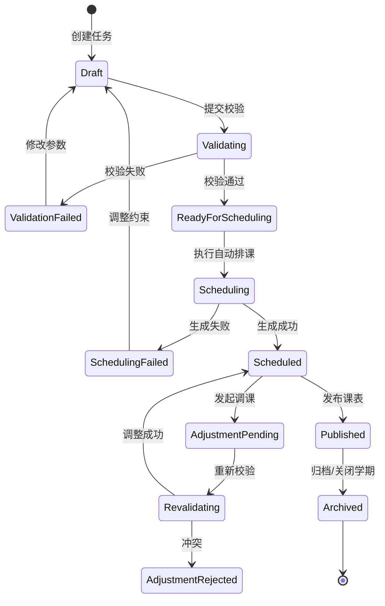
```mermaid
stateDiagram-v2
    [*] --> Draft: 创建任务
    Draft --> Validating: 提交校验
    Validating --> ValidationFailed: 校验失败
    Validating --> ReadyForScheduling: 校验通过
    ReadyForScheduling --> Scheduling: 执行自动排课
    Scheduling --> SchedulingFailed: 生成失败
    Scheduling --> Scheduled: 生成成功
    ValidationFailed --> Draft: 修改参数
    SchedulingFailed --> Draft: 调整约束
    Scheduled --> AdjustmentPending: 发起调课
    AdjustmentPending --> Revalidating: 重新校验
    Revalidating --> AdjustmentRejected: 冲突
    Revalidating --> Scheduled: 调整成功
    Scheduled --> Published: 发布课表
    Published --> Archived: 归档/关闭学期
    Archived --> [*]
```

状态约束：

- `Draft` 表示排课任务已创建但尚未执行校验。
- `Validating` 表示系统正在检查教室状态、容量和时间冲突。
- `ValidationFailed` 表示校验未通过，任务必须先调整后再执行。
- `Scheduled` 表示排课结果已生成但尚未发布。
- `Published` 表示课表已对教师或学生可见。
- `Archived` 表示学期结束后进入归档，原则上不再修改。

### 5.6 类图与 CRC Cards（Class Diagrams and CRC Cards）

#### 5.6.1 分析类图

`FIG-5-04` 教室与排课类图。

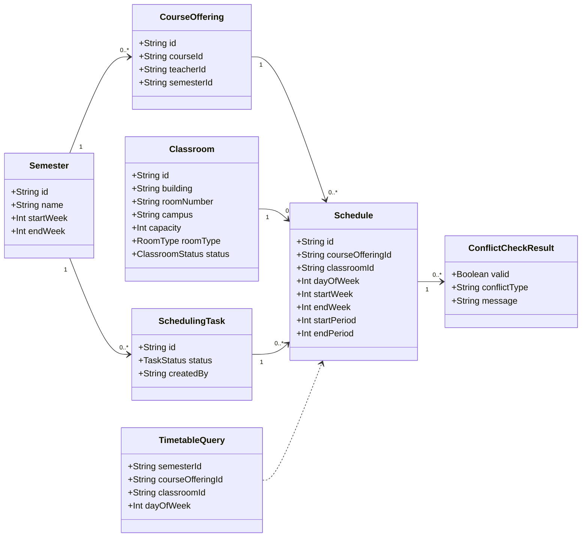
```mermaid
classDiagram
    direction LR

    class Classroom {
      +String id
      +String building
      +String roomNumber
      +String campus
      +Int capacity
      +RoomType roomType
      +ClassroomStatus status
    }

    class CourseOffering {
      +String id
      +String courseId
      +String teacherId
      +String semesterId
    }

    class Semester {
      +String id
      +String name
      +Int startWeek
      +Int endWeek
    }

    class Schedule {
      +String id
      +String courseOfferingId
      +String classroomId
      +Int dayOfWeek
      +Int startWeek
      +Int endWeek
      +Int startPeriod
      +Int endPeriod
    }

    class SchedulingTask {
      +String id
      +TaskStatus status
      +String createdBy
    }

    class ConflictCheckResult {
      +Boolean valid
      +String conflictType
      +String message
    }

    class TimetableQuery {
      +String semesterId
      +String courseOfferingId
      +String classroomId
      +Int dayOfWeek
    }

    CourseOffering "1" --> "0..*" Schedule
    Classroom "1" --> "0..*" Schedule
    Semester "1" --> "0..*" CourseOffering
    Semester "1" --> "0..*" SchedulingTask
    SchedulingTask "1" --> "0..*" Schedule
    Schedule "1" --> "0..*" ConflictCheckResult
    TimetableQuery ..> Schedule
```

#### 5.6.2 CRC Cards

`TAB-5-01` 教室与排课 CRC Cards。

| Class                 | Responsibilities                                                               | Collaborators                                         |
| --------------------- | ------------------------------------------------------------------------------ | ----------------------------------------------------- |
| `Classroom`           | 保存教室基础信息、容量、设备、状态和可用性条件；为排课和课表查询提供资源入口。 | `Schedule`、`ConflictCheckResult`、教室管理服务       |
| `CourseOffering`      | 保存课程开设、任课教师和学期信息；作为排课结果的业务载体。                     | `Schedule`、`Semester`、A 模块主数据                  |
| `Semester`            | 保存学期名称、起止周次和学期范围；为排课和课表查询提供时间边界。               | `CourseOffering`、`SchedulingTask`、`TimetableQuery`  |
| `Schedule`            | 保存排课结果、时间范围、教室归属和备注；支持查询、更新和删除。                 | `Classroom`、`CourseOffering`、`ConflictCheckResult`  |
| `SchedulingTask`      | 表示一次自动排课或调课任务，记录执行状态和发起人。                             | `Semester`、`Schedule`、`ConflictCheckResult`         |
| `ConflictCheckResult` | 保存冲突校验结果、冲突类型和提示信息，用于前端展示和复核。                     | `Schedule`、`Classroom`、`SchedulingTask`             |
| `TimetableQuery`      | 封装按学期、按教室、按课程开设的查询条件。                                     | `Schedule`、`CourseOffering`、`Classroom`、`Semester` |

### 5.7 非功能需求与约束

| 编号       | 分类     | 非功能需求                                                                               |
| ---------- | -------- | ---------------------------------------------------------------------------------------- |
| `NFR-B-01` | 正确性   | 排课写入前必须先执行服务端冲突校验，不能仅依赖前端预校验结果。                           |
| `NFR-B-02` | 一致性   | 教室状态、排课结果和课表查询结果应保持一致，状态变更后相关查询应及时反映。               |
| `NFR-B-03` | 冲突检测 | 同一教室在相同周次和节次范围内不得出现重叠排课；冲突提示应明确具体原因。                 |
| `NFR-B-04` | 可用性   | 教室状态为 `maintenance` 或 `unavailable` 时，系统不得返回其作为可排课资源。             |
| `NFR-B-05` | 性能     | 教室列表、可用教室和课表查询应支持分页与筛选，常规查询应保持可接受响应时间。             |
| `NFR-B-06` | 可调整性 | 自动排课结果应允许人工调整、撤销和重新校验，且调整后不能破坏已保存数据一致性。           |
| `NFR-B-07` | 可读性   | 课表查询结果应按周次、星期和节次组织，便于前端直接渲染周视图。                           |
| `NFR-B-08` | 可追踪性 | 自动排课和调课操作应记录任务状态、发起人、调整原因和冲突明细。                           |
| `NFR-B-09` | 数据约束 | 同一校区和教学楼范围内的房间号应保持唯一，容量必须大于 0，时间范围必须合法。             |
| `NFR-B-10` | 权限控制 | 教务管理人员和排课管理员可维护排课结果；教师仅能查询本人相关数据，学生仅能查询可见课表。 |

### 5.8 验证标准（Validation Criteria）

| 编号      | 覆盖需求                                     | 验证标准                                                                                                   |
| --------- | -------------------------------------------- | ---------------------------------------------------------------------------------------------------------- |
| `VC-B-01` | `FR-B-01` 至 `FR-B-08`                       | 创建、更新、查询和删除教室时，系统能正确保存基础字段和设备信息；同校区同教学楼下房间号重复时返回冲突错误。 |
| `VC-B-02` | `FR-B-04`、`FR-B-05`、`FR-B-06`、`FR-B-07`   | 将教室状态置为维护中或不可用后，该教室不再出现在可用教室列表中；容量为 0 或枚举非法时返回校验错误。        |
| `VC-B-03` | `FR-B-09`、`FR-B-11`、`NFR-B-01`、`NFR-B-03` | 对已存在排课时间段再次提交校验时，系统返回明确冲突类型和冲突教室信息；无冲突时返回通过。                   |
| `VC-B-04` | `FR-B-10`、`FR-B-12`、`FR-B-15`              | 执行自动排课任务后，系统能生成排课结果并输出冲突清单；资源不足时应给出不可排原因。                         |
| `VC-B-05` | `FR-B-13`、`FR-B-14`、`FR-B-16`、`FR-B-17`   | 调整排课教室或时间后，系统重新校验并保存；若调整后产生冲突，应返回 409 且不写入结果。                      |
| `VC-B-06` | `FR-B-18`、`FR-B-19`、`NFR-B-08`             | 删除或调整排课记录后，系统保留必要的审计痕迹和调整原因，便于后续追踪。                                     |
| `VC-B-07` | `FR-B-21`、`FR-B-22`、`FR-B-23`、`FR-B-25`   | 按课程开设、按教室和按学期查询课表时，返回结果与筛选条件一致；学生只能看到授权范围内的课表。               |
| `VC-B-08` | `FR-B-24`、`FR-B-26`、`NFR-B-05`、`NFR-B-07` | 课表查询支持分页和筛选，导出或打印结果与页面查询结果一致，且结果结构可直接用于周视图渲染。                 |

#### 5.8.1 需求追踪矩阵

| 功能域             | 需求编号               | 验证编号             |
| ------------------ | ---------------------- | -------------------- |
| 教室管理           | `FR-B-01` 至 `FR-B-08` | `VC-B-01`、`VC-B-02` |
| 排课校验与自动排课 | `FR-B-09` 至 `FR-B-15` | `VC-B-03`、`VC-B-04` |
| 手动调课与删除     | `FR-B-16` 至 `FR-B-20` | `VC-B-05`、`VC-B-06` |
| 课表查询与打印     | `FR-B-21` 至 `FR-B-26` | `VC-B-07`、`VC-B-08` |

---

## 6. 子系统 C：智能选课需求

### 6.1 子系统目标与边界

C 子系统负责学生在选课时间窗口内完成课程搜索、培养方案查看、选课、退选、结果查询和 AI 辅助决策；同时支持教师导出课程学生名单，支持教务管理人员维护选课阶段、处理特殊加课和控制系统并发。

| 项目     | 说明                                                                                                                                                 |
| -------- | ---------------------------------------------------------------------------------------------------------------------------------------------------- |
| 范围内   | 培养方案查看、课程检索、可选课程显示、选课/退选、容量与时间冲突校验、结果和课表查询、名单导出、选课阶段管理、特殊加课、限流与超时退出、AI 辅助建议。 |
| 范围外   | 用户权限与课程基础信息由 A 负责；课程时间和教室由 B 负责；论坛、在线测试、成绩管理分别由 D/E/F 负责。                                                |
| 主要数据 | `Curriculum`、`CurriculumCourse`、`Course`、`CourseOffering`、`Schedule`、`SelectionPeriod`、`Enrollment`、`CoursePrerequisite`。                    |

### 6.2 用户角色与用户场景（User Scenarios）

| 编号      | 场景           | 参与者       | 成功结果                                             |
| --------- | -------------- | ------------ | ---------------------------------------------------- |
| `US-C-01` | 查看培养方案   | 学生         | 查看本专业课程类别、建议学期与学分要求。             |
| `US-C-02` | 搜索课程       | 学生         | 按课程名或教师搜索课程并查看详情。                   |
| `US-C-03` | 选课/退选      | 学生         | 系统校验阶段、容量、冲突、先修和学分后更新选课记录。 |
| `US-C-04` | 查询结果与课表 | 学生         | 查看本人已选课程、状态和个人课表。                   |
| `US-C-05` | 导出名单       | 教师         | 导出本人课程学生名单到 Excel。                       |
| `US-C-06` | 管理选课       | 教务管理人员 | 设置选课阶段、手动加课、控制连接数。                 |
| `US-C-07` | AI 辅助选课    | 学生         | 获得推荐课程、理由和风险提示。                       |

### 6.3 功能需求

| 编号      | 功能需求                                                                                                   | 优先级 |
| --------- | ---------------------------------------------------------------------------------------------------------- | ------ |
| `FR-C-01` | 系统应根据学生专业和年级展示对应培养方案，包括总学分、必修/选修/公共课要求和建议修读学期。                 | Must   |
| `FR-C-02` | 系统应支持按课程名称、课程代码、教师姓名搜索课程开设，并展示课程详情、容量、已选人数、时间地点和先修要求。 | Must   |
| `FR-C-03` | 系统应根据培养方案和开课信息自动显示学生当前可选课程列表，并标明不可选原因。                               | Must   |
| `FR-C-04` | 系统仅允许在有效 `SelectionPeriod` 内选课、退选或调整。                                                    | Must   |
| `FR-C-05` | 选课提交时必须校验容量、重复选课、时间冲突、最大学分、培养方案约束和先修课程要求。                         | Must   |
| `FR-C-06` | 选课成功后应创建或更新 `Enrollment`，并同步维护 `CourseOffering.enrolled_count`。                          | Must   |
| `FR-C-07` | 退选成功后应更新选课记录状态和退选时间，并释放对应容量。                                                   | Must   |
| `FR-C-08` | 学生应能查询本人选课结果和个人课表，结果包含课程、教师、学分、时间地点、状态和选课时间。                   | Must   |
| `FR-C-09` | 教师应能导出本人课程学生名单到 Excel，至少包含学号、姓名、专业、班级和选课时间。                           | Must   |
| `FR-C-10` | 教务管理人员应能创建、修改、启用、关闭初选、补退选、调整阶段，并设置时间和最大学分。                       | Must   |
| `FR-C-11` | 教务管理人员可在选课结束后为学生手动加课，但应记录原因并提示容量或冲突风险。                               | Must   |
| `FR-C-12` | 系统应控制同时进入选课系统的连接数，并对长时间无操作用户强制退出。                                         | Must   |
| `FR-C-13` | 系统应提供 AI 辅助选课建议，输出推荐理由、风险提示和学分影响；最终选课仍必须通过 `FR-C-05` 校验。          | Should |

### 6.4 数据流图（Data Flow Diagram）

`FIG-6-01` C 子系统上下文级 DFD。

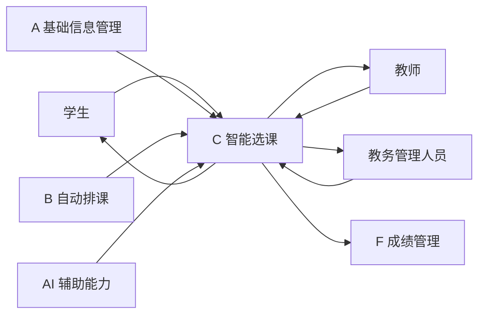
```mermaid
flowchart LR
    student[学生] --> C[C 智能选课]
    teacher[教师] --> C
    admin[教务管理人员] --> C
    A[A 基础信息管理] --> C
    B[B 自动排课] --> C
    AI[AI 辅助能力] --> C
    C --> student
    C --> teacher
    C --> admin
    C --> F[F 成绩管理]
```

`FIG-6-02` C 子系统 0 层 DFD。

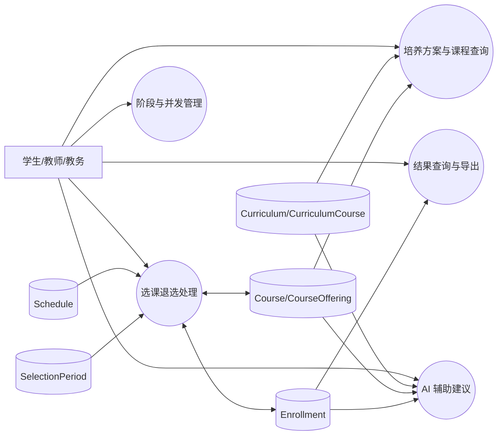
```mermaid
flowchart LR
    U[学生/教师/教务] --> P1((培养方案与课程查询))
    U --> P2((选课退选处理))
    U --> P3((结果查询与导出))
    U --> P4((阶段与并发管理))
    U --> P5((AI 辅助建议))
    D1[(Curriculum/CurriculumCourse)] --> P1
    D2[(Course/CourseOffering)] --> P1
    D3[(Schedule)] --> P2
    D4[(SelectionPeriod)] --> P2
    P2 <--> D5[(Enrollment)]
    P2 <--> D2
    D5 --> P3
    D1 --> P5
    D2 --> P5
    D5 --> P5
```

### 6.5 状态图（State Diagrams）

`FIG-6-03` 选课阶段状态图。

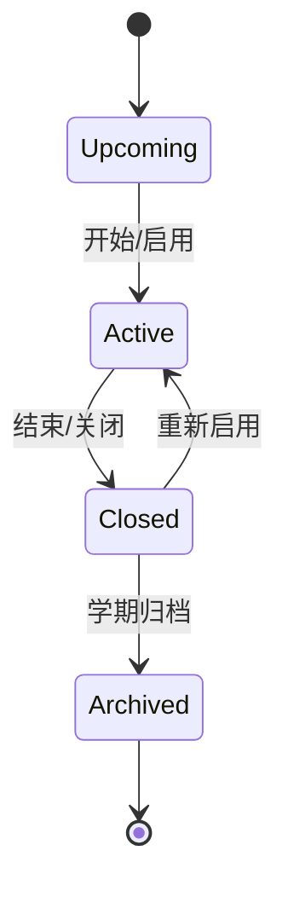
```mermaid
stateDiagram-v2
    [*] --> Upcoming
    Upcoming --> Active: 开始/启用
    Active --> Closed: 结束/关闭
    Closed --> Active: 重新启用
    Closed --> Archived: 学期归档
    Archived --> [*]
```

`FIG-6-04` 选课记录状态图。

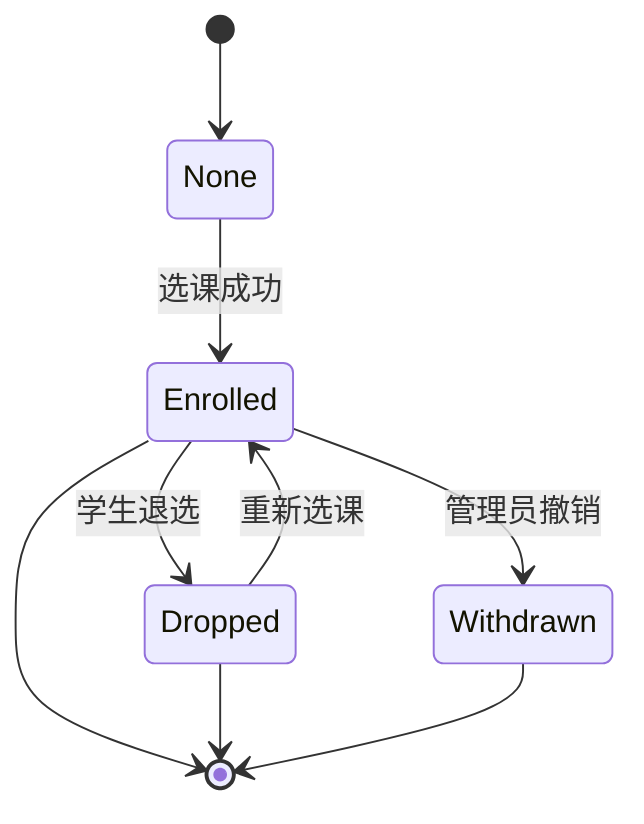
```mermaid
stateDiagram-v2
    [*] --> None
    None --> Enrolled: 选课成功
    Enrolled --> Dropped: 学生退选
    Enrolled --> Withdrawn: 管理员撤销
    Dropped --> Enrolled: 重新选课
    Enrolled --> [*]
    Dropped --> [*]
    Withdrawn --> [*]
```

### 6.6 类图与 CRC Cards（Class Diagrams and CRC Cards）

`FIG-6-05` C 子系统核心类图。

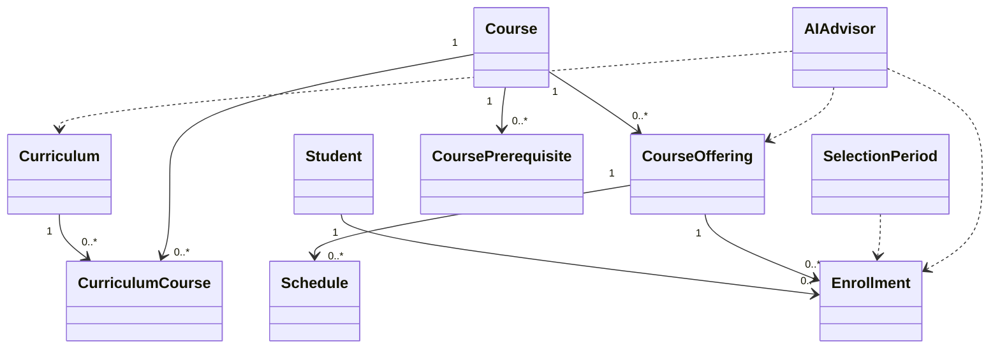
```mermaid
classDiagram
    class Student
    class Curriculum
    class CurriculumCourse
    class Course
    class CourseOffering
    class CoursePrerequisite
    class Schedule
    class SelectionPeriod
    class Enrollment
    class AIAdvisor
    Student "1" --> "0..*" Enrollment
    Curriculum "1" --> "0..*" CurriculumCourse
    Course "1" --> "0..*" CurriculumCourse
    Course "1" --> "0..*" CourseOffering
    Course "1" --> "0..*" CoursePrerequisite
    CourseOffering "1" --> "0..*" Schedule
    CourseOffering "1" --> "0..*" Enrollment
    SelectionPeriod ..> Enrollment
    AIAdvisor ..> Curriculum
    AIAdvisor ..> CourseOffering
    AIAdvisor ..> Enrollment
```

| Class                           | Responsibilities                               | Collaborators                                |
| ------------------------------- | ---------------------------------------------- | -------------------------------------------- |
| `Curriculum`/`CurriculumCourse` | 提供专业培养方案、课程类别、学分和建议学期。   | `Student`、`Course`                          |
| `Course`/`CourseOffering`       | 提供课程信息、学期课程、教师、容量和开课状态。 | `Schedule`、`Enrollment`                     |
| `SelectionPeriod`               | 控制初选、补退选、调整阶段及最大学分。         | `Enrollment`                                 |
| `Enrollment`                    | 记录学生选课、退选、撤销状态和时间。           | `Student`、`CourseOffering`                  |
| `AIAdvisor`                     | 生成选课建议、理由和风险提示。                 | `Curriculum`、`CourseOffering`、`Enrollment` |

### 6.7 非功能需求与约束

| 编号       | 非功能需求                                                       | 优先级 |
| ---------- | ---------------------------------------------------------------- | ------ |
| `NFR-C-01` | 系统应至少支持 200 名在线用户同时使用选课服务。                  | Must   |
| `NFR-C-02` | 系统应限制同时进入选课系统的连接数，超过上限时明确提示。         | Must   |
| `NFR-C-03` | 长时间无操作用户应被强制退出并释放会话资源。                     | Must   |
| `NFR-C-04` | 选课与退选必须具备事务一致性，避免超选、重复选课和人数统计错误。 | Must   |
| `NFR-C-05` | 学生、教师、教务管理人员的数据访问必须按角色隔离。               | Must   |
| `NFR-C-06` | AI 建议必须可解释，且不得绕过业务规则成为最终选课依据。          | Must   |

### 6.8 验证标准（Validation Criteria）

| 编号      | 覆盖需求                            | 验证标准                                                                               |
| --------- | ----------------------------------- | -------------------------------------------------------------------------------------- |
| `VC-C-01` | `FR-C-01`                           | 给定学生专业和年级，系统能展示对应培养方案与学分要求；无方案时给出提示。               |
| `VC-C-02` | `FR-C-02`、`FR-C-03`                | 搜索课程时返回匹配课程、详情和可选/不可选原因。                                        |
| `VC-C-03` | `FR-C-04`、`FR-C-10`                | 选课阶段关闭时不能选课/退选；启用后可恢复操作。                                        |
| `VC-C-04` | `FR-C-05` 至 `FR-C-07`              | 构造容量满、时间冲突、重复选课、超学分、先修不满足和退选场景，系统处理正确且人数一致。 |
| `VC-C-05` | `FR-C-08`、`FR-C-09`                | 学生能查看本人选课结果和课表；任课教师能导出本人课程名单，非任课教师被拒绝。           |
| `VC-C-06` | `FR-C-11`、`NFR-C-05`               | 教务可手动加课并记录原因；普通用户无权操作。                                           |
| `VC-C-07` | `FR-C-12`、`NFR-C-01` 至 `NFR-C-03` | 模拟 200 名在线用户、连接数上限和超时停留，系统能按规则服务、限流或退出。              |
| `VC-C-08` | `FR-C-13`、`NFR-C-06`               | AI 输出推荐理由和风险提示；违反硬性规则的推荐不能直接生成选课结果。                    |

#### 6.8.1 需求追踪矩阵

| 功能域             | 需求编号               | 验证编号                        |
| ------------------ | ---------------------- | ------------------------------- |
| 培养方案与课程查询 | `FR-C-01` 至 `FR-C-03` | `VC-C-01`、`VC-C-02`            |
| 选课退选           | `FR-C-04` 至 `FR-C-07` | `VC-C-03`、`VC-C-04`            |
| 结果查询与导出     | `FR-C-08`、`FR-C-09`   | `VC-C-05`                       |
| 选课管理           | `FR-C-10` 至 `FR-C-12` | `VC-C-03`、`VC-C-06`、`VC-C-07` |
| AI 辅助            | `FR-C-13`              | `VC-C-08`                       |

---

## 7. 子系统 D：论坛交流需求

### 7.1 子系统目标与边界

论坛交流子系统用于支撑“课程内通知发布 + 课程讨论互动 + 内容检索与统计”闭环。其核心目标是为任课教师、学生和论坛管理人员提供统一的课程交流空间，沉淀问题答疑、学习经验和教学通知，提升教学过程中的沟通效率。

#### 7.1.1 建设目标

| 编号        | 目标               | 说明                                             |
| ----------- | ------------------ | ------------------------------------------------ |
| `GOAL-D-01` | 统一课程公告发布   | 任课教师可发布课程公告，课程相关用户可及时查看。 |
| `GOAL-D-02` | 统一课程讨论入口   | 教师与学生可围绕课程发帖、回帖与交流。           |
| `GOAL-D-03` | 统一内容组织与治理 | 支持帖子状态管理、置顶、隐藏和删除等治理动作。   |
| `GOAL-D-04` | 统一检索能力       | 支持对历史帖子进行关键字检索与筛选。             |
| `GOAL-D-05` | 统一统计能力       | 支持发文数量和周/月热帖统计，辅助运营分析。      |

#### 7.1.2 范围内能力

- 公告管理：发布、查看、编辑、撤回课程公告。
- 发帖管理：教师与学生发帖，支持帖子类型、置顶与状态控制。
- 评论互动：用户对帖子回复，也可对评论进行二级回复。
- 附件关联：发帖时支持上传附件并在详情中展示。
- 帖子检索：按标题/正文关键字、课程、作者和时间筛选。
- 数据统计：按人、按课程、按周期统计发文和热帖。

#### 7.1.3 范围外能力

| 不属于 D 子系统的内容              | 归属         | 边界说明                                           |
| ---------------------------------- | ------------ | -------------------------------------------------- |
| 用户注册、认证、角色权限主数据维护 | A 子系统     | D 仅消费账号与角色信息，不维护认证逻辑。           |
| 课程基础信息与开课计划维护         | A/B/C 子系统 | D 读取课程与开课实例，仅用于论坛归属与可见性判断。 |
| 选课业务流程与选课结果维护         | C 子系统     | D 不负责选课规则和选课数据写入。                   |
| 在线测试组织、自动评分与题库维护   | E 子系统     | D 只承载交流内容，不处理测试流程。                 |
| 正式成绩录入、分析与复核           | F 子系统     | D 不写入任何正式成绩数据。                         |

#### 7.1.4 与其他子系统的数据依赖

| 数据对象          | D 子系统职责                             | 主要消费者         |
| ----------------- | ---------------------------------------- | ------------------ |
| `ForumPost`       | 存储帖子主题、正文、类型、状态、浏览量等 | 教师、学生、管理员 |
| `ForumComment`    | 存储评论内容、父子关系与层级             | 教师、学生、管理员 |
| `ForumAttachment` | 存储附件元数据与帖子关联                 | 教师、学生         |
| `User`            | 提供作者身份和角色信息用于权限控制       | 全部论坛能力       |
| `CourseOffering`  | 提供课程论坛归属与访问范围边界           | 公告、发帖、检索   |

#### 7.1.5 外部接口、依赖与假设

为提升可读性，本节将“外部依赖”和“核心接口路径”分开描述，避免单行信息过长。

**外部依赖与约束**

| 类型         | 对象               | 需求口径                                                       |
| ------------ | ------------------ | -------------------------------------------------------------- |
| 用户界面     | Web 浏览器         | 用户通过课程论坛页面完成公告、发帖、回帖、检索和统计查看。     |
| 服务接口     | D 子系统 API       | 对前端提供公告、帖子、评论、检索和统计接口。                   |
| 会话依赖     | 令牌与权限服务     | 所有写操作必须认证并校验角色权限。                             |
| 主数据依赖   | A 子系统           | 提供用户、角色、课程与开课实例基础数据。                       |
| 存储依赖     | 主数据库与文件存储 | 帖子、评论和统计基数据落库；附件存储在对象存储或等效文件系统。 |
| 可观测性依赖 | 日志与审计服务     | 治理动作、删除动作和关键访问行为应写入审计日志。               |

**核心接口路径**

| 编号         | 方法               | 路径                                | 说明                             |
| ------------ | ------------------ | ----------------------------------- | -------------------------------- |
| `API-D-01`   | `GET/POST`         | `/api/v1/forum/announcements`       | 公告查询、发布。                 |
| `API-D-01-1` | `PATCH/DELETE`     | `/api/v1/forum/announcements/{id}`  | 公告编辑、撤回。                 |
| `API-D-02`   | `GET/POST`         | `/api/v1/forum/posts`               | 帖子分页查询、创建（可带附件）。 |
| `API-D-03`   | `GET/PATCH/DELETE` | `/api/v1/forum/posts/{id}`          | 帖子详情、编辑、删除。           |
| `API-D-04`   | `GET/POST`         | `/api/v1/forum/posts/{id}/comments` | 评论树查询、发表评论/回复。      |
| `API-D-05`   | `GET`              | `/api/v1/forum/search`              | 关键字检索与组合筛选。           |
| `API-D-06`   | `GET`              | `/api/v1/forum/stats`               | 发文统计与周/月热帖统计。        |

假设与说明：

- 接口字段命名与 D 模块 API 文档一致，避免与前端字段映射冲突。
- 统计接口默认按权限返回可见范围内数据，禁止跨课程越权汇总。
- 附件上传采用异步或直传方案时，仍需在业务层维护 `ForumAttachment` 元数据一致性。

### 7.2 用户角色与用户场景（User Scenarios）

#### 7.2.1 角色定义

| 角色         | 角色代码建议     | 核心权限边界                                       |
| ------------ | ---------------- | -------------------------------------------------- |
| 任课教师     | `teacher`        | 发布课程公告；在课程论坛发帖、回帖；维护本人内容。 |
| 学生         | `student`        | 在可见课程论坛发帖、回帖、检索内容。               |
| 论坛管理人员 | `forum_admin`    | 管理帖子状态、处理违规内容、查看统计数据。         |
| 教务管理人员 | `academic_admin` | 查看论坛整体运行情况和统计结果。                   |
| 系统管理员   | `system_admin`   | 具备跨课程治理与审计能力。                         |

#### 7.2.2 用户场景

| 编号      | 场景名称       | 主要参与者                 | 前置条件                 | 主成功场景                               | 异常与约束                           |
| --------- | -------------- | -------------------------- | ------------------------ | ---------------------------------------- | ------------------------------------ |
| `US-D-01` | 教师发布公告   | 任课教师                   | 已登录且拥有课程开设权限 | 教师发布公告后，课程成员可在论坛首页查看 | 非任课教师发布应被拒绝。             |
| `US-D-02` | 学生发帖提问   | 学生                       | 已登录且拥有课程可见权限 | 学生发布问题帖并被课程成员查看与回复     | 标题/正文为空或超长时应校验失败。    |
| `US-D-03` | 用户回帖交流   | 教师、学生                 | 目标帖子可评论           | 用户在帖子下回复并形成讨论串             | 已删除或已关闭帖子应禁止回复。       |
| `US-D-04` | 管理员治理内容 | 论坛管理人员               | 已登录并具备治理权限     | 管理员隐藏违规帖子/评论并保留治理记录    | 非管理角色治理操作应失败。           |
| `US-D-05` | 检索历史帖子   | 教师、学生、管理员         | 已登录并输入检索条件     | 系统返回匹配内容并可跳转详情             | 无结果时返回空列表，不应报错。       |
| `US-D-06` | 统计热帖数据   | 论坛管理人员、教务管理人员 | 已有论坛数据沉淀         | 系统输出发文统计与周/月热帖              | 缺少时间范围等参数时应返回校验错误。 |
| `US-D-07` | 附件上传交流   | 教师、学生                 | 发帖时选择附件           | 系统完成附件校验并关联帖子               | 文件超限、类型非法应明确提示。       |

### 7.3 功能需求

#### 7.3.1 论坛公告

| 编号      | 功能需求                                                                     | 优先级 |
| --------- | ---------------------------------------------------------------------------- | ------ |
| `FR-D-01` | 系统应支持任课教师发布课程公告，公告至少包含标题、正文、课程开设和发布时间。 | Must   |
| `FR-D-02` | 系统应支持公告列表与详情查询，支持按课程、时间、发布人筛选。                 | Must   |
| `FR-D-03` | 系统应支持任课教师编辑、撤回本人公告。                                       | Must   |
| `FR-D-04` | 系统应支持公告置顶展示。                                                     | Should |
| `FR-D-05` | 系统应限制公告发布权限，仅任课教师和授权管理角色可发布。                     | Must   |

#### 7.3.2 发帖功能

| 编号      | 功能需求                                                                             | 优先级 |
| --------- | ------------------------------------------------------------------------------------ | ------ |
| `FR-D-06` | 系统应支持教师和学生在课程论坛发帖，帖子包含标题、正文、类型和课程归属。             | Must   |
| `FR-D-07` | 系统应支持帖子类型枚举，至少包含 `question`、`discussion`、`share`、`announcement`。 | Must   |
| `FR-D-08` | 系统应支持帖子分页查询和按课程/作者/类型筛选。                                       | Must   |
| `FR-D-09` | 系统应支持作者编辑和删除本人帖子，删除采用逻辑删除。                                 | Must   |
| `FR-D-10` | 系统应支持论坛管理人员执行置顶、隐藏、恢复等治理操作。                               | Must   |
| `FR-D-11` | 系统应支持维护帖子浏览量，作为热帖统计依据之一。                                     | Should |
| `FR-D-12` | 系统应支持帖子附件上传并保存 `file_name`、`file_path`、`file_size`、`file_type`。    | Should |

#### 7.3.3 回帖留言

| 编号      | 功能需求                                                     | 优先级 |
| --------- | ------------------------------------------------------------ | ------ |
| `FR-D-13` | 系统应支持登录用户对帖子发表评论。                           | Must   |
| `FR-D-14` | 系统应支持用户对评论进行回复，形成父子评论结构。             | Must   |
| `FR-D-15` | 系统应支持按时间顺序展示评论内容、作者、时间和层级。         | Must   |
| `FR-D-16` | 系统应支持作者删除本人评论，删除后保留占位以维持讨论串结构。 | Should |
| `FR-D-17` | 系统应支持管理人员隐藏违规评论并保留审计记录。               | Must   |

#### 7.3.4 文章管理

| 编号      | 功能需求                                                 | 优先级 |
| --------- | -------------------------------------------------------- | ------ |
| `FR-D-18` | 系统应支持按用户统计发帖数、评论数与公告数。             | Must   |
| `FR-D-19` | 系统应支持按课程统计活跃度（帖子数、评论数、参与人数）。 | Must   |
| `FR-D-20` | 系统应支持按周与按月统计热帖排行。                       | Must   |
| `FR-D-21` | 系统应支持统计结果导出或复制，用于教学管理分析。         | Should |

#### 7.3.5 帖子检索

| 编号      | 功能需求                                         | 优先级 |
| --------- | ------------------------------------------------ | ------ |
| `FR-D-22` | 系统应支持基于关键字检索帖子标题与正文。         | Must   |
| `FR-D-23` | 系统应支持检索结果按相关度或发布时间排序。       | Must   |
| `FR-D-24` | 系统应支持按课程、作者、类型、时间范围组合筛选。 | Should |
| `FR-D-25` | 系统应支持在检索结果中显示命中摘要。             | Should |
| `FR-D-26` | 系统应仅返回当前用户权限范围内可见内容。         | Must   |

### 7.4 数据流图（Data Flow Diagram）

论坛交流业务由“内容发布、互动回复、治理审计、检索统计”四类过程组成。为保证可读性，本节提供上下文级 DFD 和 0 层 DFD。

| 图编号     | 图名称               | 用途                                                |
| ---------- | -------------------- | --------------------------------------------------- |
| `FIG-7-01` | D 子系统上下文级 DFD | 描述教师、学生、管理员与 D 子系统及外部依赖的交互。 |
| `FIG-7-02` | D 子系统 0 层 DFD    | 描述发布、评论、治理、检索统计与数据存储的数据流。  |

#### 7.4.1 上下文级 DFD

`FIG-7-01` D 子系统上下文级 DFD。

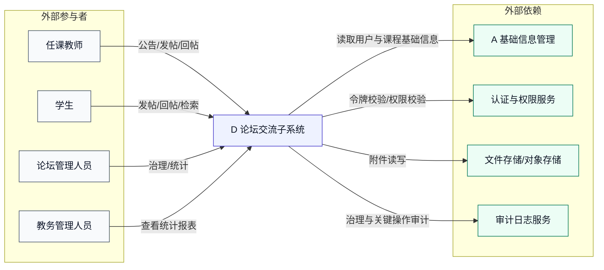
```mermaid
flowchart LR
    classDef actor fill:#f8fafc,stroke:#475569,color:#0f172a
    classDef core fill:#eef2ff,stroke:#4338ca,color:#111827
    classDef module fill:#ecfdf5,stroke:#047857,color:#111827

    subgraph actors["外部参与者"]
    direction TB
        teacher["任课教师"]
        student["学生"]
        admin["论坛管理人员"]
        academic["教务管理人员"]
    end

    D["D 论坛交流子系统"]

    subgraph upstream["外部依赖"]
      direction TB
        A["A 基础信息管理"]
        AUTH["认证与权限服务"]
        FS["文件存储/对象存储"]
        LOG["审计日志服务"]
    end

    teacher -- "公告/发帖/回帖" --> D
    student -- "发帖/回帖/检索" --> D
    admin -- "治理/统计" --> D
    academic -- "查看统计报表" --> D

    D -- "读取用户与课程基础信息" --> A
    D -- "令牌校验/权限校验" --> AUTH
    D -- "附件读写" --> FS
    D -- "治理与关键操作审计" --> LOG

    class teacher,student,admin,academic actor
    class D core
    class A,AUTH,FS,LOG module
```

#### 7.4.2 0 层 DFD

`FIG-7-02` D 子系统 0 层 DFD。

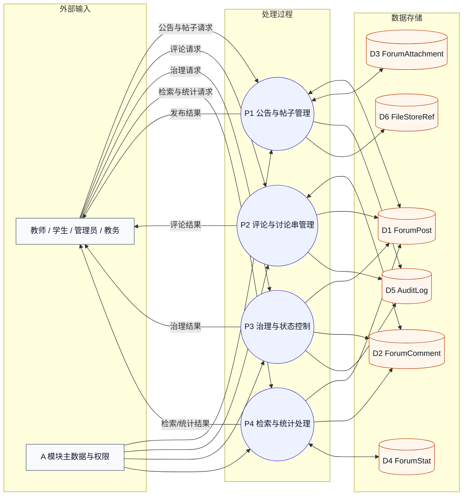
```mermaid
flowchart LR
    classDef external fill:#f8fafc,stroke:#475569,color:#0f172a
    classDef process fill:#eef2ff,stroke:#4338ca,color:#111827
    classDef store fill:#fff7ed,stroke:#c2410c,color:#111827

    subgraph E["外部输入"]
        direction TB
        U["教师 / 学生 / 管理员 / 教务"]
        X["A 模块主数据与权限"]
    end

    subgraph P["处理过程"]
        direction TB
        P1(("P1 公告与帖子管理"))
        P2(("P2 评论与讨论串管理"))
        P3(("P3 治理与状态控制"))
        P4(("P4 检索与统计处理"))
    end

    subgraph D["数据存储"]
        direction TB
        D1[("D1 ForumPost")]
        D2[("D2 ForumComment")]
        D3[("D3 ForumAttachment")]
        D4[("D4 ForumStat")]
      D5[("D5 AuditLog")]
      D6[("D6 FileStoreRef")]
    end

    U -- "公告与帖子请求" --> P1
    U -- "评论请求" --> P2
    U -- "治理请求" --> P3
    U -- "检索与统计请求" --> P4

    X --> P1
    X --> P2
    X --> P3
    X --> P4

    P1 <--> D1
    P1 <--> D3
    P2 <--> D2
    P2 --> D1
    P3 --> D1
    P3 --> D2
    P4 --> D1
    P4 --> D2
    P4 <--> D4

    P1 --> D5
    P2 --> D5
    P3 --> D5
    P1 --> D6

    P1 -- "发布结果" --> U
    P2 -- "评论结果" --> U
    P3 -- "治理结果" --> U
    P4 -- "检索/统计结果" --> U

    class U,X external
    class P1,P2,P3,P4 process
    class D1,D2,D3,D4,D5,D6 store
```

#### 7.4.3 关键数据流说明

| 数据流编号 | 来源             | 目标             | 数据内容                               |
| ---------- | ---------------- | ---------------- | -------------------------------------- |
| `DF-D-01`  | 教师             | 公告与帖子管理   | 公告标题、正文、课程开设、发布范围     |
| `DF-D-02`  | 教师/学生        | 公告与帖子管理   | 帖子标题、正文、类型、附件信息         |
| `DF-D-03`  | 公告与帖子管理   | `ForumPost`      | 帖子基础字段、状态、置顶标记、浏览量   |
| `DF-D-04`  | 教师/学生        | 评论与讨论串管理 | 帖子 ID、父评论 ID、评论内容           |
| `DF-D-05`  | 评论与讨论串管理 | `ForumComment`   | 评论内容、层级、状态、创建时间         |
| `DF-D-06`  | 管理员           | 治理与状态控制   | 隐藏/恢复/删除动作、原因、操作者       |
| `DF-D-07`  | 治理与状态控制   | `AuditLog`       | 操作者、资源 ID、动作、时间、来源      |
| `DF-D-08`  | 用户             | 检索与统计处理   | 关键字、课程、作者、时间范围、排序规则 |
| `DF-D-09`  | 检索与统计处理   | 用户             | 匹配帖子列表、命中摘要、统计结果       |
| `DF-D-10`  | 公告与帖子管理   | `FileStoreRef`   | 附件文件内容、上传结果、文件 URL       |

### 7.5 状态图（State Diagrams）

#### 7.5.1 帖子状态图

`FIG-7-03` 帖子状态图。

```mermaid
stateDiagram-v2
    [*] --> Draft: 新建
    Draft --> PendingReview: 提交
    PendingReview --> Normal: 审核通过/自动放行
    PendingReview --> Hidden: 审核拦截

    Normal --> Normal: 编辑内容
    Normal --> CommentClosed: 关闭评论
    CommentClosed --> Normal: 重新开放评论

    Normal --> Hidden: 管理员隐藏
    Hidden --> Normal: 管理员恢复

    Normal --> Deleted: 作者删除/管理员删除
    Hidden --> Deleted: 管理员删除
    CommentClosed --> Deleted: 删除

    Deleted --> Archived: 到期归档
    Deleted --> [*]: 立即清理
    Archived --> [*]
```

状态约束：

- `Draft` 仅作者可见，不参与公开检索。
- `PendingReview` 表示待审核或待内容校验阶段。
- `Normal` 为默认可见状态，可被检索和评论。
- `CommentClosed` 仅关闭新评论，不影响历史展示与检索。
- `Hidden` 仅管理角色可见，不对普通用户展示。
- `Deleted` 为逻辑删除状态，不允许继续编辑或评论。
- `Archived` 为历史归档状态，仅供审计或历史查询。

#### 7.5.2 评论状态图

`FIG-7-04` 评论状态图。

```mermaid
stateDiagram-v2
    [*] --> Pending: 提交评论
    Pending --> Normal: 校验通过
    Pending --> Rejected: 校验失败/拦截

    Normal --> Edited: 作者编辑
    Edited --> Normal: 保存

    Normal --> Hidden: 管理员隐藏
    Hidden --> Normal: 管理员恢复

    Normal --> Deleted: 作者删除
    Hidden --> Deleted: 管理员删除
    Rejected --> [*]
    Deleted --> [*]
```

评论状态约束：

- `Pending` 用于处理敏感词、长度和格式校验。
- `Normal` 为可见可回复状态。
- `Edited` 表示评论内容被作者更新后回到可见状态。
- `Hidden` 仅管理角色可见。
- `Rejected` 表示未通过校验且不入库或仅保留审计痕迹。

### 7.6 类图与 CRC Cards（Class Diagrams and CRC Cards）

#### 7.6.1 分析类图

`FIG-7-05` D 子系统分析类图。

```mermaid
classDiagram
    direction LR

    class User {
      +String id
      +String username
      +String role
    }

    class CourseOffering {
      +String id
      +String courseId
      +String teacherId
    }

    class ForumPost {
      +String id
      +String courseOfferingId
      +String authorId
      +String title
      +String content
      +PostType postType
      +Boolean isPinned
      +PostStatus status
      +Int viewCount
    }

    class ForumComment {
      +String id
      +String postId
      +String authorId
      +String parentId
      +Int depth
      +CommentStatus status
    }

    class ForumAttachment {
      +String id
      +String postId
      +String fileName
      +String filePath
      +Long fileSize
      +String fileType
    }

    User "1" --> "0..*" ForumPost
    User "1" --> "0..*" ForumComment
    CourseOffering "1" --> "0..*" ForumPost
    ForumPost "1" --> "0..*" ForumComment
    ForumPost "1" --> "0..*" ForumAttachment
    ForumComment "1" --> "0..*" ForumComment
```

#### 7.6.2 CRC Cards

`TAB-7-01` D 子系统 CRC Cards。

| Class             | Responsibilities                         | Collaborators                                               |
| ----------------- | ---------------------------------------- | ----------------------------------------------------------- |
| `ForumPost`       | 维护帖子主题、正文、类型、状态与浏览量。 | `User`、`CourseOffering`、`ForumComment`、`ForumAttachment` |
| `ForumComment`    | 维护评论内容与父子关系，支持讨论串。     | `ForumPost`、`User`                                         |
| `ForumAttachment` | 维护附件元数据与帖子关联。               | `ForumPost`、文件存储服务                                   |
| `User`            | 提供作者身份与权限边界。                 | `ForumPost`、`ForumComment`                                 |
| `CourseOffering`  | 提供论坛归属课程和访问边界。             | `ForumPost`、A/C 子系统                                     |

### 7.7 非功能需求与约束

| 编号       | 分类       | 非功能需求                                               |
| ---------- | ---------- | -------------------------------------------------------- |
| `NFR-D-01` | 安全性     | 所有写操作接口必须认证并执行角色与资源权限校验。         |
| `NFR-D-02` | 访问隔离   | 用户仅可访问其课程范围内可见的论坛内容。                 |
| `NFR-D-03` | 数据一致性 | 帖子、评论、附件关联写入必须保证事务一致性。             |
| `NFR-D-04` | 附件安全   | 附件上传必须进行大小与类型校验，拒绝高风险可执行文件。   |
| `NFR-D-05` | 审计性     | 发布、编辑、删除、隐藏、恢复等关键操作必须记录审计日志。 |
| `NFR-D-06` | 检索可用性 | 检索接口应支持分页与排序，避免大结果集一次性返回。       |
| `NFR-D-07` | 统计准确性 | 发文统计和热帖统计应可复算且结果可追溯。                 |
| `NFR-D-08` | 可用性     | 参数错误、无权限、无结果等场景需返回明确错误或提示信息。 |
| `NFR-D-09` | 可维护性   | 帖子类型与状态应采用枚举或配置化管理，避免散落硬编码。   |

### 7.8 验证标准（Validation Criteria）

| 编号      | 覆盖需求                           | 验证标准                                                               |
| --------- | ---------------------------------- | ---------------------------------------------------------------------- |
| `VC-D-01` | `FR-D-01` 至 `FR-D-05`             | 任课教师可发布、编辑、撤回公告；非任课教师发布被拒绝。                 |
| `VC-D-02` | `FR-D-06` 至 `FR-D-12`             | 教师/学生可发帖与分页查询；作者可编辑删除本人帖子；管理员可置顶/隐藏。 |
| `VC-D-03` | `FR-D-12`、`NFR-D-04`              | 合法附件上传成功并可关联展示；非法类型或超限附件被拒绝。               |
| `VC-D-04` | `FR-D-13` 至 `FR-D-17`             | 登录用户可评论与回复；已删除帖子无法继续回复；管理员可隐藏违规评论。   |
| `VC-D-05` | `FR-D-18` 至 `FR-D-21`、`NFR-D-07` | 可输出周/月发文统计和热帖排行，结果可与原始数据核对一致。              |
| `VC-D-06` | `FR-D-22` 至 `FR-D-26`、`NFR-D-06` | 输入关键字可检索帖子，支持筛选排序，且仅返回可见范围内容。             |
| `VC-D-07` | `NFR-D-01`、`NFR-D-02`、`NFR-D-05` | 未认证写操作失败；跨课程越权访问失败；治理操作可追溯到操作者与时间。   |
| `VC-D-08` | `NFR-D-03`、`NFR-D-08`、`NFR-D-09` | 异常情况下关联写入回滚；错误提示明确；类型与状态配置可扩展。           |

#### 7.8.1 需求追踪矩阵

| 功能域       | 需求编号               | 验证编号             |
| ------------ | ---------------------- | -------------------- |
| 论坛公告     | `FR-D-01` 至 `FR-D-05` | `VC-D-01`、`VC-D-07` |
| 发帖与附件   | `FR-D-06` 至 `FR-D-12` | `VC-D-02`、`VC-D-03` |
| 回帖留言     | `FR-D-13` 至 `FR-D-17` | `VC-D-04`、`VC-D-07` |
| 文章管理统计 | `FR-D-18` 至 `FR-D-21` | `VC-D-05`            |
| 帖子检索     | `FR-D-22` 至 `FR-D-26` | `VC-D-06`、`VC-D-08` |

---

## 8. 子系统 E：在线测试需求

### 8.1 子系统目标与边界

在线测试子系统是 STSS 中负责“教学评价与过程性考核”的执行层子系统。E 模块在课程开设、师生身份和选课名单已存在的前提下，为教师提供题库维护、试卷编排、测试发布与成绩统计能力，为学生提供在线答题、实时计时与结果查询能力。系统支持客观题自动评分与主观题留白批阅，并与成绩管理子系统保持数据联动。

#### 8.1.1 建设目标

| 编号        | 目标               | 说明                                                                 |
| ----------- | ------------------ | -------------------------------------------------------------------- |
| `GOAL-E-01` | 统一题库资源管理   | 支持多课程、多题型的试题结构化录入、分类、检索与维护。               |
| `GOAL-E-02` | 统一试卷生成能力   | 支持教师手工组卷与基于约束条件的系统自动组卷。                       |
| `GOAL-E-03` | 统一在线作答体验   | 提供计时、防意外丢失、分段保存与正式提交的答题环境。                 |
| `GOAL-E-04` | 统一自动评分与统计 | 客观题提交后即时评分，并提供试卷维度、题目维度与个人维度的统计分析。 |
| `GOAL-E-05` | 支持测试过程治理   | 控制测试可见范围、开放与截止时间，保留异常中断与补考处理空间。       |
| `GOAL-E-06` | 结果可追踪与可同步 | 测试成绩应可追溯作答记录，并可作为过程性成绩同步至 F 子系统。        |

#### 8.1.2 范围内能力

- 题库管理：新增、编辑、删除、查询试题；支持单选题、多选题、判断题等题型；支持知识点标签与难度分级。
- 试卷管理：创建试卷、维护试卷结构、手工添加题目、设置分值与顺序。
- 自动组卷：按课程、题型、知识点、难度、数量等约束条件批量抽题生成试卷。
- 测试发布：将试卷与课程开设绑定，设置考试时间窗口、时长限制、重考策略与可见范围。
- 学生答题：在线浏览试卷、实时倒计时、自动暂存、异常恢复、正式提交与强制收卷。
- 自动评分：客观题提交后系统即时比对答案并计算得分；主观题预留教师人工批阅接口（本阶段可仅记录作答文本）。
- 统计分析：输出试卷平均分、最高/低分、得分分布、题目正确率、个人历史成绩与薄弱知识点分析。

#### 8.1.3 范围外能力

| 不属于 E 子系统的内容                    | 归属     | 边界说明                                                             |
| ---------------------------------------- | -------- | -------------------------------------------------------------------- |
| 课程基础信息、开课计划、教师与学生主数据 | A 子系统 | E 仅读取 `CourseOffering`、`User` 等基础对象，不维护主数据生命周期。 |
| 选课名单、培养方案与学分约束             | C 子系统 | E 仅依据已确定的选课名单确定可参与测试的学生范围。                   |
| 正式成绩录入、绩点计算与学分认定         | F 子系统 | E 仅提供过程性测试分数与统计快照，最终成绩确认与 GPA 计算由 F 负责。 |
| 课程论坛交流、公告与资料分享             | D 子系统 | E 不承载课程内容讨论与文件共享。                                     |
| 教室资源调度与课表排期                   | B 子系统 | E 仅使用时间窗口进行考试安排，不参与教室物理分配。                   |

#### 8.1.4 与其他子系统的数据依赖

| 数据对象                  | E 子系统职责                               | 主要消费者                 |
| ------------------------- | ------------------------------------------ | -------------------------- |
| `Question`/`QuestionBank` | 维护试题内容、选项、标准答案、知识点与难度 | 教师、组卷引擎、统计分析   |
| `TestPaper`               | 维护试卷结构、题目组成、分值与状态         | 教师、学生、自动组卷       |
| `TestSession`             | 维护学生答题实例、时间记录、作答内容与得分 | 学生、评分服务、F 子系统   |
| `CourseOffering`          | 读取课程开课实例用于绑定测试活动           | 教师发布测试、学生查看测试 |
| `Student`/`Teacher`       | 读取用户身份与角色用于权限与名单控制       | 全部测试能力               |
| `ScoreSync`（逻辑接口）   | 输出测试总分与明细快照供成绩管理引用       | F 子系统                   |

#### 8.1.5 外部接口、依赖与假设

| 类型         | 对象                                                                                                                                                                                       | 需求口径                                                                         |
| ------------ | ------------------------------------------------------------------------------------------------------------------------------------------------------------------------------------------ | -------------------------------------------------------------------------------- |
| 用户界面     | Web 浏览器                                                                                                                                                                                 | 教师通过管理端维护题库、组卷、发布与查看统计；学生通过答题端完成在线测试。       |
| 服务接口     | E 子系统 API                                                                                                                                                                               | 提供题库 CRUD、试卷管理、自动组卷、测试发布、答题提交、自动评分与统计查询接口。  |
| 核心接口路径 | `/api/v1/testing/questions`、`/api/v1/testing/papers`、`/api/v1/testing/papers/{id}/generate`、`/api/v1/testing/sessions`、`/api/v1/testing/sessions/{id}/submit`、`/api/v1/testing/stats` | 路径命名与请求/响应结构应与 E 模块接口规范保持一致。                             |
| 会话依赖     | 令牌与权限服务                                                                                                                                                                             | 所有测试写操作、成绩提交必须通过身份认证与角色/范围权限校验。                    |
| 数据依赖     | 主数据库                                                                                                                                                                                   | 试题、试卷、作答记录、评分结果与统计快照应持久化保存，支持事务回滚。             |
| 时间同步依赖 | 系统时钟/服务端时间                                                                                                                                                                        | 答题计时、窗口控制与强制收卷应以服务端时间为准，避免客户端时间篡改。             |
| 跨系统依赖   | A 模块主数据、F 子系统                                                                                                                                                                     | E 读取 A 的用户与开课数据，不维护副本；测试完成后可将结构化成绩推送至 F 子系统。 |

### 8.2 用户角色与用户场景（User Scenarios）

#### 8.2.1 角色定义

| 角色         | 角色代码建议     | 核心权限边界                                                   |
| ------------ | ---------------- | -------------------------------------------------------------- |
| 教师         | `teacher`        | 维护本人课程题库、组卷、发布测试、查看本人课程统计与作答明细。 |
| 学生         | `student`        | 查看本人可参加的测试、在线答题、查看个人历史成绩与错题分析。   |
| 教务管理人员 | `academic_admin` | 监控测试活动整体状态，处理特殊时间窗口调整或异常申诉。         |
| 考试管理员   | `exam_admin`     | 负责跨课程测试配置、题库共享审核与全局统计导出。               |
| 系统管理员   | `system_admin`   | 具备全局审计、数据归档与异常日志排查权限。                     |

#### 8.2.2 用户场景

| 编号      | 场景名称           | 主要参与者        | 前置条件                   | 主成功场景                                                           | 异常与约束                                                     |
| --------- | ------------------ | ----------------- | -------------------------- | -------------------------------------------------------------------- | -------------------------------------------------------------- |
| `US-E-01` | 教师维护题库       | 教师              | 已登录且具备课程管理权限   | 教师录入、编辑、查询、删除试题，系统校验题型、选项与答案完整性并保存 | 缺少必填字段、题型不匹配或答案缺失时应拒绝保存。               |
| `US-E-02` | 手工组卷           | 教师              | 题库中已有足够试题         | 教师逐题挑选并设置分值、排序，系统生成试卷草稿并允许预览             | 总分超限或引用不存在的题目时应校验失败。                       |
| `US-E-03` | 自动组卷           | 教师/考试管理员   | 题库标签完整，约束条件明确 | 系统按题型、知识点、难度、数量自动抽题，生成试卷草稿并展示抽题明细   | 可用试题不足时应返回明确缺失提示，不生成残缺试卷。             |
| `US-E-04` | 发布测试           | 教师              | 试卷草稿已通过校验         | 教师绑定课程开设，设置起止时间、时长、重考策略并发布测试             | 时间窗口冲突、试卷未绑定课程或已归档时发布失败。               |
| `US-E-05` | 学生在线答题       | 学生              | 测试处于开放窗口内         | 学生进入答题页，系统开始倒计时，学生作答并自动暂存，最终提交         | 网络中断或刷新页面后应能从最近一次暂存恢复；超时自动强制提交。 |
| `US-E-06` | 自动评分与结果查看 | 系统、学生、教师  | 学生已提交答卷             | 系统即时批改客观题并生成得分，学生与教师可查看结果与错题明细         | 主观题仅作答记录，客观题答案缺失或异常时应标记为待复核。       |
| `US-E-07` | 查看统计分析       | 教师/管理人员     | 已有学生提交记录           | 系统输出平均分、分布、题目正确率、个人成绩趋势与薄弱知识点           | 无数据时应返回空统计并提示“暂无作答记录”。                     |
| `US-E-08` | 处理异常中断与补交 | 学生/教务管理人员 | 答题过程中发生异常         | 教务或系统根据日志恢复作答窗口，允许学生在延长时间内提交             | 恶意刷新或多次异常应记录审计日志并限制操作。                   |

### 8.3 功能需求

#### 8.3.1 题库管理功能

| 编号      | 功能需求                                                                                 | 优先级 |
| --------- | ---------------------------------------------------------------------------------------- | ------ |
| `FR-E-01` | 系统应支持教师创建、编辑、删除、查询试题，至少包含单选题、多选题、判断题三种基础题型。   | Must   |
| `FR-E-02` | 试题创建时，系统应校验题干、选项（适用时）、正确答案、知识点标签与难度分级是否完整合法。 | Must   |
| `FR-E-03` | 系统应支持按课程、题型、知识点、难度、关键字分页查询题库，并支持批量导出。               | Must   |
| `FR-E-04` | 系统应支持试题逻辑删除，删除后该题不得被新试卷引用，已引用试卷不受影响。                 | Must   |
| `FR-E-05` | 系统应支持为试题打标签（如章节、知识点、能力维度），标签应可配置且支持多对多关联。       | Should |
| `FR-E-06` | 系统应校验多选题答案至少包含两个选项，单选题与判断题答案唯一。                           | Must   |
| `FR-E-07` | 系统应支持教师将本人题库试题共享至课程级公共题库，供协同组卷使用。                       | Should |

#### 8.3.2 试卷生成功能

| 编号      | 功能需求                                                                                 | 优先级 |
| --------- | ---------------------------------------------------------------------------------------- | ------ |
| `FR-E-08` | 系统应支持教师创建试卷草稿，并维护试卷名称、所属课程、说明、总分与状态。                 | Must   |
| `FR-E-09` | 系统应支持手工组卷：教师从题库中检索并逐题添加至试卷，可自定义每题分值与顺序。           | Must   |
| `FR-E-10` | 系统应支持自动组卷：教师设置题型数量、知识点范围、难度分布与总分上限，系统生成匹配试卷。 | Must   |
| `FR-E-11` | 自动组卷失败时，系统应输出无法满足的约束条件明细与可用资源缺口。                         | Must   |
| `FR-E-12` | 试卷生成后，系统应计算实际总分并与试卷总分配置进行一致性校验。                           | Must   |
| `FR-E-13` | 系统应支持试卷版本管理，已发布的试卷生成快照，后续修改仅影响草稿版本。                   | Should |
| `FR-E-14` | 系统应支持试卷预览，预览界面结构应与实际学生答题界面保持一致。                           | Must   |

#### 8.3.3 学生答题功能

| 编号      | 功能需求                                                                                             | 优先级 |
| --------- | ---------------------------------------------------------------------------------------------------- | ------ |
| `FR-E-15` | 系统应支持学生查看本人可参加的测试列表，并显示测试名称、课程、时长与时间窗口。                       | Must   |
| `FR-E-16` | 学生进入测试后，系统应以服务端时间为准启动倒计时，并在页面显著位置展示剩余时间。                     | Must   |
| `FR-E-17` | 系统应支持答题过程中的自动暂存，默认暂存间隔不超过 60 秒，避免数据丢失。                             | Must   |
| `FR-E-18` | 学生可主动提交答卷；时间到期时系统应自动强制提交当前已暂存答案。                                     | Must   |
| `FR-E-19` | 提交后系统应立即锁定答卷，禁止学生再次修改答案，并触发客观题自动评分。                               | Must   |
| `FR-E-20` | 异常中断（如网络断开、浏览器关闭）后，学生重新进入测试应能恢复至最近一次暂存状态，剩余时间继续计算。 | Must   |
| `FR-E-21` | 系统应限制重复提交与并发答题，同一测试同一学生仅允许一个有效答题会话。                               | Must   |
| `FR-E-22` | 主观题作答应支持多行文本输入与基础格式保留，客观题仅允许选择指定选项。                               | Must   |

#### 8.3.4 成绩统计功能

| 编号      | 功能需求                                                                                 | 优先级 |
| --------- | ---------------------------------------------------------------------------------------- | ------ |
| `FR-E-23` | 系统应支持教师查看单份试卷的成绩统计，至少包含平均分、最高分、最低分、标准差与提交人数。 | Must   |
| `FR-E-24` | 系统应提供分数段分布统计（如 90-100、80-89、70-79 等），并以结构化数据输出。             | Must   |
| `FR-E-25` | 系统应提供题目正确率统计，显示每题答对人数与比例，辅助教师识别薄弱知识点。               | Must   |
| `FR-E-26` | 系统应支持学生查看个人历史测试成绩、得分明细与错题回顾。                                 | Must   |
| `FR-E-27` | 系统应支持按课程、学期、试卷维度导出成绩明细（CSV/Excel）。                              | Should |
| `FR-E-28` | 统计接口应仅返回当前用户权限范围内数据，禁止跨课程越权查询。                             | Must   |

### 8.4 数据流图（Data Flow Diagram）

在线测试业务由“题库维护、试卷编排、测试发布、在线作答、自动评分与统计分析”五个核心过程组成。

| 图编号     | 图名称               | 用途                                                    |
| ---------- | -------------------- | ------------------------------------------------------- |
| `FIG-8-01` | E 子系统上下文级 DFD | 展示教师、学生、管理员与 E 子系统及外部依赖的交互边界。 |
| `FIG-8-02` | E 子系统 0 层 DFD    | 展示题库、试卷、作答、评分、统计与数据存储的数据流。    |

#### 8.4.1 上下文级 DFD

`FIG-8-01` E 子系统上下文级 DFD。

```mermaid
flowchart TB
    classDef actor fill:#f8fafc,stroke:#475569,color:#0f172a
    classDef core fill:#eef2ff,stroke:#4338ca,color:#111827
    classDef module fill:#ecfdf5,stroke:#047857,color:#111827

    subgraph actors["外部参与者"]
        direction LR
        teacher["教师"]
        student["学生"]
        admin["教务/考试管理员"]
    end

    E["E 在线测试子系统"]

    subgraph upstream["外部依赖"]
        direction LR
        A["A 基础信息管理"]
        C["C 智能选课(名单)"]
        F["F 成绩管理(同步)"]
    end

    teacher -- "题库维护、组卷、发布、统计查询" --> E
    student -- "查看测试、答题、提交、查成绩" --> E
    admin -- "全局监控、异常处理、报表导出" --> E

    A -- "用户、课程、开课实例" --> E
    C -- "选课名单(参与范围)" --> E
    E -- "测试成绩与明细快照" --> F

    E -- "统计报表、成绩结果" --> teacher
    E -- "个人成绩、错题回顾" --> student
    E -- "异常日志、整体指标" --> admin

    class teacher,student,admin actor
    class E core
    class A,C,F module
```

#### 8.4.2 0 层 DFD

`FIG-8-02` E 子系统 0 层 DFD。

```mermaid
flowchart LR
    classDef external fill:#f8fafc,stroke:#475569,color:#0f172a
    classDef process fill:#eef2ff,stroke:#4338ca,color:#111827
    classDef store fill:#fff7ed,stroke:#c2410c,color:#111827

    subgraph E["外部输入"]
        direction TB
        U["教师 / 学生 / 管理员"]
        X["A/C 模块主数据与名单"]
    end

    subgraph P["处理过程"]
        direction TB
        P1(("P1 题库管理"))
        P2(("P2 试卷编排与组卷"))
        P3(("P3 测试发布与会话"))
        P4(("P4 答题暂存与提交"))
        P5(("P5 自动评分与统计"))
    end

    subgraph D["数据存储"]
        direction TB
        D1[("D1 Question")]
        D2[("D2 TestPaper")]
        D3[("D3 PaperQuestion")]
        D4[("D4 TestSession")]
        D5[("D5 Answer")]
        D6[("D6 ScoreSnapshot")]
    end

    U -- "试题维护" --> P1
    U -- "组卷配置" --> P2
    U -- "发布/进入测试" --> P3
    U -- "作答/提交" --> P4
    U -- "统计查询" --> P5
    X --> P2
    X --> P3
    X --> P5

    P1 <--> D1
    P2 <--> D2
    P2 <--> D3
    P2 --> D1
    P3 <--> D4
    P4 <--> D4
    P4 --> D5
    P5 --> D4
    P5 --> D5
    P5 --> D6

    P5 -- "成绩与分布" --> U
    P2 -- "试卷结构" --> U
    P3 -- "会话状态" --> U

    class U,X external
    class P1,P2,P3,P4,P5 process
    class D1,D2,D3,D4,D5,D6 store
```

#### 8.4.3 关键数据流说明

| 数据流编号 | 来源          | 目标             | 数据内容                                         |
| ---------- | ------------- | ---------------- | ------------------------------------------------ |
| `DF-E-01`  | 教师          | 题库管理         | 题干、选项、答案、题型、知识点、难度             |
| `DF-E-02`  | 题库管理      | 试题数据存储     | 试题主数据、标签与状态                           |
| `DF-E-03`  | 教师/系统     | 试卷编排与组卷   | 试卷名称、题型数量、知识点范围、难度权重、分值   |
| `DF-E-04`  | 试卷编排      | 试卷与关联存储   | `TestPaper` 基础信息、`PaperQuestion` 映射与顺序 |
| `DF-E-05`  | 教师          | 测试发布         | 课程开设 ID、时间窗口、时长、重考策略、可见范围  |
| `DF-E-06`  | 学生          | 答题与会话       | 会话 ID、开始时间、服务端计时基准                |
| `DF-E-07`  | 答题过程      | 暂存与会话存储   | 实时答案、最后暂存时间、剩余时间                 |
| `DF-E-08`  | 提交/强制收卷 | 答案存储         | 最终答案集合、提交时间、状态标记                 |
| `DF-E-09`  | 自动评分      | 成绩快照存储     | 客观题得分、总分、正确率、提交人数统计           |
| `DF-E-10`  | 统计处理      | 教师/学生/管理员 | 分布区间、题目正确率、个人成绩、错题明细         |

### 8.5 状态图（State Diagrams）

#### 8.5.1 试卷与测试状态图

`FIG-8-03` 试卷/测试发布状态图。

```mermaid
stateDiagram-v2
    [*] --> Draft: 创建试卷
    Draft --> Published: 发布测试
    Draft --> Archived: 废弃
    Published --> InProgress: 到达开始时间
    Published --> Closed: 提前关闭
    InProgress --> Closed: 到达结束时间/手动结束
    Closed --> Archived: 归档/历史留存
    Archived --> [*]
```

状态约束：

- `Draft` 仅创建者可见，可随意修改。
- `Published` 表示测试已生效，学生可在窗口期内进入，但试卷结构锁定。
- `InProgress` 表示已有学生正在作答或窗口已开启。
- `Closed` 表示答题窗口结束，不再接受新提交。
- `Archived` 仅用于历史查询与统计，不可恢复为可发布状态。

#### 8.5.2 学生答题会话状态图

`FIG-8-04` 答题会话状态图。

```mermaid
stateDiagram-v2
    [*] --> NotStarted: 未进入
    NotStarted --> InProgress: 点击开始
    InProgress --> AutoSaving: 自动暂存/手动保存
    AutoSaving --> InProgress: 暂存完成
    InProgress --> Submitted: 主动提交
    InProgress --> TimeUp: 计时结束
    TimeUp --> Submitted: 系统强制收卷
    Submitted --> Grading: 触发自动评分
    Grading --> Graded: 评分完成
    Graded --> [*]
```

状态约束：

- 同一 `TestSession` 生命周期内仅允许一个活跃 `InProgress` 实例。
- `AutoSaving` 为瞬时状态，记录最终持久化的答案版本。
- `TimeUp` 强制触发收卷逻辑，确保超时答卷不丢失。
- `Grading` 完成后，学生与教师可查看对应分数与明细。

### 8.6 类图与 CRC Cards（Class Diagrams and CRC Cards）

#### 8.6.1 分析类图

`FIG-8-05` 在线测试核心分析类图。

```mermaid
classDiagram
    direction LR

    class CourseOffering {
      +String id
      +String teacherId
      +String semesterId
    }

    class Question {
      +String id
      +QuestionType type
      +String content
      +String optionsJson
      +String answer
      +String tags
      +DifficultyLevel difficulty
    }

    class TestPaper {
      +String id
      +String courseOfferingId
      +String title
      +Int totalTime
      +PaperStatus status
      +DateTime startTime
      +DateTime endTime
    }

    class PaperQuestion {
      +Int orderIndex
      +Decimal score
    }

    class TestSession {
      +String id
      +String paperId
      +String studentId
      +SessionStatus status
      +DateTime startedAt
      +DateTime submittedAt
    }

    class Answer {
      +String id
      +String sessionId
      +String questionId
      +String studentAnswer
      +Decimal score
      +Boolean isCorrect
    }

    CourseOffering "1" --> "0..*" TestPaper
    Question "1" --> "0..*" PaperQuestion
    TestPaper "1" --> "0..*" PaperQuestion
    TestPaper "1" --> "0..*" TestSession
    TestSession "1" --> "0..*" Answer
    PaperQuestion "1" ..> Question
```

| 关系                           | 数量说明      | 业务含义                             |
| ------------------------------ | ------------- | ------------------------------------ |
| `CourseOffering` - `TestPaper` | `1` 对 `0..*` | 一个开课实例可关联多次测试活动。     |
| `Question` - `PaperQuestion`   | `1` 对 `0..*` | 一道题可被多份试卷引用。             |
| `TestPaper` - `PaperQuestion`  | `1` 对 `0..*` | 一份试卷由多道题目按顺序组成。       |
| `TestPaper` - `TestSession`    | `1` 对 `0..*` | 一份试卷对应多名学生的答题会话。     |
| `TestSession` - `Answer`       | `1` 对 `0..*` | 一次答题会话包含多道题目的作答记录。 |

#### 8.6.2 CRC Cards

`TAB-8-01` E 子系统 CRC Cards。

| Class           | Responsibilities                                                     | Collaborators                                              |
| --------------- | -------------------------------------------------------------------- | ---------------------------------------------------------- |
| `Question`      | 保存题干、选项、标准答案、题型、难度与知识点标签；提供题目校验逻辑。 | `TestPaper`、`PaperQuestion`、题库管理服务                 |
| `TestPaper`     | 维护试卷标题、所属课程、时间窗口、总分、状态与题目组成顺序。         | `CourseOffering`、`PaperQuestion`、`TestSession`、组卷引擎 |
| `PaperQuestion` | 记录试卷中题目的顺序、分值与引用关系；解耦试卷结构与题库源数据。     | `TestPaper`、`Question`                                    |
| `TestSession`   | 表示学生的一次答题实例，记录开始时间、提交时间、会话状态与关联试卷。 | `TestPaper`、`Answer`、计时服务、提交控制器                |
| `Answer`        | 保存学生对具体题目的作答内容、自动评分结果与正误标记。               | `TestSession`、`Question`、自动评分服务                    |

### 8.7 非功能需求与约束

| 编号       | 分类               | 非功能需求                                                                                     |
| ---------- | ------------------ | ---------------------------------------------------------------------------------------------- |
| `NFR-E-01` | 计时准确性         | 答题计时必须以服务端时间为准，禁止依赖客户端系统时钟，防篡改与防时区错误。                     |
| `NFR-E-02` | 数据可靠性         | 答题过程中应支持高频自动暂存（≤60 秒），异常中断后必须能恢复至最近一次有效状态。               |
| `NFR-E-03` | 评分正确性         | 客观题自动评分逻辑必须与标准答案严格一致，多选题漏选/错选计分规则需明确且可配置。              |
| `NFR-E-04` | 事务一致性         | 试卷发布、答题提交、成绩快照生成必须在事务内完成，失败时不得产生半成品作答或分数记录。         |
| `NFR-E-05` | 权限隔离           | 学生仅能查看本人可参与测试与个人成绩；教师仅能管理本人课程试卷与统计。                         |
| `NFR-E-06` | 防并发与防重复提交 | 同一学生同一测试仅允许一个活跃会话；重复提交或超时后提交应被明确拦截或按最后一次有效快照处理。 |
| `NFR-E-07` | 可审计性           | 试卷结构变更、发布时间调整、强制收卷、成绩修正等关键操作必须记录操作人与时间。                 |
| `NFR-E-08` | 性能与响应         | 大规模题库检索与自动组卷应在合理时间内完成；提交与评分接口响应时间应满足在线考试流畅体验。     |
| `NFR-E-09` | 跨系统一致性       | 测试同步至 F 子系统的成绩明细必须与 E 子系统最终落库分数保持一致，避免双写冲突。               |

### 8.8 验证标准（Validation Criteria）

| 编号      | 覆盖需求               | 验证标准                                                                                                         |
| --------- | ---------------------- | ---------------------------------------------------------------------------------------------------------------- |
| `VC-E-01` | `FR-E-01` 至 `FR-E-07` | 教师可成功创建单选题、多选题、判断题；缺失题干、答案非法或题型不匹配时保存被拒绝；逻辑删除后新试卷不可引用该题。 |
| `VC-E-02` | `FR-E-08` 至 `FR-E-14` | 手工与自动组卷均可生成试卷草稿；自动组卷资源不足时返回明确缺口；总分校验失败阻止发布；预览结构与答题页一致。     |
| `VC-E-03` | `FR-E-15` 至 `FR-E-19` | 学生进入测试后开始倒计时；主动提交后锁定答卷并触发客观题评分；未到达时间窗口时进入被拒绝。                       |
| `VC-E-04` | `FR-E-20`、`FR-E-21`   | 模拟断网/关闭浏览器后重新进入，答卷恢复至最近暂存状态；并发打开同一测试第二窗口被拦截或提示已存在活跃会话。      |
| `VC-E-05` | `FR-E-22`、`NFR-E-01`  | 主观题支持长文本保留格式；修改客户端系统时间不影响服务端倒计时与强制收卷逻辑。                                   |
| `VC-E-06` | `FR-E-23` 至 `FR-E-28` | 提交后教师可查看平均分、分布区间与题目正确率；学生可查看个人成绩与错题；统计结果与原始作答数据核对一致。         |
| `VC-E-07` | `NFR-E-02`、`NFR-E-03` | 构造异常中断测试用例，验证自动暂存频率≤60 秒；客观题评分结果与标准答案比对准确率达 100%。                        |
| `VC-E-08` | `NFR-E-04`、`NFR-E-06` | 提交过程中人为触发数据库回滚，验证无半成品成绩记录；同一会话重复提交被拦截，仅保留最后一次有效结果。             |

#### 8.8.1 需求追踪矩阵

| 功能域             | 需求编号                 | 验证编号                                     |
| ------------------ | ------------------------ | -------------------------------------------- |
| 题库管理           | `FR-E-01` 至 `FR-E-07`   | `VC-E-01`                                    |
| 试卷生成与编排     | `FR-E-08` 至 `FR-E-14`   | `VC-E-02`                                    |
| 在线答题与会话控制 | `FR-E-15` 至 `FR-E-22`   | `VC-E-03` 至 `VC-E-05`、`VC-E-07`、`VC-E-08` |
| 成绩统计与分析     | `FR-E-23` 至 `FR-E-28`   | `VC-E-06`                                    |
| 跨系统与安全约束   | `NFR-E-01` 至 `NFR-E-09` | `VC-E-05` 至 `VC-E-08`                       |

---

## 9. 子系统 F：成绩管理需求

### 9.1 子系统目标与边界

成绩管理子系统（Subsystem F）的核心目标是对课程成绩进行统一、规范和可审计的管理，并在此基础上提供多维度的数据查询与统计分析能力。该子系统围绕 `CourseOffering` 这一课程开设实例，完成从成绩录入、草稿保存、正式提交，到提交后受控修改及最终分析展示的完整生命周期管理。

#### 9.1.1 子系统目标

1. 为任课教师提供结构化的成绩录入与提交流程，确保成绩录入过程规范、数据来源统一。
2. 为学生提供准确、及时的成绩查询与学业进展分析，包括 GPA、学分完成情况与培养方案进度。
3. 为教师与管理员提供课程维度的成绩统计分析能力，以支持教学质量评估。
4. 为所有成绩变更行为提供完整的审计追踪机制，确保成绩修改过程可追溯、可监管。

#### 9.1.2 范围内能力

- 课程成绩录入：支持教师按课程开设实例录入平时成绩、期中成绩和期末成绩。
- 草稿与提交管理：支持成绩草稿保存、反复修改和正式提交。
- 成绩修改控制：支持已提交成绩的修改申请、审批、驳回和日志追踪。
- 学生成绩查询：支持学生查看本人成绩、GPA、学分进展和培养方案完成情况。
- 成绩统计分析：支持教师和管理员查看课程平均分、分布、排名、通过情况等分析结果。
- 审计与权限隔离：支持成绩相关敏感操作日志记录，并按教师、学生、管理员角色限制访问边界。

#### 9.1.3 范围外能力

| 不属于 F 子系统的内容            | 归属     | 边界说明                                                                   |
| -------------------------------- | -------- | -------------------------------------------------------------------------- |
| 课程安排与教学资源调度           | B 子系统 | F 只读取课程开设与排课结果，不负责教室、时间和课表生成。                   |
| 选课逻辑与培养方案制定           | C 子系统 | F 使用选课记录与培养方案数据计算成绩和学分进展，不负责选课规则制定。       |
| 在线考试组织与评分过程           | E 子系统 | F 可消费在线测试最终成绩或评分数据，但不负责考试组织、答题和自动评分过程。 |
| 用户、角色、权限和课程主数据维护 | A 子系统 | F 依赖 A 子系统提供基础用户、角色、课程、院系等主数据。                    |

#### 9.1.4 与其他子系统的数据依赖

| 数据来源 | 依赖数据                                         | 用途                                                             |
| -------- | ------------------------------------------------ | ---------------------------------------------------------------- |
| A 子系统 | 用户、角色、权限、学生、教师、课程基础信息       | 身份鉴权、权限控制、成绩对象展示和课程基础信息引用。             |
| C 子系统 | `Enrollment`、`CourseOffering`、培养方案相关数据 | 确定成绩录入对象、学生成绩查询范围、学分完成情况和培养方案进度。 |
| E 子系统 | 在线测试最终成绩或评分数据                       | 作为期中、期末或其他成绩分项的数据来源之一。                     |

### 9.2 用户角色与用户场景（User Scenarios）

#### 9.2.1 角色定义

| 角色                          | 说明                                                               |
| ----------------------------- | ------------------------------------------------------------------ |
| 教师（Teacher）               | 负责录入、保存、提交所负责课程的学生成绩，并可在提交后发起修改申请 |
| 学生（Student）               | 查看本人成绩、GPA、学分进展及个人成绩分析                          |
| 管理员（Admin / Super Admin） | 审批教师发起的成绩修改申请，可查看全部课程成绩与统计分析           |

#### 9.2.2 用户场景

| 编号      | 场景名称                 | 主要参与者 | 前置条件                                      | 主成功场景                                                                                                                                                                                     | 异常与约束                                                                     |
| --------- | ------------------------ | ---------- | --------------------------------------------- | ---------------------------------------------------------------------------------------------------------------------------------------------------------------------------------------------- | ------------------------------------------------------------------------------ |
| `US-F-01` | 教师录入并提交成绩       | 教师       | 教师已登录，且存在本人任课的 `CourseOffering` | 教师选择课程开设实例后，系统返回该课程下所有已选课学生名单；教师填写平时、期中和期末成绩，先保存为 `DRAFT`，确认无误后提交为 `SUBMITTED`；提交后成绩行变为只读，系统重新计算总评、绩点和等级。 | 非本人任课课程不得录入；非法分数不得保存；已提交成绩不得通过普通编辑入口修改。 |
| `US-F-02` | 教师申请修改已提交成绩   | 教师       | 目标成绩状态为 `SUBMITTED` 或 `CONFIRMED`     | 教师点击“申请改分”，填写拟修改分项成绩和申请理由；系统将申请写入 `modificationRequest`，不直接修改原成绩，并显示待处理申请标记。                                                               | 已存在未完成申请时不得重复申请；申请理由缺失或目标成绩不存在时应拒绝提交。     |
| `US-F-03` | 管理员审批成绩修改申请   | 管理员     | 存在待处理成绩修改申请                        | 管理员查看原成绩与拟修改成绩对比；批准时系统写回新成绩并记录 `ScoreModificationLog` 和 `SystemLog`；驳回时原成绩保持不变并记录处理结果。                                                       | 管理员无权限或申请已处理时不得重复审批；所有审批结果必须可追溯。               |
| `US-F-04` | 学生查询本人成绩         | 学生       | 学生已登录，且存在已发布或允许查看的成绩      | 系统展示当前学期或筛选条件下的本人成绩列表，包含课程名称、课程代码、学期、分项成绩、总评、绩点和等级等信息。                                                                                   | 学生只能查看本人数据；草稿、暂存、未提交或未公开成绩不得展示。                 |
| `US-F-05` | 学生查看学分进展与 GPA   | 学生       | 学生已登录，且存在成绩或培养方案数据          | 系统动态计算并展示 GPA、平均分、已修学分、通过学分、应修学分、已通过课程数、未通过课程数、GPA 趋势和成绩分布。                                                                                 | 统计结果以后端计算为准；重修、补考或多次成绩应按学校成绩计算规则处理。         |
| `US-F-06` | 教师查看课程成绩统计分析 | 教师       | 教师已登录，且存在本人任课课程成绩数据        | 教师进入课程成绩分析页面，系统返回平均分、最高分、最低分、通过/未通过人数、成绩分布区间统计和课程内 Top 排名。                                                                                 | 教师仅可查看本人任课课程；管理员可在授权范围内查看更广泛的课程分析结果。       |

### 9.3 功能需求

#### 9.3.1 任课老师成绩录入管理

任课老师成绩录入管理功能用于支持教师围绕具体 CourseOffering 完成成绩录入、草稿保存、正式提交、提交后锁定以及修改申请发起等完整业务闭环。系统应允许教师按课程开设维度拉取学生名单与已有成绩记录，并以表格方式完成平时成绩、期中成绩和期末成绩的在线维护。对于尚未创建正式成绩记录的学生，系统应返回可录入的占位项并以 EMPTY 状态展示；教师在录入后可通过批量 Upsert 方式将成绩保存为草稿。成绩一旦正式提交，系统必须锁定普通编辑入口，教师若仍需调整成绩，应进入修改申请流程，由后续审批机制处理。前端可提供即时预览，但总评、绩点与等级等正式结果必须以后端计算并返回的值为准。

| 编号      | 功能需求                                                                                                                                                                                             | 优先级 |
| --------- | ---------------------------------------------------------------------------------------------------------------------------------------------------------------------------------------------------- | ------ |
| `FR-F-01` | 系统应支持任课教师按 CourseOffering 查询成绩录入列表，并返回该开课下所有已选学生的成绩录入项。                                                                                                       | Must   |
| `FR-F-02` | 对于尚未生成正式 Score 记录的学生，系统应返回可录入占位项，前端应以 EMPTY 状态展示，而不应将名单拼装责任下放给教师手工处理。                                                                         | Must   |
| `FR-F-03` | 系统应支持教师在成绩录入表格中对单条记录录入或修改平时成绩、期中成绩和期末成绩，分项成绩允许为空值以支持分阶段录入。                                                                                 | Must   |
| `FR-F-04` | 系统应支持教师对多条成绩记录执行批量录入与批量保存草稿操作，草稿保存应采用批量 Upsert 语义，以便对已有记录进行覆盖更新、对空记录进行首次创建。                                                       | Must   |
| `FR-F-05` | 系统应支持教师对单条草稿记录进行反复修改并重新保存，重复保存不应生成重复成绩记录，而应更新原有草稿内容。                                                                                             | Must   |
| `FR-F-06` | 系统应对成绩录入值执行统一校验，分数范围必须满足 0~100，非法输入不得进入正式保存流程。                                                                                                               | Must   |
| `FR-F-07` | 系统应仅允许 EMPTY 与 DRAFT 状态的记录进入可编辑态；当记录状态变为 SUBMITTED 或 CONFIRMED 后，前端输入框、行选择框及普通保存入口必须切换为只读或禁用状态。                                           | Must   |
| `FR-F-08` | 系统应支持教师对已保存草稿的成绩执行正式提交，提交动作应基于有效的 scoreId 集合完成，且仅允许 DRAFT 状态记录进入提交流程。                                                                           | Must   |
| `FR-F-09` | 成绩正式提交后，系统应将对应记录状态推进为 SUBMITTED，并禁止教师再通过普通录入与草稿保存流程直接修改该成绩。                                                                                         | Must   |
| `FR-F-10` | 若教师在本地界面中存在尚未同步到后端的临时修改，系统在执行正式提交前应先完成一次草稿同步，再进入提交流程，以避免提交丢失未保存内容。                                                                 | Should |
| `FR-F-11` | 系统应允许教师针对已提交或已确认成绩发起修改申请，但不得直接覆盖正式成绩记录；教师必须通过专用弹窗填写拟修改的分项成绩与申请理由后才能提交申请。                                                     | Must   |
| `FR-F-12` | 修改申请 Payload 应至少包含目标成绩标识、拟修改内容 proposedChanges 和申请理由 reason；若该成绩已存在未完成的修改申请，系统应通过 hasPendingModificationRequest 向前端返回预警信号，并阻止重复申请。 | Must   |

#### 9.3.2 学生成绩查询管理

学生成绩查询管理功能用于支持学生围绕本人已修或已选课程查看正式发布的成绩记录。系统应以当前通过身份鉴权的登录学生作为查询边界，按照学生、开课实例、课程、学期和成绩记录之间的业务关联返回成绩数据，确保学生只能查看本人可见范围内的成绩信息。学生可按学期和课程关键字筛选本人成绩记录，并查看学校允许公开给学生的课程成绩信息。教师仍在草稿、暂存、未提交或尚未达到学校公开条件的成绩不得出现在学生查询结果中。

| 编号      | 功能需求                                                                                                                           | 优先级 |
| --------- | ---------------------------------------------------------------------------------------------------------------------------------- | ------ |
| `FR-F-13` | 系统应支持学生查询本人成绩列表，查询范围必须严格绑定当前通过身份鉴权的登录学生，确保成绩数据在学生维度上隔离。                     | Must   |
| `FR-F-14` | 系统应支持学生按学期查询本人成绩记录，使学生能够查看指定学期内各开课实例对应的成绩情况。                                           | Must   |
| `FR-F-15` | 系统应支持学生按课程名称、课程代码或课程关键字筛选本人成绩记录，以便学生快速定位特定课程成绩。                                     | Must   |
| `FR-F-16` | 系统返回的学生成绩列表应至少包含课程名称、课程代码、学期、学分、总评成绩、绩点、成绩等级或通过状态等学校允许公开给学生的成绩信息。 | Must   |
| `FR-F-17` | 系统应仅向学生展示已经正式发布、确认完成或按学校规则允许学生查看的成绩记录；草稿、暂存、未提交或未公开成绩不得展示给学生。         | Must   |
| `FR-F-18` | 当学生暂无可查询成绩记录或筛选条件无匹配结果时，系统应返回可识别的空结果，前端应据此给出明确反馈。                                 | Must   |

#### 9.3.3 成绩分析功能

成绩分析功能用于支持教师和具备授权的管理人员从课程维度观察成绩总体质量、分布特征和学生表现差异。系统应围绕单个 CourseOffering 输出平均分、最高分、最低分、成绩分布、通过/未通过统计、提交进度以及排名等分析结果，并以图表或结构化数据方式呈现。该功能的分析结果应以后端统一口径计算为准，前端仅负责展示，不得将分析性统计逻辑分散实现于多个页面或组件中。

| 编号      | 功能需求                                                                                                                 | 优先级 |
| --------- | ------------------------------------------------------------------------------------------------------------------------ | ------ |
| `FR-F-19` | 系统应支持教师和具备授权的管理人员查看某个 CourseOffering 的课程成绩分析结果。                                           | Must   |
| `FR-F-20` | 课程成绩分析应至少包括课程平均分、最高分、最低分、已提交人数、通过人数和未通过人数等核心统计指标。                       | Must   |
| `FR-F-21` | 系统应提供课程成绩分布分析能力，并按统一分数段输出各区间人数或比例，以支撑柱状图、饼图或区间统计表展示。                 | Must   |
| `FR-F-22` | 系统应支持输出课程成绩排名结果，至少提供前若干名学生的学号、姓名、总评成绩和名次，用于展示课程 Top 排名。                | Must   |
| `FR-F-23` | 系统应提供课程维度分析能力，使教师能够从单门课程开设实例出发查看该课整体成绩质量，而不仅限于单个学生明细。               | Must   |
| `FR-F-24` | 系统应对课程分析结果采用后端统一口径计算，总评、绩点、等级、平均分、分布和排名等指标不得由前端作为业务真值自行计算。     | Must   |
| `FR-F-25` | 课程分析结果应支持前端以结构化方式展示，包括统计卡片、分布图、排名表或其他可视化组件，以增强教师对课程成绩结构的理解。   | Should |
| `FR-F-26` | 教师仅可查看本人任课课程的成绩分析；管理人员和超级管理员可在授权范围内查看更广泛的课程分析结果，但不得突破既定权限边界。 | Must   |

学生个人成绩分析功能用于支持学生了解本人学习成果和学业完成情况。系统应基于学生已正式发布的成绩记录、课程信息、学期信息和培养方案数据，计算并展示学生的 GPA、平均分、学分完成情况和培养方案进度。相关分析结果应与正式成绩记录保持一致，并随成绩确认、成绩修改或课程数据变化动态更新。学生只能查看本人分析结果，系统不得向学生返回其他学生的成绩统计信息。GPA、平均分和学分进展等核心指标应采用系统统一统计口径，避免不同页面或不同接口展示结果不一致。

| 编号      | 功能需求                                                                                                                                                                                                 | 优先级 |
| --------- | -------------------------------------------------------------------------------------------------------------------------------------------------------------------------------------------------------- | ------ |
| `FR-F-27` | 系统应支持学生查看本人 GPA 与平均分摘要，GPA 和平均分应由系统基于正式发布或确认可见的成绩记录动态计算并返回。                                                                                            | Must   |
| `FR-F-28` | 系统应支持学生查看本人学分完成情况，至少包括已修学分、通过学分、应修学分、已完成课程数和未通过课程数；其中应修学分应指当前学生所属培养方案规定的总应修学分或对应课程类别要求学分，而非当前已选课程学分。 | Must   |
| `FR-F-29` | 系统应支持学生查看本人培养方案完成进展，进展计算应基于培养方案、培养方案课程、课程和正式成绩记录之间的业务关联关系。                                                                                     | Should |
| `FR-F-30` | 若学生存在重修、补考或同一课程多次成绩记录，系统应按照学校成绩计算规则标识和处理相关记录；用于 GPA、平均分和学分完成情况计算时，应仅计入学校规则认定的有效成绩。                                         | Must   |
| `FR-F-31` | 系统应保证学生个人成绩分析仅基于当前登录学生本人的成绩、课程和培养方案数据生成，不得向学生返回其他学生的分析结果。                                                                                       | Must   |
| `FR-F-32` | 学生个人成绩分析结果应采用系统统一统计口径，避免 GPA、平均分、学分完成情况或培养方案进度在不同页面或不同接口中出现不一致。                                                                               | Must   |

### 9.4 数据流图（Data Flow Diagram）

成绩管理子系统的数据流围绕“成绩数据的产生、修改、查询与分析”展开，核心数据实体为 `Score` 和 `ScoreModificationLog`。主要数据流包括成绩录入流、修改审批流、学生查询流与统计分析流。

#### 9.4.1 数据流描述

| 编号      | 数据流             | 输入                                                               | 处理                                                                                                                               | 输出                                                            |
| --------- | ------------------ | ------------------------------------------------------------------ | ---------------------------------------------------------------------------------------------------------------------------------- | --------------------------------------------------------------- |
| `DF-F-01` | 成绩录入数据流     | 教师输入平时、期中、期末等分项成绩                                 | 系统校验分数范围和教师权限，保存为 `DRAFT` 或提交为 `SUBMITTED`，并由后端统一计算 `total_score`、`grade_point` 和 `grade_letter`。 | `Score` 记录、保存/提交结果、错误提示                           |
| `DF-F-02` | 成绩修改审批数据流 | 教师提交 `modificationRequest`，包含 `proposedChanges` 和 `reason` | 管理员审批申请；批准时更新 `Score` 并写入日志，驳回时保留原成绩并记录处理结果。                                                    | 更新后的 `Score`、`ScoreModificationLog`、`SystemLog`、审批结果 |
| `DF-F-03` | 学生成绩查询数据流 | 学生按学期、课程名称或课程代码发起查询                             | 系统根据当前登录学生关联 `Score`、`Enrollment`、`CourseOffering` 和课程信息，并过滤未发布或不可见成绩。                            | 本人成绩列表、成绩详情、空结果提示                              |
| `DF-F-04` | 统计分析数据流     | 教师或管理员请求课程分析，学生请求个人分析                         | 系统聚合 `Score`、`Enrollment`、`CourseOffering`、培养方案和课程信息，计算平均分、分布、排名、GPA 和学分完成情况。                 | 课程分析结果、个人 GPA 与学分进展、统计图表数据                 |

#### 9.4.2 F 子系统 0 层 DFD

```mermaid
flowchart LR
    Teacher["教师"] -->|DF-F-01 成绩录入/提交| P1["P1 成绩录入与提交"]
    Teacher -->|DF-F-02 修改申请| P2["P2 成绩修改申请"]
    Admin["管理员"] -->|审批决定| P3["P3 成绩修改审批"]
    Student["学生"] -->|DF-F-03 成绩查询请求| P4["P4 成绩查询"]
    Teacher -->|DF-F-04 课程分析请求| P5["P5 成绩统计分析"]
    Admin -->|DF-F-04 全局分析请求| P5
    Student -->|DF-F-04 个人分析请求| P5

    P1 -->|写入/更新| D1[("D1 Score")]
    P2 -->|登记待处理申请| D1
    P3 -->|审批通过后更新| D1
    P3 -->|记录变更| D2[("D2 ScoreModificationLog")]
    P3 -->|记录操作| D3[("D3 SystemLog")]
    P4 -->|读取可见成绩| D1
    P5 -->|读取成绩数据| D1
    P5 -->|读取选课关系| D4[("D4 Enrollment")]
    P5 -->|读取课程开设| D5[("D5 CourseOffering")]

    D4 --> P4
    D5 --> P4
    P4 -->|成绩列表/详情| Student
    P5 -->|课程统计结果| Teacher
    P5 -->|授权统计结果| Admin
    P5 -->|GPA/学分进展| Student
```

### 9.5 状态图（State Diagrams）

成绩管理子系统涉及两个核心状态流：成绩记录状态流与成绩修改流程状态流。

#### 9.5.1 成绩记录状态图

成绩记录在生命周期中经历从未录入到最终确认的状态变化过程。

```mermaid
stateDiagram-v2
    [*] --> EMPTY
    EMPTY --> DRAFT : 教师录入
    DRAFT --> DRAFT : 修改/保存
    DRAFT --> SUBMITTED : 提交成绩
    SUBMITTED --> CONFIRMED : 系统确认/发布

    SUBMITTED --> MOD_REQUESTED : 发起修改申请
    CONFIRMED --> MOD_REQUESTED : 发起修改申请

    MOD_REQUESTED --> SUBMITTED : 审批通过或拒绝后回到提交状态
    MOD_REQUESTED --> CONFIRMED : 审批通过或拒绝后回到确认状态
```

#### 9.5.2 成绩修改流程状态图

该流程用于描述成绩在提交后发生修改时的受控流程。

```mermaid
stateDiagram-v2
    [*] --> NORMAL
    NORMAL --> REQUESTED : 教师发起修改申请
    REQUESTED --> APPROVED : 管理员批准
    REQUESTED --> REJECTED : 管理员驳回

    APPROVED --> UPDATED : 写入新成绩并记录日志
    UPDATED --> NORMAL : 关闭申请
    REJECTED --> NORMAL : 保持原成绩
```

上述状态流保证成绩一旦提交后不可直接修改，所有修改必须经过审批流程，并记录日志以供审计。

### 9.6 类图与 CRC Cards（Class Diagrams and CRC Cards）

#### 9.6.1 类图

F 子系统分析类图。

```mermaid
classDiagram
    direction LR
    class Student {
        +user_id
        +student_number
        +major_id
        +grade
        +class_name
    }

    class CourseOffering {
        +id
        +course_id
        +semester_id
        +teacher_id
        +capacity
        +enrolled_count
        +status
    }

    class Enrollment {
        +id
        +student_id
        +course_offering_id
        +status
        +enrolled_at
        +dropped_at
    }

    class ScoreModificationLog {
        +id
        +modifier_id
        +old_value
        +new_value
        +reason
        +created_at
    }

    class Score {
        +id
        +usual_score
        +midterm_score
        +final_score
        +total_score
        +grade_point
        +grade_letter
        +status
        +entered_by
        +entered_at
        +modification_request
    }

    class GPA {
        +weightedGPA
        +totalCredits
    }

    Student "1" --> "0..*" Enrollment
    CourseOffering "1" --> "0..*" Enrollment
    Enrollment "1" --> "0..1" Score
    Score "1" --> "0..*" ScoreModificationLog
    Score ..> Enrollment
    ScoreModificationLog ..> Score
    GPA ..> Student
    GPA ..> Score
    GPA ..> Enrollment
```

#### 9.6.2 CRC Cards

F 子系统 CRC Cards。

| Class                  | Responsibility                                                                            | Collaborator                                    |
| ---------------------- | ----------------------------------------------------------------------------------------- | ----------------------------------------------- |
| `Student`              | 查看自己所有课程成绩单； 请求计算自己 GPA； 进行选课操作； 查看已选课程列表               | `Enrollment`, `GPAService`, `CourseOffering`    |
| `CourseOffering`       | 提供当前教学班的基本信息； 判断是否还有空位； 返回已选学生列表； 为该教学班录入最终成绩   | `Enrollment`, `Student`, `Score`                |
| `Enrollment`           | 表示一次具体的选课行为； 记录选课状态； 获取该选课对应的最终成绩； 退选                   | `Student`, `CourseOffering`, `Score`            |
| `Score`                | 存储某次选课的总评成绩及各项分成绩； 计算绩点、生成等级； 发起成绩修改申请； 验证成绩范围 | `Enrollment`, `ScoreModificationLog`, `Teacher` |
| `ScoreModificationLog` | 记录成绩每次修改的旧值、新值、修改原因和操作人； 提供成绩修改的完整历史追溯               | `Score`, `User`（修改者）                       |
| `GPA`                  | 根据学生所有有效选课成绩，计算加权平均绩点； 返回总学分； 处理不及格重修的绩点规则        | `Student`, `Enrollment`, `Score`                |

### 9.7 非功能需求与约束

| 编号       | 非功能需求                                                                                                                                                                  | 优先级 |
| ---------- | --------------------------------------------------------------------------------------------------------------------------------------------------------------------------- | ------ |
| `NFR-F-01` | **数据准确性**：总评成绩、绩点和等级必须由后端统一计算，计算规则（平时30% + 期中20% + 期末50%）应集中维护，前端不得将自行计算的结果作为业务真值写入数据库。                 | Must   |
| `NFR-F-02` | **修改可追踪性**：所有正式成绩修改（审批通过后）必须同时写入 ScoreModificationLog 和 SystemLog，记录修改前后的分数差异、操作人和操作时间，以支持完整的审计追溯。            | Must   |
| `NFR-F-03` | **修改受控性**：成绩一旦提交（SUBMITTED），教师不得通过普通录入接口直接修改；所有提交后的修改必须经过"申请 → 审批"流程，系统必须在接口层拦截非法直接修改请求。              | Must   |
| `NFR-F-04` | **权限隔离**：教师只能操作自己任课的 CourseOffering；学生只能查询本人成绩；管理员可在授权范围内查看全部数据。任何越权请求必须在后端返回 403，不得依赖前端隐藏实现权限控制。 | Must   |
| `NFR-F-05` | **统计查询性能**：课程成绩分析接口（平均分、分布、排名等）在数据量不超过500人时，响应时间应控制在2秒以内，以保证教师查看分析结果时的基本可用性。                            | Should |
| `NFR-F-06` | **数据一致性**：草稿保存采用 Upsert 语义，对同一学生同一课程的重复保存不得产生重复记录，必须保证幂等性。                                                                    | Must   |
| `NFR-F-07` | **状态完整性**：成绩状态（EMPTY → DRAFT → SUBMITTED → CONFIRMED）的流转必须单向且受控，系统不允许状态倒退（如将 SUBMITTED 回退为 DRAFT）。                                  | Must   |
| `NFR-F-08` | **输入合法性**：所有成绩录入接口必须在后端使用 Zod 进行校验，分数范围限制为 0～100，非法输入必须返回明确的错误信息，不得静默写入。                                          | Must   |

### 9.8 验证标准（Validation Criteria）

本节定义成绩管理子系统的可验证标准（`VC-F-*`），用于指导测试与验收，确保系统功能覆盖率达到要求，并支持子系统版本 1.0 的验收测试。

| 编号      | 覆盖需求                                      | 验证标准                                                                                                                                                   |
| --------- | --------------------------------------------- | ---------------------------------------------------------------------------------------------------------------------------------------------------------- |
| `VC-F-01` | `FR-F-01` 至 `FR-F-05`、`NFR-F-06`            | Given 教师进入成绩录入页面，When 输入合法分数并保存，Then 系统成功保存为 `DRAFT` 且数据持久化；重复保存同一学生同一课程不得生成重复记录。                  |
| `VC-F-02` | `FR-F-07` 至 `FR-F-10`、`NFR-F-07`            | Given 成绩为 `DRAFT`，When 教师点击提交，Then 状态变为 `SUBMITTED`，后续普通编辑入口禁用，且提交前本地临时修改已同步至后端。                               |
| `VC-F-03` | `FR-F-06`、`NFR-F-08`                         | Given 输入非法分数（小于 0 或大于 100），When 保存或提交，Then 系统返回明确校验错误，非法数据不得写入正式成绩记录。                                        |
| `VC-F-04` | `FR-F-09`、`FR-F-11`、`NFR-F-03`              | Given 成绩已提交，When 教师尝试通过普通录入接口直接修改，Then 系统拒绝操作，并要求进入修改申请流程。                                                       |
| `VC-F-05` | `FR-F-11`、`FR-F-12`、`NFR-F-02`              | Given 教师提交修改申请，When 管理员批准，Then `Score` 更新，`modificationRequest` 清空，并生成 `ScoreModificationLog` 和 `SystemLog`。                     |
| `VC-F-06` | `FR-F-11`、`FR-F-12`、`NFR-F-03`              | Given 修改申请被拒绝，Then 原成绩保持不变，待处理申请标记消失，并记录驳回结果。                                                                            |
| `VC-F-07` | `FR-F-13` 至 `FR-F-16`、`FR-F-31`、`NFR-F-04` | Given 学生登录，When 查询成绩，Then 系统仅返回本人可见范围内的成绩数据，且包含课程、学期、学分、总评、绩点和等级等必要信息。                               |
| `VC-F-08` | `FR-F-17`                                     | Given 成绩未发布或仍处于草稿、暂存、未提交状态，When 学生查询成绩，Then 该成绩不可见。                                                                     |
| `VC-F-09` | `FR-F-18`                                     | Given 学生暂无成绩或筛选条件无匹配结果，When 查询成绩，Then 系统返回可识别的空列表或空结果提示，而不是错误响应。                                           |
| `VC-F-10` | `FR-F-19` 至 `FR-F-23`、`FR-F-25`、`FR-F-26`  | Given 课程存在成绩数据，When 教师或管理员请求课程分析，Then 系统返回平均分、最高分、最低分、通过人数、未通过人数、分布和排名等结果，并按权限限制可见范围。 |
| `VC-F-11` | `FR-F-24`、`NFR-F-01`                         | Given 不同页面或接口请求同一课程分析数据，Then 总评、绩点、等级、平均分、分布和排名等结果保持统一口径。                                                    |
| `VC-F-12` | `NFR-F-05`                                    | Given 课程人数不超过 500，When 请求课程成绩分析，Then 响应时间应控制在 2 秒以内。                                                                          |
| `VC-F-13` | `FR-F-27`、`FR-F-28`、`FR-F-29`               | Given 学生存在正式成绩和培养方案数据，When 查询 GPA 与学分进展，Then 系统返回 GPA、平均分、已修学分、通过学分、应修学分和培养方案完成进展。                |
| `VC-F-14` | `FR-F-30`                                     | Given 学生存在重修、补考或同一课程多次成绩记录，When 计算 GPA、平均分或学分进展，Then 系统仅按学校规则计入有效成绩。                                       |
| `VC-F-15` | `FR-F-32`、`NFR-F-01`                         | Given 多页面展示 GPA、平均分或学分进展，Then 不同页面和接口返回的数值一致。                                                                                |
| `VC-F-16` | `NFR-F-02`                                    | Given 成绩被审批通过后修改，Then 系统必须生成 `ScoreModificationLog`，记录修改前后分数、修改原因、操作人和操作时间。                                       |
| `VC-F-17` | `NFR-F-02`、`NFR-F-04`                        | Given 成绩提交、修改申请、审批、驳回等敏感操作发生，Then 系统必须写入 `SystemLog`，且越权请求返回 403。                                                    |
| `VC-F-18` | `NFR-F-02`、`NFR-F-03`                        | Given 管理员查询成绩修改历史，Then 系统可追溯完整变更记录，并能区分批准、驳回和直接拒绝的非法修改。                                                        |

#### 9.8.1 需求追踪矩阵

| 功能域                 | 需求编号                 | 验证编号               |
| ---------------------- | ------------------------ | ---------------------- |
| 成绩录入与提交         | `FR-F-01` 至 `FR-F-12`   | `VC-F-01` 至 `VC-F-06` |
| 学生成绩查询           | `FR-F-13` 至 `FR-F-18`   | `VC-F-07` 至 `VC-F-09` |
| 课程成绩分析           | `FR-F-19` 至 `FR-F-26`   | `VC-F-10` 至 `VC-F-12` |
| GPA 与学分计算         | `FR-F-27` 至 `FR-F-32`   | `VC-F-13` 至 `VC-F-15` |
| 审计、权限与一致性约束 | `NFR-F-01` 至 `NFR-F-08` | `VC-F-01` 至 `VC-F-18` |

---

## 10. 综合验证与需求追踪

### 10.1 编号范围总览

本文档采用系统级与子系统级结合的方式建立需求追踪关系。系统级需求在第 3 章给出，子系统级需求和验证标准在第 4 至第 9 章分别给出。本节作为编号范围索引，第 10.2 节给出可审计的需求、场景和验证标准三向映射。

| 范围   | 需求编号范围              | 场景编号范围              | 验证编号范围              | 详细位置 |
| ------ | ------------------------- | ------------------------- | ------------------------- | -------- |
| 系统级 | `FR-SYS-01` ~ `FR-SYS-07` | `US-SYS-01` ~ `US-SYS-05` | `VC-SYS-01` ~ `VC-SYS-04` | 第 3 章  |
| A 模块 | `FR-A-*`                  | `US-A-*`                  | `VC-A-*`                  | 第 4 章  |
| B 模块 | `FR-B-*`                  | `US-B-*`                  | `VC-B-*`                  | 第 5 章  |
| C 模块 | `FR-C-*`                  | `US-C-*`                  | `VC-C-*`                  | 第 6 章  |
| D 模块 | `FR-D-*`                  | `US-D-*`                  | `VC-D-*`                  | 第 7 章  |
| E 模块 | `FR-E-*`                  | `US-E-*`                  | `VC-E-*`                  | 第 8 章  |
| F 模块 | `FR-F-*`                  | `US-F-*`                  | `VC-F-*`                  | 第 9 章  |

### 10.2 需求-场景-验证三向追踪矩阵

下表按功能域建立 `FR/NFR`、`US` 与 `VC` 的三向追踪关系。若某行使用连续编号范围，表示该范围内所有需求均由同一组场景和验证标准共同覆盖。

| 范围   | 功能域                   | 需求编号                                                                         | 场景编号                                   | 验证编号                                                           |
| ------ | ------------------------ | -------------------------------------------------------------------------------- | ------------------------------------------ | ------------------------------------------------------------------ |
| 系统级 | 系统基础与跨模块一致性   | `FR-SYS-01`、`FR-SYS-07`、`NFR-SYS-01`、`NFR-SYS-03`、`NFR-SYS-04`、`NFR-SYS-08` | `US-SYS-05`                                | `VC-SYS-02`、`VC-SYS-04`                                           |
| 系统级 | 排课资源与课表能力       | `FR-SYS-02`、`NFR-SYS-05`、`NFR-SYS-06`                                          | `US-SYS-03`                                | `VC-SYS-01`、`VC-SYS-03`                                           |
| 系统级 | 培养方案与选课能力       | `FR-SYS-03`                                                                      | `US-SYS-01`                                | `VC-SYS-01`、`VC-SYS-03`                                           |
| 系统级 | 教学互动与在线测试能力   | `FR-SYS-04`、`FR-SYS-05`                                                         | `US-SYS-02`                                | `VC-SYS-01`、`VC-SYS-03`                                           |
| 系统级 | 成绩录入、查询与分析能力 | `FR-SYS-06`                                                                      | `US-SYS-04`                                | `VC-SYS-01`、`VC-SYS-03`                                           |
| 系统级 | 系统级非功能约束         | `NFR-SYS-01` 至 `NFR-SYS-08`                                                     | `US-SYS-01` 至 `US-SYS-05`                 | `VC-SYS-03`、`VC-SYS-04`                                           |
| A 模块 | 用户创建与维护           | `FR-A-01` 至 `FR-A-12`                                                           | `US-A-01` 至 `US-A-05`、`US-A-14`          | `VC-A-01` 至 `VC-A-06`、`VC-A-15`、`VC-A-18`                       |
| A 模块 | 个人资料与密码           | `FR-A-13` 至 `FR-A-20`                                                           | `US-A-06` 至 `US-A-08`                     | `VC-A-07` 至 `VC-A-09`、`VC-A-14`、`VC-A-15`                       |
| A 模块 | 课程基础信息             | `FR-A-21` 至 `FR-A-29`                                                           | `US-A-11`                                  | `VC-A-10`、`VC-A-15`、`VC-A-18`、`VC-A-20`                         |
| A 模块 | 权限管理                 | `FR-A-30` 至 `FR-A-38`                                                           | `US-A-09`、`US-A-13`、`US-A-14`            | `VC-A-11`、`VC-A-12`、`VC-A-15`                                    |
| A 模块 | 安全管理                 | `FR-A-39` 至 `FR-A-48`                                                           | `US-A-07`、`US-A-08`、`US-A-13`、`US-A-14` | `VC-A-13` 至 `VC-A-15`                                             |
| A 模块 | 院系、专业与培养方案     | `FR-A-49` 至 `FR-A-58`                                                           | `US-A-10` 至 `US-A-12`                     | `VC-A-16`、`VC-A-17`、`VC-A-18`、`VC-A-20`                         |
| A 模块 | A 模块非功能约束         | `NFR-A-01` 至 `NFR-A-15`                                                         | `US-A-01` 至 `US-A-14`                     | `VC-A-04`、`VC-A-06`、`VC-A-08`、`VC-A-11`、`VC-A-13` 至 `VC-A-20` |
| B 模块 | 教室管理                 | `FR-B-01` 至 `FR-B-08`                                                           | `US-B-01`、`US-B-02`、`US-B-07`            | `VC-B-01`、`VC-B-02`                                               |
| B 模块 | 排课校验与自动排课       | `FR-B-09` 至 `FR-B-15`                                                           | `US-B-03`、`US-B-04`、`US-B-08`            | `VC-B-03`、`VC-B-04`                                               |
| B 模块 | 手动调课与删除           | `FR-B-16` 至 `FR-B-20`                                                           | `US-B-05`、`US-B-08`                       | `VC-B-05`、`VC-B-06`                                               |
| B 模块 | 课表查询与打印           | `FR-B-21` 至 `FR-B-26`                                                           | `US-B-06`、`US-B-07`                       | `VC-B-07`、`VC-B-08`                                               |
| B 模块 | B 模块非功能约束         | `NFR-B-01` 至 `NFR-B-10`                                                         | `US-B-01` 至 `US-B-08`                     | `VC-B-01` 至 `VC-B-08`                                             |
| C 模块 | 培养方案与课程查询       | `FR-C-01` 至 `FR-C-03`                                                           | `US-C-01`、`US-C-02`                       | `VC-C-01`、`VC-C-02`                                               |
| C 模块 | 选课与退选               | `FR-C-04` 至 `FR-C-07`                                                           | `US-C-03`                                  | `VC-C-03`、`VC-C-04`                                               |
| C 模块 | 结果查询与名单导出       | `FR-C-08`、`FR-C-09`                                                             | `US-C-04`、`US-C-05`                       | `VC-C-05`                                                          |
| C 模块 | 选课阶段与教务管理       | `FR-C-10` 至 `FR-C-12`                                                           | `US-C-06`                                  | `VC-C-03`、`VC-C-06`、`VC-C-07`                                    |
| C 模块 | AI 辅助选课              | `FR-C-13`、`NFR-C-06`                                                            | `US-C-07`                                  | `VC-C-08`                                                          |
| C 模块 | C 模块非功能约束         | `NFR-C-01` 至 `NFR-C-06`                                                         | `US-C-03`、`US-C-06`、`US-C-07`            | `VC-C-04`、`VC-C-06`、`VC-C-07`、`VC-C-08`                         |
| D 模块 | 论坛公告                 | `FR-D-01` 至 `FR-D-05`                                                           | `US-D-01`                                  | `VC-D-01`、`VC-D-07`                                               |
| D 模块 | 发帖与附件               | `FR-D-06` 至 `FR-D-12`                                                           | `US-D-02`、`US-D-07`                       | `VC-D-02`、`VC-D-03`                                               |
| D 模块 | 回帖留言                 | `FR-D-13` 至 `FR-D-17`                                                           | `US-D-03`、`US-D-04`                       | `VC-D-04`、`VC-D-07`                                               |
| D 模块 | 文章管理与统计           | `FR-D-18` 至 `FR-D-21`                                                           | `US-D-04`、`US-D-06`                       | `VC-D-05`                                                          |
| D 模块 | 帖子检索                 | `FR-D-22` 至 `FR-D-26`                                                           | `US-D-05`                                  | `VC-D-06`、`VC-D-08`                                               |
| D 模块 | D 模块非功能约束         | `NFR-D-01` 至 `NFR-D-09`                                                         | `US-D-01` 至 `US-D-07`                     | `VC-D-07`、`VC-D-08`                                               |
| E 模块 | 题库管理                 | `FR-E-01` 至 `FR-E-07`                                                           | `US-E-01`                                  | `VC-E-01`                                                          |
| E 模块 | 试卷生成与编排           | `FR-E-08` 至 `FR-E-14`                                                           | `US-E-02` 至 `US-E-04`                     | `VC-E-02`                                                          |
| E 模块 | 在线答题与会话控制       | `FR-E-15` 至 `FR-E-22`                                                           | `US-E-05`、`US-E-08`                       | `VC-E-03` 至 `VC-E-05`、`VC-E-07`、`VC-E-08`                       |
| E 模块 | 成绩统计与分析           | `FR-E-23` 至 `FR-E-28`                                                           | `US-E-06`、`US-E-07`                       | `VC-E-06`                                                          |
| E 模块 | E 模块非功能约束         | `NFR-E-01` 至 `NFR-E-09`                                                         | `US-E-01` 至 `US-E-08`                     | `VC-E-05` 至 `VC-E-08`                                             |
| F 模块 | 成绩录入与提交           | `FR-F-01` 至 `FR-F-12`                                                           | `US-F-01` 至 `US-F-03`                     | `VC-F-01` 至 `VC-F-06`                                             |
| F 模块 | 学生成绩查询             | `FR-F-13` 至 `FR-F-18`                                                           | `US-F-04`                                  | `VC-F-07` 至 `VC-F-09`                                             |
| F 模块 | 课程成绩分析             | `FR-F-19` 至 `FR-F-26`                                                           | `US-F-06`                                  | `VC-F-10` 至 `VC-F-12`                                             |
| F 模块 | GPA 与学分计算           | `FR-F-27` 至 `FR-F-32`                                                           | `US-F-05`                                  | `VC-F-13` 至 `VC-F-15`                                             |
| F 模块 | F 模块非功能约束         | `NFR-F-01` 至 `NFR-F-08`                                                         | `US-F-01` 至 `US-F-06`                     | `VC-F-01` 至 `VC-F-18`                                             |

### 10.3 关键业务流程覆盖说明

当前文档要求覆盖的关键业务流程包括但不限于以下几类：

1. 用户身份建立、登录与权限控制流程。
2. 教务资源维护、自动排课与手动调课流程。
3. 学生培养方案制定、选课、退选与结果确认流程。
4. 围绕课程的公告发布、发帖、回复与检索流程。
5. 教师组卷、学生在线答题、自动评分与统计分析流程。
6. 教师录入成绩、成绩修改控制、学生查询与绩点分析流程。

上述流程共同覆盖了 STSS 的主要业务主线，并在各子系统章节中对应到用户场景、功能需求和验证标准。
