# Smart Teaching Service System

## 智能教学服务系统设计报告

- 面向高校教学全过程的综合性教学服务平台
- 覆盖基础信息管理、自动排课、智能选课、论坛交流、在线测试、成绩管理六个子系统
- 以统一身份、统一主数据和跨模块业务协作为核心设计基础
- 目标是支撑教学管理、教学互动、过程评价和成绩分析的完整闭环

> 讲稿：大家好，我们汇报的是 Smart Teaching Service System，简称 STSS。这个系统面向高校教学场景，目标是把教学管理、课程安排、学生选课、课程交流、在线测试和成绩管理连接成一个统一的平台。今天我们会重点说明系统的整体架构、子系统设计、模块协作方式和后续实现计划。

---

# 项目背景与建设目标

- 高校教学活动涉及多角色、多资源、多流程协同
- 学生、教师、教务管理人员和系统管理员需要在统一系统中完成教学相关操作
- 六个子系统之间共享用户、课程、培养方案、开课安排、选课结果和成绩数据
- 系统需要在功能完整性的基础上，保证权限安全、数据一致性和后续可扩展性

> 讲稿：STSS 的背景是高校教学活动本身具有明显的跨角色和跨流程特点。学生选课依赖培养方案和课表，教师测试和成绩录入依赖课程与学生名单，教务管理又需要维护课程、教师、教室和权限。因此系统设计必须先解决统一数据和模块协作问题。

---

# 系统设计主线

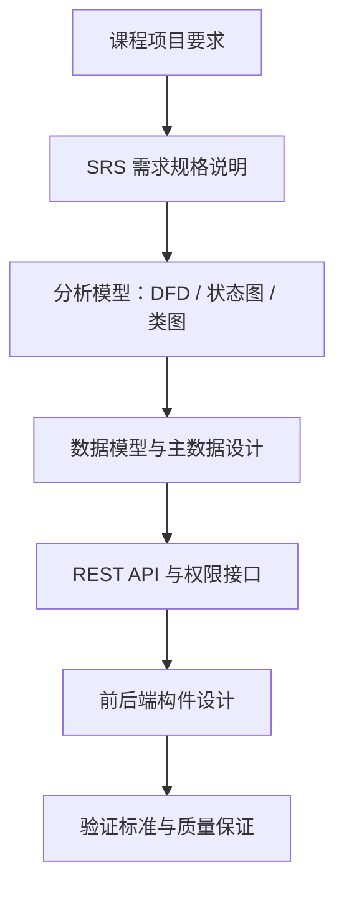

- 需求从课程项目要求和 SRS 文档中抽取
- 分析模型用于明确数据流、状态变化和对象职责
- 数据模型和接口设计保证六个子系统可以协作实现
- 验证标准用于支撑后续开发、测试和验收

> 讲稿：我们的设计主线是从需求出发，先形成 SRS，再抽取数据流图、状态图和类图，之后落到数据库、接口和前后端构件。这样可以保证每个模块不是凭经验直接写页面，而是能从需求追踪到实现和验证。

---

# 项目范围：六个教学服务子系统

STSS 面向高校教学场景，基于校园网络和信息化平台，为教学管理、教学互动、在线评价和成绩分析提供统一服务。系统由 6 个子系统组成：

| 编号 | 子系统                                   | 核心职责                                 |
| ---- | ---------------------------------------- | ---------------------------------------- |
| A    | 基础信息管理（Information Management）   | 用户、权限、课程、组织、培养方案基础数据 |
| B    | 自动排课（Automatic Course Arrangement） | 教室资源、自动排课、手动调课、课表输出   |
| C    | 智能选课（Smart Course Selection）       | 选课约束、选课退选、AI 辅助选课          |
| D    | 论坛交流（Discussion Forum）             | 公告、发帖、回帖、附件、检索与统计       |
| E    | 在线测试（Online Testing）               | 题库、组卷、答题、评分、测试统计         |
| F    | 成绩管理（Score Management）             | 成绩录入、修改控制、查询、分析、GPA      |

> 讲稿：STSS 覆盖高校教学活动的完整链路。A 模块提供统一主数据，B 形成课表，C 支持学生选课，D 支持课程交流，E 支持过程性测试，F 负责正式成绩和成绩分析。后续所有设计都围绕这六个模块之间的数据连续性展开。

---

# 系统上下文：角色与子系统边界

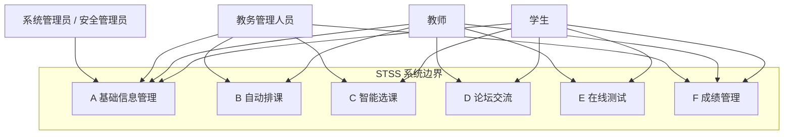

> 讲稿：从系统上下文看，学生、教师、教务管理人员和系统管理员分别访问不同子系统。A 模块承担统一身份和权限入口，其他模块围绕教学活动展开。内部模块之间的数据依赖会在下一页单独说明，避免把访问边界和数据流混在一起。

---

# 总体技术架构

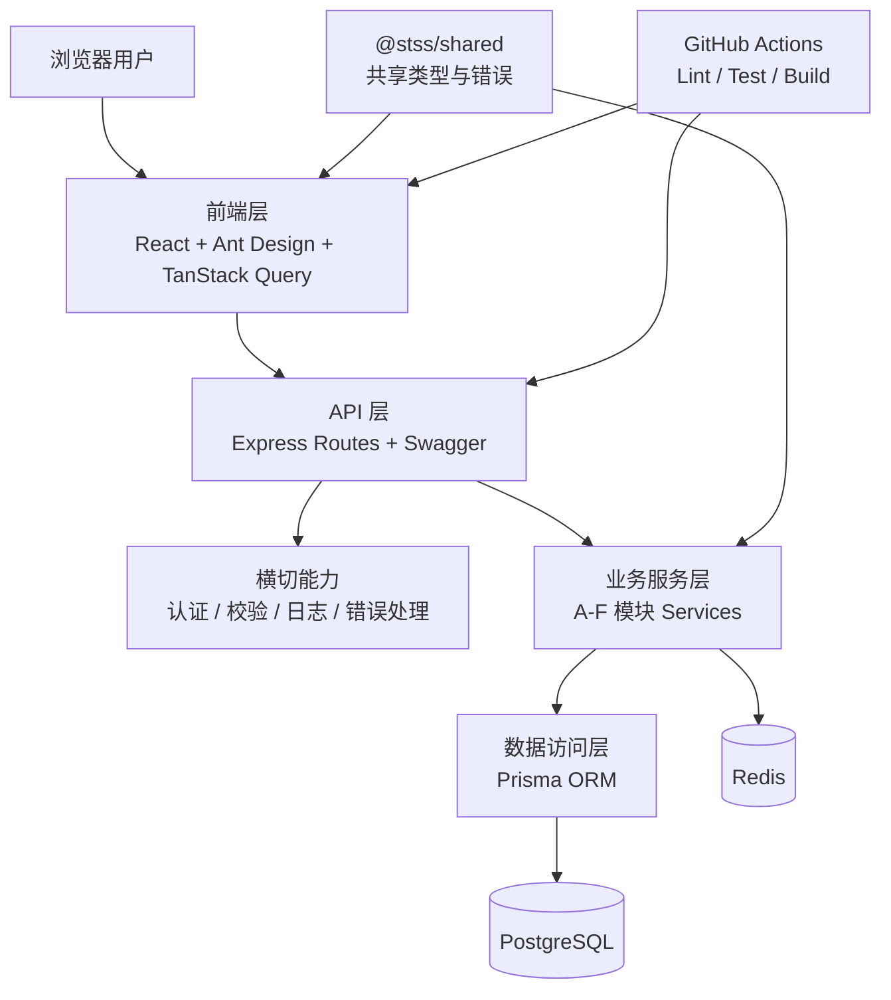

> 讲稿：总体架构按层次拆分：前端层负责交互和状态管理，API 层负责路由和接口文档，横切能力统一处理认证、校验、日志和错误，业务服务层承载 A-F 模块逻辑，数据访问层通过 Prisma 访问 PostgreSQL。共享包和 CI 保证前后端类型口径和质量门禁一致。

---

# 跨子系统数据主线

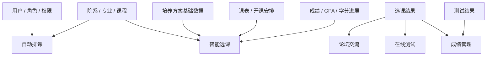

- 用户、权限、课程和培养方案基础数据由 A 模块定义，其他模块复用
- 开课安排来自 B，选课结果来自 C，正式成绩归口 F
- E 的测试结果可以作为 F 成绩分析的辅助输入

> 讲稿：这页强调跨系统一致性。用户、角色、课程、专业和培养方案基础数据不能在每个子系统里各自定义，否则后续实现会出现口径冲突。我们的设计原则是：A 管主数据，B 产生课表，C 基于培养方案约束产生选课记录，E 产生测试结果，F 管正式成绩。

---

# 需求到设计的追踪关系

| 设计对象       | 依据                                      | 在系统设计中的作用                   |
| -------------- | ----------------------------------------- | ------------------------------------ |
| 需求边界       | 课程项目要求 + SRS                        | 明确每个子系统负责什么、不负责什么   |
| UML / 分析模型 | SRS 第 3-9 章                             | 描述数据流、状态变化和对象职责       |
| 数据设计       | `docs/database-design.md` + Prisma Schema | 固化核心实体、字段、关系和约束       |
| 接口设计       | `docs/apis/` + 代码路由                   | 定义前后端和跨模块交互方式           |
| 构件设计       | 当前前后端源码结构                        | 明确页面、路由、服务、数据访问层拆分 |
| 验证设计       | SRS Validation Criteria + 测试代码        | 将需求落实到可检查的验收标准         |

> 讲稿：需求如果只停留在文字层面，很难保证实现一致。因此我们把需求边界、分析模型、数据结构、接口和构件拆分放在同一条追踪链路中。后续实现时，可以从任意一个功能需求追踪到相关实体、接口、代码构件和验证标准。

---

# A 模块：基础信息管理（Information Management）

## 定位与需求边界

- 统一管理用户、角色、权限、院系、专业、课程与培养方案等基础数据
- 为 B-E 模块提供身份识别、权限校验和主数据查询能力
- 不直接实现排课、选课、论坛、测试和成绩统计，只提供这些模块依赖的基础能力
- 关键角色：学生、教师、教务管理员、系统管理员

> 讲稿：这一页说明 A 模块的定位和边界。A 模块负责用户、角色、权限、院系、专业、课程和培养方案这些基础数据，并向 B-E 模块提供身份识别、权限校验和主数据查询。它的边界也很明确：不直接实现排课、选课、论坛、测试和成绩统计，而是为这些业务模块提供统一基础能力。

---

## A 核心流程：登录认证与权限校验

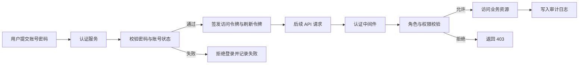

> 讲稿：这一页展示 A 模块的核心认证流程。用户先提交账号密码，认证服务校验密码和账号状态；通过后签发访问令牌和刷新令牌，失败则拒绝登录并记录失败。后续 API 请求统一经过认证中间件和 RBAC 权限校验，允许的请求才能访问业务资源，拒绝的请求返回 403，关键操作会写入审计日志。

---

## A 数据流与账号状态

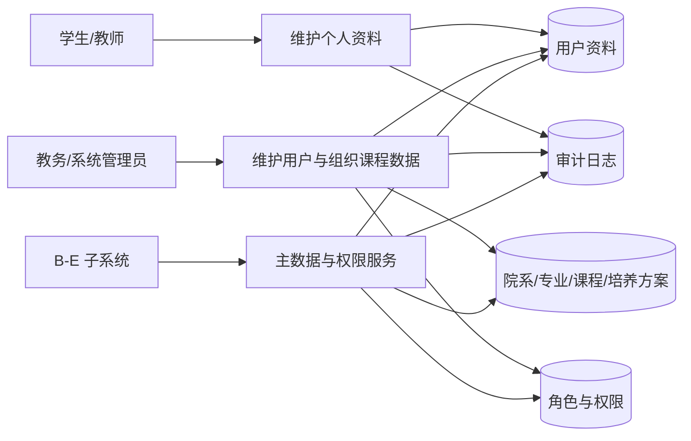

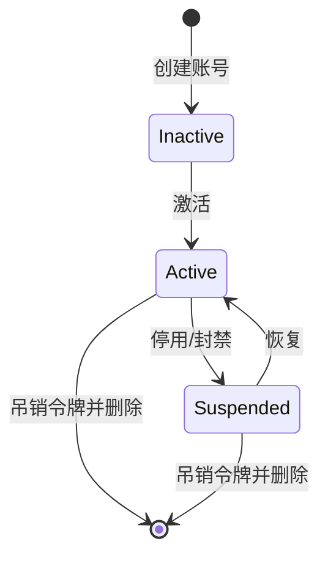

> 讲稿：这一页把 A 模块的数据流和账号状态放在一起看。左侧数据流说明学生、教师和管理员如何维护用户资料、组织课程数据、角色权限，并通过主数据与权限服务支撑 B-E 子系统。右侧状态图说明账号从创建、激活、停用或封禁，到恢复或删除的生命周期；这些状态直接影响用户能否登录和访问接口。

---

## A 领域模型：身份、组织与课程主数据

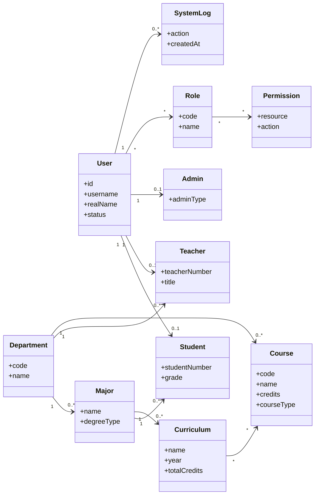

> 讲稿：这一页展示 A 模块的领域模型，核心分成三组。第一组是身份模型，User 是统一账号入口，Student、Teacher 和 Admin 保存不同角色的扩展信息；第二组是权限模型，Role 和 Permission 表达 RBAC；第三组是组织与课程主数据，Department、Major、Course 和 Curriculum 表达院系、专业、课程和培养方案之间的关系。SystemLog 用于记录关键操作。

---

## A 接口与构件设计

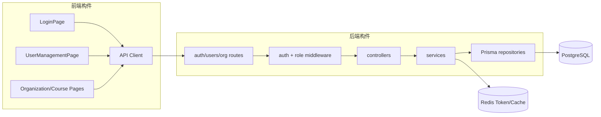

- 认证类接口：登录、刷新令牌、退出登录、查询当前用户
- 用户类接口：用户列表、用户详情、创建、更新、停用、删除
- 权限类接口：角色查询、权限查询、用户角色维护
- 主数据接口：院系、专业、课程、培养方案查询与维护
- 审计接口：系统日志查询、关键操作追踪

> 讲稿：这一页同时说明 A 模块的接口类别和构件拆分。接口上，A 模块包括认证、用户、权限、主数据和审计五类接口；构件上，前端页面通过统一 API Client 访问后端，后端再经过 routes、认证和角色中间件、controller、service、Prisma repository 访问 PostgreSQL，Redis 用于令牌和缓存相关能力。

---

## A 设计模式、质量保证与演示素材

- 设计模式：分层架构、RBAC、Repository、DTO/Schema 校验、统一错误处理
- 质量重点：密码哈希、刷新令牌轮换、会话吊销、越权拦截、审计日志
- 验证方式：认证测试、用户管理测试、权限边界测试、接口文档检查
- 当前可展示：登录页、用户列表、角色权限查询、系统日志、Swagger 接口
- 后续补强：课程基础信息、培养方案管理、完整角色权限管理页面

> 讲稿：这一页总结 A 模块的设计模式、质量保证和演示素材。设计上采用分层架构、RBAC、Repository、DTO 和 Schema 校验以及统一错误处理；质量上重点覆盖密码哈希、令牌轮换、会话吊销、越权拦截和审计日志；验证上通过认证、用户管理、权限边界和接口文档检查来保证可靠性。演示时可以展示登录、用户列表、角色权限、系统日志和 Swagger 接口。

---

# B 模块：自动排课（Automatic Course Arrangement）

## 定位与需求边界

- 根据课程、教师、教室、时间和容量等约束生成课表
- 支持教室资源维护、自动排课、人工调整、课表查询与打印
- 上游依赖 A 模块的课程、教师、教室等主数据
- 下游向 C 模块提供课程开设和课表结果，供学生选课使用
- 不负责学生选课结果，也不负责教师论坛、测试和成绩业务

> 讲稿：这一页说明 B 模块的定位和边界。B 模块负责根据课程、教师、教室、时间和容量等约束生成课表，并支持教室资源维护、自动排课、人工调整、课表查询和打印。它依赖 A 模块提供课程、教师和教室等主数据，最终向 C 模块提供课程开设和课表结果，但不负责学生选课、论坛、测试和成绩业务。

---

## B 核心流程：排课任务到课表发布

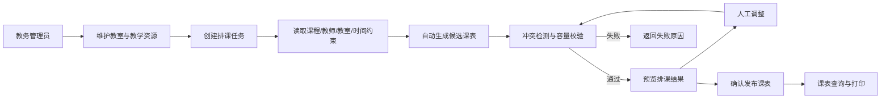

> 讲稿：这一页展示 B 模块从排课任务到课表发布的主流程。教务管理员先维护教室和教学资源，再创建排课任务；系统读取课程、教师、教室和时间约束后生成候选课表，并进行冲突检测和容量校验。通过后进入预览，失败时返回原因；管理员可以人工调整，调整后仍然回到同一套校验流程，最终确认发布并支持查询和打印。

---

## B 数据流与排课状态

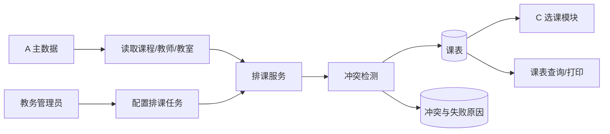

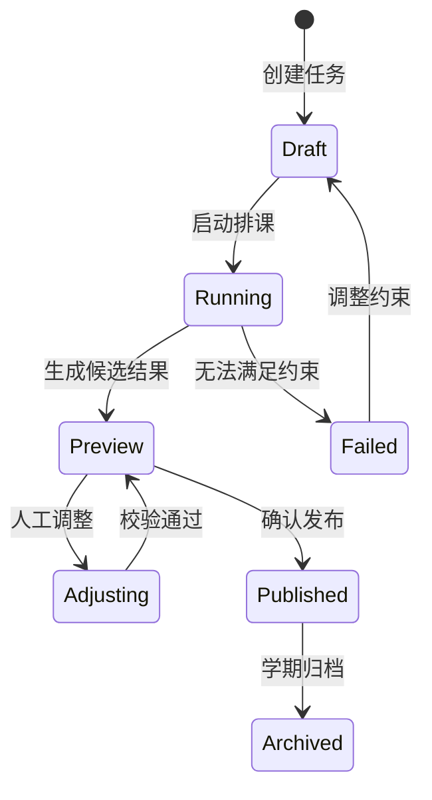

> 讲稿：这一页把 B 模块的数据流和排课任务状态合并展示。数据流上，B 从 A 模块读取课程、教师和教室主数据，结合教务管理员配置的排课任务进入排课服务，再通过冲突检测生成课表或失败原因；发布后的课表会提供给 C 模块和课表查询功能。状态上，任务从草稿、运行、预览、失败、调整到发布和归档，每一步都对应不同的操作限制。

---

## B 领域模型：资源、开课与课表

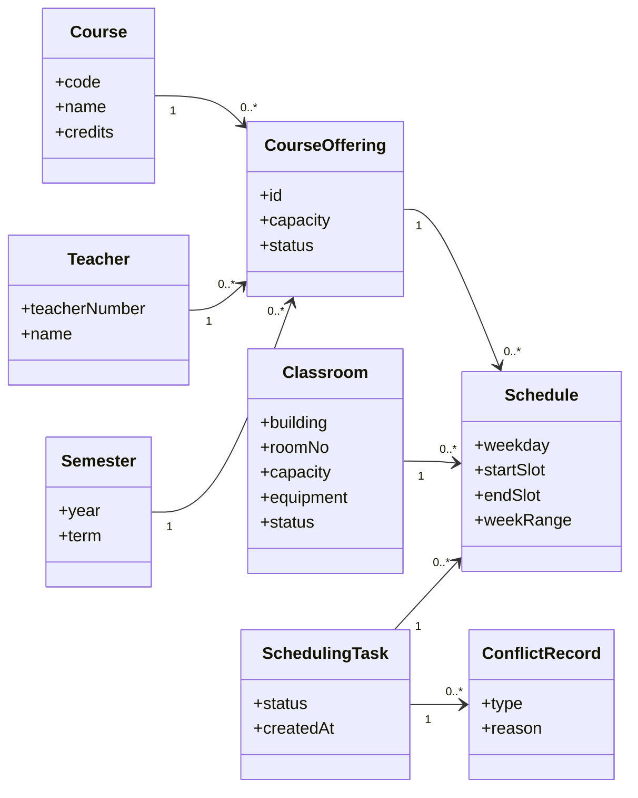

> 讲稿：这一页展示 B 模块的领域模型。Course、Teacher、Semester 和 Classroom 共同决定一次 CourseOffering，也就是某学期某门课程由某位教师开设。Schedule 记录这次开课的具体时间、周次和教室；SchedulingTask 表示一次排课任务，ConflictRecord 记录任务中出现的冲突类型和原因，用于解释和调整排课结果。

---

## B 接口与构件设计

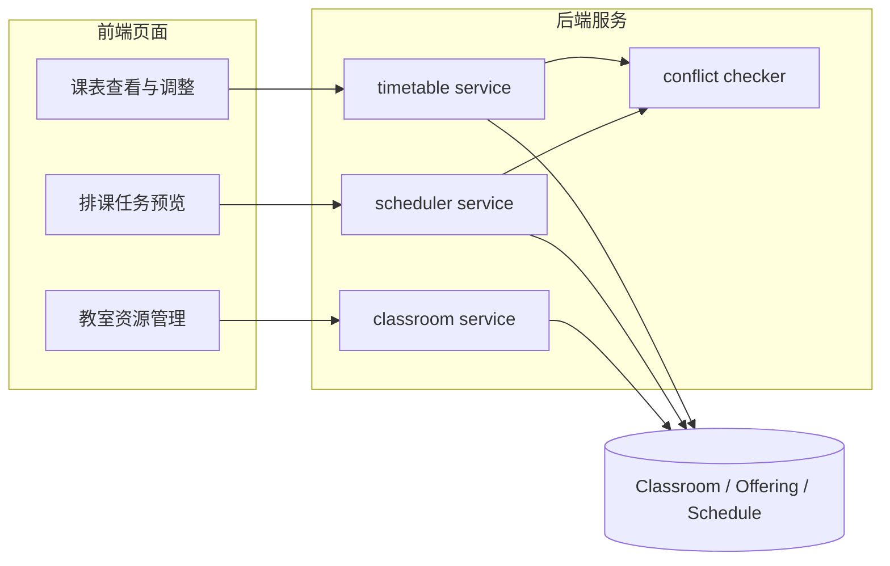

- 教室资源：新增、修改、停用、按容量和设备筛选
- 排课任务：创建任务、生成候选课表、查看失败原因
- 手动调整：修改时间或教室，并复用冲突检测
- 课表查询：按教师、学生、教室、学期查询和打印

> 讲稿：这一页说明 B 模块的接口能力和构件组织。前端按教室资源管理、排课任务预览、课表查看与调整拆分页面；后端对应 classroom service、scheduler service 和 timetable service。冲突检测被抽成独立构件，既服务自动排课，也服务手动调课。接口层面覆盖教室资源维护、排课任务生成、手动调整和多维度课表查询。

---

## B 设计模式、质量保证与演示素材

- 设计模式：策略模式表达不同排课规则，服务层封装排课事务，冲突检测作为可复用领域服务
- 质量重点：教师时间冲突、教室时间冲突、容量限制、设备匹配、发布前二次校验
- 验证方式：构造冲突样例、容量边界样例、手动调课回归样例
- 当前可展示：教室资源页面、排课任务预览、课表查看与冲突提示
- 后续补强：自动排课算法细化、课表导出、与 C 模块 CourseOffering 数据对接

> 讲稿：这一页总结 B 模块的设计模式、质量保证和演示素材。设计上可以用策略模式表达不同排课规则，用服务层封装排课事务，并把冲突检测作为可复用领域服务。质量上重点验证教师时间冲突、教室时间冲突、容量限制、设备匹配和发布前二次校验。演示时可以展示教室资源页面、排课任务预览、课表查看和冲突提示。

---

# C 模块：智能选课（Smart Course Selection）

## 定位与需求边界

- 帮助学生基于培养方案、课表、容量和先修约束完成选课
- 支持课程搜索、可选课程推荐、选课/退课、选课结果查询和教务干预
- 上游依赖 A 的学生、课程、培养方案数据，以及 B 的课程开设和课表
- 下游向 D、E、F 提供学生与课程开设之间的正式参与关系
- AI 只做辅助解释和推荐，不能绕过后端约束直接写入选课记录

> 讲稿：这一页说明 C 模块的定位和边界。C 模块负责帮助学生基于培养方案、课表、容量和先修约束完成选课，功能包括课程搜索、推荐、选课退课、结果查询和教务干预。它依赖 A 的学生、课程和培养方案数据，以及 B 的课程开设和课表结果；同时向 D、E、F 提供正式选课关系。AI 只做辅助解释和推荐，不能绕过后端规则直接写入选课记录。

---

## C 核心流程：约束选课与 AI 辅助

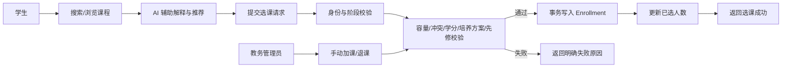

> 讲稿：这一页展示 C 模块的核心选课流程。学生先搜索或浏览课程，可以通过 AI 辅助理解课程和培养方案，然后提交选课请求。后端依次进行身份与阶段校验、容量、冲突、学分、培养方案和先修课校验；通过后用事务写入 Enrollment 并更新已选人数，失败则返回明确原因。教务管理员的手动加退课也进入同一套规则校验。

---

## C 数据流与选课状态

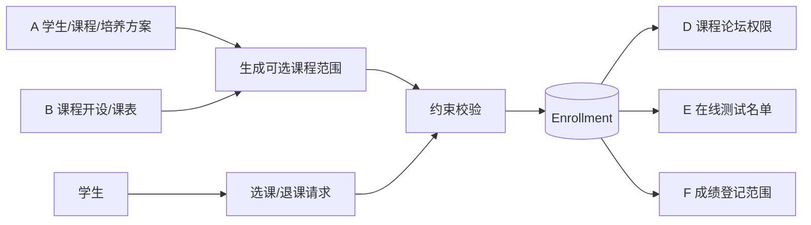

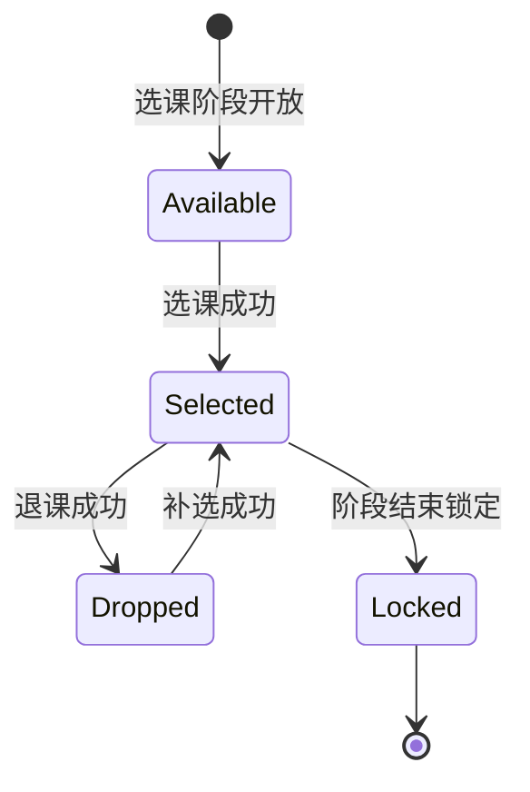

> 讲稿：这一页把 C 模块的数据流和选课状态放在一起。数据流上，A 提供学生、课程和培养方案，B 提供课程开设和课表，C 基于这些数据生成可选课程范围并完成约束校验，最后写入 Enrollment。Enrollment 会继续提供给 D 的论坛权限、E 的测试名单和 F 的成绩登记范围。状态上，选课记录从可选、已选、退课、补选到锁定，体现选课阶段对操作的控制。

---

## C 领域模型：开课、阶段与选课记录

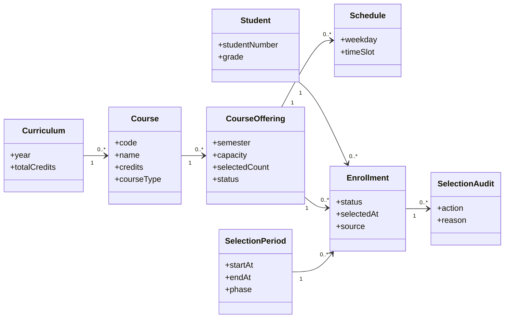

> 讲稿：这一页展示 C 模块的领域模型。Student、Curriculum 和 Course 描述学生培养方案和课程要求；CourseOffering 表达具体学期开课，Schedule 支撑时间冲突判断；SelectionPeriod 控制选课阶段；Enrollment 记录学生与课程开设之间的正式关系；SelectionAudit 保存教务干预和关键操作原因，保证选课结果可追踪。

---

## C 接口与构件设计

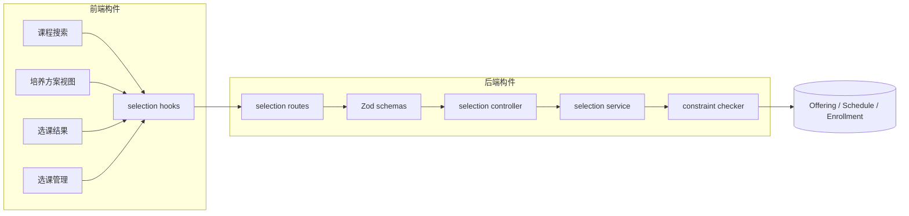

- 学生端：查询可选课程、查看课程详情、选课、退课、查看结果
- 教师端：查看本人课程的学生名单，不能越权访问其他课程
- 教务端：配置选课阶段、手动加退课、查看容量和异常情况
- AI 辅助：读取课程和培养方案信息，只返回建议，不直接写 Enrollment

> 讲稿：这一页说明 C 模块的接口和构件设计。前端包括课程搜索、培养方案视图、选课结果、选课管理页面，以及 selection hooks；后端包括 routes、Zod schemas、controller、selection service 和 constraint checker。接口按角色拆分：学生端负责查询、选课、退课和结果查看；教师端查看本人课程名单；教务端配置阶段和手动处理；AI 辅助接口只提供建议，不直接写入 Enrollment。

---

## C 设计模式、质量保证与演示素材

- 设计模式：事务脚本处理选课写入，规则校验器集中管理约束，API client 和 hooks 隔离前端请求细节
- 质量重点：容量并发、重复选课、时间冲突、最大学分、先修课、阶段关闭、权限隔离
- 验证方式：并发选课测试、边界容量测试、越权访问测试、阶段状态测试
- 当前可展示：课程搜索、可选课程列表、选课结果、教师名单、教务管理、AI 辅助建议
- 协作重点：C1-C6 可分别围绕培养方案、搜索、选课事务、名单、阶段管理和 AI 辅助推进

> 讲稿：这一页总结 C 模块的设计模式、质量保证、演示素材和协作重点。设计上用事务脚本处理选课写入，用规则校验器集中管理容量、冲突、学分、先修课和阶段规则，前端用 API client 和 hooks 隔离请求细节。质量上重点验证容量并发、重复选课、时间冲突、权限隔离和阶段关闭。演示时可以展示课程搜索、可选课程、选课结果、教师名单、教务管理和 AI 辅助建议；协作上 C1-C6 可以按这些功能域并行推进。

---

# D 模块：论坛交流（Discussion Forum）

## 定位与需求边界

- 围绕课程开设提供公告、发帖、回帖、附件、检索和统计功能
- 只有课程相关师生可以访问对应课程论坛内容
- 教师可发布公告和置顶内容，管理员可进行跨课程管理和统计
- 上游依赖 A 的用户身份和 C 的选课关系
- 不实现即时聊天，也不承担测试和成绩管理功能

> 讲稿：这一页说明 D 模块的定位和边界。D 模块围绕课程开设提供公告、发帖、回帖、附件、检索和统计功能。访问范围由 A 的身份角色和 C 的选课关系共同决定：学生只能进入自己选课范围内的课程论坛，教师管理自己授课范围内的课程论坛。它不实现即时聊天，也不承担测试和成绩管理功能。

---

## D 核心流程：发帖、公告与评论

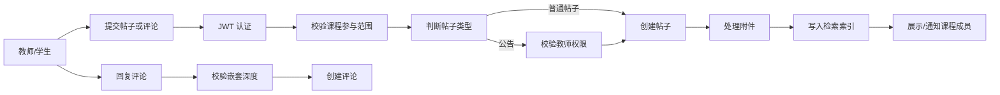

> 讲稿：这一页展示 D 模块的发帖、公告和评论流程。教师或学生提交帖子和评论后，系统先做 JWT 认证，再校验用户是否属于目标课程。普通帖子可以在课程范围内创建，公告需要额外校验教师权限；创建后处理附件、写入检索索引并展示或通知课程成员。评论流程还要校验嵌套深度，避免无限层级回复。

---

## D 数据流与内容状态

```mermaid
flowchart LR
    A["A 用户与角色"] --> P1["身份与权限校验"]
    C["C 选课关系"] --> P1
    Teacher["教师"] --> P2["公告/帖子管理"]
    Student["学生"] --> P3["发帖/评论"]
    P1 --> P2
    P1 --> P3
    P2 --> PostStore[("帖子/公告")]
    P3 --> PostStore
    P3 --> CommentStore[("评论")]
    P2 --> FileStore[("附件")]
    PostStore --> Search["全文检索"]
    CommentStore --> Search
    PostStore --> Stats["发帖统计"]
```

```mermaid
stateDiagram-v2
    [*] --> Visible: 发布
    Visible --> Hidden: 管理员隐藏
    Hidden --> Visible: 恢复
    Visible --> Deleted: 删除
    Hidden --> Deleted: 删除
    Deleted --> [*]
```

> 讲稿：这一页把 D 模块的数据流和内容状态合并展示。数据流上，D 从 A 获取用户和角色，从 C 获取选课关系，然后支持教师管理公告和帖子、学生发帖评论，并把数据写入帖子、评论和附件存储，进一步支撑全文检索和发帖统计。状态上，内容发布后为可见，管理员可以隐藏或恢复，也可以删除；这些状态用于兼顾展示控制和审计追踪。

---

## D 领域模型：课程论坛内容

```mermaid
classDiagram
    direction LR
    class User {
      +id
      +realName
      +role
    }
    class CourseOffering {
      +id
      +semester
    }
    class Enrollment {
      +status
    }
    class ForumPost {
      +title
      +content
      +type
      +status
      +createdAt
    }
    class ForumComment {
      +content
      +status
      +depth
    }
    class ForumAttachment {
      +fileName
      +fileType
      +size
    }
    class ForumStatistic {
      +postCount
      +commentCount
    }

    CourseOffering "1" --> "0..*" ForumPost
    User "1" --> "0..*" ForumPost
    ForumPost "1" --> "0..*" ForumComment
    User "1" --> "0..*" ForumComment
    ForumComment "0..1" --> "0..*" ForumComment
    ForumPost "1" --> "0..*" ForumAttachment
    CourseOffering "1" --> "0..*" Enrollment
    CourseOffering "1" --> "0..*" ForumStatistic
```

> 讲稿：这一页展示 D 模块的领域模型。ForumPost 是核心实体，关联课程开设 CourseOffering 和作者 User；ForumComment 关联帖子和评论者，并通过自关联表达回复关系；ForumAttachment 保存帖子附件；ForumStatistic 支撑课程论坛统计。Enrollment 虽然不是论坛内容实体，但它决定学生是否有权限访问对应课程论坛。

---

## D 接口与构件设计

```mermaid
flowchart LR
    subgraph Frontend["前端构件"]
      ForumHome["课程论坛首页"]
      PostEditor["发帖/公告编辑"]
      CommentTree["评论树"]
      SearchPage["检索与统计"]
    end
    subgraph Backend["后端构件"]
      Routes["forum routes"]
      Auth["auth + course scope middleware"]
      Controller["forum controller"]
      Service["post/comment/attachment service"]
      SearchSvc["search/stat service"]
    end
    DB[("Post / Comment / Attachment")]

    ForumHome --> Routes
    PostEditor --> Routes
    CommentTree --> Routes
    SearchPage --> Routes
    Routes --> Auth --> Controller --> Service --> DB
    Service --> SearchSvc --> DB
```

- 帖子接口：列表、详情、创建、编辑、删除、置顶
- 公告接口：教师发布课程公告，学生按课程查看
- 评论接口：回复、删除、折叠展示，限制嵌套深度
- 附件接口：上传、下载、类型和大小校验
- 检索统计：全文搜索、热门帖、个人发帖数量统计

> 讲稿：这一页说明 D 模块的接口和构件设计。前端包括课程论坛首页、发帖公告编辑、评论树、检索和统计页面；后端通过 forum routes 进入认证和课程范围中间件，再由 controller 调用帖子、评论、附件、检索和统计服务。接口能力覆盖帖子、公告、评论、附件、检索和统计，并在不同角色之间设置不同权限层次。

---

## D 设计模式、质量保证与演示素材

- 设计模式：课程范围隔离、软删除、审计日志、评论树构建、附件白名单
- 质量重点：越权访问、公告权限、附件安全、评论嵌套、全文检索准确性
- 验证方式：课程成员访问测试、非成员拒绝测试、附件类型测试、评论层级测试
- 当前可展示：公告、发帖、评论、附件、检索、统计；后端已有帖子、评论、公告、检索、统计和附件相关测试基础
- 后续补强：前端真实接口对接、课程论坛入口与 C 模块选课结果联动

> 讲稿：这一页总结 D 模块的设计模式、质量保证和演示素材。设计上重点使用课程范围隔离、软删除、审计日志、评论树构建和附件白名单。质量上需要验证越权访问、公告权限、附件安全、评论层级和全文检索准确性。演示时可以展示公告、发帖、评论、附件、检索和统计，并说明后续前端会与真实接口和 C 模块选课结果联动。

---

# E 模块：在线测试（Online Testing）

## 定位与需求边界

- 支持题库管理、组卷、发布测试、在线答题、自动评分和统计分析
- 教师负责题库、试卷和结果分析，学生在线完成测试并查看成绩
- 上游依赖 A 的身份和课程数据、C 的选课名单
- 下游向 F 模块提供过程性测试成绩
- 不负责最终成绩归档、GPA 计算和正式成绩修改审批

> 讲稿：这一页说明 E 模块的定位和边界。E 模块负责题库管理、组卷、测试发布、在线答题、自动评分和统计分析。教师维护题库和试卷并查看分析结果，学生在线完成测试并查看成绩。它依赖 A 的身份和课程数据、C 的选课名单，并向 F 模块提供过程性测试成绩，但不负责最终成绩归档、GPA 计算和正式成绩修改审批。

---

## E 核心流程：题库到成绩同步

```mermaid
flowchart LR
    Teacher["教师"] --> Bank["维护题库"]
    Bank --> Paper["手工/自动组卷"]
    Paper --> Publish["发布测试"]
    Publish --> Student["学生进入测试"]
    Student --> Answer["在线答题与自动暂存"]
    Answer --> Submit["提交试卷"]
    Submit --> Grade["自动/人工评分"]
    Grade --> Analysis["统计分析"]
    Analysis --> Sync["同步过程性成绩到 F"]
```

> 讲稿：这一页展示 E 模块从题库到成绩同步的主流程。教师先维护题库，再通过手工或自动方式组卷并发布测试；学生进入测试后在线答题，系统进行自动暂存；提交后进入自动或人工评分，再生成统计分析结果，最后把过程性成绩同步给 F 模块。这条流程覆盖了在线测试从准备到结果沉淀的完整链路。

---

## E 数据流与答题状态

```mermaid
flowchart LR
    A["A 用户/课程"] --> P1["身份与课程校验"]
    C["C 选课名单"] --> P1
    Teacher["教师"] --> P2["题库与试卷管理"]
    Student["学生"] --> P3["答题与提交"]
    P1 --> P2
    P1 --> P3
    P2 --> QuestionStore[("题库")]
    P2 --> PaperStore[("试卷")]
    P3 --> SessionStore[("答题会话")]
    P3 --> AnswerStore[("答案")]
    AnswerStore --> ScoreStore[("测试成绩")]
    ScoreStore --> F["F 成绩管理"]
```

```mermaid
stateDiagram-v2
    [*] --> NotStarted: 发布测试
    NotStarted --> InProgress: 开始答题
    InProgress --> Saved: 自动暂存
    Saved --> InProgress: 继续答题
    InProgress --> Submitted: 提交
    Submitted --> Graded: 评分完成
    Graded --> [*]
```

> 讲稿：这一页把 E 模块的数据流和答题状态放在一起。数据流上，E 从 A 获取用户和课程信息，从 C 获取选课名单，教师侧写入题库和试卷，学生侧产生答题会话、答案和测试成绩，测试成绩再提供给 F 模块。状态上，一次测试从未开始、答题中、自动暂存、继续答题、提交到评分完成，每个状态都对应不同的操作限制。

---

## E 领域模型：试卷结构与学生作答

```mermaid
classDiagram
    direction LR
    class Question {
      +type
      +content
      +answer
      +difficulty
    }
    class QuestionBank {
      +courseId
      +name
    }
    class Paper {
      +title
      +totalScore
      +duration
      +status
    }
    class PaperQuestion {
      +score
      +order
    }
    class TestSession {
      +startAt
      +endAt
      +status
    }
    class Answer {
      +content
      +score
    }
    class TestResult {
      +totalScore
      +submittedAt
    }
    class CourseOffering {
      +id
      +semester
    }

    CourseOffering "1" --> "0..*" QuestionBank
    QuestionBank "1" --> "0..*" Question
    Paper "1" --> "0..*" PaperQuestion
    Question "1" --> "0..*" PaperQuestion
    Paper "1" --> "0..*" TestSession
    TestSession "1" --> "0..*" Answer
    TestSession "1" --> "1" TestResult
    CourseOffering "1" --> "0..*" Paper
```

> 讲稿：这一页展示 E 模块的领域模型。QuestionBank 和 Question 表示课程题库及题目；Paper 表示一次试卷，PaperQuestion 固定试卷中的题目顺序和分值；TestSession 表示学生的一次答题过程，Answer 保存学生提交内容，TestResult 保存最终测试结果。这样把题库、试卷结构和学生作答分离，可以保证历史试卷和成绩稳定。

---

## E 接口与构件设计

```mermaid
flowchart LR
    subgraph Frontend["前端构件"]
      BankPage["题库管理"]
      PaperPage["组卷发布"]
      ExamPage["在线答题"]
      ResultPage["成绩统计"]
    end
    subgraph Backend["后端构件"]
      Routes["testing routes"]
      Auth["auth + course member check"]
      QuestionSvc["question service"]
      PaperSvc["paper service"]
      SessionSvc["session service"]
      GradeSvc["grading/stat service"]
    end
    DB[("Question / Paper / Session / Result")]

    BankPage --> Routes
    PaperPage --> Routes
    ExamPage --> Routes
    ResultPage --> Routes
    Routes --> Auth
    Auth --> QuestionSvc --> DB
    Auth --> PaperSvc --> DB
    Auth --> SessionSvc --> DB
    Auth --> GradeSvc --> DB
```

- 题库接口：题目查询、新增、修改、删除、按课程归类
- 试卷接口：手工组卷、自动组卷、发布、撤回
- 答题接口：开始测试、暂存答案、提交试卷、查看结果
- 统计接口：分数分布、题目正确率、学生历史趋势
- 同步接口：将过程性测试结果提供给 F 模块

> 讲稿：这一页说明 E 模块的接口和构件设计。前端包括题库管理、组卷发布、在线答题和成绩统计页面；后端通过 testing routes 和课程成员校验进入 question service、paper service、session service 和 grading/stat service。接口能力包括题库维护、试卷组卷和发布、开始测试、暂存答案、提交试卷、查看结果、统计分析和向 F 模块同步过程性成绩。

---

## E 设计模式、质量保证与演示素材

- 设计模式：试卷快照、状态机、自动暂存、评分服务、统计聚合
- 质量重点：计时准确、断线恢复、防重复提交、评分一致性、成绩同步可靠性
- 验证方式：超时提交测试、自动保存恢复测试、重复提交测试、客观题评分测试、统计结果校验
- 当前可展示：题库、组卷、测试发布、学生答题、成绩统计图、测试结果同步说明
- 后续补强：主观题人工评分流程、异常提交处理、与 F 模块成绩口径对齐

> 讲稿：这一页总结 E 模块的设计模式、质量保证和演示素材。设计上使用试卷快照、状态机、自动暂存、评分服务和统计聚合；质量上重点关注计时准确、断线恢复、防重复提交、评分一致性和成绩同步可靠性。验证时需要覆盖超时提交、自动保存恢复、重复提交、客观题评分和统计结果校验。演示时可以展示题库、组卷、测试发布、学生答题、成绩统计图和测试结果同步说明。

---

# F 模块：成绩管理（Score Management）

## 成绩管理设计要点

- 需求边界：任课教师成绩录入、学生成绩查询、成绩修改控制、成绩分析
- 核心对象：Enrollment、Score、ScoreModificationLog、GPARecord、CourseOffering
- 关键约束：初次录入后再次修改需要管理流程，成绩分析包含课程与个人两个维度
- 接口设计：成绩录入、修改申请/审批、学生查询、课程统计、GPA/学分进展

```mermaid
flowchart LR
    Enrollment["选课记录"] --> Entry["教师录入成绩"]
    Entry --> Score["成绩记录"]
    Score --> Modify["修改申请 / 审批"]
    Modify --> Log["修改日志"]
    Score --> Analysis["课程成绩分析"]
    Score --> GPA["学生 GPA / 学分进展"]
```

[图片占位：F 组成绩录入、学生成绩查询、成绩分析图表截图]

> 讲稿：F 模块是整个教学闭环的收口。它基于选课记录产生正式成绩，并提供修改控制和分析能力。设计上要特别说明成绩修改日志和审批控制，避免成绩数据被随意覆盖。

---

# 跨系统接口与集成契约

| 提供方 | 消费方        | 共享数据 / 契约                                      |
| ------ | ------------- | ---------------------------------------------------- |
| A      | B-F           | 用户、角色、权限、课程、院系、专业、培养方案基础数据 |
| B      | C、教师、教务 | 开课安排、教室时间、课表结果                         |
| C      | D、E、F       | 学生选课结果、课程参与范围                           |
| E      | F             | 测试成绩、统计结果、过程性评价数据                   |
| F      | C、学生       | 学分进展、GPA、已获得成绩                            |
| Shared | 前端、后端    | 通用类型、错误、枚举、响应结构                       |

- 跨模块共享对象必须使用统一字段和状态枚举
- 所有受保护接口必须走认证中间件
- 接口变更需同步 API 文档、共享类型、前端 client 和测试

> 讲稿：最后回到整体架构。跨系统集成的关键不是每个模块各写各的，而是把数据契约稳定下来。A 提供主数据，B 提供课表，C 提供选课，E 提供测试结果，F 提供成绩。接口变更必须同步文档、类型、前端 client 和测试。

---

# 质量保证措施

```mermaid
flowchart TB
    Req["课程要求 / SRS"] --> Trace["需求追踪矩阵"]
    Trace --> Design["UML / 接口 / 构件设计"]
    Design --> Impl["代码实现"]
    Impl --> Test["单元测试 / 集成测试"]
    Test --> CI["CI 检查"]
    CI --> Demo["截图 / 视频 / 演示验收"]
    Demo --> Review["问题复盘与后续计划"]
```

| 层级       | 措施                                              |
| ---------- | ------------------------------------------------- |
| 需求       | SRS 编号、用户场景、Validation Criteria           |
| 设计       | DFD、状态图、类图、CRC、接口表、构件图            |
| 实现       | TypeScript、Zod 校验、Prisma Schema、统一错误处理 |
| 代码检查   | Lint、Typecheck、Build 作为基础质量门禁           |
| 测试       | 单元测试、集成测试、关键业务流程测试              |
| 接口一致性 | API 文档、共享类型、前端 API client 同步更新      |
| 交付验证   | 关键流程演示、截图或视频、测试报告                |

> 讲稿：质量保证从需求开始，而不是最后才测试。我们的链路是：需求编号对应设计图和接口，设计再对应代码实现，最后用测试和演示素材验证。基础门槛包括 lint、typecheck、build、单元测试、集成测试和 API 文档一致性检查；当前 A 模块已经具备 auth/users 相关测试基础。

---

# 团队协作与过程管理

| 协作对象     | 主要责任                                  | 协作接口                                      |
| ------------ | ----------------------------------------- | --------------------------------------------- |
| 基础信息管理 | 统一身份、权限、课程与培养方案基础数据    | 向 B-F 提供用户、角色、课程、培养方案基础数据 |
| 自动排课     | 教室资源、排课、调课、课表输出            | 消费 A 的课程/教师数据，向 C 输出课表         |
| 智能选课     | 培养方案约束、课程检索、选课退选、AI 辅助 | 消费 A/B 数据，向 D/E/F 输出选课结果          |
| 论坛交流     | 公告、帖子、评论、附件、检索统计          | 消费课程和选课范围，服务教学互动              |
| 在线测试     | 题库、组卷、答题、评分统计                | 消费课程和学生名单，向 F 提供测试结果         |
| 成绩管理     | 成绩录入、修改控制、查询分析              | 消费选课和测试数据，输出成绩和学分进展        |

[图片占位：项目会议记录截图或周会纪要列表]
[图片占位：任务看板、分支或 PR 进度截图]

> 讲稿：协作方式上，我们按六个子系统拆分责任，同时通过共享数据和接口契约保证集成。每个模块都有自己的业务边界，也都有明确的上游和下游。过程管理上，我们会用会议记录、任务看板和分支记录来说明任务推进情况。

---

# 后续迭代安排

| 阶段                 | 目标                                 | 交付物                              |
| -------------------- | ------------------------------------ | ----------------------------------- |
| 设计细化与一致性校准 | 更新模块 UML、接口契约和关键构件说明 | 模块设计图、接口表、演示截图        |
| 接口联调             | 固化跨模块契约                       | API 文档、共享类型、Mock 或真实接口 |
| 功能实现             | 各模块按 SRS 验证标准推进            | 前后端功能、数据库迁移、测试        |
| 集成测试             | 验证主业务链路                       | 用户 → 排课 → 选课 → 测试 → 成绩    |
| 最终交付             | 完成演示和验收材料                   | 演示视频/截图、测试报告、部署说明   |

> 讲稿：后续安排围绕三个目标推进：先把设计讲清楚，再把接口契约稳定下来，最后按 SRS 的验证标准实现和测试。最终演示不只展示单点页面，而要展示用户、排课、选课、测试、成绩之间的完整业务链路。

---

# 总结：本次设计的三个核心结论

1. STSS 是六个子系统协同的教学服务平台，不是六个孤立功能页面。
2. A 模块是统一身份、权限和主数据基础，决定 B-F 的集成质量。
3. 系统设计可以从需求追踪到 UML、接口、构件、测试和演示材料。

```mermaid
flowchart TB
    Req["需求"] --> UML["UML"]
    UML --> API["接口"]
    API --> Component["构件"]
    Component --> Test["验证"]
    Test --> Demo["演示"]
```

> 讲稿：总结一下，我们的设计重点有三个。第一，系统是六个子系统的协同链路；第二，A 模块提供统一身份和主数据，是集成基础；第三，设计不是停留在图上，而要能继续追踪到接口、构件、测试和演示。后续实现会围绕这条链路推进，保证系统能够形成完整的教学服务闭环。
