# Smart Teaching Service System

## 智能教学服务系统设计报告

- 面向高校教学全过程的综合性教学服务平台
- 覆盖基础信息管理、自动排课、智能选课、论坛交流、在线测试、成绩管理六个子系统
- 以统一身份、统一主数据和跨模块业务协作为核心设计基础
- 目标是支撑教学管理、教学互动、过程评价和成绩分析的完整闭环

> 讲稿：大家好，我们汇报的是 Smart Teaching Service System，简称 STSS。这个系统面向高校教学场景，目标是把教学管理、课程安排、学生选课、课程交流、在线测试和成绩管理连接成一个统一的平台。今天我们会重点说明系统的整体架构、子系统设计、模块协作方式和后续实现计划。

---

# 项目背景与建设目标

- 高校教学活动涉及多角色、多资源、多流程协同
- 学生、教师、教务管理人员和系统管理员需要在统一系统中完成教学相关操作
- 六个子系统之间共享用户、课程、培养方案、开课安排、选课结果和成绩数据
- 系统需要在功能完整性的基础上，保证权限安全、数据一致性和后续可扩展性

> 讲稿：STSS 的背景是高校教学活动本身具有明显的跨角色和跨流程特点。学生选课依赖培养方案和课表，教师测试和成绩录入依赖课程与学生名单，教务管理又需要维护课程、教师、教室和权限。因此系统设计必须先解决统一数据和模块协作问题。

---

# 系统设计主线

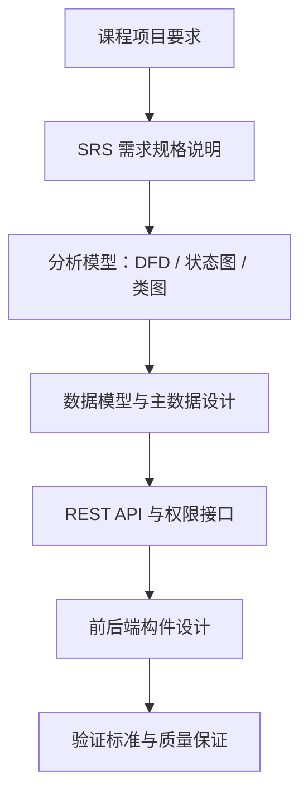
```mermaid
flowchart TB
    Req["课程项目要求"] --> SRS["SRS 需求规格说明"]
    SRS --> Model["分析模型：DFD / 状态图 / 类图"]
    Model --> Data["数据模型与主数据设计"]
    Data --> API["REST API 与权限接口"]
    API --> Component["前后端构件设计"]
    Component --> QA["验证标准与质量保证"]
```

- 需求从课程项目要求和 SRS 文档中抽取
- 分析模型用于明确数据流、状态变化和对象职责
- 数据模型和接口设计保证六个子系统可以协作实现
- 验证标准用于支撑后续开发、测试和验收

> 讲稿：我们的设计主线是从需求出发，先形成 SRS，再抽取数据流图、状态图和类图，之后落到数据库、接口和前后端构件。这样可以保证每个模块不是凭经验直接写页面，而是能从需求追踪到实现和验证。

---

# 项目范围：六个教学服务子系统

STSS 面向高校教学场景，基于校园网络和信息化平台，为教学管理、教学互动、在线评价和成绩分析提供统一服务。系统由 6 个子系统组成：

| 编号 | 子系统                                   | 核心职责                                 |
| ---- | ---------------------------------------- | ---------------------------------------- |
| A    | 基础信息管理（Information Management）   | 用户、权限、课程、组织、培养方案基础数据 |
| B    | 自动排课（Automatic Course Arrangement） | 教室资源、自动排课、手动调课、课表输出   |
| C    | 智能选课（Smart Course Selection）       | 选课约束、选课退选、AI 辅助选课          |
| D    | 论坛交流（Discussion Forum）             | 公告、发帖、回帖、附件、检索与统计       |
| E    | 在线测试（Online Testing）               | 题库、组卷、答题、评分、测试统计         |
| F    | 成绩管理（Score Management）             | 成绩录入、修改控制、查询、分析、GPA      |

> 讲稿：STSS 覆盖高校教学活动的完整链路。A 模块提供统一主数据，B 形成课表，C 支持学生选课，D 支持课程交流，E 支持过程性测试，F 负责正式成绩和成绩分析。后续所有设计都围绕这六个模块之间的数据连续性展开。

---

# 系统上下文：角色与子系统边界

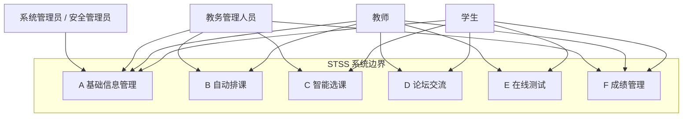
```mermaid
flowchart TB
    subgraph STSS["STSS 系统边界"]
        direction LR
        A["A 基础信息管理"]
        B["B 自动排课"]
        C["C 智能选课"]
        D["D 论坛交流"]
        E["E 在线测试"]
        F["F 成绩管理"]
    end

    student["学生"] --> A
    student --> C
    student --> D
    student --> E
    student --> F

    teacher["教师"] --> A
    teacher --> B
    teacher --> D
    teacher --> E
    teacher --> F

    admin["教务管理人员"] --> A
    admin --> B
    admin --> C
    admin --> F

    sysadmin["系统管理员 / 安全管理员"] --> A
```

> 讲稿：从系统上下文看，学生、教师、教务管理人员和系统管理员分别访问不同子系统。A 模块承担统一身份和权限入口，其他模块围绕教学活动展开。内部模块之间的数据依赖会在下一页单独说明，避免把访问边界和数据流混在一起。

---

# 总体技术架构

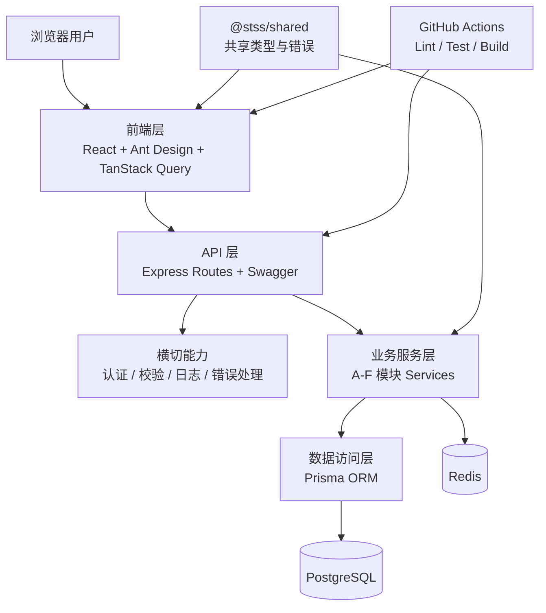
```mermaid
flowchart TB
    User["浏览器用户"] --> Front["前端层<br/>React + Ant Design + TanStack Query"]
    Front --> Api["API 层<br/>Express Routes + Swagger"]
    Api --> Cross["横切能力<br/>认证 / 校验 / 日志 / 错误处理"]
    Api --> Service["业务服务层<br/>A-F 模块 Services"]
    Service --> Prisma["数据访问层<br/>Prisma ORM"]
    Prisma --> DB[("PostgreSQL")]
    Service --> Redis[("Redis")]
    Shared["@stss/shared<br/>共享类型与错误"] --> Front
    Shared --> Service
    CI["GitHub Actions<br/>Lint / Test / Build"] --> Front
    CI --> Api
```

> 讲稿：总体架构按层次拆分：前端层负责交互和状态管理，API 层负责路由和接口文档，横切能力统一处理认证、校验、日志和错误，业务服务层承载 A-F 模块逻辑，数据访问层通过 Prisma 访问 PostgreSQL。共享包和 CI 保证前后端类型口径和质量门禁一致。

---

# 跨子系统数据主线

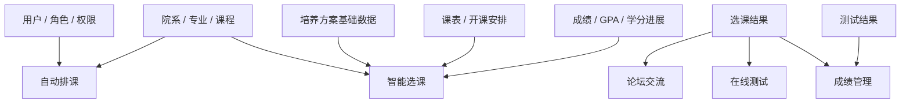
```mermaid
flowchart TB
    A1["用户 / 角色 / 权限"] --> B["自动排课"]
    A2["院系 / 专业 / 课程"] --> B
    A2 --> C["智能选课"]
    A3["培养方案基础数据"] --> C
    B1["课表 / 开课安排"] --> C
    C1["选课结果"] --> D["论坛交流"]
    C1 --> E["在线测试"]
    C1 --> F["成绩管理"]
    E1["测试结果"] --> F
    F1["成绩 / GPA / 学分进展"] --> C
```

- 用户、权限、课程和培养方案基础数据由 A 模块定义，其他模块复用
- 开课安排来自 B，选课结果来自 C，正式成绩归口 F
- E 的测试结果可以作为 F 成绩分析的辅助输入

> 讲稿：这页强调跨系统一致性。用户、角色、课程、专业和培养方案基础数据不能在每个子系统里各自定义，否则后续实现会出现口径冲突。我们的设计原则是：A 管主数据，B 产生课表，C 基于培养方案约束产生选课记录，E 产生测试结果，F 管正式成绩。

---

# 需求到设计的追踪关系

| 设计对象       | 依据                                      | 在系统设计中的作用                   |
| -------------- | ----------------------------------------- | ------------------------------------ |
| 需求边界       | 课程项目要求 + SRS                        | 明确每个子系统负责什么、不负责什么   |
| UML / 分析模型 | SRS 第 3-9 章                             | 描述数据流、状态变化和对象职责       |
| 数据设计       | `docs/database-design.md` + Prisma Schema | 固化核心实体、字段、关系和约束       |
| 接口设计       | `docs/apis/` + 代码路由                   | 定义前后端和跨模块交互方式           |
| 构件设计       | 当前前后端源码结构                        | 明确页面、路由、服务、数据访问层拆分 |
| 验证设计       | SRS Validation Criteria + 测试代码        | 将需求落实到可检查的验收标准         |

> 讲稿：需求如果只停留在文字层面，很难保证实现一致。因此我们把需求边界、分析模型、数据结构、接口和构件拆分放在同一条追踪链路中。后续实现时，可以从任意一个功能需求追踪到相关实体、接口、代码构件和验证标准。

---

# A 模块：基础信息管理（Information Management）

## 基础信息管理组的定位

- 为 STSS 提供统一账号、角色、权限和组织基础
- 为 B-F 提供用户、教师、学生、课程、培养方案基础数据等主数据
- 负责认证、密码安全、令牌刷新、系统日志与审计
- 当前代码实现集中在 A 模块，可作为后续模块的工程参考实现
- 因其直接支撑 B-F 的身份、权限和主数据访问，本报告对 A 模块展开更完整的设计说明

> 讲稿：A 模块是整个 STSS 的基础设施模块。其他模块要做排课、选课、论坛、测试和成绩，都需要先知道用户是谁、有什么角色、能访问哪些数据，以及课程和培养方案如何定义。因此 A 模块的设计质量直接影响后续所有模块，我们也会对它展开更完整的设计说明。

---

## A 模块需求边界与角色

| 角色         | 主要能力                                   | 权限边界                       |
| ------------ | ------------------------------------------ | ------------------------------ |
| 学生         | 登录、维护个人资料、修改密码               | 只能访问本人资料与本人相关业务 |
| 教师         | 登录、维护个人资料、作为课程负责人被引用   | 访问本人资料与所授课程相关业务 |
| 教务管理人员 | 用户管理、院系专业、课程与培养方案基础维护 | 按业务权限管理教学主数据       |
| 系统管理员   | 角色权限、账号状态、安全策略               | 具备最高管理权限               |
| 安全管理员   | 日志查询、安全审计                         | 关注系统安全与操作追踪         |

- 范围内：认证、用户、角色权限、院系专业、课程、培养方案、安全审计
- 范围外：各业务模块自己的排课、选课、发帖、测试、成绩规则

> 讲稿：A 模块的边界是主数据和安全能力，不直接实现排课算法或成绩统计。这样切分以后，其他组只需要依赖 A 模块提供的统一身份、权限和课程数据，不需要重复实现用户体系。

---

## A 模块核心流程：认证与访问控制

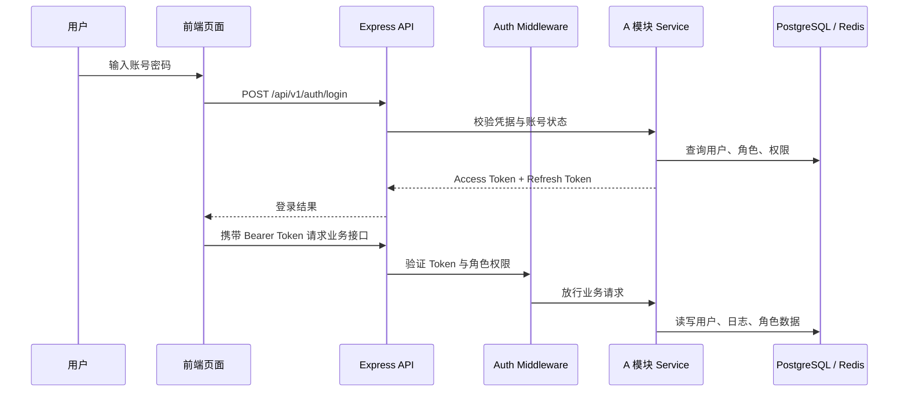
```mermaid
sequenceDiagram
    participant U as 用户
    participant FE as 前端页面
    participant API as Express API
    participant Auth as Auth Middleware
    participant Service as A 模块 Service
    participant DB as PostgreSQL / Redis

    U->>FE: 输入账号密码
    FE->>API: POST /api/v1/auth/login
    API->>Service: 校验凭据与账号状态
    Service->>DB: 查询用户、角色、权限
    Service-->>API: Access Token + Refresh Token
    API-->>FE: 登录结果
    FE->>API: 携带 Bearer Token 请求业务接口
    API->>Auth: 验证 Token 与角色权限
    Auth->>Service: 放行业务请求
    Service->>DB: 读写用户、日志、角色数据
```

> 讲稿：认证链路体现了 A 模块的核心设计。登录时后端不仅验证密码，还会返回用户角色和权限。后续请求都通过 Bearer Token 进入认证中间件，再按角色或本人权限控制访问。这样可以避免只依赖前端隐藏按钮带来的越权风险。

---

## A 模块数据流图

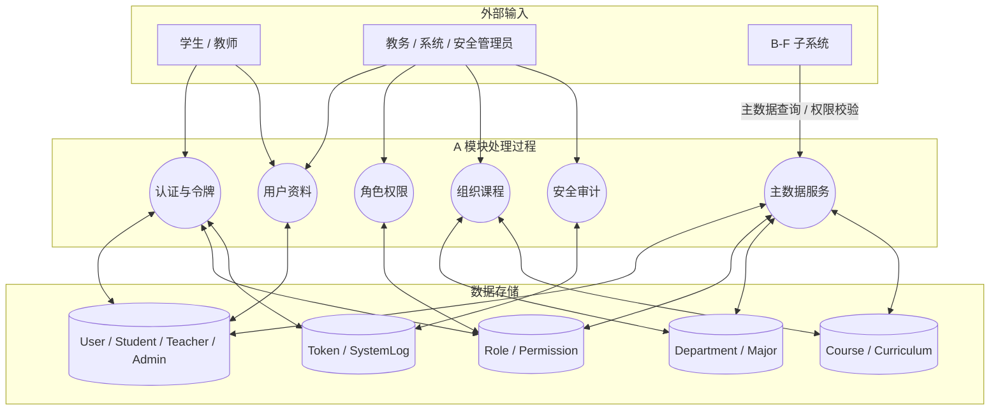
```mermaid
flowchart TB
    subgraph Input["外部输入"]
        User["学生 / 教师"]
        Admin["教务 / 系统 / 安全管理员"]
        Modules["B-F 子系统"]
    end

    subgraph Process["A 模块处理过程"]
        P1(("认证与令牌"))
        P2(("用户资料"))
        P3(("角色权限"))
        P4(("组织课程"))
        P5(("安全审计"))
        P6(("主数据服务"))
    end

    subgraph Store["数据存储"]
        D1[("User / Student / Teacher / Admin")]
        D2[("Role / Permission")]
        D3[("Department / Major")]
        D4[("Course / Curriculum")]
        D5[("Token / SystemLog")]
    end

    User --> P1
    User --> P2
    Admin --> P2
    Admin --> P3
    Admin --> P4
    Admin --> P5
    Modules -- "主数据查询 / 权限校验" --> P6
    P1 <--> D1
    P1 <--> D2
    P1 <--> D5
    P2 <--> D1
    P3 <--> D2
    P4 <--> D3
    P4 <--> D4
    P5 <--> D5
    P6 <--> D1
    P6 <--> D2
    P6 <--> D3
    P6 <--> D4
```

> 讲稿：这张 DFD 展示 A 模块内部的数据处理。用户和管理员通过不同处理过程读写数据；B-F 子系统不直接访问 A 的数据存储，而是通过主数据服务和权限校验接口获取需要的数据。所有关键操作都会进入 Token 和 SystemLog 相关存储，支撑后续审计。

---

## A 模块领域模型

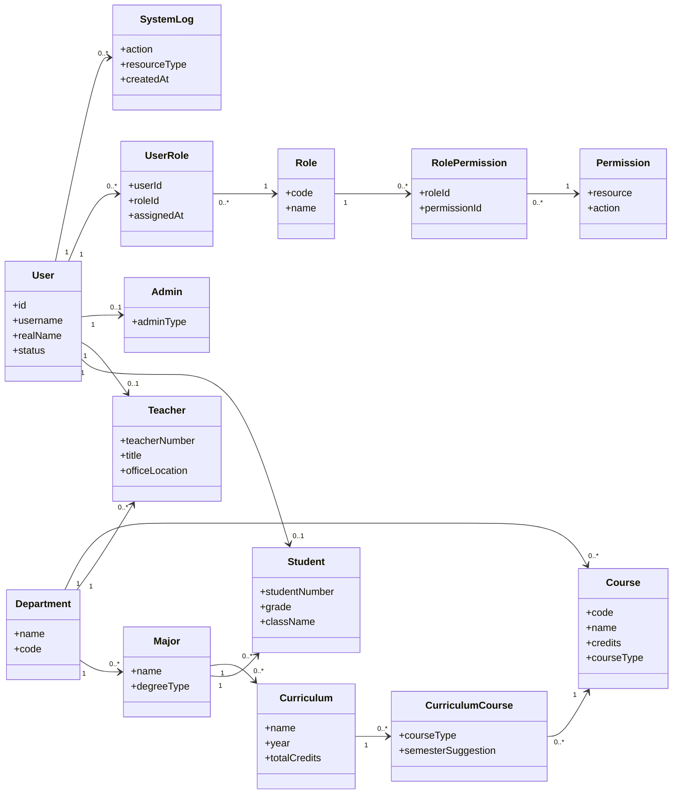
```mermaid
classDiagram
    direction LR

    class User {
      +id
      +username
      +realName
      +status
    }
    class Student {
      +studentNumber
      +grade
      +className
    }
    class Teacher {
      +teacherNumber
      +title
      +officeLocation
    }
    class Admin {
      +adminType
    }

    class UserRole {
      +userId
      +roleId
      +assignedAt
    }
    class Role {
      +code
      +name
    }
    class RolePermission {
      +roleId
      +permissionId
    }
    class Permission {
      +resource
      +action
    }

    class Department {
      +name
      +code
    }
    class Major {
      +name
      +degreeType
    }
    class Course {
      +code
      +name
      +credits
      +courseType
    }
    class Curriculum {
      +name
      +year
      +totalCredits
    }
    class CurriculumCourse {
      +courseType
      +semesterSuggestion
    }
    class SystemLog {
      +action
      +resourceType
      +createdAt
    }

    User "1" --> "0..1" Student
    User "1" --> "0..1" Teacher
    User "1" --> "0..1" Admin
    User "1" --> "0..*" UserRole
    User "1" --> "0..*" SystemLog

    UserRole "0..*" --> "1" Role
    Role "1" --> "0..*" RolePermission
    RolePermission "0..*" --> "1" Permission

    Department "1" --> "0..*" Major
    Department "1" --> "0..*" Teacher
    Department "1" --> "0..*" Course

    Major "1" --> "0..*" Student
    Major "1" --> "0..*" Curriculum

    Curriculum "1" --> "0..*" CurriculumCourse
    CurriculumCourse "0..*" --> "1" Course
```

> 讲稿：领域模型分成三类：身份与权限、组织与课程、安全审计。User 是统一账号入口，Student、Teacher 和 Admin 是不同角色的扩展信息；UserRole 和 RolePermission 显式表达 RBAC 的多对多关系；CurriculumCourse 表达培养方案和课程之间的组成关系，避免把复杂关联简化成直接字段。

---

## A 模块接口设计

| 能力       | 已设计 / 已实现的接口方向                            | 权限控制                |
| ---------- | ---------------------------------------------------- | ----------------------- |
| 认证       | `POST /api/v1/auth/login`、`refresh`、`logout`、`me` | 登录用户                |
| 注册与激活 | `register`、`activate`                               | 公开入口 + Token 校验   |
| 密码管理   | `forgot`、`reset`、`change-password`                 | 本人或有效重置令牌      |
| 用户管理   | `GET/POST/PUT/DELETE /api/v1/users`                  | `admin` / `super_admin` |
| 批量操作   | `POST /users/batch`、`PATCH /users/batch/status`     | 管理员                  |
| 角色权限   | `/users/roles`、`/:id/roles`、`/:id/permissions`     | 管理员或本人            |
| 日志审计   | `GET /api/v1/users/logs`                             | `admin` / `super_admin` |
| 院系查询   | `GET /api/v1/departments`、`/:id`                    | 登录用户                |

> 讲稿：接口设计遵循 REST 风格，以 `/api/v1` 为统一前缀，并通过中间件实现认证、角色检查和请求校验。当前代码中 A 模块已经具备认证、用户管理、角色权限查询、日志查询和院系查询接口；院系专业的完整 CRUD、课程基础信息和培养方案管理属于后续扩展范围。

---

## A 模块构件设计

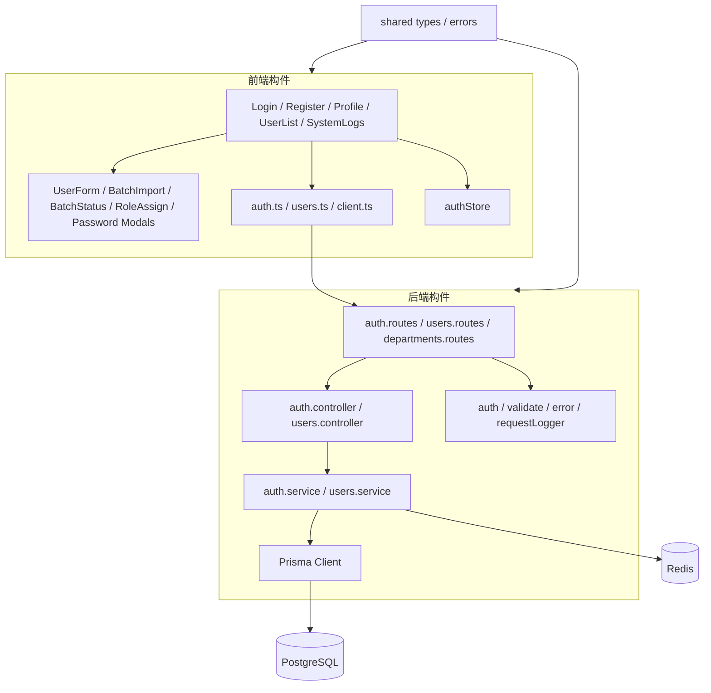
```mermaid
flowchart TB
    subgraph FE["前端构件"]
        Pages["Login / Register / Profile / UserList / SystemLogs"]
        Modals["UserForm / BatchImport / BatchStatus / RoleAssign / Password Modals"]
        ApiClient["auth.ts / users.ts / client.ts"]
        Store["authStore"]
    end

    subgraph BE["后端构件"]
        Routes["auth.routes / users.routes / departments.routes"]
        Controllers["auth.controller / users.controller"]
        Services["auth.service / users.service"]
        Middleware["auth / validate / error / requestLogger"]
        PrismaClient["Prisma Client"]
    end

    DB[("PostgreSQL")]
    Redis[("Redis")]
    Shared["shared types / errors"]

    Pages --> Modals
    Pages --> Store
    Pages --> ApiClient
    ApiClient --> Routes
    Routes --> Middleware
    Routes --> Controllers
    Controllers --> Services
    Services --> PrismaClient --> DB
    Services --> Redis
    Shared --> FE
    Shared --> BE
```

> 讲稿：A 模块的构件拆分已经比较清晰。前端以页面和弹窗组织用户操作，通过 API client 与后端交互；后端按 routes、controller、service、middleware 分层，Prisma 负责数据库访问，Redis 支撑登录安全和缓存类能力。这个结构也可以为 B-F 模块提供一致的工程实现参考。

---

## A 模块状态设计与安全策略

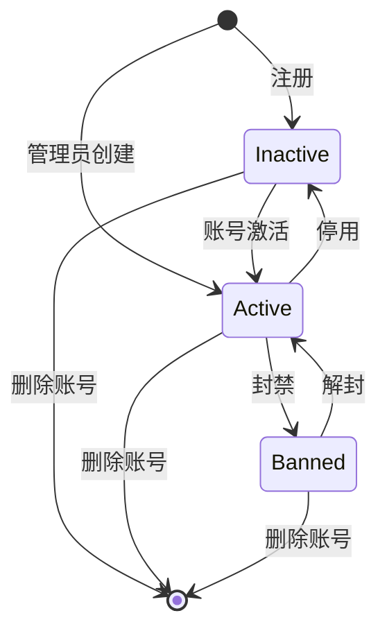
```mermaid
stateDiagram-v2
    [*] --> Inactive: 注册
    [*] --> Active: 管理员创建
    Inactive --> Active: 账号激活
    Active --> Banned: 封禁
    Active --> Inactive: 停用
    Banned --> Active: 解封
    Inactive --> [*]: 删除账号
    Active --> [*]: 删除账号
    Banned --> [*]: 删除账号
```

- 密码不明文存储，使用哈希校验
- Refresh Token 哈希存储并采用轮换机制
- 密码修改、重置、角色变更后应吊销相关会话
- 删除用户时先吊销 Refresh Token，再删除用户记录和关联角色
- 关键操作进入 SystemLog，避免日志记录明文密码或令牌

> 讲稿：账号状态图对应用户生命周期。Inactive 不能登录，Active 可以按权限访问，Banned 或停用状态不能继续认证。删除不是当前状态枚举的一部分，而是管理操作：先吊销该用户的刷新令牌，再删除用户记录和相关角色关联。安全策略上，重点是密码哈希、刷新令牌轮换、会话吊销和审计日志。

---

## A 模块设计模式与质量保证

| 设计点                  | 采用方式                              | 价值                         |
| ----------------------- | ------------------------------------- | ---------------------------- |
| 分层架构                | Route → Controller → Service → Prisma | 降低接口、业务、数据访问耦合 |
| RBAC                    | Role + Permission + middleware        | 统一处理多角色权限边界       |
| DTO / Schema Validation | Zod schema + validate middleware      | 请求进入业务前完成结构校验   |
| Token Rotation          | Access + Refresh 双 Token             | 降低长期令牌泄露风险         |
| Audit Logging           | SystemLog                             | 支持用户、权限、安全操作追踪 |
| 统一错误处理            | Shared errors + error middleware      | 保持 API 错误响应一致        |

> 讲稿：A 模块不是把逻辑全部写在路由里，而是用分层架构组织代码；权限通过 RBAC 和中间件统一处理；输入校验、令牌轮换、审计日志和统一错误处理共同保证系统可维护、可测试、可追踪。

---

## A 模块实现范围与演示素材

| 类别           | 当前实现与设计范围                                                                   |
| -------------- | ------------------------------------------------------------------------------------ |
| 后端已实现范围 | 认证、用户 CRUD、批量创建、状态更新、角色分配、权限查询、系统日志、院系查询          |
| 前端已实现范围 | 登录、注册、忘记密码、重置密码、个人资料、用户列表、系统日志、批量操作、角色分配弹窗 |
| 数据库         | Prisma Schema 已覆盖 A-F 核心实体；A 模块实体与令牌/日志模型完整                     |
| 测试           | 后端 A 模块包含 auth/users 的单元测试和集成测试；前端包含 authStore 测试             |
| 后续扩展范围   | 院系专业完整 CRUD、课程基础信息管理、培养方案管理、角色权限独立页面                  |

[图片占位：A 模块登录页截图]
[图片占位：A 模块用户列表与批量操作截图]
[图片占位：A 模块系统日志或 Swagger API 文档截图]

> 讲稿：A 模块当前实现范围集中在认证、用户管理、角色权限查询、日志审计和部分组织查询能力，前端也有对应页面和弹窗。课程基础信息、培养方案管理和完整角色权限页面会作为后续扩展方向继续推进。演示时可以展示登录页、用户列表、系统日志或 Swagger API 文档。

---

# B-F 子系统设计概览

| 模块       | 核心输入                             | 核心处理                        | 核心输出                |
| ---------- | ------------------------------------ | ------------------------------- | ----------------------- |
| B 自动排课 | 课程、教师、教室、时间约束           | 自动排课、冲突检测、手动调课    | 课表与教室安排          |
| C 智能选课 | 培养方案基础数据、开课安排、课程容量 | 课程检索、选课退选、AI 辅助建议 | 选课结果与学生课表      |
| D 论坛交流 | 课程开设、用户身份、选课范围         | 公告、帖子、评论、附件、检索    | 课程讨论内容与统计      |
| E 在线测试 | 课程、题库、试卷配置                 | 组卷、答题、自动评分、统计      | 测试结果与统计分析      |
| F 成绩管理 | 选课记录、测试结果、教师录入         | 成绩录入、修改控制、统计分析    | 正式成绩、GPA、学分进展 |

- B-F 模块共享 A 模块提供的用户、角色、权限和课程基础数据
- 各模块的输出继续作为后续模块的输入，形成教学业务闭环
- 每个模块都需要同时定义业务流程、核心对象、接口边界和验证方式

> 讲稿：B 到 F 是围绕教学过程逐步展开的业务模块。B 产生课表，C 基于课表和培养方案产生选课结果，D 和 E 围绕课程开展交流和测试，F 最后沉淀正式成绩和成绩分析。它们的共同基础是 A 模块提供的统一主数据。

---

# B 模块：自动排课（Automatic Course Arrangement）

## B 模块的整体定位

B 模块负责把课程开设、教师、教室、周次和节次整合成可执行课表。它承接 A 模块的用户、教师、课程和权限基础数据，并向 C 模块输出可选课程的时间地点安排。模块范围包括教室资源管理、自动排课任务、手动调课、冲突检测、课表查询与导出打印。

从前端功能看，B 模块可以归纳为三个核心页面：

| 页面     | 对应能力           | 说明                                                       |
| -------- | ------------------ | ---------------------------------------------------------- |
| 教室管理 | 教室资源维护       | 维护校区、教学楼、教室号、容量、教室类型、设备和状态       |
| 排课任务 | 自动排课与结果预览 | 生成排课草稿，展示可确认课程和失败原因，确认后写入正式课表 |
| 课表查看 | 课表查询与冲突提示 | 按教师、教室、学生或学期查看课表，并在手动调课时提示冲突   |

> 讲稿：B 模块可以从三个页面理解：第一是先维护教室资源，第二是基于课程、教师和教室生成排课任务，第三是查看课表并处理冲突。这样讲比单独讲算法更直观，因为老师能看到用户实际会怎么操作系统。

---

# B 模块页面一：教室资源管理

**配图：图 B-1「教室资源管理页面」**

教室资源管理页面用于维护自动排课所依赖的基础资源。页面中展示校区、教学楼、教室号、容量、教室类型、设备和状态等字段，并提供按校区、类型、状态和关键词筛选的入口。

| 页面元素               | 对应设计含义                                 |
| ---------------------- | -------------------------------------------- |
| 搜索框和筛选条件       | 支持教务人员快速定位可用教室资源             |
| 教室列表表格           | 对应数据库实体 `Classroom`                   |
| 容量字段               | 用于判断课程容量是否能被教室承载             |
| 教室类型与设备标签     | 用于判断实验课、机房课、多媒体课是否匹配教室 |
| 状态标签               | 维护中或不可用教室不能参与排课               |
| 新增 / 编辑 / 排课操作 | 支持教室资源维护和进入排课流程               |

> 讲稿：自动排课的第一步不是算法，而是保证教室资源数据准确。比如一个课程容量是 80 人，就不能排进 60 人教室；实验课需要实验室，机房课需要电脑设备；维护中的教室也不能被系统自动选中。因此教室管理页面直接对应 B 模块的资源约束基础。

---

# B 模块页面二：自动排课任务预览

**配图：图 B-2「自动排课任务预览页面」**

自动排课任务页面用于展示排课算法生成的临时结果。系统不会把自动排课结果直接写入正式课表，而是先生成预览草稿，由排课管理员查看课程、教师、时间、教室和失败原因，再确认是否写入 `Schedule`。

| 页面元素         | 对应设计含义                                     |
| ---------------- | ------------------------------------------------ |
| 任务状态与进度   | 表示自动排课任务采用异步执行，避免长请求阻塞     |
| 排课结果表格     | 展示课程、教师、上课时间、教室和处理状态         |
| 可确认状态       | 表示该排课结果已通过基本冲突检测，可进入确认流程 |
| 失败原因标签     | 说明未能自动排课的原因，如容量不足、教师冲突     |
| 处理记录         | 展示系统已完成的资源读取、冲突检测和待确认步骤   |
| 确认写入课表按钮 | 对应正式落库操作，写入前仍需服务端再次校验       |

自动排课流程可以概括为：

1. 排课管理员选择学期和待排课程，创建自动排课任务。
2. 系统读取课程开设、教师、教室、已有课表和约束条件。
3. 系统生成排课草稿，并标记可确认结果与失败原因。
4. 管理员根据预览结果处理异常课程或进行手动调整。
5. 管理员确认后，服务端再次校验冲突，通过后写入正式 `Schedule`。

> 讲稿：这张图重点说明自动排课不是黑盒。系统不仅给出排课结果，也要告诉管理员哪些课程没有排进去，以及失败原因是什么。这样教务人员可以有依据地进行人工调整。最终确认写入课表前，后端还要重新校验，避免预览生成后资源状态发生变化。

---

# B 模块页面三：课表查看与冲突提示

**配图：图 B-3「课表查看与冲突提示」**

课表查看页面展示排课的最终使用效果。用户可以按学期、教师、教室或学生维度查看课表，也可以导出课表用于打印或归档。右侧冲突提示区域用于说明手动调课时的检测结果。

| 页面元素           | 对应设计含义                                   |
| ------------------ | ---------------------------------------------- |
| 学期和查看维度筛选 | 支持教师课表、教室课表、学生课表和学期课表查询 |
| 周课表网格         | 将 `Schedule` 的星期、节次和教室信息可视化     |
| 课程块             | 展示课程名称、上课地点和教室类型               |
| 导出课表按钮       | 对应课表打印 / PDF / Excel 导出需求            |
| 冲突提示框         | 展示手动调课时发现的教室冲突或教师冲突         |
| 替代教室建议       | 辅助管理员选择可用教室或调整节次               |

冲突检测规则包括：

| 检测项       | 规则                                           | 处理方式                     |
| ------------ | ---------------------------------------------- | ---------------------------- |
| 教室时间冲突 | 同一教室、周次范围、节次范围不能重叠           | 返回 `classroom_conflict`    |
| 教师时间冲突 | 同一教师同一时间不能承担多门课程               | 返回 `teacher_conflict`      |
| 容量不足     | 教室容量不得小于课程容量或预计选课人数         | 返回 `capacity_not_met`      |
| 用途不匹配   | 实验课、机房课、多媒体课需要匹配教室类型或设备 | 返回 `room_type_not_matched` |
| 教室不可用   | 维护中或不可用教室不能被排课                   | 返回 `room_unavailable`      |

> 讲稿：课表查看页面体现的是 B 模块最终交付给用户的结果。排课不仅要能生成，还要能被教师、学生和教务人员查询、打印和调整。右侧的冲突提示说明手动调课不是随意覆盖原结果，而是在调整时继续执行同一套冲突检测规则。

---

# B 模块数据模型支撑

B 模块的前端页面对应后端三个核心实体：`Classroom`、`CourseOffering` 和 `Schedule`。

| 实体             | 含义                                                       | 支撑的页面                       |
| ---------------- | ---------------------------------------------------------- | -------------------------------- |
| `Classroom`      | 教室资源，包含教学楼、教室号、校区、容量、类型、设备和状态 | 教室管理、可用教室筛选、冲突检测 |
| `CourseOffering` | 某学期的课程开设，包含课程、学期、主讲教师、容量和开课状态 | 排课任务、课表查看、选课模块输入 |
| `Schedule`       | 课程时间安排，包含课程开设、教室、星期、周次和节次         | 课表网格、课表导出、手动调课     |

核心关系：

- 一个 `Classroom` 可以承载多条 `Schedule`
- 一个 `CourseOffering` 可以拥有多条 `Schedule`
- 一门课可以通过多条 `Schedule` 支持连堂课、实验课或分段上课
- `Schedule` 是 B 模块向 C 模块输出课程时间地点的关键结果

**可选配图：图 B-4「Classroom / Schedule / CourseOffering 领域模型」**

> 讲稿：虽然我们展示的是前端页面，但底层数据模型必须清楚。教室管理页面对应 Classroom，排课任务和课表查看最终都会落到 Schedule。CourseOffering 则把课程、教师和学期联系起来，是排课和选课之间的关键桥梁。

---

# B 模块接口与构件设计

B 模块接口统一挂载在：

```text
/api/v1/course-arrangement
```

| 能力         | 接口方向                                    | 对应页面            |
| ------------ | ------------------------------------------- | ------------------- |
| 教室列表     | `GET /classrooms`                           | 教室资源管理        |
| 新增教室     | `POST /classrooms`                          | 教室资源管理        |
| 更新教室     | `PATCH /classrooms/:id`                     | 教室资源管理        |
| 可用教室     | `GET /classrooms/available`                 | 排课任务 / 手动调课 |
| 排课预校验   | `POST /schedules/validate`                  | 排课任务 / 手动调课 |
| 新增排课     | `POST /schedules`                           | 排课任务            |
| 手动调课     | `PATCH /schedules/:id`                      | 课表查看与冲突提示  |
| 课表查询     | `GET /timetables`                           | 课表查看            |
| 课表导出     | `GET /timetables/export`                    | 课表查看            |
| 自动排课任务 | `POST /auto-schedule/tasks`                 | 排课任务            |
| 排课预览     | `GET /auto-schedule/tasks/:taskId/preview`  | 排课任务            |
| 确认落库     | `POST /auto-schedule/tasks/:taskId/confirm` | 排课任务            |

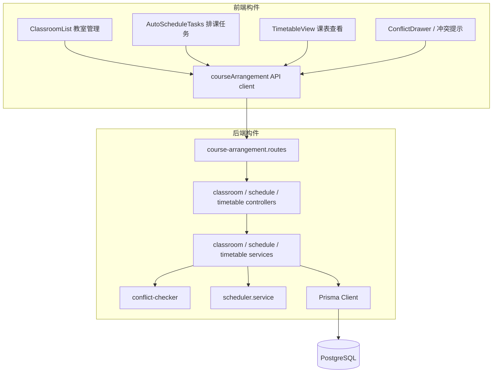
```mermaid
flowchart TB
    subgraph FE["前端构件"]
        ClassroomPage["ClassroomList 教室管理"]
        TaskPage["AutoScheduleTasks 排课任务"]
        TimetablePage["TimetableView 课表查看"]
        ConflictPanel["ConflictDrawer / 冲突提示"]
        ApiClient["courseArrangement API client"]
    end

    subgraph BE["后端构件"]
        Routes["course-arrangement.routes"]
        Controllers["classroom / schedule / timetable controllers"]
        Services["classroom / schedule / timetable services"]
        Checker["conflict-checker"]
        Scheduler["scheduler.service"]
        PrismaClient["Prisma Client"]
    end

    DB[("PostgreSQL")]

    ClassroomPage --> ApiClient
    TaskPage --> ApiClient
    TimetablePage --> ApiClient
    ConflictPanel --> ApiClient
    ApiClient --> Routes
    Routes --> Controllers
    Controllers --> Services
    Services --> Checker
    Services --> Scheduler
    Services --> PrismaClient --> DB
```

> 讲稿：B 模块的构件拆分和页面是一一对应的。教室管理页面对应 classroom service，排课任务页面对应 scheduler service，课表页面对应 timetable service，而冲突检测作为独立构件被自动排课、新增排课和手动调课共同复用。

---

# B 模块设计模式与质量保证

| 设计点                  | 采用方式                                       | 价值                           |
| ----------------------- | ---------------------------------------------- | ------------------------------ |
| 分层架构                | Route → Controller → Service → Prisma          | 降低接口、业务、数据访问耦合   |
| 策略模式                | 将排课约束拆为容量、时间、用途、教师偏好等策略 | 方便后续扩展不同排课规则       |
| 任务模式                | 自动排课以异步任务执行，支持状态轮询和预览确认 | 避免长请求阻塞，便于人工复核   |
| 统一冲突检测            | 自动排课、新增排课、手动调课复用同一校验服务   | 保证不同入口规则一致           |
| DTO / Schema Validation | Zod schema + validate middleware               | 请求进入业务前完成结构校验     |
| 审计日志                | SystemLog                                      | 关键调课、确认、导出操作可追踪 |

质量保证重点：

- 教室管理：覆盖新增、查询、更新状态、容量边界、枚举非法值
- 冲突检测：覆盖教室冲突、教师冲突、容量不足、教室维护、周次节次边界
- 自动排课：验证任务创建、状态轮询、预览草稿、确认落库和失败报告
- 课表查询：验证教师课表、学生课表、教室课表和学期课表的可见范围
- 导出打印：验证 PDF / Excel 文件流、文件名和权限边界

> 讲稿：B 模块的质量保证围绕三个页面展开：教室管理要保证资源数据准确，排课任务要保证自动生成结果可解释，课表查看和手动调课要保证冲突检测可靠。这样测试设计可以直接对应用户操作路径，而不是只停留在抽象规则上。

---

# B 模块当前状态与后续计划

| 类别         | 当前状态                                                                                                      |
| ------------ | ------------------------------------------------------------------------------------------------------------- |
| 数据库       | Prisma Schema 已包含 `Classroom` 和 `Schedule`；`Schedule` 与 `CourseOffering`、`Classroom` 建立外键关系      |
| 接口文档     | 已补充教室管理、排课管理、课表查询、自动排课任务、导出打印接口                                                |
| 前端展示     | 已在真实 React + Ant Design 前端中接入 B 模块 mock 页面，用于展示界面和流程                                   |
| 后端建议实现 | `course-arrangement.routes`、`classroom.service`、`schedule.service`、`conflict-checker`、`scheduler.service` |
| 测试重点     | 教室 CRUD、排课冲突、教师冲突、容量不足、自动排课任务状态、手动调课重新校验                                   |
| 后续扩展     | 教师偏好、排课方案版本、方案比选、教室利用率统计、课表热力图                                                  |

> 讲稿：当前 B 模块的展示页面使用前端 mock 数据，目的是让评审能看到页面形态和业务流程。后续实现时，建议先完成教室资源和手动排课，再实现可复用的冲突检测，最后接入自动排课任务和正式导出能力。

---

# C 模块：智能选课（Smart Course Selection）

## 智能选课组的定位

- C 模块负责把培养方案、开课安排、课程容量和学生选课行为连接成统一的选课服务
- 学生端覆盖培养方案查看、课程搜索、可选课程、选课退选、结果课表和 AI 辅助建议
- 教师端覆盖本人课程学生名单查询与导出，教务端覆盖选课阶段管理与特殊加课入口
- 当前 C 组已围绕 `FR-C-01` 至 `FR-C-43` 完成 SRS、API 契约、模块设计、前后端目录和路由页面框架的对齐
- 设计重点是后端硬性规则裁决：前端只做展示和预提示，最终选课结果必须经过服务端权限、阶段、容量、冲突和事务一致性校验

> 讲稿：C 模块是教学业务链路中“学生真正形成课程参与关系”的关键环节。它不是单纯的课程列表页面，而是要把 A 模块的学生、课程和培养方案数据，B 模块的排课结果，以及后续 D、E、F 模块需要使用的选课结果连接起来。我们在设计上已经先固定了需求编号、API 口径、前后端构件和关键约束，保证后续实现可以沿着同一套契约推进。

---

## C 模块需求边界与角色

| 角色         | 主要能力                                                                               | 权限边界                                                                |
| ------------ | -------------------------------------------------------------------------------------- | ----------------------------------------------------------------------- |
| 学生         | 查看本人培养方案、搜索课程、查看可选课程、选课、退选、查看结果和课表、请求 AI 辅助建议 | 只能读取和操作当前登录学生本人的选课数据，不信任前端传入的 `student_id` |
| 教师         | 查看本人任课课程学生名单、导出名单                                                     | 只能访问本人作为任课教师的 `CourseOffering` 名单，管理员例外需明确授权  |
| 教务管理人员 | 管理初选、补退选、调整阶段，执行特殊手动加课                                           | 限定在教务管理角色范围内，手动加课必须提供原因并保留审计入口            |
| 系统管理员   | 参与系统级准入控制、异常处理和审计支撑                                                 | 不替代教务业务判断，不绕过选课硬性规则                                  |
| AI 辅助能力  | 推荐课程、解释冲突、说明学分影响                                                       | 只推荐和解释，不直接创建、修改或删除 `Enrollment`                       |

- 范围内：培养方案查看、课程搜索与详情、可选课程列表、选课退选、结果课表、教师名单、阶段管理、手动加课、并发准入预留、AI 推荐解释
- 范围外：账号权限主数据、课程和培养方案主数据维护、自动排课、论坛内容、在线测试、正式成绩录入和 GPA 计算
- 数据边界：只使用现有 `Student`、`Teacher`、`Course`、`CourseOffering`、`Schedule`、`Curriculum`、`CurriculumCourse`、`CoursePrerequisite`、`Enrollment`、`SelectionPeriod`、`Semester` 等对象，不新增 C 组业务表

> 讲稿：C 模块的边界非常清楚。A 模块负责身份、课程和培养方案主数据，B 模块负责形成课表，C 模块基于这些数据形成选课结果。学生不能通过请求参数伪造身份，教师不能通过猜测课程开设 ID 获取他人课程名单，AI 也不能跳过系统规则直接写入选课记录。这些边界已经写入 C 组 SRS、API 文档和前后端框架说明。

---

## C 模块需求分析与移交性

C 组需求分析以课程项目要求为源头，进一步拆分为 `FR-C-01` 至 `FR-C-43` 的功能需求、`NFR-C-01` 至 `NFR-C-14` 的非功能需求，以及 `VC-C-01` 至 `VC-C-17` 的验证标准。需求内容覆盖学生、教师、教务管理人员和 AI 辅助能力四类参与者，既说明“要做什么”，也说明“哪些规则不能绕过”，例如学生身份必须来自登录态、教师名单必须校验任课关系、AI 不得直接写入 `Enrollment`。

从可移交角度看，C 组已经把需求边界、数据库依赖、接口路径、字段命名、权限边界、前后端构件和 C1-C6 子模块责任写入 SRS、API 文档、模块设计和任务拆分文档。另一小组即使不参与前期讨论，也可以根据这些文档理解 C 模块的业务边界和实现顺序，并继续按既定接口和 TODO 推进。

---

## C 模块核心流程：约束选课与 AI 辅助

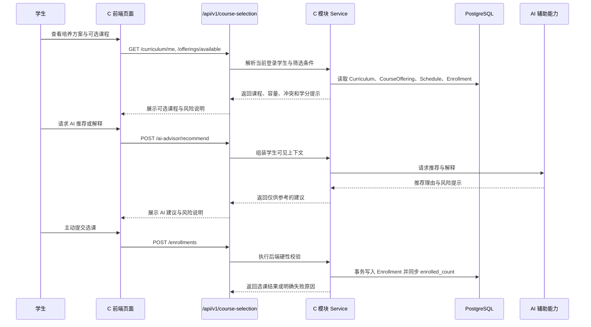
```mermaid
sequenceDiagram
    participant S as 学生
    participant FE as C 前端页面
    participant API as /api/v1/course-selection
    participant Service as C 模块 Service
    participant DB as PostgreSQL
    participant AI as AI 辅助能力

    S->>FE: 查看培养方案与可选课程
    FE->>API: GET /curriculum/me, /offerings/available
    API->>Service: 解析当前登录学生与筛选条件
    Service->>DB: 读取 Curriculum、CourseOffering、Schedule、Enrollment
    Service-->>API: 返回课程、容量、冲突和学分提示
    API-->>FE: 展示可选课程与风险说明
    S->>FE: 请求 AI 推荐或解释
    FE->>API: POST /ai-advisor/recommend
    API->>Service: 组装学生可见上下文
    Service->>AI: 请求推荐与解释
    AI-->>Service: 推荐理由与风险提示
    Service-->>API: 返回仅供参考的建议
    API-->>FE: 展示 AI 建议与风险说明
    S->>FE: 主动提交选课
    FE->>API: POST /enrollments
    API->>Service: 执行后端硬性校验
    Service->>DB: 事务写入 Enrollment 并同步 enrolled_count
    Service-->>API: 返回选课结果或明确失败原因
```

> 讲稿：这条流程体现了 C 模块的核心设计原则：AI 和前端都可以帮助学生理解课程，但最后选课一定走后端事务。后端会统一校验选课阶段、课程状态、容量、重复选课、时间冲突、最大学分、培养方案和先修课，成功后才写入 Enrollment，并保持 CourseOffering 的已选人数一致。

---

## C 模块数据流图

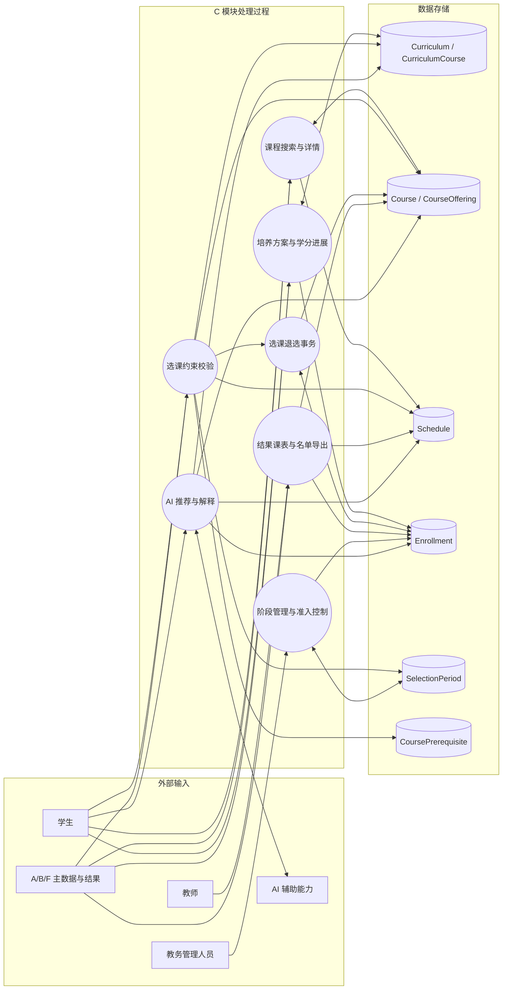
```mermaid
flowchart LR
    subgraph Input["外部输入"]
        Student["学生"]
        Teacher["教师"]
        Admin["教务管理人员"]
        Upstream["A/B/F 主数据与结果"]
        AiProvider["AI 辅助能力"]
    end

    subgraph Process["C 模块处理过程"]
        P1(("培养方案与学分进展"))
        P2(("课程搜索与详情"))
        P3(("选课约束校验"))
        P4(("选课退选事务"))
        P5(("结果课表与名单导出"))
        P6(("阶段管理与准入控制"))
        P7(("AI 推荐与解释"))
    end

    subgraph Store["数据存储"]
        D1[("Curriculum / CurriculumCourse")]
        D2[("Course / CourseOffering")]
        D3[("Schedule")]
        D4[("Enrollment")]
        D5[("SelectionPeriod")]
        D6[("CoursePrerequisite")]
    end

    Student --> P1
    Student --> P2
    Student --> P3
    Student --> P7
    Teacher --> P5
    Admin --> P6
    Upstream --> P1
    Upstream --> P2
    Upstream --> P3
    Upstream --> P5

    P1 <--> D1
    P1 --> D4
    P2 <--> D2
    P2 --> D3
    P3 --> D1
    P3 --> D2
    P3 --> D3
    P3 --> D5
    P3 --> D6
    P3 --> P4
    P4 <--> D4
    P4 --> D2
    P5 --> D2
    P5 --> D3
    P5 --> D4
    P6 <--> D5
    P6 --> D4
    P7 --> D1
    P7 --> D2
    P7 --> D3
    P7 --> D4
    P7 <--> AiProvider
```

- 培养方案和课程主数据来自 A 模块，排课时间来自 B 模块，先修课通过情况可与 F 模块联动
- C 模块写入的核心业务结果是 `Enrollment`，后续 D、E、F 模块据此判断课程参与范围
- 选课阶段、手动加课和异常强退等关键操作需要保留可追踪记录入口

> 讲稿：C 模块的数据流分为七类处理过程。左侧是学生、教师、教务和外部模块输入，中间是 C 模块处理过程，右侧是数据库对象。这里最重要的是 Enrollment，它是学生和课程开设之间的正式参与关系，也是后续论坛、测试和成绩模块判断参与范围的基础。

---

## C 模块领域模型

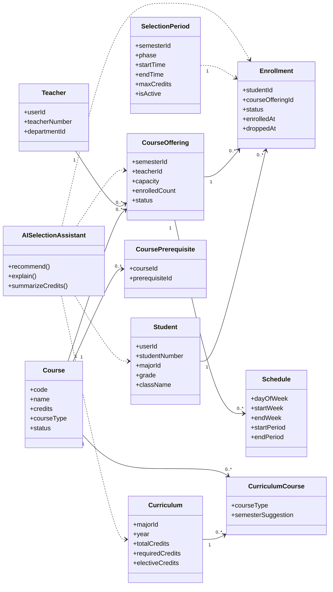
```mermaid
classDiagram
    direction LR
    class Student {
      +userId
      +studentNumber
      +majorId
      +grade
      +className
    }
    class Teacher {
      +userId
      +teacherNumber
      +departmentId
    }
    class Course {
      +code
      +name
      +credits
      +courseType
      +status
    }
    class CourseOffering {
      +semesterId
      +teacherId
      +capacity
      +enrolledCount
      +status
    }
    class Schedule {
      +dayOfWeek
      +startWeek
      +endWeek
      +startPeriod
      +endPeriod
    }
    class Curriculum {
      +majorId
      +year
      +totalCredits
      +requiredCredits
      +electiveCredits
    }
    class CurriculumCourse {
      +courseType
      +semesterSuggestion
    }
    class CoursePrerequisite {
      +courseId
      +prerequisiteId
    }
    class Enrollment {
      +studentId
      +courseOfferingId
      +status
      +enrolledAt
      +droppedAt
    }
    class SelectionPeriod {
      +semesterId
      +phase
      +startTime
      +endTime
      +maxCredits
      +isActive
    }
    class AISelectionAssistant {
      +recommend()
      +explain()
      +summarizeCredits()
    }

    Student "1" --> "0..*" Enrollment
    CourseOffering "1" --> "0..*" Enrollment
    Course "1" --> "0..*" CourseOffering
    Teacher "1" --> "0..*" CourseOffering
    CourseOffering "1" --> "0..*" Schedule
    Curriculum "1" --> "0..*" CurriculumCourse
    Course "1" --> "0..*" CurriculumCourse
    Course "1" --> "0..*" CoursePrerequisite
    SelectionPeriod "1" ..> Enrollment
    AISelectionAssistant ..> Student
    AISelectionAssistant ..> Curriculum
    AISelectionAssistant ..> CourseOffering
    AISelectionAssistant ..> Enrollment
```

> 讲稿：领域模型中，CourseOffering 是某学期某门课程的具体开课实例，Enrollment 是学生选课结果，SelectionPeriod 控制选课阶段，Schedule 支撑课表和冲突判断。AISelectionAssistant 只是分析层能力，不是数据库表，也不拥有写入选课记录的权限。

---

## C 模块接口设计

| 能力           | 接口方向                                                                  | 权限控制                                               |
| -------------- | ------------------------------------------------------------------------- | ------------------------------------------------------ |
| 培养方案与进度 | `GET /api/v1/course-selection/curriculum/me`、`/curriculum/me/progress`   | `student`，只读取当前登录学生                          |
| 课程搜索与详情 | `GET /courses`、`/offerings`、`/offerings/available`、`/offerings/:id`    | 登录用户按角色只读访问，学生个性化可选性只从登录态计算 |
| 选课与退选     | `GET /enrollments/me`、`POST /enrollments`、`PATCH /enrollments/:id/drop` | `student`，后端执行完整约束与事务                      |
| 课表结果       | `GET /timetable/me`                                                       | `student`，只返回本人有效选课相关课表                  |
| 教师名单       | `GET /teacher/offerings/:id/roster`、`/roster/export`                     | `teacher`、`admin`、`super_admin`，教师需校验任课关系  |
| 选课管理       | `GET/POST/PATCH /admin/periods`、`POST /admin/enrollments`                | `admin`、`super_admin`，手动加课要求 `reason`          |
| AI 辅助        | `POST /ai-advisor/recommend`、`/ai-advisor/explain`                       | `student`，只返回建议和解释                            |

- C 组 Base URL 统一为 `/api/v1/course-selection`
- 请求与响应字段统一使用 `snake_case`，服务层内部可以使用 camelCase
- API 文档已经固化分页、错误响应、角色边界、枚举值和跨接口事务规则
- 路由框架已挂载到后端应用，前端 API client 已按 `curriculum`、`courses`、`enrollments`、`periods`、`roster`、`ai-advisor` 拆分

> 讲稿：接口设计是 C 组目前最重要的协作契约。学生端接口不允许传 student_id 来决定身份，教师名单必须校验任课教师，教务手动加课虽然可以传 student_id，但必须在 admin 路径下并提供 reason。通过这些规则，前后端和组员之间可以并行开发，而不会出现每个分支各自发明接口的问题。

---

## C 模块构件设计

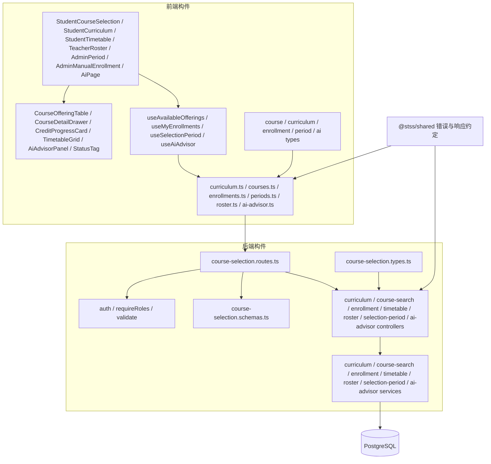
```mermaid
flowchart TB
    subgraph FE["前端构件"]
        Pages["StudentCourseSelection / StudentCurriculum / StudentTimetable / TeacherRoster / AdminPeriod / AdminManualEnrollment / AiPage"]
        Components["CourseOfferingTable / CourseDetailDrawer / CreditProgressCard / TimetableGrid / AiAdvisorPanel / StatusTag"]
        Hooks["useAvailableOfferings / useMyEnrollments / useSelectionPeriod / useAiAdvisor"]
        ApiClient["curriculum.ts / courses.ts / enrollments.ts / periods.ts / roster.ts / ai-advisor.ts"]
        Types["course / curriculum / enrollment / period / ai types"]
    end

    subgraph BE["后端构件"]
        Routes["course-selection.routes.ts"]
        Schemas["course-selection.schemas.ts"]
        TypesBE["course-selection.types.ts"]
        Controllers["curriculum / course-search / enrollment / timetable / roster / selection-period / ai-advisor controllers"]
        Services["curriculum / course-search / enrollment / timetable / roster / selection-period / ai-advisor services"]
        Middleware["auth / requireRoles / validate"]
    end

    DB[("PostgreSQL")]
    Shared["@stss/shared 错误与响应约定"]

    Pages --> Components
    Pages --> Hooks
    Hooks --> ApiClient
    ApiClient --> Routes
    Routes --> Middleware
    Routes --> Schemas
    Routes --> Controllers
    Controllers --> Services
    Services --> DB
    Types --> ApiClient
    TypesBE --> Controllers
    Shared --> ApiClient
    Shared --> Controllers
```

> 讲稿：C 组已经按照项目既有工程风格完成前后端构件拆分。后端有统一 routes、schemas、types、controller 和 service 入口；前端有 API client、hooks、types、页面和组件。这样的结构使 C1 到 C6 可以分别在培养方案、课程搜索、选课事务、结果名单、阶段管理和 AI 辅助上并行推进，同时保持统一入口和权限控制。

---

## C 模块状态设计与约束策略

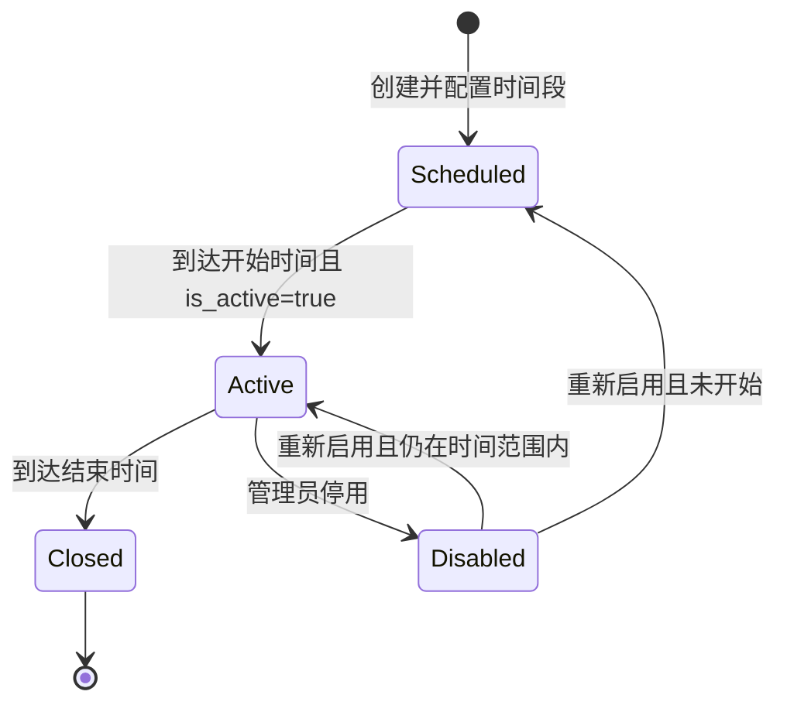
```mermaid
stateDiagram-v2
    [*] --> Scheduled: 创建并配置时间段
    Scheduled --> Active: 到达开始时间且 is_active=true
    Active --> Closed: 到达结束时间
    Active --> Disabled: 管理员停用
    Disabled --> Scheduled: 重新启用且未开始
    Disabled --> Active: 重新启用且仍在时间范围内
    Closed --> [*]
```

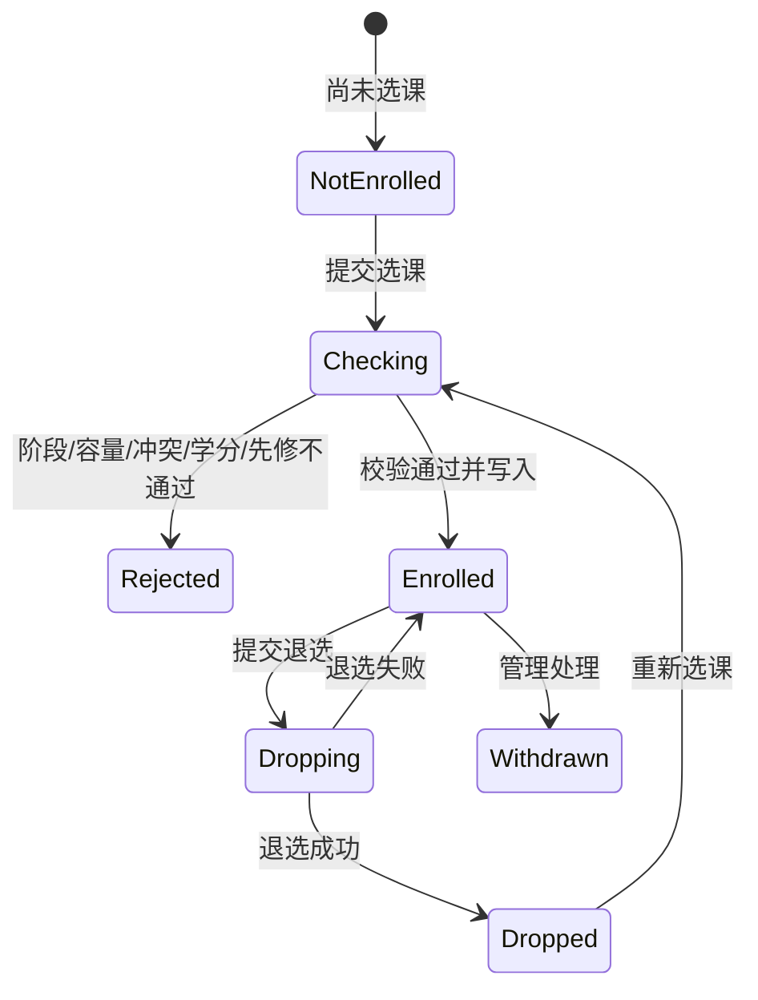
```mermaid
stateDiagram-v2
    [*] --> NotEnrolled: 尚未选课
    NotEnrolled --> Checking: 提交选课
    Checking --> Rejected: 阶段/容量/冲突/学分/先修不通过
    Checking --> Enrolled: 校验通过并写入
    Enrolled --> Dropping: 提交退选
    Dropping --> Dropped: 退选成功
    Dropping --> Enrolled: 退选失败
    Enrolled --> Withdrawn: 管理处理
    Dropped --> Checking: 重新选课
```

| 约束类别   | C 模块策略                                                               |
| ---------- | ------------------------------------------------------------------------ |
| 身份权限   | 学生从 JWT 登录态解析，教师校验任课关系，教务接口限制管理角色            |
| 时间阶段   | 以服务端时间判断 `SelectionPeriod.start_time`、`end_time` 和 `is_active` |
| 容量一致性 | `Enrollment` 写入和 `CourseOffering.enrolled_count` 更新必须同事务完成   |
| 课表冲突   | 基于 `Schedule` 的周次、星期和节次判断课程重叠                           |
| 学分限制   | 使用当前阶段 `max_credits` 控制本阶段可选学分                            |
| 历史保留   | 退选更新为 `dropped` 并记录时间，不直接删除历史记录                      |
| AI 安全    | AI 输出仅作建议，最终选课仍走常规接口和硬性校验                          |

> 讲稿：C 模块的两个关键状态分别是选课时间段和选课记录。时间段决定学生是否能操作，选课记录决定学生与课程开设之间的有效关系。我们把这些状态和约束写入 API 文档、schema 和 service TODO 中，确保后续实现不会只依赖前端判断，也不会在并发场景中破坏容量一致性。

---

## C 模块设计模式与质量保证

| 设计点                  | 采用方式                                                                 | 价值                                       |
| ----------------------- | ------------------------------------------------------------------------ | ------------------------------------------ |
| 分层架构                | Route → Schema → Controller → Service → Prisma                           | 保持接口、校验、业务规则和数据访问边界清晰 |
| 角色隔离                | `authMiddleware` + `requireRoles` + 资源归属校验                         | 防止学生越权、教师越权和教务接口误用       |
| DTO / Schema Validation | Zod schema 统一接收 query、params、body                                  | 固定 `snake_case` API 口径和分页筛选参数   |
| 事务设计                | 选课、退选、手动加课集中在服务层事务中处理                               | 保证 `Enrollment` 与容量计数一致           |
| 错误可解释              | 错误码覆盖阶段关闭、容量满、重复、冲突、最大学分、先修不满足和 AI 不可用 | 前端可以给出明确失败原因                   |
| AI 降级                 | AI 推荐与普通选课流程解耦                                                | AI 异常不影响课程搜索、选课和课表基础能力  |
| 需求追踪                | `FR-C`、`NFR-C`、`VC-C` 贯穿 SRS、API、TODO 和构件                       | 支撑负责人 review、组员分工和验收检查      |

> 讲稿：C 模块的质量保证不是等功能写完才补测试，而是先把需求编号、API、状态、错误码和验证标准固定下来。C 组的验证标准覆盖培养方案、课程搜索、选课事务、并发容量、教师名单、手动加课、AI 安全和权限隔离。后续每个 PR 都可以按这些编号追踪到对应需求和验收标准。

---

## C 组任务分配与协作方式

C 组采用“负责人固定边界和契约，组员按 C1-C6 子模块推进”的分工方式。负责人负责 SRS、API 口径、权限边界、事务规则、PR review 和最终联调；成员 1 聚焦 C1/C2 后端，即培养方案、学分进展、课程搜索和详情；成员 2 聚焦 C3 选课/退选核心事务；成员 3 聚焦 C4/C5 后端，即结果课表、教师名单、阶段管理和手动加课；成员 4 聚焦学生端前端页面；成员 5 聚焦教师端、教务端前端和 AI 面板。

这样的分配与风险优先级匹配：C3 事务一致性和 C5 阶段管理由专门成员负责，避免容量、阶段和权限规则分散在多个分支中；学生端、教师端和教务端前端按角色拆分，便于并行开发和演示材料准备。每个子模块都有对应文件入口和 `FR-C`/`NFR-C` TODO，方便负责人检查是否越界或遗漏。

---

## C 模块实现范围与演示素材

| 类别           | 当前设计与框架范围                                                                                                       |
| -------------- | ------------------------------------------------------------------------------------------------------------------------ |
| 文档与契约     | C 组 SRS、API 文档、模块设计、分工计划和 agent 指南已形成统一口径                                                        |
| 后端框架       | `course-selection.routes.ts` 已统一挂载 `/api/v1/course-selection`；`schemas/types/controllers/services` 覆盖 C1-C6 入口 |
| 前端框架       | `api/pages/components/hooks/types` 已按学生端、教师端、教务端和 AI 页面完成模块化拆分                                    |
| 权限边界       | 路由层已区分 `student`、`teacher`、`admin`、`super_admin`，学生端不以请求参数决定身份                                    |
| 事务与安全口径 | 选课、退选、手动加课、AI 辅助和名单导出的硬性规则已写入 API 契约、README 和 TODO                                         |
| 验证口径       | SRS 中已定义 `VC-C-01` 至 `VC-C-17`，覆盖功能、权限、并发、AI 和数据一致性验证                                           |
| 协作基础       | C1-C6 子模块文件入口和 TODO 已清晰绑定需求编号，便于组员继续实现和负责人 review                                          |

| 图编号   | 页面内容                | 访问路径                                                  | 建议账号  | 图片占位                                                                                     |
| -------- | ----------------------- | --------------------------------------------------------- | --------- | -------------------------------------------------------------------------------------------- |
| C-IMG-01 | 学生选课                | `http://localhost:5173/selection/courses`                 | `student` | [图片占位：C 模块学生选课页面截图，展示课程筛选、课程列表、学分进展和选课说明]               |
| C-IMG-02 | AI 课程推荐             | `http://localhost:5173/selection/ai`                      | `student` | [图片占位：C 模块 AI 课程推荐页面截图，展示推荐参数、课程上下文和 AI 辅助建议面板]           |
| C-IMG-03 | 我的当前选课 / 我的课表 | `http://localhost:5173/selection/timetable`               | `student` | [图片占位：C 模块我的课表页面截图，展示学期筛选、课表结果和当前选课辅助信息]                 |
| C-IMG-04 | 选课阶段管理            | `http://localhost:5173/selection/admin/periods`           | `admin`   | [图片占位：C 模块选课阶段管理页面截图，展示阶段类型、起止时间、最大学分、启用状态和阶段列表] |
| C-IMG-05 | 教师课程名单            | `http://localhost:5173/selection/teacher/roster`          | `teacher` | [图片占位：C 模块教师课程名单页面截图，展示课程开设查询、状态筛选、名单表格和导出入口]       |
| C-IMG-06 | 手动加课                | `http://localhost:5173/selection/admin/manual-enrollment` | `admin`   | [图片占位：C 模块手动加课页面截图，展示学生 ID、课程开设 ID、加课原因和提交入口]             |
| C-IMG-07 | 培养方案                | `http://localhost:5173/selection/curriculum`              | `student` | [图片占位：C 模块培养方案页面截图，展示培养方案、课程分类、建议学期和学分进展]               |

这些演示材料覆盖学生、教师、教务管理人员和 AI 辅助四类视角，展示内容从培养方案、课程搜索、当前选课、课表结果，到阶段管理、教师名单和手动加课。展示效果上，页面不只呈现单个按钮或 ComingSoon 占位，而是能看到筛选条件、表格区域、表单字段、状态提示和规则说明，能够支撑中期汇报时说明 C1-C6 的主要页面入口和后续实现方向。

> 讲稿：C 组当前交付的重点是把智能选课模块的工程骨架和协作契约完整落地。后端已经具备统一路由、权限、schema、types、controller 和 service 入口；前端已经具备页面、组件、hooks、API client 和类型目录。这样 C1 到 C6 的实现可以继续在既定边界内推进，最终演示也能围绕学生选课、教师名单、教务管理和 AI 辅助四类角色场景展开。

---

## C 组会议记录

C 组保持项目会议和过程沟通记录，会议纪要、任务看板和分支/PR 进度可以作为过程管理材料补充展示。

---

## C 组后期安排

C 组后续按学生端 MVP、教师与教务功能、AI 与并发强化、最终联调验收的顺序推进，继续以 SRS 验证标准和 API 契约作为合并依据。

---

# D 模块：论坛交流（Discussion Forum）

## 论坛交流组的定位

- 以课程开设为单元建立课程内师生和生生之间的交流空间
- 覆盖公告发布、帖子讨论、评论回复、附件分享、全文检索与数据统计
- 与 A 模块共享用户身份与权限体系，消费 C 模块的选课结果确定课程参与范围
- 当前代码实现覆盖帖子/评论/公告/检索/统计/附件六大功能域，权限控制完备
- 帖子、评论均采用软删除，支持管理员隐藏恢复和审计日志追踪

> 讲稿：D 模块围绕课程实例提供交流功能。不同于通用论坛，D 模块的每个帖子都绑定到具体的课程开设，只有该课程的师生才有权限发帖和回帖。当前实现已经覆盖了公告、帖子、评论、附件、全文检索和数据统计，权限体系也分出了教师、学生、论坛管理员和教务管理员四个层次。

---

# D 模块需求边界与角色

| 角色                         | 主要能力                                             | 权限边界                         |
| ---------------------------- | ---------------------------------------------------- | -------------------------------- |
| 学生                         | 浏览课程帖子、发帖提问、回帖留言、上传附件、全文搜索 | 仅限于已选课程范围内的帖子       |
| 教师                         | 发布公告、发帖、回帖、置顶帖子、编辑/删除自己的帖子  | 所授课程范围内，可发布公告和置顶 |
| 论坛管理员（forum_admin）    | 管理所有帖子/评论、隐藏/恢复评论、删除帖子           | 跨课程管理，不受课程范围限制     |
| 教务管理员（academic_admin） | 查看统计数据、导出统计 CSV                           | 只读统计，不可操作帖子内容       |

- 范围内：帖子 CRUD（含置顶、隐藏、删除）、评论树形回复、公告管理、全文检索、附件上传删除、发文统计、热帖排行、课程活跃度统计、统计导出
- 范围外：私信系统、实时聊天、站外分享、第三方登录

> 讲稿：D 模块的边界是以课程为中心的异步交流，不包括即时通讯和站外社交。四个角色的权限层次分明：学生只能在本人的选课范围内操作，教师多出公告和置顶权限，forum_admin 跨课程管理，academic_admin 只看统计。这样切分以后每个角色能做的事和不能做的事都比较清晰。

---

# D 模块核心流程：发帖与评论

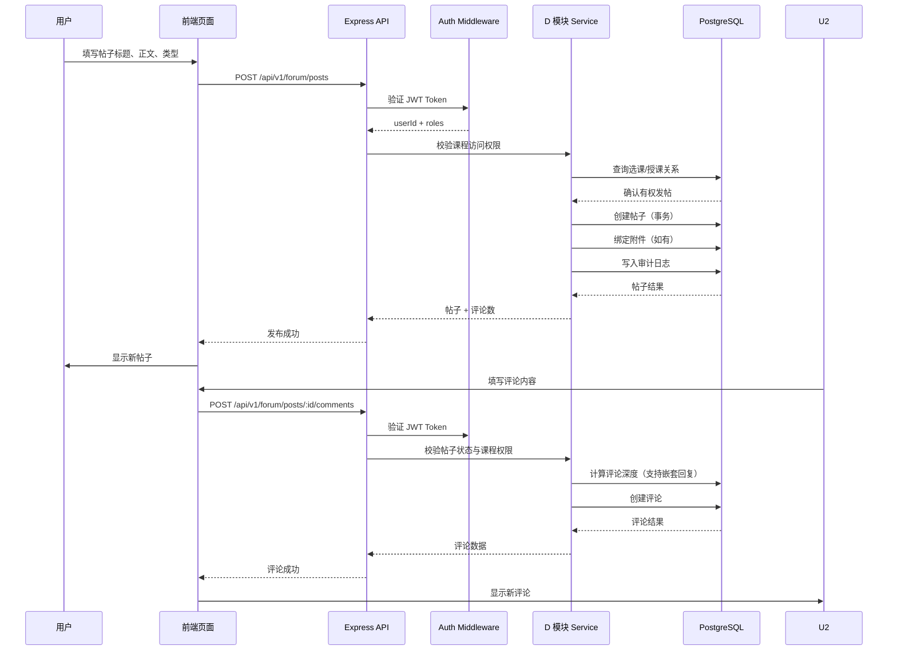
```mermaid
sequenceDiagram
    participant U as 用户
    participant FE as 前端页面
    participant API as Express API
    participant Auth as Auth Middleware
    participant Service as D 模块 Service
    participant DB as PostgreSQL

    U->>FE: 填写帖子标题、正文、类型
    FE->>API: POST /api/v1/forum/posts
    API->>Auth: 验证 JWT Token
    Auth-->>API: userId + roles
    API->>Service: 校验课程访问权限
    Service->>DB: 查询选课/授课关系
    DB-->>Service: 确认有权发帖
    Service->>DB: 创建帖子（事务）
    Service->>DB: 绑定附件（如有）
    Service->>DB: 写入审计日志
    DB-->>Service: 帖子结果
    Service-->>API: 帖子 + 评论数
    API-->>FE: 发布成功

    FE->>U: 显示新帖子

    U2->>FE: 填写评论内容
    FE->>API: POST /api/v1/forum/posts/:id/comments
    API->>Auth: 验证 JWT Token
    API->>Service: 校验帖子状态与课程权限
    Service->>DB: 计算评论深度（支持嵌套回复）
    Service->>DB: 创建评论
    DB-->>Service: 评论结果
    Service-->>API: 评论数据
    API-->>FE: 评论成功
    FE->>U2: 显示新评论
```

> 讲稿：发帖流程的核心是权限校验。用户提交帖子后，后端先验证 JWT，再确认该用户是否在目标课程的选课或授课范围内，然后才创建帖子。如果是公告，还会额外校验教师身份。评论流程类似，但多了一步嵌套深度计算：只支持一级回复（子评论），超过二级的回复会自动折叠到根评论下，避免无限嵌套。

---

# D 模块数据流图

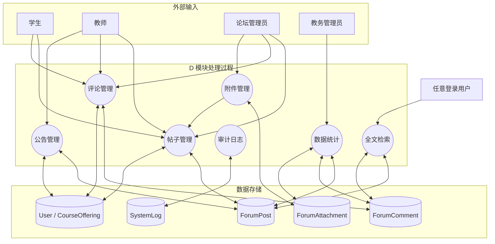
```mermaid
flowchart TB
    subgraph Input["外部输入"]
        Student["学生"]
        Teacher["教师"]
        Admin["论坛管理员"]
        Manager["教务管理员"]
    end

    subgraph Process["D 模块处理过程"]
        P1(("帖子管理"))
        P2(("评论管理"))
        P3(("公告管理"))
        P4(("附件管理"))
        P5(("全文检索"))
        P6(("数据统计"))
        P7(("审计日志"))
    end

    subgraph Store["数据存储"]
        D1[("ForumPost")]
        D2[("ForumComment")]
        D3[("ForumAttachment")]
        D4[("SystemLog")]
        D5[("User / CourseOffering")]
    end

    Student --> P1
    Student --> P2
    Teacher --> P1
    Teacher --> P2
    Teacher --> P3
    Admin --> P1
    Admin --> P2
    Admin --> P4
    Manager --> P6
    All["任意登录用户"] --> P5

    P1 <--> D1
    P2 <--> D2
    P3 <--> D1
    P4 <--> D3
    P4 --> P1
    P5 <--> D1
    P5 <--> D2
    P6 <--> D1
    P6 <--> D2
    P6 <--> D3
    P7 <--> D4
    P1 <--> D5
    P2 <--> D5
    P3 <--> D5
```

> 讲稿：这张 DFD 展示论坛模块内部的数据处理。帖子、评论、公告是核心数据流，附件与帖子关联存储，检索同时读取帖子和评论内容，统计聚合帖子、评论和附件数据，所有关键操作都写入审计日志。用户、课程等主数据来自 A 和 C 模块，D 模块按需读取。

---

# D 模块领域模型

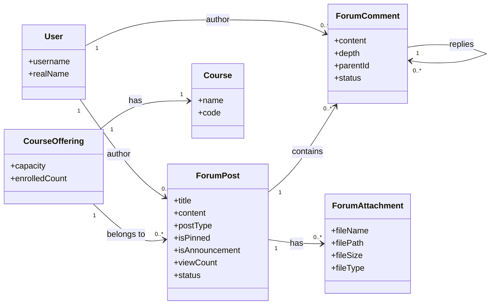
```mermaid
classDiagram
    direction LR
    class ForumPost {
      +title
      +content
      +postType
      +isPinned
      +isAnnouncement
      +viewCount
      +status
    }
    class ForumComment {
      +content
      +depth
      +parentId
      +status
    }
    class ForumAttachment {
      +fileName
      +filePath
      +fileSize
      +fileType
    }
    class User {
      +username
      +realName
    }
    class CourseOffering {
      +capacity
      +enrolledCount
    }
    class Course {
      +name
      +code
    }

    User "1" --> "0..*" ForumPost : author
    User "1" --> "0..*" ForumComment : author
    ForumPost "1" --> "0..*" ForumComment : contains
    ForumPost "1" --> "0..*" ForumAttachment : has
    ForumComment "1" --> "0..*" ForumComment : replies
    CourseOffering "1" --> "0..*" ForumPost : belongs to
    CourseOffering "1" --> "1" Course : has
```

> 讲稿：领域模型以 ForumPost 为核心，关联作者（User）、课程开设（CourseOffering）、评论（ForumComment）和附件（ForumAttachment）。ForumComment 通过自关联 parentId 实现回复嵌套，depth 字段显式记录层级深度以优化查询性能。这样设计避免了递归查询父评论的性能开销，同时将嵌套深度限制在三层以内。

---

# D 模块接口设计

| 能力          | 已设计 / 已实现的接口方向                        | 权限控制                                       |
| ------------- | ------------------------------------------------ | ---------------------------------------------- |
| 帖子列表      | `GET /api/v1/forum/posts`                        | 登录用户，自动按选课范围过滤                   |
| 帖子详情      | `GET /api/v1/forum/posts/:id`                    | 课程参与者                                     |
| 发布帖子      | `POST /api/v1/forum/posts`                       | 课程参与者，公告需教师                         |
| 编辑帖子      | `PATCH /api/v1/forum/posts/:id`                  | 作者或管理员                                   |
| 删除帖子      | `DELETE /api/v1/forum/posts/:id`                 | 作者或管理员（软删除）                         |
| 置顶/取消置顶 | `PATCH /api/v1/forum/posts/:id/pin`              | admin / teacher / forum_admin                  |
| 发表评论      | `POST /api/v1/forum/posts/:id/comments`          | 课程参与者                                     |
| 获取评论      | `GET /api/v1/forum/posts/:id/comments`           | 课程参与者（树形结构）                         |
| 删除评论      | `DELETE /api/v1/forum/comments/:id`              | 作者或管理员（软删除）                         |
| 隐藏/恢复评论 | `PATCH /api/v1/forum/comments/:id/hide\|restore` | admin / forum_admin                            |
| 隐藏评论列表  | `GET /api/v1/forum/comments/hidden`              | admin / forum_admin / teacher                  |
| 发布公告      | `POST /api/v1/forum/announcements`               | teacher / admin / forum_admin                  |
| 公告列表      | `GET /api/v1/forum/announcements`                | 登录用户                                       |
| 全文检索      | `GET /api/v1/forum/search`                       | 登录用户，按选课范围过滤                       |
| 统计看板      | `GET /api/v1/forum/stats`                        | admin / teacher / forum_admin / academic_admin |
| 热帖排行      | `GET /api/v1/forum/stats/hot-posts`              | 登录用户                                       |
| 用户统计      | `GET /api/v1/forum/stats/user/:userId`           | 本人或管理员                                   |
| 课程活跃度    | `GET /api/v1/forum/stats/course-activity`        | admin / teacher / forum_admin / academic_admin |
| 统计导出 CSV  | `GET /api/v1/forum/stats/export`                 | admin / academic_admin                         |
| 上传附件      | `POST /api/v1/forum/attachments`                 | 登录用户（Base64）                             |
| 批量上传      | `POST /api/v1/forum/attachments/batch`           | 登录用户（最多10个文件）                       |
| 删除附件      | `DELETE /api/v1/forum/attachments/:id`           | 作者或管理员                                   |

> 讲稿：接口设计遵循 REST 风格，所有接口需要 JWT 认证。权限控制分三个层次：帖子级的参与者校验（只有选课/授课范围内可见）、操作级的作者或管理员校验、管理级角色校验。统计和导出接口单独由 admin、academic_admin 等高权限角色控制。附件采用 Base64 编码上传，单文件上限 10MB，支持常见图片和文档格式。

---

# D 模块构件设计

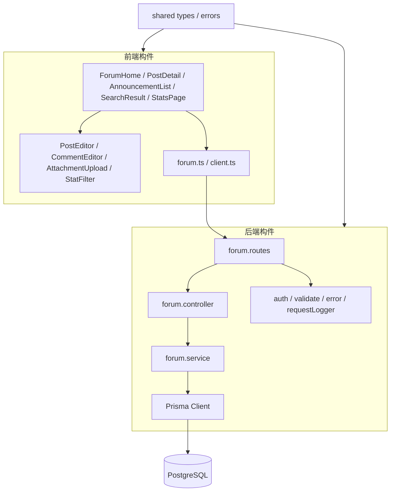
```mermaid
flowchart TB
    subgraph FE["前端构件"]
        Pages["ForumHome / PostDetail / AnnouncementList / SearchResult / StatsPage"]
        Modals["PostEditor / CommentEditor / AttachmentUpload / StatFilter"]
        ApiClient["forum.ts / client.ts"]
    end

    subgraph BE["后端构件"]
        Routes["forum.routes"]
        Controllers["forum.controller"]
        Services["forum.service"]
        Middleware["auth / validate / error / requestLogger"]
        PrismaClient["Prisma Client"]
    end

    DB[("PostgreSQL")]
    Shared["shared types / errors"]

    Pages --> Modals
    Pages --> ApiClient
    ApiClient --> Routes
    Routes --> Middleware
    Routes --> Controllers
    Controllers --> Services
    Services --> PrismaClient --> DB
    Shared --> FE
    Shared --> BE
```

> 讲稿：D 模块构件拆分与其他模块保持一致。后端按 routes-controller-service 分层，路由层通过 authMiddleware 统一认证，validate 中间件处理 Zod 校验，controller 接收请求后委托 service 完成业务逻辑。前端同样划分为页面、弹窗和 API client。前后端通过 @stss/shared 共享类型定义。

---

# D 模块状态设计与安全策略

```mermaid
stateDiagram-v2
    [*] --> NORMAL: 发布帖子/评论
    NORMAL --> HIDDEN: 管理员隐藏
    HIDDEN --> NORMAL: 管理员恢复
    NORMAL --> DELETED: 作者或管理员删除
    HIDDEN --> DELETED: 管理员删除
    NORMAL --> [*]: 物理删除（级联）
    HIDDEN --> [*]: 物理删除（级联）
    DELETED --> [*]: 物理删除（级联）
```

- 帖子/评论均采用软删除，status 标记为 DELETED，保留数据完整性
- 隐藏（HIDDEN）和删除（DELETED）的区别：隐藏可由管理员恢复，删除不可恢复（只保留记录）
- 附件删除时同时删除物理文件和数据库记录
- 关键操作（发帖、删帖、置顶、隐藏、恢复、导出统计）均写入 SystemLog 审计日志
- 附件类型白名单校验，不允许上传可执行文件或脚本
- 评论嵌套深度限制：最多支持一级回复（显示为树形，但数据库限制 depth ≤ 2）

> 讲稿：状态设计上，帖子、评论都有三个状态：正常、隐藏、删除。隐藏是管理员专用的温和管理手段，内容不对外展示但可恢复；删除标记为 DELETED 后不再展示，但仍保留数据用于审计。安全方面，所有关键操作都写审计日志，附件做了类型白名单限制，评论嵌套深度做了一级限制防止无限递归。

---

# D 模块设计模式与质量保证

| 设计点       | 采用方式                                      | 价值                                   |
| ------------ | --------------------------------------------- | -------------------------------------- |
| 分层架构     | Route → Controller → Service → Prisma         | 降低接口、业务、数据访问耦合           |
| 课程范围隔离 | verifyCourseAccess + getUserAccessibleCourses | 确保用户只能访问自己参与课程的讨论内容 |
| 软删除       | status 枚举标记                               | 数据可追溯、可恢复                     |
| 嵌套评论树   | parentId + depth + 内存树构建                 | 避免递归 SQL，前端直接使用树形结构     |
| 审计日志     | SystemLog + createAuditLog                    | 所有管理操作可追踪                     |
| 统计导出     | 内建 CSV 生成                                 | 无需依赖外部导出库，直接输出标准 CSV   |
| 全文检索     | Prisma contains + mode: insensitive           | 支持大小写不敏感的标题和内容搜索       |

> 讲稿：D 模块的设计模式围绕课程范围隔离和数据安全展开。课程范围隔离确保每个学生只能看到自己选课范围内的讨论内容，这是与通用论坛最大的区别。软删除和审计日志配合，所有管理操作都有据可查。评论树形结构采用内存构建的方式，避免递归查询数据库。

| 类别           | 当前实现与设计范围                                                                                                                                               |
| -------------- | ---------------------------------------------------------------------------------------------------------------------------------------------------------------- |
| 后端已实现范围 | 帖子 CRUD（含置顶、软删除）、评论树形管理（含嵌套回复、隐藏/恢复）、公告管理、全文检索、数据统计（热帖/用户/课程活跃度）、附件管理（Base64 上传/删除）、审计日志 |
| 前端已实现范围 | 论坛首页、帖子详情、发帖编辑、我的帖子、搜索结果、公告列表（均为 Demo 演示页面，使用模拟数据）                                                                   |
| 数据库         | ForumPost、ForumComment、ForumAttachment 实体完整，含自关联 parentId 与深度字段                                                                                  |
| 测试           | 后端 D 模块包含 forum schemas 与 forum service 的单元测试（132 个测试用例），涵盖帖子/评论/公告/检索/统计/附件全部功能域                                         |
| 后续扩展范围   | 前端对接真实接口、附件下载能力、帖子订阅/通知、富文本编辑器集成、图片预览                                                                                        |

[图片占位：D 组论坛首页、帖子详情、评论树或附件上传页面截图]

> 讲稿：D 模块后端实现已经比较完整，六大功能域全部覆盖。当前已通过 132 个单元测试覆盖了帖子、评论、公告、检索、统计和附件六大功能域的核心逻辑。前端目前以演示页面为主，使用模拟数据展示交互效果，后续可与真实接口对接。演示时可以展示 Swagger API 文档中的论坛接口列表和数据库 ER 图中论坛模块的实体关系。

---

# E 模块：在线测试（Online Testing）

## 在线测试组的定位

- E 模块负责 STSS 中“教学评价与过程性考核”的执行层能力
- 为教师提供题库维护、组卷、测试发布与统计分析能力
- 为学生提供在线答题、自动暂存、实时计时与结果查询能力
- 为 F 成绩管理模块提供过程性成绩与统计快照
- 与 A/C/F 模块形成完整教学评价闭环

> 讲稿：E 模块主要解决“如何在线完成教学测试”这个问题。它不仅是一个答题页面，而是覆盖题库、组卷、发布、答题、评分和统计分析的完整过程。同时它还要和 A 模块的身份体系、C 模块的选课名单、F 模块的成绩管理协同工作。

---

# E 模块建设目标

| 编号      | 建设目标           | 核心含义                       |
| --------- | ------------------ | ------------------------------ |
| GOAL-E-01 | 统一题库资源管理   | 建立标准化、多课程、多题型题库 |
| GOAL-E-02 | 统一试卷生成能力   | 支持手工组卷与自动组卷         |
| GOAL-E-03 | 统一在线作答体验   | 提供稳定、可恢复的在线考试环境 |
| GOAL-E-04 | 自动评分与统计分析 | 客观题即时评分并生成统计       |
| GOAL-E-05 | 测试过程治理       | 控制时间窗口、补考与异常处理   |
| GOAL-E-06 | 结果可追踪与同步   | 测试记录可审计并同步至 F 模块  |

> 讲稿：E 模块设计的核心关键词有三个：标准化、过程控制和数据分析。标准化体现在统一题库和组卷；过程控制体现在计时、会话和提交；数据分析体现在评分、统计和后续成绩同步。

---

# E 模块需求边界

| 范围内能力 | 说明                                   |
| ---------- | -------------------------------------- |
| 题库管理   | 试题创建、编辑、删除、标签与难度管理   |
| 试卷管理   | 手工组卷、自动组卷、试卷版本管理       |
| 测试发布   | 时间窗口、时长、重考策略与范围控制     |
| 在线答题   | 倒计时、自动保存、异常恢复、正式提交   |
| 自动评分   | 客观题即时评分、主观题留待人工批阅     |
| 统计分析   | 平均分、正确率、分布、错题与知识点分析 |

| 范围外能力         | 所属模块 |
| ------------------ | -------- |
| 用户与课程主数据   | A 模块   |
| 选课名单与培养方案 | C 模块   |
| GPA 与正式成绩     | F 模块   |
| 公告与论坛交流     | D 模块   |
| 教室与课表调度     | B 模块   |

> 讲稿：这里重点强调 E 模块的边界。E 不负责课程和用户生命周期，也不负责最终 GPA 计算，而是专注于“在线测试过程”本身。这样可以避免和其他模块职责重叠。

---

# E 模块核心业务流程

```mermaid
flowchart LR
    Bank["题库管理"] --> Paper["试卷生成"]
    Paper --> Publish["测试发布"]
    Publish --> Session["学生答题会话"]
    Session --> Submit["提交与收卷"]
    Submit --> Score["自动评分"]
    Score --> Stats["统计分析"]
    Stats --> Sync["同步 F 成绩管理"]
```

> 讲稿：E 模块业务流程可以概括成七个阶段：题库、组卷、发布、答题、提交、评分和统计。整个流程最终会把测试结果同步给 F 模块，用于形成过程性成绩。

---

# E 模块上下文级 DFD

```mermaid
flowchart TB
    subgraph actors["外部参与者"]
        direction LR
        teacher["教师"]
        student["学生"]
        admin["教务/考试管理员"]
    end

    E["E 在线测试子系统"]

    subgraph upstream["外部依赖"]
        direction LR
        A["A 基础信息管理"]
        C["C 智能选课"]
        F["F 成绩管理"]
    end

    teacher -- "题库维护、组卷、发布、统计" --> E
    student -- "答题、提交、查成绩" --> E
    admin -- "监控与异常处理" --> E

    A -- "用户与课程数据" --> E
    C -- "选课名单" --> E
    E -- "成绩快照与统计" --> F
```

> 讲稿：上下文图展示了 E 模块和外部角色、其他子系统之间的关系。A 提供用户与课程数据，C 提供选课名单，E 最终向 F 输出过程性成绩。这样可以保证整个教学链路的数据连续性。

---

# E 模块 0 层 DFD

```mermaid
flowchart LR
    subgraph P["核心处理过程"]
        P1(("题库管理"))
        P2(("试卷编排"))
        P3(("测试发布"))
        P4(("答题与暂存"))
        P5(("自动评分与统计"))
    end

    subgraph D["数据存储"]
        D1[("Question")]
        D2[("TestPaper")]
        D3[("PaperQuestion")]
        D4[("TestSession")]
        D5[("Answer")]
        D6[("ScoreSnapshot")]
    end

    P1 <--> D1
    P2 <--> D2
    P2 <--> D3
    P3 <--> D4
    P4 <--> D5
    P5 <--> D6
```

> 讲稿：0 层 DFD 展示了 E 模块内部的数据流。题库、试卷、答题会话和成绩快照分别独立存储，避免把所有数据混在一个大表中。这样后续扩展统计分析和历史归档会更容易。

---

# E 模块核心功能：题库与组卷

| 功能     | 关键设计点                   |
| -------- | ---------------------------- |
| 题库管理 | 支持单选、判断等题型         |
| 标签体系 | 支持知识点、章节、能力维度   |
| 手工组卷 | 教师逐题选择与排序           |
| 自动组卷 | 按题型、难度、知识点约束抽题 |
| 试卷校验 | 自动检查总分与题目完整性     |
| 版本快照 | 已发布试卷结构锁定           |

```mermaid
flowchart TB
    Question["题库"] --> Filter["题型/知识点筛选"]
    Filter --> Manual["手工组卷"]
    Filter --> Auto["自动组卷"]
    Manual --> Preview["试卷预览"]
    Auto --> Preview
    Preview --> Publish["发布测试"]
```

> 讲稿：组卷是 E 模块的重要设计点。手工组卷强调教师可控性，而自动组卷强调效率和约束匹配。系统需要确保题目数量、难度分布和总分配置满足要求，否则不能发布。

---

# E 模块核心功能：在线答题

| 功能需求   | 核心约束                   |
| ---------- | -------------------------- |
| 服务端计时 | 防止客户端篡改时间         |
| 自动暂存   | 默认不超过 60 秒           |
| 异常恢复   | 刷新或断线后恢复最近状态   |
| 强制收卷   | 时间到自动提交             |
| 会话唯一性 | 同一测试仅允许一个活跃会话 |
| 提交锁定   | 提交后禁止修改答案         |

```mermaid
stateDiagram-v2
    [*] --> NotStarted
    NotStarted --> InProgress: 开始答题
    InProgress --> AutoSaving: 自动暂存
    AutoSaving --> InProgress
    InProgress --> Submitted: 主动提交
    InProgress --> TimeUp: 时间结束
    TimeUp --> Submitted: 强制收卷
    Submitted --> Grading
    Grading --> Graded
```

> 讲稿：在线答题本质上是一个状态驱动系统。系统必须解决计时、防重复提交和异常恢复问题。例如浏览器关闭后重新进入，需要恢复最近一次暂存状态，并继续按照服务端剩余时间计时。

---

# E 模块领域模型

```mermaid
classDiagram
    direction LR

    class Question {
      +id
      +type
      +content
      +answer
      +difficulty
    }

    class TestPaper {
      +id
      +title
      +status
      +totalTime
    }

    class PaperQuestion {
      +orderIndex
      +score
    }

    class TestSession {
      +startedAt
      +submittedAt
      +status
    }

    class Answer {
      +studentAnswer
      +score
      +isCorrect
    }

    Question "1" --> "0..*" PaperQuestion
    TestPaper "1" --> "0..*" PaperQuestion
    TestPaper "1" --> "0..*" TestSession
    TestSession "1" --> "0..*" Answer
```

> 讲稿：领域模型重点是把“试卷结构”和“学生作答”分离。PaperQuestion 用于描述试卷中的题目顺序和分值，而 Answer 则是学生实际提交的数据。这样既能支持题库复用，也能保证历史试卷结构稳定。

---

# E 模块接口设计

| 能力     | 接口方向                    |
| -------- | --------------------------- |
| 题库管理 | `/api/v1/testing/questions` |
| 试卷管理 | `/api/v1/testing/papers`    |
| 自动组卷 | `/papers/{id}/generate`     |
| 答题会话 | `/testing/sessions`         |
| 提交答卷 | `/sessions/{id}/submit`     |
| 成绩统计 | `/testing/stats`            |

- 所有写操作必须经过身份认证与权限校验
- 测试时间与收卷逻辑以服务端时间为准
- 成绩统计接口必须按课程范围做权限隔离

> 讲稿：接口设计采用 REST 风格，并与其他模块统一使用 `/api/v1` 前缀。这里特别强调权限边界，例如学生只能访问自己的测试记录，教师只能查看本人课程的统计数据。

---

# E 模块统计分析设计

```mermaid
flowchart LR
    Result["测试结果"] --> Dist["分数分布"]
    Result --> Correct["题目正确率"]
    Result --> Trend["个人历史趋势"]
    Result --> Weakness["薄弱知识点分析"]

    Dist --> Teacher["教师统计面板"]
    Correct --> Teacher
    Trend --> Student["学生成绩查看"]
    Weakness --> Student
```

| 统计维度 | 输出内容                       |
| -------- | ------------------------------ |
| 试卷维度 | 平均分、最高分、最低分、标准差 |
| 题目维度 | 正确率、错误率、区分度         |
| 学生维度 | 历史成绩趋势、错题回顾         |
| 课程维度 | 分布区间、整体完成情况         |

> 讲稿：E 模块不仅生成分数，还要生成教学分析数据。例如题目正确率可以帮助教师发现知识薄弱点，学生历史趋势可以帮助学生了解自己的学习变化。

---

# E 模块非功能需求

| 编号     | 非功能需求   | 设计重点              |
| -------- | ------------ | --------------------- |
| NFR-E-01 | 计时准确性   | 使用服务端时间        |
| NFR-E-02 | 数据可靠性   | 高频自动暂存          |
| NFR-E-03 | 评分正确性   | 客观题严格匹配        |
| NFR-E-04 | 事务一致性   | 提交与评分事务化      |
| NFR-E-05 | 权限隔离     | 防止跨课程越权        |
| NFR-E-06 | 防重复提交   | 会话唯一控制          |
| NFR-E-07 | 可审计性     | 关键操作日志记录      |
| NFR-E-08 | 性能要求     | 支持大规模组卷与统计  |
| NFR-E-09 | 跨系统一致性 | 与 F 模块成绩同步一致 |

> 讲稿：在线测试系统相比普通 CRUD 系统，对可靠性要求更高。因为一旦发生计时错误、答案丢失或者重复提交，影响的是正式教学评价。因此这里特别强调事务一致性、自动暂存和审计日志。

---

# E 模块验证标准

| 验证编号 | 验证内容                     |
| -------- | ---------------------------- |
| VC-E-01  | 题库创建与校验逻辑正确       |
| VC-E-02  | 手工与自动组卷可正常生成试卷 |
| VC-E-03  | 倒计时、提交与评分流程正常   |
| VC-E-04  | 异常恢复与并发会话限制有效   |
| VC-E-05  | 服务端计时不受客户端修改影响 |
| VC-E-06  | 统计结果与原始数据一致       |
| VC-E-07  | 自动评分准确率达到要求       |
| VC-E-08  | 数据库回滚后无半成品成绩     |

> 讲稿：验证标准的目标是把需求真正落到可测试行为上。例如不仅要“支持自动保存”，还要验证断网恢复后能否恢复最近状态；不仅要“支持评分”，还要验证评分结果和标准答案完全一致。

---

# E 模块总结

1. E 模块负责 STSS 中完整的在线测试与过程性评价链路。
2. 系统重点解决题库、组卷、在线会话、自动评分和统计分析问题。
3. E 模块通过与 A/C/F 的数据协同形成教学评价闭环。

```mermaid
flowchart TB
    A["A 主数据"] --> E["E 在线测试"]
    C["C 选课名单"] --> E
    E --> F["F 成绩管理"]
```

> 讲稿：最后总结一下，E 模块并不是一个简单的在线答题页面，而是一个完整的教学评价系统。它既要解决考试过程中的实时性和可靠性问题，也要保证后续统计分析和成绩同步的准确性。

---

# F 模块：成绩管理（Score Management）

## 成绩管理设计要点

- 需求边界：任课教师成绩录入、学生成绩查询、成绩修改控制、成绩分析
- 核心对象：Enrollment、Score、ScoreModificationLog、GPARecord、CourseOffering
- 关键约束：初次录入后再次修改需要管理流程，成绩分析包含课程与个人两个维度
- 接口设计：成绩录入、修改申请/审批、学生查询、课程统计、GPA/学分进展

```mermaid
flowchart LR
    Enrollment["选课记录"] --> Entry["教师录入成绩"]
    Entry --> Score["成绩记录"]
    Score --> Modify["修改申请 / 审批"]
    Modify --> Log["修改日志"]
    Score --> Analysis["课程成绩分析"]
    Score --> GPA["学生 GPA / 学分进展"]
```

[图片占位：F 组成绩录入、学生成绩查询、成绩分析图表截图]

> 讲稿：F 模块是整个教学闭环的收口。它基于选课记录产生正式成绩，并提供修改控制和分析能力。设计上要特别说明成绩修改日志和审批控制，避免成绩数据被随意覆盖。

---

# 跨系统接口与集成契约

| 提供方 | 消费方        | 共享数据 / 契约                                      |
| ------ | ------------- | ---------------------------------------------------- |
| A      | B-F           | 用户、角色、权限、课程、院系、专业、培养方案基础数据 |
| B      | C、教师、教务 | 开课安排、教室时间、课表结果                         |
| C      | D、E、F       | 学生选课结果、课程参与范围                           |
| E      | F             | 测试成绩、统计结果、过程性评价数据                   |
| F      | C、学生       | 学分进展、GPA、已获得成绩                            |
| Shared | 前端、后端    | 通用类型、错误、枚举、响应结构                       |

- 跨模块共享对象必须使用统一字段和状态枚举
- 所有受保护接口必须走认证中间件
- 接口变更需同步 API 文档、共享类型、前端 client 和测试

> 讲稿：最后回到整体架构。跨系统集成的关键不是每个模块各写各的，而是把数据契约稳定下来。A 提供主数据，B 提供课表，C 提供选课，E 提供测试结果，F 提供成绩。接口变更必须同步文档、类型、前端 client 和测试。

---

# 质量保证措施

```mermaid
flowchart TB
    Req["课程要求 / SRS"] --> Trace["需求追踪矩阵"]
    Trace --> Design["UML / 接口 / 构件设计"]
    Design --> Impl["代码实现"]
    Impl --> Test["单元测试 / 集成测试"]
    Test --> CI["CI 检查"]
    CI --> Demo["截图 / 视频 / 演示验收"]
    Demo --> Review["问题复盘与后续计划"]
```

| 层级       | 措施                                              |
| ---------- | ------------------------------------------------- |
| 需求       | SRS 编号、用户场景、Validation Criteria           |
| 设计       | DFD、状态图、类图、CRC、接口表、构件图            |
| 实现       | TypeScript、Zod 校验、Prisma Schema、统一错误处理 |
| 代码检查   | Lint、Typecheck、Build 作为基础质量门禁           |
| 测试       | 单元测试、集成测试、关键业务流程测试              |
| 接口一致性 | API 文档、共享类型、前端 API client 同步更新      |
| 交付验证   | 关键流程演示、截图或视频、测试报告                |

> 讲稿：质量保证从需求开始，而不是最后才测试。我们的链路是：需求编号对应设计图和接口，设计再对应代码实现，最后用测试和演示素材验证。基础门槛包括 lint、typecheck、build、单元测试、集成测试和 API 文档一致性检查；当前 A 模块已经具备 auth/users 相关测试基础。

---

# 团队协作与过程管理

| 协作对象     | 主要责任                                  | 协作接口                                      |
| ------------ | ----------------------------------------- | --------------------------------------------- |
| 基础信息管理 | 统一身份、权限、课程与培养方案基础数据    | 向 B-F 提供用户、角色、课程、培养方案基础数据 |
| 自动排课     | 教室资源、排课、调课、课表输出            | 消费 A 的课程/教师数据，向 C 输出课表         |
| 智能选课     | 培养方案约束、课程检索、选课退选、AI 辅助 | 消费 A/B 数据，向 D/E/F 输出选课结果          |
| 论坛交流     | 公告、帖子、评论、附件、检索统计          | 消费课程和选课范围，服务教学互动              |
| 在线测试     | 题库、组卷、答题、评分统计                | 消费课程和学生名单，向 F 提供测试结果         |
| 成绩管理     | 成绩录入、修改控制、查询分析              | 消费选课和测试数据，输出成绩和学分进展        |

[图片占位：项目会议记录截图或周会纪要列表]
[图片占位：任务看板、分支或 PR 进度截图]

> 讲稿：协作方式上，我们按六个子系统拆分责任，同时通过共享数据和接口契约保证集成。每个模块都有自己的业务边界，也都有明确的上游和下游。过程管理上，我们会用会议记录、任务看板和分支记录来说明任务推进情况。

---

# 后续迭代安排

| 阶段                 | 目标                                 | 交付物                              |
| -------------------- | ------------------------------------ | ----------------------------------- |
| 设计细化与一致性校准 | 更新模块 UML、接口契约和关键构件说明 | 模块设计图、接口表、演示截图        |
| 接口联调             | 固化跨模块契约                       | API 文档、共享类型、Mock 或真实接口 |
| 功能实现             | 各模块按 SRS 验证标准推进            | 前后端功能、数据库迁移、测试        |
| 集成测试             | 验证主业务链路                       | 用户 → 排课 → 选课 → 测试 → 成绩    |
| 最终交付             | 完成演示和验收材料                   | 演示视频/截图、测试报告、部署说明   |

> 讲稿：后续安排围绕三个目标推进：先把设计讲清楚，再把接口契约稳定下来，最后按 SRS 的验证标准实现和测试。最终演示不只展示单点页面，而要展示用户、排课、选课、测试、成绩之间的完整业务链路。

---

# 总结：本次设计的三个核心结论

1. STSS 是六个子系统协同的教学服务平台，不是六个孤立功能页面。
2. A 模块是统一身份、权限和主数据基础，决定 B-F 的集成质量。
3. 系统设计可以从需求追踪到 UML、接口、构件、测试和演示材料。

```mermaid
flowchart TB
    Req["需求"] --> UML["UML"]
    UML --> API["接口"]
    API --> Component["构件"]
    Component --> Test["验证"]
    Test --> Demo["演示"]
```

> 讲稿：总结一下，我们的设计重点有三个。第一，系统是六个子系统的协同链路；第二，A 模块提供统一身份和主数据，是集成基础；第三，设计不是停留在图上，而要能继续追踪到接口、构件、测试和演示。后续实现会围绕这条链路推进，保证系统能够形成完整的教学服务闭环。
