

# Smart Teaching Service System 需求报告

> 本报告定义智慧教学服务系统的业务范围、用户场景、数据流、核心对象、状态约束与验收标准，为系统实现、联调和验收提供统一依据。

## 目录

- [0. 文档信息](#0.-文档信息)
- [1. Introduction / 引言](#1.-introduction-引言)
- [2. 系统总体描述](#2.-系统总体描述)
- [3. 用户场景 / User Scenarios](#3.-用户场景-user-scenarios)
- [4. 功能需求](#4.-功能需求)
- [5. 非功能需求](#5.-非功能需求)
- [6. 数据流图 / DFD](#6.-数据流图-dfd)
- [7. 状态图 / State Diagrams](#7.-状态图-state-diagrams)
- [8. 类图与 CRC 卡](#8.-类图与-crc-卡)
- [9. 验证标准 / Validation Criteria](#9.-验证标准-validation-criteria)
- [10. 需求追踪矩阵](#10.-需求追踪矩阵)
- [11. 附录](#11.-附录)

---

## 0. 文档信息

### 0.1 文档版本

| 版本 | 日期       | 作者   | 修改说明                                 |
| ---- | ---------- | ------ | ---------------------------------------- |
| v1.0 | 2026-06-20 | 项目组 | 整合 A-F 子系统需求报告初稿              |
| v1.1 | 2026-06-20 | 项目组 | 补充 C 组需求并完善跨模块章节            |
| v2.0 | 2026-06-21 | 项目组 | 明确选课与在线测试需求边界，统一验收口径 |

### 0.2 小组分工

| 子系统编号 | 子系统名称   | 负责小组 | 主要贡献                                                                                                                                                              |
| ---------- | ------------ | -------- | --------------------------------------------------------------------------------------------------------------------------------------------------------------------- |
| A          | 基础信息管理 | A 组     | 统一管理用户、认证、安全、角色权限、院系、专业、课程、培养方案与系统日志，为 B-F 子系统提供可信基础数据和统一访问控制                                                 |
| B          | 自动排课     | B 组     | 基于 A 组提供的课程、教师、开课等基础数据，管理教室资源，按容量、时间和冲突约束生成课程安排，支持手动调课与冲突提示，并提供课表查询与 CSV 导出 |
| C          | 智能选课     | C 组     | 提供培养方案与选课学分进展查询、课程和开课查询、选退课事务、选课阶段管理、教师名单导出及 AI 辅助选课能力，并保证选课操作的权限、容量和审计约束                        |
| D          | 论坛交流     | D 组     | 围绕课程开设提供论坛公告、帖子发布、附件上传、回复留言、内容管理、全文检索、热门统计和活跃度分析能力，支撑师生课内交流与课程通知沉淀                                  |
| E          | 在线测试     | E 组     | 提供题库、题目、试卷、组卷、发布关闭、学生在线答题、自动评分和测试成绩查询能力，并保证考试状态、作答时间和访问权限受控                                                |
| F          | 成绩管理     | F 组     | 提供成绩录入、提交、受控修改申请与审批、学生成绩查询、GPA 与学分进展、个人和课程成绩分析能力，并保留完整审计链路                                                      |

### 0.3 A 组需求基线与一致性口径

| 类别     | 基线内容                                                                                      |
| -------- | --------------------------------------------------------------------------------------------- |
| 代码基线 | A 组基础信息管理子系统当前集成版本                                                            |
| 接口基线 | A 组基础信息管理接口设计文档 v3.0.0，接口统一挂载在 `/api/v1`，响应字段采用 `snake_case`      |
| 数据基线 | A 模块及其与 B-F 共用的用户、课程、培养方案、权限、日志实体                                  |
| 前端基线 | 登录、注册、用户、院系、专业、角色权限、课程、培养方案、个人资料等基础信息管理页面与 API 封装 |

A 组内容仅覆盖基础信息管理子系统，不展开 B-F 子系统内部算法和业务规则。涉及 B-F 的内容仅说明 A 组提供的基础数据、身份权限和审计支撑。

---

## 1. Introduction / 引言

### 1.1 项目背景

高校教学活动涉及人员、课程、培养方案、教学资源、学习过程和成绩等多类信息。若这些信息分别通过表格、即时通信工具或彼此独立的业务系统维护，容易出现基础数据不一致、课程时间冲突难以及时发现、学生选课约束不透明、教学交流与测试过程分散、成绩修改缺少审计等问题。

智慧教学服务系统（STSS）以统一身份、课程和组织数据为基础，将自动排课、智能选课、论坛交流、在线测试和成绩管理串联为完整的教学服务流程。系统在保证角色权限、本人数据边界和关键操作可审计的前提下，为学生、教师、教务管理人员和系统管理员提供面向日常教学管理的 Web 服务。AI 能力仅用于辅助学生理解选课建议和限制条件，不替代学生的最终选课决定。

### 1.2 项目目标

1. 建立统一的用户、组织、课程、培养方案和权限数据基础，避免各教学业务重复维护核心数据。
2. 支持“教学资源与开课配置、排课、选课、教学交流与测试、成绩录入和分析”的学期教学闭环。
3. 通过后端角色控制、本人数据边界、事务校验和系统日志，提高关键教学操作的准确性、可追溯性和可维护性。
4. 为学生提供培养方案、课程可选性、课表、测试和成绩等自助服务；为教师和教务人员提供受控的管理、查询、导出和分析能力。
5. 在选课场景提供可解释、可降级且无写入副作用的 AI 辅助入口。

### 1.3 系统范围

#### 1.3.1 系统包含的范围

| 编号 | 子系统       | 范围说明                                                                                                            |
| ---- | ------------ | ------------------------------------------------------------------------------------------------------------------- |
| A    | 基础信息管理 | 管理用户、认证与会话安全、角色权限、院系、专业、课程、培养方案和系统日志，为 B-F 子系统提供基础数据与访问控制支撑。 |
| B    | 自动排课     | 管理教室资源，自动生成或手动调整开课排课结果，校验教室状态、教室占用、容量和教室类型约束，并支持课表查询与 CSV 导出。 |
| C    | 智能选课     | 提供培养方案和选课进展查询、课程与开课搜索、选退课事务、选课阶段管理、教师名单导出及 AI 辅助选课。                  |
| D    | 论坛交流     | 围绕课程开设提供论坛公告、帖子发布、附件上传、回复留言、内容管理、全文检索、热门统计和活跃度分析能力。              |
| E    | 在线测试     | 提供题库、题目、试卷、手动或自动组卷、发布关闭、学生答题、自动评分和测试成绩查询能力。                              |
| F    | 成绩管理     | 提供成绩录入、受控提交与修改审批、学生成绩查询、GPA 与学分进展、个人及课程成绩分析能力。                            |

#### 1.3.2 系统暂不包含的范围

| 编号 | 不包含内容                 | 说明                                                                                                   |
| ---- | -------------------------- | ------------------------------------------------------------------------------------------------------ |
| O-01 | 校级身份与教务系统真实对接 | 本项目使用系统内账号、组织、课程和培养方案数据，不接入真实 CAS、LDAP 或生产教务系统。                  |
| O-02 | 生产级基础设施与安全运营   | 不建设 SIEM、WAF、入侵检测、生产级容灾和完整监控告警平台；选课并发准入与空闲释放仅覆盖项目内业务控制。 |
| O-03 | AI 自动决策                | AI 仅提供选课建议与解释，不自动创建、修改或确认学生选课记录。                                          |
| O-04 | 在线监考与人工主观题评分   | 在线测试覆盖客观题自动评分，不包含人脸识别监考、视频监考和教师主观题阅卷。                             |
| O-05 | 独立移动端应用             | 系统以桌面 Web 端和常见笔记本分辨率为主要验收场景，不提供独立原生移动应用。                            |

### 1.3.3 A 基础信息管理详细范围

基础信息管理子系统是 STSS 的基础支撑层。它不直接完成排课、选课、论坛、在线测试或成绩业务闭环，但负责维护这些业务所依赖的身份、组织、课程与权限数据，并通过统一认证、安全策略和日志能力保障其他子系统的访问可信度。

#### 1.3.3.1 包含范围

| 编号   | 范围                 | 说明                                                                                                                                                                         |
| ------ | -------------------- | ---------------------------------------------------------------------------------------------------------------------------------------------------------------------------- |
| A-S-01 | 认证与会话安全       | 支持登录、登出、注册、当前用户信息获取、密码修改、忘记密码与重置、访问令牌刷新、活跃令牌查看与吊销；账号激活接口在代码中保留，但接口文档已标注为废弃能力，不作为核心验收入口 |
| A-S-02 | 用户基本信息管理     | 支持学生、教师、管理员等用户的创建、查询、编辑、软删除、批量创建、批量状态/角色调整、角色分配、密码重置与权限查看；用户创建、批量创建和删除由 `super_admin` 执行             |
| A-S-03 | 用户个人信息管理     | 支持用户维护个人资料、联系方式、头像和密码；头像上传限制为 JPG、PNG、WEBP，单文件不超过 5MB                                                                                  |
| A-S-04 | 院系与专业管理       | 支持院系、专业的新增、查询、编辑、删除与统计展示，并维护学生、教师、管理员与院系专业之间的归属关系                                                                           |
| A-S-05 | 课程基础信息管理     | 支持课程代码、名称、学分、学时、课程类型、开课院系、负责教师、考核方式、先修课程等基础数据维护；课程状态作为数据字段用于列表展示和筛选，当前接口不提供归档/恢复操作          |
| A-S-06 | 培养方案基础数据管理 | 支持按专业和年份维护培养方案、总学分、必修/选修学分、课程清单、建议修读学期等信息                                                                                            |
| A-S-07 | 角色权限管理         | 支持角色、权限、角色-权限关系、用户-角色关系维护；当前接口访问控制以角色和本人/管理员规则为主，权限代码用于角色权限配置、聚合查询和后续扩展                                  |
| A-S-08 | 系统日志与安全审计   | 记录登录登出、用户变更、角色权限变更、院系专业变更、课程和培养方案变更等关键操作，支持按用户、操作、时间范围分页查询；当前令牌吊销接口不写入系统日志                         |

#### 1.3.3.2 不包含范围

| 编号   | 不包含内容               | 说明                                                                                                           |
| ------ | ------------------------ | -------------------------------------------------------------------------------------------------------------- |
| A-O-01 | 学校统一身份认证真实接入 | 本项目仅定义和实现系统内认证，不负责接入真实 CAS、LDAP、企业微信等校级认证平台                                 |
| A-O-02 | 生产级入侵检测平台       | 系统需要记录安全相关日志并提供基础安全控制，但不建设完整的 SIEM、WAF 或入侵检测平台                            |
| A-O-03 | 业务子系统核心决策       | A 组提供课程、用户、权限等基础数据，不负责自动排课算法、选课冲突判断、论坛内容审核、在线测试评分或成绩审核规则 |
| A-O-04 | 复杂数据同步             | 不负责与真实教务系统、人事系统、财务系统进行生产级双向同步                                                     |

#### 1.3.3.3 A 子系统对外契约

| 契约类别 | 契约说明                                                                                                                                                                                |
| -------- | --------------------------------------------------------------------------------------------------------------------------------------------------------------------------------------- |
| 身份契约 | 所有受保护接口必须通过 JWT Bearer Token 访问；访问令牌默认有效期为 2 小时，刷新令牌默认有效期为 7 天并采用轮换机制                                                                      |
| 权限契约 | 基础角色包括 `student`、`teacher`、`admin`、`super_admin`；当前管理接口按角色和本人/管理员关系控制访问，权限代码用于表达角色能力集合，例如 `user:read`、`course:create`、`log:read`     |
| 数据契约 | 用户状态使用 `ACTIVE`、`INACTIVE`、`BANNED`；课程类型使用 `REQUIRED`、`ELECTIVE`、`GENERAL`；课程状态字段可为 `ACTIVE`、`ARCHIVED`，当前 A 组接口支持返回和筛选该字段，不支持修改该字段 |
| API 契约 | 认证、用户、院系、专业、课程、培养方案、角色、权限分别通过 `/auth`、`/users`、`/departments`、`/majors`、`/courses`、`/curriculums`、`/roles`、`/permissions` 提供                      |
| 前端契约 | A 组前端已提供 `/users`、`/users/logs`、`/profile`、`/info/departments`、`/info/majors`、`/info/roles`、`/info/courses`、`/info/curriculums` 等管理入口                                 |

#### 1.3.3.4 A 子系统 API 能力总览

| 能力域       | 主要入口                                      | 核心数据                           | 主要使用者               | 备注                                                                      |
| ------------ | --------------------------------------------- | ---------------------------------- | ------------------------ | ------------------------------------------------------------------------- |
| 认证与会话   | `/api/v1/auth/*`、`/api/v1/users/:id/tokens*` | 用户、刷新令牌、密码重置令牌       | 所有用户、管理员         | 登录返回 Access Token 和 Refresh Token；刷新令牌采用轮换与吊销机制        |
| 用户管理     | `/api/v1/users*`                              | 用户、学生、教师、管理员、用户角色 | 教务管理人员、系统管理员 | 支持软删除、批量创建、状态调整、角色分配和组织归属维护                    |
| 组织管理     | `/api/v1/departments*`、`/api/v1/majors*`     | 院系、专业                         | 教务管理人员、系统管理员 | 为学生、教师、课程和培养方案提供组织引用                                  |
| 课程基础信息 | `/api/v1/courses*`                            | 课程、先修课程关系                 | 教务管理人员、系统管理员 | 维护课程基本属性；课程开设容量由开课实体承载，不在 A 组课程基础接口中维护 |
| 培养方案     | `/api/v1/curriculums*`                        | 培养方案、培养方案课程             | 教务管理人员、系统管理员 | 为智能选课和成绩学分进展提供基础规则数据                                  |
| 角色权限     | `/api/v1/roles*`、`/api/v1/permissions*`      | 角色、权限、角色权限关系           | 系统管理员、超级管理员   | 内置角色受保护，权限代码用于能力集合配置和后续扩展                        |
| 审计日志     | `/api/v1/users/logs`                          | 系统日志                           | 教务管理人员、系统管理员 | 记录已纳入 A 组验收范围的关键操作                                         |

### 1.3.4 C 智能选课详细范围

#### 1.3.4.1 包含范围

| 编号   | 范围                   | 需求说明                                                                                                   |
| ------ | ---------------------- | ---------------------------------------------------------------------------------------------------------- |
| C-S-01 | 培养方案制定与确认     | 学生可查看本人专业和年级匹配的培养方案、课程分组和建议修读学期，并确认作为选课依据。                       |
| C-S-02 | 学分进展统计           | 系统基于已确认培养方案、本人有效选课记录和课程学分统计选课进展。                                           |
| C-S-03 | 课程与开课查询         | 支持按关键词、教师、课程类型、开课状态等查询课程、开课、可选课程和详情。                                   |
| C-S-04 | 选课事务               | 系统在事务中校验选课阶段、培养方案确认、容量、重复选课、时间冲突、最大学分、培养方案归属和先修课通过状态。 |
| C-S-05 | 退课事务               | 学生可在配置为允许退课的选课阶段退选本人记录。                                                             |
| C-S-06 | 选课结果与课表         | 学生可查询本人选课记录、汇总和课表，并使用前端打印视图。                                                   |
| C-S-07 | 教师名单与导出         | 教师可查询和导出本人开课学生名单。                                                                         |
| C-S-08 | 选课阶段管理           | 学术教务管理员可查询、创建和更新选课阶段。                                                                 |
| C-S-09 | 教务手动加课           | 学术教务管理员可填写原因并为学生手动加课，成功后写入系统日志。                                             |
| C-S-10 | AI 辅助入口            | 提供推荐和解释接口，支持规则与大语言模型建议；模型不可用时降级并返回解释；不产生选课写入副作用。           |
| C-S-11 | 选课并发准入与空闲释放 | 系统应控制同时进入选课服务的活跃用户数；达到上限时拒绝或排队提示；超过规定无操作时长应释放会话名额。       |

#### 1.3.4.2 不包含范围

| 编号   | 不包含内容               | 说明                                                                            |
| ------ | ------------------------ | ------------------------------------------------------------------------------- |
| C-O-01 | 自主训练的生产级推荐模型 | AI 可采用规则和外部大语言模型提供辅助建议，不包含自主模型训练、持续训练与运营。 |
| C-O-02 | AI 自动代替学生选课      | AI 不创建、修改或确认 `Enrollment`；最终选课由学生通过普通选课流程提交。        |

#### 1.3.4.3 C 子系统对外契约

| 契约类别     | 契约说明                                                              |
| ------------ | --------------------------------------------------------------------- |
| API 契约     | C 组接口统一挂载在 `/api/v1/course-selection`                         |
| 字段契约     | 外部请求字段使用 `snake_case`；后端 schema 转换为服务层 camelCase     |
| 学生身份契约 | 学生端接口使用当前认证上下文识别学生，不接受前端传入 `student_id`     |
| 教师权限契约 | 教师名单和导出必须校验目标开课归属当前教师                            |
| 教务权限契约 | 阶段管理和手动加课要求管理员角色，并确认 `Admin.adminType = ACADEMIC` |
| 事务契约     | 选课和手动加课必须在后端事务中完成容量校验、记录写入和容量更新        |
| 审计契约     | 阶段配置和教务手动加课写入 `SystemLog`                                |

### 1.4 目标用户与利益相关者

| 角色           | 说明                                                   | 主要使用的子系统 |
| -------------- | ------------------------------------------------------ | ---------------- |
| 学生           | 使用选课、论坛、在线测试、成绩查询等功能               | C、D、E、F       |
| 教师           | 使用课程管理相关功能、论坛、在线测试、成绩录入等       | B、D、E、F       |
| 教务管理人员   | 管理用户、课程、排课、选课流程等                       | A、B、C          |
| 系统管理员     | 管理权限、安全、日志等                                 | A                |
| 论坛管理员     | 管理帖子、公告、统计等                                 | D                |
| 学术教务管理员 | 具有 `ACADEMIC` 管理员类型，负责选课阶段和特殊加课管理 | C                |

### 1.5 术语、缩写与约定

| 术语                        | 含义                                                                                                 |
| --------------------------- | ---------------------------------------------------------------------------------------------------- |
| STSS                        | Smart Teaching Service System，智慧教学服务系统                                                      |
| AI 辅助选课                 | 利用大语言模型或数字虚拟人等技术辅助学生选择课程                                                     |
| 初选                        | 学生在初选阶段提交选课意向                                                                           |
| 补退选                      | 初选后开放的补选、退选阶段                                                                           |
| CRC                         | Class-Responsibility-Collaborator，类-职责-协作者卡片                                                |
| DFD                         | Data Flow Diagram，数据流图                                                                          |
| 课程开设（CourseOffering）  | 某门课程在指定学期、教师和容量条件下形成的教学班，是排课、选课、论坛、测试与成绩管理的共同业务对象。 |
| 选课记录（Enrollment）      | 学生与课程开设之间的业务关系，主要状态为 `ENROLLED`、`DROPPED` 和 `WITHDRAWN`。                      |
| 选课阶段（SelectionPeriod） | 规定某学期选课或退课时间窗口、最大学分和启用状态的管理对象。                                         |
| 试卷（TestPaper）           | 关联课程开设、题目、作答时间和发布状态的在线测试对象。                                               |
| 测试记录（TestResult）      | 学生对某份试卷的一次作答记录，保存作答、用时、提交和评分结果。                                       |
| 成绩记录（Score）           | 与选课记录关联的成绩对象，保存分项成绩、总评、绩点、等级和成绩状态。                                 |

---

## 2. 系统总体描述

### 2.1 系统总体功能结构

A 子系统维护身份、权限、组织、课程和培养方案等基础数据，是其他子系统的共同支撑层。B 子系统根据课程开设、教师和教室资源形成排课结果；C 子系统在培养方案、容量、冲突和选课阶段约束下创建选课记录；D 与 E 子系统围绕课程开设分别承载教学交流和在线测试；F 子系统基于选课、课程和学生数据完成成绩管理与分析。所有受保护业务均依赖 A 子系统提供的认证与角色控制。

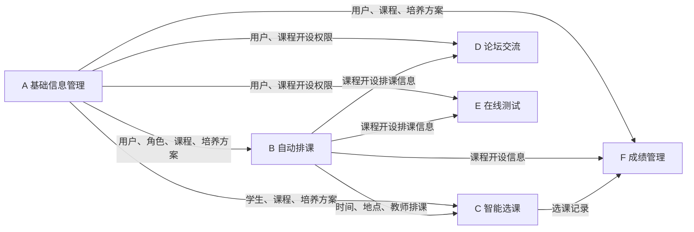
```mermaid
flowchart LR
  A["A 基础信息管理"]
  B["B 自动排课"]
  C["C 智能选课"]
  D["D 论坛交流"]
  E["E 在线测试"]
  F["F 成绩管理"]

  A -->|"用户、角色、课程、培养方案"| B
  A -->|"学生、课程、培养方案"| C
  A -->|"用户、课程开设权限"| D
  A -->|"用户、课程开设权限"| E
  A -->|"用户、课程、培养方案"| F
  B -->|"时间、地点、教师排课"| C
  B -->|"课程开设排课信息"| D
  B -->|"课程开设排课信息"| E
  B -->|"课程开设信息"| F
  C -->|"选课记录"| F
```

### 2.2 总体业务流程

```mermaid
flowchart LR
  S1["基础信息与培养方案初始化"] --> S2["开课与教学资源配置"]
  S2 --> S3["自动排课或手动调课"]
  S3 --> S4["开放选课阶段并完成选退课"]
  S4 --> S5["课程学习、论坛交流与在线测试"]
  S5 --> S6["成绩录入、提交与修改审批"]
  S6 --> S7["学生查询成绩、GPA 和学分进展"]
```

在每个学期开始前，教务管理人员维护用户、课程、培养方案和开课基础数据，并配置教室和排课结果。选课阶段开放后，学生基于课表、容量、培养方案和先修课约束完成选课；课程进行期间，师生可使用论坛和在线测试开展教学互动与学习评价；课程结束后，教师或管理员录入并提交成绩，受控修改通过申请和审批完成，学生最终查询个人成绩和学业分析结果。

### 2.3 总体用户权限说明

| 角色         | 基础信息                           | 排课                         | 选课                       | 论坛                           | 在线测试                         | 成绩                                 |
| ------------ | ---------------------------------- | ---------------------------- | -------------------------- | ------------------------------ | -------------------------------- | ------------------------------------ |
| 学生         | 查看和维护本人资料                 | 查看本人课表                 | 查询、选课、退课和查看课表 | 发布帖子、评论和查看课程交流   | 参加已发布测试并查询本人测试结果 | 查询本人可见成绩与学业分析           |
| 教师         | 维护本人资料                       | 查询本人课表                 | 查询和导出本人开课名单     | 发布公告、发帖、评论和查看统计 | 查看授权范围内的试卷测试结果     | 录入、提交和申请修改本人任课课程成绩 |
| 教务管理人员 | 维护用户、组织、课程和培养方案     | 管理教室、自动排课和手动调课 | 管理选课阶段和特殊手动加课 | 在授权范围内查看和管理内容     | 管理题库、试卷、组卷和测试成绩   | 查询与审批授权范围内的成绩业务       |
| 系统管理员   | 管理角色、权限、安全策略和系统日志 | 按授权维护                   | 按授权维护                 | 管理论坛角色和内容             | 管理测试角色和基础数据           | 管理成绩相关权限和审计               |
| 论坛管理员   | 查看本人资料                       | 无                           | 无                         | 管理公告、帖子、评论和论坛统计 | 无                               | 无                                   |

### 2.4 A 子系统总体描述

#### 2.4.1 在 STSS 中的位置

A 基础信息管理为全系统提供“可信身份、可信基础数据、可信授权、可信审计”四类底座能力。B 自动排课依赖 A 组的教师、课程、院系等数据；C 智能选课依赖 A 组的学生、专业、培养方案、课程和先修关系；D 论坛交流、E 在线测试、F 成绩管理依赖 A 组的用户身份、课程引用和角色权限。A 组不替代后续业务子系统完成排课算法、选课事务、论坛内容治理、在线评分或成绩修改审批。

#### 2.4.2 主要业务流程

| 步骤 | 业务活动             | A 组职责                                           | 输出数据                     |
| ---- | -------------------- | -------------------------------------------------- | ---------------------------- |
| 1    | 初始化系统身份与权限 | 创建内置角色、权限、管理员账号，建立认证与授权入口 | 角色权限集合、管理员身份     |
| 2    | 建立组织目录         | 维护院系和专业，校验代码唯一性和引用关系           | 院系目录、专业目录           |
| 3    | 建立人员目录         | 创建学生、教师、管理员账号并维护扩展身份           | 用户、学生、教师、管理员信息 |
| 4    | 建立课程目录         | 维护课程、先修课程、负责教师、考核方式等基础信息   | 课程基础数据、先修关系       |
| 5    | 建立培养方案         | 按专业和年份维护学分要求及课程清单                 | 培养方案、方案课程           |
| 6    | 运行期访问控制       | 登录、刷新令牌、校验角色、吊销风险会话             | 认证状态、会话状态、权限集合 |
| 7    | 运行期审计           | 记录和查询关键管理操作                             | 系统日志                     |

#### 2.4.3 与 B-F 子系统的数据依赖

| 下游子系统 | 依赖 A 组数据                                  | 依赖原因                                     | A 组边界                               |
| ---------- | ---------------------------------------------- | -------------------------------------------- | -------------------------------------- |
| B 自动排课 | 教师、课程、院系、课程负责人                   | 排课需要知道课程、教师和组织归属             | 不负责教室、排课任务和冲突检测算法     |
| C 智能选课 | 学生、专业、培养方案、课程、先修关系、课程类型 | 选课展示、培养方案约束和学习路径需要基础数据 | 不负责选退课事务、容量扣减和 AI 推荐   |
| D 论坛交流 | 用户、角色、课程引用                           | 论坛需要识别发帖人、教师身份和课程上下文     | 不负责帖子审核、附件策略和热门统计     |
| E 在线测试 | 教师、学生、课程引用                           | 题库、试卷和答题记录需要课程与人员身份       | 不负责题库内容、组卷和自动评分         |
| F 成绩管理 | 学生、教师、课程、培养方案                     | 成绩录入、查询和学分进展依赖人员与培养方案   | 不负责成绩录入规则、修改审批和绩点算法 |

---

## 3. 用户场景 / User Scenarios

### 3.1 A 基础信息管理用户场景

#### 3.1.1 UC-A-01 教务管理人员维护学生/教师用户

| 项目     | 内容                                                                                                                                                                                                                                                                                                                       |
| -------- | -------------------------------------------------------------------------------------------------------------------------------------------------------------------------------------------------------------------------------------------------------------------------------------------------------------------------- |
| 主参与者 | 教务管理人员、系统管理员                                                                                                                                                                                                                                                                                                   |
| 目标     | 按角色权限查询、创建、编辑、删除学生或教师账号，并维护其基础身份信息                                                                                                                                                                                                                                                       |
| 前置条件 | 管理人员已登录；用户列表查询和多数维护操作要求 `admin` 或 `super_admin`；用户创建、批量创建和删除要求 `super_admin`；待关联的院系、专业等基础数据已存在                                                                                                                                                                    |
| 主流程   | 1. 管理人员进入用户管理；2. 按关键词、角色、状态或是否包含已删除用户筛选用户；3. 新增或编辑用户基础信息；4. 为学生填写学号、年级、班级、专业，为教师填写工号、院系、职称、办公地点，为管理员填写管理员类型和所属院系；5. 设置用户角色；6. 对多个用户可批量创建或批量调整状态/角色；7. 保存后系统返回结果并允许继续查看详情 |
| 异常流程 | 用户名、学号、工号或邮箱重复；必填字段为空；专业或院系不存在；权限不足；普通管理员或用户尝试删除用户；批量创建中部分记录失败                                                                                                                                                                                               |
| 后置条件 | 用户信息被保存或更新；角色关系同步生效；用户创建、更新、删除、状态变更等操作写入系统日志；用户可被搜索、查看或用于后续业务子系统                                                                                                                                                                                           |
| 关联需求 | FR-A-01、FR-A-02、FR-A-08、FR-A-12                                                                                                                                                                                                                                                                                         |

#### 3.1.2 UC-A-02 用户维护个人资料与密码

| 项目     | 内容                                                                                                                                                                                                       |
| -------- | ---------------------------------------------------------------------------------------------------------------------------------------------------------------------------------------------------------- |
| 主参与者 | 学生、教师、教务管理人员、系统管理员                                                                                                                                                                       |
| 目标     | 用户维护本人个人信息、头像和密码，保证个人资料及时准确                                                                                                                                                     |
| 前置条件 | 用户已登录且账号处于启用状态                                                                                                                                                                               |
| 主流程   | 1. 用户进入个人资料页；2. 查看姓名、邮箱、电话、头像、角色、所属专业或院系等信息；3. 修改允许本人维护的字段；4. 上传 JPG、PNG 或 WEBP 图片作为头像；5. 输入旧密码和新密码完成密码修改；6. 系统提示保存成功 |
| 异常流程 | 非本人尝试修改个人信息；头像格式不属于 JPG/PNG/WEBP 或超过 5MB；旧密码错误；新密码不满足至少 8 位且包含大小写字母和数字；邮箱与其他用户冲突                                                                |
| 后置条件 | 个人资料或密码被更新；通过认证模块完成的密码修改、密码重置写入系统日志；密码变更后旧刷新令牌失效                                                                                                           |
| 关联需求 | FR-A-03、FR-A-04、FR-A-11                                                                                                                                                                                  |

#### 3.1.3 UC-A-03 用户登录、刷新会话与安全退出

| 项目     | 内容                                                                                                                                                                                                                                                                     |
| -------- | ------------------------------------------------------------------------------------------------------------------------------------------------------------------------------------------------------------------------------------------------------------------------ |
| 主参与者 | 所有注册用户                                                                                                                                                                                                                                                             |
| 目标     | 用户通过账号密码进入系统，并在会话过期前安全刷新或退出                                                                                                                                                                                                                   |
| 前置条件 | 用户账号存在、未被禁用或封禁                                                                                                                                                                                                                                             |
| 主流程   | 1. 用户输入用户名和密码；2. 系统校验身份和账号状态；3. 登录成功后返回用户身份、角色、权限、访问令牌和刷新令牌；4. 用户在访问受保护资源时携带有效访问令牌；5. 访问令牌过期后可使用有效刷新令牌换取新令牌，旧刷新令牌被标记为已使用；6. 用户主动登出时系统吊销对应刷新令牌 |
| 异常流程 | 用户不存在；密码错误；账号未启用或被封禁；刷新凭据过期、重复使用或已吊销；用户访问未授权资源                                                                                                                                                                             |
| 后置条件 | 登录、登出操作可被审计；已使用、过期或吊销的刷新令牌不能继续换取新访问令牌                                                                                                                                                                                               |
| 关联需求 | FR-A-05、FR-A-06、FR-A-11、NFR-A-S-01                                                                                                                                                                                                                                    |

#### 3.1.4 UC-A-04 系统管理员管理角色与权限

| 项目     | 内容                                                                                                                                                                                                                                   |
| -------- | -------------------------------------------------------------------------------------------------------------------------------------------------------------------------------------------------------------------------------------- |
| 主参与者 | 系统管理员、超级管理员                                                                                                                                                                                                                 |
| 目标     | 维护角色、权限以及角色-权限关系，并通过角色控制管理功能访问范围                                                                                                                                                                        |
| 前置条件 | 管理员已登录；具备角色权限管理权限                                                                                                                                                                                                     |
| 主流程   | 1. 管理员查看角色列表及其用户数、权限集合；2. 创建或编辑角色名称、代码、描述；3. 查询权限列表；4. 为角色分配或撤销权限；5. 为单个用户分配或撤销角色；6. 单用户角色分配或撤销后，系统吊销该用户刷新令牌，使其重新登录后获得新的角色集合 |
| 异常流程 | 普通用户访问权限管理；删除系统内置角色；删除仍被用户引用的角色；撤销超级管理员关键权限；普通管理员尝试分配超级管理员角色；管理员尝试撤销自己的最后一个管理员角色                                                                       |
| 后置条件 | 角色权限配置保存；角色和权限变更写入系统日志；单用户角色分配或撤销后相关刷新令牌失效                                                                                                                                                   |
| 关联需求 | FR-A-08、FR-A-09、FR-A-11                                                                                                                                                                                                              |

#### 3.1.5 UC-A-05 教务管理人员维护院系与专业

| 项目     | 内容                                                                                                                                                                                               |
| -------- | -------------------------------------------------------------------------------------------------------------------------------------------------------------------------------------------------- |
| 主参与者 | 教务管理人员、系统管理员                                                                                                                                                                           |
| 目标     | 维护学校组织结构和专业目录，供用户、课程、培养方案等模块引用                                                                                                                                       |
| 前置条件 | 管理人员已登录；院系、专业查询要求已认证；创建和删除要求 `super_admin`；更新要求 `admin` 或 `super_admin`                                                                                          |
| 主流程   | 1. 管理人员进入院系或专业管理；2. 查询列表、查看详情与关联统计；3. 创建院系并录入名称、代码、描述；4. 创建专业并绑定所属院系、学位类型、总学分要求；5. 编辑已有院系或专业；6. 删除无关联依赖的数据 |
| 异常流程 | 院系或专业代码重复；删除存在教师、专业、管理员、课程关联的院系；删除存在学生关联的专业；普通用户越权维护                                                                                           |
| 后置条件 | 院系专业数据成为用户、课程和培养方案的基础引用；变更操作记录日志                                                                                                                                   |
| 关联需求 | FR-A-07、FR-A-12                                                                                                                                                                                   |

#### 3.1.6 UC-A-06 教务管理人员维护课程与培养方案

| 项目     | 内容                                                                                                                                                                                                                                                                                                                                                                                |
| -------- | ----------------------------------------------------------------------------------------------------------------------------------------------------------------------------------------------------------------------------------------------------------------------------------------------------------------------------------------------------------------------------------- |
| 主参与者 | 教务管理人员、系统管理员                                                                                                                                                                                                                                                                                                                                                            |
| 目标     | 维护课程基础信息和培养方案课程结构，供排课、选课、在线测试、成绩等子系统引用                                                                                                                                                                                                                                                                                                        |
| 前置条件 | 管理人员已登录；课程和培养方案查询要求已认证；创建、更新和方案课程维护要求 `admin` 或 `super_admin`；删除要求 `super_admin`；相关院系、专业、教师已存在                                                                                                                                                                                                                             |
| 主流程   | 1. 管理人员进入课程管理；2. 创建课程时维护课程代码、名称、学分、学时、类型、类别、开课院系、负责教师、考核方式和先修课程；3. 编辑课程时维护名称、学分、描述和先修课程；4. 批量导入课程时查看逐条成功/失败结果；5. 进入培养方案管理；6. 创建培养方案并维护名称、专业、年份、总学分、必修学分、选修学分；7. 编辑培养方案的名称和学分要求；8. 向培养方案添加、批量添加、编辑或移除课程 |
| 异常流程 | 课程代码重复；学分或学时不合法；课程引用不存在的教师、院系或先修课；课程将自身设置为先修课；删除被培养方案引用的课程；重复向培养方案添加课程；删除不存在的培养方案                                                                                                                                                                                                                  |
| 后置条件 | 课程与培养方案基础数据可被 B-F 子系统读取；关键变更写入系统日志                                                                                                                                                                                                                                                                                                                     |
| 关联需求 | FR-A-10、FR-A-13、FR-A-14                                                                                                                                                                                                                                                                                                                                                           |

#### 3.1.7 UC-A-07 管理员查询系统日志并追踪敏感操作

| 项目     | 内容                                                                                                                                                     |
| -------- | -------------------------------------------------------------------------------------------------------------------------------------------------------- |
| 主参与者 | 系统管理员、教务管理人员                                                                                                                                 |
| 目标     | 查询系统关键操作日志，定位用户、权限、课程等基础数据变更来源                                                                                             |
| 前置条件 | 管理人员已登录；具备日志查看权限                                                                                                                         |
| 主流程   | 1. 管理员进入系统日志；2. 按用户、操作类型、时间范围分页查询；3. 查看操作用户、资源类型、资源标识、IP、浏览器信息和操作详情；4. 根据日志结果追踪异常变更 |
| 异常流程 | 普通用户访问日志；查询条件非法；日志过多导致一次性加载失败                                                                                               |
| 后置条件 | 管理员获得可审计的操作记录；日志数据不允许普通用户篡改或删除                                                                                             |
| 关联需求 | FR-A-11、NFR-A-S-05                                                                                                                                      |

### 3.2 B 自动排课用户场景

#### 3.2.1 UC-B-01 教务管理人员维护教室资源

| 项目     | 内容                                                                                                                                                                                                                                                                                                                                                                 |
| -------- | -------------------------------------------------------------------------------------------------------------------------------------------------------------------------------------------------------------------------------------------------------------------------------------------------------------------------------------------------------------------- |
| 主参与者 | 教务管理人员、系统管理员                                                                                                                                                                                                                                                                                                                                             |
| 目标     | 维护全校教室的校区、教学楼、房间号、容量、教室类型和设备等基础信息，作为自动排课的资源底座                                                                                                                                                                                                                                                                           |
| 前置条件 | 用户已登录；系统已配置教室类型、校区和基础课程开设数据                                                                                                                                                                                                                                                                                                               |
| 主流程   | 1. 管理人员进入教室资源管理；2. 按关键字、校区、教室类型或状态分页筛选教室；3. 新增教室并录入教学楼、房间号、校区、容量、教室类型（普通教室/实验室/机房/多媒体教室）和设备清单；4. 编辑已有教室的容量、设备或可用状态；5. 将检修中的教室置为维护或停用状态，使其不参与可用教室查询和自动排课；6. 保存后系统返回结果并允许继续查看详情 |
| 异常流程 | 同一教学楼下房间号重复；容量为空或非正整数；教室类型非法；未登录用户访问受保护接口                                                                                                                                                                                                                                                                                   |
| 后置条件 | 教室基础数据被保存或更新；状态为可用的教室进入自动排课的可选资源池；维护或停用教室不会作为可用教室返回                                                                                                                                                                                                                                                               |
| 关联需求 | FR-B-01、FR-B-08                                                                                                                                                                                                                                                                                                                                                     |

#### 3.2.2 UC-B-02 系统自动生成课程安排

| 项目     | 内容                                                                                                                                                                                                                                                                                                                     |
| -------- | ------------------------------------------------------------------------------------------------------------------------------------------------------------------------------------------------------------------------------------------------------------------------------------------------------------------------ |
| 主参与者 | 教务管理人员（发起方）、排课系统（执行方）                                                                                                                                                                                                                                                                               |
| 目标     | 综合课程、开课教师、教室资源、选课容量与时间约束，由系统自动生成无冲突且分布均匀的课程时间与教室安排                                                                                                                                                                                                                     |
| 前置条件 | 管理人员已登录；目标学期的开课信息（课程、教师、容量）已维护就绪；存在可用教室资源                                                                                                                                                                                                                                      |
| 主流程   | 1. 管理人员选择目标学期并发起自动排课任务；2. 系统创建异步排课任务并返回任务编号；3. 系统加载待排开课、教室和排课规则；4. 系统按教室容量、教室类型、教师不可用时段、已生成安排的教师/教室占用情况生成候选方案；5. 排课完成后系统给出成功率、成功排课记录和未排出课程原因；6. 管理人员查看预览并确认应用结果 |
| 异常流程 | 待排开课为空；可用教室容量均小于课程容量导致无法分配；规则约束导致部分课程无法排出；任务编号不存在或任务尚未完成时查询预览                                                                                                                                                                                               |
| 后置条件 | 管理人员确认应用后，生成的排课结果写入排课表，可供选课、成绩管理及课表查询使用；未排出的课程保留失败原因，供后续人工调整                                                                                                                                                                                                 |
| 关联需求 | FR-B-02、FR-B-03、FR-B-06、FR-B-07                                                                                                                                                                                                                                                                                       |

#### 3.2.3 UC-B-03 教务管理人员手动调课

| 项目     | 内容                                                                                                                                                          |
| -------- | ------------------------------------------------------------------------------------------------------------------------------------------------------------- |
| 主参与者 | 教务管理人员                                                                                                                                                  |
| 目标     | 在自动排课结果基础上，根据教师特殊要求或教室资源变动手动调整某条排课，并在调整时实时检测冲突                                                                  |
| 前置条件 | 管理人员已登录；目标学期已存在排课记录                                                                                                                        |
| 主流程   | 1. 管理人员定位需调整的排课记录；2. 修改其星期、周次、节次或教室；3. 系统对目标教室和时间段执行冲突检测；4. 若无教室占用冲突则允许保存；5. 管理人员确认保存调整结果 |
| 异常流程 | 调整后目标教室在该时段已被占用；目标教室不存在或不可用；节次/周次取值越界                                                                                       |
| 后置条件 | 调整后的排课记录被更新；教室占用冲突被明确提示且冲突的调整不被保存                                                                                            |
| 关联需求 | FR-B-03、FR-B-04                                                                                                                                              |

#### 3.2.4 UC-B-04 用户查询并导出课表

| 项目     | 内容                                                                                                                                                                                                                 |
| -------- | -------------------------------------------------------------------------------------------------------------------------------------------------------------------------------------------------------------------- |
| 主参与者 | 教师、教务管理人员                                                                                                                                                                                                   |
| 目标     | 用户按综合、教室或课程开设维度查询课表，必要时导出 CSV 文件                                                                                                                                                          |
| 前置条件 | 用户已登录；目标学期已完成排课                                                                                                                                                                                       |
| 主流程   | 1. 用户进入课表查询；2. 选择综合视图、按教室查看或按课程查看；3. 系统展示课程名称、教师、教室、周次和节次；4. 用户可按当前筛选条件导出 CSV 课表 |
| 异常流程 | 所查询对象在该学期无排课记录；导出格式不受支持；目标对象为空或不存在                                                                                                                                                 |
| 后置条件 | 用户获得只读的课表视图或 CSV 文件；查询和导出行为不修改排课数据                                                                                                                                                      |
| 关联需求 | FR-B-05                                                                                                                                                                                                              |

### 3.3 C 智能选课用户场景

#### 3.3.1 UC-C-01 学生制定培养方案并查看学分进展

| 项目     | 内容                                                                                                                                                                       |
| -------- | -------------------------------------------------------------------------------------------------------------------------------------------------------------------------- |
| 主参与者 | 学生                                                                                                                                                                       |
| 目标     | 查看并确认本人培养方案，了解课程分组、建议修读学期和当前学分进展                                                                                                           |
| 前置条件 | 学生已登录；存在学生档案；学生绑定专业和年级；存在匹配培养方案                                                                                                             |
| 主流程   | 1. 学生进入培养方案页；2. 系统按当前用户查找学生档案，返回匹配培养方案、课程分组和本人学分进展；3. 学生确认培养方案；4. 系统记录确认结果，作为学生进入选课流程的资格依据。 |
| 异常流程 | 无学生档案、无专业或年级、无匹配培养方案、存在多个匹配方案、确认信息不完整。                                                                                               |
| 后置条件 | 培养方案确认状态可供选课流程校验；查看操作不修改选课记录。                                                                                                                 |
| 关联需求 | FR-C-01、FR-C-02                                                                                                                                                           |

#### 3.3.2 UC-C-02 学生搜索课程并查看开课详情

| 项目     | 内容                                                                                         |
| -------- | -------------------------------------------------------------------------------------------- |
| 主参与者 | 学生                                                                                         |
| 目标     | 搜索课程和开课，查看容量、已选人数、时间地点、先修课和可选性                                 |
| 前置条件 | 学生已登录；存在课程、开课、教师、学期和排课数据                                             |
| 主流程   | 学生按关键词、教师、课程类型、状态等筛选课程或开课，查看详情和可选原因                       |
| 异常流程 | 无匹配结果、开课不存在、课程归档、开课未开放、容量已满、时间冲突、不在培养方案内、先修课限制 |
| 后置条件 | 查询不产生选课记录                                                                           |
| 关联需求 | FR-C-03、FR-C-04、FR-C-05                                                                    |

#### 3.3.3 UC-C-03 学生选课

| 项目     | 内容                                                                                                                                                                                                                                                                         |
| -------- | ---------------------------------------------------------------------------------------------------------------------------------------------------------------------------------------------------------------------------------------------------------------------------- |
| 主参与者 | 学生                                                                                                                                                                                                                                                                         |
| 目标     | 在开放阶段选择符合规则的课程开设                                                                                                                                                                                                                                             |
| 前置条件 | 学生已登录；已确认当前培养方案；目标开课存在；当前服务器时间处于启用选课阶段；开课为 `OPEN`；课程为 `ACTIVE`                                                                                                                                                                 |
| 主流程   | 学生确认选课后提交 `course_offering_id` 和可选 `client_request_id`；系统在事务中校验阶段、培养方案确认、状态、重复、容量、时间冲突、最大学分、培养方案归属和先修课通过状态；先修课通过状态应依据有效成绩或等价课程完成记录判断；成功后创建或恢复 `ENROLLED` 记录并更新容量。 |
| 异常流程 | 未确认培养方案、阶段关闭、重复选课、满员、时间冲突、超学分、不在培养方案内、先修课未通过或缺少可判定成绩、并发冲突。                                                                                                                                                         |
| 后置条件 | 成功时记录和容量一致；失败时不产生部分写入                                                                                                                                                                                                                                   |
| 关联需求 | FR-C-06、FR-C-15                                                                                                                                                                                                                                                             |

#### 3.3.4 UC-C-04 学生退课并查看结果课表

| 项目     | 内容                                                                                          |
| -------- | --------------------------------------------------------------------------------------------- |
| 主参与者 | 学生                                                                                          |
| 目标     | 在允许阶段退选本人课程，并查看选课结果和课表                                                  |
| 前置条件 | 学生已登录；本人存在已选记录；当前处于允许退课阶段                                            |
| 主流程   | 学生确认退课，后端校验记录归属和阶段，更新为 `DROPPED` 并减少容量；学生查询本人选课结果和课表 |
| 异常流程 | 记录不存在、访问他人记录、阶段不允许退课、重复退课、并发更新失败                              |
| 后置条件 | 退课成功后课表不再显示该课程                                                                  |
| 关联需求 | FR-C-07、FR-C-08、FR-C-09                                                                     |

#### 3.3.5 UC-C-05 教师查询并导出课程名单

| 项目     | 内容                                                       |
| -------- | ---------------------------------------------------------- |
| 主参与者 | 教师                                                       |
| 目标     | 查看并导出本人开课学生名单                                 |
| 前置条件 | 教师已登录；目标开课存在且属于当前教师                     |
| 主流程   | 教师输入开课编号，按关键词和选课状态查询名单，或导出 Excel |
| 异常流程 | 开课不存在、访问非本人开课、名单为空、导出失败             |
| 后置条件 | 查询和导出不改变选课记录                                   |
| 关联需求 | FR-C-10、FR-C-11                                           |

#### 3.3.6 UC-C-06 教务管理人员管理选课阶段并手动加课

| 项目     | 内容                                                                                                                         |
| -------- | ---------------------------------------------------------------------------------------------------------------------------- |
| 主参与者 | 学术教务管理员                                                                                                               |
| 目标     | 配置选课阶段，并在特殊情况下手动为学生加课                                                                                   |
| 前置条件 | 管理员已登录且 `Admin.adminType = ACADEMIC`；相关学期、学生和开课存在                                                        |
| 主流程   | 管理员创建或更新阶段；系统校验时间和重叠；管理员填写学生、开课和原因手动加课；系统校验约束后写入选课记录、更新容量和系统日志 |
| 异常流程 | 非学术教务身份、时间范围非法、阶段重叠、学生或开课不存在、满员、重复、冲突、超学分、原因为空                                 |
| 后置条件 | 阶段配置或手动加课被保存，敏感操作可审计                                                                                     |
| 关联需求 | FR-C-12、FR-C-13                                                                                                             |

#### 3.3.7 UC-C-07 学生访问 AI 辅助选课入口

| 项目     | 内容                                                                                                                                   |
| -------- | -------------------------------------------------------------------------------------------------------------------------------------- |
| 主参与者 | 学生                                                                                                                                   |
| 目标     | 访问 AI 推荐页面，触发推荐或解释能力并可见降级提示                                                                                     |
| 前置条件 | 学生已登录；前端页面可访问                                                                                                             |
| 主流程   | 学生进入 AI 推荐页并请求推荐或解释；后端返回推荐 payload（含 `full/rule_only/template_only` 降级模式）；前端展示建议、风险和可用性提示 |
| 异常流程 | 后端不可用、参数非法、用户误认为已自动选课                                                                                             |
| 后置条件 | 不写入选课推荐实体；不修改 `Enrollment`                                                                                                |
| 关联需求 | FR-C-14                                                                                                                                |

### 3.4 D 论坛交流用户场景

#### 3.4.1 UC-D-01 教师发布课程公告

| 项目     | 内容                                                                                                                                                                                                    |
| -------- | ------------------------------------------------------------------------------------------------------------------------------------------------------------------------------------------------------- |
| 主参与者 | 教师、论坛管理员、系统管理员                                                                                                                                                                            |
| 目标     | 在指定课程论坛中发布课程公告，使选课学生和相关教师能够及时查看重要通知                                                                                                                                  |
| 前置条件 | 用户已登录；用户具备 `teacher`、`admin` 或 `forum_admin` 角色；目标课程开设信息存在且用户具备对应课程上下文访问权限                                                                                     |
| 主流程   | 1. 教师进入课程论坛或公告管理页面；2. 选择课程开设，填写公告标题和正文；3. 可选择是否置顶公告；4. 提交后系统保存公告并在公告列表和课程论坛首页展示；5. 学生或教师进入课程论坛时按置顶和发布时间查看公告 |
| 异常流程 | 标题为空或超过 200 字符；正文为空；课程开设不存在；普通学生尝试发布公告；教师尝试操作无关课程公告；网络或保存失败时页面展示明确错误                                                                     |
| 后置条件 | 公告以已发布状态保存；公告与课程开设、发布者建立关联；公告可被查询、编辑、撤回或删除                                                                                                                    |
| 关联需求 | FR-D-01、FR-D-07、NFR-D-S-02、NFR-D-U-01                                                                                                                                                                |

#### 3.4.2 UC-D-02 用户发帖并上传附件

| 项目     | 内容                                                                                                                                                                                                                                    |
| -------- | --------------------------------------------------------------------------------------------------------------------------------------------------------------------------------------------------------------------------------------- |
| 主参与者 | 学生、教师                                                                                                                                                                                                                              |
| 目标     | 用户围绕课程发布提问、讨论或分享类帖子，并可上传教学资料、图片或文档作为附件                                                                                                                                                            |
| 前置条件 | 用户已登录；目标课程开设存在；用户可访问该课程论坛；附件文件类型和大小满足系统限制                                                                                                                                                      |
| 主流程   | 1. 用户进入发帖页面；2. 选择课程论坛和帖子类型；3. 填写标题、正文；4. 上传一个或多个附件，系统完成类型和大小校验并返回附件标识；5. 用户提交帖子；6. 系统保存帖子并绑定已上传附件；7. 帖子出现在列表中，其他授权用户可查看详情和下载附件 |
| 异常流程 | 标题或正文为空；帖子类型非法；附件超过 10MB；附件类型不属于图片、PDF、Word、Excel、文本或 Markdown 等允许范围；附件上传成功但发帖失败时应允许用户删除未绑定附件；未登录或无课程访问权限时拒绝发布                                       |
| 后置条件 | 帖子处于正常发布状态；浏览量初始为 0；附件记录与帖子关联；作者可继续编辑或删除本人帖子                                                                                                                                                  |
| 关联需求 | FR-D-02、FR-D-03、FR-D-06、NFR-D-P-03、NFR-D-R-03                                                                                                                                                                                       |

#### 3.4.3 UC-D-03 用户回帖留言

| 项目     | 内容                                                                                                                                                                                               |
| -------- | -------------------------------------------------------------------------------------------------------------------------------------------------------------------------------------------------- |
| 主参与者 | 学生、教师                                                                                                                                                                                         |
| 目标     | 用户在帖子详情页发表评论或回复已有评论，形成课程讨论串                                                                                                                                             |
| 前置条件 | 用户已登录；目标帖子存在且未被删除；用户可访问该课程论坛                                                                                                                                           |
| 主流程   | 1. 用户打开帖子详情；2. 系统展示帖子正文、附件和已有评论树；3. 用户输入评论内容并提交；4. 用户可选择回复某条已有评论；5. 系统保存评论、维护父子评论关系和深度；6. 帖子评论数在列表和详情中同步展示 |
| 异常流程 | 评论内容为空或超过 5000 字符；回复的父评论不存在、已删除或不属于当前帖子；帖子被删除后禁止继续评论；未登录用户提交评论被拒绝                                                                       |
| 后置条件 | 评论以正常状态保存并挂载到目标帖子；作者可删除本人评论；管理员可隐藏或恢复违规评论                                                                                                                 |
| 关联需求 | FR-D-04、FR-D-05、NFR-D-S-03、NFR-D-R-04                                                                                                                                                           |

#### 3.4.4 UC-D-04 管理员统计热门帖子

| 项目     | 内容                                                                                                                                                                                              |
| -------- | ------------------------------------------------------------------------------------------------------------------------------------------------------------------------------------------------- |
| 主参与者 | 教师、论坛管理员、教务管理人员、系统管理员                                                                                                                                                        |
| 目标     | 查看论坛发文、评论、附件、活跃用户、热帖排行和课程活跃度，为课程运营与教学互动分析提供依据                                                                                                        |
| 前置条件 | 用户已登录；综合统计和课程活跃度统计要求教师、管理员、论坛管理员或教务管理人员权限；导出统计要求教务管理人员或系统管理员权限                                                                      |
| 主流程   | 1. 管理人员进入论坛统计页面；2. 选择时间范围、统计周期或课程开设；3. 系统展示总帖子数、总评论数、附件数、活跃用户数；4. 查看周榜或月榜热门帖子；5. 查看课程活跃度排行；6. 需要时导出统计 CSV 文件 |
| 异常流程 | 开始时间晚于结束时间；统计区间无数据；普通学生访问综合统计或导出接口；导出过程中网络失败；课程开设不存在                                                                                          |
| 后置条件 | 管理人员获得可核对的统计结果；统计数据不改变论坛业务记录；导出文件仅包含授权范围内的数据                                                                                                          |
| 关联需求 | FR-D-09、FR-D-10、FR-D-11、NFR-D-S-05、NFR-D-P-04                                                                                                                                                 |

#### 3.4.5 UC-D-05 用户全文检索帖子

| 项目     | 内容                                                                                                                                                                                          |
| -------- | --------------------------------------------------------------------------------------------------------------------------------------------------------------------------------------------- |
| 主参与者 | 学生、教师、论坛管理员                                                                                                                                                                        |
| 目标     | 用户通过关键词和筛选条件快速定位已发布帖子                                                                                                                                                    |
| 前置条件 | 用户已登录；存在可访问的帖子数据；检索关键词满足长度限制                                                                                                                                      |
| 主流程   | 1. 用户进入论坛搜索页；2. 输入关键词，可选择课程、作者、帖子类型和时间范围；3. 系统在标题与正文中检索匹配内容；4. 返回分页结果、帖子摘要、作者、课程、浏览量和评论数；5. 用户打开目标帖子详情 |
| 异常流程 | 关键词为空或超过 100 字符；筛选条件非法；搜索结果为空时展示无结果提示；匹配到的帖子已删除或不可见时不出现在普通结果中                                                                         |
| 后置条件 | 搜索行为不改变帖子内容；用户可从结果继续进入详情、评论或下载附件                                                                                                                              |
| 关联需求 | FR-D-08、FR-D-06、NFR-D-P-02、NFR-D-U-02                                                                                                                                                      |

### 3.5 E 在线测试用户场景

#### 3.5.1 UC-E-01 教师维护题库与题目

| 项目     | 内容                                                                                                                                                                                                                                                                                                                                 |
| -------- | ------------------------------------------------------------------------------------------------------------------------------------------------------------------------------------------------------------------------------------------------------------------------------------------------------------------------------------ |
| 主参与者 | 教师、教务管理人员、系统管理员                                                                                                                                                                                                                                                                                                       |
| 目标     | 教师维护本人任课课程的题库，并对单选题、多选题、判断题进行新增、修改、删除和查询，为后续组卷提供题目资源。                                                                                                                                                                                                                           |
| 前置条件 | 用户已登录；教师是目标课程的任课教师，或用户具有教务管理、系统管理权限；系统中已存在可被引用的课程及开课信息。                                                                                                                                                                                                                       |
| 主流程   | 1. 教师或授权管理人员进入题库管理；2. 查看授权范围内的题库列表及题目数量；3. 创建题库并填写名称、描述和关联课程；4. 在指定题库下新增题目，维护题干、题型、选项数量、选项文本、正确答案、默认分值、难度和知识点；5. 按题库、关键词分页查询题目；6. 编辑已有题目或删除不再使用的题目；7. 删除空题库；8. 保存后系统返回结果并刷新列表。 |
| 异常流程 | 题库名称为空；选项数量不在 2 到 8 之间；判断题选项数量不为 2；选项文本为空；未设置正确选项；单选或判断题设置了多个正确选项；多选题正确选项重复或超出范围；删除仍包含题目的题库；权限不足；普通学生访问题库维护功能                                                                                                                   |
| 后置条件 | 题库和题目数据被保存或更新；题目选项与标准答案保持一致；题目可被试卷组卷功能引用                                                                                                                                                                                                                                                     |
| 关联需求 | FR-E-01、FR-E-02                                                                                                                                                                                                                                                                                                                     |

#### 3.5.2 UC-E-02 教师创建试卷并组卷

| 项目     | 内容                                                                                                                                                                                                                                                                                                                                                                     |
| -------- | ------------------------------------------------------------------------------------------------------------------------------------------------------------------------------------------------------------------------------------------------------------------------------------------------------------------------------------------------------------------------ |
| 主参与者 | 教师、教务管理人员、系统管理员                                                                                                                                                                                                                                                                                                                                           |
| 目标     | 教师为本人任课课程创建考试试卷，并通过手动选题或按条件自动抽题完成组卷，形成可发布的测试内容。                                                                                                                                                                                                                                                                           |
| 前置条件 | 用户已登录；教师是目标课程的任课教师，或用户具有教务管理、系统管理权限；目标题库中已有可用题目；系统可解析课程、教师及开课信息。                                                                                                                                                                                                                                         |
| 主流程   | 1. 教师或授权管理人员进入组卷管理；2. 创建试卷草稿，填写标题、说明、总分、考试时长，可选设置考试开始和结束时间；3. 打开试卷编辑界面查看当前已配置题目；4. 手动从授权题库中选择一道或多道题目加入试卷，并可为每题指定分值；5. 或按题库、题型、难度、关键词和数量条件自动随机抽题加入试卷；6. 调整试卷基础信息；7. 从试卷中移除已配置题目；8. 系统重新计算题序和题目数量。 |
| 异常流程 | 试卷标题为空；考试时长小于等于 0；总分为空；手动组卷时未选择任何题目；自动组卷数量不在 1 到 200 之间；筛选条件下没有可加入的新题目；重复加入同一题目；试卷不存在；权限不足                                                                                                                                                                                               |
| 后置条件 | 试卷以草稿状态保存；试卷与题目关联关系生效；试卷可被发布为学生可参加的测试                                                                                                                                                                                                                                                                                               |
| 关联需求 | FR-E-03、FR-E-04                                                                                                                                                                                                                                                                                                                                                         |

#### 3.5.3 UC-E-03 教师发布或关闭试卷

| 项目     | 内容                                                                                                                                                                                                                                                                                                 |
| -------- | ---------------------------------------------------------------------------------------------------------------------------------------------------------------------------------------------------------------------------------------------------------------------------------------------------- |
| 主参与者 | 教师、教务管理人员、系统管理员                                                                                                                                                                                                                                                                       |
| 目标     | 教师控制本人课程试卷是否对学生开放，并在考试结束后关闭试卷，保证测试流程受控。                                                                                                                                                                                                                       |
| 前置条件 | 用户已登录；教师是目标课程的任课教师，或用户具有教务管理、系统管理权限；目标试卷已存在。                                                                                                                                                                                                             |
| 主流程   | 1. 教师或授权管理人员在试卷列表中查看试卷状态；2. 对草稿试卷执行发布操作；3. 系统校验试卷已包含至少一道题目后将状态更新为已发布；4. 学生在试卷列表中看到已发布试卷并可进入答题；5. 考试结束后，教师或授权管理人员对已发布试卷执行关闭操作；6. 系统将试卷状态更新为已关闭，学生不再允许开始新的答题。 |
| 异常流程 | 对非草稿试卷执行发布；对空试卷执行发布；对非已发布试卷执行关闭；试卷不存在；权限不足                                                                                                                                                                                                                 |
| 后置条件 | 试卷状态在草稿、已发布、已关闭之间正确切换；已发布试卷可被学生答题；已关闭试卷不可再开始新的答题                                                                                                                                                                                                     |
| 关联需求 | FR-E-05                                                                                                                                                                                                                                                                                              |

#### 3.5.4 UC-E-04 学生在线答题并提交

| 项目     | 内容                                                                                                                                                                                                                                                                                                                                                                                       |
| -------- | ------------------------------------------------------------------------------------------------------------------------------------------------------------------------------------------------------------------------------------------------------------------------------------------------------------------------------------------------------------------------------------------ |
| 主参与者 | 学生                                                                                                                                                                                                                                                                                                                                                                                       |
| 目标     | 在限定时间和考试窗口内完成在线测试，提交答案并获得系统自动评分结果                                                                                                                                                                                                                                                                                                                         |
| 前置条件 | 学生已登录且账号具有学生角色；学生档案已存在；目标试卷状态为已发布；当前时间处于试卷允许作答的时间窗口内；学生尚未完成该试卷的正式交卷                                                                                                                                                                                                                                                     |
| 主流程   | 1. 学生进入试卷列表；2. 选择已发布且尚未交卷的试卷并开始答题；3. 系统创建或恢复进行中的答题记录，返回试卷题目、考试时长、剩余时间和答题记录标识；4. 页面显示倒计时，学生逐题作答；5. 系统在本地暂存未提交答案，防止页面刷新导致作答内容丢失；6. 学生确认交卷或考试时间到达后提交全部答案；7. 系统对单选题、多选题和判断题自动判分并汇总总分；8. 学生查看得分、正确题数、用时和逐题对错详情 |
| 异常流程 | 非学生尝试答题；试卷未发布或已关闭；考试尚未开始或已结束；学生已完成该试卷交卷后再次进入；未登录或令牌失效；交卷时答题记录不存在、不属于本人或已结束；超时后系统自动交卷                                                                                                                                                                                                                   |
| 后置条件 | 生成一条答题记录；保存学生答案和判分结果；答题状态由进行中转为已评分；该学生不可再次参加同一试卷测试                                                                                                                                                                                                                                                                                       |
| 关联需求 | FR-E-06、FR-E-07、FR-E-08                                                                                                                                                                                                                                                                                                                                                                  |

#### 3.5.5 UC-E-05 学生查看个人测试成绩

| 项目     | 内容                                                                                                                                                                                                                                         |
| -------- | -------------------------------------------------------------------------------------------------------------------------------------------------------------------------------------------------------------------------------------------- |
| 主参与者 | 学生                                                                                                                                                                                                                                         |
| 目标     | 查询本人历史测试记录，查看每次测试的得分、状态和逐题答题详情                                                                                                                                                                                 |
| 前置条件 | 学生已登录；学生已完成至少一次测试交卷，或存在进行中的答题记录                                                                                                                                                                               |
| 主流程   | 1. 学生进入成绩查看页面；2. 系统按开始时间倒序展示个人测试记录，包括试卷名称、开始时间、提交时间、总分、状态和用时；3. 学生选择某次记录查看详情；4. 系统展示该次测试的总分、满分、正确率、用时以及每道题的作答内容、标准答案、得分和是否正确 |
| 异常流程 | 学生尝试查看他人答题记录；答题记录不存在；未登录访问                                                                                                                                                                                         |
| 后置条件 | 学生获得本人测试结果的完整视图；未交卷记录仍显示为进行中或待完成状态                                                                                                                                                                         |
| 关联需求 | FR-E-09                                                                                                                                                                                                                                      |

#### 3.5.6 UC-E-06 教师或管理人员查看试卷测试成绩

| 项目     | 内容                                                                                                                                                                                                                                                                                |
| -------- | ----------------------------------------------------------------------------------------------------------------------------------------------------------------------------------------------------------------------------------------------------------------------------------- |
| 主参与者 | 教师、教务管理人员、系统管理员                                                                                                                                                                                                                                                      |
| 目标     | 按试卷维度查看学生测试成绩和统计结果，并查看单次答题详情，用于教学分析和结果核对。                                                                                                                                                                                                  |
| 前置条件 | 教师是目标课程的任课教师，或用户具有教务管理、系统管理权限；目标试卷已存在且已有学生答题数据。                                                                                                                                                                                      |
| 主流程   | 1. 教师或授权管理人员在试卷列表中选择已发布或已关闭的试卷；2. 进入该试卷的成绩视图；3. 系统展示参与学生列表，以及参与人数、已交卷人数、平均分、最高分、最低分、通过率和分数分布；4. 教师或授权管理人员选择某条记录查看详情；5. 系统展示该学生的逐题作答、标准答案、得分和判分结果。 |
| 异常流程 | 学生尝试查看整卷成绩列表；试卷不存在；答题记录不存在；权限不足                                                                                                                                                                                                                      |
| 后置条件 | 教师或管理人员获得指定试卷下的学生测试成绩汇总；可进一步核对单个学生的答题明细                                                                                                                                                                                                      |
| 关联需求 | FR-E-10                                                                                                                                                                                                                                                                             |

### 3.6 F 成绩管理用户场景

#### 3.6.1 UC-F-01 教师录入课程成绩

| 项目     | 内容                                                                                                                                                                                                                                                                                                                                                                                                                                                                                                           |
| -------- | -------------------------------------------------------------------------------------------------------------------------------------------------------------------------------------------------------------------------------------------------------------------------------------------------------------------------------------------------------------------------------------------------------------------------------------------------------------------------------------------------------------- |
| 主参与者 | 教师、管理员                                                                                                                                                                                                                                                                                                                                                                                                                                                                                                   |
| 目标     | 教师或管理员按课程开设加载选课学生名单，录入平时、期中、期末成绩，保存草稿并在确认无误后正式提交                                                                                                                                                                                                                                                                                                                                                                                                               |
| 前置条件 | 用户已登录；教师具有 `teacher` 角色且是目标课程开设的任课教师，或用户具有 `admin`、`super_admin` 角色；目标课程开设存在；课程下存在有效选课记录                                                                                                                                                                                                                                                                                                                                                                |
| 主流程   | 1. 教师进入成绩录入页面并选择课程开设；2. 系统校验当前用户对该课程的录入权限；3. 系统分页返回该课程下 `ENROLLED` 学生及已有成绩记录，未录入成绩的选课记录以 `EMPTY` 状态展示；4. 教师可按学号、姓名或成绩状态筛选列表；5. 教师录入或调整平时成绩、期中成绩、期末成绩；6. 教师批量保存草稿，系统校验分数范围并写入或更新 `DRAFT` 成绩；7. 系统根据统一规则计算总评成绩、绩点和等级；8. 教师确认草稿无误后选择待提交成绩并正式提交；9. 系统将合法 `DRAFT` 成绩更新为 `SUBMITTED`，并返回提交成功、跳过和失败数量 |
| 备选流程 | 1. 管理员可在授权范围内查看并录入任意课程开设成绩；2. 教师只保存部分学生草稿时，系统保留其他学生原成绩状态；3. 列表中已提交或已确认成绩允许查看但不可直接编辑；4. 某些记录保存或提交失败时，系统返回逐条失败原因，其他合法记录可继续处理                                                                                                                                                                                                                                                                       |
| 异常流程 | 未登录用户访问成绩录入接口；学生用户尝试录入成绩；教师访问非本人任课课程；课程开设不存在；选课记录不属于该课程；分数小于 0 或大于 100；提交的 `scoreId` 不存在或不属于该课程；对 `SUBMITTED` 或 `CONFIRMED` 成绩直接保存草稿或重复提交                                                                                                                                                                                                                                                                         |
| 后置条件 | 新录入或更新的草稿成绩保存为 `DRAFT`；正式提交后的成绩状态变为 `SUBMITTED`，不能再通过成绩录入流程直接修改；提交后如需修改，应进入成绩修改申请与审批流程                                                                                                                                                                                                                                                                                                                                                       |
| 关联需求 | FR-F-01、FR-F-02、FR-F-03、NFR-F-P-01、NFR-F-P-03、NFR-F-S-02、NFR-F-S-03、NFR-F-U-02、NFR-F-R-02、NFR-F-R-04                                                                                                                                                                                                                                                                                                                                                                                                  |

#### 3.6.2 UC-F-02 教师申请修改成绩

| 项目     | 内容                                                                                                                                                                                                                                                                                                                                                                 |
| -------- | -------------------------------------------------------------------------------------------------------------------------------------------------------------------------------------------------------------------------------------------------------------------------------------------------------------------------------------------------------------------- |
| 主参与者 | 教师、管理员                                                                                                                                                                                                                                                                                                                                                         |
| 目标     | 对已提交或已确认的成绩发起受控修改申请，并由管理员审批通过或驳回                                                                                                                                                                                                                                                                                                     |
| 前置条件 | 发起人已登录；目标成绩存在；目标成绩状态为 `SUBMITTED` 或 `CONFIRMED`；发起人是该成绩录入教师、任课教师，或具有管理员角色                                                                                                                                                                                                                                            |
| 主流程   | 1. 教师或管理员选择一条已提交或已确认的成绩；2. 填写拟修改的平时、期中、期末成绩和申请理由；3. 系统校验成绩状态、操作者权限和输入合法性；4. 系统将申请写入 `Score.modificationRequest`，不直接修改原成绩；5. 管理员查看待审批申请列表；6. 管理员选择审批通过或驳回；7. 若审批通过，系统更新成绩并记录修改日志与系统日志；8. 若审批驳回，系统保留原成绩并记录处理结果 |
| 异常流程 | 非任课教师或无关教师尝试发起申请；目标成绩不是 `SUBMITTED` 或 `CONFIRMED`；申请理由为空；同一成绩已存在未处理申请；非管理员尝试审批；申请已被其他管理员处理                                                                                                                                                                                                          |
| 后置条件 | 审批通过后成绩更新为新的正式结果，并保留前后差异追溯；审批驳回后原成绩保持不变；待处理申请被清空；敏感操作写入审计日志                                                                                                                                                                                                                                               |
| 关联需求 | FR-F-04、FR-F-05、FR-F-06、FR-F-07、FR-F-08、FR-F-09、FR-F-10                                                                                                                                                                                                                                                                                                        |

#### 3.6.3 UC-F-03 学生查询成绩和学分进展

| 项目     | 内容                                                                                                                                                                                                                                                                                                                                                                                                                                                                                                                                                                                                                                                                     |
| -------- | ------------------------------------------------------------------------------------------------------------------------------------------------------------------------------------------------------------------------------------------------------------------------------------------------------------------------------------------------------------------------------------------------------------------------------------------------------------------------------------------------------------------------------------------------------------------------------------------------------------------------------------------------------------------------ |
| 主参与者 | 学生                                                                                                                                                                                                                                                                                                                                                                                                                                                                                                                                                                                                                                                                     |
| 目标     | 查询本人已提交或已确认的课程成绩，查看成绩构成、课程绩点、有效成绩标记以及个人学分和培养方案完成进度                                                                                                                                                                                                                                                                                                                                                                                                                                                                                                                                                                     |
| 前置条件 | 学生已登录且具有 `student` 角色；系统中存在与当前用户绑定的学生档案；系统中存在本人课程成绩，或存在可用于学分进展统计的选课记录和培养方案数据                                                                                                                                                                                                                                                                                                                                                                                                                                                                                                                            |
| 主流程   | 1. 学生进入“成绩与 GPA”页面；2. 系统根据当前登录用户识别对应学生身份；3. 系统加载学生学业概况，包括累计 GPA、平均分、已通过课程数、不及格课程数、已获学分、在修学分和剩余应修学分；4. 系统加载培养方案完成情况，包括总学分、必修学分、选修学分及培养方案课程完成数量；5. 系统分页展示状态为 `SUBMITTED` 或 `CONFIRMED` 的本人课程成绩；6. 学生可按学期筛选，也可按课程代码或课程名称搜索；7. 成绩列表展示课程、学期、课程类型、学分、平时成绩、期中成绩、期末成绩、总评成绩、等级、绩点和成绩状态；8. 学生选择某条成绩查看详细成绩构成、录入时间、修改时间、是否计入 GPA 和学分统计，以及是否存在待处理改分申请；9. 系统根据培养方案、选课记录和有效成绩计算学分完成进度 |
| 备选流程 | 1. 学生清除筛选条件后，系统恢复展示全部可见成绩；2. 同一课程存在多条成绩时，系统展示各条可见成绩，并明确标记其中哪一条计入统计；3. 学生未配置培养方案时，系统仍展示已有成绩和可计算的学业概况，培养方案进度显示为不可用                                                                                                                                                                                                                                                                                                                                                                                                                                                  |
| 异常流程 | 学生未登录或身份凭据失效；当前用户不具有 `student` 角色；当前用户不存在对应学生档案；用户尝试访问其他学生的成绩；成绩列表或学业概况请求失败；筛选条件下没有匹配记录；学生尚无可查询成绩；部分成绩字段为空                                                                                                                                                                                                                                                                                                                                                                                                                                                                |
| 后置条件 | 学生获得本人课程成绩和学分进展视图；查询操作不修改任何成绩数据；系统不向学生返回其他学生的数据或 `DRAFT` 状态成绩，也不返回待审批改分申请的拟修改分数、申请理由等敏感内容                                                                                                                                                                                                                                                                                                                                                                                                                                                                                                |
| 关联需求 | FR-F-11、FR-F-12、FR-F-13、FR-F-15、FR-F-16、NFR-F-P-01、NFR-F-S-01、NFR-F-S-02、NFR-F-U-01、NFR-F-R-01                                                                                                                                                                                                                                                                                                                                                                                                                                                                                                                                                                  |

#### 3.6.4 UC-F-04 学生查看个人成绩分析

| 项目     | 内容                                                                                                                                                                                                                                                                                                            |
| -------- | --------------------------------------------------------------------------------------------------------------------------------------------------------------------------------------------------------------------------------------------------------------------------------------------------------------- |
| 主参与者 | 学生                                                                                                                                                                                                                                                                                                            |
| 目标     | 从学期变化、成绩分布和课程类型等维度了解个人学业表现                                                                                                                                                                                                                                                            |
| 前置条件 | 学生已登录且具有 `student` 角色；系统中存在与当前用户绑定的学生档案                                                                                                                                                                                                                                             |
| 主流程   | 1. 学生进入“成绩统计”页面；2. 系统根据当前用户加载仅属于该学生的成绩分析数据；3. 系统按学期展示 GPA、平均分和获得学分的变化趋势；4. 系统按 `0-59`、`60-69`、`70-79`、`80-89`、`90-100` 五个区间统计成绩分布；5. 系统按课程类型展示已获学分和平均成绩；6. 学生通过图表查看不同学期和不同课程类型下的个人学习表现 |
| 备选流程 | 1. 同一课程存在多条成绩时，系统按照有效成绩选择规则确定参与统计的记录；2. 没有某一课程类型的有效成绩时，该类型可以不显示或显示为零；3. 分析数据部分为空时，系统展示已有分析内容，并对缺失部分显示空状态                                                                                                         |
| 异常流程 | 学生未登录或身份凭据失效；当前用户不具有 `student` 角色；当前用户不存在对应学生档案；分析接口请求失败；学生没有满足统计条件的成绩；部分成绩缺少绩点、课程类型或学期信息                                                                                                                                         |
| 后置条件 | 学生获得仅属于本人的成绩分析结果；分析操作不修改成绩记录；系统不泄露其他学生的成绩或统计数据                                                                                                                                                                                                                    |
| 关联需求 | FR-F-12、FR-F-14、FR-F-15、NFR-F-S-01、NFR-F-S-02、NFR-F-U-01、NFR-F-R-01                                                                                                                                                                                                                                       |

#### 3.6.5 UC-F-05 教师或管理员查看课程成绩分析

| 项目     | 内容                                                                                                                                                                                                                                                                                                                                                  |
| -------- | ----------------------------------------------------------------------------------------------------------------------------------------------------------------------------------------------------------------------------------------------------------------------------------------------------------------------------------------------------- |
| 主参与者 | 教师、管理员                                                                                                                                                                                                                                                                                                                                          |
| 目标     | 按课程开设查看成绩整体情况，用于教学质量分析、成绩分布核对和异常成绩定位                                                                                                                                                                                                                                                                              |
| 前置条件 | 用户已登录；教师具有 `teacher` 角色且是目标课程开设任课教师，管理员具有 `admin` 或 `super_admin` 角色；目标课程开设存在                                                                                                                                                                                                                               |
| 主流程   | 1. 教师或管理员选择某个课程开设；2. 系统校验用户是否有权查看该课程；3. 系统统计该课程当前有效选课人数；4. 系统基于 `SUBMITTED` 或 `CONFIRMED` 且已产生总评的成绩计算已提交人数、平均分、最高分、最低分、通过人数、未通过人数；5. 系统按五个成绩区间生成成绩分布；6. 系统按总评成绩降序返回课程排名前 10 名学生；7. 用户在课程成绩分析页面查看统计结果 |
| 备选流程 | 1. 课程暂无已提交成绩时，系统返回学生总数和空统计结果；2. 管理员可查看任意课程开设，教师只能查看本人任课课程；3. 分数相同时可按当前排序结果展示，不影响统计值                                                                                                                                                                                         |
| 异常流程 | 课程开设不存在；教师访问非本人任课课程；未登录或角色不满足要求；课程下没有有效选课记录；统计请求失败                                                                                                                                                                                                                                                  |
| 后置条件 | 用户获得课程维度成绩统计结果；分析操作不修改任何成绩数据；教师不得查看非本人任课课程的学生成绩分析                                                                                                                                                                                                                                                    |
| 关联需求 | FR-F-17、NFR-F-P-02、NFR-F-S-03、NFR-F-U-04、NFR-F-R-01                                                                                                                                                                                                                                                                                               |

---

## 4. 功能需求

### 4.1 A 基础信息管理功能需求

| 编号    | 功能名称             | 需求描述                                                                                                                                                                                                                                                                        | 参与者                                                 | 优先级 | 对应用例         |
| ------- | -------------------- | ------------------------------------------------------------------------------------------------------------------------------------------------------------------------------------------------------------------------------------------------------------------------------- | ------------------------------------------------------ | ------ | ---------------- |
| FR-A-01 | 用户查询与统计       | 系统应支持管理员按关键词、角色、状态、分页条件查询用户列表；系统应提供用户总数、学生数、教师数、管理员数、启用/禁用/封禁数量等聚合统计信息                                                                                                                                      | 教务管理人员、系统管理员；已登录用户可访问聚合统计接口 | 高     | UC-A-01          |
| FR-A-02 | 用户创建、编辑与删除 | 系统应支持创建、编辑、删除学生、教师、管理员等用户，并维护其角色、联系方式、状态和身份扩展信息；用户创建、批量创建和删除要求 `super_admin`，编辑和状态维护按 `admin`/`super_admin` 或本人规则控制；删除采用可审计、可筛选的软删除方式                                           | 教务管理人员、系统管理员                               | 高     | UC-A-01          |
| FR-A-03 | 用户个人资料维护     | 系统应允许用户查看和维护本人允许修改的个人资料，包括联系方式、头像等信息；管理员可在授权范围内维护他人资料                                                                                                                                                                      | 学生、教师、教务管理人员、系统管理员                   | 中     | UC-A-02          |
| FR-A-04 | 密码管理             | 系统应支持用户修改本人密码、忘记密码后的重置流程，以及管理员重置用户密码；密码修改或重置后应保证旧凭据不能长期继续使用                                                                                                                                                          | 所有用户、系统管理员                                   | 高     | UC-A-02、UC-A-03 |
| FR-A-05 | 用户认证             | 系统应支持账号密码登录、注册、当前用户信息获取、登出、忘记密码、重置密码和登录时账号状态校验；未携带有效访问令牌的请求不得访问受保护资源，`INACTIVE` 或 `BANNED` 用户不得重新登录                                                                                               | 所有用户                                               | 高     | UC-A-03          |
| FR-A-06 | 会话与令牌管理       | 系统应支持访问令牌刷新、用户活跃刷新令牌查看、单个刷新令牌吊销和全部刷新令牌吊销，用于阻止会话继续刷新、处理风险刷新凭据和单用户角色变更后的刷新令牌收敛                                                                                                                        | 所有用户、系统管理员                                   | 高     | UC-A-03、UC-A-04 |
| FR-A-07 | 院系与专业管理       | 系统应支持院系和专业的新增、查询、编辑、删除和详情查看；查询要求已认证，创建和删除要求 `super_admin`，更新要求 `admin` 或 `super_admin`；院系详情展示关联专业、教师、管理员、课程等统计信息，专业详情展示所属院系、学生和培养方案信息                                           | 教务管理人员、系统管理员                               | 高     | UC-A-05          |
| FR-A-08 | 用户角色分配         | 系统应支持为用户分配、撤销和查看角色，并能根据角色聚合用户权限；单用户角色分配或撤销后应使其刷新令牌失效，批量角色更新按当前接口返回更新数量和失败数量                                                                                                                          | 系统管理员                                             | 高     | UC-A-01、UC-A-04 |
| FR-A-09 | 角色权限管理         | 系统应支持角色列表、角色详情、角色创建、更新、删除、权限查询、权限分配和权限撤销；内置角色和关键权限应受到保护                                                                                                                                                                  | 系统管理员、超级管理员                                 | 高     | UC-A-04          |
| FR-A-10 | 课程基础信息管理     | 系统应支持课程查询、详情、创建、编辑、删除和批量创建；查询要求已认证，创建、编辑和批量创建要求 `admin` 或 `super_admin`，删除要求 `super_admin`；创建时维护课程代码、名称、学分、学时、类型、分类、开课院系、负责教师、考核方式和先修关系，编辑时维护名称、学分、描述和先修关系 | 教务管理人员、系统管理员                               | 高     | UC-A-06          |
| FR-A-11 | 系统日志管理         | 系统应记录并支持查询认证、用户、角色权限、院系、专业、课程、培养方案等关键操作日志，日志应包含操作人、资源、时间、IP 和操作详情；当前用户角色分配与令牌吊销不作为日志验收项                                                                                                     | 系统管理员、教务管理人员                               | 高     | UC-A-07          |
| FR-A-12 | 用户组织归属维护     | 系统应支持维护学生所属专业、教师所属院系、管理员所属院系，并在变更时校验目标组织存在且记录审计日志                                                                                                                                                                              | 教务管理人员、系统管理员                               | 高     | UC-A-01、UC-A-05 |
| FR-A-13 | 培养方案管理         | 系统应支持培养方案查询、详情、创建、编辑、删除，维护适用专业、年份、总学分、必修学分、选修学分等基础信息；查询要求已认证，创建和编辑要求 `admin` 或 `super_admin`，删除要求 `super_admin`                                                                                       | 教务管理人员、系统管理员                               | 高     | UC-A-06          |
| FR-A-14 | 培养方案课程管理     | 系统应支持向培养方案添加、批量添加、编辑和移除课程，并维护课程类型和建议修读学期；方案课程维护要求 `admin` 或 `super_admin`                                                                                                                                                     | 教务管理人员、系统管理员                               | 高     | UC-A-06          |
| FR-A-15 | 批量处理反馈         | 系统在批量创建用户和批量创建课程时，应返回总数、成功数、失败数和逐条结果；批量修改用户状态/角色应返回更新数量和失败数量；批量添加培养方案课程应返回成功数量和失败数量，避免部分失败被误认为整体成功                                                                             | 教务管理人员、系统管理员                               | 中     | UC-A-01、UC-A-06 |

### 4.2 B 自动排课功能需求

| 编号    | 功能名称         | 需求描述                                                                                                                                                                                                                                                             | 参与者                   | 优先级 | 对应用例         |
| ------- | ---------------- | -------------------------------------------------------------------------------------------------------------------------------------------------------------------------------------------------------------------------------------------------------------------- | ------------------------ | ------ | ---------------- |
| FR-B-01 | 教学资源管理     | 系统应支持教室列表查询、详情查看、新增和编辑；教室信息包括教学楼、房间号、校区、容量、教室类型（普通教室/实验室/机房/多媒体教室）、设备清单和状态；同一教学楼下房间号唯一                                                                                              | 教务管理人员、系统管理员 | 高     | UC-B-01          |
| FR-B-02 | 自动排课         | 系统应支持按学期或指定开课发起异步自动排课任务，为可排开课分配星期、起止周次、起止节次和教室，并返回任务状态、成功率、成功排课记录和未排出课程原因                                                                                                                     | 教务管理人员、排课系统   | 高     | UC-B-02          |
| FR-B-03 | 冲突检测         | 系统在手动排课和编辑排课时应检测目标教室在相同星期、周次区间和节次区间是否已被占用；自动排课过程中还应避免当前任务内同一教师或同一教室在同一候选时段重复安排                                                                                                           | 排课系统                 | 高     | UC-B-02、UC-B-03 |
| FR-B-04 | 手动调课         | 系统应支持新增、查看、编辑和删除排课记录；新增和编辑时应校验目标教室存在、状态可用，并在保存前执行教室时间冲突检测，冲突时不予保存                                                                                                                                      | 教务管理人员             | 高     | UC-B-03          |
| FR-B-05 | 课表查询与导出   | 系统应支持综合课表查询、按教室查询、按课程开设查询，并支持按筛选条件导出 CSV 课表文件                                                                                                                                                                                   | 教师、教务管理人员       | 中     | UC-B-04          |
| FR-B-06 | 容量与教室类型匹配 | 自动排课分配教室时，应过滤容量不足的教室，并在课程规则指定教室类型时只选择匹配类型的教室                                                                                                                                                                                  | 排课系统                 | 高     | UC-B-02          |
| FR-B-07 | 规则偏好处理     | 自动排课应在满足硬约束的候选方案中按偏好时间段、偏好教学楼等软约束进行评分排序，优先尝试更符合偏好的方案                                                                                                                                                                 | 排课系统                 | 中     | UC-B-02          |
| FR-B-08 | 教室状态管理     | 系统应支持将教室设置为可用、维护或停用状态，自动排课和可用教室查询只使用状态为可用的教室                                                                                                                                                                                   | 教务管理人员             | 中     | UC-B-01          |

> 排课约束说明（用于验证排课结果是否合理）：
>
> - **硬约束（必须满足，否则排课无效）**：手动排课不得占用同一教室的重叠周次和节次；自动排课不得在同一候选时段重复使用同一教室或同一教师；自动排课时教室容量不得小于开课容量；教室必须处于可用状态；课程规则指定教室类型时必须匹配。
> - **软约束（尽量满足，用于候选方案排序）**：教师或课程规则中的偏好时间段、偏好教学楼等配置会提高候选方案分值。

### 4.3 C 智能选课功能需求

| 编号    | 功能名称               | 需求描述                                                                                                                                                                                                         | 参与者                 | 优先级 | 对应用例         |
| ------- | ---------------------- | ---------------------------------------------------------------------------------------------------------------------------------------------------------------------------------------------------------------- | ---------------------- | ------ | ---------------- |
| FR-C-01 | 培养方案制定与确认     | 系统应根据当前登录学生绑定的专业和年级查询匹配培养方案，展示方案名称、总学分、必修/选修学分、课程分组和建议修读学期；学生应确认方案，确认结果作为选课前置条件                                                    | 学生                   | 高     | UC-C-01          |
| FR-C-02 | 学分进展查询           | 系统应根据已确认培养方案、本人有效选课记录和课程学分统计已选课程数、已选学分和课程类型分组                                                                                                                       | 学生                   | 中     | UC-C-01          |
| FR-C-03 | 课程目录搜索           | 系统应支持按关键词、课程代码、课程名称、教师、课程类型和课程状态查询课程目录                                                                                                                                     | 学生                   | 高     | UC-C-02          |
| FR-C-04 | 开课列表与详情         | 系统应支持按学期、关键词、教师、课程类型、开课状态等查询开课，并查看课程、教师、容量、时间、先修课等详情                                                                                                         | 学生                   | 高     | UC-C-02          |
| FR-C-05 | 可选课程判断           | 系统应返回未确认培养方案、已选、满员、时间冲突、课程或开课状态、培养方案归属和先修课通过状态等可选性原因                                                                                                         | 学生                   | 高     | UC-C-02          |
| FR-C-06 | 学生选课事务           | 系统应在开放选课阶段内处理已确认培养方案学生的选课，并在事务中完成阶段、容量、重复、时间冲突、最大学分、培养方案归属和先修课通过状态校验，以及选课记录写入和容量更新；先修课应依据有效成绩或等价课程完成记录判断 | 学生、系统             | 高     | UC-C-03          |
| FR-C-07 | 学生退课事务           | 系统应允许学生在配置为允许退课的选课阶段退选本人记录，将记录更新为 `DROPPED` 并同步扣减容量                                                                                                                      | 学生、系统             | 高     | UC-C-04          |
| FR-C-08 | 本人选课结果查询       | 系统应支持学生分页查询本人选课记录并返回课程数、学分等汇总                                                                                                                                                       | 学生                   | 中     | UC-C-04          |
| FR-C-09 | 本人课表查询与打印     | 系统应支持学生查看本人有效已选课程课表，并提供前端打印视图                                                                                                                                                       | 学生                   | 中     | UC-C-04          |
| FR-C-10 | 教师课程名单查询       | 系统应支持教师分页查询本人开课学生名单，并在后端校验开课归属                                                                                                                                                     | 教师                   | 中     | UC-C-05          |
| FR-C-11 | 教师名单导出           | 系统应支持教师导出本人开课名单 Excel，导出前执行相同归属校验                                                                                                                                                     | 教师                   | 中     | UC-C-05          |
| FR-C-12 | 选课阶段管理           | 系统应支持学术教务管理员查询、创建和更新选课阶段，拒绝非法时间和重叠配置                                                                                                                                         | 学术教务管理员         | 高     | UC-C-06          |
| FR-C-13 | 教务手动加课           | 系统应支持学术教务管理员填写原因手动加课，并执行容量、重复、冲突和最大学分校验，成功后写日志                                                                                                                     | 学术教务管理员         | 高     | UC-C-06          |
| FR-C-14 | AI 辅助选课接口        | 系统应提供 AI 推荐和解释接口；采用规则与大语言模型生成建议，模型不可用时应降级到规则模板说明，不得写入选课记录                                                                                                   | 学生                   | 中     | UC-C-07          |
| FR-C-15 | 选课连接控制与空闲释放 | 系统应限制同时进入选课服务的活跃用户数；达到上限时应拒绝或排队提示；无操作超过配置时长时应释放选课会话名额，用户可重新进入                                                                                       | 学生、教务             | 高     | UC-C-03          |
| FR-C-16 | C 组统一接口契约       | C 组接口统一挂载 `/api/v1/course-selection`，外部字段使用 `snake_case`，学生身份以当前认证上下文为准                                                                                                             | 学生、教师、教务、系统 | 高     | UC-C-01～UC-C-06 |

### 4.4 D 论坛交流功能需求

| 编号    | 功能名称             | 需求描述                                                                                                                                                                                          | 参与者                                     | 优先级 | 对应用例         |
| ------- | -------------------- | ------------------------------------------------------------------------------------------------------------------------------------------------------------------------------------------------- | ------------------------------------------ | ------ | ---------------- |
| FR-D-01 | 课程公告管理         | 系统应支持教师、管理员或论坛管理员在课程论坛中创建、查询、编辑和删除公告；公告应包含课程开设、标题、正文、发布者、置顶标记和发布时间；公告列表应支持按课程筛选并优先展示置顶公告                  | 教师、论坛管理员、系统管理员               | 高     | UC-D-01          |
| FR-D-02 | 帖子发布与编辑       | 系统应支持登录用户围绕课程发布提问、讨论、分享或公告类帖子，并支持作者或授权管理人员编辑标题、正文、置顶或公告标记；帖子标题不能为空且不超过 200 字符，正文不能为空                               | 学生、教师、论坛管理员                     | 高     | UC-D-02          |
| FR-D-03 | 附件上传、绑定与删除 | 系统应支持登录用户以 Base64 方式上传附件、批量上传附件并在发帖时绑定附件；单个附件大小不得超过 10MB，允许图片、PDF、Word、Excel、文本和 Markdown 等类型；附件删除要求附件所属帖子作者或管理员权限 | 学生、教师、论坛管理员                     | 高     | UC-D-02          |
| FR-D-04 | 回帖与楼中楼回复     | 系统应支持登录用户对帖子发表评论，也支持回复已有评论形成树形评论结构；评论内容不能为空且不超过 5000 字符；回复父评论时应校验父评论存在且属于同一帖子                                              | 学生、教师                                 | 高     | UC-D-03          |
| FR-D-05 | 评论管理             | 系统应支持评论作者删除本人评论，管理员或论坛管理员隐藏、恢复违规评论，并支持教师或管理人员查看隐藏评论列表                                                                                        | 学生、教师、论坛管理员、系统管理员         | 高     | UC-D-03          |
| FR-D-06 | 帖子列表与详情查看   | 系统应支持登录用户分页查看帖子列表，按课程、关键词、帖子类型、作者、状态和时间范围筛选，并按发布时间或浏览量排序；查看帖子详情时应返回作者、课程、附件和评论统计，并增加浏览次数                  | 学生、教师、论坛管理员                     | 高     | UC-D-02、UC-D-05 |
| FR-D-07 | 帖子置顶与软删除     | 系统应支持教师、管理员或论坛管理员置顶或取消置顶帖子；作者或授权管理人员可删除帖子，删除采用不可见的软删除策略，避免普通列表继续展示已删除内容                                                    | 教师、论坛管理员、系统管理员、帖子作者     | 中     | UC-D-01、UC-D-02 |
| FR-D-08 | 帖子全文检索         | 系统应支持登录用户按关键词检索帖子标题和正文，并支持课程、作者、帖子类型、时间范围和排序条件组合筛选；搜索结果应分页返回并在无结果时给出明确提示                                                  | 学生、教师、论坛管理员                     | 中     | UC-D-05          |
| FR-D-09 | 综合统计与热帖排行   | 系统应支持教师、管理员、论坛管理员或教务管理人员查看指定时间范围内的帖子数、评论数、附件数、活跃用户数；系统应支持登录用户查看周榜或月榜热门帖子                                                  | 教师、论坛管理员、教务管理人员、系统管理员 | 中     | UC-D-04          |
| FR-D-10 | 用户与课程活跃度统计 | 系统应支持本人或授权管理人员查看用户发帖数、评论数、公告数；支持教师或管理人员按课程统计帖子数、评论数、参与人数和活跃度分数                                                                      | 学生、教师、论坛管理员、教务管理人员       | 中     | UC-D-04          |
| FR-D-11 | 统计数据导出         | 系统应支持教务管理人员或系统管理员按时间范围导出论坛课程活跃度统计 CSV 文件，导出内容应包含课程、教师、帖子数、评论数、参与人数和生成时间                                                         | 教务管理人员、系统管理员                   | 低     | UC-D-04          |

### 4.5 E 在线测试功能需求

| 编号    | 功能名称               | 需求描述                                                                                                                                                                                                                                                                                                                                                       | 参与者                         | 优先级 | 对应用例 |
| ------- | ---------------------- | -------------------------------------------------------------------------------------------------------------------------------------------------------------------------------------------------------------------------------------------------------------------------------------------------------------------------------------------------------------- | ------------------------------ | ------ | -------- |
| FR-E-01 | 题库管理               | 系统应支持题库列表查询、题库创建和题库删除；教师可维护本人任课课程的题库，教务管理人员和系统管理员可在授权范围内维护题库；创建题库时维护名称、描述，并关联已有课程与教师信息；仅当题库下不存在题目时才允许删除                                                                                                                                                 | 教师、教务管理人员、系统管理员 | 高     | UC-E-01  |
| FR-E-02 | 题目管理               | 系统应支持单选题、多选题、判断题的新增、编辑、删除、详情查看和分页查询；教师可维护本人任课课程题库中的题目，教务管理人员和系统管理员可在授权范围内维护；每题应维护题干、题型、2 到 8 个选项、正确选项、默认分值、难度、知识点和解析；判断题固定 2 个选项，单选和判断题只能有一个正确选项，多选题正确选项不可重复；标准答案以选项序号保存，并与选项配置保持一致 | 教师、教务管理人员、系统管理员 | 高     | UC-E-01  |
| FR-E-03 | 试卷基础信息管理       | 系统应支持试卷草稿创建、编辑、列表查询和详情查看；教师可维护本人任课课程的试卷，教务管理人员和系统管理员可在授权范围内维护；试卷应维护标题、说明、总分、考试时长、可选考试开始/结束时间、是否随机组卷等属性，并与课程开课信息关联；详情应返回试卷基础信息和已配置题目列表                                                                                      | 教师、教务管理人员、系统管理员 | 高     | UC-E-02  |
| FR-E-04 | 试卷组卷               | 系统应支持手动从授权题库选择题目加入试卷，以及按题库、题型、难度、关键词和数量条件自动随机抽题加入试卷；教师可为本人任课课程组卷，教务管理人员和系统管理员可在授权范围内组卷；手动组卷时可指定每题分值，自动组卷单次数量限制在 1 到 200 题；同一题目不得重复加入同一试卷；支持从试卷中移除已配置题目并自动重排题序                                             | 教师、教务管理人员、系统管理员 | 高     | UC-E-02  |
| FR-E-05 | 试卷发布与关闭         | 系统应支持将草稿试卷发布为已发布状态，并将已发布试卷关闭为已关闭状态；教师可发布和关闭本人任课课程的试卷，教务管理人员和系统管理员可在授权范围内执行；发布前须校验试卷至少包含 1 道题目，且当前状态为草稿；关闭操作仅允许针对已发布试卷；已发布试卷允许学生开始答题，已关闭试卷不允许开始新的答题                                                              | 教师、教务管理人员、系统管理员 | 高     | UC-E-03  |
| FR-E-06 | 学生在线答题           | 系统应允许学生选择已发布且尚未正式交卷的试卷开始答题；开始答题要求 `student` 角色、有效学生档案、试卷处于已发布状态，且当前时间位于允许作答的考试窗口内；系统应为每位学生每份试卷创建唯一进行中的答题记录，并在学生重新进入时恢复未完成的答题；学生端返回题目和选项，但不得返回正确答案标记                                                                    | 学生                           | 高     | UC-E-04  |
| FR-E-07 | 考试计时与作答约束     | 系统应在学生开始答题后按试卷时长进行倒计时，并在配置了考试开始/结束时间时校验考试窗口；恢复答题时应返回剩余秒数，并取“剩余考试时长”和“距离考试结束时间”中的较小值；页面可在本地暂存未提交答案以防刷新丢失，但本地暂存不构成正式交卷；考试时间耗尽时系统应自动触发交卷；学生正式交卷或超时交卷后，不得再次参加同一试卷测试                                      | 学生、系统                     | 高     | UC-E-04  |
| FR-E-08 | 自动评分               | 系统应在学生提交答案后，对单选题、多选题和判断题自动判分并汇总总分；单选和判断题按选项序号精确比对，多选题按选项序号集合排序后比对；答对获得该题满分，答错得 0 分；系统应保存每题学生答案、是否正确、得分，并将答题记录状态更新为已评分，同时记录提交时间和用时                                                                                                | 系统                           | 高     | UC-E-04  |
| FR-E-09 | 个人测试成绩查询       | 系统应支持学生查询本人测试记录列表，按开始时间倒序展示试卷名称、开始时间、提交时间、总分、状态和用时；学生可查看单次答题详情，包括总分、满分、正确题数、用时及逐题作答、标准答案、得分和判分结果；学生只能查看本人的答题记录                                                                                                                                   | 学生                           | 中     | UC-E-05  |
| FR-E-10 | 试卷测试成绩与统计分析 | 系统应支持教师、教务管理人员和系统管理员按试卷查看参与测试的学生成绩列表，展示学生姓名、总分、状态、用时和提交时间；同时展示参与人数、已交卷人数、平均分、最高分、最低分、通过率和分数分布；教师仅可查看本人任课课程的试卷，教务管理人员和系统管理员可在授权范围内查看；授权用户可查看学生单次答题详情                                                         | 教师、教务管理人员、系统管理员 | 中     | UC-E-06  |

### 4.6 F 成绩管理功能需求

| 编号    | 功能名称             | 需求描述                                                                                                                                                                                                                             | 参与者             | 优先级 | 对应用例         |
| ------- | -------------------- | ------------------------------------------------------------------------------------------------------------------------------------------------------------------------------------------------------------------------------------ | ------------------ | ------ | ---------------- |
| FR-F-01 | 成绩录入列表查询     | 系统应支持教师或管理员按课程开设查询成绩录入列表，列表应包含选课学生基本信息、成绩记录标识、分项成绩、总评成绩、绩点、等级和成绩状态；教师只能查询本人任课课程，管理员可查询任意课程；列表应支持分页，并可按学号、姓名或成绩状态筛选 | 教师、管理员       | 高     | UC-F-01          |
| FR-F-02 | 成绩草稿保存         | 系统应支持教师或管理员批量保存 `EMPTY` 或 `DRAFT` 状态成绩的草稿；保存时应校验选课记录归属、操作者权限和分数范围，并由后端统一计算总评成绩、绩点和等级；对 `SUBMITTED` 或 `CONFIRMED` 状态成绩不得通过录入流程直接修改               | 教师、管理员、系统 | 高     | UC-F-01          |
| FR-F-03 | 成绩正式提交         | 系统应支持教师或管理员按 `scoreId` 批量提交成绩，仅允许将 `DRAFT` 状态成绩提交为 `SUBMITTED`；提交结果应返回成功数量、跳过数量和失败原因；已提交成绩后续修改必须进入修改申请与审批流程                                               | 教师、管理员、系统 | 高     | UC-F-01          |
| FR-F-04 | 修改申请发起         | 系统要支持教师或管理员对 `SUBMITTED` 或 `CONFIRMED` 状态的成绩发起修改申请                                                                                                                                                           | 教师、管理员       | 高     | UC-F-02          |
| FR-F-05 | 修改申请受控保存     | 系统在发起修改申请时不得直接修改原 `Score`，而应将拟修改内容和申请理由写入 `modificationRequest`                                                                                                                                     | 系统               | 高     | UC-F-02          |
| FR-F-06 | 重复申请拦截         | 当某条成绩已存在未处理的修改申请时，系统应拒绝再次提交新的修改申请                                                                                                                                                                   | 系统               | 高     | UC-F-02          |
| FR-F-07 | 待审批列表查询       | 系统应支持管理员分页查询待审批成绩修改申请，并支持按课程开设和教师筛选                                                                                                                                                               | 管理员             | 高     | UC-F-02          |
| FR-F-08 | 审批通过             | 管理员审批通过后，系统应更新平时、期中、期末成绩，并重新计算总评、绩点和等级，同时更新 `modifiedAt`、`modifiedBy`，清空 `modificationRequest`                                                                                        | 管理员、系统       | 高     | UC-F-02          |
| FR-F-09 | 审批驳回             | 管理员审批驳回后，系统应保持原成绩不变，并清空 `modificationRequest`                                                                                                                                                                 | 管理员、系统       | 高     | UC-F-02          |
| FR-F-10 | 修改审计追踪         | 审批通过后系统必须写入 `ScoreModificationLog` 和 `SystemLog`；审批驳回时系统必须写入 `SystemLog`，保证修改过程可追溯                                                                                                                 | 系统、管理员       | 高     | UC-F-02          |
| FR-F-11 | 学生成绩查询         | 系统应支持学生分页查询本人状态为 `SUBMITTED` 或 `CONFIRMED` 的课程成绩，并支持按学期、课程代码或课程名称筛选；系统不得允许学生通过修改学生标识查询他人成绩                                                                           | 学生               | 高     | UC-F-03          |
| FR-F-12 | GPA 与学业概况       | 系统应根据学生的有效成绩计算并展示累计 GPA、平均分、已通过课程数、不及格课程数、已获学分、在修学分和剩余应修学分；GPA 应按照课程绩点和课程学分加权计算，平均分应根据有效课程总评成绩计算                                             | 学生、系统         | 高     | UC-F-03、UC-F-04 |
| FR-F-13 | 培养方案与学分进展   | 系统应读取学生专业对应的培养方案，展示培养方案名称、总学分要求、必修学分要求、选修学分要求、已完成总学分、已完成必修学分、已完成选修学分、剩余应修学分、课程完成数量和总体完成率                                                     | 学生、系统         | 高     | UC-F-03          |
| FR-F-14 | 个人成绩多维分析     | 系统应支持学生查看个人成绩分析，包括按学期统计的 GPA、平均分和获得学分趋势，各成绩区间的课程数量，以及不同课程类型下的已获学分和平均成绩                                                                                             | 学生、系统         | 中     | UC-F-04          |
| FR-F-15 | 同一课程多次成绩处理 | 当同一学生对同一课程存在多条可见成绩时，系统应选择总评成绩最高的记录作为有效成绩参与 GPA、平均分、通过课程数和学分统计；总评成绩相同时，应选择最近修改或录入的记录；成绩列表应标识每条记录是否计入统计                               | 学生、系统         | 高     | UC-F-03、UC-F-04 |
| FR-F-16 | 成绩详情查看         | 系统应允许学生查看单条本人可见成绩的详情，包括课程信息、成绩构成、总评成绩、成绩等级、课程绩点、成绩状态、是否计入统计、录入时间、最后修改时间及是否存在待处理改分申请；学生不得查看改分申请中的拟修改分数和申请理由                 | 学生               | 中     | UC-F-03          |
| FR-F-17 | 课程成绩分析         | 系统应支持任课教师查看本人课程、管理员查看任意课程开设的成绩分析，包括有效选课人数、已提交人数、平均分、最高分、最低分、通过人数、未通过人数、成绩区间分布和总评排名前 10 名学生                                                     | 教师、管理员、系统 | 中     | UC-F-05          |

---

## 5. 非功能需求

### 5.1 性能需求

| 编号     | 子系统 | 性能需求                                                                                                   | 验证方式           |
| -------- | ------ | ---------------------------------------------------------------------------------------------------------- | ------------------ |
| NFR-P-01 | 全系统 | 所有列表、搜索、统计和导出入口应通过分页、筛选或数量限制控制单次数据规模，避免由前端下载全量数据后再聚合。 | 接口与页面响应测试 |
| NFR-P-02 | 全系统 | 普通查询、表单保存和状态变更操作应在可接受时间内返回；耗时任务应返回明确处理结果、未完成项或失败原因。     | 性能与异常反馈测试 |
| NFR-P-03 | C      | 选课高峰应支持至少 200 名在线用户同时使用选课服务，并通过并发压测验证选课准入、容量与会话释放规则。        | 并发压测           |

#### 5.1.A A 组性能需求

| 编号       | 性能需求                                                                                                  | 验证方式           |
| ---------- | --------------------------------------------------------------------------------------------------------- | ------------------ |
| NFR-A-P-01 | 用户、课程、院系、专业、培养方案等列表查询应支持分页，默认单页数量不超过 20 条，单次请求最大不超过 100 条 | 分页查询测试       |
| NFR-A-P-02 | 用户、日志、课程、培养方案等普通列表查询均应使用分页参数控制返回规模；当前 A 分支不定义额外压测指标       | 接口与页面响应测试 |
| NFR-A-P-03 | 批量创建操作应支持逐条校验和结果汇总；当部分记录失败时，不应阻塞其他合法记录的处理                        | 批量导入测试       |
| NFR-A-P-04 | 用户、日志、课程和培养方案列表应支持按常用条件筛选，避免用户通过全量翻页完成定位                          | 查询效率验收       |

#### 5.1.B B 组性能需求

| 编号       | 性能需求                                                                                                                      | 验证方式           |
| ---------- | ----------------------------------------------------------------------------------------------------------------------------- | ------------------ |
| NFR-B-P-01 | 教室列表、排课结果列表和课表查询应支持分页或按学期、教师、教室等条件筛选，默认单页数量不超过 20 条，单次请求最大不超过 100 条 | 分页与筛选查询测试 |
| NFR-B-P-02 | 自动排课冲突检测应基于教室、星期、周次、节次等关键字段的索引进行，避免对全量排课记录做无索引扫描                              | 排课性能测试       |
| NFR-B-P-03 | 单学期自动排课任务应在可接受时间内返回排课结果与未排出清单，不长时间阻塞教务管理人员的其他操作                                | 排课任务响应测试   |
| NFR-B-P-04 | 课表查询应基于已生成的排课结果直接组织周课表网格，不要求前端先下载全量排课数据再聚合                                          | 课表查询效率验收   |

#### 5.1.C C 组性能需求

| 编号       | 性能需求                                                                                          | 验证方式                     |
| ---------- | ------------------------------------------------------------------------------------------------- | ---------------------------- |
| NFR-C-P-01 | 课程、开课、可选课程、本人选课结果和教师名单查询应支持分页或筛选                                  | 分页与筛选接口测试           |
| NFR-C-P-02 | 学生选课和教务手动加课应在事务中完成容量校验和容量更新，避免并发超选                              | 并发选课和容量一致性测试     |
| NFR-C-P-03 | 系统应支持至少 200 名在线用户同时使用选课服务，并在并发压力下保持选课准入、容量与会话释放规则正确 | 200 并发压测与容量一致性测试 |
| NFR-C-P-04 | 教师名单导出应限定为指定开课和授权教师，不允许无约束导出全系统数据                                | 导出范围测试                 |

#### 5.1.D D 组性能需求

| 编号       | 性能需求                                                                                                                      | 验证方式       |
| ---------- | ----------------------------------------------------------------------------------------------------------------------------- | -------------- |
| NFR-D-P-01 | 帖子列表、评论列表、公告列表、搜索结果和统计列表应使用分页或数量限制控制返回规模，帖子与搜索单次请求最大返回数量不超过 100 条 | 分页查询测试   |
| NFR-D-P-02 | 帖子检索应支持按关键词、课程、作者、类型和时间范围缩小结果集，避免用户只能通过全量列表定位内容                                | 检索筛选测试   |
| NFR-D-P-03 | 附件上传应限制单文件大小不超过 10MB，批量上传一次不超过 10 个文件，超过限制时应拒绝并返回明确错误                             | 附件边界测试   |
| NFR-D-P-04 | 热帖排行单次返回数量应受控，默认返回 10 条，最大不超过 50 条；统计导出应按时间范围和课程范围生成结果                          | 热帖与导出测试 |

#### 5.1.E E 组性能需求

| 编号       | 性能需求                                                                                                     | 验证方式           |
| ---------- | ------------------------------------------------------------------------------------------------------------ | ------------------ |
| NFR-E-P-01 | 题目列表查询应支持分页，默认单页数量不超过 10 条，单次请求最大不超过 100 条，并支持按题库和关键词筛选        | 分页查询测试       |
| NFR-E-P-02 | 试卷列表、题库列表、个人成绩列表和试卷成绩列表应通过分页或列表查询控制返回规模；暂不单独定义额外并发压测指标 | 接口与页面响应测试 |
| NFR-E-P-03 | 自动组卷单次抽题数量应限制在 1 到 200 题之间；当可用题目不足时，应返回部分成功结果而不是静默失败             | 自动组卷测试       |
| NFR-E-P-04 | 学生开始答题、恢复答题和交卷评分操作应在可接受时间内完成，避免长时间阻塞考试交互                             | 答题流程响应测试   |

#### 5.1.F F 组性能需求

| 编号       | 性能需求                                                                                                                                                                                                                  | 验证方式                 |
| ---------- | ------------------------------------------------------------------------------------------------------------------------------------------------------------------------------------------------------------------------- | ------------------------ |
| NFR-F-P-01 | 教师课程成绩列表、待审批申请列表、成绩修改日志和学生成绩列表均应支持分页；默认单页不超过 20 条，单次请求最大不超过 100 条；学生成绩列表应支持按学期、课程代码或课程名称筛选，教师成绩列表应支持按学号、姓名和成绩状态筛选 | 分页、筛选与接口响应测试 |
| NFR-F-P-02 | GPA、学分进展和个人成绩分析应基于筛选后的有效成绩进行聚合，不应要求前端先下载全部成绩再完成统计；普通成绩查询和统计操作应在可接受时间内返回                                                                               | 接口响应与统计查询测试   |
| NFR-F-P-03 | 批量保存草稿和批量提交成绩时，系统应限制单次处理规模并返回处理结果；当前建议单次不超过 100 条成绩记录                                                                                                                     | 批量成绩操作测试         |

### 5.2 安全需求

| 编号     | 安全需求                                                                                                          | 验证方式                       |
| -------- | ----------------------------------------------------------------------------------------------------------------- | ------------------------------ |
| NFR-S-01 | 所有受保护接口必须使用有效认证上下文；角色、本人/管理员关系和资源归属校验必须在后端执行，不得仅依赖前端隐藏菜单。 | 未认证、越权和资源归属访问测试 |
| NFR-S-02 | 学生、教师和管理员只能读取或修改其角色和授权范围内的数据；学生端业务不得接受前端传入的学生身份替代当前认证身份。  | 水平越权测试                   |
| NFR-S-03 | 选课、排课、试卷发布、成绩提交与修改审批等敏感写操作必须执行业务约束校验，并记录适用范围内的审计日志。            | 权限、事务与审计日志测试       |
| NFR-S-04 | 系统不得在接口响应、日志或前端页面中暴露密码、令牌、正确答案或无权限访问的业务数据。                              | 敏感信息泄露检查               |

#### 5.2.A A 组安全需求

| 编号       | 安全需求                                                                                                                                                                                                                                                        | 验证方式               |
| ---------- | --------------------------------------------------------------------------------------------------------------------------------------------------------------------------------------------------------------------------------------------------------------- | ---------------------- |
| NFR-A-S-01 | 用户密码不得明文存储或明文返回；注册、创建、重置和修改密码时，新密码至少 8 位且包含大小写字母和数字；登录失败、重置密码、修改密码等流程不得泄露敏感凭据                                                                                                         | 安全审查、接口响应检查 |
| NFR-A-S-02 | 访问受保护资源必须先完成身份认证；未认证请求应被拒绝                                                                                                                                                                                                            | 未登录访问测试         |
| NFR-A-S-03 | 系统必须实施认证、角色和本人/管理员关系控制；普通学生不得访问用户管理、角色权限、系统日志等管理功能                                                                                                                                                             | 越权访问测试           |
| NFR-A-S-04 | 令牌刷新采用刷新令牌轮换机制；已使用、已吊销或过期的刷新令牌不得继续换取新访问令牌；密码变更、密码重置、用户删除、单用户角色分配或撤销应使相关刷新令牌失效                                                                                                      | 会话安全测试           |
| NFR-A-S-05 | 已实现审计范围内的关键操作必须记录系统日志，包括登录登出、认证模块密码变更、用户创建/更新/删除/状态变更、院系专业变更、课程和培养方案变更、角色与角色权限变更；用户角色分配、批量创建用户、令牌吊销和管理员重置密码当前不作为日志验收项；日志不得向普通用户开放 | 审计日志测试           |
| NFR-A-S-06 | 删除角色、撤销超级管理员关键权限、分配或撤销用户角色等高风险操作应校验操作者角色，并保护管理员自身关键角色不被误撤销                                                                                                                                            | 权限边界测试           |
| NFR-A-S-07 | 所有受保护接口应先完成认证；需要管理权限或本人限制的接口应在后端执行角色或本人/管理员关系校验，不得依赖前端菜单隐藏作为唯一控制手段                                                                                                                             | 权限绕过测试           |
| NFR-A-S-08 | 系统应提供基础 Web 安全防护，包括受控跨域策略、安全响应头、统一错误响应和请求日志；这些能力用于降低常见误配置风险，不等同于生产级入侵检测平台                                                                                                                   | 安全配置审查           |

#### 5.2.B B 组安全需求

| 编号       | 安全需求                                                                                                          | 验证方式           |
| ---------- | ----------------------------------------------------------------------------------------------------------------- | ------------------ |
| NFR-B-S-01 | 排课子系统所有接口应通过 A 子系统统一身份认证；未登录用户不得访问教室管理、排课、调课和课表相关受保护接口         | 未登录访问测试     |
| NFR-B-S-02 | 教室维护、排课、规则和自动排课接口不得允许未登录访问；前端菜单面向教务管理人员组织，但接口侧当前以登录鉴权为基础 | 未登录访问测试     |
| NFR-B-S-03 | 课表查询和导出接口应基于登录态访问，导出格式只接受当前实现支持的 CSV，非法格式应返回明确错误                     | 认证与导出格式测试 |
| NFR-B-S-04 | 排课和调课写操作应在后端执行教室状态和教室占用冲突校验，不得只依赖前端隐藏入口或前端校验                         | 约束绕过测试       |
| NFR-B-S-05 | 规则接口的非法参数应返回统一 JSON 错误响应，不应暴露 HTML 500 或中断错误处理中间件                               | 错误响应测试       |

#### 5.2.C C 组安全需求

| 编号       | 安全需求                                                                       | 验证方式               |
| ---------- | ------------------------------------------------------------------------------ | ---------------------- |
| NFR-C-S-01 | 学生端数据必须基于当前登录学生档案查询，不接受前端学生编号访问他人数据         | 本人数据越权测试       |
| NFR-C-S-02 | 学生选课和退课必须要求 `student` 角色，选课创建 schema 不接受 `student_id`     | 角色权限与 schema 测试 |
| NFR-C-S-03 | 教师名单查询和导出必须要求 `teacher` 角色并校验开课归属                        | 教师越权访问测试       |
| NFR-C-S-04 | 阶段管理和手动加课必须确认管理员类型为 `ACADEMIC`                              | 管理员类型边界测试     |
| NFR-C-S-05 | AI 辅助接口不得写入 `Enrollment`；返回结果必须可区分降级模式，不得返回伪造推荐 | AI 无副作用测试        |
| NFR-C-S-06 | 阶段配置和手动加课等敏感教务操作应写入系统日志                                 | 审计日志测试           |

#### 5.2.D D 组安全需求

| 编号       | 安全需求                                                                                                    | 验证方式            |
| ---------- | ----------------------------------------------------------------------------------------------------------- | ------------------- |
| NFR-D-S-01 | 论坛所有接口应通过 A 子系统统一身份认证；未登录用户不得访问帖子、评论、公告、附件、检索和统计相关受保护接口 | 未登录访问测试      |
| NFR-D-S-02 | 公告发布、编辑、删除和帖子置顶应要求教师、管理员或论坛管理员权限；普通学生不得发布公告或置顶帖子            | 角色权限测试        |
| NFR-D-S-03 | 帖子、评论和附件删除应执行作者本人或授权管理人员校验；普通用户不得删除或修改他人内容                        | 本人/管理员边界测试 |
| NFR-D-S-04 | 管理员隐藏、恢复评论和查看隐藏评论列表必须在后端校验角色，不能只依赖前端隐藏入口                            | 权限绕过测试        |
| NFR-D-S-05 | 综合统计、课程活跃度统计和统计导出应按角色限制访问；导出统计仅允许教务管理人员或系统管理员执行              | 统计权限测试        |
| NFR-D-S-06 | 附件上传应校验文件类型和大小，拒绝不支持的扩展名或 MIME 类型，避免将任意文件作为论坛附件保存                | 附件安全测试        |

#### 5.2.E E 组安全需求

| 编号       | 安全需求                                                                                                                                                                                                              | 验证方式                 |
| ---------- | --------------------------------------------------------------------------------------------------------------------------------------------------------------------------------------------------------------------- | ------------------------ |
| NFR-E-S-01 | 在线测试子系统应通过 A 子系统提供的统一身份认证机制校验用户身份；未认证用户不得访问受保护功能 | 未登录访问测试 |
| NFR-E-S-02 | 题库、题目的创建/修改/删除，试卷创建/编辑/组卷/发布/关闭等管理操作应要求教师或授权管理人员权限；教师仅可操作本人任课课程资源，教务管理人员和系统管理员按授权范围操作；学生不得执行上述写操作 | 越权访问测试 |
| NFR-E-S-03 | 开始答题和提交答案应要求 `student` 角色且存在有效学生档案；非学生不得创建或提交答题记录 | 角色边界测试 |
| NFR-E-S-04 | 学生答题过程中，系统返回的题目选项不得包含正确答案标记；标准答案和判分结果仅可在交卷后或授权查看详情时返回 | 数据泄露检查 |
| NFR-E-S-05 | 学生只能提交和查看本人的答题记录；查看整卷学生成绩列表应要求教师或授权管理人员权限，教师仅可访问本人任课课程试卷 | 本人/授权访问测试 |
| NFR-E-S-06 | 已评分试卷不得允许同一学生再次开始新的答题；进行中的答题记录只能由创建该记录的学生恢复和提交 | 重复答题防护测试 |
| NFR-E-S-07 | 在线测试子系统应实施权限校验、统一错误响应和必要的安全控制措施；权限控制不得仅依赖前端界面隐藏 | 安全配置与权限绕过测试 |

#### 5.2.F F 组安全需求

| 编号       | 安全需求                                                                                                                                                                 | 验证方式                         |
| ---------- | ------------------------------------------------------------------------------------------------------------------------------------------------------------------------ | -------------------------------- |
| NFR-F-S-01 | 学生成绩查询和分析功能仅允许已认证且具有 `student` 角色的用户访问；系统必须根据当前登录用户绑定的学生档案查询本人数据，并在服务端阻止对其他学生成绩的越权访问            | 身份认证、角色权限与越权访问测试 |
| NFR-F-S-02 | 学生端仅提供成绩查询和个人分析能力，不允许学生执行成绩录入、草稿保存、成绩提交、修改申请发起、成绩确认或审批操作；学生只能查看 `SUBMITTED` 或 `CONFIRMED` 状态成绩       | 成绩状态可见性与角色权限测试     |
| NFR-F-S-03 | 教师只能查询和录入本人具有授课或成绩录入权限的课程开设成绩；教师只能直接编辑 `EMPTY` 或 `DRAFT` 状态成绩，对 `SUBMITTED` 或 `CONFIRMED` 状态成绩必须通过修改申请流程处理 | 教师权限与成绩状态边界测试       |
| NFR-F-S-04 | 成绩修改申请审批仅允许管理员执行；审批通过、审批驳回以及成绩修改前后差异必须记录审计日志，权限控制不得仅依赖前端隐藏操作入口                                             | 审批越权与审计日志测试           |
| NFR-F-S-05 | 学生可以获知某条成绩是否存在待处理改分申请，但不得查看拟修改成绩、申请理由、审批备注等受控信息；教师只能查看与本人任课或录入成绩相关的修改信息                           | 敏感字段泄露测试                 |

### 5.3 可用性需求

| 编号     | 可用性需求                                                                                               | 验证方式               |
| -------- | -------------------------------------------------------------------------------------------------------- | ---------------------- |
| NFR-U-01 | 用户界面应提供加载、空数据、成功和失败状态；错误信息应指向具体字段或业务规则，使用户能够采取下一步操作。 | 关键页面与异常流程验收 |
| NFR-U-02 | 删除、发布、提交、退课、调课、审批等不可逆或影响较大的操作应具有确认入口和明确结果反馈。                 | 关键操作交互验收       |

#### 5.3.A A 组可用性需求

| 编号       | 可用性需求                                                                                                                                         | 验证方式     |
| ---------- | -------------------------------------------------------------------------------------------------------------------------------------------------- | ------------ |
| NFR-A-U-01 | 用户管理、课程管理、院系专业、角色权限等页面应提供搜索、筛选、分页、详情查看和明确的成功/失败提示                                                  | 前端操作验收 |
| NFR-A-U-02 | 批量创建用户和课程应展示逐条结果和失败原因；批量修改用户状态/角色、批量添加培养方案课程应展示成功/失败数量，用户不需要通过后台日志判断操作是否完成 | 批量操作验收 |
| NFR-A-U-03 | 删除、禁用、吊销令牌、权限变更等敏感操作应有明确确认入口和结果反馈                                                                                 | 交互验收     |
| NFR-A-U-04 | 表单校验信息应定位到具体字段，例如用户名重复、邮箱格式错误、学分非法、院系不存在                                                                   | 表单校验测试 |

#### 5.3.B B 组可用性需求

| 编号       | 可用性需求                                                                                                     | 验证方式         |
| ---------- | -------------------------------------------------------------------------------------------------------------- | ---------------- |
| NFR-B-U-01 | 教室管理、自动排课、排课结果、手动调课和课表查询页面应提供列表、筛选、分页、详情查看和明确的成功/失败提示      | 前端操作验收     |
| NFR-B-U-02 | 自动排课完成后应展示排课成功数量、未排出课程清单及原因，用户无需查看后台日志即可判断排课结果                   | 排课结果反馈验收 |
| NFR-B-U-03 | 手动调课发生冲突时应明确提示教室占用、教室状态或参数校验等失败原因，并定位到具体课程或教室 | 冲突提示验收     |
| NFR-B-U-04 | 应用自动排课结果、保存或删除排课记录等影响课表的操作应有明确结果反馈；课表应支持 CSV 导出   | 交互验收         |

#### 5.3.C C 组可用性需求

| 编号       | 可用性需求                                                           | 验证方式          |
| ---------- | -------------------------------------------------------------------- | ----------------- |
| NFR-C-U-01 | 培养方案页面应展示方案、课程分组、学分进展和限制提示                 | 学生端页面验收    |
| NFR-C-U-02 | 课程选择页面应提供搜索筛选，并明确显示满员、冲突、已选、未开放等原因 | 课程列表交互验收  |
| NFR-C-U-03 | 选课、退课、手动加课应有确认和结果反馈，失败时展示后端业务错误       | 关键操作交互测试  |
| NFR-C-U-04 | AI 页面应展示成功、降级或失败状态，且明确提示不保证自动选课          | AI 页面异常态验收 |
| NFR-C-U-05 | 课表页面应支持学期查看和打印，并提示缺少排课时间的课程               | 课表与打印验收    |

#### 5.3.D D 组可用性需求

| 编号       | 可用性需求                                                                                                         | 验证方式     |
| ---------- | ------------------------------------------------------------------------------------------------------------------ | ------------ |
| NFR-D-U-01 | 论坛首页、公告列表、帖子列表、我的帖子和统计页面应提供明确的加载、成功、失败和空状态提示                           | 前端操作验收 |
| NFR-D-U-02 | 搜索无结果时应显示无相关帖子提示；搜索结果应展示标题、摘要、作者、课程、浏览量和评论数，便于用户判断是否进入详情   | 搜索体验验收 |
| NFR-D-U-03 | 发帖、编辑、公告和评论表单应将校验错误定位到具体字段或业务规则，例如标题为空、正文为空、关键字为空、评论过长       | 表单校验测试 |
| NFR-D-U-04 | 删除帖子、删除评论、删除附件、隐藏评论和恢复评论等敏感操作应有确认入口或明确结果反馈，避免用户误操作后无法判断状态 | 交互验收     |
| NFR-D-U-05 | 附件上传失败时应展示具体原因，例如文件过大、类型不支持或网络失败；已上传附件应可在发帖前删除                       | 附件交互测试 |

#### 5.3.E E 组可用性需求

| 编号       | 可用性需求                                                                                                                     | 验证方式         |
| ---------- | ------------------------------------------------------------------------------------------------------------------------------ | ---------------- |
| NFR-E-U-01 | 题库管理、组卷管理、在线答题和成绩查看页面应提供列表展示、筛选、分页、详情查看和明确的成功/失败提示                            | 前端操作验收     |
| NFR-E-U-02 | 删除题目、删除题库、移除试卷题目、发布试卷、关闭试卷等敏感操作应提供确认入口；发布和关闭前应提示当前状态影响                   | 交互验收         |
| NFR-E-U-03 | 学生答题页面应显示剩余时间、已答题数和总题数；交卷前应提示未作答题数量；考试超时后应给出明确提示并自动交卷                     | 答题体验验收     |
| NFR-E-U-04 | 题目、试卷和组卷表单校验信息应定位到具体字段或业务规则，例如选项数量非法、试卷为空、考试时长非法、筛选条件下无可用题目         | 表单校验测试     |
| NFR-E-U-05 | 学生进入不可作答状态时，应展示明确原因，例如试卷未发布、考试未开始、考试已结束或已完成交卷，并提供返回试卷列表或查看成绩的入口 | 异常状态提示验收 |

#### 5.3.F F 组可用性需求

| 编号       | 可用性需求                                                                                                                                                                                        | 验证方式           |
| ---------- | ------------------------------------------------------------------------------------------------------------------------------------------------------------------------------------------------- | ------------------ |
| NFR-F-U-01 | 学生端应清晰展示本人课程成绩、成绩详情、GPA、学分进展和个人成绩分析，并提供筛选、分页、加载状态和空数据提示；无成绩时显示“暂无成绩”，无培养方案时显示“暂未配置培养方案”，字段缺失时显示“-”或“N/A” | 学生端前端操作验收 |
| NFR-F-U-02 | 教师成绩录入页面应明确区分可编辑和不可编辑状态；批量保存草稿、批量提交成绩后应展示成功数量、失败数量和失败原因；分数非法时应定位到具体学生和具体成绩字段                                          | 教师录入流程验收   |
| NFR-F-U-03 | 正式提交成绩、审批通过和审批驳回等关键操作应提供确认入口和明确结果反馈；改分申请理由、驳回原因等必填项缺失时，应给出具体提示                                                                      | 敏感操作交互验收   |
| NFR-F-U-04 | 成绩分析图表应提供标题、指标名称、单位和空状态说明；当图表部分数据缺失时，不应导致整个分析页面无法展示                                                                                            | 成绩分析页面验收   |

### 5.4 可靠性与异常处理需求

| 编号     | 可靠性需求                                                                                                       | 验证方式               |
| -------- | ---------------------------------------------------------------------------------------------------------------- | ---------------------- |
| NFR-R-01 | 涉及多条业务数据一致性的写操作应在后端以事务或等价机制完成；发生校验失败或持久化失败时不得留下部分写入。         | 事务回滚与一致性测试   |
| NFR-R-02 | 重复提交、状态冲突、引用数据缺失、非法参数和网络失败应返回统一且可理解的错误信息，前端不得将失败状态显示为成功。 | 重复提交与异常输入测试 |

#### 5.4.A A 组可靠性与异常处理需求

| 编号       | 可靠性需求                                                                                                                                                                         | 验证方式     |
| ---------- | ---------------------------------------------------------------------------------------------------------------------------------------------------------------------------------- | ------------ |
| NFR-A-R-01 | 用户名、邮箱、学号、工号、课程代码、院系代码、专业代码、角色代码等唯一性冲突应被明确拒绝                                                                                           | 冲突数据测试 |
| NFR-A-R-02 | 删除被引用数据时应按当前接口前置条件处理：院系存在专业、教师、管理员或课程时拒绝删除；专业存在学生时拒绝删除；课程被培养方案引用时拒绝删除；角色为内置角色或已分配给用户时拒绝删除 | 关联约束测试 |
| NFR-A-R-03 | 批量创建中单条失败不应阻塞其他合法记录；系统应返回成功与失败结果。仅提供汇总数量的批量接口应至少返回成功数和失败数                                                                 | 批量异常测试 |
| NFR-A-R-04 | 所有业务错误应返回可理解的错误信息，前端应显示为用户可处理的提示                                                                                                                   | 错误处理测试 |

#### 5.4.B B 组可靠性与异常处理需求

| 编号       | 可靠性需求                                                                                               | 验证方式       |
| ---------- | -------------------------------------------------------------------------------------------------------- | -------------- |
| NFR-B-R-01 | 同一教学楼下房间号唯一性冲突、向维护或停用教室排课、非法教室状态等操作应被明确拒绝                       | 约束冲突测试   |
| NFR-B-R-02 | 自动排课和手动调课保存前必须执行当前实现支持的冲突检测；检测到教室占用、容量或状态不匹配时不得写入排课结果 | 冲突一致性测试 |
| NFR-B-R-03 | 自动排课在部分课程无法分配时应返回成功部分与未排出清单，不得静默失败或将失败课程显示为已排定             | 排课异常测试   |
| NFR-B-R-04 | 排课、调课和课表查询接口的非法学期、非法 UUID、越界的星期/周次/节次等参数应返回统一可理解错误信息        | 参数异常测试   |

#### 5.4.C C 组可靠性与异常处理需求

| 编号       | 可靠性需求                                                                                                             | 验证方式               |
| ---------- | ---------------------------------------------------------------------------------------------------------------------- | ---------------------- |
| NFR-C-R-01 | 选课阶段应按服务器时间判断，阶段关闭、未开始或已结束时拒绝写入                                                         | 阶段时间边界测试       |
| NFR-C-R-02 | 重复提交同一选课请求不得生成多条有效记录，`client_request_id` 应用于幂等处理                                           | 重复提交测试           |
| NFR-C-R-03 | 退课应保证记录状态和开课容量一致，失败时不得只更新一方                                                                 | 退课事务一致性测试     |
| NFR-C-R-04 | 手动加课不得绕过容量、重复、时间冲突和最大学分限制                                                                     | 管理员路径一致性测试   |
| NFR-C-R-05 | 依赖数据缺失时应返回明确错误，前端不得显示误导性成功状态                                                               | 依赖缺失与错误提示测试 |
| NFR-C-R-06 | 对配置先修课的目标课程，系统应依据学生有效成绩或等价课程完成记录判断是否通过；缺少可判定数据时应拒绝选课并给出明确提示 | 先修课限制测试         |

#### 5.4.D D 组可靠性与异常处理需求

| 编号       | 可靠性需求                                                                                                     | 验证方式         |
| ---------- | -------------------------------------------------------------------------------------------------------------- | ---------------- |
| NFR-D-R-01 | 帖子和评论删除应采用状态变更或受控删除方式处理；普通列表、搜索和评论树不得继续展示已删除内容                   | 删除可见性测试   |
| NFR-D-R-02 | 查看帖子详情时，如果帖子不存在、已删除或用户无权访问，应返回明确错误，前端不得显示空白页面                     | 详情异常测试     |
| NFR-D-R-03 | 附件上传成功但发帖未提交时，用户应能够删除未绑定附件；附件删除时应同时处理业务记录和物理文件，不留下可见脏数据 | 附件清理测试     |
| NFR-D-R-04 | 创建回复时应校验父评论存在、未删除且属于当前帖子；非法父评论不得生成悬挂回复                                   | 评论树一致性测试 |
| NFR-D-R-05 | 搜索、列表和统计接口的非法日期范围、非法分页参数、非法 UUID 或不存在课程应返回统一错误信息                     | 参数异常测试     |
| NFR-D-R-06 | 浏览量、评论数和热度统计应基于有效帖子和有效评论计算；隐藏或删除的内容不得污染普通用户可见统计结果             | 统计一致性测试   |

#### 5.4.E E 组可靠性与异常处理需求

| 编号       | 可靠性需求                                                                                                                   | 验证方式           |
| ---------- | ---------------------------------------------------------------------------------------------------------------------------- | ------------------ |
| NFR-E-R-01 | 删除仍包含题目的题库、发布空试卷、对非草稿试卷执行发布、对非已发布试卷执行关闭等非法状态变更应被明确拒绝                     | 状态约束测试       |
| NFR-E-R-02 | 同一题目不得重复加入同一试卷；手动组卷重复选择时应跳过已存在题目；自动组卷应排除已在试卷中的题目                             | 组卷冲突测试       |
| NFR-E-R-03 | 学生存在进行中的答题记录时，重新进入应恢复该记录及剩余时间；学生已正式交卷后再次进入同一试卷应被拒绝                         | 答题恢复与重入测试 |
| NFR-E-R-04 | 提交答案时，若答题记录不存在、不属于当前学生或已结束，应拒绝提交并返回可理解错误信息                                         | 提交异常测试       |
| NFR-E-R-05 | 自动组卷在可用题目不足时，应返回实际加入数量和部分成功提示；数据库或网络错误应返回统一错误信息，前端应展示为用户可处理的提示 | 异常反馈测试       |
| NFR-E-R-06 | 页面刷新或短暂离开考试页面时，未提交答案可通过本地暂存恢复；本地暂存丢失不应覆盖服务端已创建的进行中答题记录                 | 断线恢复测试       |

#### 5.4.F F 组可靠性与异常处理需求

| 编号       | 可靠性需求                                                                                                                                                       | 验证方式                       |
| ---------- | ---------------------------------------------------------------------------------------------------------------------------------------------------------------- | ------------------------------ |
| NFR-F-R-01 | 系统应正确处理重复成绩、缺失字段、无学生档案、无培养方案、无可分析成绩和接口失败等情况；同一课程多条成绩只能选择一条有效记录参与统计，字段缺失时不得产生错误计算 | 重复成绩、缺失数据和空数据测试 |
| NFR-F-R-02 | 保存草稿或提交成绩时，如果部分记录处理失败，系统应返回逐条或汇总失败信息，不得将失败记录错误显示为已保存或已提交；页面应重新获取服务端状态以保持一致             | 批量操作异常测试               |
| NFR-F-R-03 | 同一修改申请被多个管理员同时处理时，仅第一个有效审批操作可以成功；后续操作应被拒绝并提示申请已经处理，防止重复修改或重复写入日志                                 | 并发审批与重复提交测试         |
| NFR-F-R-04 | 总评成绩、绩点和等级应由后端按照统一规则计算；前端预览结果仅用于辅助录入，不得覆盖后端正式计算结果                                                               | 前后端计算一致性测试           |
| NFR-F-R-05 | 后端接口超时或失败时，前端应显示“加载失败，请稍后重试”等可理解提示，并不得用不完整响应覆盖当前已加载的有效成绩数据                                               | 网络与接口异常测试             |

### 5.5 兼容性需求

| 编号        | 兼容性需求                                                                                                          | 验证方式               |
| ----------- | ------------------------------------------------------------------------------------------------------------------- | ---------------------- |
| NFR-COMP-01 | 系统以主流现代浏览器的桌面 Web 环境和常见笔记本分辨率为主要验收场景；复杂表格、课表和分析图表应保证关键内容可访问。 | 浏览器与页面布局检查   |
| NFR-COMP-02 | 下载与打印功能应使用浏览器标准能力；移动端不作为本期独立验收范围。                                                  | 下载、打印与响应式检查 |

#### 5.5.A A 组兼容性需求

| 编号       | 兼容性需求                                                                                                   | 验证方式       |
| ---------- | ------------------------------------------------------------------------------------------------------------ | -------------- |
| NFR-A-C-01 | Web 端基于 Vite、React 和 Ant Design 构建，面向主流现代浏览器运行；当前 A 分支未提供独立浏览器兼容性测试矩阵 | 浏览器兼容检查 |
| NFR-A-C-02 | 管理页面以桌面端和常见笔记本分辨率为主要使用场景；移动端不作为主要验收场景                                   | 页面验收       |

#### 5.5.B B 组兼容性需求

| 编号       | 兼容性需求                                                                                                                  | 验证方式         |
| ---------- | --------------------------------------------------------------------------------------------------------------------------- | ---------------- |
| NFR-B-C-01 | 教室管理、排课和课表页面基于 Vite、React 和 Ant Design 构建，面向主流现代浏览器运行，在桌面端和常见笔记本分辨率下可正常使用 | 浏览器与页面验收 |
| NFR-B-C-02 | 课表 CSV 导出应使用浏览器标准下载能力，导出的课程、教室、周次和节次等字段应与查询结果保持一致                               | 导出结果验收     |

#### 5.5.C C 组兼容性需求

| 编号       | 兼容性需求                                                                   | 验证方式             |
| ---------- | ---------------------------------------------------------------------------- | -------------------- |
| NFR-C-C-01 | C 组前端主要面向现代桌面浏览器和常见笔记本分辨率                             | 浏览器与页面布局检查 |
| NFR-C-C-02 | 课程列表、名单和阶段管理表格应保证关键操作可访问；移动端不是当前主要验收场景 | 响应式页面检查       |
| NFR-C-C-03 | 教师名单导出采用浏览器标准下载 Excel；课表打印采用浏览器打印能力             | 下载与打印验收       |

#### 5.5.D D 组兼容性需求

| 编号       | 兼容性需求                                                                                                                       | 验证方式         |
| ---------- | -------------------------------------------------------------------------------------------------------------------------------- | ---------------- |
| NFR-D-C-01 | 论坛页面面向主流现代浏览器运行，帖子列表、详情、编辑器、附件列表和统计页在桌面端与常见笔记本分辨率下应可正常使用                 | 浏览器与页面验收 |
| NFR-D-C-02 | 附件下载应使用浏览器标准下载能力；常见文档类型包括 PDF、Word、Excel、文本、Markdown 和图片，不要求系统在浏览器内预览所有附件格式 | 附件下载验收     |

#### 5.5.E E 组兼容性需求

| 编号       | 兼容性需求                                                                                                                            | 验证方式                   |
| ---------- | ------------------------------------------------------------------------------------------------------------------------------------- | -------------------------- |
| NFR-E-C-01 | 题库、组卷、试卷管理、在线答题和测试成绩页面应在 Chrome、Firefox、Safari、Edge 等主流现代浏览器及常见桌面端、笔记本分辨率下正常使用。 | 浏览器兼容性与页面布局检查 |
| NFR-E-C-02 | 在线答题页面在较窄窗口下应保证题目、选项、倒计时、答题进度和交卷入口可访问；移动端不作为独立验收场景。                                | 响应式页面验收             |

#### 5.5.F F 组兼容性需求

| 编号       | 兼容性需求                                                                                                                                                                                              | 验证方式                   |
| ---------- | ------------------------------------------------------------------------------------------------------------------------------------------------------------------------------------------------------- | -------------------------- |
| NFR-F-C-01 | 成绩录入、审批、查询和分析页面应在 Chrome、Firefox、Safari、Edge 等主流现代浏览器及常见桌面端、笔记本分辨率下正常使用；表格或图表超出页面宽度时应支持横向滚动或自适应展示，不应出现关键内容被截断或错位 | 浏览器兼容性与页面布局检查 |
| NFR-F-C-02 | F 子系统以桌面 Web 端为主要验收场景，不要求提供独立移动端页面；在较窄窗口中应至少保证成绩查询、详情查看和关键操作按钮可以访问                                                                           | 响应式页面验收             |

---

## 6. 数据流图 / DFD

### 6.1 系统上下文图

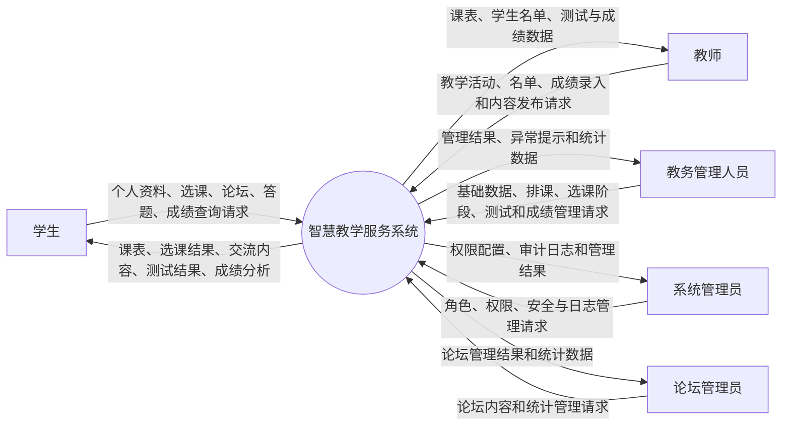
```mermaid
flowchart LR
  Student["学生"]
  Teacher["教师"]
  AcademicAdmin["教务管理人员"]
  SystemAdmin["系统管理员"]
  ForumAdmin["论坛管理员"]
  STSS(("智慧教学服务系统"))

  Student -->|"个人资料、选课、论坛、答题、成绩查询请求"| STSS
  STSS -->|"课表、选课结果、交流内容、测试结果、成绩分析"| Student
  Teacher -->|"教学活动、名单、成绩录入和内容发布请求"| STSS
  STSS -->|"课表、学生名单、测试与成绩数据"| Teacher
  AcademicAdmin -->|"基础数据、排课、选课阶段、测试和成绩管理请求"| STSS
  STSS -->|"管理结果、异常提示和统计数据"| AcademicAdmin
  SystemAdmin -->|"角色、权限、安全与日志管理请求"| STSS
  STSS -->|"权限配置、审计日志和管理结果"| SystemAdmin
  ForumAdmin -->|"论坛内容和统计管理请求"| STSS
  STSS -->|"论坛管理结果和统计数据"| ForumAdmin
```

### 6.2 0 层 DFD

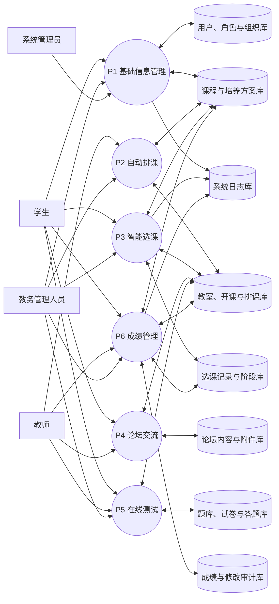
```mermaid
flowchart LR
  Student["学生"]
  Teacher["教师"]
  AcademicAdmin["教务管理人员"]
  SystemAdmin["系统管理员"]

  P1(("P1 基础信息管理"))
  P2(("P2 自动排课"))
  P3(("P3 智能选课"))
  P4(("P4 论坛交流"))
  P5(("P5 在线测试"))
  P6(("P6 成绩管理"))

  D1[("用户、角色与组织库")]
  D2[("课程与培养方案库")]
  D3[("教室、开课与排课库")]
  D4[("选课记录与阶段库")]
  D5[("论坛内容与附件库")]
  D6[("题库、试卷与答题库")]
  D7[("成绩与修改审计库")]
  D8[("系统日志库")]

  Student --> P1
  Student --> P3
  Student --> P4
  Student --> P5
  Student --> P6
  Teacher --> P2
  Teacher --> P4
  Teacher --> P5
  Teacher --> P6
  AcademicAdmin --> P1
  AcademicAdmin --> P2
  AcademicAdmin --> P3
  AcademicAdmin --> P5
  AcademicAdmin --> P6
  SystemAdmin --> P1

  P1 <--> D1
  P1 <--> D2
  P1 --> D8
  P2 <--> D2
  P2 <--> D3
  P3 <--> D2
  P3 <--> D3
  P3 <--> D4
  P3 --> D8
  P4 <--> D3
  P4 <--> D5
  P5 <--> D3
  P5 <--> D6
  P6 <--> D2
  P6 <--> D3
  P6 <--> D4
  P6 <--> D7
  P6 --> D8
```

### 6.3 A 基础信息管理 DFD

#### 6.3.1 A 组 1 层 DFD

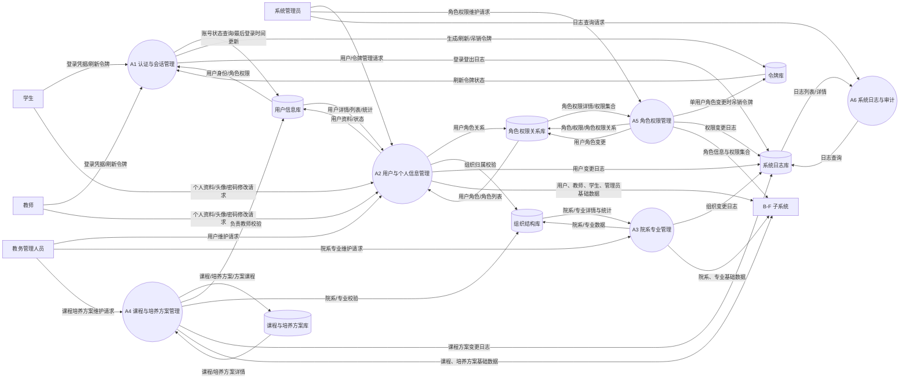
```mermaid
flowchart LR
  Student[学生]
  Teacher[教师]
  AcademicAdmin[教务管理人员]
  SysAdmin[系统管理员]

  P1((A1 认证与会话管理))
  P2((A2 用户与个人信息管理))
  P3((A3 院系专业管理))
  P4((A4 课程与培养方案管理))
  P5((A5 角色权限管理))
  P6((A6 系统日志与审计))

  D1[(用户信息库)]
  D2[(组织结构库)]
  D3[(课程与培养方案库)]
  D4[(角色权限关系库)]
  D5[(令牌库)]
  D6[(系统日志库)]

  Student -->|登录凭据/刷新令牌| P1
  Teacher -->|登录凭据/刷新令牌| P1
  Student -->|个人资料/头像/密码修改请求| P2
  Teacher -->|个人资料/头像/密码修改请求| P2
  AcademicAdmin -->|用户维护请求| P2
  AcademicAdmin -->|院系专业维护请求| P3
  AcademicAdmin -->|课程培养方案维护请求| P4
  SysAdmin -->|用户/令牌管理请求| P2
  SysAdmin -->|角色权限维护请求| P5
  SysAdmin -->|日志查询请求| P6

  P1 -->|账号状态查询/最后登录时间更新| D1
  D1 -->|用户身份/角色权限| P1
  P1 -->|生成/刷新/吊销令牌| D5
  D5 -->|刷新令牌状态| P1
  P1 -->|登录登出日志| D6

  P2 -->|用户资料/状态| D1
  D1 -->|用户详情/列表/统计| P2
  P2 -->|用户角色关系| D4
  D4 -->|用户角色/角色列表| P2
  P2 -->|组织归属校验| D2
  P2 -->|用户变更日志| D6

  P3 -->|院系/专业数据| D2
  D2 -->|院系/专业详情与统计| P3
  P3 -->|组织变更日志| D6

  P4 -->|课程/培养方案/方案课程| D3
  D3 -->|课程/培养方案详情| P4
  P4 -->|负责教师校验| D1
  P4 -->|院系/专业校验| D2
  P4 -->|课程方案变更日志| D6

  P5 -->|角色/权限/角色权限关系| D4
  D4 -->|角色权限详情/权限集合| P5
  P5 -->|用户角色变更| D4
  P5 -->|单用户角色变更时吊销令牌| D5
  P5 -->|权限变更日志| D6

  P6 -->|日志查询| D6
  D6 -->|日志列表/详情| P6

  P2 -->|用户、教师、学生、管理员基础数据| BtoF[B-F 子系统]
  P3 -->|院系、专业基础数据| BtoF
  P4 -->|课程、培养方案基础数据| BtoF
  P5 -->|角色信息与权限集合| BtoF
```

#### 6.3.2 A 组数据字典

| 数据项       | 来源                               | 去向                     | 说明                                                                                                   |
| ------------ | ---------------------------------- | ------------------------ | ------------------------------------------------------------------------------------------------------ |
| 用户信息     | 用户本人、教务管理人员、系统管理员 | A-F 子系统               | 用户名、姓名、邮箱、电话、头像、性别、状态、最后登录时间等                                             |
| 学生信息     | 教务管理人员                       | A、C、E、F               | 学号、专业、年级、班级等学生扩展信息                                                                   |
| 教师信息     | 教务管理人员                       | A、B、D、E、F            | 工号、院系、职称、办公地点等教师扩展信息                                                               |
| 管理员信息   | 系统管理员                         | A、B、C                  | 管理员类型、所属院系等管理身份信息                                                                     |
| 院系信息     | 教务管理人员                       | A、B、C、E               | 院系名称、代码、描述，以及关联专业、教师、课程统计                                                     |
| 专业信息     | 教务管理人员                       | A、C、F                  | 专业名称、代码、学位类型、总学分要求、所属院系                                                         |
| 课程信息     | 教务管理人员                       | A、B、C、D、E、F         | 课程代码、名称、学分、学时、类型、开课院系、负责教师、考核方式、先修课程、状态                         |
| 培养方案     | 教务管理人员                       | A、C、F                  | 适用专业、年份、总学分、必修学分、选修学分、课程清单、建议修读学期                                     |
| 角色信息     | 系统管理员                         | A-F 子系统               | 角色代码、名称、描述、是否内置、用户数量                                                               |
| 权限信息     | 系统管理员                         | A-F 子系统               | 权限代码、资源、动作、说明，用于角色能力配置和权限集合查询                                             |
| 会话令牌     | 系统                               | A                        | 访问令牌和刷新令牌状态、过期时间、吊销时间、IP、浏览器信息；支持查询和吊销，但吊销操作当前不写系统日志 |
| 激活令牌     | 系统                               | A                        | 注册激活流程的令牌、过期时间和使用状态；接口文档标注为废弃，不作为核心验收                             |
| 密码重置令牌 | 系统                               | A                        | 忘记密码流程中的重置凭据、过期时间和使用状态                                                           |
| 课程先修关系 | 教务管理人员                       | A、B、C、E、F            | 课程与其先修课程的关联，供选课约束、课程展示和学习路径使用                                             |
| 系统日志     | A 子系统各处理过程                 | 系统管理员、教务管理人员 | 操作用户、操作类型、资源类型、资源标识、IP、用户代理、详情、时间                                       |

### 6.4 B 自动排课 DFD

#### 6.4.1 B 组 1 层 DFD

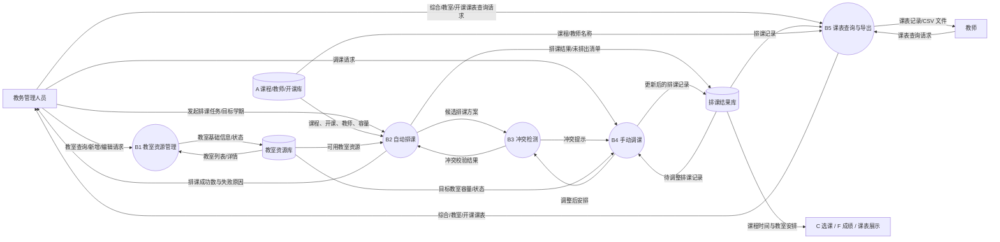
```mermaid
flowchart LR
  AcademicAdmin[教务管理人员]
  Teacher[教师]

  P1((B1 教室资源管理))
  P2((B2 自动排课))
  P3((B3 冲突检测))
  P4((B4 手动调课))
  P5((B5 课表查询与导出))

  D1[(教室资源库)]
  D2[(排课结果库)]
  AInfo[(A 课程/教师/开课库)]

  AcademicAdmin -->|教室查询/新增/编辑请求| P1
  P1 -->|教室基础信息/状态| D1
  D1 -->|教室列表/详情| P1

  AcademicAdmin -->|发起排课任务/目标学期| P2
  AInfo -->|课程、开课、教师、容量| P2
  D1 -->|可用教室资源| P2
  P2 -->|候选排课方案| P3
  P3 -->|冲突校验结果| P2
  P2 -->|排课结果/未排出清单| D2
  P2 -->|排课成功数与失败原因| AcademicAdmin

  AcademicAdmin -->|调课请求| P4
  D2 -->|待调整排课记录| P4
  P4 -->|调整后安排| P3
  P3 -->|冲突提示| P4
  D1 -->|目标教室容量/状态| P4
  P4 -->|更新后的排课记录| D2

  Teacher -->|课表查询请求| P5
  AcademicAdmin -->|综合/教室/开课课表查询请求| P5
  D2 -->|排课记录| P5
  AInfo -->|课程/教师名称| P5
  P5 -->|课表记录/CSV 文件| Teacher
  P5 -->|综合/教室/开课课表| AcademicAdmin

  D2 -->|课程时间与教室安排| CtoF[C 选课 / F 成绩 / 课表展示]
```

#### 6.4.2 B 组数据字典

| 数据项         | 来源                 | 去向                           | 说明                                                       |
| -------------- | -------------------- | ------------------------------ | ---------------------------------------------------------- |
| 教室资源       | 教务管理人员         | B 自动排课、手动调课、课表查询 | 教学楼、房间号、校区、容量、教室类型、设备清单、可用状态   |
| 课程与开课信息 | A 基础信息管理       | B 自动排课、课表查询           | 课程、开课、负责教师、选课容量，作为排课输入               |
| 教师信息       | A 基础信息管理       | B 自动排课、冲突检测           | 教师身份和授课关系，用于教师时间冲突检测                   |
| 排课任务       | 教务管理人员         | B 自动排课                     | 目标学期、待排开课范围、可选约束参数                       |
| 候选排课方案   | B 自动排课           | 冲突检测                       | 拟分配的星期、起止周次、起止节次和教室                     |
| 冲突校验结果   | 冲突检测             | 自动排课、手动调课             | 教室占用、任务内教师/教室候选冲突、容量/状态不匹配的判定结果 |
| 排课结果       | B 自动排课、手动调课 | C 选课、F 成绩、课表展示       | 每条开课的星期、起止周次、起止节次、教室及备注             |
| 调课请求       | 教务管理人员         | 手动调课                       | 待调整排课记录及目标星期、周次、节次或教室                 |
| 课表视图       | 课表查询与导出       | 教师、教务管理人员             | 按综合、教室或开课维度组织的课程、教师、教室、周次只读视图与 CSV 导出 |

### 6.5 C 智能选课 DFD

#### 6.5.1 C 组 1 层 DFD

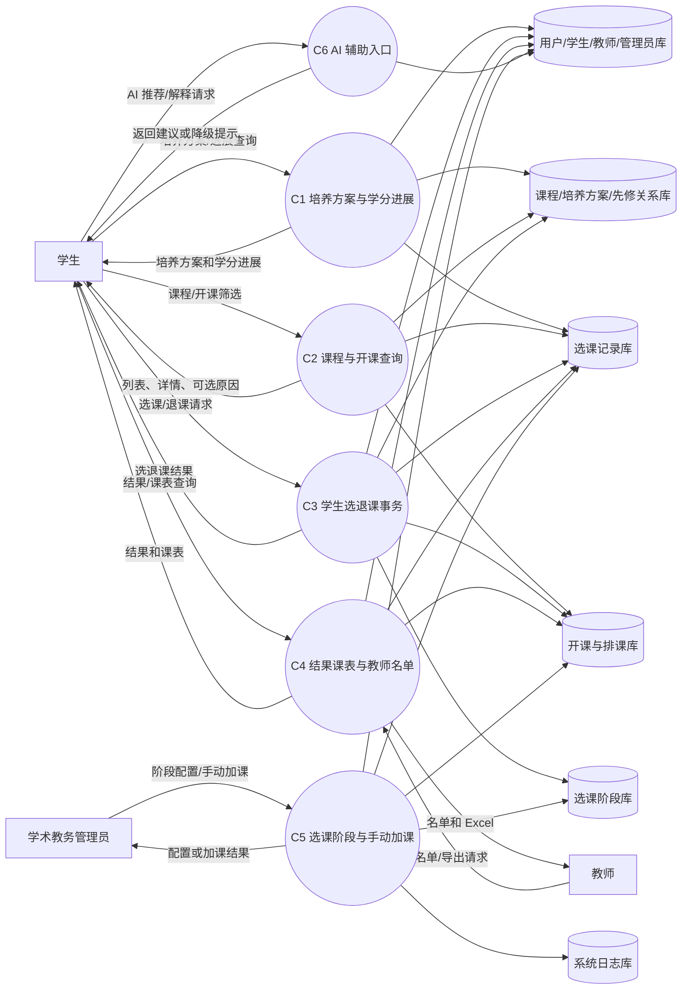
```mermaid
flowchart LR
  Student[学生]
  Teacher[教师]
  AcademicAdmin[学术教务管理员]

  P1((C1 培养方案与学分进展))
  P2((C2 课程与开课查询))
  P3((C3 学生选退课事务))
  P4((C4 结果课表与教师名单))
  P5((C5 选课阶段与手动加课))
  P6((C6 AI 辅助入口))

  AUser[(用户/学生/教师/管理员库)]
  ACourse[(课程/培养方案/先修关系库)]
  D1[(开课与排课库)]
  D2[(选课记录库)]
  D3[(选课阶段库)]
  D4[(系统日志库)]

  Student -->|培养方案/进展查询| P1
  P1 --> AUser
  P1 --> ACourse
  P1 --> D2
  P1 -->|培养方案和学分进展| Student

  Student -->|课程/开课筛选| P2
  P2 --> ACourse
  P2 --> D1
  P2 --> D2
  P2 -->|列表、详情、可选原因| Student

  Student -->|选课/退课请求| P3
  P3 --> AUser
  P3 --> D3
  P3 --> ACourse
  P3 --> D1
  P3 --> D2
  P3 -->|选退课结果| Student

  Student -->|结果/课表查询| P4
  Teacher -->|名单/导出请求| P4
  P4 --> AUser
  P4 --> D2
  P4 --> D1
  P4 -->|结果和课表| Student
  P4 -->|名单和 Excel| Teacher

  AcademicAdmin -->|阶段配置/手动加课| P5
  P5 --> AUser
  P5 --> D3
  P5 --> D1
  P5 --> D2
  P5 --> D4
  P5 -->|配置或加课结果| AcademicAdmin

  Student -->|AI 推荐/解释请求| P6
  P6 --> AUser
  P6 -->|返回建议或降级提示| Student
```

#### 6.5.2 C 组数据字典

| 数据项             | 来源           | 去向                         | 说明                                                         |
| ------------------ | -------------- | ---------------------------- | ------------------------------------------------------------ |
| 学生档案           | A 子系统       | C1、C2、C3、C4               | 当前登录学生的专业、年级等身份数据                           |
| 教师档案           | A 子系统       | C4                           | 教师名单权限校验                                             |
| 学术教务管理员身份 | A 子系统       | C5                           | 阶段管理和手动加课权限校验                                   |
| 课程信息           | A 子系统       | C1、C2、C3、C5               | 课程代码、名称、学分、类型、状态                             |
| 课程先修关系       | A 子系统       | C2、C3                       | 详情展示和选课限制                                           |
| 培养方案           | A 子系统       | C1、C2、C3                   | 专业、年份、学分要求、方案课程                               |
| 课程开设           | C 子系统       | C2、C3、C4、C5               | 学期、教师、容量、已选人数、开课状态                         |
| 排课时间           | B/C 相关数据   | C2、C3、C4                   | 时间地点、冲突检测和课表展示                                 |
| 选课阶段           | C 子系统       | C3、C5                       | 阶段、时间窗口、最大学分、启用状态                           |
| 选课记录           | C 子系统       | C1、C2、C3、C4、C5、F 子系统 | 学生与开课关系，状态为 `ENROLLED`、`DROPPED`、`WITHDRAWN`    |
| 可选性原因         | C2             | 学生端课程页面               | 满员、已选、冲突、未开放、不在培养方案内等原因               |
| 手动加课请求       | 学术教务管理员 | C5                           | 学生、开课、原因和可选通知标记                               |
| 教师名单导出文件   | C4             | 教师                         | 本人开课名单 Excel                                           |
| AI 请求            | 学生           | C6                           | 返回推荐或解释 payload，含 `degradedMode`；不写 `Enrollment` |
| 系统日志           | C5             | 审计查询                     | 阶段配置和手动加课审计记录                                   |

### 6.6 D 论坛交流 DFD

#### 6.6.1 D 组 1 层 DFD

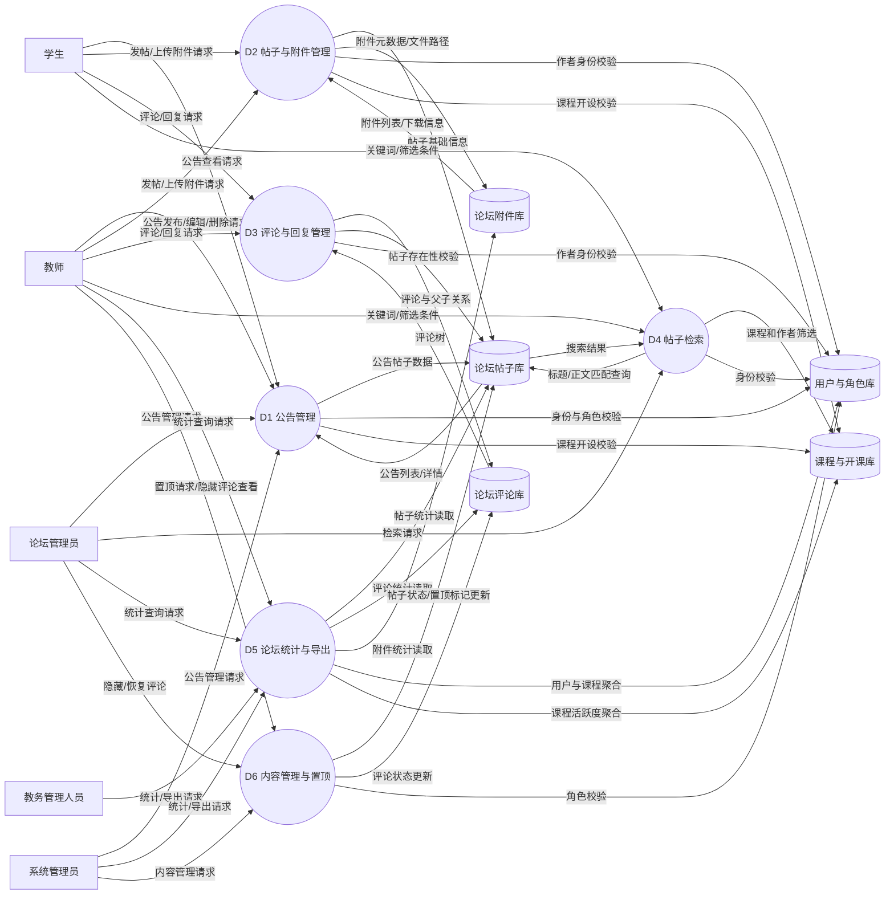
```mermaid
flowchart LR
  Student[学生]
  Teacher[教师]
  ForumAdmin[论坛管理员]
  AcademicAdmin[教务管理人员]
  SysAdmin[系统管理员]

  P1((D1 公告管理))
  P2((D2 帖子与附件管理))
  P3((D3 评论与回复管理))
  P4((D4 帖子检索))
  P5((D5 论坛统计与导出))
  P6((D6 内容管理与置顶))

  S1[(论坛帖子库)]
  S2[(论坛评论库)]
  S3[(论坛附件库)]
  AUser[(用户与角色库)]
  ACourse[(课程与开课库)]

  Teacher -->|公告发布/编辑/删除请求| P1
  ForumAdmin -->|公告管理请求| P1
  SysAdmin -->|公告管理请求| P1
  Student -->|公告查看请求| P1
  P1 -->|公告帖子数据| S1
  S1 -->|公告列表/详情| P1
  P1 -->|身份与角色校验| AUser
  P1 -->|课程开设校验| ACourse

  Student -->|发帖/上传附件请求| P2
  Teacher -->|发帖/上传附件请求| P2
  P2 -->|帖子基础信息| S1
  P2 -->|附件元数据/文件路径| S3
  S3 -->|附件列表/下载信息| P2
  P2 -->|作者身份校验| AUser
  P2 -->|课程开设校验| ACourse

  Student -->|评论/回复请求| P3
  Teacher -->|评论/回复请求| P3
  P3 -->|评论与父子关系| S2
  S2 -->|评论树| P3
  P3 -->|帖子存在性校验| S1
  P3 -->|作者身份校验| AUser

  Student -->|关键词/筛选条件| P4
  Teacher -->|关键词/筛选条件| P4
  ForumAdmin -->|检索请求| P4
  P4 -->|标题/正文匹配查询| S1
  S1 -->|搜索结果| P4
  P4 -->|课程和作者筛选| ACourse
  P4 -->|身份校验| AUser

  Teacher -->|统计查询请求| P5
  ForumAdmin -->|统计查询请求| P5
  AcademicAdmin -->|统计/导出请求| P5
  SysAdmin -->|统计/导出请求| P5
  P5 -->|帖子统计读取| S1
  P5 -->|评论统计读取| S2
  P5 -->|附件统计读取| S3
  P5 -->|用户与课程聚合| AUser
  P5 -->|课程活跃度聚合| ACourse

  ForumAdmin -->|隐藏/恢复评论| P6
  Teacher -->|置顶请求/隐藏评论查看| P6
  SysAdmin -->|内容管理请求| P6
  P6 -->|帖子状态/置顶标记更新| S1
  P6 -->|评论状态更新| S2
  P6 -->|角色校验| AUser
```

#### 6.6.2 D 组数据字典

| 数据项         | 来源                                       | 去向                           | 说明                                                                                       |
| -------------- | ------------------------------------------ | ------------------------------ | ------------------------------------------------------------------------------------------ |
| 论坛帖子       | 学生、教师、论坛管理员                     | D 子系统、搜索、统计           | 标题、正文、帖子类型、课程开设、作者、置顶标记、公告标记、浏览量、状态、创建/更新时间      |
| 论坛公告       | 教师、论坛管理员、系统管理员               | 学生、教师、课程论坛首页       | 以公告标记保存的课程帖子，包含标题、正文、课程开设、发布者、置顶标记和发布时间             |
| 论坛评论       | 学生、教师                                 | D 子系统、帖子详情、统计       | 评论正文、作者、帖子、父评论、深度、状态和创建时间；支持树形回复                           |
| 论坛附件       | 学生、教师                                 | 帖子详情、附件下载、统计       | 文件名、文件路径、文件大小、文件类型、上传时间和可选帖子关联；上传后可绑定到帖子           |
| 搜索条件       | 学生、教师、论坛管理员                     | 帖子检索                       | 关键词、课程开设、作者、帖子类型、时间范围、分页和排序方式                                 |
| 统计条件       | 教师、论坛管理员、教务管理人员、系统管理员 | 论坛统计                       | 开始时间、结束时间、周期、课程开设和导出范围                                               |
| 热帖统计结果   | 帖子、评论、浏览量                         | 学生、教师、管理人员           | 按周或月统计的热门帖子，包含标题、作者、课程、浏览量、评论数和热度分数                     |
| 课程活跃度结果 | 帖子、评论、用户、课程                     | 教师、教务管理人员、系统管理员 | 课程名称、课程代码、教师、帖子数、评论数、参与人数、独立发帖人数、独立评论人数和活跃度分数 |
| 用户与角色信息 | A 子系统                                   | D 子系统                       | 用户身份、角色、姓名和头像；用于发帖、评论、权限校验和展示作者信息                         |
| 课程与开课信息 | A/C 子系统                                 | D 子系统                       | 课程名称、课程代码、教师和开课记录；用于限定课程论坛上下文                                 |

### 6.7 E 在线测试 DFD

#### 6.7.1 E 组 1 层 DFD

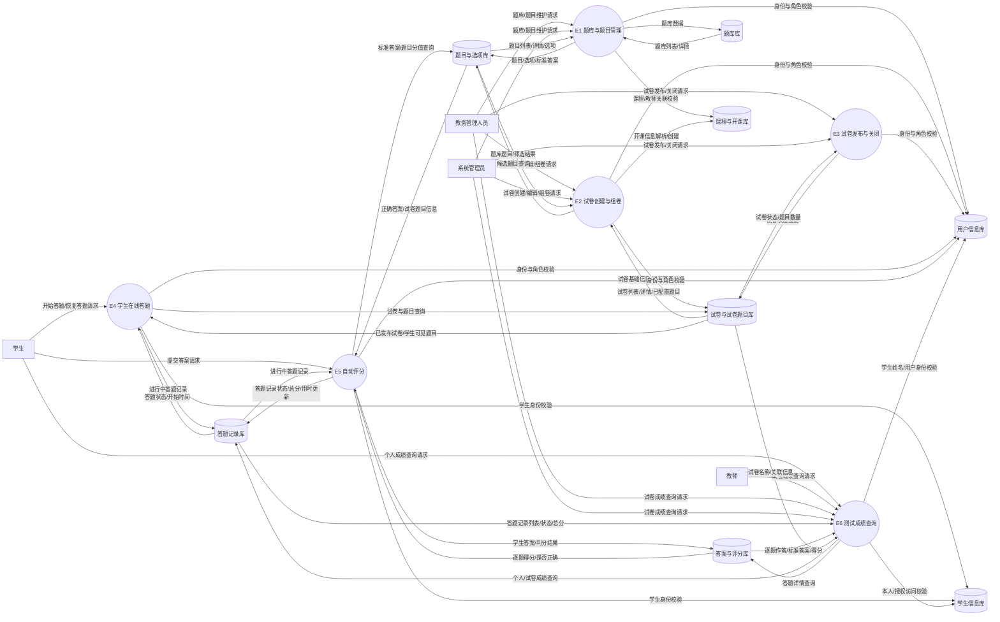
```mermaid
flowchart LR
  Student[学生]
  Teacher[教师]
  AcademicAdmin[教务管理人员]
  SysAdmin[系统管理员]

  P1((E1 题库与题目管理))
  P2((E2 试卷创建与组卷))
  P3((E3 试卷发布与关闭))
  P4((E4 学生在线答题))
  P5((E5 自动评分))
  P6((E6 测试成绩查询))

  D1[(题库库)]
  D2[(题目与选项库)]
  D3[(试卷与试卷题目库)]
  D4[(答题记录库)]
  D5[(答案与评分库)]

  AUser[(用户信息库)]
  AStudent[(学生信息库)]
  ACourse[(课程与开课库)]

  AcademicAdmin -->|题库/题目维护请求| P1
  SysAdmin -->|题库/题目维护请求| P1
  AcademicAdmin -->|试卷创建/编辑/组卷请求| P2
  SysAdmin -->|试卷创建/编辑/组卷请求| P2
  AcademicAdmin -->|试卷发布/关闭请求| P3
  SysAdmin -->|试卷发布/关闭请求| P3
  Student -->|开始答题/恢复答题请求| P4
  Student -->|提交答案请求| P5
  Student -->|个人成绩查询请求| P6
  Teacher -->|试卷成绩查询请求| P6
  AcademicAdmin -->|试卷成绩查询请求| P6
  SysAdmin -->|试卷成绩查询请求| P6

  P1 -->|题库数据| D1
  D1 -->|题库列表/详情| P1
  P1 -->|题目/选项/标准答案| D2
  D2 -->|题目列表/详情/选项| P1
  P1 -->|课程/教师关联校验| ACourse
  P1 -->|身份与角色校验| AUser

  P2 -->|试卷基础信息/试卷题目关系| D3
  D3 -->|试卷列表/详情/已配置题目| P2
  P2 -->|候选题目查询| D2
  D2 -->|题库题目/筛选结果| P2
  P2 -->|开课信息解析/创建| ACourse
  P2 -->|身份与角色校验| AUser

  P3 -->|试卷状态变更| D3
  D3 -->|试卷状态/题目数量| P3
  P3 -->|身份与角色校验| AUser

  P4 -->|进行中答题记录| D4
  D4 -->|答题状态/开始时间| P4
  P4 -->|试卷与题目查询| D3
  D3 -->|已发布试卷/学生可见题目| P4
  P4 -->|学生身份校验| AStudent
  P4 -->|身份与角色校验| AUser

  P5 -->|学生答案/判分结果| D5
  D5 -->|逐题得分/是否正确| P5
  P5 -->|标准答案/题目分值查询| D2
  D2 -->|正确答案/试卷题目信息| P5
  P5 -->|答题记录状态/总分/用时更新| D4
  D4 -->|进行中答题记录| P5
  P5 -->|学生身份校验| AStudent
  P5 -->|身份与角色校验| AUser

  P6 -->|个人/试卷成绩查询| D4
  D4 -->|答题记录列表/状态/总分| P6
  P6 -->|答题详情查询| D5
  D5 -->|逐题作答/标准答案/得分| P6
  P6 -->|学生姓名/用户身份校验| AUser
  P6 -->|本人/授权访问校验| AStudent
  D3 -->|试卷名称/关联信息| P6
```

#### 6.7.2 E 组数据字典

| 数据项         | 来源                         | 去向                           | 说明                                                                                       |
| -------------- | ---------------------------- | ------------------------------ | ------------------------------------------------------------------------------------------ |
| 题库信息       | 教务管理人员、系统管理员     | E 子系统                       | 题库名称、描述、状态、所属课程、创建者、题目数量等                                         |
| 题目信息       | 教务管理人员、系统管理员     | E 子系统                       | 题干、题型、标准答案、默认分值、难度、知识点、解析、所属题库、创建/更新时间                |
| 题目选项       | 教务管理人员、系统管理员     | E 子系统                       | 选项文本、选项顺序、是否正确；学生答题过程中仅返回选项内容，不返回正确标记                 |
| 试卷信息       | 教务管理人员、系统管理员     | E 子系统、F 子系统             | 标题、说明、总分、考试时长、开始/结束时间、是否随机组卷、状态、关联开课、创建者、题目数量  |
| 试卷题目关系   | 教务管理人员、系统管理员     | E 子系统                       | 试卷与题目的关联、题号、该题分值；支持手动加入、自动抽题和移除                             |
| 答题记录       | 学生、系统                   | E 子系统、F 子系统             | 学生、试卷、开始时间、提交时间、总分、状态、用时；每位学生对同一试卷仅保留一条有效测试记录 |
| 学生答案       | 学生                         | E 子系统                       | 学生在某次测试中对每道题提交的作答内容                                                     |
| 评分结果       | 系统                         | E 子系统、F 子系统             | 每题是否正确、得分、汇总总分、正确题数、用时；交卷后生成                                   |
| 个人测试成绩   | 答题记录、评分结果           | 学生                           | 按时间展示本人历史测试记录及单次逐题详情                                                   |
| 试卷测试成绩   | 答题记录、评分结果、用户信息 | 教师、教务管理人员、系统管理员 | 按试卷展示参与测试学生列表及单次答题详情，支持列表与逐题明细核对                           |
| 课程与开课信息 | A 子系统                     | E 子系统                       | 课程、教师、学期、开课记录；供题库关联、试卷创建和发布时使用                               |
| 学生身份信息   | A 子系统                     | E 子系统                       | 学生档案、姓名、角色；供开始答题、提交评分和成绩查询时使用                                 |
| 访问令牌       | A 子系统                     | E 子系统                       | 统一认证凭据；在线测试子系统通过 A 子系统完成身份与角色校验                                |

### 6.8 F 成绩管理 DFD

#### 6.8.1 F 组 1 层 DFD

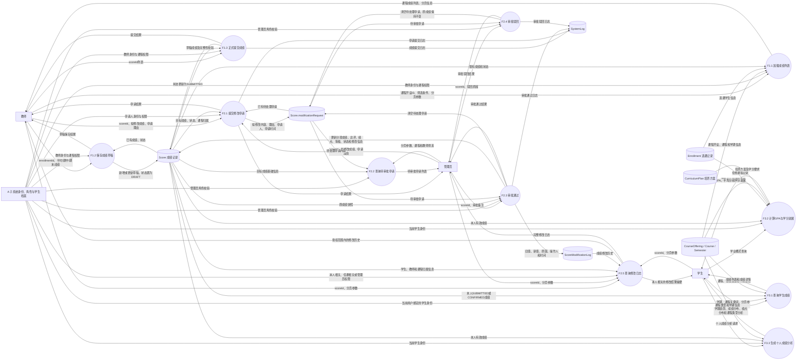
```mermaid
flowchart LR
  Teacher[教师]
  Admin[管理员]
  Student[学生]
  Auth[A 子系统身份、角色与学生档案]

  P11((F1.1 加载成绩列表))
  P12((F1.2 保存成绩草稿))
  P13((F1.3 正式提交成绩))

  P21((F2.1 提交修改申请))
  P22((F2.2 查询待审批申请))
  P23((F2.3 审批通过))
  P24((F2.4 审批驳回))
  P25((F2.5 查询修改日志))

  P31((F3.1 查询学生成绩))
  P32((F3.2 计算GPA与学分进展))
  P33((F3.3 生成个人成绩分析))

  DS1[(Score 成绩记录)]
  DS2[(Enrollment 选课记录)]
  DS3[(CourseOffering / Course / Semester)]
  DS4[(Score.modificationRequest)]
  DS5[(ScoreModificationLog)]
  DS6[(SystemLog)]
  DS7[(CurriculumPlan 培养方案)]

  Teacher -->|课程开设ID、筛选条件、分页参数| P11
  Auth -->|教师身份与课程权限| P11
  DS3 -->|课程开设、课程和学期信息| P11
  DS2 -->|选课学生信息| P11
  DS1 -->|现有成绩和状态| P11
  P11 -->|课程成绩列表、分页信息| Teacher

  Teacher -->|enrollmentId、平时/期中/期末成绩| P12
  Auth -->|教师身份与课程权限| P12
  DS1 -->|已有成绩、状态| P12
  P12 -->|新增或更新草稿，状态置为DRAFT| DS1
  P12 -->|草稿保存结果| Teacher

  Teacher -->|scoreId列表| P13
  Auth -->|教师身份与课程权限| P13
  DS1 -->|草稿成绩及完整性校验| P13
  P13 -->|状态更新为SUBMITTED| DS1
  P13 -->|成绩提交日志| DS6
  P13 -->|提交结果| Teacher

  Teacher -->|scoreId、拟修改成绩、申请理由| P21
  Admin -->|scoreId、拟修改成绩、申请理由| P21
  Auth -->|申请人身份与权限| P21
  DS1 -->|目标成绩、状态、课程归属| P21
  DS4 -->|已有待处理申请| P21
  P21 -->|拟修改内容、理由、申请人、申请时间| DS4
  P21 -->|申请提交日志| DS6
  P21 -->|申请结果| Teacher
  P21 -->|申请结果| Admin

  Admin -->|分页参数、课程和教师筛选| P22
  Auth -->|管理员角色校验| P22
  DS1 -->|目标成绩基础信息| P22
  DS4 -->|待处理申请内容| P22
  P22 -->|待审批申请列表| Admin

  Admin -->|scoreId、审批备注| P23
  Auth -->|管理员角色校验| P23
  DS1 -->|原成绩快照| P23
  DS4 -->|待审批申请| P23
  P23 -->|更新分项成绩、总评、绩点、等级、状态和修改信息| DS1
  P23 -->|清空待处理申请| DS4
  P23 -->|旧值、新值、原因、操作人和时间| DS5
  P23 -->|审批通过日志| DS6
  P23 -->|审批通过结果| Admin

  Admin -->|scoreId、驳回原因| P24
  Auth -->|管理员角色校验| P24
  DS4 -->|待审批申请| P24
  P24 -->|清空待处理申请，原成绩保持不变| DS4
  P24 -->|审批驳回日志| DS6
  P24 -->|审批驳回结果| Admin

  Teacher -->|scoreId、分页参数| P25
  Student -->|scoreId、分页参数| P25
  Admin -->|scoreId、分页参数| P25
  Auth -->|本人相关、任课相关或管理员权限| P25
  DS1 -->|学生、教师和课程归属信息| P25
  DS5 -->|成绩修改历史| P25
  P25 -->|授权范围内的修改历史| Teacher
  P25 -->|本人相关的修改结果摘要| Student
  P25 -->|完整修改日志| Admin

  Student -->|学期、课程关键词、分页参数| P31
  Auth -->|当前用户绑定的学生身份| P31
  DS1 -->|本人SUBMITTED或CONFIRMED成绩| P31
  DS3 -->|课程、课程类型和学期信息| P31
  P31 -->|成绩列表和成绩详情| Student

  Student -->|学业概况查询| P32
  Auth -->|当前学生身份| P32
  DS1 -->|本人有效成绩| P32
  DS2 -->|在修课程记录| P32
  DS3 -->|课程学分和课程类型| P32
  DS7 -->|培养方案及学分要求| P32
  P32 -->|GPA、平均分和学分进展| Student

  Student -->|个人成绩分析请求| P33
  Auth -->|当前学生身份| P33
  DS1 -->|本人有效成绩| P33
  DS3 -->|课程类型和学期信息| P33
  P33 -->|学期趋势、成绩分布、绩点分布和课程类型分析| Student
```

#### 6.8.2 F 组数据字典

| 数据项           | 所属子系统 | 来源                              | 去向                | 说明                                                                           |
| ---------------- | ---------- | --------------------------------- | ------------------- | ------------------------------------------------------------------------------ |
| 课程成绩列表请求 | F          | 教师                              | F1.1                | 包含课程开设 ID、关键字、成绩状态、页码和每页数量                              |
| 课程成绩列表     | F          | Score、Enrollment、CourseOffering | 教师                | 包含学生信息、成绩构成、总评、绩点、等级、状态、录入时间和修改时间             |
| 草稿成绩输入     | F          | 教师                              | F1.2                | 包含 enrollmentId 和平时、期中、期末成绩，用于新增或更新 `DRAFT` 成绩          |
| 成绩提交请求     | F          | 教师                              | F1.3                | 包含待正式提交的 scoreId 列表                                                  |
| 修改申请         | F          | 教师、管理员                      | F2.1                | 包含目标成绩标识、拟修改分项成绩、申请理由、申请人和申请时间                   |
| 待审批申请列表   | F          | Score、Score.modificationRequest  | 管理员              | 包含申请内容、申请人、目标成绩、课程和任课教师信息                             |
| 修改审批结果     | F          | 管理员                            | F2.3、F2.4          | 包括审批通过或驳回、审批备注或驳回原因                                         |
| 成绩修改日志     | F          | F2.3                              | 教师、学生、管理员  | 记录审批通过后的旧值、新值、修改原因、修改人和时间；不同角色看到的字段范围不同 |
| 系统日志         | F          | F1、F2                            | 管理员、审计查询    | 记录成绩提交、申请提交、审批通过和审批驳回等敏感操作                           |
| 成绩查询请求     | F          | 学生                              | F3.1                | 包含学期、课程代码或名称关键字、页码和每页数量                                 |
| 可见成绩数据     | F          | Score                             | F3.1、F3.2、F3.3    | 当前学生状态为 `SUBMITTED` 或 `CONFIRMED` 的成绩                               |
| 有效成绩         | F          | F3.2、F3.3                        | GPA、学分和分析计算 | 同一课程存在多条可见成绩时，按照最高总评及最近修改时间规则选择的统计记录       |
| 学业概况         | F          | F3.2                              | 学生                | 包含 GPA、平均分、通过课程数、不及格课程数、已获学分、在修学分和剩余学分       |
| 培养方案进度     | F          | F3.2                              | 学生                | 包含总学分、必修学分、选修学分、已完成学分、课程完成数量和完成率               |
| 个人成绩分析     | F          | F3.3                              | 学生                | 包含学期趋势、成绩区间分布、绩点分布和课程类型分析                             |

#### 6.8.3 F3 查询、GPA 与统计分析 DFD

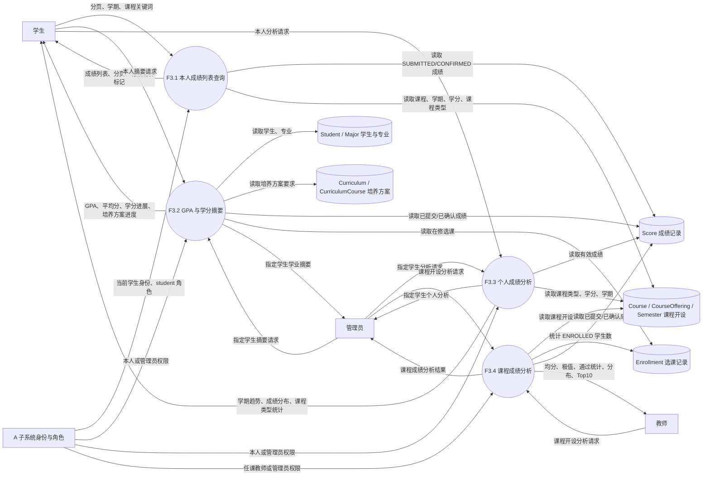
```mermaid
flowchart LR
  Student[学生]
  Teacher[教师]
  Admin[管理员]
  Auth[A 子系统身份与角色]

  P1((F3.1 本人成绩列表查询))
  P2((F3.2 GPA 与学分摘要))
  P3((F3.3 个人成绩分析))
  P4((F3.4 课程成绩分析))

  D1[(Score 成绩记录)]
  D2[(Enrollment 选课记录)]
  D3[(Course / CourseOffering / Semester 课程开设)]
  D4[(Student / Major 学生与专业)]
  D5[(Curriculum / CurriculumCourse 培养方案)]

  Student -->|分页、学期、课程关键词| P1
  Auth -->|当前学生身份、student 角色| P1
  P1 -->|读取 SUBMITTED/CONFIRMED 成绩| D1
  P1 -->|读取课程、学期、学分、课程类型| D3
  P1 -->|成绩列表、分页、有效成绩标记| Student

  Student -->|本人摘要请求| P2
  Admin -->|指定学生摘要请求| P2
  Auth -->|本人或管理员权限| P2
  P2 -->|读取学生、专业| D4
  P2 -->|读取培养方案要求| D5
  P2 -->|读取已提交/已确认成绩| D1
  P2 -->|读取在修选课| D2
  P2 -->|GPA、平均分、学分进展、培养方案进度| Student
  P2 -->|指定学生学业摘要| Admin

  Student -->|本人分析请求| P3
  Admin -->|指定学生分析请求| P3
  Auth -->|本人或管理员权限| P3
  P3 -->|读取有效成绩| D1
  P3 -->|读取课程类型、学分、学期| D3
  P3 -->|学期趋势、成绩分布、课程类型统计| Student
  P3 -->|指定学生个人分析| Admin

  Teacher -->|课程开设分析请求| P4
  Admin -->|课程开设分析请求| P4
  Auth -->|任课教师或管理员权限| P4
  P4 -->|读取课程开设、任课教师| D3
  P4 -->|统计 ENROLLED 学生数| D2
  P4 -->|读取已提交/已确认成绩| D1
  P4 -->|均分、极值、通过统计、分布、Top10| Teacher
  P4 -->|课程成绩分析结果| Admin
```

#### 6.8.4 F3 数据字典

| 数据项         | 所属子系统 | 来源                                               | 去向                             | 说明                                                                                                                                                                         |
| -------------- | ---------- | -------------------------------------------------- | -------------------------------- | ---------------------------------------------------------------------------------------------------------------------------------------------------------------------------- |
| 可见课程成绩   | F3         | `Score`、`CourseOffering`、`Course`、`Semester`    | 学生                             | 仅包含当前学生本人且状态为 `SUBMITTED` 或 `CONFIRMED` 的成绩，展示课程代码、课程名称、学期、学分、课程类型、分项成绩、总评、绩点、等级、状态、待处理改分标记和是否为有效成绩 |
| 有效成绩       | F3         | 可见课程成绩                                       | GPA 摘要、个人分析、培养方案进度 | 同一学生同一课程多条成绩时，取总评最高的记录；总评相同时取最近修改或录入的记录；总评为空的记录不参与 GPA、均分和学分统计                                                     |
| GPA 与学业摘要 | F3         | 有效成绩、课程学分、学生档案                       | 学生、管理员                     | 包括累计 GPA、平均分、已获学分、通过学分、在修学分、剩余应修学分、通过课程数和不及格课程数                                                                                   |
| 培养方案进度   | F3         | `Curriculum`、`CurriculumCourse`、有效成绩         | 学生、管理员                     | 包括培养方案名称、总学分要求、必修/选修学分要求、已完成培养方案学分、必修/选修完成学分、培养方案课程完成数量和完成率                                                         |
| 个人成绩分析   | F3         | 有效成绩、课程类型、学期                           | 学生、管理员                     | 包括学期 GPA/均分/获得学分趋势、五档成绩分布、按课程类型统计的已获学分和平均分                                                                                               |
| 课程成绩分析   | F3         | `CourseOffering`、`Enrollment`、`Score`、`Student` | 任课教师、管理员                 | 包括课程学生总数、已提交人数、平均分、最高分、最低分、通过人数、未通过人数、五档成绩分布和总评 Top10 排名                                                                    |

### 6.9 数据字典

| 数据项             | 所属子系统 | 来源                               | 去向                     | 说明                                                                             |
| ------------------ | ---------- | ---------------------------------- | ------------------------ | -------------------------------------------------------------------------------- |
| 用户与角色信息     | A          | 用户、教务管理人员、系统管理员     | A-F 各子系统             | 包含用户身份、学生/教师/管理员档案、角色、权限和账号状态，用于认证与访问控制。   |
| 组织与课程信息     | A          | 教务管理人员                       | B-F 子系统               | 包含院系、专业、课程、先修关系、课程类型和培养方案，是业务引用与规则判断的基础。 |
| 课程开设           | B          | 教务管理人员、课程信息             | C、D、E、F               | 某课程在指定学期的教学班，包含任课教师、容量和开课状态。                         |
| 教室与排课记录     | B          | 教室资源、课程开设、自动或手动排课 | B、C、D、E、F            | 包含教室、星期、周次、节次和排课状态，用于冲突检测、课表展示和教学活动关联。     |
| 选课阶段           | C          | 学术教务管理员                     | C                        | 包含选课时间窗口、阶段类型、最大学分和启用状态，用于控制选课与退课。             |
| 选课记录           | C          | 学生、课程开设、选课阶段           | C、F                     | 描述学生与课程开设的关系，状态包括 `ENROLLED`、`DROPPED` 和 `WITHDRAWN`。        |
| 论坛帖子与评论     | D          | 学生、教师、论坛管理员             | D                        | 包含公告、普通帖子、评论、作者、课程开设引用、可见状态和互动统计。               |
| 论坛附件           | D          | 发帖用户                           | D                        | 附属于论坛帖子的受控文件元数据与存储引用。                                       |
| 题库与题目         | E          | 教务管理人员、系统管理员           | E                        | 包含题库、题干、题型、选项、正确答案、分值、难度和知识点。                       |
| 试卷与试卷题目     | E          | 教务管理人员、系统管理员、题库     | E                        | 包含试卷状态、考试时间、试卷题目和每题分值，用于发布、答题和评分。               |
| 测试记录与答案     | E          | 学生、试卷                         | E                        | 保存一次学生作答的状态、用时、提交时间、逐题答案、判分结果和总分。               |
| 成绩记录           | F          | 教师、管理员、选课记录             | F                        | 一条选课对应的分项成绩、总评、绩点、等级和成绩状态。                             |
| 成绩修改申请与日志 | F          | 教师、管理员、审批流程             | F、系统日志              | 保存拟修改内容、申请理由、审批结果及修改前后差异，支撑成绩修改审计。             |
| 有效成绩与学业概况 | F          | 成绩记录、课程、培养方案、选课记录 | 学生、管理员             | 用于 GPA、已获学分、培养方案进度、个人趋势和课程成绩分析。                       |
| 系统日志           | A          | 认证与各子系统敏感操作             | 系统管理员、教务管理人员 | 记录操作人、资源、时间、请求信息和业务详情，用于审计与问题追踪。                 |

---

## 7. 状态图 / State Diagrams

### 7.1 A 基础信息管理状态图

#### 7.1.1 用户账号状态

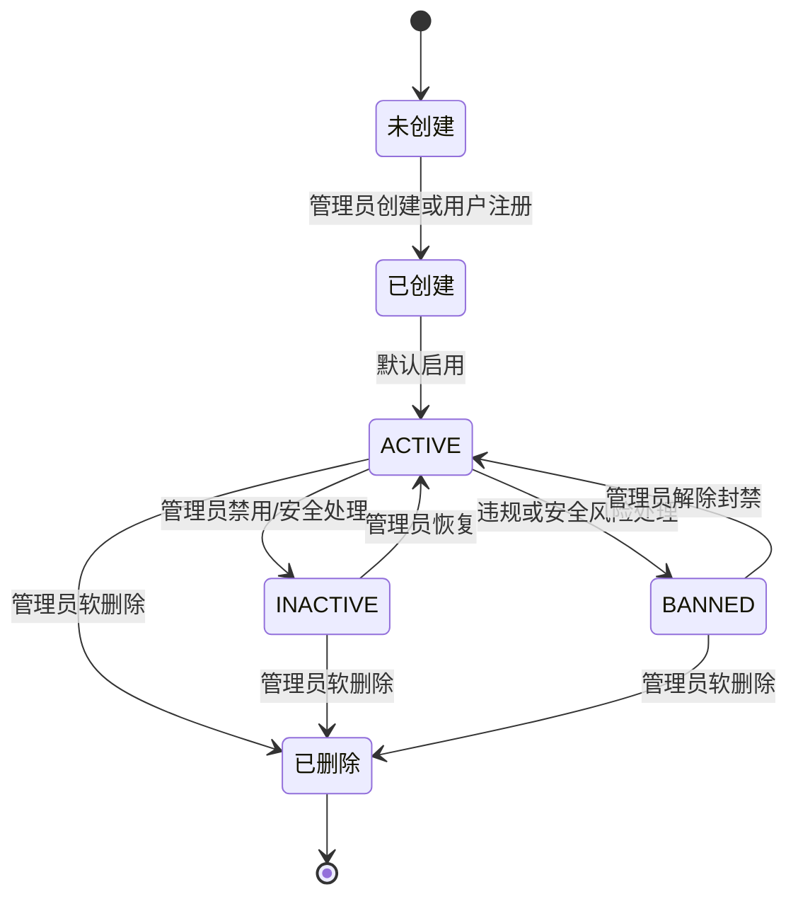
```mermaid
stateDiagram-v2
  [*] --> 未创建
  未创建 --> 已创建: 管理员创建或用户注册
  已创建 --> ACTIVE: 默认启用
  ACTIVE --> INACTIVE: 管理员禁用/安全处理
  INACTIVE --> ACTIVE: 管理员恢复
  ACTIVE --> BANNED: 违规或安全风险处理
  BANNED --> ACTIVE: 管理员解除封禁
  ACTIVE --> 已删除: 管理员软删除
  INACTIVE --> 已删除: 管理员软删除
  BANNED --> 已删除: 管理员软删除
  已删除 --> [*]
```

| 状态     | 含义                                                 | 允许的主要操作                         |
| -------- | ---------------------------------------------------- | -------------------------------------- |
| 未创建   | 系统中不存在该用户                                   | 创建、注册                             |
| 已创建   | 用户记录已生成，随后进入实际账号状态                 | 默认启用、补充资料                     |
| ACTIVE   | 对应 `UserStatus.ACTIVE`，用户可登录并访问被授权资源 | 登录、维护资料、访问业务功能、修改密码 |
| INACTIVE | 对应 `UserStatus.INACTIVE`，用户不可重新登录         | 管理员恢复、软删除、查看日志           |
| BANNED   | 对应 `UserStatus.BANNED`，用户不可重新登录           | 管理员解除封禁、软删除、查看日志       |
| 已删除   | `deleted_at` 不为空，用户被软删除，默认列表不显示    | 审计查询、按需包含已删除数据           |

#### 7.1.2 会话令牌状态

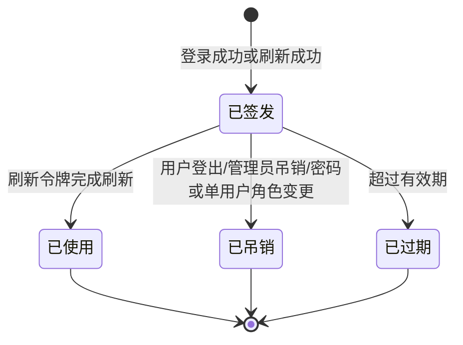
```mermaid
stateDiagram-v2
  [*] --> 已签发: 登录成功或刷新成功
  已签发 --> 已使用: 刷新令牌完成刷新
  已签发 --> 已吊销: 用户登出/管理员吊销/密码或单用户角色变更
  已签发 --> 已过期: 超过有效期
  已使用 --> [*]
  已吊销 --> [*]
  已过期 --> [*]
```

#### 7.1.3 权限配置状态

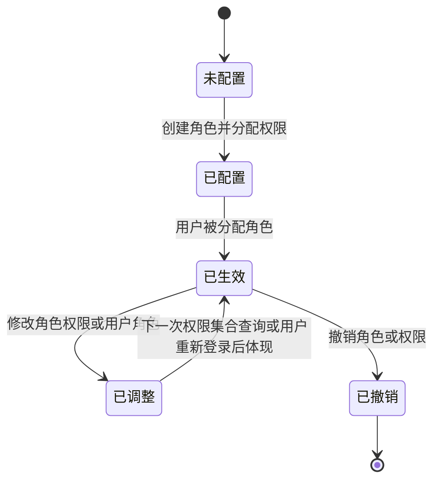
```mermaid
stateDiagram-v2
  [*] --> 未配置
  未配置 --> 已配置: 创建角色并分配权限
  已配置 --> 已生效: 用户被分配角色
  已生效 --> 已调整: 修改角色权限或用户角色
  已调整 --> 已生效: 下一次权限集合查询或用户重新登录后体现
  已生效 --> 已撤销: 撤销角色或权限
  已撤销 --> [*]
```

#### 7.1.4 课程与培养方案生命周期

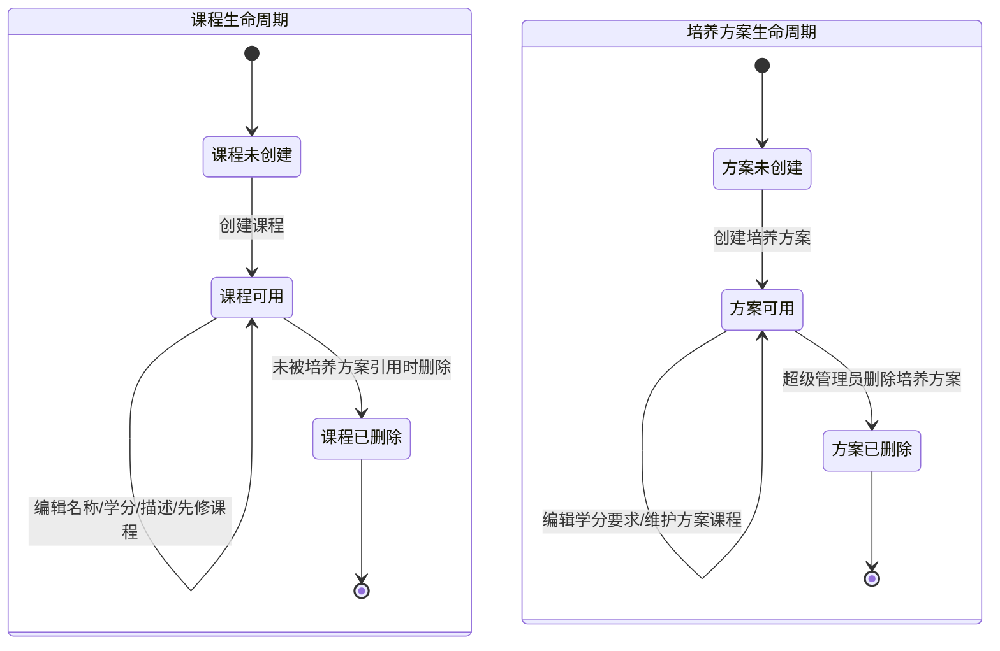
```mermaid
stateDiagram-v2
  state "课程生命周期" as CourseLife {
    [*] --> 课程未创建
    课程未创建 --> 课程可用: 创建课程
    课程可用 --> 课程可用: 编辑名称/学分/描述/先修课程
    课程可用 --> 课程已删除: 未被培养方案引用时删除
    课程已删除 --> [*]
  }

  state "培养方案生命周期" as CurriculumLife {
    [*] --> 方案未创建
    方案未创建 --> 方案可用: 创建培养方案
    方案可用 --> 方案可用: 编辑学分要求/维护方案课程
    方案可用 --> 方案已删除: 超级管理员删除培养方案
    方案已删除 --> [*]
  }
```

课程数据模型包含 `ARCHIVED` 枚举值，但当前 A 组接口只支持查询时返回或筛选课程状态，不提供归档、恢复或状态修改操作，因此状态图只描述当前可通过接口触发的生命周期。培养方案当前没有独立状态枚举，其生命周期为创建、查询、编辑学分要求、维护方案课程、删除；方案课程通过 `curriculum_courses` 维护课程类型和建议修读学期。

### 7.2 B 自动排课状态图

#### 7.2.1 教室资源状态

教室状态对应数据模型中的 `RoomStatus` 枚举（`AVAILABLE`/`MAINTENANCE`/`UNAVAILABLE`），仅可用状态的教室进入排课资源池。

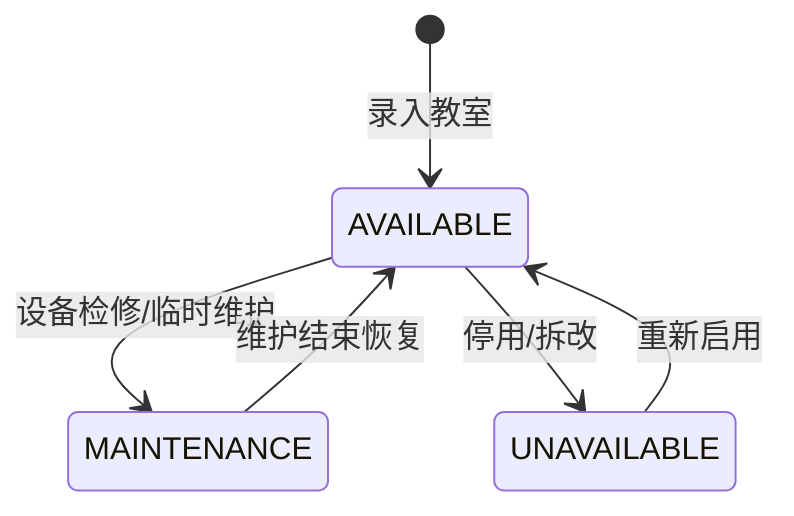
```mermaid
stateDiagram-v2
  [*] --> AVAILABLE: 录入教室
  AVAILABLE --> MAINTENANCE: 设备检修/临时维护
  MAINTENANCE --> AVAILABLE: 维护结束恢复
  AVAILABLE --> UNAVAILABLE: 停用/拆改
  UNAVAILABLE --> AVAILABLE: 重新启用
```

| 状态        | 含义                                         | 是否参与排课 |
| ----------- | -------------------------------------------- | ------------ |
| AVAILABLE   | 教室可用，进入自动排课与手动调课的可选资源池 | 是           |
| MAINTENANCE | 教室维护中，暂不可排课                       | 否           |
| UNAVAILABLE | 教室停用，不可排课                           | 否           |
| 已删除      | 教室记录被删除，需先确认无排课引用           | 否           |

#### 7.2.2 排课任务状态

排课任务为排课处理过程的运行态，描述教务管理人员从发起到确认保存排课结果的流转。

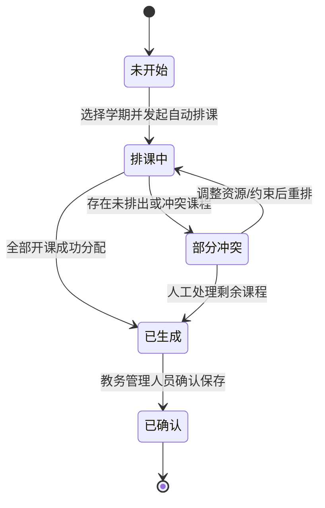
```mermaid
stateDiagram-v2
  [*] --> 未开始
  未开始 --> 排课中: 选择学期并发起自动排课
  排课中 --> 已生成: 全部开课成功分配
  排课中 --> 部分冲突: 存在未排出或冲突课程
  部分冲突 --> 排课中: 调整资源/约束后重排
  部分冲突 --> 已生成: 人工处理剩余课程
  已生成 --> 已确认: 教务管理人员确认保存
  已确认 --> [*]
```

#### 7.2.3 单条排课记录状态

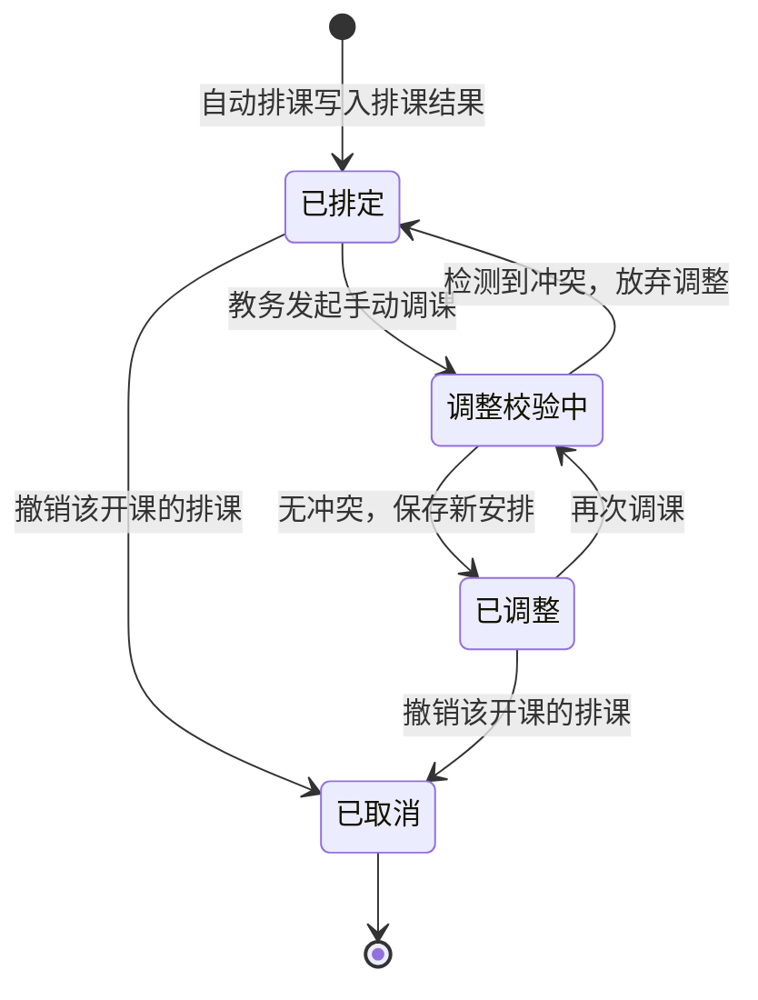
```mermaid
stateDiagram-v2
  [*] --> 已排定: 自动排课写入排课结果
  已排定 --> 调整校验中: 教务发起手动调课
  调整校验中 --> 已排定: 检测到冲突，放弃调整
  调整校验中 --> 已调整: 无冲突，保存新安排
  已调整 --> 调整校验中: 再次调课
  已排定 --> 已取消: 撤销该开课的排课
  已调整 --> 已取消: 撤销该开课的排课
  已取消 --> [*]
```

### 7.3 C 智能选课状态图

#### 7.3.1 选课阶段状态

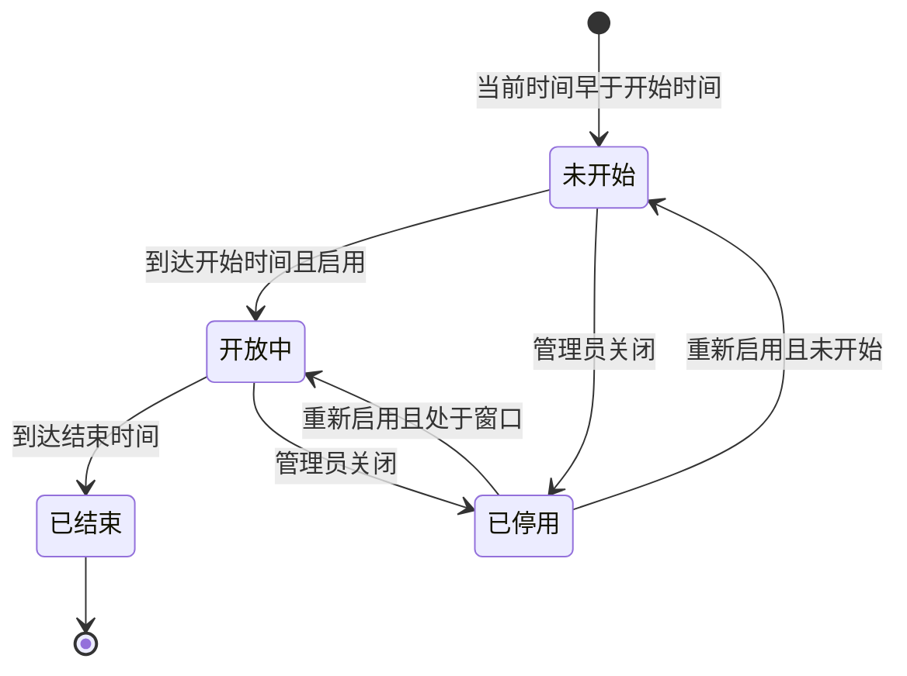
```mermaid
stateDiagram-v2
  [*] --> 未开始: 当前时间早于开始时间
  未开始 --> 开放中: 到达开始时间且启用
  开放中 --> 已结束: 到达结束时间
  未开始 --> 已停用: 管理员关闭
  开放中 --> 已停用: 管理员关闭
  已停用 --> 未开始: 重新启用且未开始
  已停用 --> 开放中: 重新启用且处于窗口
  已结束 --> [*]
```

#### 7.3.2 学生选课记录状态

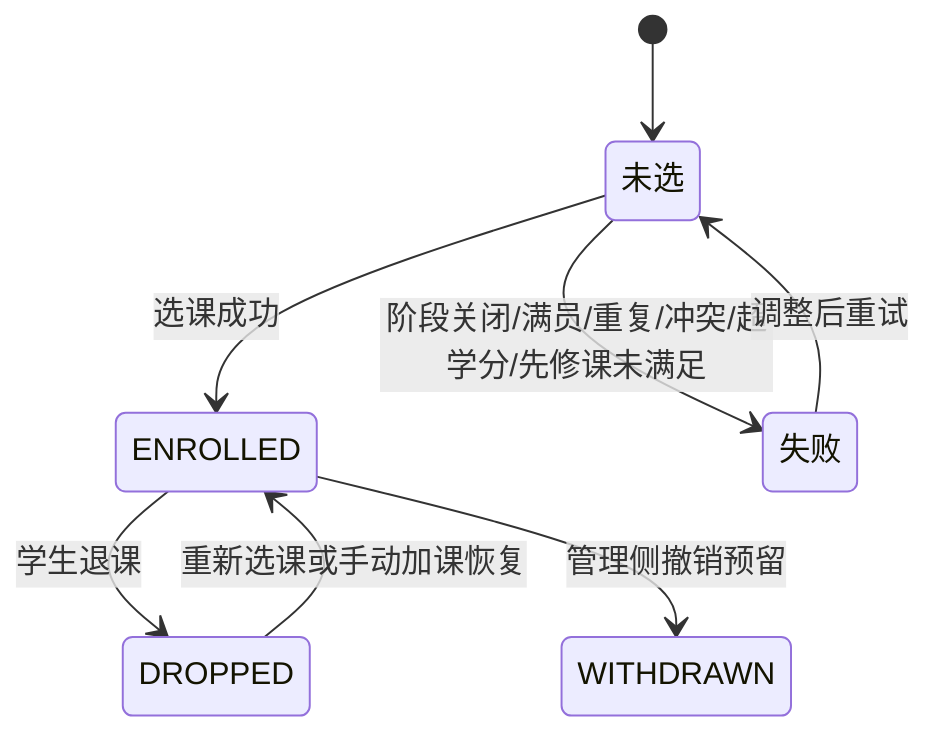
```mermaid
stateDiagram-v2
  [*] --> 未选
  未选 --> ENROLLED: 选课成功
  ENROLLED --> DROPPED: 学生退课
  DROPPED --> ENROLLED: 重新选课或手动加课恢复
  ENROLLED --> WITHDRAWN: 管理侧撤销预留
  未选 --> 失败: 阶段关闭/满员/重复/冲突/超学分/先修课未满足
  失败 --> 未选: 调整后重试
```

#### 7.3.3 教务手动加课状态

```mermaid
stateDiagram-v2
  [*] --> 已提交
  已提交 --> 校验中
  校验中 --> 已完成: 创建或恢复记录并更新容量
  校验中 --> 已拒绝: 权限或业务约束失败
  已完成 --> 已审计: 写入系统日志
  已审计 --> [*]
  已拒绝 --> [*]
```

#### 7.3.4 AI 辅助入口状态

```mermaid
stateDiagram-v2
  [*] --> 待请求
  待请求 --> 请求中
  请求中 --> 已返回结果: 后端返回推荐/解释（full/rule_only/template_only）
  请求中 --> 降级返回: LLM 不可用或结果不可信
  请求中 --> 失败: 参数/系统错误
  已返回结果 --> [*]
  降级返回 --> [*]
  失败 --> [*]
```

### 7.4 D 论坛交流状态图

#### 7.4.1 帖子状态

```mermaid
stateDiagram-v2
  direction LR

  state "编辑中（前端临时态）" as Editing
  state "正常发布（NORMAL）" as Normal
  state "隐藏（HIDDEN）" as Hidden
  state "已删除（DELETED）" as Deleted

  [*] --> Editing: 用户进入发帖页
  Editing --> Normal: 提交合法标题/正文/课程
  Normal --> Normal: 编辑内容/新增评论/浏览量增加
  Normal --> Normal: 置顶或取消置顶
  Normal --> Hidden: 管理员隐藏
  Hidden --> Normal: 管理员恢复
  Normal --> Deleted: 作者或管理员删除
  Hidden --> Deleted: 管理员删除
  Deleted --> [*]
```

| 状态     | 含义                                                                 | 允许的主要操作                                   |
| -------- | -------------------------------------------------------------------- | ------------------------------------------------ |
| 编辑中   | 用户在前端填写标题、正文、帖子类型和附件，尚未形成后端帖子记录       | 继续编辑、上传或删除未绑定附件、提交、取消       |
| 正常发布 | 对应 `PostStatus.NORMAL`，帖子可在列表、搜索和详情中被授权用户查看   | 查看、评论、编辑本人帖子、置顶、删除、浏览量增加 |
| 隐藏     | 对应 `PostStatus.HIDDEN`，内容被管理人员处理，普通列表和搜索不应展示 | 管理员查看、恢复或删除                           |
| 已删除   | 对应 `PostStatus.DELETED`，帖子对普通用户不可见                      | 审计或后台保留，不允许继续评论                   |

说明：置顶和公告不是独立生命周期状态，而是帖子上的 `isPinned` 与 `isAnnouncement` 标记。公告本质上是带公告标记的课程帖子，由教师或管理人员发布。

#### 7.4.2 评论状态

```mermaid
stateDiagram-v2
  direction LR

  state "正常（NORMAL）" as Normal
  state "隐藏（HIDDEN）" as Hidden
  state "已删除（DELETED）" as Deleted

  [*] --> Normal: 用户发表评论或回复
  Normal --> Normal: 子回复增加
  Normal --> Hidden: 管理员隐藏
  Hidden --> Normal: 管理员恢复
  Normal --> Deleted: 作者或管理员删除
  Hidden --> Deleted: 管理员删除
  Deleted --> [*]
```

| 状态   | 含义                                 | 允许的主要操作             |
| ------ | ------------------------------------ | -------------------------- |
| 正常   | 评论可在帖子详情页评论树中展示       | 回复、作者删除、管理员隐藏 |
| 隐藏   | 评论因管理原因被隐藏，普通用户不可见 | 管理员查看、恢复或删除     |
| 已删除 | 评论被删除，不再出现在普通评论树中   | 不允许继续回复             |

#### 7.4.3 附件绑定状态

```mermaid
stateDiagram-v2
  [*] --> 已上传未绑定: 用户上传附件成功
  已上传未绑定 --> 已绑定帖子: 用户提交帖子并绑定附件
  已上传未绑定 --> 已删除: 用户在发帖前删除附件
  已绑定帖子 --> 已删除: 作者或管理员删除附件/帖子删除级联处理
  已删除 --> [*]
```

| 状态         | 含义                                           | 允许的主要操作           |
| ------------ | ---------------------------------------------- | ------------------------ |
| 已上传未绑定 | 附件已通过大小和类型校验并保存，但尚未关联帖子 | 绑定到新帖子、删除       |
| 已绑定帖子   | 附件属于某个帖子，可在帖子详情页展示和下载     | 下载、由作者或管理员删除 |
| 已删除       | 附件业务记录和物理文件被清理                   | 不允许下载               |

### 7.5 E 在线测试状态图

#### 7.5.1 试卷状态

```mermaid
stateDiagram-v2
  direction LR

  state "草稿（DRAFT）" as Draft
  state "已发布（PUBLISHED）" as Published
  state "已关闭（CLOSED）" as Closed

  [*] --> Draft: 创建试卷
  Draft --> Draft: 编辑基础信息/组卷/移除题目
  Draft --> Published: 发布且至少包含 1 道题
  Published --> Published: 学生开始或恢复答题
  Published --> Closed: 管理员关闭试卷
  Closed --> [*]
  Draft --> [*]: 删除草稿试卷

  note right of Draft
    未对学生开放
    管理员可编辑与组卷
  end note

  note right of Published
    学生可在考试窗口内答题
    答题期间试卷状态不变
  end note

  note right of Closed
    禁止开始新的答题
    可查看历史成绩
  end note
```

| 状态   | 含义                                                           | 允许的主要操作                              |
| ------ | -------------------------------------------------------------- | ------------------------------------------- |
| 草稿   | 对应 `PaperStatus.DRAFT`，试卷已创建但尚未对学生开放           | 编辑试卷信息、手动/自动组卷、移除题目、发布 |
| 已发布 | 对应 `PaperStatus.PUBLISHED`，学生可在考试窗口内开始或恢复答题 | 学生答题、管理员查看成绩、关闭试卷          |
| 已关闭 | 对应 `PaperStatus.CLOSED`，不再允许开始新的答题                | 查看历史成绩、审计查询                      |

#### 7.5.2 学生答题记录状态

```mermaid
stateDiagram-v2
  [*] --> 未开始: 学生尚未进入该试卷
  未开始 --> 答题中: 学生开始答题且校验通过
  答题中 --> 答题中: 保存本地暂存答案/刷新页面
  答题中 --> 答题中: 未超时且未交卷前重新进入并恢复
  答题中 --> 已评分: 学生确认交卷
  答题中 --> 已评分: 考试时长耗尽或到达考试结束时间后自动交卷
  已评分 --> [*]
  未开始 --> [*]: 试卷未发布/已关闭/不在考试窗口/已完成过该试卷
```

| 状态   | 含义                                                        | 允许的主要操作                           |
| ------ | ----------------------------------------------------------- | ---------------------------------------- |
| 未开始 | 该学生对目标试卷尚无有效答题记录，或尚未通过开始答题校验    | 查看试卷列表、在满足条件时开始答题       |
| 答题中 | 对应 `TestStatus.IN_PROGRESS`，系统已创建唯一答题记录并计时 | 作答、本地暂存、恢复剩余时间、确认交卷   |
| 已评分 | 对应 `TestStatus.GRADED`，学生已正式交卷且系统完成自动评分  | 查看得分与逐题详情，不可再次参加同一试卷 |

#### 7.5.3 题库状态

```mermaid
stateDiagram-v2
  [*] --> 可用: 创建题库
  可用 --> 可用: 维护题库信息/新增或删除题目
  可用 --> [*]: 删除空题库
```

| 状态 | 含义                                                     | 允许的主要操作                           |
| ---- | -------------------------------------------------------- | ---------------------------------------- |
| 可用 | 对应 `BankStatus.ACTIVE`，题库可被题目管理和组卷功能引用 | 创建题目、查询题目、加入试卷、删除空题库 |

### 7.6 F 成绩管理状态图

#### 7.6.1 成绩状态

```mermaid
stateDiagram-v2
  [*] --> EMPTY: 学生完成选课并建立成绩占位

  EMPTY --> DRAFT: 教师首次保存成绩草稿
  DRAFT --> DRAFT: 教师继续编辑并保存草稿
  DRAFT --> SUBMITTED: 教师正式提交成绩

  SUBMITTED --> CONFIRMED: 管理员确认成绩
  SUBMITTED --> CONFIRMED: 改分申请审批通过并形成正式结果
  SUBMITTED --> SUBMITTED: 改分申请被驳回，原成绩保持不变

  CONFIRMED --> CONFIRMED: 改分申请审批通过并更新正式成绩
  CONFIRMED --> CONFIRMED: 改分申请被驳回，原成绩保持不变
```

| 状态        | 含义                         | 允许的主要操作                             |
| ----------- | ---------------------------- | ------------------------------------------ |
| `EMPTY`     | 已有选课记录，但尚未录入成绩 | 教师录入成绩、保存草稿                     |
| `DRAFT`     | 已保存成绩但尚未正式提交     | 教师继续编辑、保存草稿、正式提交           |
| `SUBMITTED` | 教师已正式提交，不能直接修改 | 教师或管理员发起改分申请；管理员确认或审批 |
| `CONFIRMED` | 已形成正式成绩               | 学生查询；教师或管理员发起受控改分申请     |

> “修改申请中”不作为 `Score.status` 的独立值，而由 `Score.modificationRequest` 是否存在表示。这样可避免成绩正式状态与审批流程状态混用。

#### 7.6.2 修改申请状态

```mermaid
stateDiagram-v2
  [*] --> 无申请: 成绩为SUBMITTED或CONFIRMED
  无申请 --> 待审批: 教师或管理员提交修改申请
  待审批 --> 已通过: 管理员审批通过
  待审批 --> 已驳回: 管理员审批驳回
  已通过 --> 无申请: 更新Score并清空modificationRequest
  已驳回 --> 无申请: 保留原成绩并清空modificationRequest
```

| 状态   | 含义                       | 允许的主要操作                   |
| ------ | -------------------------- | -------------------------------- |
| 无申请 | 当前不存在待审批修改申请   | 授权教师或管理员可以发起新申请   |
| 待审批 | 已提交修改申请但尚未处理   | 管理员审批通过或驳回             |
| 已通过 | 申请已批准并写入正式成绩   | 查询修改日志                     |
| 已驳回 | 申请被拒绝，原成绩保持不变 | 查询处理结果；之后可重新发起申请 |

#### 7.6.3 学生侧可见性规则

| 成绩状态    | 学生是否可见 | 是否参与统计           |
| ----------- | ------------ | ---------------------- |
| `EMPTY`     | 否           | 否                     |
| `DRAFT`     | 否           | 否                     |
| `SUBMITTED` | 是           | 满足有效成绩规则时参与 |
| `CONFIRMED` | 是           | 满足有效成绩规则时参与 |

同一课程存在多条可见成绩时，系统选择总评成绩最高的记录作为有效成绩；总评成绩相同时，选择最近修改或录入的记录。

#### 7.6.4 F3 成绩可见性与有效成绩规则

```mermaid
stateDiagram-v2
  [*] --> 不可见草稿: Score.status = DRAFT
  不可见草稿 --> 学生可见候选: Score.status = SUBMITTED
  学生可见候选 --> 学生可见候选: Score.status = CONFIRMED
  学生可见候选 --> 计入统计: 同课程最高总评或同分最近记录
  学生可见候选 --> 仅展示不计入统计: 同课程存在更高或更新有效成绩
  计入统计 --> [*]
  仅展示不计入统计 --> [*]
```

| 状态             | 含义                                                    | F3 处理规则                                                           |
| ---------------- | ------------------------------------------------------- | --------------------------------------------------------------------- |
| 不可见草稿       | 成绩处于 `DRAFT`，仍属于教师录入阶段                    | 学生列表、GPA 摘要、个人分析和课程分析均不读取该成绩                  |
| 学生可见候选     | 成绩处于 `SUBMITTED` 或 `CONFIRMED`，且属于当前学生本人 | 学生成绩列表可以展示，课程分析可以参与课程维度统计                    |
| 计入统计         | 同一学生同一课程下被选为有效成绩                        | 参与 GPA、平均分、通过/不及格课程数、学分进展、个人成绩分布和学期趋势 |
| 仅展示不计入统计 | 同一课程存在另一条更高总评或同分更新的有效成绩          | 可在成绩列表中展示历史/重修记录，但不参与 GPA 和学分统计              |

---

## 8. 类图与 CRC 卡

### 8.1 总体分析类图

系统以 `User` 及其学生、教师和管理员身份为统一访问入口，以 `CourseOffering` 连接课程、排课、选课、论坛、测试和成绩等教学活动。各子系统在共享对象之上维护自身业务对象，避免使用含义相同但名称不同的平行模型。

```mermaid
classDiagram
  class User
  class Student
  class Teacher
  class Administrator
  class Role
  class Department
  class Major
  class Course
  class Curriculum
  class CurriculumCourse
  class Classroom
  class CourseOffering
  class Schedule
  class SelectionPeriod
  class Enrollment
  class ForumPost
  class ForumComment
  class QuestionBank
  class Question
  class TestPaper
  class TestQuestion
  class TestResult
  class Answer
  class Score
  class ScoreModificationRequest
  class SystemLog

  User <|-- Student
  User <|-- Teacher
  User <|-- Administrator
  User "*" --> "*" Role
  Department "1" --> "0..*" Major
  Major "1" --> "0..*" Student
  Department "1" --> "0..*" Teacher
  Curriculum "1" --> "0..*" CurriculumCourse
  CurriculumCourse "*" --> "1" Course
  Course "1" --> "0..*" CourseOffering
  CourseOffering "1" --> "0..*" Schedule
  Classroom "1" --> "0..*" Schedule
  Teacher "1" --> "0..*" CourseOffering
  Student "1" --> "0..*" Enrollment
  CourseOffering "1" --> "0..*" Enrollment
  SelectionPeriod ..> Enrollment
  CourseOffering "1" --> "0..*" ForumPost
  ForumPost "1" --> "0..*" ForumComment
  QuestionBank "1" --> "0..*" Question
  TestPaper "1" --> "0..*" TestQuestion
  TestQuestion "*" --> "1" Question
  TestPaper "1" --> "0..*" TestResult
  Student "1" --> "0..*" TestResult
  TestResult "1" --> "0..*" Answer
  Enrollment "1" --> "0..1" Score
  Score "1" --> "0..*" ScoreModificationRequest
  Administrator --> SystemLog
```

### 8.2 A 基础信息管理类图与 CRC 卡

#### 8.2.1 A 组分析类图

```mermaid
classDiagram
  class User {
    用户身份
    账号状态
    个人资料
  }
  class Student {
    学号
    年级
    班级
  }
  class Teacher {
    工号
    职称
    办公地点
  }
  class Administrator {
    管理员类型
  }
  class Department {
    院系名称
    院系代码
  }
  class Major {
    专业名称
    学位类型
    总学分要求
  }
  class Course {
    课程代码
    学分
    考核方式
    课程状态
  }
  class Curriculum {
    适用专业年份
    学分要求
  }
  class CurriculumCourse {
    课程类型
    建议修读学期
  }
  class Role {
    角色代码
    角色名称
  }
  class UserRole {
    分配时间
  }
  class Permission {
    资源
    动作
    权限代码
  }
  class RolePermission {
    权限绑定
  }
  class RefreshToken {
    过期时间
    吊销状态
  }
  class ActivationToken {
    过期时间
    使用状态
  }
  class PasswordResetToken {
    过期时间
    使用状态
  }
  class CoursePrerequisite {
    课程ID
    先修课程ID
  }
  class SystemLog {
    操作类型
    资源
    操作详情
  }

  User "1" --> "0..1" Student
  User "1" --> "0..1" Teacher
  User "1" --> "0..1" Administrator
  User "1" --> "*" UserRole
  Role "1" --> "*" UserRole
  Role "1" --> "*" RolePermission
  Permission "1" --> "*" RolePermission
  User "1" --> "*" RefreshToken
  User "1" --> "*" ActivationToken
  User "1" --> "*" PasswordResetToken
  User "1" --> "*" SystemLog
  Department "1" --> "*" Major
  Department "1" --> "*" Teacher
  Department "1" --> "*" Administrator
  Major "1" --> "*" Student
  Department "1" --> "*" Course
  Teacher "1" --> "*" Course
  Course "1" --> "*" CoursePrerequisite : course
  CoursePrerequisite "*" --> "1" Course : prerequisite
  Major "1" --> "*" Curriculum
  Curriculum "1" --> "*" CurriculumCourse
  Course "1" --> "*" CurriculumCourse
```

#### 8.2.2 CRC 卡

| Class              | Description                  | Responsibility                                                                                          | Collaborator                                                       |
| ------------------ | ---------------------------- | ------------------------------------------------------------------------------------------------------- | ------------------------------------------------------------------ |
| User               | 系统中所有登录主体的基础身份 | 维护账号、姓名、联系方式、头像、状态、最后登录时间；作为学生、教师、管理员身份的统一入口                | Student、Teacher、Administrator、UserRole、RefreshToken、SystemLog |
| Student            | 学生身份扩展                 | 维护学号、专业、年级、班级；为选课、在线测试、成绩管理提供学生身份                                      | User、Major                                                        |
| Teacher            | 教师身份扩展                 | 维护工号、院系、职称、办公地点；为排课、论坛、在线测试、成绩录入提供教师身份                            | User、Department、Course                                           |
| Administrator      | 管理员身份扩展               | 维护管理员类型和所属院系；区分教务管理员、超级管理员、安全管理职责                                      | User、Department、UserRole                                         |
| Department         | 院系组织单元                 | 维护院系名称、代码、描述；聚合专业、教师、管理员、课程统计                                              | Major、Teacher、Administrator、Course                              |
| Major              | 专业目录                     | 维护专业名称、代码、学位类型、总学分要求；关联学生和培养方案                                            | Department、Student、Curriculum                                    |
| Course             | 课程基础信息                 | 维护课程代码、名称、学分、学时、类型、考核方式、先修课程，并展示课程状态；为 B-F 子系统提供课程基础数据 | Department、Teacher、CurriculumCourse                              |
| Curriculum         | 培养方案                     | 维护适用专业、年份、总学分、必修学分、选修学分；组织培养方案课程集合                                    | Major、CurriculumCourse                                            |
| CurriculumCourse   | 培养方案课程关系             | 维护课程在培养方案中的类型和建议修读学期                                                                | Curriculum、Course                                                 |
| Role               | 角色                         | 表达一类用户的权限集合；支持用户分配和权限绑定                                                          | UserRole、RolePermission                                           |
| UserRole           | 用户角色关系                 | 维护用户与角色的分配关系和分配时间，支撑用户权限聚合                                                    | User、Role                                                         |
| Permission         | 权限                         | 表达对某类资源的某个动作许可；用于角色能力配置、权限分配和权限集合查询                                  | RolePermission                                                     |
| RolePermission     | 角色权限关系                 | 维护角色与权限的绑定关系，支撑权限分配和撤销                                                            | Role、Permission                                                   |
| RefreshToken       | 会话刷新凭据                 | 支持会话刷新、活跃令牌查询、吊销、过期判断和风险会话收敛                                                | User                                                               |
| ActivationToken    | 账号激活凭据                 | 表达注册激活流程中的一次性令牌；当前接口文档标注为废弃，仅作为兼容对象保留                              | User                                                               |
| PasswordResetToken | 密码重置凭据                 | 支持忘记密码后的令牌校验、密码重置和凭据失效                                                            | User                                                               |
| CoursePrerequisite | 课程先修关系                 | 维护课程与先修课程之间的多对多关系，避免课程把自身设置为先修课                                          | Course                                                             |
| SystemLog          | 系统审计记录                 | 记录关键操作的用户、资源、时间、IP、浏览器和详情                                                        | User、各管理对象                                                   |

### 8.3 B 自动排课类图与 CRC 卡

#### 8.3.1 B 组分析类图

```mermaid
classDiagram
  class Classroom {
    教学楼
    房间号
    校区
    容量
    教室类型
    设备清单
    状态
  }
  class Schedule {
    星期几
    开始周次
    结束周次
    开始节次
    结束节次
    备注
  }
  class CourseOffering {
    选课容量
    已选人数
    开课状态
  }
  class Course {
    课程名称
    学分
    课程类型
  }
  class Teacher {
    工号
    职称
  }
  class Semester {
    学期名称
    起止日期
  }
  class SchedulingTask {
    目标学期
    待排开课集合
    任务状态
    成功率
    预览结果
    失败原因
  }
  class Rule {
    目标类型
    目标对象
    硬约束
    软约束
  }
  class ConflictChecker {
    教室时间冲突判定
    任务内候选占用判定
    容量与类型校验
  }
  class Timetable {
    综合课表
    教室课表
    开课课表
    CSV导出
  }

  Classroom "1" --> "*" Schedule : 被占用
  CourseOffering "1" --> "*" Schedule : 安排
  Course "1" --> "*" CourseOffering
  Teacher "1" --> "*" CourseOffering : 授课
  Semester "1" --> "*" CourseOffering
  SchedulingTask "1" --> "*" Schedule : 生成
  Rule ..> SchedulingTask : 提供约束
  SchedulingTask --> ConflictChecker : 调用
  ConflictChecker ..> Schedule : 校验
  Timetable ..> Schedule : 汇总展示
```

> 说明：`Classroom`、`Schedule`、`CourseOffering`、`Course`、`Teacher`、`Semester`、`Rule` 为持久化实体（对应数据库模型）；`SchedulingTask` 是自动排课任务的运行时控制对象，当前实现以任务 id 查询状态、预览和应用结果。

#### 8.3.2 CRC 卡

| Class           | Description            | Responsibility                                                                                           | Collaborator                                          |
| --------------- | ---------------------- | -------------------------------------------------------------------------------------------------------- | ----------------------------------------------------- |
| Classroom       | 教室资源实体           | 维护教学楼、房间号、校区、容量、教室类型、设备清单和可用状态；同一教学楼下房间号唯一；提供可用教室资源池 | Schedule、SchedulingTask、ConflictChecker             |
| Schedule        | 单条排课记录           | 维护某开课在星期、起止周次、起止节次和某教室的时间地点安排；是冲突检测和课表查询的基础单元               | CourseOffering、Classroom、ConflictChecker、Timetable |
| CourseOffering  | 开课（待排对象）       | 提供选课容量、授课教师和所属学期，作为自动排课的输入并持有其排课记录                                     | Course、Teacher、Semester、Schedule                   |
| Course          | 课程基础信息           | 提供课程名称、学分和课程类型，用于课表展示和教室用途匹配                                                 | CourseOffering                                        |
| Teacher         | 授课教师               | 提供教师身份和授课关系，用于教师时间冲突检测和教师课表查询                                               | CourseOffering、Timetable                             |
| Semester        | 学期                   | 界定排课任务的时间范围和待排开课集合                                                                     | CourseOffering、SchedulingTask                        |
| SchedulingTask  | 自动排课任务（控制类） | 加载待排开课、可用教室与规则，生成预览结果，输出成功率、成功记录和失败原因；用户确认后再写入排课表       | CourseOffering、Classroom、Rule、ConflictChecker、Schedule |
| Rule            | 排课规则实体           | 保存课程、教师等目标对象的硬约束和软约束，支持偏好时间、偏好教学楼和指定教室类型等配置                   | SchedulingTask、CourseOffering、Teacher               |
| ConflictChecker | 冲突检测（控制类）     | 手动排课检查目标教室时间占用；自动排课检查任务内教师/教室候选占用，并校验容量和指定教室类型              | Schedule、Classroom、CourseOffering                   |
| Timetable       | 课表视图（边界类）     | 按综合、教室或开课维度汇总排课记录，并支持 CSV 导出                                                       | Schedule、Teacher、Classroom、Course                  |

### 8.4 C 智能选课类图与 CRC 卡

#### 8.4.1 C 组分析类图

```mermaid
classDiagram
  class Student
  class Course
  class Curriculum
  class CurriculumCourse
  class CourseOffering
  class Schedule
  class Enrollment
  class SelectionPeriod
  class Teacher
  class AcademicAdmin
  class SystemLog
  class AiAdvisorEndpoint

  Student "1" --> "0..*" Enrollment
  Student "*" --> "1" Curriculum : 按专业和年级匹配
  Curriculum "1" --> "0..*" CurriculumCourse
  CurriculumCourse "*" --> "1" Course
  Course "1" --> "0..*" CourseOffering
  CourseOffering "1" --> "0..*" Schedule
  CourseOffering "1" --> "0..*" Enrollment
  CourseOffering "*" --> "1" Teacher
  AcademicAdmin --> SelectionPeriod
  AcademicAdmin --> Enrollment
  AcademicAdmin --> SystemLog
  AiAdvisorEndpoint ..> Student
```

#### 8.4.2 CRC 卡

| 类                | 职责                                                    | 协作者                                     |
| ----------------- | ------------------------------------------------------- | ------------------------------------------ |
| Student           | 表示当前登录学生业务身份，提供专业和年级                | User、Curriculum、Enrollment               |
| Course            | 提供课程代码、名称、学分、课程类型、状态和先修关系      | CurriculumCourse、CourseOffering           |
| Curriculum        | 表示某专业某年份培养方案和学分要求                      | Student、CurriculumCourse                  |
| CurriculumCourse  | 表示课程在培养方案中的归属和建议学期                    | Curriculum、Course                         |
| CourseOffering    | 表示某学期开课教学班，维护教师、容量、已选人数和状态    | Course、Teacher、Schedule、Enrollment      |
| Schedule          | 表示开课时间地点，用于详情、课表和冲突检测              | CourseOffering                             |
| Enrollment        | 表示学生选课关系，维护状态和幂等请求标识                | Student、CourseOffering、SelectionPeriod   |
| SelectionPeriod   | 表示选课阶段时间窗口、阶段类型、最大学分和启用状态      | Semester、AcademicAdmin                    |
| Teacher           | 表示教师身份，用于名单权限校验                          | CourseOffering、Enrollment                 |
| AcademicAdmin     | 表示学术教务管理员，用于阶段配置和手动加课              | SelectionPeriod、Enrollment、SystemLog     |
| SystemLog         | 记录敏感教务操作                                        | AcademicAdmin、SelectionPeriod、Enrollment |
| AiAdvisorEndpoint | 接收 AI 请求并返回推荐/解释结果（含降级模式）；无副作用 | Student                                    |

### 8.5 D 论坛交流类图与 CRC 卡

#### 8.5.1 D 组分析类图

```mermaid
classDiagram
  class ForumPost {
    标题
    正文
    帖子类型
    置顶标记
    公告标记
    浏览次数
    状态
    创建时间
    更新时间
  }
  class ForumComment {
    评论内容
    父评论
    深度
    状态
    创建时间
  }
  class ForumAttachment {
    文件名
    文件路径
    文件大小
    文件类型
    上传时间
  }
  class ForumStatistic {
    总帖子数
    总评论数
    附件数
    活跃用户数
    活跃度分数
  }
  class SearchCriteria {
    关键词
    课程筛选
    作者筛选
    类型筛选
    时间范围
    分页排序
  }
  class User {
    用户名
    姓名
    角色
  }
  class CourseOffering {
    开课课程
    任课教师
    学期
  }

  CourseOffering "1" --> "*" ForumPost
  User "1" --> "*" ForumPost
  ForumPost "1" --> "*" ForumComment
  ForumPost "1" --> "*" ForumAttachment
  User "1" --> "*" ForumComment
  ForumComment "0..1" --> "*" ForumComment : replies
  SearchCriteria ..> ForumPost : filters
  ForumStatistic ..> ForumPost : aggregates
  ForumStatistic ..> ForumComment : aggregates
  ForumStatistic ..> ForumAttachment : aggregates
```

#### 8.5.2 CRC 卡

| Class           | Description            | Responsibility                                                                                                           | Collaborator                                                   |
| --------------- | ---------------------- | ------------------------------------------------------------------------------------------------------------------------ | -------------------------------------------------------------- |
| ForumPost       | 课程论坛中的帖子或公告 | 维护标题、正文、帖子类型、课程开设、作者、置顶标记、公告标记、浏览量和状态；支持发布、编辑、详情查看、软删除、置顶和搜索 | User、CourseOffering、ForumComment、ForumAttachment            |
| ForumComment    | 帖子下的评论或回复     | 维护评论内容、作者、所属帖子、父评论、评论深度、状态和创建时间；支持树形回复、作者删除、管理员隐藏和恢复                 | ForumPost、User、ForumComment                                  |
| ForumAttachment | 帖子附件               | 维护文件名、路径、大小、类型和上传时间；支持上传校验、发帖绑定、下载和作者/管理员删除                                    | ForumPost、User                                                |
| SearchCriteria  | 帖子检索条件           | 承载关键词、课程、作者、帖子类型、时间范围、分页和排序条件；用于生成帖子搜索结果                                         | ForumPost、CourseOffering、User                                |
| ForumStatistic  | 论坛统计结果           | 聚合帖子数、评论数、附件数、活跃用户数、热帖排行、用户统计和课程活跃度；支持统计展示与 CSV 导出                          | ForumPost、ForumComment、ForumAttachment、User、CourseOffering |
| CourseOffering  | 课程开设上下文         | 为帖子、公告、检索和统计提供课程边界，避免不同课程讨论混杂                                                               | ForumPost、User                                                |
| User            | 论坛参与者身份         | 作为作者、评论者、管理员或教师参与论坛；提供角色权限、姓名和头像等展示信息                                               | ForumPost、ForumComment、ForumAttachment                       |

### 8.6 E 在线测试类图与 CRC 卡

#### 8.6.1 E 组分析类图

```mermaid
classDiagram
  class QuestionBank {
    题库名称
    描述
    题库状态
  }
  class Question {
    题干
    题型
    标准答案
    默认分值
    难度
    知识点
  }
  class QuestionOption {
    选项文本
    选项顺序
    是否正确
  }
  class TestPaper {
    试卷标题
    总分
    考试时长
    考试时间窗口
    试卷状态
  }
  class TestQuestion {
    题号
    该题分值
  }
  class TestResult {
    开始时间
    提交时间
    总分
    答题状态
    用时
  }
  class Answer {
    学生答案
    是否正确
    得分
  }
  class Course {
    课程代码
    课程名称
  }
  class CourseOffering {
    学期开课
    容量
  }
  class Teacher {
    工号
    职称
  }
  class Student {
    学号
    年级
  }

  Course "1" --> "*" QuestionBank
  Teacher "1" --> "*" QuestionBank
  QuestionBank "1" --> "*" Question
  Question "1" --> "*" QuestionOption
  CourseOffering "1" --> "*" TestPaper
  Teacher "1" --> "*" TestPaper
  TestPaper "1" --> "*" TestQuestion
  Question "1" --> "*" TestQuestion
  TestPaper "1" --> "*" TestResult
  Student "1" --> "*" TestResult
  TestResult "1" --> "*" Answer
  TestQuestion "1" --> "*" Answer
```

#### 8.6.2 CRC 卡

| Class          | Description        | Responsibility                                                                                                                     | Collaborator                                      |
| -------------- | ------------------ | ---------------------------------------------------------------------------------------------------------------------------------- | ------------------------------------------------- |
| QuestionBank   | 课程题库           | 维护题库名称、描述、状态和所属课程；聚合题库下题目数量；为空题库时才允许删除                                                       | Course、Teacher、Question                         |
| Question       | 题库中的试题       | 维护题干、题型、标准答案、解析、默认分值、难度和知识点；支持单选题、多选题和判断题；为组卷和自动评分提供题目基础数据               | QuestionBank、QuestionOption、TestQuestion        |
| QuestionOption | 题目选项           | 维护选项文本、顺序和是否正确标记；学生答题时仅暴露选项内容，不暴露正确标记                                                         | Question                                          |
| TestPaper      | 考试试卷           | 维护试卷标题、说明、总分、考试时长、开始/结束时间、是否随机组卷和试卷状态；控制草稿、已发布、已关闭生命周期                        | CourseOffering、Teacher、TestQuestion、TestResult |
| TestQuestion   | 试卷题目关系       | 维护试卷与题目的关联、题号和该题在试卷中的分值；支持手动加入、自动抽题、移除和重排题序                                             | TestPaper、Question、Answer                       |
| TestResult     | 学生一次测试会话   | 维护学生在某份试卷上的开始时间、提交时间、总分、答题状态和用时；保证同一学生对同一试卷仅保留一条有效测试记录；支持开始、恢复和交卷 | TestPaper、Student、Answer                        |
| Answer         | 单题作答与评分结果 | 维护学生在某次测试中对某道试卷题目的作答内容、是否正确和得分；交卷后由系统自动生成                                                 | TestResult、TestQuestion                          |

### 8.7 F 成绩管理类图与 CRC 卡

建议类：

- Score
- ScoreRecord
- ScoreModificationRequest
- CreditProgress
- GPAStatistic
- CourseScoreAnalysis

### 8.7.1 F 组类图

```mermaid
classDiagram
  direction LR
  class Student {
    studentId
    studentNumber
    +查询本人课程成绩()
    +查看学业概况()
    +查看个人成绩分析()
  }

  class Teacher {
    teacherId
    +加载课程成绩列表()
    +保存成绩草稿()
    +提交成绩()
    +发起修改申请()
  }

  class Administrator {
    administratorId
    +查询待审批申请()
    +审批通过()
    +审批驳回()
  }

  class CourseOffering {
    courseOfferingId
    semesterId
    courseId
  }

  class Enrollment {
    enrollmentId
    studentId
    courseOfferingId
  }

  class Score {
    scoreId
    usualScore
    midtermScore
    finalScore
    totalScore
    gradePoint
    gradeLetter
    status
    enteredAt
    modifiedAt
    modifiedBy
    +计算总评()
    +计算绩点和等级()
    +判断是否为有效成绩()
  }

  class ScoreModificationRequest {
    requestedUsualScore
    requestedMidtermScore
    requestedFinalScore
    reason
    requestedBy
    requestedAt
  }

  class ScoreModificationLog {
    oldValues
    newValues
    reason
    modifiedBy
    modifiedAt
  }

  class ScoreSummary {
    cumulativeGPA
    averageScore
    passedCourseCount
    failedCourseCount
    earnedCredits
    inProgressCredits
    +计算GPA()
    +计算平均分()
    +统计课程与学分()
  }

  class CurriculumProgress {
    requiredCredits
    completedCredits
    completedRequiredCredits
    completedElectiveCredits
    remainingCredits
    completionRate
    +计算培养方案进度()
  }

  class ScoreAnalytics {
    semesterTrend
    scoreDistribution
    gradePointDistribution
    courseTypeAnalysis
    +生成学期趋势()
    +生成成绩分布()
    +生成课程类型分析()
  }

  CourseOffering "1" --> "*" Enrollment
  Student "1" --> "*" Enrollment
  Enrollment "1" --> "0..1" Score
  Teacher --> CourseOffering
  Score "1" --> "0..1" ScoreModificationRequest
  Score "1" --> "*" ScoreModificationLog
  Administrator --> ScoreModificationRequest
  ScoreSummary --> Score
  ScoreSummary --> CurriculumProgress
  ScoreAnalytics --> Score
  ScoreAnalytics --> CourseOffering
```

### 8.7.2 CRC 卡

| Class                    | Description                | Responsibility                                                                                   | Collaborator                                                               |
| ------------------------ | -------------------------- | ------------------------------------------------------------------------------------------------ | -------------------------------------------------------------------------- |
| Score                    | 一条选课对应的课程成绩记录 | 保存分项成绩、总评、绩点、等级、状态、录入和修改信息；执行成绩派生字段计算；判断记录是否参与统计 | Enrollment、CourseOffering、ScoreModificationRequest、ScoreModificationLog |
| Enrollment               | 学生选课记录               | 建立学生、课程开设与成绩之间的对应关系                                                           | Student、CourseOffering、Score                                             |
| CourseOffering           | 某学期的一次课程开设       | 提供课程、学期、任课教师及成绩录入范围信息                                                       | Teacher、Enrollment、Score                                                 |
| ScoreModificationRequest | 成绩修改申请               | 保存拟修改成绩、申请理由、申请人和申请时间；承载待审批状态                                       | Score、Teacher、Administrator                                              |
| ScoreModificationLog     | 成绩修改日志               | 记录审批通过后的旧值、新值、修改原因、操作人和时间                                               | Score、Administrator                                                       |
| ScoreSummary             | 学业概况统计               | 根据有效成绩计算 GPA、平均分、通过课程数、不及格课程数和学分情况                                 | Score、CourseOffering、CurriculumProgress                                  |
| CurriculumProgress       | 培养方案进度               | 根据培养方案、有效成绩和在修课程计算学分及课程完成情况                                           | ScoreSummary、CourseOffering                                               |
| ScoreAnalytics           | 个人成绩分析               | 生成学期趋势、成绩分布、绩点分布和课程类型分析                                                   | Score、CourseOffering                                                      |
| Student                  | 学生成绩查询参与者         | 查询本人可见成绩、学业概况、培养方案进度和个人成绩分析                                           | Score、ScoreSummary、ScoreAnalytics                                        |
| Teacher                  | 成绩录入与改分申请参与者   | 查询本人课程成绩、保存草稿、正式提交及发起修改申请                                               | CourseOffering、Enrollment、Score、ScoreModificationRequest                |
| Administrator            | 成绩审批参与者             | 查询待审批申请、审批通过或驳回并触发日志记录                                                     | Score、ScoreModificationRequest、ScoreModificationLog、SystemLog           |

### 8.7.3 F3 补充 CRC 卡

| Class               | Description      | Responsibility                                                                              | Collaborator                                        |
| ------------------- | ---------------- | ------------------------------------------------------------------------------------------- | --------------------------------------------------- |
| ScoreQueryCriteria  | 学生成绩查询条件 | 承载分页、学期和课程关键词筛选条件；限定学生只能查询本人可见成绩                            | Score、Student、CourseOffering、Course、Semester    |
| EffectiveScoreRule  | 有效成绩规则     | 在同一课程多次成绩、重修或补考场景下确定哪条成绩计入 GPA、均分、通过课程数和学分统计        | Score、Course                                       |
| CourseScoreAnalysis | 课程成绩分析     | 按课程开设聚合学生总数、已提交人数、平均分、最高分、最低分、通过统计、成绩分布和 Top10 排名 | CourseOffering、Enrollment、Score、Student、Teacher |

---

## 9. 验证标准 / Validation Criteria

> 这是需求报告最重要的部分之一。每条主要需求都要有可执行、可判断的验收标准。

### 9.1 验证标准写法说明

验证标准采用“需求编号、可执行操作、可观察结果、覆盖用例”的统一结构。每条主要功能需求至少应覆盖正常流程；涉及权限、状态、容量、重复提交或数据归属的需求，还应覆盖异常和边界流程。性能、安全和可靠性需求应明确可执行的验证方法及可记录的验收证据；实际测试结果和证据归档由测试报告或验收材料记录。

| 要素       | 统一要求                                                                                             |
| ---------- | ---------------------------------------------------------------------------------------------------- |
| 需求追踪   | 验证条目必须关联 `FR-*` 或 `NFR-*`，并在需求追踪矩阵中对应用户场景、DFD 过程和主要业务对象。         |
| 输入与操作 | 说明执行者身份、前置数据和操作步骤；权限类条目必须同时包含合法与越权调用。                           |
| 预期结果   | 使用可判断的状态、返回数据、错误类型、写入结果或审计结果描述，不使用“体验良好”等主观表述。           |
| 边界覆盖   | 对容量上限、时间窗口、重复提交、非法状态、关联数据缺失和网络失败等风险场景进行验证。                 |
| 验收证据   | 接口测试、页面操作记录、并发压测、导出或打印结果、审计日志均可作为证据，并由测试报告或验收材料归档。 |

### 9.2 A 基础信息管理验证标准

| 验证编号 | 需求编号         | 验证标准                                       | 输入/操作                                                                            | 预期结果                                                                       | 覆盖用例         |
| -------- | ---------------- | ---------------------------------------------- | ------------------------------------------------------------------------------------ | ------------------------------------------------------------------------------ | ---------------- |
| VC-A-01  | FR-A-01          | 管理员可按关键词查询用户并获得分页结果         | 使用管理员账号搜索存在的用户名或姓名                                                 | 返回匹配用户列表，包含分页信息和用户基础字段                                   | UC-A-01          |
| VC-A-02  | FR-A-01          | 普通学生不能查看用户管理列表                   | 学生登录后尝试进入用户管理                                                           | 系统拒绝访问或跳转，无用户列表数据泄露                                         | UC-A-01          |
| VC-A-03  | FR-A-02          | 超级管理员可创建合法学生用户                   | 输入合法用户名、密码、姓名、学号、专业、年级、角色并保存                             | 用户创建成功，可在列表和详情中查询                                             | UC-A-01          |
| VC-A-04  | FR-A-02          | 用户唯一字段重复时创建失败                     | 使用已存在用户名、邮箱、学号或工号创建用户                                           | 系统拒绝保存，并提示冲突字段                                                   | UC-A-01          |
| VC-A-05  | FR-A-02          | 批量创建用户支持部分成功与部分失败             | 批量提交包含合法记录和重复用户名记录的数据                                           | 返回总数、成功数、失败数和失败原因；合法记录被创建                             | UC-A-01          |
| VC-A-06  | FR-A-03          | 用户可修改本人允许维护的个人资料               | 登录后修改本人电话或头像                                                             | 保存成功，刷新详情后显示新资料                                                 | UC-A-02          |
| VC-A-07  | FR-A-03          | 用户不能越权修改他人个人资料                   | 普通用户提交他人资料修改请求                                                         | 系统拒绝访问，不修改目标用户资料                                               | UC-A-02          |
| VC-A-08  | FR-A-04          | 用户修改密码必须提供正确旧密码                 | 输入错误旧密码和合法新密码                                                           | 系统拒绝修改，旧密码仍可按原规则使用                                           | UC-A-02          |
| VC-A-09  | FR-A-04          | 忘记密码流程只接受有效重置凭据                 | 使用过期或已使用的重置凭据提交新密码                                                 | 系统拒绝重置并提示凭据无效                                                     | UC-A-03          |
| VC-A-10  | FR-A-05          | 启用用户可登录并获取本人角色权限               | 使用正确用户名和密码登录                                                             | 登录成功，返回用户基础信息、角色和权限集合                                     | UC-A-03          |
| VC-A-11  | FR-A-05          | 禁用或封禁用户不能登录                         | 管理员禁用或封禁用户后，该用户尝试登录                                               | 系统拒绝登录，并按状态提示账号尚未激活或账户已被禁用                           | UC-A-03          |
| VC-A-12  | FR-A-06          | 登出或刷新令牌吊销后不能继续刷新会话           | 用户登出或管理员吊销刷新令牌后再次使用该刷新令牌刷新访问令牌                         | 系统拒绝刷新，要求重新登录                                                     | UC-A-03          |
| VC-A-13  | FR-A-07          | 超级管理员可创建院系和专业并建立归属关系       | 使用超级管理员账号创建院系后创建所属专业                                             | 院系详情显示专业统计，专业详情显示所属院系                                     | UC-A-05          |
| VC-A-14  | FR-A-07          | 院系和专业删除应符合当前接口前置条件           | 尝试删除已有专业、教师、管理员或课程关联的院系；尝试删除已有学生关联的专业           | 系统拒绝删除并提示存在关联数据                                                 | UC-A-05          |
| VC-A-15  | FR-A-08          | 管理员可为用户分配角色并查询聚合权限           | 给用户分配教师或管理员角色后查看权限                                                 | 用户详情或权限页显示新增角色和对应权限                                         | UC-A-04          |
| VC-A-16  | FR-A-09          | 角色删除权限和内置角色保护生效                 | 普通管理员尝试删除任意角色；超级管理员尝试删除内置学生、教师、管理员或超级管理员角色 | 普通管理员被拒绝；内置角色不能被删除且仍存在                                   | UC-A-04          |
| VC-A-17  | FR-A-09          | 撤销角色权限后用户权限查询结果发生变化         | 从角色撤销某权限后查询拥有该角色用户的权限集合                                       | 用户权限集合不再包含该权限代码，权限变更有日志；当前路由访问仍按角色规则控制   | UC-A-04          |
| VC-A-18  | FR-A-10          | 管理员或超级管理员可创建合法课程并查询详情     | 输入课程代码、名称、学分、类型、院系、教师、考核方式并保存                           | 课程创建成功，详情显示完整基础信息                                             | UC-A-06          |
| VC-A-19  | FR-A-10          | 删除被培养方案引用的课程应失败                 | 将课程加入培养方案后尝试删除该课程                                                   | 系统拒绝删除并提示课程被引用                                                   | UC-A-06          |
| VC-A-20  | FR-A-11          | 关键操作应写入系统日志                         | 创建用户、创建角色或分配角色权限、创建课程后查询日志                                 | 日志中存在对应操作人、操作类型、资源、资源标识和时间                           | UC-A-07          |
| VC-A-21  | FR-A-11          | 普通用户不能查询系统日志                       | 学生账号访问系统日志                                                                 | 系统拒绝访问，日志内容不泄露                                                   | UC-A-07          |
| VC-A-22  | FR-A-12          | 管理员可更新学生专业并写入日志                 | 将学生从一个专业调整到另一个存在专业                                                 | 学生详情显示新专业，日志记录专业变更                                           | UC-A-01、UC-A-05 |
| VC-A-23  | FR-A-13          | 管理员或超级管理员可创建培养方案并维护学分要求 | 输入专业、年份、总学分、必修学分、选修学分                                           | 培养方案创建成功，详情可查询                                                   | UC-A-06          |
| VC-A-24  | FR-A-14          | 管理员可向培养方案批量添加课程并获得汇总结果   | 批量添加合法课程和重复课程                                                           | 合法课程加入方案；响应返回成功数量和失败数量                                   | UC-A-06          |
| VC-A-25  | NFR-A-S-07       | 前后端均不能以隐藏菜单替代认证和角色控制       | 绕过页面直接访问管理资源                                                             | 后端仍拒绝未授权请求                                                           | UC-A-04          |
| VC-A-26  | NFR-A-P-01       | 列表查询分页参数受控                           | 请求超过最大单页数量的数据                                                           | 系统按最大限制返回分页数据，不一次性返回全量                                   | UC-A-01、UC-A-06 |
| VC-A-27  | FR-A-02、FR-A-15 | 管理员可批量调整用户状态或角色并获得结果反馈   | 批量提交多个用户 ID、目标状态或角色集合                                              | 合法用户被更新；响应返回更新数量和失败数量；若包含状态变更，则状态变更写入日志 | UC-A-01          |
| VC-A-28  | FR-A-03          | 用户头像上传格式和大小受控                     | 上传 JPG/PNG/WEBP 与非图片文件、超过 5MB 的图片                                      | 合法图片保存并可访问；非法文件被拒绝且原头像不被破坏                           | UC-A-02          |
| VC-A-29  | FR-A-10          | 课程不能把自身设置为先修课程                   | 编辑课程时将本课程 ID 放入先修课程列表                                               | 系统拒绝保存并提示先修关系冲突                                                 | UC-A-06          |
| VC-A-30  | NFR-A-S-08       | 系统提供基础 Web 安全和统一错误处理配置        | 检查跨域来源、响应安全头、非法请求错误响应和请求日志                                 | 非白名单跨域请求不被放行；响应包含安全头；错误响应结构统一；请求可被追踪       | UC-A-03、UC-A-07 |

### 9.3 B 自动排课验证标准

| 验证编号 | 需求编号 | 验证标准                               | 输入/操作                                                    | 预期结果                                           | 覆盖用例         |
| -------- | -------- | -------------------------------------- | ------------------------------------------------------------ | -------------------------------------------------- | ---------------- |
| VC-B-01  | FR-B-01  | 管理员可新增合法教室并查询到           | 使用管理员账号录入教学楼、房间号、校区、容量、教室类型并保存 | 教室创建成功，可在列表和详情中查询                 | UC-B-01          |
| VC-B-02  | FR-B-01  | 同一教学楼下房间号重复时创建失败       | 录入与已有教室相同的教学楼和房间号                           | 系统拒绝保存并提示房间号冲突                       | UC-B-01          |
| VC-B-03  | FR-B-01  | 编辑教室状态后列表和详情保持一致       | 将某教室状态改为维护或停用后重新查询                         | 列表和详情返回更新后的状态                         | UC-B-01          |
| VC-B-04  | FR-B-01  | 未登录用户不能访问教室管理接口         | 不携带访问令牌调用教室列表或详情接口                         | 系统返回 401，不返回教室数据                       | UC-B-01          |
| VC-B-05  | FR-B-02  | 自动排课为待排开课分配完整时间地点     | 对就绪学期发起自动排课                                       | 成功排出的开课均含星期、起止周次、起止节次和教室   | UC-B-02          |
| VC-B-06  | FR-B-02  | 自动排课返回成功数与未排出原因         | 在部分课程无法分配的场景下排课                               | 系统返回排课成功数、未排出课程清单及原因           | UC-B-02          |
| VC-B-07  | FR-B-03  | 手动排课可识别教室占用冲突             | 对同一教室、同一星期、重叠周次和节次再次排课                 | 系统返回冲突结果，不直接保存                       | UC-B-03          |
| VC-B-08  | FR-B-03  | 自动排课任务内不重复占用同一教室时段   | 对同一学期发起自动排课并查看预览                             | 预览中的成功记录不重复使用同一教室同一候选时段     | UC-B-02          |
| VC-B-09  | FR-B-04  | 手动调课无教室冲突时可保存             | 将某课调整到空闲教室与空闲时段                               | 调整保存成功，课表显示新安排                       | UC-B-03          |
| VC-B-10  | FR-B-04  | 手动调课发生教室冲突时系统提示且不保存 | 将某课调整到已被占用的教室时段                               | 系统提示教室冲突，原排课记录保持不变               | UC-B-03          |
| VC-B-11  | FR-B-06  | 自动排课不选择容量不足的教室           | 对容量大于部分教室容量的开课发起自动排课                     | 成功记录中的教室容量不小于开课容量                 | UC-B-02          |
| VC-B-12  | FR-B-08  | 维护或停用教室不参与排课               | 将教室置为维护/停用后发起排课或调课                          | 该教室不出现在可分配资源中                         | UC-B-01、UC-B-02 |
| VC-B-13  | FR-B-07  | 规则偏好影响自动排课候选顺序           | 为课程或教师配置偏好时间段或教学楼后发起自动排课             | 符合偏好的候选方案优先进入成功预览                 | UC-B-02          |
| VC-B-14  | FR-B-05  | 可综合查询课表                         | 登录后按学期或课程开设查询课表                               | 返回排课记录列表                                   | UC-B-04          |
| VC-B-15  | FR-B-05  | 可按教室查询课表                       | 登录后选择某教室和学期查询课表                               | 返回该教室相关排课记录                             | UC-B-04          |
| VC-B-16  | FR-B-05  | 可导出 CSV 课表                        | 按教室、课程或全局条件请求 CSV 导出                          | 返回 `text/csv` 内容；不支持格式返回明确错误       | UC-B-04          |

### 9.4 C 智能选课验证标准

| 需求编号       | 验证标准                                   | 输入/操作                                           | 预期结果                                                        | 覆盖用例         |
| -------------- | ------------------------------------------ | --------------------------------------------------- | --------------------------------------------------------------- | ---------------- |
| FR-C-01        | 学生可制定并确认本人匹配培养方案           | 学生查看并确认匹配培养方案                          | 返回本人方案、课程分组和学分要求；确认后具备选课资格            | UC-C-01          |
| FR-C-02        | 学分进展基于已确认培养方案和本人已选课程   | 确认培养方案后构造不同类型已选课程                  | 返回学分和课程类型分组统计                                      | UC-C-01          |
| FR-C-03        | 课程目录支持筛选和分页                     | 按关键词、教师、类型查询                            | 返回符合条件分页数据                                            | UC-C-02          |
| FR-C-04        | 开课详情包含容量、教师、学期、时间和先修课 | 查询开课详情                                        | 返回完整详情                                                    | UC-C-02          |
| FR-C-05        | 可选课程返回不可选原因                     | 构造满员、已选、冲突等场景                          | 返回对应原因                                                    | UC-C-02          |
| FR-C-06        | 选课成功时容量和记录一致                   | 已确认培养方案后，在开放阶段选择合法开课            | 创建或恢复 `ENROLLED`，容量增加                                 | UC-C-03          |
| FR-C-06        | 重复选课不得生成多条有效记录               | 重复提交同一开课                                    | 返回已有结果或重复错误                                          | UC-C-03          |
| FR-C-06        | 满员课程不能继续选                         | 已选人数达到容量后选课                              | 选课失败，容量不增加                                            | UC-C-03          |
| FR-C-06        | 时间冲突课程不能选择                       | 选择两门时间重叠课程                                | 第二次失败并提示冲突                                            | UC-C-03          |
| FR-C-06        | 先修课通过状态必须受控                     | 已通过、未通过和缺少可判定成绩的学生选择目标开课    | 已通过者继续后续校验；未通过或缺少可判定成绩者被拒绝并提示      | UC-C-03          |
| FR-C-07        | 只能退选本人记录                           | 学生退选他人记录                                    | 后端拒绝                                                        | UC-C-04          |
| FR-C-07        | 退课后记录状态和容量同步变化               | 允许阶段退课                                        | 记录为 `DROPPED`，容量减少                                      | UC-C-04          |
| FR-C-08        | 本人选课结果支持筛选和汇总                 | 查询本人选课结果                                    | 返回分页记录和汇总                                              | UC-C-04          |
| FR-C-09        | 课表只展示有效已选课程                     | 查询本人课表                                        | 退选课程不显示                                                  | UC-C-04          |
| FR-C-10        | 教师只能查询本人开课名单                   | 教师访问非本人开课                                  | 后端拒绝                                                        | UC-C-05          |
| FR-C-11        | 名单导出权限与查询一致                     | 导出本人和非本人开课名单                            | 本人成功，非本人拒绝                                            | UC-C-05          |
| FR-C-12        | 阶段时间配置必须合法                       | 创建非法时间或重叠阶段                              | 系统拒绝                                                        | UC-C-06          |
| FR-C-13        | 手动加课要求权限、原因和核心约束           | 非学术教务、无原因、满员或冲突加课                  | 系统拒绝；合法请求写日志                                        | UC-C-06          |
| FR-C-14        | AI 辅助返回成功/降级结果                   | 调用推荐或解释接口                                  | 返回建议 payload；LLM 不可用时返回规则模板；不写入 `Enrollment` | UC-C-07          |
| FR-C-15        | 选课连接控制与空闲释放有效                 | 模拟达到并发上限、保持空闲并重新进入                | 超过上限返回准入提示；空闲会话释放名额，用户可重新进入          | UC-C-03          |
| FR-C-16        | 选课请求不接受学生身份字段                 | 提交额外 `student_id`                               | schema 拒绝非法字段                                             | UC-C-03          |
| NFR-C-P-02     | 并发选课不能超卖容量                       | 并发选择同一剩余容量有限开课                        | 成功数不超过容量                                                | UC-C-03          |
| NFR-C-P-03     | 至少 200 名在线用户并发选课                | 模拟 200 名用户同时访问选课服务并执行查询和选课准入 | 服务保持可用，准入、容量和会话规则正确                          | UC-C-03          |
| NFR-C-S-01～04 | 权限控制必须在后端执行                     | 各角色直接调用受控接口                              | 未授权请求被拒绝                                                | UC-C-01～UC-C-06 |

### 9.5 D 论坛交流验证标准

| 验证编号 | 需求编号            | 验证标准                             | 输入/操作                                              | 预期结果                                               | 覆盖用例                  |
| -------- | ------------------- | ------------------------------------ | ------------------------------------------------------ | ------------------------------------------------------ | ------------------------- |
| VC-D-01  | FR-D-01             | 教师可发布课程公告                   | 使用教师账号选择课程、填写标题和正文并提交公告         | 公告创建成功，公告列表和课程论坛首页可见               | UC-D-01                   |
| VC-D-02  | FR-D-01、NFR-D-S-02 | 普通学生不能发布公告                 | 学生账号直接调用公告创建接口或进入公告发布入口         | 系统拒绝操作，不产生公告记录                           | UC-D-01                   |
| VC-D-03  | FR-D-01             | 公告编辑和删除受控                   | 教师或管理员编辑公告标题、正文、置顶标记并删除公告     | 合法修改生效；删除后普通公告列表不再展示               | UC-D-01                   |
| VC-D-04  | FR-D-02             | 登录用户可发布合法帖子               | 输入合法课程、标题、正文和帖子类型后提交               | 帖子创建成功，可在列表和详情中查询                     | UC-D-02                   |
| VC-D-05  | FR-D-02、NFR-D-U-03 | 发帖表单必填规则生效                 | 提交空标题、空正文、超长标题或非法帖子类型             | 系统拒绝保存并提示具体字段或规则                       | UC-D-02                   |
| VC-D-06  | FR-D-03、NFR-D-P-03 | 合法附件可上传并绑定帖子             | 上传 PDF、Word、图片或文本等合法附件后发布帖子         | 附件上传成功，帖子详情展示附件并可下载                 | UC-D-02                   |
| VC-D-07  | FR-D-03、NFR-D-S-06 | 附件大小和类型限制生效               | 上传超过 10MB 的文件或不支持的文件类型                 | 系统拒绝上传并显示明确错误，帖子不绑定非法附件         | UC-D-02                   |
| VC-D-08  | FR-D-03、NFR-D-R-03 | 未绑定附件可被删除                   | 上传附件后取消发帖并删除附件                           | 附件记录和可下载入口被清理                             | UC-D-02                   |
| VC-D-09  | FR-D-04             | 用户可对帖子发表评论和回复           | 在帖子详情提交一级评论，再回复该评论                   | 评论保存成功，详情页按树形结构展示                     | UC-D-03                   |
| VC-D-10  | FR-D-04、NFR-D-R-04 | 非法父评论不能生成回复               | 对不存在、已删除或不属于当前帖子的父评论提交回复       | 系统拒绝保存，不产生悬挂评论                           | UC-D-03                   |
| VC-D-11  | FR-D-05、NFR-D-S-04 | 管理员可隐藏和恢复评论               | 使用管理员或论坛管理员隐藏评论，再恢复该评论           | 普通用户不可见隐藏评论；恢复后评论重新可见             | UC-D-03                   |
| VC-D-12  | FR-D-05、NFR-D-S-03 | 用户不能删除他人评论                 | 普通学生尝试删除其他用户评论                           | 系统拒绝操作，原评论保持不变                           | UC-D-03                   |
| VC-D-13  | FR-D-06             | 帖子列表支持分页、筛选和排序         | 按课程、关键词、类型、作者、时间范围查询帖子并请求分页 | 返回符合条件的分页数据，排序结果符合请求               | UC-D-05                   |
| VC-D-14  | FR-D-06             | 查看帖子详情会返回附件和评论统计     | 打开某个正常帖子详情                                   | 返回作者、课程、正文、附件、浏览量和评论数，浏览量增加 | UC-D-02、UC-D-03          |
| VC-D-15  | FR-D-07、NFR-D-S-02 | 教师或管理员可置顶帖子，学生不能置顶 | 教师执行置顶；学生直接调用置顶接口                     | 教师操作成功，学生操作被拒绝                           | UC-D-01                   |
| VC-D-16  | FR-D-07、NFR-D-R-01 | 删除帖子后普通列表和搜索不再展示     | 作者或管理员删除帖子后刷新列表并搜索标题               | 帖子不再出现在普通列表和搜索结果中                     | UC-D-02、UC-D-05          |
| VC-D-17  | FR-D-08             | 关键词搜索可命中标题或正文           | 搜索已存在帖子标题或正文中的关键词                     | 返回包含目标帖子的分页结果和摘要信息                   | UC-D-05                   |
| VC-D-18  | FR-D-08、NFR-D-U-02 | 搜索无结果时给出空状态提示           | 搜索不存在的关键词                                     | 页面显示无相关帖子提示，不发生页面错误                 | UC-D-05                   |
| VC-D-19  | FR-D-09             | 综合统计和热帖排行可查询             | 使用教师或管理员账号查询指定时间范围统计和热帖榜       | 返回帖子数、评论数、附件数、活跃用户数和热帖列表       | UC-D-04                   |
| VC-D-20  | FR-D-10             | 用户与课程活跃度统计可查询           | 查询本人统计、指定课程活跃度统计                       | 返回发帖数、评论数、公告数、课程参与人数和活跃度分数   | UC-D-04                   |
| VC-D-21  | FR-D-11、NFR-D-S-05 | 统计导出权限受控                     | 教务管理人员导出 CSV；普通学生尝试导出                 | 管理人员获得 CSV 文件；学生请求被拒绝                  | UC-D-04                   |
| VC-D-22  | NFR-D-S-01          | 未登录用户不能访问论坛受保护资源     | 未携带令牌访问帖子、评论、公告、附件或统计接口         | 系统拒绝访问并要求登录                                 | UC-D-01、UC-D-02、UC-D-03 |
| VC-D-23  | NFR-D-P-01          | 列表和搜索分页参数受控               | 请求超过最大单页数量的帖子或搜索结果                   | 系统按最大限制返回分页结果，不一次性返回全量           | UC-D-05                   |
| VC-D-24  | NFR-D-R-05          | 非法参数返回明确错误                 | 提交非法 UUID、非法日期范围或空搜索关键词              | 系统拒绝请求并返回可理解错误信息                       | UC-D-04、UC-D-05          |

### 9.6 E 在线测试验证标准

| 验证编号 | 需求编号               | 验证标准                               | 输入/操作                                                                        | 预期结果                                                                                                         | 覆盖用例                  |
| -------- | ---------------------- | -------------------------------------- | -------------------------------------------------------------------------------- | ---------------------------------------------------------------------------------------------------------------- | ------------------------- |
| VC-E-01  | FR-E-01                | 教师可为本人课程创建题库并查询题库列表 | 使用任课教师账号为本人课程创建题库并查看列表                                     | 题库创建成功，列表显示题库名称、描述和题目数量                                                                   | UC-E-01                   |
| VC-E-02  | FR-E-01                | 普通学生不能创建或删除题库             | 学生登录后尝试创建或删除题库                                                     | 系统拒绝操作，无题库数据被修改                                                                                   | UC-E-01                   |
| VC-E-03  | FR-E-01                | 仍包含题目的题库不能删除               | 对仍有题目的题库执行删除                                                         | 系统拒绝删除并提示需先删除题目                                                                                   | UC-E-01                   |
| VC-E-04  | FR-E-02                | 教师可在本人课程题库创建合法单选题     | 在本人课程的指定题库下创建含 4 个选项、1 个正确答案的单选题                      | 题目保存成功，详情显示题干、选项、标准答案和默认分值                                                             | UC-E-01                   |
| VC-E-05  | FR-E-02                | 题目选项规则校验生效                   | 分别提交选项数少于 2、判断题选项数不为 2、单选题多个正确选项、多选题重复正确选项 | 系统拒绝保存并提示具体校验错误                                                                                   | UC-E-01                   |
| VC-E-06  | FR-E-02                | 题目列表支持分页和筛选                 | 按题库、关键词查询题目，并请求超过最大单页数量的数据                             | 返回匹配题目及分页信息，单次返回规模不超过上限                                                                   | UC-E-01                   |
| VC-E-07  | FR-E-02                | 教师可编辑和删除本人课程题目           | 修改本人课程题库题目的题干、选项或分值后保存；删除不再使用的题目                 | 题目更新或删除成功，列表同步变化                                                                                 | UC-E-01                   |
| VC-E-08  | FR-E-03                | 教师可创建本人课程试卷草稿并查看详情   | 为本人课程输入标题、总分、考试时长等信息创建试卷                                 | 试卷以草稿状态保存，详情可查看基础信息和已配置题目                                                               | UC-E-02                   |
| VC-E-09  | FR-E-04                | 教师可手动向本人课程试卷加入题目       | 在草稿试卷中选择一道或多道授权题库题目并指定分值                                 | 题目加入成功，试卷详情显示题号、题干和分值                                                                       | UC-E-02                   |
| VC-E-10  | FR-E-04                | 自动组卷支持条件抽题并返回加入数量     | 按题库、题型、难度、关键词和数量执行自动组卷                                     | 符合条件的题目被加入试卷；响应返回实际加入数量                                                                   | UC-E-02                   |
| VC-E-11  | FR-E-04                | 同一题目不能重复加入同一试卷           | 对同一试卷重复提交已存在题目                                                     | 系统跳过重复题目，不重复计入题序                                                                                 | UC-E-02                   |
| VC-E-12  | FR-E-04                | 教师可从本人课程试卷移除题目并重排题序 | 删除本人课程试卷中某道已配置题目                                                 | 题目被移除，剩余题目题序连续                                                                                     | UC-E-02                   |
| VC-E-13  | FR-E-05                | 空试卷不能发布                         | 任课教师对不含任何题目的草稿试卷执行发布                                         | 系统拒绝发布并提示需先添加题目                                                                                   | UC-E-03                   |
| VC-E-14  | FR-E-05                | 含题目的草稿试卷可以发布               | 任课教师对至少包含 1 道题目的草稿试卷执行发布                                    | 试卷状态变为已发布，学生可在列表中看到                                                                           | UC-E-03                   |
| VC-E-15  | FR-E-05                | 已发布试卷可以关闭且禁止新答题         | 任课教师对已发布试卷执行关闭，学生再尝试开始答题                                 | 试卷状态变为已关闭，系统拒绝开始新的答题                                                                         | UC-E-03                   |
| VC-E-16  | FR-E-06                | 学生可对已发布试卷开始答题             | 学生在考试窗口内选择已发布且未交卷的试卷开始答题                                 | 系统创建或恢复答题记录，返回题目、选项、剩余时间和答题记录标识                                                   | UC-E-04                   |
| VC-E-17  | FR-E-06                | 非学生不能开始答题                     | 教师或管理员尝试开始学生答题流程                                                 | 系统拒绝访问，不创建答题记录                                                                                     | UC-E-04                   |
| VC-E-18  | FR-E-06                | 学生答题过程中不得看到正确答案标记     | 学生进入答题界面查看题目选项                                                     | 仅显示选项内容，不显示正确选项标记或标准答案                                                                     | UC-E-04                   |
| VC-E-19  | FR-E-07                | 开始答题后应显示剩余时间               | 学生成功进入答题界面                                                             | 页面显示倒计时、总题数和已答题数                                                                                 | UC-E-04                   |
| VC-E-20  | FR-E-07                | 进行中的答题可在未交卷且未超时时恢复   | 学生开始答题后离开，再在时限内重新进入                                           | 系统恢复同一答题记录和剩余时间，可继续作答                                                                       | UC-E-04                   |
| VC-E-21  | FR-E-07                | 考试超时后应自动交卷                   | 学生开始答题后不手动交卷直至时间耗尽                                             | 系统自动提交并进入评分流程                                                                                       | UC-E-04                   |
| VC-E-22  | FR-E-08                | 单选题和判断题自动评分正确             | 学生提交与标准答案一致和不一致的单选/判断题答案                                  | 答对得满分，答错得 0 分                                                                                          | UC-E-04                   |
| VC-E-23  | FR-E-08                | 多选题自动评分应比较选项集合           | 学生提交顺序不同但内容相同的多选答案                                             | 与标准答案集合一致时判为正确                                                                                     | UC-E-04                   |
| VC-E-24  | FR-E-08                | 交卷后生成总分和逐题判分结果           | 学生完成全部或部分题目后确认交卷                                                 | 返回答题记录状态为已评分、总分、正确题数、用时和逐题得分                                                         | UC-E-04                   |
| VC-E-25  | FR-E-09                | 学生可查询本人测试记录和详情           | 学生进入成绩查看页面并打开某次记录详情                                           | 列表按开始时间倒序展示；详情包含总分、满分、逐题作答和标准答案                                                   | UC-E-05                   |
| VC-E-26  | FR-E-09                | 学生不能查看他人答题详情               | 学生尝试访问其他学生的答题记录详情                                               | 系统拒绝访问，不泄露他人成绩                                                                                     | UC-E-05                   |
| VC-E-27  | FR-E-10                | 教师或授权管理人员可查看试卷成绩与统计 | 任课教师或授权管理人员进入指定试卷的成绩视图                                     | 显示参与学生姓名、总分、状态、用时和提交时间，以及参与人数、已交卷人数、平均分、最高分、最低分、通过率和分数分布 | UC-E-06                   |
| VC-E-27A | NFR-E-S-02、NFR-E-S-05 | 教师不能维护或查看非本人课程资源       | 教师尝试维护非本人任课课程题库、试卷，或查看其试卷成绩                           | 系统拒绝访问或修改，不返回非授权课程数据                                                                         | UC-E-01、UC-E-02、UC-E-06 |
| VC-E-28  | FR-E-10                | 学生不能查看整卷学生成绩列表           | 学生尝试访问某试卷的全部学生成绩列表                                             | 系统拒绝访问                                                                                                     | UC-E-06                   |
| VC-E-29  | NFR-E-S-01             | 未认证用户不能访问在线测试受保护功能   | 未登录直接访问题库维护、组卷、答题或成绩查询                                     | 系统拒绝访问并要求登录                                                                                           | UC-E-01、UC-E-04          |
| VC-E-30  | NFR-E-S-06             | 已交卷学生不能再次参加同一试卷         | 学生完成交卷后再次尝试开始同一试卷                                               | 系统拒绝开始新的答题                                                                                             | UC-E-04                   |
| VC-E-31  | NFR-E-S-07             | 不能以隐藏菜单替代后端权限控制         | 学生绕过页面直接发起创建题目、发布试卷或查看整卷成绩请求                         | 后端拒绝未授权请求                                                                                               | UC-E-01、UC-E-06          |
| VC-E-32  | NFR-E-P-01             | 题目列表分页参数受控                   | 请求超过最大单页数量的题目数据                                                   | 系统按最大限制返回分页结果，不一次性返回全量                                                                     | UC-E-01                   |
| VC-E-33  | NFR-E-P-03             | 自动组卷数量受限且支持部分成功         | 请求加入超过 200 题，或在可用题目不足时请求批量加入                              | 超过上限被拒绝；可用题目不足时返回实际加入数量和提示                                                             | UC-E-02                   |
| VC-E-34  | NFR-E-R-01             | 非法试卷状态变更应被拒绝               | 对空试卷发布、对已发布试卷再次发布、对草稿试卷关闭                               | 系统拒绝操作并返回可理解错误信息                                                                                 | UC-E-03                   |
| VC-E-35  | NFR-E-R-04             | 非法交卷请求应被拒绝                   | 学生提交不存在、不属于本人或已结束的答题记录                                     | 系统拒绝提交并提示错误原因                                                                                       | UC-E-04                   |
| VC-E-36  | NFR-E-U-05             | 不可作答状态应给出明确原因             | 分别尝试访问未发布、已关闭、未开始、已结束或已交卷的试卷                         | 页面展示明确原因，并提供返回试卷列表或查看成绩入口                                                               | UC-E-04                   |

### 9.7 F 成绩管理验证标准

F1 成绩录入补充验证标准：

| 验证编号 | 需求编号            | 验证标准                                   | 输入/操作                                                       | 预期结果                                                              | 覆盖用例 |
| -------- | ------------------- | ------------------------------------------ | --------------------------------------------------------------- | --------------------------------------------------------------------- | -------- |
| VC-F1-01 | FR-F-01             | 教师可以分页查询本人任课课程的成绩录入列表 | 任课教师请求本人课程开设成绩列表，并携带分页参数                | 返回选课学生、成绩构成、状态和分页信息，未录入记录以 `EMPTY` 状态展示 | UC-F-01  |
| VC-F1-02 | FR-F-01、NFR-F-S-03 | 教师不能查询非本人任课课程成绩录入列表     | 教师访问其他教师课程开设成绩列表                                | 系统拒绝访问，不返回学生成绩数据                                      | UC-F-01  |
| VC-F1-03 | FR-F-01、NFR-F-P-01 | 成绩录入列表支持筛选和分页                 | 按学号、姓名、成绩状态查询，并请求超过最大单页数量的数据        | 返回符合条件的分页数据，单次返回数量不超过限制                        | UC-F-01  |
| VC-F1-04 | FR-F-02             | 教师可以保存 `EMPTY` 或 `DRAFT` 成绩草稿   | 教师提交合法 enrollmentId 和平时、期中、期末成绩                | 系统新增或更新 `DRAFT` 成绩，并返回保存成功数量                       | UC-F-01  |
| VC-F1-05 | FR-F-02、NFR-F-R-04 | 保存草稿时后端应计算派生字段               | 输入已知分项成绩并保存草稿                                      | 系统按统一规则生成总评成绩、绩点和等级                                | UC-F-01  |
| VC-F1-06 | FR-F-02、NFR-F-R-02 | 草稿批量保存的部分失败应明确反馈           | 批量提交合法记录和非法 enrollmentId、非法分数组合               | 合法记录保存成功，非法记录返回失败原因，不污染已有成绩                | UC-F-01  |
| VC-F1-07 | FR-F-02、NFR-F-S-03 | 已提交或已确认成绩不能通过录入流程直接修改 | 对 `SUBMITTED` 或 `CONFIRMED` 成绩再次保存草稿                  | 系统跳过或拒绝该记录，原成绩保持不变                                  | UC-F-01  |
| VC-F1-08 | FR-F-03             | 教师可以批量提交草稿成绩                   | 教师提交本人课程下 `DRAFT` 成绩的 scoreId 列表                  | 系统将合法成绩状态更新为 `SUBMITTED`，返回提交成功数量                | UC-F-01  |
| VC-F1-09 | FR-F-03             | 只有 `DRAFT` 状态成绩可以正式提交          | 提交 `EMPTY`、`SUBMITTED`、`CONFIRMED` 或不属于该课程的 scoreId | 系统跳过或拒绝非法记录，并返回失败或跳过原因                          | UC-F-01  |
| VC-F1-10 | FR-F-03             | 正式提交后的成绩不能再通过录入流程直接修改 | 教师对已提交成绩尝试再次保存草稿                                | 系统拒绝或跳过该记录，提示已提交成绩需走受控修改流程                  | UC-F-01  |

| 需求编号 | 验证标准                                             | 输入/操作                                                | 预期结果                                                        | 覆盖用例                                                                              |
| -------- | ---------------------------------------------------- | -------------------------------------------------------- | --------------------------------------------------------------- | ------------------------------------------------------------------------------------- |
| FR-F-01  | 教师只能录入自己课程成绩                             | 教师访问非本人课程成绩录入                               | 系统拒绝访问                                                    | UC-F-01                                                                               |
| FR-F-02  | 成绩再次修改需要提交申请                             | 已录入成绩后再次修改                                     | 系统生成修改申请                                                | UC-F-02                                                                               |
| FR-F-04  | 教师只能对自己录入或自己任课的已提交成绩发起修改申请 | 教师对本人课程成绩提交改分申请                           | 系统接受申请并写入 `modificationRequest`                        | UC-F-02                                                                               |
| FR-F-04  | 非任课教师不能发起修改申请                           | 教师对无关课程成绩提交改分申请                           | 系统拒绝申请                                                    | UC-F-02                                                                               |
| FR-F-04  | 只有 `SUBMITTED` 或 `CONFIRMED` 状态成绩允许申请修改 | 对 `DRAFT` 成绩发起申请                                  | 系统拒绝申请                                                    | UC-F-02                                                                               |
| FR-F-05  | 发起申请时原成绩不得被直接修改                       | 教师提交合法改分申请                                     | `Score` 原始分数字段不变，仅 `modificationRequest` 被写入       | UC-F-02                                                                               |
| FR-F-06  | 已有待审批申请时不能重复提交                         | 对同一成绩连续提交两次申请                               | 第二次提交被拒绝                                                | UC-F-02                                                                               |
| FR-F-07  | 管理员可分页查看待审批申请列表                       | 管理员查询待审批列表                                     | 返回待处理申请及分页信息                                        | UC-F-02                                                                               |
| FR-F-08  | 审批通过后系统应更新成绩并重新计算派生字段           | 管理员审批通过合法申请                                   | 分项成绩更新，总评、绩点、等级同步更新，成绩状态为 `CONFIRMED`  | UC-F-02                                                                               |
| FR-F-08  | 审批通过后应清空申请并记录修改人信息                 | 管理员审批通过合法申请                                   | `modificationRequest` 清空，`modifiedAt`、`modifiedBy` 更新     | UC-F-02                                                                               |
| FR-F-09  | 审批驳回后原成绩不得被污染                           | 管理员驳回合法申请                                       | 原成绩不变，`modificationRequest` 清空                          | UC-F-02                                                                               |
| FR-F-10  | 审批通过后必须写入成绩修改日志                       | 管理员审批通过合法申请                                   | 生成 `ScoreModificationLog`，包含旧值、新值、原因、操作人和时间 | UC-F-02                                                                               |
| FR-F-10  | 成绩修改相关敏感操作必须写入系统日志                 | 提交申请、审批通过、审批驳回                             | 生成对应 `SystemLog` 记录                                       | UC-F-02                                                                               |
| FR-F-10  | 非管理员审批应被拒绝                                 | 普通教师调用审批接口                                     | 系统拒绝访问                                                    | UC-F-02                                                                               |
| FR-F-10  | 管理员可追溯成绩修改前后差异                         | 查询某条成绩的修改日志                                   | 返回完整前后差异和修改原因                                      | UC-F-02                                                                               |

| 验证编号 | 需求编号                                             | 验证标准                                                 | 输入/操作                                                       | 预期结果                                                                              | 覆盖用例                  |
| -------- | ---------------------------------------------------- | -------------------------------------------------------- | --------------------------------------------------------------- | ------------------------------------------------------------------------------------- | ------------------------- |
| VC-F-15  | FR-F-04                                              | 授权教师可以对本人录入或本人任课的已提交成绩发起修改申请 | 教师对本人课程的 `SUBMITTED` 成绩提交合法申请                   | 系统接受申请并写入 `modificationRequest`                                              | UC-F-02                   |
| VC-F-16  | FR-F-04                                              | 无关教师、非法状态或空申请理由应被拒绝                   | 非任课教师发起申请，或对 `DRAFT` 成绩申请，或不填写理由         | 系统拒绝申请并返回明确原因                                                            | UC-F-02                   |
| VC-F-17  | FR-F-05                                              | 发起申请时不得直接修改原成绩                             | 教师提交合法改分申请                                            | 原分项成绩、总评、绩点和等级保持不变，仅保存拟修改内容                                | UC-F-02                   |
| VC-F-18  | FR-F-06                                              | 同一成绩存在待审批申请时不能重复提交                     | 对同一成绩连续提交两次改分申请                                  | 第一次成功，第二次被拒绝                                                              | UC-F-02                   |
| VC-F-19  | FR-F-07                                              | 管理员可以分页和筛选查询待审批申请                       | 管理员按课程开设或教师筛选待审批列表                            | 返回符合条件的申请和分页信息                                                          | UC-F-02                   |
| VC-F-20  | FR-F-07                                              | 非管理员不得查看待审批申请列表                           | 普通教师调用待审批查询接口                                      | 系统拒绝访问                                                                          | UC-F-02                   |
| VC-F-21  | FR-F-08                                              | 审批通过后应更新成绩及派生字段                           | 管理员审批通过合法申请                                          | 分项成绩更新，总评、绩点和等级重新计算，结果形成正式成绩                              | UC-F-02                   |
| VC-F-22  | FR-F-08                                              | 审批通过后应清空申请并记录修改信息                       | 管理员审批通过合法申请                                          | `modificationRequest` 清空，`modifiedAt` 和 `modifiedBy` 更新                         | UC-F-02                   |
| VC-F-23  | FR-F-08                                              | 已处理申请不能被再次审批                                 | 两名管理员先后审批同一申请                                      | 第一个操作成功，第二个操作被拒绝并提示申请已处理                                      | UC-F-02                   |
| VC-F-24  | FR-F-09                                              | 审批驳回后原成绩不得改变                                 | 管理员填写驳回原因并驳回申请                                    | 原成绩保持不变，`modificationRequest` 清空                                            | UC-F-02                   |
| VC-F-25  | FR-F-10                                              | 审批通过后必须生成成绩修改日志和系统日志                 | 管理员审批通过合法申请                                          | 生成包含旧值、新值、原因、操作人和时间的 `ScoreModificationLog`，同时生成 `SystemLog` | UC-F-02                   |
| VC-F-26  | FR-F-10                                              | 审批驳回后必须生成系统日志                               | 管理员驳回合法申请                                              | 生成包含申请、处理人、驳回原因和时间的 `SystemLog`                                    | UC-F-02                   |
| VC-F-27  | FR-F-10                                              | 授权用户可以追溯修改结果，未授权用户不能查看             | 管理员、相关教师、本人学生和无关用户分别查询日志                | 系统按照角色和归属关系返回相应范围，无关用户被拒绝                                    | UC-F-02                   |
| VC-F-28  | FR-F-11                                              | 学生可以分页筛选本人可见成绩                             | 学生按学期或课程关键词查询                                      | 仅返回本人 `SUBMITTED` 或 `CONFIRMED` 成绩及分页信息                                  | UC-F-03                   |
| VC-F-29  | FR-F-11                                              | 学生不得查询他人成绩或不可见状态成绩                     | 学生修改请求中的学生标识，或尝试查询 `DRAFT` 成绩               | 系统拒绝越权请求或不返回不可见记录                                                    | UC-F-03                   |
| VC-F-30  | FR-F-12                                              | GPA 和学业概况计算正确                                   | 准备具有已知学分、绩点和成绩的测试数据                          | GPA 按学分加权计算，平均分、通过课程数、不及格课程数和学分结果与预期一致              | UC-F-03、UC-F-04          |
| VC-F-31  | FR-F-13                                              | 培养方案进度计算正确                                     | 为学生配置培养方案和已完成、在修课程                            | 正确展示总学分、必修、选修、已完成、在修、剩余学分和完成率                            | UC-F-03                   |
| VC-F-32  | FR-F-14                                              | 系统能够生成个人成绩多维分析                             | 学生存在多个学期和多种课程类型的有效成绩                        | 页面展示学期趋势、成绩区间分布和课程类型分析                                          | UC-F-04                   |
| VC-F-33  | FR-F-15                                              | 同一课程多条成绩只选一条参与统计                         | 同一课程准备不同总评的多条成绩，以及总评相同但时间不同的成绩    | 优先选择总评最高记录；总评相同时选择最近修改或录入记录；列表标识有效记录              | UC-F-03、UC-F-04          |
| VC-F-34  | FR-F-16                                              | 学生可以查看本人单条成绩详情                             | 学生打开本人可见成绩详情                                        | 返回课程、成绩构成、总评、等级、绩点、状态、统计标记和时间信息                        | UC-F-03                   |
| VC-F-35  | FR-F-16、NFR-F-S-05                                  | 学生不能查看改分申请敏感内容                             | 某成绩存在待审批修改申请，学生查看详情                          | 仅返回存在待处理申请的标记，不返回拟修改值、申请理由和审批信息                        | UC-F-03                   |
| VC-F-36  | NFR-F-P-01                                           | 成绩和审批列表分页、筛选正确                             | 分别执行教师成绩列表、待审批列表、修改日志和学生成绩分页查询    | 返回数量不超过页面上限，筛选和总数信息正确                                            | UC-F-01、UC-F-02、UC-F-03 |
| VC-F-37  | NFR-F-S-01～NFR-F-S-04                               | 各角色只能执行授权操作                                   | 分别以学生、教师、管理员调用录入、查询、申请和审批接口          | 未授权操作全部被服务端拒绝，授权操作正常完成                                          | UC-F-01～UC-F-04          |
| VC-F-38  | NFR-F-U-01～NFR-F-U-04                               | 页面能够正确展示空状态和错误提示                         | 构造无成绩、无培养方案、字段缺失和接口失败场景                  | 页面显示对应提示，不出现空白页或无法理解的错误                                        | UC-F-01～UC-F-04          |
| VC-F-39  | NFR-F-R-01～NFR-F-R-05                               | 异常数据和失败操作不会破坏已有成绩                       | 构造重复成绩、批量部分失败、并发审批和接口超时                  | 不发生重复统计、重复审批或错误状态覆盖，并返回明确错误信息                            | UC-F-01～UC-F-04          |
| VC-F-40  | NFR-F-C-01、NFR-F-C-02                               | 成绩页面在目标浏览器和分辨率下可正常操作                 | 使用主流浏览器和常见桌面分辨率访问各成绩页面                    | 表格、图表、表单和操作按钮正常显示，无关键内容被截断                                  | UC-F-01～UC-F-04          |
| VC-F-41  | FR-F-17                                              | 任课教师可以查看本人课程成绩分析                         | 任课教师查询本人课程开设分析                                    | 返回总学生数、已提交人数、平均分、最高分、最低分、通过/未通过人数、成绩分布和 Top10   | UC-F-05                   |
| VC-F-42  | FR-F-17、NFR-F-S-03                                  | 教师不得查看非本人任课课程分析                           | 教师查询其他教师课程开设分析                                    | 系统拒绝访问                                                                          | UC-F-05                   |
| VC-F-43  | FR-F-17                                              | 管理员可以查看任意课程成绩分析                           | 管理员查询任意课程开设分析                                      | 返回课程成绩统计结果                                                                  | UC-F-05                   |
| VC-F-44  | NFR-F-R-01                                           | F3 空数据场景返回结构稳定                                | 学生暂无可见成绩、暂无培养方案，或课程暂无已提交成绩            | 返回空数组、`null` 或 0 值统计，不发生未处理异常                                      | UC-F-03、UC-F-04、UC-F-05 |

---

## 10. 需求追踪矩阵

| 需求编号       | 需求名称               | 用户场景                                    | DFD                         | 状态图                               | 类/CRC                                                           | 验证标准                               |
| -------------- | ---------------------- | ------------------------------------------- | --------------------------- | ------------------------------------ | ---------------------------------------------------------------- | -------------------------------------- |
| FR-A-01        | 用户查询与统计         | UC-A-01                                     | A2                          | 用户账号状态                         | User、Student、Teacher、Administrator                            | VC-A-01、VC-A-02                       |
| FR-A-02        | 用户创建、编辑与删除   | UC-A-01                                     | A2                          | 用户账号状态                         | User、Student、Teacher、Administrator                            | VC-A-03、VC-A-04、VC-A-05、VC-A-27     |
| FR-A-03        | 用户个人资料维护       | UC-A-02                                     | A2                          | 用户账号状态                         | User                                                             | VC-A-06、VC-A-07、VC-A-28              |
| FR-A-04        | 密码管理               | UC-A-02、UC-A-03                            | A1                          | 会话令牌状态                         | User、RefreshToken、SystemLog                                    | VC-A-08、VC-A-09                       |
| FR-A-05        | 用户认证               | UC-A-03                                     | A1                          | 用户账号状态、会话令牌状态           | User、Role、Permission、RefreshToken                             | VC-A-10、VC-A-11                       |
| FR-A-06        | 会话与令牌管理         | UC-A-03、UC-A-04                            | A1、A5                      | 会话令牌状态                         | RefreshToken、User、SystemLog                                    | VC-A-12                                |
| FR-A-07        | 院系与专业管理         | UC-A-05                                     | A3                          | 不适用                               | Department、Major                                                | VC-A-13、VC-A-14                       |
| FR-A-08        | 用户角色分配           | UC-A-01、UC-A-04                            | A5                          | 权限配置状态                         | User、UserRole、Role                                             | VC-A-15                                |
| FR-A-09        | 角色权限管理           | UC-A-04                                     | A5                          | 权限配置状态                         | Role、RolePermission、Permission、SystemLog                      | VC-A-16、VC-A-17                       |
| FR-A-10        | 课程基础信息管理       | UC-A-06                                     | A4                          | 课程与培养方案生命周期               | Course、Department、Teacher、CoursePrerequisite                  | VC-A-18、VC-A-19、VC-A-29              |
| FR-A-11        | 系统日志管理           | UC-A-07                                     | A6                          | 用户账号状态、权限配置状态           | SystemLog、User                                                  | VC-A-20、VC-A-21                       |
| FR-A-12        | 用户组织归属维护       | UC-A-01、UC-A-05                            | A2、A3                      | 用户账号状态                         | Student、Teacher、Administrator、Department、Major               | VC-A-22                                |
| FR-A-13        | 培养方案管理           | UC-A-06                                     | A4                          | 课程与培养方案生命周期               | Curriculum、Major                                                | VC-A-23                                |
| FR-A-14        | 培养方案课程管理       | UC-A-06                                     | A4                          | 课程与培养方案生命周期               | CurriculumCourse、Curriculum、Course                             | VC-A-24                                |
| FR-A-15        | 批量处理反馈           | UC-A-01、UC-A-06                            | A2、A4                      | 用户账号状态、课程与培养方案生命周期 | User、Course、CurriculumCourse                                   | VC-A-05、VC-A-24、VC-A-27              |
| NFR-A-P-01     | 分页性能约束           | UC-A-01、UC-A-06、UC-A-07                   | A2、A4、A6                  | 不适用                               | User、Course、SystemLog                                          | VC-A-26                                |
| NFR-A-S-03     | 防越权访问             | UC-A-01、UC-A-04、UC-A-07                   | A5                          | 权限配置状态                         | Role、RolePermission、Permission                                 | VC-A-02、VC-A-21                       |
| NFR-A-S-07     | 后端认证与角色控制     | UC-A-01、UC-A-03、UC-A-04、UC-A-07          | A1、A5                      | 用户账号状态、权限配置状态           | User、UserRole、Role、Permission、RefreshToken                   | VC-A-25                                |
| NFR-A-S-08     | 基础 Web 安全防护      | UC-A-03、UC-A-07                            | A1、A6                      | 会话令牌状态                         | User、RefreshToken、SystemLog                                    | VC-A-30                                |
| FR-B-01        | 教学资源管理           | UC-B-01                                     | B1                          | 教室资源状态                         | Classroom                                                        | VC-B-01、VC-B-02、VC-B-03、VC-B-04     |
| FR-B-02        | 自动排课               | UC-B-02                                     | B2                          | 排课任务状态、单条排课记录状态       | SchedulingTask、Schedule、CourseOffering、Classroom              | VC-B-05、VC-B-06                       |
| FR-B-03        | 冲突检测               | UC-B-02、UC-B-03                            | B2、B4                      | 排课任务状态、单条排课记录状态       | ConflictChecker、Schedule、Classroom                             | VC-B-07、VC-B-08、VC-B-10              |
| FR-B-04        | 手动调课               | UC-B-03                                     | B4                          | 单条排课记录状态                     | Schedule、Classroom、ConflictChecker                             | VC-B-09、VC-B-10                       |
| FR-B-05        | 课表查询与导出         | UC-B-04                                     | B5                          | 不适用                               | Timetable、Schedule、Teacher、Classroom                          | VC-B-14、VC-B-15、VC-B-16              |
| FR-B-06        | 容量与教室类型匹配     | UC-B-02、UC-B-03                            | B2、B4                      | 单条排课记录状态                     | Classroom、CourseOffering、ConflictChecker                       | VC-B-11                                |
| FR-B-07        | 规则偏好处理           | UC-B-02                                     | B2                          | 排课任务状态                         | SchedulingTask、Rule、Schedule                                   | VC-B-13                                |
| FR-B-08        | 教室状态管理           | UC-B-01                                     | B1                          | 教室资源状态                         | Classroom                                                        | VC-B-12                                |
| NFR-B-P-01     | 分页与筛选性能约束     | UC-B-01、UC-B-04                            | B1、B5                      | 不适用                               | Classroom、Schedule                                              | VC-B-01、VC-B-16                       |
| NFR-B-S-02     | 排课接口登录鉴权       | UC-B-01、UC-B-02、UC-B-03                   | B1、B2、B4                  | 教室资源状态、单条排课记录状态       | Classroom、Schedule、ConflictChecker                             | VC-B-04                                |
| NFR-B-S-03     | 课表查询与导出鉴权     | UC-B-04                                     | B5                          | 不适用                               | Timetable、Schedule                                              | VC-B-15、VC-B-16                       |
| NFR-B-R-02     | 排课冲突一致性         | UC-B-02、UC-B-03                            | B2、B4                      | 排课任务状态、单条排课记录状态       | ConflictChecker、Schedule、Classroom                             | VC-B-07、VC-B-08、VC-B-10              |
| FR-C-01        | 本人培养方案查询       | UC-C-01                                     | C1                          | 不适用                               | Student、Curriculum、CurriculumCourse                            | §9.4 FR-C-01                           |
| FR-C-02        | 学分进展查询           | UC-C-01                                     | C1                          | Enrollment 状态                      | Student、Enrollment、Course                                      | §9.4 FR-C-02                           |
| FR-C-03        | 课程目录搜索           | UC-C-02                                     | C2                          | 课程状态                             | Course、CourseOffering、Teacher                                  | §9.4 FR-C-03                           |
| FR-C-04        | 开课列表与详情         | UC-C-02                                     | C2                          | 开课状态                             | CourseOffering、Schedule、Teacher                                | §9.4 FR-C-04                           |
| FR-C-05        | 可选课程判断           | UC-C-02                                     | C2                          | 开课状态、Enrollment 状态            | Course、CourseOffering、Enrollment、Schedule                     | §9.4 FR-C-05                           |
| FR-C-06        | 学生选课事务           | UC-C-03                                     | C3                          | 选课阶段状态、Enrollment 状态        | Student、CourseOffering、Enrollment、SelectionPeriod             | §9.4 FR-C-06                           |
| FR-C-07        | 学生退课事务           | UC-C-04                                     | C3                          | 选课阶段状态、Enrollment 状态        | Student、CourseOffering、Enrollment、SelectionPeriod             | §9.4 FR-C-07                           |
| FR-C-08        | 本人选课结果查询       | UC-C-04                                     | C4                          | Enrollment 状态                      | Student、Enrollment、CourseOffering                              | §9.4 FR-C-08                           |
| FR-C-09        | 本人课表查询与打印     | UC-C-04                                     | C4                          | Enrollment 状态                      | Student、Enrollment、CourseOffering、Schedule                    | §9.4 FR-C-09                           |
| FR-C-10        | 教师课程名单查询       | UC-C-05                                     | C4                          | Enrollment 状态                      | Teacher、CourseOffering、Enrollment                              | §9.4 FR-C-10                           |
| FR-C-11        | 教师名单导出           | UC-C-05                                     | C4                          | 不适用                               | Teacher、CourseOffering、Enrollment                              | §9.4 FR-C-11                           |
| FR-C-12        | 选课阶段管理           | UC-C-06                                     | C5                          | 选课阶段状态                         | AcademicAdmin、SelectionPeriod                                   | §9.4 FR-C-12                           |
| FR-C-13        | 教务手动加课           | UC-C-06                                     | C5                          | Enrollment 状态                      | AcademicAdmin、Student、CourseOffering、Enrollment、SystemLog    | §9.4 FR-C-13                           |
| FR-C-14        | AI 辅助选课接口        | UC-C-07                                     | C6                          | 不适用                               | AiAdvisorEndpoint、Student                                       | §9.4 FR-C-14                           |
| FR-C-15        | 选课连接控制与空闲释放 | UC-C-03                                     | C3                          | 选课会话状态                         | Student、CourseOffering                                          | §9.4 FR-C-15                           |
| FR-C-16        | C 组统一接口契约       | UC-C-01～UC-C-06                            | C1～C5                      | 不适用                               | Student、Teacher、AcademicAdmin                                  | §9.4 FR-C-16                           |
| NFR-C-P-01     | 查询分页与筛选         | UC-C-01、UC-C-02、UC-C-04、UC-C-05          | C1、C2、C4                  | 不适用                               | Course、CourseOffering、Enrollment                               | §5.1.C                                 |
| NFR-C-P-02     | 选课容量一致性         | UC-C-03、UC-C-06                            | C3、C5                      | Enrollment 状态                      | CourseOffering、Enrollment、SelectionPeriod                      | §9.4 NFR-C-P-02                        |
| NFR-C-S-01～04 | 后端身份与角色边界     | UC-C-01～UC-C-06                            | C1～C5                      | 不适用                               | Student、Teacher、AcademicAdmin                                  | §9.4 NFR-C-S-01～04                    |
| NFR-C-R-01～06 | 选课事务与异常处理     | UC-C-03、UC-C-04、UC-C-06                   | C3、C5                      | 选课阶段状态、Enrollment 状态        | Enrollment、CourseOffering、SelectionPeriod                      | §5.4.C                                 |
| FR-D-01        | 课程公告管理           | UC-D-01                                     | D1                          | 帖子状态                             | ForumPost、User、CourseOffering                                  | VC-D-01、VC-D-02、VC-D-03              |
| FR-D-02        | 帖子发布与编辑         | UC-D-02                                     | D2                          | 帖子状态                             | ForumPost、User、CourseOffering                                  | VC-D-04、VC-D-05                       |
| FR-D-03        | 附件上传、绑定与删除   | UC-D-02                                     | D2                          | 附件绑定状态                         | ForumAttachment、ForumPost、User                                 | VC-D-06、VC-D-07、VC-D-08              |
| FR-D-04        | 回帖与楼中楼回复       | UC-D-03                                     | D3                          | 评论状态                             | ForumComment、ForumPost、User                                    | VC-D-09、VC-D-10                       |
| FR-D-05        | 评论管理               | UC-D-03                                     | D3、D6                      | 评论状态                             | ForumComment、User                                               | VC-D-11、VC-D-12                       |
| FR-D-06        | 帖子列表与详情查看     | UC-D-02、UC-D-05                            | D2、D4                      | 帖子状态                             | ForumPost、ForumAttachment、ForumComment                         | VC-D-13、VC-D-14                       |
| FR-D-07        | 帖子置顶与软删除       | UC-D-01、UC-D-02                            | D6                          | 帖子状态                             | ForumPost、User                                                  | VC-D-15、VC-D-16                       |
| FR-D-08        | 帖子全文检索           | UC-D-05                                     | D4                          | 帖子状态                             | SearchCriteria、ForumPost                                        | VC-D-17、VC-D-18                       |
| FR-D-09        | 综合统计与热帖排行     | UC-D-04                                     | D5                          | 不适用                               | ForumStatistic、ForumPost、ForumComment                          | VC-D-19                                |
| FR-D-10        | 用户与课程活跃度统计   | UC-D-04                                     | D5                          | 不适用                               | ForumStatistic、User、CourseOffering                             | VC-D-20                                |
| FR-D-11        | 统计数据导出           | UC-D-04                                     | D5                          | 不适用                               | ForumStatistic、CourseOffering                                   | VC-D-21                                |
| NFR-D-S-01     | 论坛统一身份认证       | UC-D-01、UC-D-02、UC-D-03、UC-D-04、UC-D-05 | D1、D2、D3、D4、D5          | 不适用                               | User                                                             | VC-D-22                                |
| NFR-D-S-02     | 公告与置顶权限控制     | UC-D-01                                     | D1、D6                      | 帖子状态                             | ForumPost、User                                                  | VC-D-02、VC-D-15                       |
| NFR-D-S-03     | 本人/管理员内容边界    | UC-D-02、UC-D-03                            | D2、D3、D6                  | 帖子状态、评论状态、附件绑定状态     | ForumPost、ForumComment、ForumAttachment、User                   | VC-D-12、VC-D-16                       |
| NFR-D-P-01     | 列表分页性能约束       | UC-D-05                                     | D2、D3、D4                  | 不适用                               | ForumPost、ForumComment、SearchCriteria                          | VC-D-23                                |
| NFR-D-P-03     | 附件上传规模约束       | UC-D-02                                     | D2                          | 附件绑定状态                         | ForumAttachment                                                  | VC-D-07                                |
| NFR-D-R-03     | 附件清理一致性         | UC-D-02                                     | D2                          | 附件绑定状态                         | ForumAttachment、ForumPost                                       | VC-D-08                                |
| NFR-D-R-04     | 评论树一致性           | UC-D-03                                     | D3                          | 评论状态                             | ForumComment                                                     | VC-D-10                                |
| NFR-D-R-05     | 非法参数错误处理       | UC-D-04、UC-D-05                            | D4、D5                      | 不适用                               | SearchCriteria、ForumStatistic                                   | VC-D-24                                |
| FR-E-01        | 题库管理               | UC-E-01                                     | E1                          | 题库状态                             | QuestionBank                                                     | VC-E-01、VC-E-02、VC-E-03              |
| FR-E-02        | 题目管理               | UC-E-01                                     | E1                          | 题库状态                             | Question、QuestionOption、QuestionBank                           | VC-E-04、VC-E-05、VC-E-06、VC-E-07     |
| FR-E-03        | 试卷基础信息管理       | UC-E-02                                     | E2                          | 试卷状态                             | TestPaper、TestQuestion                                          | VC-E-08                                |
| FR-E-04        | 试卷组卷               | UC-E-02                                     | E2                          | 试卷状态                             | TestPaper、TestQuestion、Question                                | VC-E-09、VC-E-10、VC-E-11、VC-E-12     |
| FR-E-05        | 试卷发布与关闭         | UC-E-03                                     | E3                          | 试卷状态                             | TestPaper                                                        | VC-E-13、VC-E-14、VC-E-15              |
| FR-E-06        | 学生在线答题           | UC-E-04                                     | E4                          | 学生答题记录状态                     | TestResult、TestPaper、TestQuestion                              | VC-E-16、VC-E-17、VC-E-18              |
| FR-E-07        | 考试计时与作答约束     | UC-E-04                                     | E4                          | 学生答题记录状态                     | TestResult                                                       | VC-E-19、VC-E-20、VC-E-21              |
| FR-E-08        | 自动评分               | UC-E-04                                     | E5                          | 学生答题记录状态                     | Answer、TestResult、TestQuestion、Question                       | VC-E-22、VC-E-23、VC-E-24              |
| FR-E-09        | 个人测试成绩查询       | UC-E-05                                     | E6                          | 学生答题记录状态                     | TestResult、Answer                                               | VC-E-25、VC-E-26                       |
| FR-E-10        | 试卷测试成绩与统计分析 | UC-E-06                                     | E6                          | 不适用                               | TestResult、Answer                                               | VC-E-27、VC-E-27A、VC-E-28             |
| NFR-E-S-01     | 统一身份认证           | UC-E-01、UC-E-04                            | E1、E4                      | 不适用                               | User（A 子系统）                                                 | VC-E-29                                |
| NFR-E-S-06     | 重复答题防护           | UC-E-04                                     | E4、E5                      | 学生答题记录状态                     | TestResult                                                       | VC-E-30                                |
| NFR-E-S-07     | 后端权限控制           | UC-E-01、UC-E-06                            | E1、E6                      | 不适用                               | User、Student、Teacher                                           | VC-E-31                                |
| NFR-E-P-01     | 题目分页性能约束       | UC-E-01                                     | E1                          | 不适用                               | Question                                                         | VC-E-32                                |
| NFR-E-P-03     | 自动组卷数量约束       | UC-E-02                                     | E2                          | 试卷状态                             | TestPaper、Question                                              | VC-E-33                                |
| NFR-E-R-01     | 试卷状态变更约束       | UC-E-03                                     | E3                          | 试卷状态                             | TestPaper                                                        | VC-E-34                                |
| NFR-E-R-04     | 非法交卷拒绝           | UC-E-04                                     | E5                          | 学生答题记录状态                     | TestResult、Answer                                               | VC-E-35                                |
| NFR-E-U-05     | 不可作答状态提示       | UC-E-04                                     | E4                          | 试卷状态、学生答题记录状态           | TestPaper、TestResult                                            | VC-E-36                                |
| FR-F-01        | 成绩录入列表查询       | UC-F-01                                     | F 组 1 层 DFD               | 成绩状态                             | Score、Enrollment、CourseOffering、Student                       | VC-F1-01、VC-F1-02、VC-F1-03           |
| FR-F-02        | 成绩草稿保存           | UC-F-01                                     | F 组 1 层 DFD               | 成绩状态                             | Score、Enrollment、CourseOffering                                | VC-F1-04、VC-F1-05、VC-F1-06、VC-F1-07 |
| FR-F-03        | 成绩正式提交           | UC-F-01                                     | F 组 1 层 DFD               | 成绩状态                             | Score、CourseOffering、SystemLog                                 | VC-F1-08、VC-F1-09、VC-F1-10           |
| FR-F-04        | 修改申请发起           | UC-F-02                                     | F 成绩修改申请与审批 DFD    | 修改申请逻辑状态                     | Score、ScoreModificationRequest                                  | VC-F-04、VC-F-05、VC-F-06              |
| FR-F-05        | 修改申请受控保存       | UC-F-02                                     | F 成绩修改申请与审批 DFD    | 修改申请逻辑状态                     | Score、ScoreModificationRequest                                  | VC-F-07                                |
| FR-F-06        | 重复申请拦截           | UC-F-02                                     | F 成绩修改申请与审批 DFD    | 修改申请逻辑状态                     | Score、ScoreModificationRequest                                  | VC-F-08                                |
| FR-F-07        | 待审批列表查询         | UC-F-02                                     | F 成绩修改申请与审批 DFD    | 修改申请逻辑状态                     | Score、ScoreModificationRequest                                  | VC-F-09                                |
| FR-F-08        | 审批通过               | UC-F-02                                     | F 成绩修改申请与审批 DFD    | 修改申请逻辑状态                     | Score、ScoreModificationRequest、ScoreModificationLog、SystemLog | VC-F-10、VC-F-11                       |
| FR-F-09        | 审批驳回               | UC-F-02                                     | F 成绩修改申请与审批 DFD    | 修改申请逻辑状态                     | Score、ScoreModificationRequest、SystemLog                       | VC-F-12                                |
| FR-F-10        | 修改审计追踪           | UC-F-02                                     | F 成绩修改申请与审批 DFD    | 修改申请逻辑状态                     | ScoreModificationLog、SystemLog                                  | VC-F-13、VC-F-14、VC-F-15、VC-F-16     |
| FR-F-11        | 学生成绩查询           | UC-F-03                                     | F3 查询、GPA 与统计分析 DFD | F3 成绩可见性与有效成绩状态          | ScoreQueryCriteria、Score、Student、Course、Semester             | VC-F-28、VC-F-29                       |
| FR-F-12        | GPA 与学业概况         | UC-F-03、UC-F-04                            | F3 查询、GPA 与统计分析 DFD | F3 成绩可见性与有效成绩状态          | ScoreSummary、EffectiveScoreRule、Score、Course                  | VC-F-30                                |
| FR-F-13        | 培养方案与学分进展     | UC-F-03                                     | F3 查询、GPA 与统计分析 DFD | F3 成绩可见性与有效成绩状态          | CurriculumProgress、Curriculum、CurriculumCourse、Score          | VC-F-31                                |
| FR-F-14        | 个人成绩多维分析       | UC-F-04                                     | F3 查询、GPA 与统计分析 DFD | F3 成绩可见性与有效成绩状态          | StudentScoreAnalytics、Score、Course、Semester                   | VC-F-32                                |
| FR-F-15        | 同一课程多次成绩处理   | UC-F-03、UC-F-04                            | F3 查询、GPA 与统计分析 DFD | F3 成绩可见性与有效成绩状态          | EffectiveScoreRule、Score、Course                                | VC-F-33                                |
| FR-F-16        | 成绩详情查看           | UC-F-03                                     | F3 查询、GPA 与统计分析 DFD | F3 成绩可见性与有效成绩状态          | Score、ScoreQueryCriteria                                        | VC-F-34、VC-F-35                       |
| FR-F-17        | 课程成绩分析           | UC-F-05                                     | F3 查询、GPA 与统计分析 DFD | F3 成绩可见性与有效成绩状态          | CourseScoreAnalysis、CourseOffering、Enrollment、Score、Student  | VC-F-41、VC-F-42、VC-F-43              |
| NFR-F-S-01     | 学生本人数据边界       | UC-F-03、UC-F-04                            | F3 查询、GPA 与统计分析 DFD | F3 成绩可见性与有效成绩状态          | Student、ScoreQueryCriteria                                      | VC-F-29、VC-F-37                       |
| NFR-F-S-02     | 学生端成绩状态可见性   | UC-F-03、UC-F-04                            | F3 查询、GPA 与统计分析 DFD | F3 成绩可见性与有效成绩状态          | Score、EffectiveScoreRule                                        | VC-F-29、VC-F-35                       |
| NFR-F-R-01     | F3 空数据与异常处理    | UC-F-03、UC-F-04、UC-F-05                   | F3 查询、GPA 与统计分析 DFD | F3 成绩可见性与有效成绩状态          | ScoreSummary、StudentScoreAnalytics、CourseScoreAnalysis         | VC-F-39、VC-F-44                       |

---

## 11. 附录

### 11.1 原始项目要求

本项目建设一个面向高校教学活动的智慧教学服务系统。系统以 Web 端为主要交付形态，覆盖基础信息管理、自动排课、智能选课、论坛交流、在线测试和成绩管理六个子系统。项目要求各子系统在统一身份、角色权限、课程开设和审计边界下协同运行，并通过用户场景、功能需求、数据流图、状态图、类图与可执行验证标准说明需求设计。

### 11.2 需求评审记录

| 日期       | 参与者         | 评审内容                                                        | 问题                                               | 处理结果                                                       |
| ---------- | -------------- | --------------------------------------------------------------- | -------------------------------------------------- | -------------------------------------------------------------- |
| 2026-06-20 | 项目组文档整合 | 汇总 A-F 子系统的用户场景、功能需求、非功能需求、模型与验证标准 | C 组内容缺失、全局章节未完成、部分跨模块依赖未明确 | 已合并 C 组材料，补齐全局章节；跨模块需求和验收口径纳入 v2.0。 |

### 11.3 后续迭代事项

| 编号   | 事项                                   | 影响范围                       | 归属模块 | 处理口径     |
| ------ | -------------------------------------- | ------------------------------ | -------- | ------------ |
| F-A-01 | 用户删除后的历史业务数据展示策略       | 用户、选课、论坛、测试、成绩   | A        | 后续整合关注 |
| F-A-02 | 细粒度角色扩展                         | 角色权限、组织管理             | A        | 后续迭代关注 |
| F-A-03 | 课程归档能力                           | 课程、培养方案、B-F 子系统     | A        | 后续迭代关注 |
| F-A-04 | 系统日志保留周期和导出范围             | 安全审计                       | A        | 后续整合关注 |
| F-E-02 | 试卷归档、题库归档是否纳入本期状态流转 | 试卷状态、题库状态、B-F 子系统 | E        | 后续迭代关注 |
