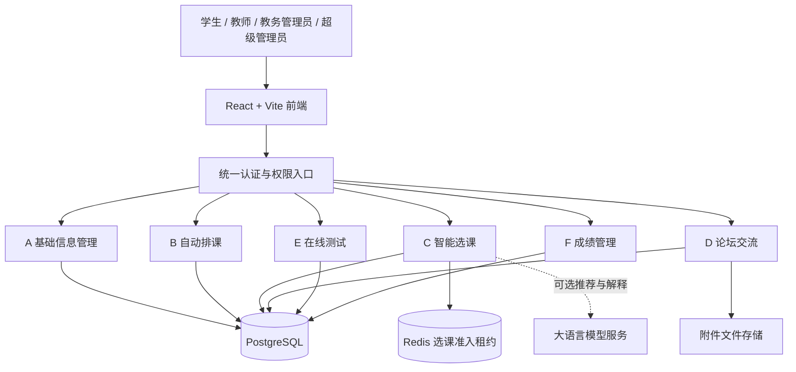
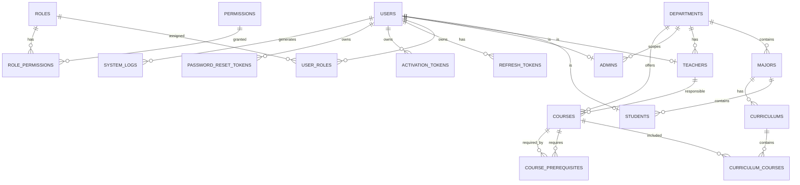
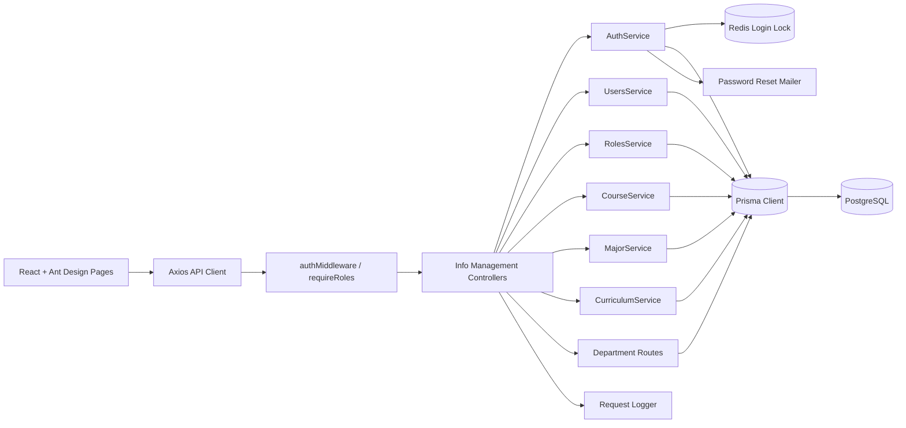
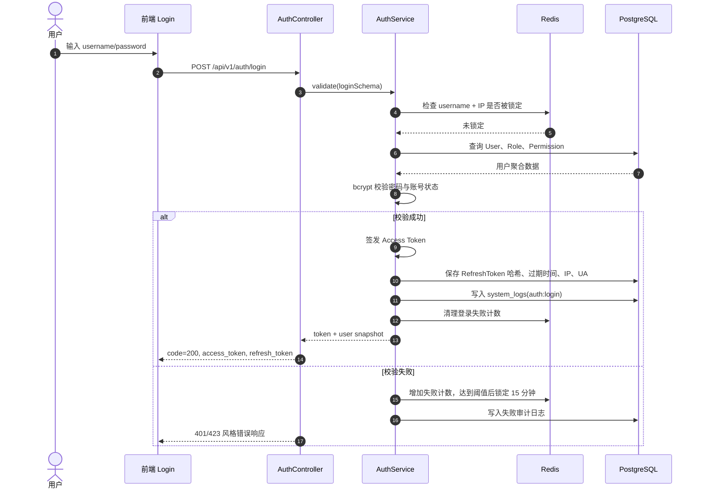
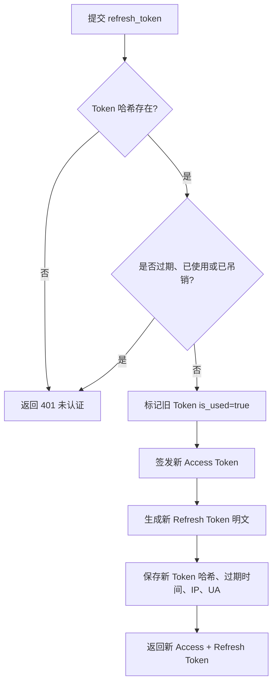
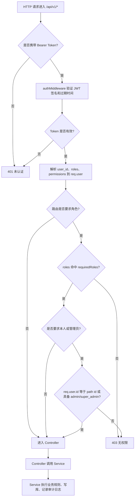
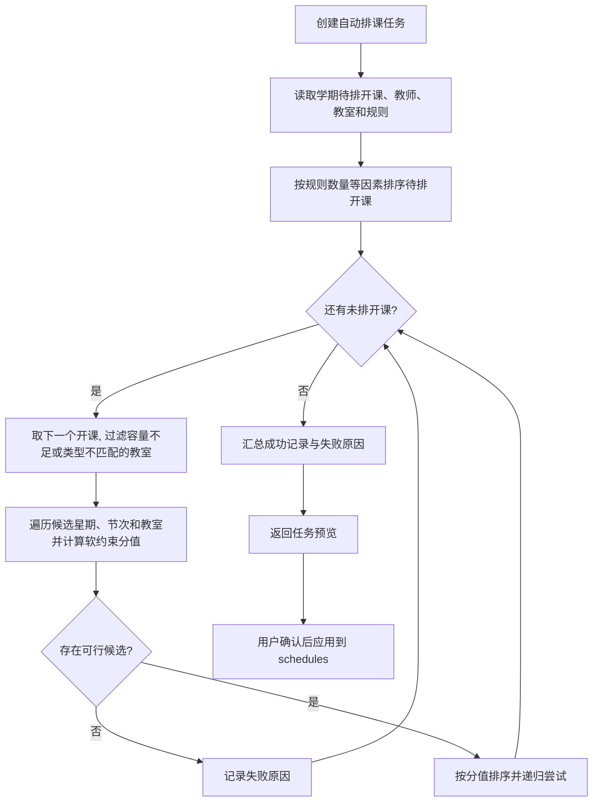
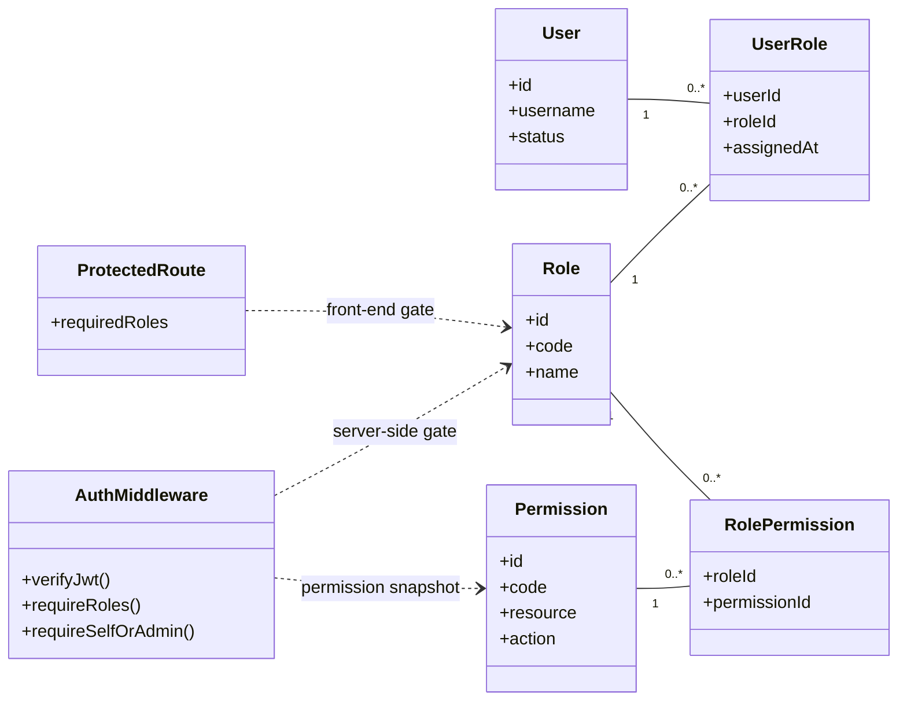
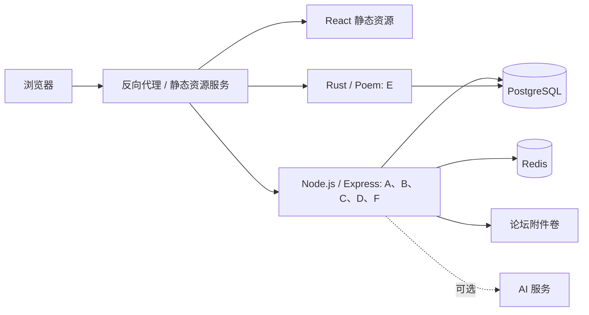

<style>
:root {
  --stss-bg: #f6f8fb;
  --stss-paper: #ffffff;
  --stss-ink: #172033;
  --stss-muted: #5f6b7a;
  --stss-line: #d9e2ef;
  --stss-primary: #1f5f99;
  --stss-primary-soft: #e8f2fb;
  --stss-accent: #2f7d59;
  --stss-accent-soft: #e8f5ee;
  --stss-code-bg: #111827;
  --stss-code-ink: #e5e7eb;
}

@media screen {
  body {
    max-width: 1120px;
    margin: 0 auto;
    padding: 48px 56px 80px;
    background:
      linear-gradient(180deg, rgba(232, 242, 251, 0.72), rgba(246, 248, 251, 0) 320px),
      var(--stss-bg);
    color: var(--stss-ink);
    font-family: "Inter", "Noto Sans SC", "PingFang SC", "Microsoft YaHei", system-ui, sans-serif;
    line-height: 1.72;
  }
}

@media print {
  @page {
    size: A4;
    margin: 18mm 15mm 20mm;
  }

  body {
    color: #111827;
    font-family: "Noto Sans SC", "PingFang SC", "Microsoft YaHei", system-ui, sans-serif;
    font-size: 10.5pt;
    line-height: 1.58;
  }

  h1,
  h2,
  h3,
  h4 {
    break-after: avoid;
  }

  table,
  pre,
  blockquote,
  .mermaid {
    break-inside: avoid;
  }

  body > :last-child {
    margin-bottom: 0 !important;
  }

  table.wide-table {
    width: 100% !important;
    max-width: 100% !important;
    font-size: 8.8pt;
  }

  table.extra-wide-table {
    table-layout: fixed;
    font-size: 7.6pt;
  }

  table.wide-table th,
  table.wide-table td {
    overflow-wrap: break-word;
    word-break: normal;
  }

  table.wide-table td code,
  table.wide-table th code {
    white-space: normal;
    overflow-wrap: anywhere;
    word-break: break-all;
  }

  .mermaid {
    padding: 10px;
    page-break-inside: avoid;
  }

  .mermaid svg {
    width: auto !important;
    max-height: 210mm;
  }
}

body {
  counter-reset: stss-h2;
}

h1 {
  margin: 0 0 28px;
  padding: 42px 36px;
  border: 1px solid var(--stss-line);
  border-radius: 18px;
  background:
    linear-gradient(135deg, rgba(31, 95, 153, 0.13), rgba(47, 125, 89, 0.12)),
    var(--stss-paper);
  box-shadow: 0 18px 45px rgba(23, 32, 51, 0.08);
  color: #10233d;
  font-size: 2.35rem;
  font-weight: 800;
  letter-spacing: 0;
  line-height: 1.22;
  text-align: center;
}

h1 + blockquote {
  margin: 0 0 36px;
  padding: 18px 24px;
  border: 1px solid #c9ddf1;
  border-left: 5px solid var(--stss-primary);
  border-radius: 12px;
  background: rgba(255, 255, 255, 0.88);
  box-shadow: 0 10px 28px rgba(23, 32, 51, 0.06);
  color: #29445f;
  font-size: 1.03rem;
}

h2 {
  margin: 46px 0 18px;
  padding: 0 0 10px;
  border-bottom: 2px solid #cfe0f4;
  color: var(--stss-primary);
  font-size: 1.62rem;
  font-weight: 760;
  letter-spacing: 0;
}

h2::before {
  content: "";
  display: inline-block;
  width: 8px;
  height: 1.12em;
  margin-right: 10px;
  border-radius: 6px;
  background: linear-gradient(180deg, var(--stss-primary), var(--stss-accent));
  vertical-align: -0.14em;
}

h3 {
  margin: 30px 0 12px;
  color: #1f3d5c;
  font-size: 1.26rem;
  font-weight: 720;
}

h4 {
  margin: 24px 0 10px;
  color: #24445f;
  font-size: 1.08rem;
  font-weight: 700;
}

p,
li {
  color: var(--stss-ink);
}

a {
  color: #1e68a8;
  text-decoration-color: rgba(30, 104, 168, 0.32);
  text-underline-offset: 3px;
}

hr {
  height: 1px;
  margin: 34px 0;
  border: 0;
  background: linear-gradient(90deg, transparent, #b8cbe1, transparent);
}

blockquote {
  margin: 18px 0;
  padding: 14px 18px;
  border-left: 4px solid var(--stss-accent);
  border-radius: 10px;
  background: var(--stss-accent-soft);
  color: #264d3a;
}

table {
  width: 100%;
  margin: 16px 0 24px;
  border-collapse: separate;
  border-spacing: 0;
  overflow: hidden;
  border: 1px solid var(--stss-line);
  border-radius: 12px;
  background: var(--stss-paper);
  box-shadow: 0 8px 22px rgba(23, 32, 51, 0.045);
  font-size: 0.95rem;
}

thead th,
tr:first-child th {
  background: linear-gradient(180deg, #edf5fc, #e5eef8);
  color: #18324d;
  font-weight: 720;
}

th,
td {
  padding: 10px 12px;
  border-right: 1px solid var(--stss-line);
  border-bottom: 1px solid var(--stss-line);
  vertical-align: top;
}

th:last-child,
td:last-child {
  border-right: 0;
}

tr:last-child td {
  border-bottom: 0;
}

tbody tr:nth-child(even) {
  background: #f9fbfe;
}

code {
  padding: 0.16em 0.38em;
  border-radius: 5px;
  background: #edf2f7;
  color: #9b2c2c;
  font-size: 0.92em;
}

pre {
  margin: 18px 0 26px;
  padding: 18px 20px;
  overflow: auto;
  border-radius: 14px;
  background: var(--stss-code-bg);
  box-shadow: 0 12px 30px rgba(17, 24, 39, 0.14);
}

pre code {
  padding: 0;
  background: transparent;
  color: var(--stss-code-ink);
  font-size: 0.9rem;
}

.mermaid {
  margin: 18px 0 28px;
  padding: 18px;
  border: 1px solid #cfe0f4;
  border-radius: 14px;
  background: #fbfdff;
  box-shadow: 0 8px 22px rgba(23, 32, 51, 0.05);
}
</style>

# Smart Teaching Service System 设计报告

> 本报告说明智慧教学服务系统的总体架构、数据模型、接口边界、组件划分和关键流程设计，用于指导实现、联调、测试和后续维护。


## 目录

- [0. 文档信息](#0.-文档信息)
- [1. 引言](#1.-引言)
- [2. 总体设计目标与约束](#2.-总体设计目标与约束)
- [3. 系统总体架构设计](#3.-系统总体架构设计)
- [4. 数据与类设计](#4.-数据与类设计)
- [5. 数据库设计](#5.-数据库设计)
- [6. 接口设计](#6.-接口设计)
- [7. 用户界面设计](#7.-用户界面设计)
- [8. 组件级设计](#8.-组件级设计)
- [9. 关键算法与流程设计](#9.-关键算法与流程设计)
- [10. 安全、权限与异常处理设计](#10.-安全权限与异常处理设计)
- [11. 部署设计](#11.-部署设计)
- [12. 需求到设计追踪矩阵](#12.-需求到设计追踪矩阵)
- [13. 设计风险与改进点](#13.-设计风险与改进点)
- [14. 附录](#14.-附录)

---

## 0. 文档信息

### 0.1 文档版本

| 版本 | 日期       | 作者   | 修改说明                                        |
| ---- | ---------- | ------ | ----------------------------------------------- |
| v1.0 | 2026-06-20 | 项目组 | 整合 A-F 子系统设计报告初稿                     |
| v1.1 | 2026-06-21 | 项目组 | 补充接口、数据表、组件和追踪矩阵设计内容        |
| v1.2 | 2026-06-22 | 项目组 | 整合 F 成绩管理模块的数据、接口、组件和流程设计 |
| v1.3 | 2026-06-22 | 项目组 | 校正 A-D 分组追踪、权限与选课关键设计           |
| v1.4 | 2026-06-22 | 项目组 | 完成总体、跨系统、安全、部署与附录设计          |

### 0.2 小组分工

| 子系统编号 | 子系统名称   | 负责小组 | 主要设计内容                                                        |
| ---------- | ------------ | -------- | ------------------------------------------------------------------- |
| A          | 基础信息管理 | A 组     | 用户、权限、课程、安全                                              |
| B          | 自动排课     | B 组     | 教室资源管理、自动排课算法与冲突检测、手动调课、课表查询与 CSV 导出 |
| C          | 智能选课     | C 组     | 培养方案、选课、AI 辅助                                             |
| D          | 论坛交流     | D 组     | 帖子、回复、检索、统计                                              |
| E          | 在线测试     | E 组     | 题库、组卷、答题、评分                                              |
| F          | 成绩管理     | F 组     | 成绩录入、修改、分析                                                |

---

## 1. 引言

### 1.1 设计目的

本文档用于说明 STSS 从需求到实现的主要设计方案，明确前后端模块、数据模型、接口、权限边界和关键业务流程之间的对应关系。开发、测试和联调阶段应以本文档作为模块协作和回归确认的设计依据。

### 1.2 设计范围

本文档覆盖 A-F 六个子系统的总体架构、核心领域对象、数据库表、后端接口、前端页面、组件依赖、权限设计和关键流程。各子系统在统一用户、课程、开课、排课、选课和成绩等核心数据模型上协作；本文档定义目标设计，实际完成度由代码、联调记录和测试证据另行验证。

### 1.3 参考文档

- 项目需求规格说明。
- 基础信息管理接口设计文档 v3.0.0，更新时间 2026-06-05。
- 数据库设计文档 v1.5.0，更新时间 2026-06-18。
- A 组基础信息管理子系统当前集成版本。
- UML 图建模语义参考 [OMG UML 2.5.1 Specification](https://www.omg.org/spec/UML/2.5.1/About-UML)。
- Markdown 图表语法参考 Mermaid 官方文档：[classDiagram](https://mermaid.js.org/syntax/classDiagram.html)、[erDiagram](https://mermaid.js.org/syntax/entityRelationshipDiagram.html)、[sequenceDiagram](https://mermaid.js.org/syntax/sequenceDiagram.html)、[flowchart](https://mermaid.js.org/syntax/flowchart.html)。

---

## 2. 总体设计目标与约束

### 2.1 设计目标

- 模块清晰，A-F 子系统职责明确。
- 支持统一用户、权限、课程基础数据。
- 支持系统扩展和后续维护。
- 支持基本安全控制和日志记录。
- 支持选课并发、排课冲突检测、成绩修改控制等关键场景。
- 对 AI 辅助功能保持可替换、可扩展设计。

### 2.2 设计约束

| 类别       | 约束说明                                                         |
| ---------- | ---------------------------------------------------------------- |
| 前端技术   | React、Vite、TypeScript、Ant Design                              |
| 后端技术   | Node.js、Express、TypeScript、Prisma                             |
| 数据库     | PostgreSQL                                                       |
| 部署环境   | 本地开发与 Docker 化运行环境                                     |
| AI 能力    | C 组选课辅助可调用大语言模型；不可用时降级为规则化说明           |
| 浏览器兼容 | 面向 Chrome、Edge 等现代桌面浏览器                               |
| 团队约束   | A-F 六组并行开发，需共享核心数据模型、统一接口风格和统一认证入口 |

### 2.3 设计原则

- 需求可追踪：设计元素应能对应到需求编号。
- 高内聚低耦合：每个子系统负责自己的核心业务。
- 统一身份与权限：A 子系统提供统一用户和权限基础。
- 接口清晰：跨子系统调用通过明确接口或共享数据结构完成。
- 可扩展：AI 辅助选课、成绩分析等能力应便于后续替换或增强。
- 可测试：关键模块应有明确输入、输出和异常路径。

---

## 3. 系统总体架构设计

### 3.1 系统架构概述

系统采用前后端分离、后端按业务域模块化组织的分层架构。所有用户从统一 Web 前端进入系统，前端依据登录身份加载可见菜单和路由；后端以 A-F 子系统为业务边界，复用认证、参数校验、日志、异常处理和数据访问等公共能力。各模块通过稳定的领域对象、接口契约和受控的数据读取协作，避免将跨模块规则分散在页面中。



架构层次及职责如下：

| 层次             | 主要组成                                  | 职责                                                                       |
| ---------------- | ----------------------------------------- | -------------------------------------------------------------------------- |
| 表现层           | React、Vite、Ant Design、路由与查询缓存   | 提供角色化页面、表单校验、加载与异常反馈；不承载最终权限判断和关键业务计算 |
| 接口层           | Express 路由与控制器、E 组 Poem 路由      | 解析请求、身份认证、参数校验、调用应用服务并返回统一响应                   |
| 业务层           | A-F 应用服务、领域规则和事务编排          | 实施用户权限、排课、选课、论坛、测试和成绩等业务约束                       |
| 数据与基础设施层 | Prisma、PostgreSQL、Redis、文件存储、日志 | 管理持久化、事务、选课临时准入、附件和审计信息                             |
| 外部能力层       | 可替换的大语言模型服务                    | 仅为 C 模块提供推荐与解释，不直接写入选课或成绩数据                        |

### 3.2 A-F 子系统关系图

| 提供方 | 使用方        | 共享对象或能力                         | 使用约束                                                                                |
| ------ | ------------- | -------------------------------------- | --------------------------------------------------------------------------------------- |
| A      | B、C、D、E、F | 用户、角色、院系、专业、课程、培养方案 | A 是身份与基础主数据的权威来源；其他模块只读取所需字段，不重复维护主数据                |
| B      | C、F          | 课程开设、排课、教室与教师安排         | C 用于时间冲突校验，F 用于教师归属和课程维度分析；已发布的排课变更须保留审计记录        |
| C      | F             | 有效选课记录、学生课表与在修状态       | F 仅基于有效选课记录生成成绩录入名单和在修学分统计                                      |
| F      | C             | 已确认或已提交的有效成绩               | C 仅在先修课校验时读取本人必要成绩状态和结果，不读取改分申请等敏感信息                  |
| D      | A、B          | 用户身份、课程开设与课程论坛范围       | 帖子和评论不复制用户资料；删除或停用主数据时通过状态控制保留历史讨论                    |
| E      | A、B、F       | 用户身份、课程开设、可选的测试成绩来源 | 试卷与测试结果独立管理；成绩同步必须经过明确映射和审批，不以页面展示数据直接覆盖 F 成绩 |

### 3.3 架构风格

- **分层架构**：控制器处理协议转换，服务层处理业务规则，数据访问层处理持久化，前端仅负责交互和展示。
- **模块化单体**：A-F 以独立路由、服务、数据表和前端页面组织，在统一认证和基础设施下协作；模块间不允许直接依赖对方页面状态。
- **领域主数据归属**：用户、课程和培养方案归 A；教室、排课归 B；选课归 C；论坛归 D；测试归 E；成绩归 F。跨模块读取使用明确的数据契约，写入只由数据所有者执行。
- **事务优先于最终一致性**：选课容量、成绩审批、帖子与附件绑定等同一业务域内操作必须在数据库事务中完成；跨域衍生展示数据按请求读取或受控刷新，避免无依据的双写。
- **可替换外部能力**：AI 推荐作为 C 的可选适配器，失败时降级为规则化说明，且永不绕过选课约束。

### 3.4 关键架构决策

| 决策编号 | 决策内容                               | 原因                                                         | 影响范围         |
| -------- | -------------------------------------- | ------------------------------------------------------------ | ---------------- |
| AD-01    | 统一用户与权限由 A 子系统管理          | 避免各子系统重复维护身份、角色和令牌                         | A-F              |
| AD-02    | 课程、专业和培养方案由 A 作为主数据源  | 保证课程编码、学分和先修关系在排课、选课和成绩场景中一致     | A、B、C、D、E、F |
| AD-03    | 选课以排课结果和数据库事务作为准入基础 | 选课需要校验时间冲突、容量、学分和先修课，并防止并发超选     | B、C、F          |
| AD-04    | 选课高峰采用 Redis 租约控制并发进入    | 将页面准入与选课事务分离，降低瞬时访问对数据库造成的压力     | C                |
| AD-05    | 成绩修改采用申请和审批机制             | 避免已提交成绩被直接覆盖，保证变更可审计、可追溯             | F                |
| AD-06    | 在线测试与成绩管理保持独立边界         | 测试结果可作为成绩来源，但同步前必须明确映射、权限和审核规则 | E、F             |
| AD-07    | AI 推荐不直接写业务数据                | 推荐结果不可替代容量、先修课、时间冲突和权限校验             | C                |

---

## 4. 数据与类设计

### 4.1 核心领域对象总览

| 类名                 | 所属子系统  | 说明                                                                 |
| -------------------- | ----------- | -------------------------------------------------------------------- |
| User                 | A           | 系统用户基类                                                         |
| Role / Permission    | A           | 统一角色、权限及其关联，支撑所有受保护接口的授权判断                 |
| Student              | A/C/F       | 学生用户                                                             |
| Teacher              | A/B/D/E/F   | 教师用户                                                             |
| Course               | A/B/C/D/E/F | 课程基础信息                                                         |
| Classroom            | B           | 教室资源                                                             |
| CourseOffering       | B/C/D/E/F   | 指定学期的课程开设教学班，关联教师、容量、排课、论坛、测试和选课记录 |
| Schedule             | B/C         | 排课结果                                                             |
| Curriculum           | A/C/F       | 按专业和年份定义学分要求与课程清单的培养方案                         |
| CurriculumCourse     | A/C/F       | 培养方案与课程的关联，保存课程类别和建议修读学期                     |
| Enrollment           | C/F         | 学生选课记录                                                         |
| SelectionPeriod      | C           | 选课阶段时间窗口、学分上限和启用状态                                 |
| AiAdvisorEndpoint    | C           | 提供推荐和解释的无副作用 AI 接口边界                                 |
| Post                 | D           | 论坛帖子                                                             |
| ForumComment         | D           | 论坛树形评论，关联帖子、作者及父评论                                 |
| Question             | E           | 题目                                                                 |
| Paper                | E           | 试卷                                                                 |
| TestResult           | E           | 学生一次试卷作答、计时和自动评分结果                                 |
| Score                | F           | 成绩记录                                                             |
| ScoreModificationLog | F           | 成绩审批后的变更快照与审计记录                                       |

领域对象按数据所有权划分：A 维护身份和教学主数据，B 维护资源与排课，C 维护选课事务，D 维护讨论内容，E 维护测试过程与结果，F 维护正式成绩及其变更记录。跨域关联仅保存稳定标识并由所属模块校验业务规则；例如 `Enrollment` 关联学生和 `CourseOffering`，但不会复制学生姓名、课程名称或成绩明细。

### 4.2 A 基础信息管理数据/类设计

A 子系统是 STSS 的身份、权限和基础主数据中心。以下设计以基础信息管理接口设计文档 v3.0.0 和数据库设计文档 v1.5.0 为准；若实现代码与文档存在细微差异，本节采用文档口径。

图示约定：类图采用 UML 类、关联、组合和多重性表达；实体关系图采用 Crow's Foot 多重性表达；Markdown 落地语法使用 Mermaid。

#### 4.2.1 A 子系统核心类图


#### 4.2.2 主要设计类

| 类名                 | 职责                         | 关键属性                                                                                                       | 主要行为/设计约束                                                            |
| -------------------- | ---------------------------- | -------------------------------------------------------------------------------------------------------------- | ---------------------------------------------------------------------------- |
| `User`               | 所有登录主体的统一身份根对象 | `id`, `username`, `passwordHash`, `realName`, `email`, `phone`, `gender`, `status`, `lastLoginAt`, `deletedAt` | 登录认证、密码修改、状态变更、软删除；用户名和邮箱保持唯一；密码只保存哈希   |
| `Student`            | 学生身份扩展信息             | `userId`, `studentNumber`, `majorId`, `grade`, `className`                                                     | 与 `User` 一对一；学号唯一；专业变更必须引用有效 `Major`                     |
| `Teacher`            | 教师身份扩展信息             | `userId`, `teacherNumber`, `departmentId`, `title`, `officeLocation`                                           | 与 `User` 一对一；工号唯一；为课程负责人、排课、题库和成绩模块提供教师主数据 |
| `Admin`              | 管理员身份扩展信息           | `userId`, `adminType`, `departmentId`                                                                          | 支持 `ACADEMIC`、`SUPER`、`SECURITY` 类型；超级管理员负责全局高危操作        |
| `Role`               | RBAC 角色聚合根              | `id`, `code`, `name`, `description`                                                                            | 管理角色生命周期；内置角色包括 `student`、`teacher`、`admin`、`super_admin`  |
| `Permission`         | 可授权操作的最小粒度         | `id`, `code`, `resource`, `action`                                                                             | 权限编码采用 `resource:action`，如 `user:create`、`course:delete`            |
| `UserRole`           | 用户与角色的关联类           | `userId`, `roleId`, `assignedAt`                                                                               | 复合主键防止重复授权；删除用户或角色时级联删除                               |
| `RolePermission`     | 角色与权限的关联类           | `roleId`, `permissionId`                                                                                       | 复合主键防止重复分配；撤销权限时需保护超级管理员关键权限                     |
| `Department`         | 院系主数据                   | `id`, `code`, `name`, `description`                                                                            | 关联专业、教师、管理员和课程；删除前必须满足无关联资源约束                   |
| `Major`              | 专业主数据                   | `id`, `departmentId`, `code`, `name`, `degreeType`, `totalCredits`                                             | 属于一个院系；关联学生和培养方案；删除前必须无关联学生                       |
| `Course`             | 课程基础主数据               | `id`, `code`, `name`, `credits`, `hours`, `courseType`, `category`, `departmentId`, `teacherId`, `status`      | 支撑 B/C/D/E/F 子系统；课程代码唯一；删除前不能被培养方案引用                |
| `CoursePrerequisite` | 课程先修关系                 | `courseId`, `prerequisiteId`                                                                                   | 课程自关联多对多；复合主键约束同一先修关系只能出现一次                       |
| `Curriculum`         | 培养方案聚合根               | `id`, `majorId`, `name`, `year`, `totalCredits`, `requiredCredits`, `electiveCredits`                          | 按专业和年份维护培养方案；通过 `CurriculumCourse` 纳入课程                   |
| `CurriculumCourse`   | 培养方案课程关联类           | `curriculumId`, `courseId`, `courseType`, `semesterSuggestion`                                                 | 复合主键；保存课程类别和建议修读学期                                         |
| `RefreshToken`       | 长期会话令牌                 | `id`, `userId`, `tokenHash`, `expiresAt`, `isUsed`, `lastUsedAt`, `revokedAt`                                  | 只存哈希；刷新后旧令牌标记已使用；可按用户或单令牌吊销                       |
| `ActivationToken`    | 兼容历史账号激活流程         | `id`, `userId`, `tokenHash`, `expiresAt`, `isUsed`                                                             | 保留兼容接口；删除用户时级联删除                                             |
| `PasswordResetToken` | 密码重置凭证                 | `id`, `userId`, `tokenHash`, `expiresAt`, `isUsed`                                                             | 支持忘记密码流程；一次性使用；只保存哈希                                     |
| `SystemLog`          | 安全审计与操作追踪           | `id`, `userId`, `action`, `resourceType`, `resourceId`, `ipAddress`, `userAgent`, `details`, `createdAt`       | 记录认证、用户状态、角色、院系专业变更等关键操作                             |

#### 4.2.3 主要数据表

| 表名          | 说明           | 关键字段                                                                                | 主要关联                                                                        |
| ------------- | -------------- | --------------------------------------------------------------------------------------- | ------------------------------------------------------------------------------- |
| `users`       | 用户统一身份表 | `id`, `username`, `password_hash`, `real_name`, `status`, `deleted_at`                  | `students`, `teachers`, `admins`, `user_roles`, `refresh_tokens`, `system_logs` |
| `students`    | 学生扩展表     | `user_id`, `student_number`, `major_id`, `grade`, `class_name`                          | `users`, `majors`                                                               |
| `teachers`    | 教师扩展表     | `user_id`, `teacher_number`, `department_id`, `title`, `office_location`                | `users`, `departments`, `courses`                                               |
| `admins`      | 管理员扩展表   | `user_id`, `admin_type`, `department_id`                                                | `users`, `departments`                                                          |
| `roles`       | 角色表         | `id`, `code`, `name`, `description`                                                     | `user_roles`, `role_permissions`                                                |
| `permissions` | 权限表         | `id`, `code`, `resource`, `action`                                                      | `role_permissions`                                                              |
| `departments` | 院系表         | `id`, `code`, `name`, `description`                                                     | `majors`, `teachers`, `admins`, `courses`                                       |
| `majors`      | 专业表         | `id`, `department_id`, `code`, `name`, `degree_type`, `total_credits`                   | `departments`, `students`, `curriculums`                                        |
| `courses`     | 课程基础信息表 | `id`, `code`, `name`, `credits`, `course_type`, `department_id`, `teacher_id`, `status` | `departments`, `teachers`, `course_prerequisites`, `curriculum_courses`         |
| `curriculums` | 培养方案表     | `id`, `major_id`, `name`, `year`, `total_credits`                                       | `majors`, `curriculum_courses`                                                  |
| `system_logs` | 系统日志表     | `id`, `user_id`, `action`, `resource_type`, `resource_id`, `details`                    | `users`                                                                         |

### 4.3 B 自动排课数据/类设计

B 自动排课子系统以 A 子系统维护的课程、开课、教师等基础数据为输入，围绕“教室资源 - 排课记录 - 排课规则 - 课表视图”组织领域对象。持久化实体复用项目统一的 Prisma + PostgreSQL 数据模型（`Classroom`、`Schedule`、`Rule`），并依赖 `CourseOffering`、`Course`、`Teacher`、`Semester` 等 A/C 共用实体。

#### 4.3.1 主要设计类

| 类名            | 职责                             | 主要属性                                                                                        | 主要方法/行为                                                 |
| --------------- | -------------------------------- | ----------------------------------------------------------------------------------------------- | ------------------------------------------------------------- |
| Classroom       | 表示一间可排课的教室资源         | id, building, roomNumber, campus, capacity, roomType, equipment, status                         | 创建/编辑教室、按条件查询、切换可用状态、提供可用资源池       |
| Schedule        | 表示一条课程时间地点安排         | id, courseOfferingId, classroomId, dayOfWeek, startWeek, endWeek, startPeriod, endPeriod, notes | 写入排课结果、调整时间或教室、按教师/教室聚合查询             |
| CourseOffering  | 待排开课（A/C 共用实体）         | id, courseId, semesterId, teacherId, capacity, status                                           | 提供待排课程的容量、授课教师和所属学期                        |
| Rule            | 排课规则实体                     | id, targetType, targetId, rules, createdAt, updatedAt                                           | 保存课程或教师维度的硬约束和软约束，供自动排课读取            |
| SchedulingTask  | 自动排课控制类，组织一次排课求解 | semesterId, courseOfferingIds, status, progress, successRate, failures                          | 创建异步任务、加载待排开课与教室、生成预览、应用结果          |
| ConflictChecker | 冲突检测服务类                   | —                                                                                               | 手动排课检测教室时间冲突；自动排课检测任务内教师/教室候选占用 |
| Timetable       | 课表视图边界类                   | dimension(classroom/courseOffering/global), items                                               | 按综合、教室或课程开设维度汇总排课记录，支持 CSV 导出         |

#### 4.3.2 关系说明

`Classroom` 与 `Schedule` 是一对多关系：一间教室可承载多条排课记录，每条排课记录占用唯一教室。当前教室资源通过状态维护是否参与排课，不提供教室删除接口。`CourseOffering` 与 `Schedule` 也是一对多关系：一个开课可能拆分为多条时间段安排（例如不同周次或不同节次），删除开课时其排课记录级联删除。`Schedule` 通过 `courseOfferingId` 间接关联 `Course`（课程名称、类型）、`Teacher`（授课教师）和 `Semester`（学期范围），这些信息由 A/C 子系统维护，B 子系统只读引用。`Rule` 通过 `targetType + targetId` 唯一约束保存课程或教师维度的排课规则。

`SchedulingTask`、`ConflictChecker`、`Timetable` 是分析层控制/边界类，不一定独立落库：`SchedulingTask` 创建后先生成预览结果，用户确认应用时再写入 `Schedule`；`Timetable` 在查询时只读聚合 `Schedule` 生成课表列表或导出 CSV。

冲突检测是排课核心，当前代码覆盖以下情况：

- **手动排课教室时间冲突**：同一教室在相同周次区间、相同星期、相同节次区间已被排课占用。
- **手动排课教室状态不可用**：新增排课时目标教室不存在或不处于可用状态。
- **自动排课任务内占用冲突**：同一自动排课任务内，同一候选时段不重复使用同一教室或同一教师。
- **自动排课容量不匹配**：自动排课不选择容量小于开课容量的教室。
- **自动排课教室类型不匹配**：课程规则指定教室类型时，不选择其他类型的教室。

时间冲突的判定基于周次区间 `[startWeek, endWeek]` 与节次区间 `[startPeriod, endPeriod]` 的双重重叠，且星期相同；任一区间不重叠即视为不冲突。数据模型在 `Schedule` 上建立 `(classroomId, dayOfWeek, startWeek, endWeek, startPeriod, endPeriod)` 复合索引以加速冲突检测查询。

### 4.4 C 智能选课数据/类设计

#### 4.4.1 主要设计类

| 类名                 | 职责                 | 主要属性                                                                                                       | 主要行为                                                               |
| -------------------- | -------------------- | -------------------------------------------------------------------------------------------------------------- | ---------------------------------------------------------------------- |
| Student              | 表示当前登录学生身份 | userId, studentNumber, majorId, grade, className                                                               | 匹配培养方案、限定本人选课数据                                         |
| Teacher              | 表示教师身份         | userId, teacherNumber, departmentId, title                                                                     | 校验名单查询和导出归属                                                 |
| AcademicAdmin        | 表示学术教务管理员   | userId, adminType                                                                                              | 阶段管理和手动加课权限校验                                             |
| Course               | 课程基础信息         | id, code, name, credits, courseType, status                                                                    | 搜索、详情、学分计算、状态和先修关系校验                               |
| Curriculum           | 培养方案             | id, majorId, name, year, totalCredits, requiredCredits, electiveCredits                                        | 根据学生专业和年级匹配培养方案                                         |
| CurriculumCourse     | 培养方案课程关系     | curriculumId, courseId, courseType, semesterSuggestion                                                         | 分组展示、判断课程是否在培养方案内                                     |
| CourseOffering       | 课程开设             | id, courseId, semesterId, teacherId, capacity, enrolledCount, status                                           | 展示容量和状态；选课事务更新已选人数                                   |
| Schedule             | 排课时间             | courseOfferingId, classroomId, dayOfWeek, startWeek, endWeek, startPeriod, endPeriod                           | 详情展示、课表生成、时间冲突检测                                       |
| Enrollment           | 选课记录             | id, studentId, courseOfferingId, status, enrolledAt, droppedAt                                                 | 选课、退课、恢复、结果查询和成绩引用                                   |
| SelectionPeriod      | 选课阶段             | id, semesterId, phase, startTime, endTime, maxCredits, allowDrop, maxActiveUsers, idleTimeoutSeconds, isActive | 控制开放窗口、阶段、学分上限、退课开关和选课准入容量                   |
| SelectionAccessLease | 选课准入租约         | periodId, userId, leaseId, acquiredAt, lastActiveAt, expiresAt                                                 | 原子控制活跃选课人数；心跳续租，超时自动释放名额                       |
| SystemLog            | 审计记录             | userId, action, resourceType, resourceId, details                                                              | 记录阶段管理和手动加课                                                 |
| AiAdvisorEndpoint    | AI 接口边界          | recommend, explain                                                                                             | 支持 `full`、`rule_only`、`template_only` 的降级模式返回建议与风险说明 |

#### 4.4.2 关系说明

学生通过 `Student.majorId` 和 `Student.grade` 匹配 `Curriculum`。培养方案通过 `CurriculumCourse` 关联课程并保存课程类型和建议修读学期。`CourseOffering` 关联课程、学期、教师和排课时间，`Enrollment` 关联学生与课程开设。

选课事务以 `Enrollment` 与 `CourseOffering.enrolledCount` 一致为核心。创建或恢复有效选课记录时增加已选人数，退课时把记录置为 `DROPPED` 并减少已选人数。时间冲突来自目标开课和本人已选开课的 `Schedule` 重叠判断，最大学分由当前开放阶段的 `SelectionPeriod.maxCredits` 控制；是否允许退课由同一阶段的 `allowDrop` 配置决定。

先修课校验读取 F 模块中该学生对先修课程的有效成绩：`SUBMITTED` 或 `CONFIRMED` 且总评达到及格线；如后续维护等价课程映射，则等价课程的有效通过记录同样可满足先修要求。选课准入不使用关系型持久化表，而以 Redis 中按选课阶段分区的 `SelectionAccessLease` 租约管理活跃人数和空闲超时；AI 推荐、手动加课申请和培养方案确认不新增独立持久化表。

### 4.5 D 论坛交流数据/类设计

D 论坛交流子系统围绕课程开设 `CourseOffering` 建立讨论空间。系统不单独维护 Forum 实体，而是以“课程开设 + 帖子集合”的方式表达课程论坛；公告、普通帖子、评论、附件和统计均围绕 `ForumPost` 展开。

#### 4.5.1 主要设计类

| 类名            | 职责                         | 主要属性                                                                                                                    | 主要方法/行为                                          |
| --------------- | ---------------------------- | --------------------------------------------------------------------------------------------------------------------------- | ------------------------------------------------------ |
| ForumPost       | 表示课程论坛中的帖子或公告   | id, courseOfferingId, authorId, title, content, postType, isPinned, isAnnouncement, viewCount, status, createdAt, updatedAt | 创建帖子、编辑帖子、查询详情、软删除、置顶、浏览量递增 |
| ForumComment    | 表示帖子下的评论和楼中楼回复 | id, postId, authorId, parentId, content, depth, status, createdAt                                                           | 创建评论、构建评论树、删除本人评论、隐藏/恢复违规评论  |
| ForumAttachment | 表示帖子附件或发帖前临时附件 | id, postId, fileName, filePath, fileSize, fileType, uploadedAt                                                              | 上传附件、批量上传、绑定帖子、删除附件、供前端下载     |
| Announcement    | 公告视图对象，复用 ForumPost | isAnnouncement=true, postType=ANNOUNCEMENT, isPinned                                                                        | 发布公告、更新公告、删除公告、按课程优先展示置顶公告   |
| SearchQuery     | 帖子检索条件对象             | keyword, courseOfferingId, authorId, postType, startDate, endDate, page, pageSize, sortBy                                   | 校验检索参数、组合查询条件、分页返回结果               |
| ForumStatistic  | 统计结果对象                 | totalPosts, totalComments, totalAttachments, activeUsers, hotPosts, courseActivity                                          | 综合统计、热帖排行、用户统计、课程活跃度统计、CSV 导出 |
| ForumPermission | 论坛权限判断对象             | userId, roles, authorId, courseOfferingId                                                                                   | 判断作者本人、教师、`admin`、`super_admin` 的操作边界  |

#### 4.5.2 关系说明

`ForumPost` 与 `CourseOffering` 为多对一关系，同一课程开设下可以包含多条帖子和公告；`ForumPost.authorId` 关联 A 子系统的用户身份，用于展示作者和进行本人权限判断。公告不单独建表，而是通过 `ForumPost.isAnnouncement` 和 `PostType.ANNOUNCEMENT` 区分，避免公告与普通帖子在查询、置顶、权限和统计上产生重复模型。

`ForumComment` 与 `ForumPost` 为多对一关系，评论通过 `parentId` 自关联形成树形回复结构，并用 `depth` 辅助前端缩进展示。删除帖子时评论随帖子级联删除；普通用户可删除本人评论，`admin` 或 `super_admin` 可隐藏和恢复评论。普通评论列表只返回 `NORMAL` 状态内容，隐藏或删除内容不会继续污染普通用户视图。

`ForumAttachment` 与 `ForumPost` 为可选多对一关系。附件上传后可以先以 `postId = null` 保存，待用户提交帖子时再批量绑定到帖子；如果用户取消发帖，可删除未绑定附件。附件元数据保存文件名、路径、大小和 MIME 类型，实际文件存放在后端上传目录中。

当前检索采用数据库标题/正文关键词匹配，并叠加课程、作者、帖子类型、时间范围和排序条件；不单独维护搜索索引表。统计类不作为独立持久化表，而是基于 `forum_posts`、`forum_comments`、`forum_attachments` 和课程/用户关联实时聚合生成。

### 4.6 E 在线测试数据/类设计

E 在线测试子系统围绕“题库 - 试卷 - 答题结果 - 单题答案”组织领域对象。后端实现采用 Rust + Poem OpenAPI，数据持久化使用 PostgreSQL。

#### 4.6.1 主要设计类

| 类名           | 职责                      | 主要属性                                                                                          | 主要方法/行为                                  |
| -------------- | ------------------------- | ------------------------------------------------------------------------------------------------- | ---------------------------------------------- |
| QuestionBank   | 管理课程下的题库集合      | id, courseId, creatorId, name, description, status                                                | 创建题库、查询题库、删除空题库、统计题目数量   |
| Question       | 表示一道测试题            | id, bankId, questionType, content, answer, explanation, defaultPoints, difficulty, knowledgePoint | 创建题目、修改题目、查询详情、删除题目         |
| QuestionOption | 保存选择题/判断题选项     | id, questionId, optionText, optionOrder, isCorrect                                                | 按题目顺序返回选项、标记正确选项               |
| TestPaper      | 表示一份试卷              | id, courseOfferingId, creatorId, title, totalPoints, durationMinutes, startTime, endTime, status  | 创建试卷、更新配置、发布试卷、关闭试卷         |
| TestQuestion   | 维护试卷与题目的组合关系  | id, testPaperId, questionId, orderNum, points                                                     | 手动加入题目、自动抽题加入、移除题目、重排题号 |
| TestResult     | 表示学生一次答题会话/结果 | id, testPaperId, studentId, startTime, submitTime, totalScore, status, timeSpentSeconds           | 开始答题、恢复未完成答题、提交后更新总分和状态 |
| Answer         | 保存一次答题中的单题答案  | id, testResultId, testQuestionId, studentAnswer, isCorrect, score                                 | 保存学生答案、记录判题结果和单题得分           |

#### 4.6.2 关系说明

题库与题目是一对多关系，一个 `QuestionBank` 下包含多道 `Question`。题目与试卷不是直接嵌套关系，而是通过 `TestQuestion` 建立组合关系：一道题可以被多份试卷复用，一份试卷也可以包含多道题，因此逻辑上是多对多，关联表额外保存题号和本卷分值。

学生开始答题时创建或复用一条 `TestResult`，系统返回不含正确答案标记的题目与选项。学生提交后，系统将每一道题的作答写入 `Answer` 表，同时更新 `TestResult.totalScore`、`submitTime`、`status` 和 `timeSpentSeconds`，形成可追溯的答题记录。

自动评分目前覆盖单选题、多选题和判断题。单选题、判断题按选项序号直接比较；多选题先对学生答案和标准答案的序号集合排序，再进行集合一致性比较。完全正确得该题满分，错误或未作答得 0 分。

### 4.7 F 成绩管理数据/类设计

F 模块以 `CourseOffering`、`Enrollment` 和 `Score` 为核心对象。教师以选课记录 `Enrollment` 生成指定开课下的成绩录入名单，再为每位学生创建或更新 `Score`。学生成绩查询与分析不新增独立持久化成绩表，而是在 `Score`、`Enrollment`、`CourseOffering`、`Course`、`Semester`、`Student`、`Major`、`Curriculum` 和 `CurriculumCourse` 上构建只读查询模型。

#### 4.7.1 主要设计类

| 类名                       | 职责                                             | 主要属性                                                                                                   | 主要行为                                                                           |
| -------------------------- | ------------------------------------------------ | ---------------------------------------------------------------------------------------------------------- | ---------------------------------------------------------------------------------- |
| `CourseOffering`           | 表示一次课程开设，是成绩录入和课程分析的业务边界 | id、courseId、semesterId、teacherId、capacity、status                                                      | 限定教师录入和分析范围，关联选课记录和成绩记录                                     |
| `Enrollment`               | 表示学生选课记录，是成绩录入名单来源             | id、studentId、courseOfferingId、status                                                                    | 提供已选学生名单，保证只给已选课学生录入成绩                                       |
| `Score`                    | 表示学生在一次开课中的成绩记录                   | usualScore、midtermScore、finalScore、totalScore、gradePoint、gradeLetter、status                          | 保存草稿、提交成绩；提交后禁止通过普通录入接口直接修改                             |
| `ScoreStatus`              | 表示持久化成绩生命周期                           | DRAFT、SUBMITTED、CONFIRMED                                                                                | 控制成绩是否可编辑、可提交或只读；`EMPTY` 仅为尚无 `Score` 时的录入列表展示状态    |
| `Teacher`                  | 表示任课教师身份                                 | userId、teacherNumber                                                                                      | 校验教师是否有权录入或分析当前开课成绩                                             |
| `ScoreModificationRequest` | 表示待审批的成绩修改申请逻辑对象                 | proposedChanges、reason、applicantId、appliedAt                                                            | 保存于 `Score.modificationRequest`，承载拟修改分项成绩、申请原因、申请人和申请时间 |
| `ScoreModificationLog`     | 表示审批通过后的成绩修改日志                     | scoreId、modifierId、oldValue、newValue、reason、createdAt                                                 | 记录修改前后快照、修改原因、审批人和时间，支持成绩追溯                             |
| `SystemLog`                | 表示系统审计日志                                 | userId、action、resourceType、resourceId、details、createdAt                                               | 记录改分申请提交、审批通过和审批驳回等敏感操作                                     |
| `ScoreQueryCriteria`       | 表示学生成绩查询条件                             | page、pageSize、semesterId、keyword                                                                        | 限制分页规模，按学期、课程代码或课程名称筛选本人可见成绩                           |
| `EffectiveScoreRule`       | 表示有效成绩选择规则                             | submittedStatuses、passLine、courseId、totalScore、enteredAt、modifiedAt                                   | 同一课程多次成绩时选择参与 GPA、均分、学分和分析统计的一条成绩                     |
| `ScoreSummary`             | 表示学业概况摘要                                 | gpa、averageScore、earnedCredits、passedCredits、inProgressCredits、remainingRequiredCredits               | 汇总 GPA、平均分、通过/不及格课程数、已获/在修/剩余学分和培养方案进度              |
| `CurriculumProgress`       | 表示培养方案完成情况                             | curriculumId、totalRequiredCredits、requiredCredits、electiveCredits、completedCourseCount、completionRate | 根据培养方案课程和有效成绩计算必修、选修和总学分完成情况                           |
| `StudentScoreAnalytics`    | 表示学生个人成绩分析结果                         | semesterTrend、scoreDistribution、courseTypeBreakdown                                                      | 生成学期 GPA/均分/学分趋势、五档成绩分布和课程类型统计                             |
| `CourseScoreAnalysis`      | 表示课程成绩分析结果                             | totalStudents、submittedCount、averageScore、maxScore、minScore、passCount、failCount、rankingTop10        | 按课程开设统计成绩概况、分布和总评排名前 10 名学生                                 |
| `StudentScoreAdapter`      | 适配学生端成绩接口与视图模型                     | 成绩列表、摘要和分析响应                                                                                   | 将后端 DTO 转换为前端成绩列表、学业摘要和分析视图模型                              |

#### 4.7.2 关系说明

成绩修改以 `Score` 为核心对象。提交修改申请时，系统不直接更新正式成绩字段，而是将申请保存到 `Score.modificationRequest`，因此一条成绩同一时间最多存在一个待审批申请。管理员审批通过后，系统将新的平时、期中、期末成绩写回 `Score`，由后端重新计算 `totalScore`、`gradePoint` 和 `gradeLetter`，更新 `modifiedAt`、`modifiedBy`，并清空 `modificationRequest`。`ScoreModificationLog` 与 `Score` 为一对多关系，用于记录审批通过后的前后差异；`SystemLog` 记录申请提交、审批通过和审批驳回等敏感操作。

学生端只读取 `SUBMITTED` 或 `CONFIRMED` 状态的成绩；`DRAFT` 成绩既不会返回给学生，也不参与 GPA、均分、学分进展和个人分析。同一学生同一课程存在多条可见成绩时，`EffectiveScoreRule` 优先选择总评较高的记录；总评相同时选择最近修改或录入的记录。`ScoreSummary` 和 `StudentScoreAnalytics` 复用该规则；`CourseScoreAnalysis` 按课程开设读取当前 `ENROLLED` 学生人数和已提交/已确认成绩，教师访问时额外校验课程开设的 `teacherId`。

---

## 5. 数据库设计

### 5.1 数据库总体说明

系统使用 PostgreSQL 保存业务主数据和交易数据。关系表采用单数或复数一致的 `snake_case` 命名，主键使用 UUID，跨模块关联使用稳定的业务实体 ID；时间字段统一采用带时区的时间类型并由服务端生成。金额或学分等需要精确计算的字段采用 `Decimal`，不得使用浮点数累积计算。

数据完整性由以下规则共同保证：

| 规则类别   | 设计规定                                                                                               |
| ---------- | ------------------------------------------------------------------------------------------------------ |
| 主数据归属 | A 维护用户、角色、课程、院系、专业和培养方案；其他模块只引用其标识，不维护重复副本                     |
| 参照完整性 | 外键约束与服务层存在性校验共同保证引用合法；对需要保留历史的业务实体使用状态或软删除，而非直接物理删除 |
| 唯一性     | 用户名、邮箱、学号、工号、课程代码、角色代码以及学生-课程开设选课关系等使用唯一约束防止重复数据        |
| 事务边界   | 选课与容量更新、成绩审批与审计日志、帖子创建与附件绑定等操作在同一数据库事务中提交或回滚               |
| 审计与追溯 | 用户权限、主数据、选课管理和成绩审批等敏感操作写入 `system_logs` 或业务专用审计表                      |
| 查询与性能 | 列表、筛选和关联查询字段建立必要索引；统计结果优先按请求聚合，缓存或物化视图必须明确刷新策略           |

### 5.2 A 基础信息管理数据表

A 子系统数据库基于 PostgreSQL 与 Prisma Schema 设计。主键默认采用 UUID；`system_logs.id` 采用自增 BIGSERIAL；接口响应统一转换为 snake_case。用户删除采用 `users.deleted_at` 软删除，用户相关角色、令牌和身份扩展表按外键规则级联清理，日志中的用户引用采用置空策略保留审计事实。

#### 5.2.1 A 子系统 E-R 图



#### 5.2.2 A 子系统表设计

| 表名                    | 字段                                                                                                                                                                         | 类型                                               | 约束                                                                                                                       | 说明                                                                     |
| ----------------------- | ---------------------------------------------------------------------------------------------------------------------------------------------------------------------------- | -------------------------------------------------- | -------------------------------------------------------------------------------------------------------------------------- | ------------------------------------------------------------------------ |
| `users`                 | `id`, `username`, `password_hash`, `email`, `phone`, `real_name`, `avatar_url`, `gender`, `status`, `last_login_at`, `deleted_at`, `created_at`, `updated_at`                | UUID, VARCHAR, ENUM, TIMESTAMP                     | `id` PK；`username` UNIQUE；`email` UNIQUE；索引：`status`, `deleted_at`, `real_name`, `created_at`                        | 系统统一用户身份表；`deleted_at` 支持软删除；密码仅保存哈希              |
| `students`              | `user_id`, `student_number`, `major_id`, `grade`, `class_name`                                                                                                               | UUID, VARCHAR, INT                                 | `user_id` PK/FK -> `users.id` ON DELETE CASCADE；`student_number` UNIQUE；索引：`major_id`, `grade`                        | 学生扩展信息；关联专业并向选课、测试、成绩模块提供学生主数据             |
| `teachers`              | `user_id`, `teacher_number`, `department_id`, `title`, `office_location`                                                                                                     | UUID, VARCHAR                                      | `user_id` PK/FK -> `users.id` ON DELETE CASCADE；`teacher_number` UNIQUE；索引：`department_id`                            | 教师扩展信息；关联院系并作为课程负责人、排课、题库和成绩录入主体         |
| `admins`                | `user_id`, `admin_type`, `department_id`                                                                                                                                     | UUID, ENUM                                         | `user_id` PK/FK -> `users.id` ON DELETE CASCADE；`department_id` FK -> `departments.id`                                    | 管理员扩展信息；`admin_type` 为 `ACADEMIC`、`SUPER`、`SECURITY`          |
| `departments`           | `id`, `name`, `code`, `description`, `created_at`, `updated_at`                                                                                                              | UUID, VARCHAR, TEXT, TIMESTAMP                     | `id` PK；`code` UNIQUE                                                                                                     | 院系主数据；关联专业、教师、管理员和课程                                 |
| `majors`                | `id`, `department_id`, `name`, `code`, `description`, `degree_type`, `total_credits`, `created_at`, `updated_at`                                                             | UUID, VARCHAR, TEXT, ENUM, DECIMAL, TIMESTAMP      | `id` PK；`department_id` FK -> `departments.id`; `code` UNIQUE                                                             | 专业主数据；保存学位类型和毕业总学分要求                                 |
| `roles`                 | `id`, `name`, `code`, `description`                                                                                                                                          | UUID, VARCHAR, TEXT                                | `id` PK；`name` UNIQUE；`code` UNIQUE                                                                                      | RBAC 角色定义；内置角色包括 `student`、`teacher`、`admin`、`super_admin` |
| `permissions`           | `id`, `name`, `code`, `resource`, `action`, `description`                                                                                                                    | UUID, VARCHAR, TEXT                                | `id` PK；`code` UNIQUE                                                                                                     | RBAC 权限定义；权限代码采用 `resource:action`                            |
| `user_roles`            | `user_id`, `role_id`, `assigned_at`                                                                                                                                          | UUID, TIMESTAMP                                    | 复合 PK (`user_id`, `role_id`)；FK 均 ON DELETE CASCADE                                                                    | 用户与角色多对多关联，记录分配时间                                       |
| `role_permissions`      | `role_id`, `permission_id`                                                                                                                                                   | UUID                                               | 复合 PK (`role_id`, `permission_id`)；FK 均 ON DELETE CASCADE                                                              | 角色与权限多对多关联                                                     |
| `refresh_tokens`        | `id`, `user_id`, `token_hash`, `expires_at`, `is_used`, `last_used_at`, `ip_address`, `user_agent`, `revoked_at`, `created_at`                                               | UUID, VARCHAR, TIMESTAMP, BOOLEAN, TEXT            | `id` PK；`token_hash` UNIQUE；`user_id` FK -> `users.id` ON DELETE CASCADE；索引：`user_id`, `expires_at`                  | JWT Refresh Token 持久化；只存哈希；支持一次性刷新和吊销                 |
| `activation_tokens`     | `id`, `user_id`, `token_hash`, `expires_at`, `is_used`, `created_at`                                                                                                         | UUID, VARCHAR, TIMESTAMP, BOOLEAN                  | `id` PK；`token_hash` UNIQUE；`user_id` FK -> `users.id` ON DELETE CASCADE；索引：`user_id`, `expires_at`                  | 兼容历史账号激活流程                                                     |
| `password_reset_tokens` | `id`, `user_id`, `token_hash`, `expires_at`, `is_used`, `created_at`                                                                                                         | UUID, VARCHAR, TIMESTAMP, BOOLEAN                  | `id` PK；`token_hash` UNIQUE；`user_id` FK -> `users.id` ON DELETE CASCADE；索引：`user_id`, `expires_at`                  | 密码重置一次性令牌                                                       |
| `system_logs`           | `id`, `user_id`, `action`, `resource_type`, `resource_id`, `ip_address`, `user_agent`, `details`, `created_at`                                                               | BIGSERIAL, UUID, VARCHAR, TEXT, JSONB, TIMESTAMP   | `id` PK；`user_id` FK -> `users.id` ON DELETE SET NULL；索引：`user_id`, `action`, `created_at`, (`user_id`, `created_at`) | 关键操作审计日志，覆盖登录、用户、角色、主数据变更                       |
| `courses`               | `id`, `code`, `name`, `credits`, `hours`, `course_type`, `category`, `department_id`, `teacher_id`, `description`, `assessment_method`, `status`, `created_at`, `updated_at` | UUID, VARCHAR, DECIMAL, INT, ENUM, TEXT, TIMESTAMP | `id` PK；`code` UNIQUE；`department_id` FK -> `departments.id`; `teacher_id` FK -> `teachers.user_id`                      | 课程基础信息，是排课、选课、论坛、在线测试和成绩管理的共享主数据         |
| `course_prerequisites`  | `course_id`, `prerequisite_id`                                                                                                                                               | UUID                                               | 复合 PK (`course_id`, `prerequisite_id`)；两列均 FK -> `courses.id` ON DELETE CASCADE                                      | 课程先修关系，自关联多对多                                               |
| `curriculums`           | `id`, `major_id`, `name`, `year`, `total_credits`, `required_credits`, `elective_credits`, `created_at`, `updated_at`                                                        | UUID, VARCHAR, INT, DECIMAL, TIMESTAMP             | `id` PK；`major_id` FK -> `majors.id`                                                                                      | 培养方案主表，按专业和年份组织毕业要求                                   |
| `curriculum_courses`    | `curriculum_id`, `course_id`, `course_type`, `semester_suggestion`                                                                                                           | UUID, ENUM, INT                                    | 复合 PK (`curriculum_id`, `course_id`)；FK 均 ON DELETE CASCADE                                                            | 培养方案课程清单，保存课程类别和建议修读学期                             |

### 5.3 B 自动排课数据表

B 子系统在统一的 PostgreSQL 实例中维护 `classrooms`（教室资源）、`schedules`（排课记录）和 `rules`（排课规则）三类核心数据，并只读引用 A/C 子系统的 `course_offerings`、`courses`、`teachers`、`semesters`。主键统一采用 UUID，外键删除策略与跨子系统一致性说明保持一致。

| 表名         | 字段                                                                                                                       | 类型                            | 约束                                                                                                                                                                                                                                   | 说明                                                                                     |
| ------------ | -------------------------------------------------------------------------------------------------------------------------- | ------------------------------- | -------------------------------------------------------------------------------------------------------------------------------------------------------------------------------------------------------------------------------------- | ---------------------------------------------------------------------------------------- |
| `classrooms` | `id`, `building`, `room_number`, `campus`, `capacity`, `room_type`, `equipment`, `status`                                  | UUID, VARCHAR, INT, ENUM, JSONB | `id` PK；(`building`, `room_number`) UNIQUE；`room_type` 取 LECTURE/LAB/COMPUTER/MULTIMEDIA；`status` 取 AVAILABLE/MAINTENANCE/UNAVAILABLE，默认 AVAILABLE                                                                             | 教室基础信息（教学楼、房间号、校区、容量、类型、设备清单、可用状态），是自动排课的资源池 |
| `schedules`  | `id`, `course_offering_id`, `classroom_id`, `day_of_week`, `start_week`, `end_week`, `start_period`, `end_period`, `notes` | UUID, INT, TEXT                 | `id` PK；`course_offering_id` FK -> `course_offerings.id` ON DELETE CASCADE；`classroom_id` FK -> `classrooms.id`；`day_of_week` 取 1-7；索引：(`classroom_id`, `day_of_week`, `start_week`, `end_week`, `start_period`, `end_period`) | 一条课程的时间地点安排（星期、周次区间、节次区间），是冲突检测和课表查询的基础数据       |
| `rules`      | `id`, `target_type`, `target_id`, `rules`, `created_at`, `updated_at`                                                      | UUID, VARCHAR, JSONB, TIMESTAMP | `id` PK；(`target_type`, `target_id`) UNIQUE；`target_type` 取 teacher/course；`rules` 保存硬约束和软约束 JSON                                                                                                                         | 课程或教师维度的排课规则，自动排课时用于过滤和排序候选方案                               |

> 说明：`equipment` 以 JSONB 保存教室设备清单；`rules.rules` 以 JSONB 保存 `hardConstraints` 和 `softConstraints`；`schedules` 上的复合索引用于加速“同教室、同星期、相同周次与节次区间”的冲突检测查询。

### 5.4 C 智能选课数据表

| 表名                             | 字段                                                                                                                     | 类型                                               | 约束                                           | 说明                                                   |
| -------------------------------- | ------------------------------------------------------------------------------------------------------------------------ | -------------------------------------------------- | ---------------------------------------------- | ------------------------------------------------------ |
| semesters                        | id, name, start_date, end_date, status                                                                                   | UUID/String, VarChar, Date, Enum                   | id 主键；状态为 `UPCOMING`、`CURRENT`、`ENDED` | 学期基础数据                                           |
| course_offerings                 | id, course_id, semester_id, teacher_id, capacity, enrolled_count, status                                                 | UUID/String, Int, Enum                             | 关联课程、学期、教师                           | 课程开设教学班，保存容量和已选人数                     |
| enrollments                      | id, student_id, course_offering_id, status, enrolled_at, dropped_at                                                      | UUID/String, Enum, DateTime                        | `student_id + course_offering_id` 唯一         | 学生选课记录，退课更新状态而非删除                     |
| selection_periods                | id, semester_id, phase, start_time, end_time, max_credits, allow_drop, max_active_users, idle_timeout_seconds, is_active | UUID/String, Enum, DateTime, Decimal, Boolean, Int | 关联学期；活跃人数和空闲时长为正整数           | 选课阶段配置，按服务器时间判断开放；控制退课与连接准入 |
| schedules                        | id, course_offering_id, classroom_id, day_of_week, start_week, end_week, start_period, end_period, notes                 | UUID/String, Int, Text                             | 关联课程开设和教室                             | C 组读取用于冲突检测和课表                             |
| curriculums                      | id, major_id, name, year, total_credits, required_credits, elective_credits                                              | UUID/String, Int, Decimal                          | 关联专业                                       | 学生培养方案                                           |
| curriculum_courses               | curriculum_id, course_id, course_type, semester_suggestion                                                               | UUID/String, Enum, Int                             | 组合主键                                       | 培养方案课程关系                                       |
| course_prerequisites             | course_id, prerequisite_id                                                                                               | UUID/String                                        | 组合主键                                       | 先修关系；通过 F 模块有效成绩或等价课程完成记录校验    |
| scores（F 模块）                 | student_id, course_offering_id, total_score, status                                                                      | UUID/String, Decimal, Enum                         | 仅读取 `SUBMITTED`、`CONFIRMED` 有效成绩       | C 组用于判定先修课程是否已通过，不维护该表             |
| selection_access_leases（Redis） | period_id, user_id, lease_id, acquired_at, last_active_at, expires_at                                                    | Hash/ZSET, DateTime                                | period_id + user_id 唯一；TTL 到期自动删除     | 管理活跃选课人数、心跳续租和空闲释放，不落 PostgreSQL  |
| system_logs                      | user_id, action, resource_type, resource_id, details, created_at                                                         | UUID/String, Json, DateTime                        | 关联操作用户                                   | 阶段管理和手动加课审计                                 |

### 5.5 D 论坛交流数据表

| 表名                | 字段                                                                                                                                                         | 类型                                                          | 约束                                                                                                                            | 说明                                                                                                                      |
| ------------------- | ------------------------------------------------------------------------------------------------------------------------------------------------------------ | ------------------------------------------------------------- | ------------------------------------------------------------------------------------------------------------------------------- | ------------------------------------------------------------------------------------------------------------------------- |
| `forum_posts`       | `id`, `course_offering_id`, `author_id`, `title`, `content`, `post_type`, `is_pinned`, `is_announcement`, `view_count`, `status`, `created_at`, `updated_at` | UUID/String, VarChar(200), Text, Enum, Boolean, Int, DateTime | `id` 主键；关联 `course_offerings` 和 `users`；`post_type` 为 QUESTION、DISCUSSION、SHARE、ANNOUNCEMENT；`status` 默认为 NORMAL | 保存课程论坛帖子和公告。公告通过 `is_announcement` 与 `post_type` 区分，删除采用状态变更方式，普通列表不展示 DELETED 内容 |
| `forum_comments`    | `id`, `post_id`, `author_id`, `parent_id`, `content`, `depth`, `status`, `created_at`                                                                        | UUID/String, Text, Int, Enum, DateTime                        | `id` 主键；关联 `forum_posts` 和 `users`；`parent_id` 自关联；帖子删除时级联删除评论                                            | 保存帖子评论和楼中楼回复。`depth` 用于构建评论层级，`status` 用于隐藏、恢复和删除控制                                     |
| `forum_attachments` | `id`, `post_id`, `file_name`, `file_path`, `file_size`, `file_type`, `uploaded_at`                                                                           | UUID/String, VarChar, BigInt, DateTime                        | `id` 主键；`post_id` 可为空并关联 `forum_posts`；帖子删除时级联删除附件记录                                                     | 保存附件元数据。上传后可先作为未绑定附件存在，发帖成功后绑定到帖子；物理文件保存在上传目录                                |
| `users`             | `id`, `username`, `real_name`, `roles`                                                                                                                       | UUID/String, VarChar                                          | A 子系统维护，论坛只引用                                                                                                        | 用于论坛作者展示、角色判断和本人/管理员权限校验                                                                           |
| `course_offerings`  | `id`, `course_id`, `semester_id`, `teacher_id`, `status`                                                                                                     | UUID/String, Enum                                             | C/B/A 子系统维护，论坛只引用                                                                                                    | 表示课程论坛所属开课实例，用于按课程过滤帖子、公告、统计和检索结果                                                        |

### 5.6 E 在线测试数据表

| 表名             | 字段                                                                                                                            | 类型                                                              | 约束                                                                      | 说明                                                                   |
| ---------------- | ------------------------------------------------------------------------------------------------------------------------------- | ----------------------------------------------------------------- | ------------------------------------------------------------------------- | ---------------------------------------------------------------------- |
| question_banks   | id, course_id, creator_id, name, description, status                                                                            | UUID/String, VarChar, Text, Enum                                  | id 为主键；关联课程和创建教师；状态默认可用                               | 保存课程题库基础信息，供题目管理和组卷功能引用                         |
| questions        | id, bank_id, question_type, content, answer, explanation, default_points, difficulty, knowledge_point                           | UUID/String, Enum, Text, Decimal, VarChar                         | id 为主键；关联题库；题型限定为单选、多选、判断；题干、答案和默认分值必填 | 保存题干、标准答案、分值、难度和知识点，是组卷与自动评分的基础数据     |
| question_options | id, question_id, option_text, option_order, is_correct                                                                          | UUID/String, VarChar, Int, Boolean                                | id 为主键；关联题目并随题目级联删除；按题目和选项顺序建立索引             | 保存题目选项及正确标记，学生答题时只返回选项文本和顺序                 |
| test_papers      | id, course_offering_id, creator_id, title, description, total_points, duration_minutes, start_time, end_time, is_random, status | UUID/String, VarChar, Text, Decimal, Int, DateTime, Boolean, Enum | id 为主键；关联开课和创建教师；状态默认为草稿                             | 保存试卷基础信息和生命周期状态，支持草稿、发布、关闭等控制             |
| test_questions   | id, test_paper_id, question_id, order_num, points                                                                               | UUID/String, Int, Decimal                                         | id 为主键；关联试卷和题目；试卷删除时级联删除关联记录                     | 维护试卷与题目的组合关系，记录题号和该题在本试卷中的分值               |
| test_results     | id, test_paper_id, student_id, start_time, submit_time, total_score, status, time_spent_seconds                                 | UUID/String, DateTime, Decimal, Enum, Int                         | id 为主键；关联试卷和学生；状态默认为答题中                               | 保存学生一次测试的开始、提交、总分、状态和用时，用于恢复答题和成绩查询 |
| answers          | id, test_result_id, test_question_id, student_answer, is_correct, score                                                         | UUID/String, Text, Boolean, Decimal                               | id 为主键；关联答题记录和试卷题目；答题记录删除时级联删除答案             | 保存逐题作答内容和自动评分结果，支撑答题详情展示                       |

### 5.7 F 成绩管理数据表

| 表名                      | 字段                                                                                                                                                                                                               | 类型                                | 约束                                                                                                                                         | 说明                                                       |
| ------------------------- | ------------------------------------------------------------------------------------------------------------------------------------------------------------------------------------------------------------------ | ----------------------------------- | -------------------------------------------------------------------------------------------------------------------------------------------- | ---------------------------------------------------------- |
| `scores`                  | id、enrollment_id、student_id、course_offering_id、usual_score、midterm_score、final_score、total_score、grade_point、grade_letter、entered_by、entered_at、status、modification_request、modified_at、modified_by | UUID、Decimal、Enum、DateTime、Text | id 为主键；enrollment_id 唯一；关联学生、开课和录入教师；`modification_request` 保存待审批申请；仅 `SUBMITTED`、`CONFIRMED` 可进入改分审批流 | 保存学生某门开课的成绩记录；支持草稿、提交、确认和受控改分 |
| `enrollments`             | id、student_id、course_offering_id、status、enrolled_at                                                                                                                                                            | UUID、Enum、DateTime                | student_id 与 course_offering_id 联合唯一                                                                                                    | 成绩录入读取已选课学生名单，避免教师手工维护名单           |
| `course_offerings`        | id、course_id、semester_id、teacher_id、capacity、enrolled_count、status                                                                                                                                           | UUID、Int、Enum                     | 关联课程、学期和教师                                                                                                                         | 作为成绩录入和课程成绩分析的业务边界，并校验教师操作范围   |
| `score_modification_logs` | id、score_id、modifier_id、old_value、new_value、reason、created_at                                                                                                                                                | UUID、JSON、Text、DateTime          | id 为主键；关联 scores 和修改人；仅审批通过后写入                                                                                            | 保存成绩修改前后快照、修改原因、审批人和时间，支持审计追溯 |
| `system_logs`             | id、user_id、action、resource_type、resource_id、details、created_at                                                                                                                                               | UUID、Text、JSON、DateTime          | resource_type 为 `score`；action 区分申请提交、审批通过和审批驳回                                                                            | 记录成绩修改审批流中的敏感操作审计信息                     |

成绩查询、GPA 和统计分析不新增物化统计表，所有统计结果由服务层按请求实时读取和聚合，避免成绩修改后统计缓存不一致。

| F 查询数据源                        | 关键字段                                                                                                        | 使用场景                          | 说明                                                                                             |
| ----------------------------------- | --------------------------------------------------------------------------------------------------------------- | --------------------------------- | ------------------------------------------------------------------------------------------------ |
| `scores`                            | student_id、course_offering_id、total_score、grade_point、status、entered_at、modified_at、modification_request | 成绩列表、GPA、个人分析、课程分析 | 仅 `SUBMITTED`、`CONFIRMED` 参与学生可见查询；学生仅获知是否存在待处理改分申请，不可读取申请内容 |
| `enrollments`                       | student_id、course_offering_id、status                                                                          | 在修学分、课程学生总数            | 学业摘要以 `ENROLLED` 记录统计在修学分；课程分析以其统计课程学生总数                             |
| `course_offerings`                  | course_id、semester_id、teacher_id                                                                              | 成绩筛选、学期趋势、教师权限      | 学生按学期筛选成绩；教师查看课程分析时校验 teacher_id 与当前用户一致                             |
| `courses`                           | code、name、credits、course_type                                                                                | 成绩列表、GPA、课程类型分析       | GPA 和学分统计使用课程学分；个人分析按课程类型聚合                                               |
| `semesters`                         | name、start_date                                                                                                | 学期趋势                          | 学期趋势按 start_date 排序，展示每学期 GPA、平均分和获得学分                                     |
| `students`、`majors`                | user_id、student_number、major_id、grade                                                                        | 学业摘要、权限校验                | 根据当前用户定位学生档案，并读取专业对应培养方案                                                 |
| `curriculums`、`curriculum_courses` | total_credits、required_credits、elective_credits、course_id、course_type                                       | 培养方案进度                      | 计算总学分要求、必修/选修完成学分、课程完成数量和完成率                                          |

### 5.8 跨子系统数据一致性说明

跨子系统以“单一数据所有者、受控引用、保留历史、写入可追溯”为原则。任一模块不得通过直接更新他模块核心表绕过所属服务的校验；需要变更的数据应由所有者模块的接口或事务执行。

| 变更场景                     | 数据所有者 | 一致性规则                                                      | 处理方式                                                                                                       |
| ---------------------------- | ---------- | --------------------------------------------------------------- | -------------------------------------------------------------------------------------------------------------- |
| 用户停用、角色调整或令牌吊销 | A          | 保留历史业务记录，后续受保护请求立即按最新身份与角色授权        | 变更角色和状态后记录日志；前端重新加载当前用户权限，后端始终以请求时校验为准                                   |
| 课程、专业或培养方案变更     | A          | 已被排课、选课、测试、论坛或成绩引用的对象不得无条件物理删除    | 使用状态控制或在删除前校验引用；结构性变更应提示受影响模块并保留历史快照                                       |
| 课程开设和排课变更           | B          | 已有选课记录的开课调整必须重新校验冲突、容量和教师归属          | 在事务中更新排课记录并写审计；C 与 F 的后续查询以最新有效排课为准                                              |
| 选课、退课和手动加课         | C          | `Enrollment` 状态与 `CourseOffering.enrolledCount` 必须同时更新 | 使用 Serializable 事务、唯一约束和条件更新；失败时回滚并返回明确业务错误                                       |
| 帖子、评论和附件变更         | D          | 帖子与附件绑定必须一致，删除内容不破坏统计和审计事实            | 创建与绑定同事务完成；内容采用状态控制，孤立附件由定时清理任务处理                                             |
| 测试成绩与正式成绩关联       | E、F       | 测试结果不自动覆盖 F 的正式成绩，避免评分规则差异造成误写       | 仅通过已定义的映射、权限和审核流程同步；未配置映射时保持独立数据                                               |
| 成绩提交和审批修改           | F          | 正式成绩、修改申请、变更日志和系统日志必须可追溯                | 审批通过在同一事务中更新 `Score`、写入 `ScoreModificationLog` 与 `system_logs`；驳回保留审批事实且不改正式成绩 |

---

## 6. 接口设计

### 6.1 接口设计规范

除 E 模块的 Rust 服务保留其独立服务前缀外，HTTP 接口统一使用 `/api/v1` 版本前缀。资源路径采用名词复数和 `kebab-case`，请求字段、查询参数和响应字段采用 `snake_case`。接口必须在服务端完成鉴权、授权和参数校验，前端路由守卫只用于改善交互，不能作为安全边界。

| 项目       | 统一约定                                                                                                      |
| ---------- | ------------------------------------------------------------------------------------------------------------- |
| 请求格式   | 默认 `application/json`；文件上传使用 `multipart/form-data`；分页、排序和筛选使用 query 参数                  |
| 成功响应   | `{ code, message, data }`；列表放在 `data.items`，分页信息放在 `data.pagination`                              |
| 错误响应   | `{ code, message, errors?, request_id? }`；`errors` 用于字段级校验错误，`request_id` 用于定位服务端日志       |
| 鉴权       | 受保护接口使用 `Authorization: Bearer <access_token>`；刷新和注销使用受控的 Refresh Token 流程                |
| 授权       | 先校验登录态，再校验角色、权限及资源归属；涉及本人数据时使用“本人或管理员”规则                                |
| 状态码     | 400 参数错误，401 未认证，403 无权限，404 资源不存在，409 资源冲突，422 业务规则不满足，500 系统错误          |
| 幂等与并发 | 选课、退课、成绩审批等状态变更接口通过唯一约束、事务、条件更新或业务请求标识避免重复写入；冲突返回 409 或 422 |
| 版本与兼容 | 破坏性调整通过新版本路径或显式字段兼容策略发布；已发布接口不得静默改变字段语义                                |

### 6.2 A 基础信息管理接口

A 组接口统一挂载在 `/api/v1` 下，认证方式为 `Authorization: Bearer <access_token>`。请求体为 JSON；头像上传使用 `multipart/form-data`。响应遵循 `{ code, message, data }`，分页响应使用 `data.items` 和 `data.pagination`。字段响应统一使用 snake_case。

| 接口组             | 方法                | 路径                                                                                                                                                                       | 输入                                                 | 输出                                                  | 权限                                                                                |
| ------------------ | ------------------- | -------------------------------------------------------------------------------------------------------------------------------------------------------------------------- | ---------------------------------------------------- | ----------------------------------------------------- | ----------------------------------------------------------------------------------- |
| 用户登录           | POST                | `/api/v1/auth/login`                                                                                                                                                       | `username`, `password`                               | `access_token`, `refresh_token`, `expires_in`, `user` | 未登录用户                                                                          |
| Token 刷新         | POST                | `/api/v1/auth/refresh`                                                                                                                                                     | `refresh_token`                                      | 新 `access_token` 与新 `refresh_token`                | 持有有效 Refresh Token                                                              |
| 登出               | POST                | `/api/v1/auth/logout`                                                                                                                                                      | `refresh_token`                                      | 登出结果                                              | 登录用户                                                                            |
| 当前用户           | GET                 | `/api/v1/auth/me`                                                                                                                                                          | Access Token                                         | 用户资料、角色、权限列表                              | 登录用户                                                                            |
| 注册/激活/忘记密码 | POST/GET            | `/api/v1/auth/register`, `/api/v1/auth/activate`, `/api/v1/auth/password/forgot`, `/api/v1/auth/password/reset/verify`, `/api/v1/auth/password/reset/confirm`              | 注册资料、激活/重置 Token、新密码                    | 注册、激活、重置结果                                  | 未登录用户或持有一次性 Token 用户                                                   |
| 修改当前密码       | POST                | `/api/v1/auth/change-password`                                                                                                                                             | `old_password`, `new_password`                       | 修改结果                                              | 登录用户                                                                            |
| 用户列表与统计     | GET                 | `/api/v1/users`, `/api/v1/users/stats`                                                                                                                                     | 分页、关键词、状态、角色、是否包含软删除             | 用户列表、分页、统计                                  | 列表：`admin`/`super_admin`；统计：登录用户                                         |
| 用户详情           | GET                 | `/api/v1/users/:id`                                                                                                                                                        | 用户 id                                              | 用户基础资料、角色、学生/教师/管理员扩展信息          | 本人或 `admin`/`super_admin`                                                        |
| 创建/批量创建用户  | POST                | `/api/v1/users`, `/api/v1/users/batch`                                                                                                                                     | 用户基础资料、角色、学生/教师/管理员扩展资料         | 创建结果、批量成功/失败明细                           | `super_admin`                                                                       |
| 更新/删除用户      | PUT/DELETE          | `/api/v1/users/:id`                                                                                                                                                        | 可更新字段或用户 id                                  | 更新后用户、删除结果                                  | 更新：本人或 `admin`/`super_admin`；删除：`super_admin`                             |
| 用户状态与密码     | PATCH/POST          | `/api/v1/users/:id/status`, `/api/v1/users/batch/status`, `/api/v1/users/:id/password`, `/api/v1/users/:id/password/reset`                                                 | 状态、原因、旧/新密码、批量用户 id                   | 状态变更、密码修改/重置结果                           | 状态：`admin`/`super_admin`；本人改密；管理员重置                                   |
| 用户角色与权限     | GET/POST/DELETE     | `/api/v1/users/roles`, `/api/v1/users/:id/roles`, `/api/v1/users/:id/roles/:role_id`, `/api/v1/users/:id/permissions`                                                      | 角色 id、用户 id                                     | 角色列表、分配/撤销结果、权限列表                     | 查询轻量角色：登录用户；角色变更：`admin`/`super_admin`；权限详情：本人或管理员     |
| 用户头像与身份归属 | POST/PATCH          | `/api/v1/users/:id/avatar`, `/api/v1/users/:id/student/major`, `/api/v1/users/:id/teacher/department`, `/api/v1/users/:id/admin/department`                                | 头像文件、专业 id、院系 id                           | 头像 URL、归属更新结果                                | 头像：本人或管理员；学生/教师归属：`admin`/`super_admin`；管理员归属：`super_admin` |
| 系统日志           | GET                 | `/api/v1/users/logs`                                                                                                                                                       | `user_id`, `action`, `resource_type`, 时间范围、分页 | 日志列表与分页                                        | `admin`/`super_admin`                                                               |
| 院系管理           | GET/POST/PUT/DELETE | `/api/v1/departments`, `/api/v1/departments/:id`                                                                                                                           | 分页、关键词、院系资料                               | 院系列表、详情、创建/更新/删除结果                    | 查询：登录用户；创建/删除：`super_admin`；更新：`admin`/`super_admin`               |
| 专业管理           | GET/POST/PUT/DELETE | `/api/v1/majors`, `/api/v1/majors/:id`                                                                                                                                     | 分页、院系、关键词、专业资料                         | 专业列表、详情、创建/更新/删除结果                    | 查询：登录用户；创建/删除：`super_admin`；更新：`admin`/`super_admin`               |
| 课程管理           | GET/POST/PUT/DELETE | `/api/v1/courses`, `/api/v1/courses/:id`, `/api/v1/courses/batch`                                                                                                          | 分页、院系、课程类型、状态、课程资料、先修课程       | 课程列表、详情、创建/更新/删除/批量结果               | 查询：登录用户；创建/更新/批量：`admin`/`super_admin`；删除：`super_admin`          |
| 培养方案管理       | GET/POST/PUT/DELETE | `/api/v1/curriculums`, `/api/v1/curriculums/:id`, `/api/v1/curriculums/:id/courses`, `/api/v1/curriculums/:id/courses/batch`, `/api/v1/curriculums/:id/courses/:course_id` | 专业、年份、学分要求、课程 id、课程类型、建议学期    | 培养方案列表、详情、课程增删改结果                    | 查询：登录用户；创建/更新/课程维护：`admin`/`super_admin`；删除方案：`super_admin`  |
| 角色管理           | GET/POST/PUT/DELETE | `/api/v1/roles`, `/api/v1/roles/:id`                                                                                                                                       | 关键词、内置角色筛选、角色资料、权限 id              | 角色列表、详情、创建/更新/删除结果                    | 查询：`admin`/`super_admin`；写入和删除：`super_admin`                              |
| 权限管理           | GET/POST/DELETE     | `/api/v1/permissions`, `/api/v1/roles/:id/permissions`, `/api/v1/roles/:id/permissions/:permission_id`                                                                     | 资源、操作、关键词、权限 id                          | 权限列表、分配/撤销结果                               | 查询：`admin`/`super_admin`；分配/撤销：`super_admin`                               |
| 活跃令牌管理       | GET/DELETE/POST     | `/api/v1/users/:id/tokens`, `/api/v1/users/:id/tokens/:token_id`, `/api/v1/users/:id/tokens/revoke-all`                                                                    | 用户 id、令牌 id                                     | 活跃令牌列表、吊销结果                                | 本人或 `admin`/`super_admin`                                                        |

### 6.3 B 自动排课接口

B 组接口遵循项目统一规范：Base URL 为 `/api/v1`，模块路径统一挂载在 `/course-arrangement` 下，通过 JWT Bearer Token 解析用户身份，响应字段统一 snake_case，列表接口支持分页。教室、规则和排课的写操作仅允许 `admin`、`super_admin`；课表查询根据当前角色限制可见范围，避免普通用户读取或修改全局排课资源。

| 接口组            | 方法              | 路径                                                                                                                             | 输入                                                 | 输出                                     | 权限                              |
| ----------------- | ----------------- | -------------------------------------------------------------------------------------------------------------------------------- | ---------------------------------------------------- | ---------------------------------------- | --------------------------------- |
| 教室列表查询      | GET               | `/api/v1/course-arrangement/classrooms`                                                                                          | 关键字、校区、教室类型、状态、分页参数               | 教室分页列表（含容量、类型、设备、状态） | 登录用户                          |
| 教室详情          | GET               | `/api/v1/course-arrangement/classrooms/:id`                                                                                      | 教室 id                                              | 单个教室详情                             | 登录用户                          |
| 教室创建/编辑     | POST/PATCH        | `/api/v1/course-arrangement/classrooms`, `/api/v1/course-arrangement/classrooms/:id`                                             | 教学楼、房间号、校区、容量、教室类型、设备清单、状态 | 创建或更新结果                           | admin/super_admin                 |
| 可用教室查询      | GET               | `/api/v1/course-arrangement/classrooms/available`                                                                                | 星期、周次区间、节次区间、教室类型                   | 当前时间段可用教室列表                   | 登录用户                          |
| 排课记录查询      | GET               | `/api/v1/course-arrangement/schedules`                                                                                           | 教室、开课、分页参数                                 | 排课记录分页列表                         | admin/super_admin                 |
| 排课预校验        | POST              | `/api/v1/course-arrangement/schedules/validate`                                                                                  | 开课、教室、星期、周次区间、节次区间                 | `valid` 和教室冲突列表                   | admin/super_admin                 |
| 手动排课          | POST/PATCH/DELETE | `/api/v1/course-arrangement/schedules`, `/api/v1/course-arrangement/schedules/:id`                                               | 开课 id、教室 id、星期、周次区间、节次区间、备注     | 创建、更新或删除结果                     | admin/super_admin                 |
| 课表查询          | GET               | `/api/v1/course-arrangement/timetables`                                                                                          | 学期、教室、开课、分页参数                           | 按当前角色过滤的课表分页列表             | student/teacher/admin/super_admin |
| 按教室课表        | GET               | `/api/v1/course-arrangement/timetables/classrooms/:classroomId`                                                                  | 教室 id、学期 id                                     | 该教室排课记录                           | teacher/admin/super_admin         |
| 按课程课表        | GET               | `/api/v1/course-arrangement/timetables/course-offerings/:courseOfferingId`                                                       | 课程开设 id                                          | 该课程开设排课记录                       | teacher/admin/super_admin         |
| 课表 CSV 导出     | GET               | `/api/v1/course-arrangement/timetables/export`                                                                                   | format=csv、targetType、targetId、semesterId         | CSV 文件                                 | teacher/admin/super_admin         |
| 规则管理          | GET/POST/DELETE   | `/api/v1/course-arrangement/rules`, `/api/v1/course-arrangement/rules/:id`, `/api/v1/course-arrangement/rules/batch-delete`      | 目标类型、目标 id、硬约束、软约束                    | 规则列表、详情、保存或删除结果           | admin/super_admin                 |
| 规则概览          | GET               | `/api/v1/course-arrangement/rules/overview`                                                                                      | 无                                                   | 学期、课程开设、教室等页面初始化数据     | admin/super_admin                 |
| 自动排课任务      | POST/GET          | `/api/v1/course-arrangement/auto-schedule/tasks`, `/api/v1/course-arrangement/auto-schedule/tasks/:taskId`                       | 学期 id、可选开课 id 列表                            | 任务编号、状态、进度、成功率和失败原因   | admin/super_admin                 |
| 自动排课预览/应用 | GET/POST          | `/api/v1/course-arrangement/auto-schedule/tasks/:taskId/preview`, `/api/v1/course-arrangement/auto-schedule/tasks/:taskId/apply` | 任务编号                                             | 预览结果或落库数量                       | admin/super_admin                 |

### 6.4 C 智能选课接口

#### 6.4.1 接口约定

| 项       | 约定                                                                                                           |
| -------- | -------------------------------------------------------------------------------------------------------------- |
| Base URL | `/api/v1/course-selection`                                                                                     |
| 认证     | JWT Bearer Token                                                                                               |
| 字段命名 | 外部请求和响应使用 `snake_case`；服务层使用 camelCase                                                          |
| 分页     | `page` 从 1 开始，`page_size` 默认 20，最大 100；名单默认 50                                                   |
| 时间     | ISO 8601，阶段判断以服务器时间为准                                                                             |
| 学生身份 | 从认证上下文解析，不接受选课请求中的 `student_id`                                                              |
| 选课准入 | 学生选课前获取阶段租约；携带有效 `X-Selection-Lease` 才可调用写入型选课接口；租约空闲超时由 Redis TTL 自动释放 |

#### 6.4.2 接口列表

| 接口名称         | 方法   | 路径                                   | 输入                                                                                                                 | 输出                                         | 权限                                 |
| ---------------- | ------ | -------------------------------------- | -------------------------------------------------------------------------------------------------------------------- | -------------------------------------------- | ------------------------------------ |
| 查看本人培养方案 | GET    | `/curriculum/me`                       | include_courses, course_type                                                                                         | 培养方案、课程分组、确认提示                 | student                              |
| 查看本人学分进展 | GET    | `/curriculum/me/progress`              | semester_id, include_dropped                                                                                         | 学分要求、已选学分、类型进展、警告           | student                              |
| 搜索课程目录     | GET    | `/courses`                             | keyword, teacher, teacher_id, course_type, status, page, page_size                                                   | 课程分页列表和开课摘要                       | student、teacher、admin、super_admin |
| 查询开课列表     | GET    | `/offerings`                           | semester_id, keyword, teacher, course_type, offering_status, available_only, page, page_size                         | 开课分页列表                                 | student、teacher、admin、super_admin |
| 查询本人可选课程 | GET    | `/offerings/available`                 | semester_id, keyword, teacher, course_type, offering_status, include_unavailable                                     | 可选课程、可选性和原因                       | student                              |
| 查询开课详情     | GET    | `/offerings/:id`                       | include_eligibility                                                                                                  | 课程、教师、容量、先修、排课和可选性         | student、teacher、admin、super_admin |
| 查看本人选课记录 | GET    | `/enrollments/me`                      | semester_id, status, keyword, page, page_size                                                                        | 本人选课记录和汇总                           | student                              |
| 进入选课服务     | POST   | `/access/enter`                        | period_id                                                                                                            | lease_id、expires_at、active_count、准入状态 | student                              |
| 续租选课服务     | PATCH  | `/access/:leaseId/heartbeat`           | lease_id                                                                                                             | 新 expires_at、准入状态                      | student                              |
| 离开选课服务     | DELETE | `/access/:leaseId`                     | lease_id                                                                                                             | 释放结果                                     | student                              |
| 提交选课         | POST   | `/enrollments`                         | course_offering_id, client_request_id；`X-Selection-Lease`                                                           | 选课记录、容量、学分摘要                     | student                              |
| 退选课程         | PATCH  | `/enrollments/:id/drop`                | reason, client_request_id                                                                                            | 退课后的记录和容量                           | student                              |
| 查看本人课表     | GET    | `/timetable/me`                        | semester_id, format                                                                                                  | 课表、缺失排课提示、可打印标记               | student                              |
| 查看课程名单     | GET    | `/teacher/offerings/:id/roster`        | status, keyword, page, page_size                                                                                     | 本人开课名单分页                             | teacher                              |
| 导出课程名单     | GET    | `/teacher/offerings/:id/roster/export` | status, format=xlsx                                                                                                  | Excel 文件                                   | teacher                              |
| 查询选课阶段     | GET    | `/admin/periods`                       | semester_id, phase, is_active, page, page_size                                                                       | 阶段分页列表                                 | admin/super_admin + ACADEMIC         |
| 创建选课阶段     | POST   | `/admin/periods`                       | semester_id, phase, start_time, end_time, max_credits, allow_drop, max_active_users, idle_timeout_seconds, is_active | 新建阶段                                     | admin/super_admin + ACADEMIC         |
| 更新选课阶段     | PATCH  | `/admin/periods/:id`                   | 可选阶段字段，包括退课和连接控制配置                                                                                 | 更新后阶段                                   | admin/super_admin + ACADEMIC         |
| 教务手动加课     | POST   | `/admin/enrollments`                   | student_id, course_offering_id, reason, notify_student                                                               | 记录、容量、审计结果                         | admin/super_admin + ACADEMIC         |
| AI 推荐课程      | POST   | `/ai-advisor/recommend`                | limit, preferences                                                                                                   | 推荐 payload（支持降级）                     | student                              |
| AI 解释课程      | POST   | `/ai-advisor/explain`                  | course_offering_id, question                                                                                         | 解释 payload（支持规则/LLM 降级）            | student                              |

### 6.5 D 论坛交流接口

论坛接口统一前缀为 `/api/v1/forum`，所有接口先经过 A 子系统 JWT 认证中间件。普通帖子、评论、附件、检索和热帖查询面向登录用户；公告写操作、置顶、隐藏评论、统计和导出按角色进一步限制。

| 接口名称       | 方法   | 路径                                 | 输入                                                                                             | 输出                                     | 权限                                  |
| -------------- | ------ | ------------------------------------ | ------------------------------------------------------------------------------------------------ | ---------------------------------------- | ------------------------------------- |
| 创建帖子       | POST   | `/posts`                             | courseOfferingId, title, content, postType, attachmentIds                                        | 帖子详情                                 | 登录用户                              |
| 帖子列表       | GET    | `/posts`                             | page, pageSize, courseOfferingId, keyword, postType, authorId, isAnnouncement, sortBy, sortOrder | 帖子分页列表                             | 登录用户                              |
| 帖子详情       | GET    | `/posts/:id`                         | postId                                                                                           | 帖子详情、作者、课程、附件、评论统计     | 登录用户                              |
| 编辑帖子       | PATCH  | `/posts/:id`                         | title, content, postType, attachmentIds, isPinned, isAnnouncement                                | 更新后的帖子                             | 作者本人、teacher、admin、super_admin |
| 删除帖子       | DELETE | `/posts/:id`                         | postId                                                                                           | 删除结果                                 | 作者本人、teacher、admin、super_admin |
| 置顶/取消置顶  | PATCH  | `/posts/:id/pin`                     | pinned                                                                                           | 更新后的帖子                             | teacher、admin、super_admin           |
| 创建评论       | POST   | `/posts/:id/comments`                | content, parentId                                                                                | 评论详情                                 | 登录用户                              |
| 评论列表       | GET    | `/posts/:id/comments`                | postId                                                                                           | 树形评论列表                             | 登录用户                              |
| 删除评论       | DELETE | `/comments/:id`                      | commentId                                                                                        | 删除结果                                 | 评论作者、teacher、admin、super_admin |
| 隐藏评论       | PATCH  | `/comments/:id/hide`                 | commentId                                                                                        | 隐藏结果                                 | admin、super_admin                    |
| 恢复评论       | PATCH  | `/comments/:id/restore`              | commentId                                                                                        | 恢复结果                                 | admin、super_admin                    |
| 隐藏评论列表   | GET    | `/comments/hidden`                   | courseOfferingId, page, pageSize                                                                 | 隐藏评论分页列表                         | admin、super_admin、teacher           |
| 创建公告       | POST   | `/announcements`                     | courseOfferingId, title, content, isPinned                                                       | 公告详情                                 | teacher、admin、super_admin           |
| 公告列表       | GET    | `/announcements`                     | courseOfferingId, page, pageSize                                                                 | 公告分页列表                             | 登录用户                              |
| 编辑公告       | PATCH  | `/announcements/:id`                 | title, content, isPinned                                                                         | 更新后的公告                             | teacher、admin、super_admin           |
| 删除公告       | DELETE | `/announcements/:id`                 | announcementId                                                                                   | 删除结果                                 | teacher、admin、super_admin           |
| 帖子检索       | GET    | `/search`                            | keyword, courseOfferingId, authorId, postType, startDate, endDate, page, pageSize, sortBy        | 搜索分页结果                             | 登录用户                              |
| 综合统计       | GET    | `/stats`                             | courseOfferingId, startDate, endDate, period                                                     | 帖子数、评论数、附件数、活跃用户数和趋势 | admin、super_admin、teacher           |
| 热帖排行       | GET    | `/stats/hot-posts`                   | period, courseOfferingId, limit                                                                  | 热门帖子列表                             | 登录用户                              |
| 用户统计       | GET    | `/stats/user`, `/stats/user/:userId` | userId                                                                                           | 发帖数、评论数、公告数                   | 本人、teacher、admin、super_admin     |
| 课程活跃度统计 | GET    | `/stats/course-activity`             | courseOfferingId, startDate, endDate                                                             | 课程活跃度列表                           | admin、super_admin、teacher           |
| 统计导出       | GET    | `/stats/export`                      | courseOfferingId, startDate, endDate, period                                                     | CSV 文件                                 | admin、super_admin                    |
| 上传附件       | POST   | `/attachments`                       | fileName, fileType, fileSize, contentBase64                                                      | 附件 id、文件名、大小、类型、下载路径    | 登录用户                              |
| 批量上传附件   | POST   | `/attachments/batch`                 | files[]                                                                                          | 附件结果列表                             | 登录用户                              |
| 删除附件       | DELETE | `/attachments/:id`                   | attachmentId                                                                                     | 删除结果                                 | 上传者/帖子作者、admin、super_admin   |

### 6.6 E 在线测试接口

E 组接口由 Rust 后端 `backend-e-rust` 提供，统一前缀为 `/online-testing`，接口通过 Bearer Token 解析用户身份，并按统一 RBAC 控制能力：题库、题目、试卷和组卷写操作面向 `admin`、`super_admin`；开始答题和提交试卷面向 `student`；按试卷查看成绩面向 `teacher`、`admin`、`super_admin`。

| 接口名称       | 方法                | 路径                                                                                                                                                  | 输入                                                   | 输出                                                 | 权限                                       |
| -------------- | ------------------- | ----------------------------------------------------------------------------------------------------------------------------------------------------- | ------------------------------------------------------ | ---------------------------------------------------- | ------------------------------------------ |
| 联调验证       | GET                 | /online-testing/ping                                                                                                                                  | 无                                                     | module, from, status                                 | 登录用户                                   |
| 题库管理       | GET/POST/DELETE     | /online-testing/question-banks, /online-testing/question-banks/:id                                                                                    | 题库名称、描述或题库 id                                | 题库列表、题目数量、创建/删除结果                    | 查询为登录用户；写操作为 admin/super_admin |
| 题目管理       | GET/POST/PUT/DELETE | /online-testing/questions, /online-testing/questions/:id                                                                                              | 题库、题型、题干、选项、正确选项、分值、难度、知识点等 | 题目分页列表、题目详情、创建/更新/删除结果           | 查询为登录用户；写操作为 admin/super_admin |
| 试卷基础管理   | GET/POST/PUT        | /online-testing/test-papers, /online-testing/test-papers/:id                                                                                          | 试卷标题、说明、总分、考试时长、考试时间窗口等         | 试卷列表、试卷详情、创建/更新结果                    | 查询为登录用户；写操作为 admin/super_admin |
| 试卷组卷管理   | POST/DELETE         | /online-testing/test-papers/:id/questions, /online-testing/test-papers/:id/auto-generate, /online-testing/test-papers/:id/questions/:test_question_id | 手动选题信息、自动抽题条件、试卷题目 id                | 已加入题目数量、移除结果、更新后的试卷题目关系       | admin/super_admin                          |
| 试卷发布控制   | POST                | /online-testing/test-papers/:id/publish, /online-testing/test-papers/:id/close                                                                        | 试卷 id                                                | 发布/关闭结果                                        | admin/super_admin                          |
| 在线答题       | POST                | /online-testing/test-papers/:id/start                                                                                                                 | 试卷 id                                                | 学生视角试题、选项、开始时间、剩余时间、答题记录标识 | 学生                                       |
| 提交与自动评分 | POST                | /online-testing/test-results/:id/submit                                                                                                               | 答题记录 id、学生答案列表                              | 总分、正确题数、用时、逐题判分明细                   | 学生                                       |
| 成绩查询       | GET                 | /online-testing/test-results/my, /online-testing/test-results/:id, /online-testing/test-papers/:id/results                                            | 学生本人身份、答题记录 id 或试卷 id                    | 个人测试记录、单次答题详情、试卷学生成绩列表         | student 本人/teacher/admin/super_admin     |

### 6.7 F 成绩管理接口

F 组接口围绕成绩录入、修改申请与审批、学生成绩查询和成绩分析组织，复用 A 组统一认证和 C 组选课结果约束。成绩录入接口统一挂载在 `/api/v1/course-offerings/:courseOfferingId/scores` 下；学生查询与分析接口统一挂载在 `/api/v1` 下。教师只能操作本人任课课程，管理员和超级管理员可操作全部课程；学生端接口从 Bearer Token 解析当前用户，不接受任意学生标识。

| 接口名称                 | 方法 | 路径                                                         | 输入                                                       | 输出                                                                                | 权限                                                          |
| ------------------------ | ---- | ------------------------------------------------------------ | ---------------------------------------------------------- | ----------------------------------------------------------------------------------- | ------------------------------------------------------------- |
| 查询成绩录入列表         | GET  | `/api/v1/course-offerings/:courseOfferingId/scores`          | page、pageSize、keyword、status                            | 学生名单、成绩项、分页信息                                                          | teacher/admin/super_admin                                     |
| 保存成绩草稿             | POST | `/api/v1/course-offerings/:courseOfferingId/scores/draft`    | scores：enrollmentId、usualScore、midtermScore、finalScore | savedCount、skippedCount、errors                                                    | teacher/admin/super_admin                                     |
| 提交成绩                 | POST | `/api/v1/course-offerings/:courseOfferingId/scores/submit`   | scoreIds                                                   | submittedCount、skippedCount、errors                                                | teacher/admin/super_admin                                     |
| 发起修改申请             | POST | `/api/v1/scores/:scoreId/modification-request`               | proposedChanges、reason                                    | 申请提交结果、待审批申请内容                                                        | teacher/admin/super_admin；教师须为录入教师或任课教师         |
| 查询待审批申请           | GET  | `/api/v1/scores/modification-requests`                       | page、pageSize、courseOfferingId?、teacherId?              | 待审批申请列表与分页信息                                                            | admin/super_admin                                             |
| 审批通过                 | POST | `/api/v1/scores/:scoreId/modification-request/approve`       | comment?                                                   | 修改后的成绩快照、修改人、修改时间                                                  | admin/super_admin                                             |
| 审批驳回                 | POST | `/api/v1/scores/:scoreId/modification-request/reject`        | reason                                                     | 驳回结果                                                                            | admin/super_admin                                             |
| 查询修改日志             | GET  | `/api/v1/scores/:scoreId/modification-logs`                  | page、pageSize                                             | 修改日志列表与分页信息                                                              | student/teacher/admin/super_admin；学生和教师仅限本人相关成绩 |
| 查询本人成绩列表         | GET  | `/api/v1/students/me/scores`                                 | page、pageSize、semesterId、keyword                        | 本人已提交/已确认成绩、分页信息、有效成绩标识、待处理改分申请标识                   | student                                                       |
| 查询本人学业摘要         | GET  | `/api/v1/students/me/score-summary`                          | 当前登录用户                                               | GPA、平均分、通过/不及格课程数、已获/通过/在修/剩余学分、培养方案进度               | student                                                       |
| 查询指定学生学业摘要     | GET  | `/api/v1/students/:studentId/score-summary`                  | studentId                                                  | 指定学生 GPA、学分摘要和培养方案进度                                                | student 本人/admin/super_admin                                |
| 查询本人个人成绩分析     | GET  | `/api/v1/students/me/score-analytics`                        | 当前登录用户                                               | 学期趋势、五档成绩分布、课程类型统计                                                | student                                                       |
| 查询指定学生个人成绩分析 | GET  | `/api/v1/students/:studentId/score-analytics`                | studentId                                                  | 指定学生学期趋势、五档成绩分布、课程类型统计                                        | student 本人/admin/super_admin                                |
| 查询课程成绩分析         | GET  | `/api/v1/course-offerings/:courseOfferingId/score-analytics` | courseOfferingId                                           | 课程学生总数、已提交人数、均分、最高/最低分、通过/未通过人数、五档分布、Top 10 排名 | teacher/admin/super_admin；教师仅限本人任课课程               |

### 6.8 跨子系统接口说明

跨模块协作以领域数据契约为基础。当前系统可在统一后端和数据库环境中实现受控读取；若后续拆分服务，应将下表中的读取边界演进为明确的内部 API 或事件，不改变调用方的业务语义。

| 使用方 | 提供方  | 数据或能力                               | 触发场景                           | 约束                                                                                 |
| ------ | ------- | ---------------------------------------- | ---------------------------------- | ------------------------------------------------------------------------------------ |
| B      | A       | 课程、教师、院系基础信息                 | 创建开课、生成排课任务             | 仅读取有效主数据；课程或教师状态异常时拒绝排课写入                                   |
| C      | A、B    | 学生档案、培养方案、课程、课程开设和排课 | 可选课程查询、选课/退课、课表查询  | 选课事务以当前有效的排课与课程状态校验时间冲突、学分和先修关系                       |
| C      | F       | 本人先修课有效成绩                       | 选课前置校验                       | 仅读取本人必要字段；仅 `SUBMITTED`、`CONFIRMED` 且达到及格线的有效成绩可满足先修要求 |
| D      | A、B    | 当前用户身份、课程开设和教学班范围       | 发帖、评论、课程论坛筛选           | 不复制用户敏感资料；内容权限由当前身份、作者关系和课程范围共同决定                   |
| E      | A、B    | 登录身份、课程开设、教师归属             | 题库维护、试卷发布、答题和成绩查看 | 学生仅可查看已发布且处于开放时间窗的试卷；教师仅可访问授权课程范围                   |
| F      | A、B、C | 课程、培养方案、教师归属、有效选课记录   | 成绩录入、学业摘要、课程分析       | 成绩录入名单以 `ENROLLED` 选课记录为准；教师操作必须校验开课归属                     |
| F      | E       | 可选测试成绩来源                         | 经批准的成绩同步                   | 必须配置评分映射、授权范围和审核策略；未配置时不发生自动写入                         |

| 调用方 | 被调用方 | 用途               | 说明                     |
| ------ | -------- | ------------------ | ------------------------ |
| C      | B        | 获取排课结果       | 判断选课时间冲突         |
| F      | C        | 获取学生选课结果   | 限制只能录入已选课程成绩 |
| D      | A        | 获取用户和课程信息 | 论坛身份与课程关联       |
| E      | A        | 获取教师和课程信息 | 题库和试卷归属           |

---

## 7. 用户界面设计

### 7.1 UI 设计原则

- **角色化导航**：根据当前用户角色加载菜单和入口；隐藏入口不等同于授权，接口仍须进行服务端校验。
- **一致的信息层级**：列表页使用“筛选区、数据区、分页区”的固定结构；详情和编辑使用抽屉、弹窗或独立页面，避免在同一页面混杂多个流程。
- **可预期的状态反馈**：所有异步操作展示加载、成功、空数据和失败状态；提交期间禁用重复按钮，服务端返回的字段错误优先定位到对应表单项。
- **高风险操作保护**：删除、发布、关闭、提交成绩、审批改分、选课和退课等不可逆或影响范围较大的操作必须二次确认，并展示影响对象或失败原因。
- **数据最小展示**：页面只展示当前角色和业务场景所需的信息；学生端不暴露他人成绩、答案或管理员审计信息。
- **可用性与兼容性**：页面适配现代桌面浏览器，表格列支持必要的换行、横向滚动和分页；颜色之外使用文字、图标或状态标签表达关键状态。
- 用户登录后只显示有权限的菜单。
- 重要操作需要确认。
- 表单输入需要校验。
- 错误提示应明确说明原因。
- 页面命名和按钮文案统一。

### 7.2 A 基础信息管理界面

A 组前端使用 React、React Router、Ant Design、TanStack Query 和 Axios 实现。基础信息管理菜单位于侧边栏“基础信息管理”分组，主要页面包括用户、院系、专业、角色权限、课程和培养方案；认证相关页面独立于登录保护路由。

| 页面       | 路由                | 使用角色                                   | 用途                                         | 主要字段/控件                                                                     | 主要操作与异常提示                                                                                                                   |
| ---------- | ------------------- | ------------------------------------------ | -------------------------------------------- | --------------------------------------------------------------------------------- | ------------------------------------------------------------------------------------------------------------------------------------ |
| 登录页     | `/login`            | 未登录用户                                 | 认证入口，获取 Access Token 与 Refresh Token | 用户名、密码、登录按钮                                                            | 登录失败时显示账号密码错误、账号禁用或请求失败信息；成功后写入认证状态并进入系统                                                     |
| 注册页     | `/register`         | 未登录用户                                 | 用户自助注册入口                             | 用户名、密码、邮箱、姓名、电话、性别                                              | 前端校验密码强度和邮箱格式；后端返回重复用户名/邮箱时显示明确错误                                                                    |
| 忘记密码页 | `/forgot-password`  | 未登录用户                                 | 发起密码重置流程                             | 邮箱、提交按钮                                                                    | 邮箱格式错误或发送失败时提示；成功后提示用户查收重置链接                                                                             |
| 重置密码页 | `/reset-password`   | 持有重置 Token 用户                        | 通过一次性 Token 设置新密码                  | Token、密码、确认密码                                                             | Token 无效/过期时阻断提交；密码强度不满足时表单内提示                                                                                |
| 个人信息页 | `/profile`          | 登录用户                                   | 查看和维护本人资料、头像和密码               | 头像、姓名、邮箱、电话、性别、最后登录时间、密码修改表单                          | 用户只能维护自身资料；头像限制 JPG/PNG/WEBP 且最大 5MB；密码修改失败显示旧密码错误或强度不足                                         |
| 用户管理页 | `/users`            | 登录用户；管理操作需 `admin`/`super_admin` | 管理系统用户及学生、教师、管理员扩展信息     | 搜索框、状态筛选、角色筛选、包含已删除开关、用户表格、用户表单、批量导入/状态弹窗 | `admin`/`super_admin` 显示编辑、状态、权限、令牌、角色操作；`super_admin` 额外显示删除、重置密码和批量创建；普通用户仅可查看受限信息 |
| 系统日志页 | `/users/logs`       | `admin`/`super_admin`                      | 审计关键操作                                 | 用户、操作、资源类型、时间范围、分页表格                                          | 加载失败显示错误；按条件筛选登录、用户、角色、主数据变更日志                                                                         |
| 院系管理页 | `/info/departments` | 登录用户；写操作按角色控制                 | 维护院系主数据                               | 关键词搜索、院系列表、院系详情抽屉、院系表单                                      | 创建/删除仅 `super_admin`；更新为 `admin`/`super_admin`；删除前若有关联专业、教师、管理员或课程则提示前置条件失败                    |
| 专业管理页 | `/info/majors`      | 登录用户；写操作按角色控制                 | 维护专业主数据及所属院系                     | 院系筛选、关键词搜索、专业表格、专业详情、专业表单                                | 创建/删除仅 `super_admin`；更新为 `admin`/`super_admin`；删除前若有关联学生则提示不可删除                                            |
| 角色权限页 | `/info/roles`       | `admin`/`super_admin`                      | 维护 RBAC 角色和权限分配                     | 角色列表、权限列表、权限分配弹窗、角色详情                                        | `admin` 可查看；`super_admin` 可创建、更新、删除角色并分配/撤销权限；内置角色和超级管理员关键权限受保护                              |
| 课程信息页 | `/info/courses`     | 登录用户；写操作按角色控制                 | 维护课程基础信息及先修课程                   | 院系筛选、课程类型/状态筛选、课程表格、课程详情、批量导入弹窗、先修课程选择       | 创建/更新/批量导入为 `admin`/`super_admin`；删除仅 `super_admin`；被培养方案引用时提示不可删除                                       |
| 培养方案页 | `/info/curriculums` | 登录用户；写操作按角色控制                 | 维护专业培养方案和课程清单                   | 专业筛选、年份筛选、方案表格、方案详情、课程添加/批量添加弹窗                     | 创建/更新/课程维护为 `admin`/`super_admin`；删除方案为 `super_admin`；课程重复加入或课程不存在时显示具体失败原因                     |

### 7.3 B 自动排课界面

| 页面           | 路由               | 使用角色                          | 用途                   | 主要字段/控件                                                                        | 主要操作与异常提示                                                      |
| -------------- | ------------------ | --------------------------------- | ---------------------- | ------------------------------------------------------------------------------------ | ----------------------------------------------------------------------- |
| 教室资源管理页 | `/info/classrooms` | admin/super_admin                 | 维护教室资源           | 关键字/校区/类型筛选、教室表格、容量、设备清单、状态标签、新增/编辑表单              | 新增、编辑教室；通过 AVAILABLE/MAINTENANCE/UNAVAILABLE 控制是否参与排课 |
| 自动排课页     | `/schedule/tasks`  | admin/super_admin                 | 发起自动排课和维护规则 | 学期选择、课程和教室概览、规则列表、新增规则、开始排课按钮、任务进度、预览和应用入口 | 选择学期后一键排课；完成后展示预览；规则非法时显示校验错误              |
| 手动排课页     | `/schedule/manual` | admin/super_admin                 | 管理排课记录           | 星期筛选、排课记录表格、开课、教室、周次区间、节次区间、备注、冲突预检按钮           | 新增、编辑、删除排课；保存前检查教室占用冲突                            |
| 课表查询页     | `/schedule/view`   | student/teacher/admin/super_admin | 查询并导出课表         | 综合/按教室/按课程视图、学期选择、教室或课程选择、CSV 导出按钮                       | 按角色加载课表；教师、管理员可导出；不支持的导出格式返回错误            |

### 7.4 C 智能选课界面

| 页面             | 路由                                 | 使用角色           | 用途                               | 主要字段/控件                                                                                                | 主要操作与异常提示                                                                    |
| ---------------- | ------------------------------------ | ------------------ | ---------------------------------- | ------------------------------------------------------------------------------------------------------------ | ------------------------------------------------------------------------------------- |
| 课程列表与选课页 | `/selection/courses`                 | 学生               | 搜索可选课程、查看详情、选课或退课 | 选课准入状态、keyword、teacher、courseType、offeringStatus、includeUnavailable、课程表格、详情抽屉、确认弹窗 | 进入页面先申请准入并定时续租；达到上限显示排队/重试提示；确认选退课时显示后端业务错误 |
| 培养方案页       | `/selection/curriculum`              | 学生               | 查看培养方案、课程分组和学分进展   | 培养方案信息、课程分组、建议学期、CreditProgressCard                                                         | 无档案/无方案时显示错误；确认状态只展示后端提示                                       |
| 我的课表页       | `/selection/timetable`               | 学生               | 查看和打印本人课表                 | semesterId、查询/重置/刷新/打印、TimetableGrid                                                               | 查询失败、无选课、缺少排课均有提示                                                    |
| AI 推荐页        | `/selection/ai`                      | 学生               | 展示 AI 推荐入口                   | 推荐数量、推荐按钮、AiAdvisorPanel、解释结果                                                                 | 支持成功/降级提示，不改变选课记录                                                     |
| 阶段管理页       | `/selection/admin/periods`           | admin、super_admin | 管理选课阶段                       | 学期、阶段、开始/结束时间、最大学分、允许退课、最大活跃人数、空闲超时、是否启用                              | 创建/更新阶段；后端拒绝非法时间、重叠、非法连接配置和非 ACADEMIC 管理员               |
| 手动加课页       | `/selection/admin/manual-enrollment` | admin、super_admin | 为学生手动加课                     | studentId、courseOfferingId、reason、notifyStudent                                                           | 原因为必填；成功后显示记录、容量和审计结果                                            |
| 教师课程名单页   | `/selection/teacher/roster`          | 教师               | 查询和导出本人课程名单             | offeringId、keyword、status、名单表格、导出按钮                                                              | 非本人开课返回 403；导出后端 Excel                                                    |

### 7.5 D 论坛交流界面

| 页面         | 路由                                            | 使用角色                             | 用途                                       | 主要字段/控件                                                              | 主要操作与异常提示                                                                   |
| ------------ | ----------------------------------------------- | ------------------------------------ | ------------------------------------------ | -------------------------------------------------------------------------- | ------------------------------------------------------------------------------------ |
| 课程论坛首页 | `/forum/posts`                                  | student、teacher、admin、super_admin | 展示课程论坛入口、公告摘要、帖子列表和热帖 | 课程选择器、关键词输入、帖子类型筛选、排序、公告横幅、帖子卡片、分页       | 切换课程、搜索、进入详情、发帖；无课程、无帖子、加载失败时显示空状态或错误提示       |
| 帖子编辑页   | `/forum/posts/new`, `/forum/posts/:postId/edit` | student、teacher、admin、super_admin | 发布或编辑提问、讨论、分享类帖子           | 课程论坛、帖子类型、标题、正文、附件上传列表                               | 新建/保存帖子、上传/删除附件；标题为空、正文为空、附件过大或类型不支持时提示具体原因 |
| 帖子详情页   | `/forum/posts/:postId`                          | student、teacher、admin、super_admin | 查看帖子正文、附件、评论树并参与讨论       | 标题、作者、课程、正文、附件列表、评论编辑器、评论列表、置顶/编辑/删除按钮 | 评论、回复、下载附件、编辑/删除本人帖子；帖子不存在、已删除或无权访问时显示明确错误  |
| 帖子检索页   | `/forum/search`                                 | student、teacher、admin、super_admin | 按关键词和条件检索帖子                     | keyword、课程、作者、帖子类型、时间范围、搜索结果列表                      | 执行搜索、进入详情；关键词为空或无结果时显示表单错误或无相关帖子提示                 |
| 我的发布页   | `/forum/my`                                     | student、teacher、admin、super_admin | 查看本人发帖统计和历史发布                 | 用户统计卡片、本人帖子列表、编辑/删除入口                                  | 编辑、删除、查看本人帖子；无发布记录时显示空状态                                     |
| 公告列表页   | `/forum/announcements`                          | student、teacher、admin、super_admin | 查看课程公告，教师和管理员可维护公告       | 课程选择器、公告列表、置顶标识、公告表单                                   | 查询公告、发布/编辑/删除公告；普通学生隐藏写操作，越权时以后端错误提示为准           |
| 论坛统计页   | `/forum/stats`                                  | teacher、admin、super_admin          | 查看论坛综合统计、热帖和课程活跃度         | 时间范围、课程选择器、统计卡片、热帖排行、课程活跃度表、导出按钮           | 查询统计、导出 CSV；普通学生无入口，权限不足、时间范围非法或导出失败时显示错误提示   |

### 7.6 E 在线测试界面

| 页面                | 路由                | 使用角色                          | 用途                                                 | 主要字段/控件                                                        | 主要操作与异常提示                                                                                              |
| ------------------- | ------------------- | --------------------------------- | ---------------------------------------------------- | -------------------------------------------------------------------- | --------------------------------------------------------------------------------------------------------------- |
| 在线测试联调验证页  | /exam/ping          | 登录用户                          | 验证前端与 E 组 Rust 后端连通性                      | Ping 按钮、成功/失败提示                                             | 调用 `/online-testing/ping`；失败时显示请求错误信息                                                             |
| 题目管理页          | /exam/questions     | admin/super_admin                 | 维护题库和题目                                       | 题库下拉框、题目表格、题型、选项、正确选项、分值、难度、知识点、解析 | 新建/删除题库，新增/编辑/删除题目；学生访问时显示无权访问                                                       |
| 组卷管理/试卷列表页 | /exam/papers        | admin/super_admin/student         | 管理人员创建、组卷、发布和关闭试卷，学生查看可答试卷 | 试卷标题、总分、时长、考试时间、状态、题目数                         | 管理人员创建试卷、编辑配置、手动加题、按条件抽题、发布/关闭；学生对已发布试卷点击开始答题，已交卷试卷显示状态   |
| 在线答题页          | /exam/exam/:paperId | 学生                              | 完成在线考试                                         | 固定顶部考试信息、倒计时、答题进度、单选/多选/判断题控件             | 自动开始或恢复答题，答案暂存 sessionStorage，交卷前确认未答题数量，时间到自动交卷；非学生或不可答状态显示阻断页 |
| 成绩查看页          | /exam/results       | student/teacher/admin/super_admin | 查看在线测试成绩和单题详情                           | 成绩表格、状态标签、详情抽屉、正确率、用时、每题判分                 | 学生查看本人历史成绩；教师或管理员从试卷列表进入查看某试卷所有学生成绩；详情加载失败时提示错误                  |

### 7.7 F 成绩管理界面

| 页面             | 路由                | 使用角色              | 用途                                               | 主要字段/控件                                                                     | 主要操作与异常提示                                                                                 |
| ---------------- | ------------------- | --------------------- | -------------------------------------------------- | --------------------------------------------------------------------------------- | -------------------------------------------------------------------------------------------------- |
| 成绩录入页       | `/grade/entry`      | teacher/admin         | 按课程开设录入学生成绩                             | 课程选择器、学生成绩表格、平时/期中/期末成绩、状态标签                            | 查询名单、编辑成绩、保存草稿、批量提交；非法分数、无权限课程和已提交成绩只读时显示提示             |
| 成绩修改申请弹窗 | 成绩录入页内        | teacher/admin         | 对已提交或已确认成绩发起受控修改申请               | 平时/期中/期末成绩、申请原因                                                      | 提交修改申请；非法分数、申请原因为空、无权限或已有待审批申请时显示后端错误提示                     |
| 成绩修改审批页   | `/grade/approval`   | admin/super_admin     | 查看并处理待审批成绩修改申请                       | 待审批列表、课程筛选、教师筛选、申请详情、审批备注、驳回原因                      | 分页查询、审批通过、审批驳回；申请已被其他管理员处理时提示刷新                                     |
| 成绩修改日志入口 | 成绩详情或审批页内  | student/teacher/admin | 查看成绩修改前后差异                               | 修改时间、修改人、旧值、新值、修改原因                                            | 管理员可查看全部；教师和学生仅可查看本人相关成绩日志                                               |
| 成绩与 GPA 页    | `/grade/gpa`        | student               | 查询本人成绩、GPA 和学分进展                       | 学期筛选、课程关键词、成绩表格、GPA 卡片、已获/在修/剩余学分、培养方案进度        | 分页查询本人可见成绩；无成绩、无培养方案和接口失败时展示空状态或错误提示；不展示改分申请敏感内容   |
| 成绩统计分析页   | `/grade/statistics` | student/teacher/admin | 学生查看个人成绩分析，教师或管理员查看课程成绩分析 | 学期趋势图、成绩区间分布、课程类型统计、课程开设选择器、课程成绩概况、Top 10 排名 | 学生仅查看本人分析；教师仅选择本人任课课程；管理员可查看任意课程；无已提交成绩时展示空图表或空状态 |

#### 7.7.1 管理员审批页交互设计

`/grade/approval` 首屏加载待审批申请，并支持按课程开设、申请教师和分页条件查询。管理员打开详情后，并列展示学生与课程信息、修改前分项/总评/绩点、拟修改分项、申请原因、申请人和申请时间。审批通过允许填写可选备注；审批驳回必须填写原因。提交按钮在请求期间禁用，成功后关闭弹窗并刷新列表；若返回 409，说明申请已被其他管理员处理，页面保留上下文并提示刷新。前端不自行计算审批后的正式总评和绩点，只展示后端审批结果。

---

## 8. 组件级设计

### 8.1 A 基础信息管理组件设计

#### 8.1.1 组件依赖图



#### 8.1.2 后端服务组件

| 组件                                                     | 职责                                                                                       | 输入                                                | 输出                                             | 依赖                                              |
| -------------------------------------------------------- | ------------------------------------------------------------------------------------------ | --------------------------------------------------- | ------------------------------------------------ | ------------------------------------------------- |
| `auth.routes` / `auth.controller`                        | 暴露登录、刷新、注册、登出、修改密码、密码重置接口                                         | HTTP 请求、Zod 校验后的 DTO、请求 IP/UA             | 统一响应、JWT、Refresh Token、用户资料           | `authService`, `authMiddleware`                   |
| `authService`                                            | 认证核心服务，负责密码校验、登录失败锁定、JWT 签发、Refresh Token 轮换、登出吊销、密码重置 | 用户名、密码、Refresh Token、重置 Token、请求上下文 | Access Token、Refresh Token、用户快照、系统日志  | Prisma、bcryptjs、jsonwebtoken、Redis、nodemailer |
| `authMiddleware` / `requireRoles` / `requireSelfOrAdmin` | 统一认证与授权拦截                                                                         | Bearer Token、目标用户 id、允许角色                 | `req.user`、403/401 错误或放行                   | JWT 配置、用户角色数据                            |
| `users.routes` / `users.controller`                      | 用户列表、详情、创建、批量创建、更新、删除、状态、密码、角色、权限、头像、身份归属接口     | 用户 DTO、分页筛选、头像文件、角色 id、专业/院系 id | 用户详情、分页列表、批量结果、权限列表、头像 URL | `usersService`, multer, Zod schemas               |
| `usersService`                                           | 用户聚合服务，维护 `User` 与 `Student`/`Teacher`/`Admin` 扩展资料                          | 用户基础字段、角色集合、身份扩展字段、状态变更原因  | 序列化用户、统计、系统日志                       | Prisma、密码哈希、日志上下文                      |
| `roles.routes` / `roles.controller`                      | 角色、权限和角色权限关系管理                                                               | 角色 DTO、权限 id、查询条件                         | 角色列表、角色详情、权限列表、授权结果           | `rolesService`, Zod schemas                       |
| `rolesService`                                           | RBAC 管理服务，保护内置角色和超级管理员关键权限                                            | 角色代码/名称、权限集合、撤销请求                   | 角色聚合、权限分配结果、冲突错误                 | Prisma、内置角色规则                              |
| `departments.routes`                                     | 院系 CRUD 和详情聚合                                                                       | 院系 DTO、分页筛选                                  | 院系列表、详情、创建/更新/删除结果               | Prisma、请求用户上下文                            |
| `majorService`                                           | 专业 CRUD 和详情聚合                                                                       | 专业 DTO、院系 id、分页筛选                         | 专业列表、详情、创建/更新/删除结果               | Prisma、院系存在性校验                            |
| `courseService`                                          | 课程 CRUD、批量创建、先修课程维护                                                          | 课程 DTO、先修课程 id、筛选条件                     | 课程列表、详情、创建/更新/删除/批量结果          | Prisma、院系/教师/先修课程校验                    |
| `curriculumService`                                      | 培养方案和方案课程管理                                                                     | 专业 id、年份、学分、课程 id、课程类型、建议学期    | 培养方案列表、详情、课程增删改结果               | Prisma、课程和专业存在性校验                      |
| `requestLogger` / `SystemLog`                            | 请求日志和业务审计                                                                         | 请求上下文、用户 id、动作、资源、详情               | `system_logs` 记录                               | Express middleware、Prisma                        |

#### 8.1.3 前端组件

| 组件                                  | 职责                                                   | 输入                               | 输出                             | 依赖                                        |
| ------------------------------------- | ------------------------------------------------------ | ---------------------------------- | -------------------------------- | ------------------------------------------- |
| `authApi` / `authStore`               | 登录态、Token 持久化和刷新                             | 认证接口响应、用户资料             | Bearer Token、当前用户、角色状态 | Axios、Zustand                              |
| `ProtectedRoute`                      | 前端路由保护                                           | 当前用户、`requiredRoles`          | 页面放行或跳转/无权限提示        | `authStore`, React Router                   |
| `UserList` + 用户弹窗组件             | 用户表格、筛选、批量、角色、状态、密码、令牌和权限查看 | 用户分页数据、角色列表、表单输入   | 用户变更请求、操作反馈           | `usersApi`, Ant Design Table/Modal          |
| `DepartmentList` / `MajorList`        | 院系和专业管理                                         | 分页筛选、表单输入                 | 主数据变更请求、详情展示         | `departmentsApi`, `majorsApi`               |
| `RoleList` + `AssignPermissionsModal` | 角色权限维护                                           | 角色列表、权限列表、权限选择       | 角色 CRUD、权限分配/撤销         | `rolesApi`, Ant Design Transfer/Modal       |
| `CourseList` + 课程组件               | 课程表格、详情、批量导入和先修课程选择                 | 院系、课程类型、课程表单、先修课程 | 课程 CRUD、批量创建结果          | `coursesApi`, `departmentsApi`              |
| `CurriculumList` + 培养方案组件       | 方案列表、方案详情、课程清单维护                       | 专业、课程、学分、建议学期         | 方案 CRUD、课程增删改            | `curriculumsApi`, `majorsApi`, `coursesApi` |
| `Profile`                             | 个人资料、头像和密码维护                               | 当前用户、头像文件、密码表单       | 用户资料更新、密码修改结果       | `usersApi`, `authStore`                     |
| `SystemLogs`                          | 日志查询和分页展示                                     | 用户、操作、资源类型、时间范围     | 审计日志列表                     | `usersApi`, Ant Design Table                |

#### 8.1.4 跨子系统支撑职责

- B 自动排课依赖 A 的 `Teacher`、`Course`、`Department` 和认证角色，排课结果中的教师和课程均以 A 组主数据为源。
- C 智能选课依赖 A 的 `Student`、`Major`、`Curriculum`、`Course` 和 `CoursePrerequisite`，用于培养方案约束、可选课程范围和先修课程判定。
- D 论坛交流依赖 A 的 `User` 与 `CourseOffering` 归属信息，保证发帖、回复和课程讨论区身份可追溯。
- E 在线测试依赖 A 的教师、学生、课程和 Bearer Token，题库与试卷归属由 A 的课程与教师主数据约束。
- F 成绩管理依赖 A 的学生、教师、课程和权限模型，成绩录入、修改、查询均需要通过 A 的身份与角色边界控制。

### 8.2 B 自动排课组件设计

| 组件                     | 职责                                                                   | 输入                                                               | 输出                              | 依赖                                           |
| ------------------------ | ---------------------------------------------------------------------- | ------------------------------------------------------------------ | --------------------------------- | ---------------------------------------------- |
| ClassroomService         | 教室资源查询、新增、编辑和按条件筛选可用教室池                         | 教室表单（教学楼、房间号、校区、容量、类型、设备、状态）、筛选条件 | 教室列表、教室详情、创建/更新结果 | Prisma `classrooms`                            |
| ScheduleService          | 写入与维护排课记录，按教师/教室/学期聚合查询                           | 排课信息（开课、教室、星期、周次区间、节次区间、备注）             | 排课记录、排课列表                | Prisma `schedules`、`course_offerings`         |
| ConflictDetectionService | 校验教室时间冲突；自动排课时检测任务内教师和教室候选占用               | 候选排课、已有排课集合、教室状态                                   | 冲突标志及冲突类型明细            | ScheduleService、ClassroomService              |
| AutoSchedulingService    | 组织一次自动排课任务：加载待排开课、教室和规则，生成预览并在确认后落库 | 学期 id、可选开课 id 列表                                          | 任务状态、预览结果、应用数量      | ScheduleService、ClassroomService、RuleService |
| RuleService              | 保存、查询、删除课程或教师维度排课规则                                 | targetType、targetId、hardConstraints、softConstraints             | 规则列表、规则详情、概览数据      | Prisma `rules`、课程开设、教室和学期数据       |
| TimetableService         | 按综合、教室或课程开设维度查询排课，生成 CSV 导出数据                  | 维度、对象 id、学期 id                                             | 课表记录列表、CSV 文件            | ScheduleService                                |
| AuthAndErrorMiddleware   | 统一登录鉴权、请求日志与统一错误返回                                   | JWT Bearer Token、请求信息                                         | 用户身份、统一错误响应            | A 组 JWT、Express 中间件                       |

前端组件与后端服务按页面职责对应：教室资源管理页调用 ClassroomService，自动排课页调用 AutoSchedulingService 和 RuleService，手动排课页调用 ScheduleService 的预校验与保存接口，课表查询页调用 TimetableService。自动排课先生成任务预览，确认后再写入 `schedules`；手动排课保存前检查目标教室在相同星期、周次区间和节次区间是否已被占用。

### 8.3 C 智能选课组件设计

| 组件                     | 职责                                           | 输入                                                             | 输出                                                                                           | 依赖                                               |
| ------------------------ | ---------------------------------------------- | ---------------------------------------------------------------- | ---------------------------------------------------------------------------------------------- | -------------------------------------------------- |
| course-selection.routes  | 挂载接口并组合鉴权、角色控制和校验             | HTTP 请求、JWT、query/body/params                                | 控制器结果或错误                                                                               | auth middleware、schemas                           |
| course-selection.schemas | 请求校验和字段转换                             | query/body/params                                                | 服务层 DTO                                                                                     | zod                                                |
| curriculumService        | 查询培养方案和学分进展                         | 当前学生 userId、筛选参数                                        | 方案、课程分组、进展和警告                                                                     | Student、Curriculum、Enrollment                    |
| courseSearchService      | 搜索课程、开课、可选课程和详情                 | 筛选条件、当前学生身份                                           | 列表、详情、可选性原因                                                                         | Course、CourseOffering、Schedule                   |
| enrollmentService        | 学生选课和退课事务                             | userId、courseOfferingId、enrollmentId、clientRequestId、leaseId | 选退课结果、容量、学分摘要                                                                     | SelectionPeriod、Enrollment、CourseOffering、Score |
| enrollmentResultsService | 查询本人选课结果                               | userId、筛选条件                                                 | 选课记录和汇总                                                                                 | Enrollment、CourseOffering                         |
| timetableService         | 生成本人课表                                   | userId、semesterId、format                                       | 课表项、缺失排课提示                                                                           | Enrollment、Schedule                               |
| rosterService            | 查询和导出教师名单                             | teacher userId、offeringId、筛选条件                             | 名单分页或 Excel                                                                               | CourseOffering、Enrollment、Student                |
| selectionPeriodService   | 阶段管理和手动加课                             | admin userId、阶段配置、加课请求                                 | 阶段、加课结果、审计                                                                           | Admin、SelectionPeriod、SystemLog                  |
| selectionAccessService   | 申请、续租和释放选课准入租约                   | periodId、student userId、leaseId                                | 租约、剩余名额或准入错误                                                                       | Redis、SelectionPeriod                             |
| course-selection.support | 共享分页、阶段状态、权限、冲突、学分和日志逻辑 | 服务参数                                                         | 校验结果或错误                                                                                 | Prisma、SystemLog                                  |
| aiAdvisorService         | AI 推荐/解释接口边界                           | userId、推荐/解释请求                                            | 返回推荐/解释 payload，包含 `degradedMode`（`full` / `rule_only` / `template_only`）与风险提示 | AiAdvisor DTO                                      |
| CourseOfferingTable      | 展示可选课程和操作按钮                         | offerings、已选映射、回调                                        | 选课/退课/详情事件                                                                             | Ant Design Table                                   |
| CourseDetailDrawer       | 展示开课详情                                   | offeringId、加载函数                                             | 详情、可选性、刷新事件                                                                         | courses API                                        |
| CreditProgressCard       | 展示学分进展                                   | progress、loading、error                                         | 学分进度和警告                                                                                 | curriculum API                                     |
| TimetableGrid            | 展示课表和打印样式                             | timetable items、semesterName                                    | 网格课表和缺失提示                                                                             | timetable API                                      |
| AiAdvisorPanel           | 展示 AI 推荐结果或空状态                       | advice、loading、onExplain                                       | 推荐列表和解释入口                                                                             | aiAdvisor API                                      |

### 8.4 D 论坛交流组件设计

| 组件                                       | 职责                                       | 输入                                                       | 输出                             | 依赖                                             |
| ------------------------------------------ | ------------------------------------------ | ---------------------------------------------------------- | -------------------------------- | ------------------------------------------------ |
| `forum.routes`                             | 挂载论坛接口并组合认证、角色控制           | HTTP 请求、JWT、params/query/body                          | 控制器响应或权限错误             | authMiddleware、requireRoles、requireSelfOrAdmin |
| `ForumController`                          | 解析请求、调用服务层、统一成功/失败响应    | Express Request、用户上下文、DTO                           | JSON 响应或 CSV 文件             | ForumService、response 工具                      |
| `ForumService`                             | 论坛核心业务逻辑                           | userId、帖子/评论/公告/附件/统计参数                       | 帖子、评论、公告、附件、统计结果 | Prisma、A 组用户与课程数据                       |
| `forum.schemas`                            | 请求参数校验                               | query/body/params                                          | 服务层 DTO 或校验错误            | zod                                              |
| PostService 逻辑                           | 帖子创建、列表、详情、编辑、删除、置顶     | courseOfferingId、title、content、postType、attachmentIds  | ForumPost、分页列表              | forum_posts、forum_attachments                   |
| CommentService 逻辑                        | 评论和楼中楼回复管理                       | postId、content、parentId、commentId                       | ForumComment、评论树             | forum_comments、forum_posts                      |
| AnnouncementService 逻辑                   | 公告发布、查询、编辑和删除                 | courseOfferingId、title、content、isPinned                 | 公告列表或公告详情               | forum_posts(isAnnouncement)                      |
| AttachmentService 逻辑                     | Base64 附件上传、批量上传、删除和绑定      | fileName、fileType、fileSize、contentBase64、attachmentIds | 附件元数据、删除结果             | 文件系统、forum_attachments                      |
| SearchService 逻辑                         | 标题/正文关键词检索和筛选                  | keyword、课程、作者、类型、时间范围、分页排序              | 搜索分页结果                     | forum_posts、users、course_offerings             |
| ForumStatisticService 逻辑                 | 综合统计、热帖、用户统计、课程活跃度和导出 | 时间范围、课程、用户、period、limit                        | 统计卡片、排行、CSV              | forum_posts、forum_comments、forum_attachments   |
| `forumApi`                                 | 前端论坛 API 封装                          | 页面参数、表单数据、附件数据                               | Promise 业务结果                 | request、axios、JWT token                        |
| `CourseForumSelector`                      | 课程论坛选择控件                           | selectedCourseOfferingId、onChange                         | courseOfferingId                 | 课程活跃度/课程接口数据                          |
| `AttachmentUpload` / `AttachmentList`      | 附件上传、展示、删除和下载                 | File、附件列表、onChange                                   | 附件 id 列表、用户反馈           | forumApi.attachments、浏览器下载                 |
| `PostCard` / `PostFilters` / `PostTypeTag` | 帖子列表展示和筛选                         | ForumPost、筛选条件                                        | 点击、筛选和排序事件             | Ant Design、forum constants                      |
| `CommentEditor` / `CommentList`            | 评论输入和树形评论展示                     | content、ForumComment[]、回调                              | 评论提交、回复、删除事件         | forumApi.comments                                |
| `StatFilter`                               | 统计筛选区域                               | courseOfferingId、startDate、endDate、period               | 查询条件                         | CourseForumSelector、日期控件                    |

### 8.5 E 在线测试组件设计

| 组件                   | 职责                                              | 输入                                                      | 输出                                   | 依赖                                                           |
| ---------------------- | ------------------------------------------------- | --------------------------------------------------------- | -------------------------------------- | -------------------------------------------------------------- |
| QuestionBankService    | 题库与题目管理，包括题库创建、题目 CRUD、选项校验 | 题库信息、题目表单、选项文本、正确选项序号                | 题库列表、题目列表、题目详情、删除结果 | PostgreSQL question_banks、questions、question_options         |
| PaperGenerationService | 试卷创建与组卷，支持手动加题和按条件自动抽题      | 试卷基础信息、题库 id、题型、难度、关键词、抽题数量、分值 | 试卷详情、已加入题目数、题号顺序       | TestPaper、TestQuestion、QuestionBankService                   |
| PaperLifecycleService  | 控制试卷从草稿到发布、关闭的生命周期              | 试卷 id、当前状态                                         | 发布/关闭结果                          | test_papers.status、权限校验                                   |
| TestSessionService     | 管理学生答题会话、计时和试题下发                  | 试卷 id、学生身份、考试时间窗口                           | 学生视角题目、testResultId、剩余时间   | TestPaper、TestQuestion、TestResult                            |
| AutoGradingService     | 提交后自动评分并保存单题结果                      | testResultId、学生答案列表                                | 总分、正确数、单题判分明细             | questions.answer、test_questions.points、answers、test_results |
| TestStatisticService   | 查询学生成绩与教师端试卷成绩                      | 学生 id、试卷 id、答题结果 id                             | 成绩列表、答题详情、正确率、用时       | test_results、answers、users                                   |
| AuthAndErrorMiddleware | 统一鉴权、角色校验、请求日志和错误返回            | Bearer Token、请求信息                                    | JwtPayload、统一错误响应、requestId    | A 组 JWT、Poem 中间件                                          |

前端组件与后端服务按页面职责对应：题目管理页调用 QuestionBankService，组卷页调用 PaperGenerationService 和 PaperLifecycleService，在线答题页调用 TestSessionService 与 AutoGradingService，成绩查看页调用 TestStatisticService。

### 8.6 F 成绩管理组件设计

| 组件                                                             | 职责                                                                         | 输入                                                     | 输出                                       | 依赖                                                          |
| ---------------------------------------------------------------- | ---------------------------------------------------------------------------- | -------------------------------------------------------- | ------------------------------------------ | ------------------------------------------------------------- |
| `score-entry.routes` / `score-entry.controller`                  | 定义成绩录入路由，组合认证、角色校验、参数校验并调用服务层                   | courseOfferingId、query/body、当前用户                   | 分页结果或批量操作结果                     | authMiddleware、validate、ScoreEntryService                   |
| `ScoreEntryService`                                              | 实现成绩列表查询、草稿保存、成绩提交和资源级权限检查                         | 当前用户、课程开设、成绩数据                             | Score 记录或批量操作结果                   | Prisma、Score、Enrollment、CourseOffering                     |
| `score-entry.types`                                              | 定义成绩录入参数和请求体校验规则                                             | params、query、body                                      | 服务层 DTO 或校验错误                      | Zod                                                           |
| `TeacherScoreEntryPage` / `ScoreEntryTable`                      | 编排教师成绩录入页面并展示可编辑成绩表格                                     | 课程开设、成绩列表、编辑结果                             | 保存草稿或提交事件                         | score-management API、Ant Design Table                        |
| `score-modification.routes` / `score-modification.controller`    | 定义改分申请、审批和日志查询接口                                             | scoreId、query/body、当前用户                            | 改分申请、审批结果或日志分页结果           | authMiddleware、validate、ScoreModificationService            |
| `ScoreModificationService`                                       | 实现申请创建、待审批查询、审批通过、审批驳回和日志查询，并执行资源级权限校验 | scoreId、申请/审批输入、当前用户                         | 申请结果、审批结果、日志列表               | Score、ScoreModificationLog、SystemLog、Prisma transaction    |
| `score-modification.schemas`                                     | 校验改分分项、原因、分页和审批输入                                           | params、query、body                                      | 校验后的 DTO 或校验错误                    | Zod                                                           |
| `AdminScoreApprovalPage`                                         | 编排待审批列表、申请详情和审批操作                                           | 分页与筛选条件、当前管理员身份                           | 审批通过/驳回事件、刷新后的待审批列表      | score modification API、Ant Design Table/Modal/Form           |
| `score-query.routes` / `score-query.controller`                  | 定义学生成绩列表和学业摘要接口                                               | query、params、当前用户                                  | 成绩列表分页结果或学业摘要                 | authMiddleware、requireRoles、validate、ScoreQueryService     |
| `ScoreQueryService`                                              | 实现本人成绩分页查询、指定学生摘要查询和学生身份边界校验                     | 当前用户、studentId、semesterId、keyword、page、pageSize | 可见成绩列表、有效成绩标记、GPA 与学分摘要 | Prisma、Score、Enrollment、Course、Curriculum                 |
| `score-analytics.routes` / `score-analytics.controller`          | 定义个人成绩分析和课程成绩分析接口                                           | courseOfferingId、studentId、当前用户                    | 学生分析或课程分析结果                     | authMiddleware、requireRoles、validate、ScoreAnalyticsService |
| `ScoreAnalyticsService`                                          | 生成学生学期趋势、成绩分布、课程类型统计和课程维度统计                       | 当前用户、studentId、courseOfferingId                    | 学期趋势、分布、课程类型统计和课程分析     | Prisma、Score、Enrollment、CourseOffering                     |
| `score-statistics`                                               | 提供可见成绩状态、及格线、有效成绩选择和数值取整等共享规则                   | Score 候选集合                                           | 有效成绩集合、统计常量和格式化数值         | Score、CourseOffering                                         |
| `studentScoreAPI` 与学生端 hooks                                 | 封装学生端成绩、摘要和分析请求，管理缓存与加载状态                           | 查询参数、当前登录态                                     | 成绩列表、摘要、分析数据、加载/错误状态    | 通用请求封装、TanStack Query                                  |
| `StudentScoreList` / `ScoreSummaryCard` / `ScoreAnalyticsCharts` | 展示成绩列表、学业概况、培养方案进度和统计图表                               | 成绩分页数据、学业摘要、分析数据                         | 表格、卡片和图表视图                       | score query/analytics API、Ant Design                         |

F 模块各路由统一挂载到 `/api/v1`；前端注册 `/grade/entry`、`/grade/approval`、`/grade/gpa` 和 `/grade/statistics`。菜单和路由守卫按角色展示入口，但服务端仍执行最终资源级权限校验；成功响应、分页响应和校验错误均遵循全局接口规范。

---

## 9. 关键算法与流程设计

### 9.1 A 认证、令牌与权限判定流程

#### 9.1.1 登录与双 Token 签发流程



设计要点：

1. Access Token 用于短期接口鉴权，Refresh Token 用于换发新令牌，Refresh Token 只存哈希值。
2. 登录失败采用 `username + ip_address` 维度计数，5 分钟窗口内达到阈值后锁定 15 分钟，降低暴力破解风险。
3. 登录成功返回用户基本信息、角色与权限快照，前端据此控制菜单、按钮和受保护路由。

#### 9.1.2 Refresh Token 轮换与吊销流程



关键规则：

- 修改密码、管理员重置密码、禁用账号、关键角色权限调整后，可通过 `/api/v1/users/:id/tokens/revoke-all` 吊销该用户全部活跃 Refresh Token。
- 登出接口可吊销当前 Refresh Token；令牌列表接口只返回未过期且未吊销的活跃令牌。

#### 9.1.3 受保护接口授权流程



#### 9.1.4 用户创建与身份扩展流程

1. `super_admin` 在用户管理页填写基础资料、角色集合以及可选的学生、教师或管理员扩展资料。
2. 后端使用 Zod 校验用户名、密码强度、邮箱格式、学号/工号、专业或院系引用。
3. `usersService` 在同一业务事务中写入 `users`、对应身份扩展表和 `user_roles`，密码写入前使用 bcrypt 哈希。
4. 创建成功后返回用户基础结果，失败时按冲突类型返回：用户名/邮箱/学号/工号重复、角色不存在、专业或院系不存在。
5. 用户创建、角色分配和状态变更均写入 `system_logs`，便于后续审计。

### 9.2 B 自动排课算法流程

自动排课采用“DFS 回溯搜索 + 软约束评分排序”的实现方式：系统先为每个待排开课生成候选时间和教室组合，过滤不满足硬约束的候选，再按软约束分值排序并递归尝试。任务完成后先返回预览，用户确认应用时再写入排课表。

#### 9.2.1 约束定义

- **硬约束（必须满足，违反即不可排）**
  1. 自动排课任务内，同一教师在同一候选星期和起始节次不重复安排。
  2. 自动排课任务内，同一教室在同一候选星期和起始节次不重复占用。
  3. 分配教室容量不得小于开课选课容量。
  4. 课程规则指定教室类型时，分配教室必须匹配该类型。
  5. 手动排课保存前，目标教室在相同星期、周次区间和节次区间不得已有排课。
- **软约束（尽量满足，用于候选方案择优）**
  1. 偏好时间段命中时提高候选分值。
  2. 偏好教学楼命中时提高候选分值。

#### 9.2.2 自动排课流程



#### 9.2.3 求解步骤说明

1. **创建任务**：提交学期和可选开课 id 列表后，后端创建任务并立即返回任务编号。
2. **加载数据**：读取待排开课、教师信息、教室列表和规则映射。
3. **开课排序**：优先处理硬约束更多的开课，减少后续回溯次数。
4. **生成候选方案**：遍历星期、起始节次和教室，过滤容量不足、规则指定教室类型不匹配、教师不可用时段和任务内占用冲突。
5. **软约束评分**：命中偏好时间段或偏好教学楼时提高候选分值，并按分值从高到低尝试。
6. **DFS 回溯**：对每个开课递归选择候选方案；当前选择导致后续无解时回退并尝试下一个候选。
7. **生成预览**：任务完成后返回成功率、成功排课记录和失败原因。
8. **确认应用**：用户确认后调用应用接口，将预览中的成功记录写入 `schedules`。

#### 9.2.4 冲突检测伪代码

```text
function hasManualClassroomConflict(candidate, existingSchedules):
    for s in existingSchedules:
        if s.classroomId != candidate.classroomId:
            continue
        if s.dayOfWeek != candidate.dayOfWeek:
            continue
        if weekOverlap(s, candidate) and periodOverlap(s, candidate):
            return CLASSROOM_CONFLICT
    return NO_CONFLICT

function canUseAutoCandidate(candidate, successResults):
    if candidate.classroom.capacity < candidate.offering.capacity:
        return CAPACITY_NOT_MATCH
    if candidate.requiredRoomType and candidate.classroom.roomType != candidate.requiredRoomType:
        return ROOM_TYPE_NOT_MATCH
    for s in successResults:
        if s.dayOfWeek != candidate.dayOfWeek:
            continue
        if s.startPeriod != candidate.startPeriod:
            continue
        if s.teacherId == candidate.teacherId:
            return TEACHER_OCCUPIED
        if s.classroomId == candidate.classroomId:
            return CLASSROOM_OCCUPIED
    return NO_CONFLICT

function weekOverlap(a, b):
    return a.startWeek <= b.endWeek and b.startWeek <= a.endWeek

function periodOverlap(a, b):
    return a.startPeriod <= b.endPeriod and b.startPeriod <= a.endPeriod
```

手动调课使用教室占用冲突预检：教务人员调整某条排课的教室或时间后，系统先以新方案检查目标教室是否已被占用，若存在冲突则展示冲突类型并阻断保存。

### 9.3 C 选课约束检查流程

#### 9.3.1 学生选课事务流程

1. 校验当前用户存在学生档案。
2. 读取目标 `CourseOffering`、`Course` 和 `Schedule`。
3. 按服务器时间读取目标学期内启用且开放的 `SelectionPeriod`。
4. 校验阶段已配置 `maxCredits`。
5. 校验开课状态为 `OPEN`，课程状态为 `ACTIVE`。
6. 查询 `studentId + courseOfferingId` 唯一选课记录，处理幂等或重复选课。
7. 校验容量，写入时使用条件更新防止并发超选。
8. 查询本人当前学期已选课程，用 `Schedule` 判断时间冲突。
9. 汇总当前已选学分和目标课程学分，校验不超过阶段上限。
10. 校验课程在当前学生匹配的培养方案内。
11. 读取 F 模块中本人对每门先修课程的有效成绩；只有 `SUBMITTED` 或 `CONFIRMED` 且总评达到及格线的记录，或已配置的等价课程通过记录，才满足先修条件。
12. 在 Serializable 事务内创建或恢复 `Enrollment`，同步更新 `CourseOffering.enrolledCount`。
13. 事务冲突最多重试 3 次，仍失败时返回准入限制错误。

#### 9.3.2 学生退课流程

退课校验当前用户为学生、目标记录属于本人，并读取当前 `SelectionPeriod.allowDrop`。仅当当前阶段显式允许退课时，系统才将 `Enrollment.status` 更新为 `DROPPED`，写入 `droppedAt`，并减少开课已选人数；不允许退课时返回明确的阶段限制错误。

#### 9.3.3 选课阶段与手动加课流程

阶段创建和更新要求 `admin` 或 `super_admin` 具备 `AdminType.ACADEMIC` 教务类型，校验结束时间晚于开始时间、学期存在、同学期同阶段启用时间不重叠，并写入 `SystemLog`。手动加课要求填写原因，校验学生、课程开设、课程状态、容量、重复选课、时间冲突和最大学分，成功后创建或恢复选课记录、更新容量并写日志。

#### 9.3.4 选课连接控制与空闲释放流程

1. 学生进入选课页面时，请求当前开放阶段的选课准入租约。
2. 服务端以 Redis 原子操作检查该阶段 `maxActiveUsers`；达到上限时返回“暂不可进入”或排队提示，不创建租约。
3. 准入成功后创建包含 `periodId`、`userId` 和过期时间的租约，前端在用户停留选课页面期间定时发送心跳。
4. 选课、退课等写接口校验 `X-Selection-Lease`，租约不存在、属于其他用户或已过期时拒绝请求。
5. 用户主动离开时调用释放接口；无操作超过 `idleTimeoutSeconds` 时 Redis TTL 自动删除租约并释放名额，用户重新进入时再次申请准入。

### 9.4 C AI 辅助选课流程

AI 页面调用推荐或解释接口后，后端优先返回规则过滤后的候选和 LLM 推荐；LLM 不可用或校验失败时返回规则化降级结果。该流程不写任何 AI 推荐数据，也不创建、修改或删除 `Enrollment`。输入来自学生本人可见的培养方案、已选课程、可选课程、容量和课表；输出建议仅包含推荐理由、风险提示和学分影响。正式选课仍必须走普通选课事务。

### 9.5 D 论坛发布、检索与统计流程

#### 9.5.1 发帖与附件绑定流程

1. 用户进入发帖页，前端读取登录态和可选课程论坛。
2. 用户选择课程开设、帖子类型，填写标题和正文。
3. 如选择附件，前端将文件转为 Base64，并提交文件名、大小、MIME 类型和内容。
4. 后端校验附件大小、扩展名和 MIME 类型，写入物理文件，并在 `forum_attachments` 中创建 `post_id = null` 的附件记录。
5. 用户提交帖子时，后端校验标题、正文、帖子类型、课程开设和当前用户身份。
6. 后端在事务中创建 `forum_posts` 记录，并把本次提交携带的附件 id 批量绑定到新帖子。
7. 前端跳转到帖子详情或刷新列表；如果发帖失败，已上传但未绑定的附件仍可由用户在编辑界面删除。

#### 9.5.2 评论树与内容管理流程

1. 用户打开帖子详情，后端校验帖子存在且状态不是 `DELETED`。
2. 查询该帖子下 `NORMAL` 状态评论，按照父子关系构建树形结构返回前端。
3. 用户提交评论时，后端校验内容长度；若传入 `parentId`，还要校验父评论存在、未删除且属于同一帖子。
4. 评论保存后，前端重新拉取评论列表和帖子评论数。
5. 评论作者可删除本人评论；`admin` 或 `super_admin` 可隐藏、恢复违规评论。
6. 普通评论树不展示 `HIDDEN` 和 `DELETED` 评论，隐藏评论列表仅对授权角色开放。

#### 9.5.3 检索与统计流程

帖子检索不单独维护搜索索引表，而是基于 `forum_posts.title` 和 `forum_posts.content` 做关键词匹配，并叠加课程、作者、帖子类型、时间范围和排序条件。检索结果只返回可见帖子，并分页返回标题、摘要、作者、课程、浏览量和评论数；无结果时前端展示空状态。

统计功能基于有效帖子、有效评论和附件记录实时聚合。综合统计返回帖子数、评论数、附件数和活跃用户数；热帖排行结合浏览量、评论数和时间范围生成；课程活跃度按照帖子数、评论数和参与人数计算；导出功能将授权范围内的课程活跃度结果生成 CSV 文件。

### 9.6 E 自动组卷与评分流程

#### 9.6.1 自动组卷流程

1. `admin` 或 `super_admin` 先创建试卷，填写试卷标题、说明、总分、考试时长，以及可选的开始时间和结束时间。新建试卷默认为草稿状态，学生端暂时不可见。
2. 进入试卷配置后，管理人员可以选择手动组卷或自动组卷。手动组卷由管理人员从指定题库中选择一道或多道题目，系统按照加入顺序形成试卷题目顺序。
3. 自动组卷由管理人员设置筛选条件，包括题库范围、题型、难度、题干关键词、抽题数量和每题分值等；单次自动抽题数量应控制在需求规定范围内。
4. 系统根据筛选条件从题库中随机选取符合要求、且尚未加入当前试卷的题目，避免同一试卷中重复出现相同题目。
5. 若管理人员设置了统一分值，系统按统一分值计算每题得分；若未设置，则沿用题目在题库中的默认分值。组卷完成后，系统展示实际加入数量、试卷当前包含的题目、顺序和分值，供管理人员继续调整。
6. 试卷发布前，系统检查试卷中是否至少包含一道题。发布后学生才可以开始答题；关闭试卷后，学生不能再进入新的答题过程。

#### 9.6.2 答题与计时流程

1. 学生在试卷列表中选择已发布试卷，调用开始答题接口。
2. 后端检查学生角色、试卷状态、考试时间窗口，以及该学生是否已有已评分记录。
3. 如果学生已经开始过该试卷但尚未交卷，系统恢复原有答题会话；如果是首次进入，则创建新的答题记录。
4. 系统只向学生返回题干和选项，不返回正确答案或正确选项标记，避免前端暴露答案。
5. 前端根据考试时长和试卷结束时间计算剩余时间，并在浏览器本地临时保存未提交答案，刷新页面后可恢复答题进度。
6. 倒计时归零时前端自动触发交卷；学生主动点击交卷时，若存在未作答题目，先弹出确认提示。

#### 9.6.3 自动评分流程

1. 学生交卷时，前端按试卷题目顺序提交每道题的作答内容。
2. 后端读取该试卷的标准答案和每题分值，逐题进行判分。
3. 单选题和判断题采用直接比对规则：学生选择的选项与标准答案一致即判为正确。
4. 多选题采用集合比对规则：系统忽略选项提交顺序，只判断学生选择的选项集合是否与标准答案集合完全一致。
5. 每题完全正确得该题满分，错误、漏选、多选或未作答均不得分。系统累计总分、答对题数、已判题数和答题用时。
6. 系统保存每题的学生答案、正确与否和得分，同时将本次答题状态更新为已评分，记录提交时间和总分。
7. 评分完成后，前端立即展示总分、正确率、用时和每题判分明细；学生和教师后续也可以在成绩查看页查询同一结果。

### 9.7 F 成绩管理关键流程

#### 9.7.1 成绩录入与提交流程

1. 教师登录并选择本人任课的 `CourseOffering`。
2. 后端校验教师身份和开课归属，读取该开课下状态为 `ENROLLED` 的 `Enrollment` 记录，生成学生成绩录入列表。
3. 对尚未创建 `Score` 的学生，后端返回 `EMPTY` 展示项；教师填写平时、期中和期末成绩。
4. 保存草稿时，后端校验分数范围为 0 到 100，并以 upsert 创建或更新 `Score`，状态为 `DRAFT`。
5. 教师确认无误后提交成绩，后端只允许 `DRAFT` 状态转换为 `SUBMITTED`。
6. 成绩提交后，普通录入接口不再允许修改；如需改分，必须进入受控审批流程。

#### 9.7.2 成绩修改申请与审批流程

1. 教师或管理员只能对 `SUBMITTED` 或 `CONFIRMED` 成绩发起修改申请，申请仅包含平时、期中、期末分数和申请原因。
2. 后端校验成绩存在性、状态、申请人权限和重复申请；教师必须是录入教师或任课教师，管理员可代发起申请。
3. 校验通过后，将申请写入 `Score.modificationRequest`，不直接修改正式成绩字段，并写入 `SystemLog`。
4. 管理员分页查看待审批申请，审批处理在事务中执行，并以 `modificationRequest` 作为乐观并发条件避免重复审批。
5. 审批通过时，后端重新计算总评、绩点和等级，更新 `Score`、清空待审批申请，并写入 `ScoreModificationLog` 与 `SystemLog`。
6. 审批驳回时，正式成绩保持不变，系统清空待审批申请并写入驳回审计日志。
7. 修改日志查询按角色限制可见范围：管理员可查看全部授权记录，教师和学生只能查看本人相关成绩。

#### 9.7.3 学生成绩查询、GPA 与学分摘要流程

1. 本人成绩和学业摘要接口从 Bearer Token 读取当前用户，仅 `student` 角色可访问本人数据；指定学生摘要仅允许本人或管理员访问。
2. 成绩列表只读取 `SUBMITTED` 或 `CONFIRMED` 状态，并支持学期、课程代码或课程名称关键词筛选和分页。
3. 系统调用 `pickEffectiveScoresByCourse` 在同一课程多次成绩中选择有效成绩：优先总评较高记录；总评相同时选择最近修改或录入记录；总评为空的记录不参与统计。
4. GPA 按有效成绩的课程学分加权计算；平均分、通过/不及格课程数、已获和通过学分复用相同有效成绩集合。
5. 在修学分从仍为 `ENROLLED` 且尚未形成有效成绩的选课记录中按课程去重计算；培养方案进度按学生专业下的最新培养方案及方案课程计算。

#### 9.7.4 个人成绩与课程成绩分析流程

1. 个人成绩分析复用学生访问边界和有效成绩选择规则，仅向当前学生本人或管理员授权的指定学生返回分析结果。
2. 系统按学期分组有效成绩，并按 `Semester.startDate` 升序展示每学期 GPA、平均分和获得学分。
3. 成绩分布按 `0-59`、`60-69`、`70-79`、`80-89`、`90-100` 五个区间统计；课程类型统计按 `Course.courseType` 汇总通过学分和平均分。
4. 课程成绩分析先校验教师是否为目标 `CourseOffering` 的任课教师；管理员和超级管理员可查看任意课程开设。
5. 课程分析以 `ENROLLED` 记录统计学生总数，以已提交或已确认且总评非空的成绩计算已提交人数、均分、最高/最低分、通过/未通过人数和五档分布。
6. Top 10 按总评降序返回学生 ID、学号、姓名、总评和排名；无已提交成绩时均分、最高分和最低分返回空值，计数返回 0。

---

## 10. 安全、权限与异常处理设计

### 10.1 统一权限模型

A 子系统采用 RBAC 模型作为全系统统一权限基础：用户通过 `user_roles` 获得一个或多个角色，角色通过 `role_permissions` 获得权限，权限以 `resource:action` 编码表达资源和动作。后端接口首先校验 Bearer Token，再通过角色或本人/管理员规则放行；高危操作同时写入系统日志。



| 角色       | 代码          | 主要能力                                                                          |
| ---------- | ------------- | --------------------------------------------------------------------------------- |
| 学生       | `student`     | 访问本人资料、课程相关只读信息、选课/测试/成绩等学生侧能力                        |
| 教师       | `teacher`     | 访问本人资料、课程教学相关能力，并支撑 B/D/E/F 子系统教师侧操作                   |
| 教务管理员 | `admin`       | 管理用户状态、普通资料、院系/专业/课程/培养方案等教学基础数据；查看日志和角色权限 |
| 超级管理员 | `super_admin` | 最高权限；创建/删除用户、创建/删除院系专业课程、维护角色权限、吊销令牌            |

| 权限资源 | 动作                      | 权限代码示例               | 用途                          |
| -------- | ------------------------- | -------------------------- | ----------------------------- |
| 用户     | read/create/update/delete | `user:read`, `user:create` | 用户查询、创建、更新、删除    |
| 院系     | read/create/update/delete | `department:update`        | 院系主数据维护                |
| 专业     | read/create/update/delete | `major:delete`             | 专业主数据维护                |
| 课程     | read/create/update/delete | `course:create`            | 课程基础信息维护              |
| 培养方案 | read/create/update/delete | `curriculum:update`        | 培养方案维护                  |
| 角色     | read/create/update/delete | `role:read`                | 角色生命周期管理              |
| 权限     | read/assign/revoke        | `permission:assign`        | 角色权限分配与撤销            |
| 令牌     | read/revoke               | `token:revoke`             | 活跃 Refresh Token 查看与吊销 |
| 日志     | read                      | `log:read`                 | 系统日志查询                  |

设计约束：

- 所有 `/api/v1/users`、`/api/v1/departments`、`/api/v1/majors`、`/api/v1/courses`、`/api/v1/curriculums`、`/api/v1/roles` 和 `/api/v1/permissions` 受保护接口必须先通过 `authMiddleware`。
- 本人资料访问使用 `requireSelfOrAdmin`，避免普通用户横向读取或修改其他用户资料。
- 系统内置角色不可被任意破坏；撤销权限时必须避免系统失去可用的超级管理员关键权限。
- 角色、密码、状态、令牌和关键主数据变更应写入 `system_logs`，记录操作者、动作、资源、IP、UA 和详情。

### 10.2 跨子系统权限控制

| 子系统 | 敏感操作                                                        | 允许角色                                                                | 控制方式                                                      |
| ------ | --------------------------------------------------------------- | ----------------------------------------------------------------------- | ------------------------------------------------------------- |
| A      | 用户删除、角色权限维护、令牌吊销、院系/专业/课程/培养方案写操作 | `admin`/`super_admin`，其中删除和角色权限高危操作主要限 `super_admin`   | Bearer Token + `requireRoles`/`requireSelfOrAdmin` + 系统日志 |
| B      | 教室、规则、排课与自动排课任务写操作                            | `admin`、`super_admin`                                                  | Bearer Token + `requireRoles` + 资源级校验                    |
| C      | 阶段管理、手动加课与选课连接配置                                | `admin`、`super_admin`，其中阶段管理和手动加课要求 `AdminType.ACADEMIC` | 角色校验 + 教务类型校验 + 系统日志                            |
| D      | 发布公告、置顶帖子、隐藏评论、导出统计、删除他人内容            | `teacher`、`admin`、`super_admin`                                       | JWT 认证 + 角色校验 + 作者本人/管理员关系校验                 |
| E      | 题库维护、题目维护、试卷创建/组卷/发布/关闭                     | `admin`、`super_admin`                                                  | Bearer Token + 角色校验 + 请求日志                            |
| E      | 查看整卷学生测试成绩                                            | `teacher`、`admin`、`super_admin`                                       | Bearer Token + 角色校验 + 请求日志                            |
| E      | 开始答题、提交试卷                                              | 学生                                                                    | Bearer Token + 学生身份校验 + 防重复提交                      |
| F      | 成绩录入、修改审批、课程成绩分析                                | `teacher`、`admin`、`super_admin`                                       | 资源归属校验 + 申请流程 + 审计日志                            |

### 10.3 异常处理设计

异常处理采用“统一 HTTP 语义 + 模块业务码 + 可追溯日志”的方式。接口返回统一包含 `code` 与 `message`，参数校验失败时额外返回 `errors` 数组，前端表单优先展示字段级错误，列表和详情页展示请求级错误。业务错误不得通过 200 状态码伪装为成功响应。

| 异常类型       | HTTP 状态码      | 触发场景                                                           | 处理方式                                                |
| -------------- | ---------------- | ------------------------------------------------------------------ | ------------------------------------------------------- |
| 参数错误       | 400              | Zod 校验失败、UUID 格式错误、分页参数越界、密码强度不足            | 返回字段级 `errors`；前端在表单项或消息提示中展示       |
| 未认证         | 401              | 缺少 Bearer Token、Access Token 过期或签名无效、Refresh Token 无效 | 前端清理登录态或尝试刷新；刷新失败跳转登录页            |
| 无权限         | 403              | 角色不满足 `requireRoles`，普通用户访问他人资料                    | 返回无权限提示；前端隐藏或禁用无权按钮                  |
| 资源不存在     | 404              | 用户、角色、院系、专业、课程、培养方案、令牌不存在                 | 返回明确资源不存在信息；前端关闭详情或刷新列表          |
| 资源冲突       | 409              | 用户名、邮箱、学号、工号、角色代码、课程代码重复；删除被引用资源   | 返回冲突原因；前端阻止提交或提示先解除关联              |
| 业务规则不满足 | 422              | 内置角色 code 修改、撤销超级管理员关键权限、无效身份归属变更       | 返回业务规则说明；前端保留当前状态                      |
| 认证安全异常   | 401/423 风格错误 | 登录失败次数过多、账号被禁用或封禁、Refresh Token 已吊销           | 记录系统日志；前端提示重试时间或联系管理员              |
| 系统内部错误   | 500              | 数据库连接异常、未知运行时异常                                     | 统一错误中间件返回通用错误；服务端记录 requestId 和堆栈 |

日志策略：

- 登录成功/失败、登出、密码修改、密码重置、Refresh Token 吊销、用户状态变更、角色分配、角色权限变更、院系/专业/课程/培养方案写操作均应记录审计日志。
- 系统日志保留 `user_id`、`action`、`resource_type`、`resource_id`、`ip_address`、`user_agent` 和 `details`，便于问题追踪与责任界定。
- 删除用户时历史日志不级联删除，`user_id` 置空后保留审计事实。

各模块在统一异常模型下补充以下业务规则：

| 子系统 | 重点异常场景                                                                   | 处理原则                                                                     |
| ------ | ------------------------------------------------------------------------------ | ---------------------------------------------------------------------------- |
| B      | 排课时间或教室冲突、教室容量或类型不满足、自动排课无可行解                     | 返回冲突对象或失败原因；预览结果不直接落库，须由管理员确认应用               |
| C      | 选课阶段未开放、容量已满、重复选课、时间冲突、超过学分、先修课未满足、租约失效 | 以 409 或 422 返回明确规则原因；事务失败必须回滚容量和选课状态               |
| D      | 帖子、公告、评论或附件不存在；附件格式、大小、Base64 内容或写入失败            | 不可见内容按 403 或 404 处理；检索无结果属于正常空状态，不作为异常           |
| E      | 试卷未发布或已关闭、时间窗不满足、重复交卷、题目或答案格式错误                 | 服务端以试卷和答题状态为准；学生响应中不包含正确答案或正确选项标记           |
| F      | 非本人任课课程录入、已提交成绩直接修改、重复改分申请、审批并发冲突             | 以资源归属、状态机和乐观并发控制拒绝非法写入；审批结果和失败原因均写审计日志 |

---

## 11. 部署设计

### 11.1 部署结构

系统采用前后端分离部署。前端由 Vite 构建为静态资源并由反向代理或静态服务器分发；A、B、C、D、F 模块运行在 Node.js/Express 服务中，E 模块以 Rust/Poem 服务运行。PostgreSQL 承载业务数据，Redis 用于 C 模块选课准入租约，论坛附件使用受控的文件存储目录。部署环境通过环境变量注入连接串、JWT 密钥、服务地址和可选 AI 服务凭据，敏感配置不得写入版本库。



### 11.2 运行环境

| 组件           | 运行环境                             | 主要职责                            | 配置要点                                             |
| -------------- | ------------------------------------ | ----------------------------------- | ---------------------------------------------------- |
| 前端           | Node.js 构建环境、静态 Web 服务器    | 构建和分发 React/Vite 页面          | 配置 API 基地址；生产环境启用静态资源缓存和 HTTPS    |
| A/B/C/D/F 后端 | Node.js、TypeScript、Express、Prisma | 提供统一认证和多数业务 API          | 配置数据库、JWT、Redis、附件目录、日志级别与 CORS    |
| E 后端         | Rust、Poem、SQLx 或等价数据访问组件  | 提供在线测试 API                    | 配置数据库、JWT 验证参数和与前端的服务地址           |
| 关系数据库     | PostgreSQL                           | 保存 A-F 业务表、审计日志和关系数据 | 配置最小权限账户、定期备份、迁移版本和连接池         |
| 缓存与租约     | Redis                                | 管理登录保护和 C 选课准入租约       | 配置 TTL、持久化策略、访问密码和故障降级策略         |
| 文件存储       | 挂载卷或对象存储                     | 保存 D 模块附件                     | 限制文件类型和大小，按应用账号最小权限访问并纳入备份 |
| 容器编排       | Docker Compose                       | 本地开发、联调和可复现部署          | 使用独立环境变量文件和数据卷，不将密钥打入镜像       |

### 11.3 构建与发布流程

1. 准备目标环境的配置文件，校验数据库、Redis、附件目录、JWT 密钥、CORS 白名单和外部服务地址。
2. 构建前端静态资源、Node.js 后端和 Rust 在线测试服务，并执行依赖锁定与静态检查。
3. 在备份完成后执行数据库迁移；需要演示账户时执行受控种子数据导入，迁移失败立即停止发布。
4. 启动 PostgreSQL、Redis、附件卷、后端服务和静态资源服务，按健康检查确认各服务可用。
5. 进行冒烟验证：登录与刷新令牌、主数据读取、排课查询、选课准入、论坛附件、在线测试和成绩查询至少各覆盖一个正常路径。
6. 发布后监控错误日志、数据库连接、Redis 租约和磁盘使用量；出现不可恢复异常时回滚应用镜像，并按迁移策略恢复数据库或执行前向修复。

生产数据应实施定期全量备份和迁移前备份，日志中不得记录密码、完整令牌、答案明文或不必要的个人敏感信息。恢复演练应验证业务表、附件卷和审计日志能够在一致的时间点恢复。

---

## 12. 需求到设计追踪矩阵

本矩阵将需求文档中的 77 项功能需求映射到具体的服务或组件、接口、数据表和页面。A-F 分别覆盖 15、8、16、11、10、17 项需求；每项需求至少对应一个可实现的设计单元。后续测试用例和验收记录应继续使用相同的需求编号建立可追溯关系。

| 需求编号 | 需求名称               | 设计类/组件                                               | 接口                                                                                                                                                                                                                         | 数据表                                                              | 页面                                  |
| -------- | ---------------------- | --------------------------------------------------------- | ---------------------------------------------------------------------------------------------------------------------------------------------------------------------------------------------------------------------------- | ------------------------------------------------------------------- | ------------------------------------- |
| FR-A-01  | 用户查询与统计         | UsersService                                              | /api/v1/users, /api/v1/users/stats                                                                                                                                                                                           | users, students, teachers, admins                                   | 用户管理页                            |
| FR-A-02  | 用户创建、编辑与删除   | UsersService                                              | /api/v1/users, /api/v1/users/:id, /api/v1/users/batch                                                                                                                                                                        | users, students, teachers, admins, user_roles, system_logs          | 用户管理页                            |
| FR-A-03  | 用户个人资料维护       | UsersService                                              | /api/v1/auth/me, /api/v1/users/:id, /api/v1/users/:id/avatar                                                                                                                                                                 | users                                                               | 个人信息页                            |
| FR-A-04  | 密码管理               | AuthService, UsersService                                 | /api/v1/auth/change-password, /api/v1/auth/password/forgot, /api/v1/auth/password/reset/confirm, /api/v1/users/:id/password/reset                                                                                            | users, password_reset_tokens, refresh_tokens, system_logs           | 个人信息页、忘记密码页、重置密码页    |
| FR-A-05  | 用户认证               | AuthService                                               | /api/v1/auth/login, /api/v1/auth/register, /api/v1/auth/activate, /api/v1/auth/logout, /api/v1/auth/me                                                                                                                       | users, activation_tokens, refresh_tokens, system_logs               | 登录页、注册页                        |
| FR-A-06  | 会话与令牌管理         | AuthService, UsersService                                 | /api/v1/auth/refresh, /api/v1/users/:id/tokens, /api/v1/users/:id/tokens/:token_id, /api/v1/users/:id/tokens/revoke-all                                                                                                      | refresh_tokens, system_logs                                         | 个人信息页、用户管理页                |
| FR-A-07  | 院系与专业管理         | DepartmentService, MajorService                           | /api/v1/departments, /api/v1/departments/:id, /api/v1/majors, /api/v1/majors/:id                                                                                                                                             | departments, majors, students, teachers, admins, courses            | 院系管理页、专业管理页                |
| FR-A-08  | 用户角色分配           | UsersService, RolesService                                | /api/v1/users/roles, /api/v1/users/:id/roles, /api/v1/users/:id/roles/:role_id                                                                                                                                               | user_roles, roles, refresh_tokens, system_logs                      | 用户管理页                            |
| FR-A-09  | 角色权限管理           | RolesService                                              | /api/v1/roles, /api/v1/roles/:id, /api/v1/permissions, /api/v1/roles/:id/permissions                                                                                                                                         | roles, permissions, role_permissions, system_logs                   | 角色权限页                            |
| FR-A-10  | 课程基础信息管理       | CourseService                                             | /api/v1/courses, /api/v1/courses/:id, /api/v1/courses/batch                                                                                                                                                                  | courses, course_prerequisites, departments, teachers                | 课程信息页                            |
| FR-A-11  | 系统日志管理           | RequestLogger, UsersService                               | /api/v1/users/logs                                                                                                                                                                                                           | system_logs, users                                                  | 系统日志页                            |
| FR-A-12  | 用户组织归属维护       | UsersService                                              | /api/v1/users/:id/student/major, /api/v1/users/:id/teacher/department, /api/v1/users/:id/admin/department                                                                                                                    | students, teachers, admins, majors, departments, system_logs        | 用户管理页、院系管理页、专业管理页    |
| FR-A-13  | 培养方案管理           | CurriculumService                                         | /api/v1/curriculums, /api/v1/curriculums/:id                                                                                                                                                                                 | curriculums, majors, curriculum_courses, system_logs                | 培养方案页                            |
| FR-A-14  | 培养方案课程管理       | CurriculumService                                         | /api/v1/curriculums/:id/courses, /api/v1/curriculums/:id/courses/batch, /api/v1/curriculums/:id/courses/:course_id                                                                                                           | curriculums, curriculum_courses, courses, system_logs               | 培养方案页                            |
| FR-A-15  | 批量处理反馈           | UsersService, CourseService, CurriculumService            | /api/v1/users/batch, /api/v1/users/batch/status, /api/v1/users/batch/roles, /api/v1/courses/batch, /api/v1/curriculums/:id/courses/batch                                                                                     | users, courses, curriculum_courses, system_logs                     | 用户管理页、课程信息页、培养方案页    |
| FR-B-01  | 教学资源管理           | ClassroomService                                          | /api/v1/course-arrangement/classrooms, /api/v1/course-arrangement/classrooms/:id                                                                                                                                             | classrooms                                                          | `/info/classrooms`                    |
| FR-B-02  | 自动排课               | AutoSchedulingService                                     | /api/v1/course-arrangement/auto-schedule/tasks, /api/v1/course-arrangement/auto-schedule/tasks/:taskId/preview, /api/v1/course-arrangement/auto-schedule/tasks/:taskId/apply                                                 | schedules, classrooms, course_offerings, rules                      | `/schedule/tasks`                     |
| FR-B-03  | 冲突检测               | ScheduleService, AutoSchedulingService                    | /api/v1/course-arrangement/schedules/validate, /api/v1/course-arrangement/auto-schedule/tasks                                                                                                                                | schedules                                                           | `/schedule/manual`, `/schedule/tasks` |
| FR-B-04  | 手动调课               | ScheduleService                                           | /api/v1/course-arrangement/schedules, /api/v1/course-arrangement/schedules/:id                                                                                                                                               | schedules                                                           | `/schedule/manual`                    |
| FR-B-05  | 课表查询与导出         | TimetableService                                          | /api/v1/course-arrangement/timetables, /api/v1/course-arrangement/timetables/classrooms/:classroomId, /api/v1/course-arrangement/timetables/course-offerings/:courseOfferingId, /api/v1/course-arrangement/timetables/export | schedules                                                           | `/schedule/view`                      |
| FR-B-06  | 容量与教室类型匹配     | AutoSchedulingService, RuleService                        | /api/v1/course-arrangement/auto-schedule/tasks, /api/v1/course-arrangement/rules                                                                                                                                             | schedules, classrooms, course_offerings, rules                      | `/schedule/tasks`                     |
| FR-B-07  | 规则偏好处理           | AutoSchedulingService, RuleService                        | /api/v1/course-arrangement/rules, /api/v1/course-arrangement/auto-schedule/tasks                                                                                                                                             | rules, schedules                                                    | `/schedule/tasks`                     |
| FR-B-08  | 教室状态管理           | ClassroomService                                          | /api/v1/course-arrangement/classrooms/:id, /api/v1/course-arrangement/classrooms/available                                                                                                                                   | classrooms                                                          | `/info/classrooms`                    |
| FR-C-01  | 本人培养方案查询       | curriculumService、CreditProgressCard                     | `/curriculum/me`                                                                                                                                                                                                             | students, curriculums, curriculum_courses, courses                  | 培养方案页                            |
| FR-C-02  | 学分进展查询           | curriculumService、CreditProgressCard                     | `/curriculum/me/progress`                                                                                                                                                                                                    | enrollments, course_offerings, courses, curriculums                 | 培养方案页                            |
| FR-C-03  | 课程目录搜索           | courseSearchService                                       | `/courses`                                                                                                                                                                                                                   | courses, teachers, course_offerings                                 | 课程列表与选课页                      |
| FR-C-04  | 开课列表与详情         | courseSearchService、CourseDetailDrawer                   | `/offerings`, `/offerings/:id`                                                                                                                                                                                               | course_offerings, courses, schedules, teachers, semesters           | 课程列表与选课页                      |
| FR-C-05  | 可选课程判断           | courseSearchService、CourseOfferingTable                  | `/offerings/available`                                                                                                                                                                                                       | course_offerings, enrollments, schedules, curriculum_courses        | 课程列表与选课页                      |
| FR-C-06  | 学生选课事务           | enrollmentService                                         | `/enrollments`（需有效选课租约）                                                                                                                                                                                             | enrollments, course_offerings, selection_periods, schedules, scores | 课程列表与选课页                      |
| FR-C-07  | 学生退课事务           | enrollmentService                                         | `/enrollments/:id/drop`                                                                                                                                                                                                      | enrollments, course_offerings, selection_periods.allow_drop         | 课程列表与选课页                      |
| FR-C-08  | 本人选课结果查询       | enrollmentResultsService                                  | `/enrollments/me`                                                                                                                                                                                                            | enrollments, course_offerings, courses, semesters                   | 课程列表与选课页、我的课表页          |
| FR-C-09  | 本人课表查询与打印     | timetableService、TimetableGrid                           | `/timetable/me`                                                                                                                                                                                                              | enrollments, course_offerings, schedules                            | 我的课表页                            |
| FR-C-10  | 教师课程名单查询       | rosterService                                             | `/teacher/offerings/:id/roster`                                                                                                                                                                                              | course_offerings, enrollments, students                             | 课程名单页                            |
| FR-C-11  | 教师名单导出           | rosterService、roster-export.util                         | `/teacher/offerings/:id/roster/export`                                                                                                                                                                                       | course_offerings, enrollments, students                             | 课程名单页                            |
| FR-C-12  | 选课阶段管理           | selectionPeriodService、SelectionPeriodStatusTag          | `/admin/periods`, `/admin/periods/:id`                                                                                                                                                                                       | selection_periods, semesters, system_logs                           | 阶段管理页                            |
| FR-C-13  | 教务手动加课           | selectionPeriodService                                    | `/admin/enrollments`                                                                                                                                                                                                         | enrollments, course_offerings, students, system_logs                | 手动加课页                            |
| FR-C-14  | AI 辅助推荐与解释      | aiAdvisorService、AiAdvisorPanel                          | `/ai-advisor/recommend`, `/ai-advisor/explain`                                                                                                                                                                               | 无新增持久化表                                                      | AI 推荐页                             |
| FR-C-15  | 选课连接控制与空闲释放 | selectionAccessService                                    | `/access/enter`, `/access/:leaseId/heartbeat`, `/access/:leaseId`                                                                                                                                                            | Redis selection_access_leases                                       | 课程列表与选课页、阶段管理页          |
| FR-C-16  | C 组统一接口契约       | routes、schemas、types                                    | `/api/v1/course-selection/*`                                                                                                                                                                                                 | C 组相关表                                                          | C 组所有页面                          |
| FR-D-01  | 课程公告管理           | AnnouncementService 逻辑、AnnouncementBanner              | /api/v1/forum/announcements                                                                                                                                                                                                  | forum_posts                                                         | 公告列表页、课程论坛首页              |
| FR-D-02  | 帖子发布与编辑         | PostService 逻辑、PostEditor                              | /api/v1/forum/posts, /api/v1/forum/posts/:id                                                                                                                                                                                 | forum_posts                                                         | 帖子编辑页、帖子详情页                |
| FR-D-03  | 附件上传、绑定与删除   | AttachmentService 逻辑、AttachmentUpload、AttachmentList  | /api/v1/forum/attachments, /api/v1/forum/attachments/batch, /api/v1/forum/attachments/:id                                                                                                                                    | forum_attachments                                                   | 帖子编辑页、帖子详情页                |
| FR-D-04  | 回帖与楼中楼回复       | CommentService 逻辑、CommentEditor、CommentList           | /api/v1/forum/posts/:id/comments                                                                                                                                                                                             | forum_comments                                                      | 帖子详情页                            |
| FR-D-05  | 评论管理               | CommentService 逻辑、CommentList                          | /api/v1/forum/comments/:id, /api/v1/forum/comments/:id/hide, /api/v1/forum/comments/:id/restore, /api/v1/forum/comments/hidden                                                                                               | forum_comments                                                      | 帖子详情页、隐藏评论列表              |
| FR-D-06  | 帖子列表与详情查看     | PostService 逻辑、PostCard、PostFilters                   | /api/v1/forum/posts, /api/v1/forum/posts/:id                                                                                                                                                                                 | forum_posts, forum_comments, forum_attachments                      | 课程论坛首页、帖子详情页              |
| FR-D-07  | 帖子置顶与软删除       | PostService 逻辑、ForumPermission                         | /api/v1/forum/posts/:id/pin, /api/v1/forum/posts/:id                                                                                                                                                                         | forum_posts                                                         | 帖子详情页、课程论坛首页              |
| FR-D-08  | 帖子全文检索           | SearchService 逻辑、SearchResult                          | /api/v1/forum/search                                                                                                                                                                                                         | forum_posts                                                         | 帖子检索页                            |
| FR-D-09  | 综合统计与热帖排行     | ForumStatisticService 逻辑、StatsPage                     | /api/v1/forum/stats, /api/v1/forum/stats/hot-posts                                                                                                                                                                           | forum_posts, forum_comments, forum_attachments                      | 论坛统计页、课程论坛首页              |
| FR-D-10  | 用户与课程活跃度统计   | ForumStatisticService 逻辑、StatFilter                    | /api/v1/forum/stats/user, /api/v1/forum/stats/user/:userId, /api/v1/forum/stats/course-activity                                                                                                                              | forum_posts, forum_comments                                         | 我的发布页、论坛统计页                |
| FR-D-11  | 统计数据导出           | ForumStatisticService 逻辑、forumApi.exportStatsCsv       | /api/v1/forum/stats/export                                                                                                                                                                                                   | forum_posts, forum_comments, forum_attachments, course_offerings    | 论坛统计页                            |
| FR-E-01  | 题库管理               | QuestionBankService                                       | /online-testing/question-banks                                                                                                                                                                                               | question_banks                                                      | 题目管理页                            |
| FR-E-02  | 题目管理               | QuestionBankService                                       | /online-testing/questions                                                                                                                                                                                                    | questions, question_options                                         | 题目管理页                            |
| FR-E-03  | 试卷基础信息管理       | PaperGenerationService                                    | /online-testing/test-papers, /online-testing/test-papers/:id                                                                                                                                                                 | test_papers                                                         | 组卷管理页                            |
| FR-E-04  | 试卷组卷               | PaperGenerationService                                    | /online-testing/test-papers/:id/questions, /online-testing/test-papers/:id/auto-generate                                                                                                                                     | test_papers, test_questions, questions                              | 组卷管理页                            |
| FR-E-05  | 试卷发布与关闭         | PaperLifecycleService                                     | /online-testing/test-papers/:id/publish, /online-testing/test-papers/:id/close                                                                                                                                               | test_papers                                                         | 组卷管理页/试卷列表页                 |
| FR-E-06  | 学生在线答题           | TestSessionService                                        | /online-testing/test-papers/:id/start                                                                                                                                                                                        | test_papers, test_questions, test_results                           | 在线答题页                            |
| FR-E-07  | 考试计时与作答约束     | TestSessionService                                        | /online-testing/test-papers/:id/start                                                                                                                                                                                        | test_papers, test_results                                           | 在线答题页                            |
| FR-E-08  | 自动评分               | AutoGradingService                                        | /online-testing/test-results/:id/submit                                                                                                                                                                                      | answers, test_results, test_questions, questions                    | 在线答题页/答题结果页                 |
| FR-E-09  | 个人测试成绩查询       | TestStatisticService                                      | /online-testing/test-results/my, /online-testing/test-results/:id                                                                                                                                                            | test_results, answers                                               | 成绩查看页                            |
| FR-E-10  | 试卷测试成绩查看       | TestStatisticService                                      | /online-testing/test-papers/:id/results, /online-testing/test-results/:id                                                                                                                                                    | test_results, answers, users                                        | 试卷成绩页/成绩查看页                 |
| FR-F-01  | 课程成绩列表查询       | ScoreEntryService、TeacherScoreEntryPage                  | GET /api/v1/course-offerings/:courseOfferingId/scores                                                                                                                                                                        | enrollments、scores、course_offerings                               | 教师成绩录入页                        |
| FR-F-02  | 草稿成绩录入与保存     | ScoreEntryService、ScoreEntryTable                        | POST /api/v1/course-offerings/:courseOfferingId/scores/draft                                                                                                                                                                 | scores、enrollments                                                 | 教师成绩录入页                        |
| FR-F-03  | 成绩正式提交           | ScoreEntryService、ScoreEntryTable                        | POST /api/v1/course-offerings/:courseOfferingId/scores/submit                                                                                                                                                                | scores、system_logs                                                 | 教师成绩录入页                        |
| FR-F-04  | 修改申请发起           | ScoreModificationService、ModificationRequestModal        | POST /api/v1/scores/:scoreId/modification-request                                                                                                                                                                            | scores.modification_request、system_logs                            | 教师成绩录入页的修改申请弹窗          |
| FR-F-05  | 修改申请受控保存       | ScoreModificationService、score-modification.schemas      | POST /api/v1/scores/:scoreId/modification-request                                                                                                                                                                            | scores.modification_request                                         | 教师成绩录入页的修改申请弹窗          |
| FR-F-06  | 重复申请拦截           | ScoreModificationService                                  | POST /api/v1/scores/:scoreId/modification-request                                                                                                                                                                            | scores.modification_request                                         | 教师成绩录入页                        |
| FR-F-07  | 待审批列表查询         | ScoreModificationService、AdminScoreApprovalPage          | GET /api/v1/scores/modification-requests                                                                                                                                                                                     | scores                                                              | 管理员审批页                          |
| FR-F-08  | 审批通过               | ScoreModificationService                                  | POST /api/v1/scores/:scoreId/modification-request/approve                                                                                                                                                                    | scores、score_modification_logs、system_logs                        | 管理员审批页                          |
| FR-F-09  | 审批驳回               | ScoreModificationService                                  | POST /api/v1/scores/:scoreId/modification-request/reject                                                                                                                                                                     | scores、system_logs                                                 | 管理员审批页                          |
| FR-F-10  | 修改审计追踪           | ScoreModificationService                                  | GET /api/v1/scores/:scoreId/modification-logs                                                                                                                                                                                | score_modification_logs、system_logs                                | 成绩修改日志查询入口                  |
| FR-F-11  | 学生成绩查询           | ScoreQueryService、StudentScoreList                       | GET /api/v1/students/me/scores                                                                                                                                                                                               | scores、course_offerings、courses、semesters                        | 成绩与 GPA 页                         |
| FR-F-12  | GPA 与学业概况         | ScoreQueryService、ScoreSummary、ScoreSummaryCard         | GET /api/v1/students/me/score-summary；GET /api/v1/students/:studentId/score-summary                                                                                                                                         | scores、courses、enrollments、students                              | 成绩与 GPA 页                         |
| FR-F-13  | 培养方案与学分进展     | ScoreQueryService、CurriculumProgress、CreditProgressCard | GET /api/v1/students/me/score-summary；GET /api/v1/students/:studentId/score-summary                                                                                                                                         | curriculums、curriculum_courses、courses、scores                    | 成绩与 GPA 页                         |
| FR-F-14  | 个人成绩多维分析       | ScoreAnalyticsService、StudentScoreAnalytics              | GET /api/v1/students/me/score-analytics；GET /api/v1/students/:studentId/score-analytics                                                                                                                                     | scores、course_offerings、courses、semesters                        | 成绩统计分析页                        |
| FR-F-15  | 同一课程多次成绩处理   | score-statistics、EffectiveScoreRule                      | GET /api/v1/students/me/scores；GET /api/v1/students/me/score-summary；GET /api/v1/students/me/score-analytics                                                                                                               | scores、courses                                                     | 成绩与 GPA 页、成绩统计分析页         |
| FR-F-16  | 成绩详情查看           | ScoreQueryService、ScoreDetailDrawer                      | GET /api/v1/students/me/scores                                                                                                                                                                                               | scores、course_offerings、courses、semesters                        | 成绩与 GPA 页                         |
| FR-F-17  | 课程成绩分析           | ScoreAnalyticsService、CourseScoreAnalyticsPanel          | GET /api/v1/course-offerings/:courseOfferingId/score-analytics                                                                                                                                                               | course_offerings、enrollments、scores、students                     | 成绩统计分析页                        |

---

## 13. 设计风险与改进点

风险处理以预防、检测、恢复为顺序：先以权限、状态机、约束和事务预防错误写入，再以请求日志、审计日志和健康检查检测异常，最后以备份、回滚和人工处置恢复系统。下表列出的缓解措施属于目标设计约束，实际发布前应通过测试和联调记录验证。

| 风险编号 | 风险描述                                                   | 影响范围 | 应对策略                                                                                             |
| -------- | ---------------------------------------------------------- | -------- | ---------------------------------------------------------------------------------------------------- |
| R-01     | A-F 数据模型、字段语义或接口口径不一致                     | 全系统   | 以 A 的身份和教学主数据为权威来源；通过需求追踪矩阵、接口契约和跨模块联调校验变更影响                |
| R-02     | 跨模块直接写表或重复维护同一数据导致双写、历史丢失         | 全系统   | 落实数据所有权；跨模块只受控读取，写操作由数据所属服务执行；主数据删除使用引用校验和状态控制         |
| R-A-01   | 角色权限配置错误可能导致越权或系统无超级管理员可用         | A-F      | 保护内置角色；撤销关键权限前做业务校验；高危权限变更写审计日志并定期复核                             |
| R-A-02   | Refresh Token 泄露或长期有效会扩大账号风险                 | A-F      | Refresh Token 只保存哈希；刷新时轮换；支持单令牌和用户级全量吊销                                     |
| R-A-03   | 用户软删除后被其他模块引用可能出现显示异常                 | A-F      | 使用 `users.deleted_at` 作为统一软删除标记；跨模块查询过滤删除用户并保留日志事实                     |
| R-A-04   | 课程、院系、专业等主数据变更影响排课、选课、测试和成绩     | A-F      | 删除前检查引用关系；高风险删除限定 `super_admin`；被引用资源返回 409 冲突并保留历史记录              |
| R-A-05   | 登录暴力破解或弱密码导致账号被攻破                         | A        | 密码强度校验；bcrypt 哈希；登录失败窗口计数与锁定；安全事件写入日志                                  |
| R-B-01   | 自动排课的候选空间和回溯深度随开课数量增长                 | B        | 先过滤硬约束并按约束数量排序；限制任务规模和执行时间；返回可解释的失败原因；后续可引入启发式或求解器 |
| R-B-02   | 排课调整与已选课学生课表不一致                             | B、C、F  | 已有选课记录的开课调整必须保留审计并触发冲突复核；变更发布前向受影响角色提示                         |
| R-C-01   | 选课并发造成容量超卖或重复选课                             | C        | 使用唯一约束、条件更新和 Serializable 事务；事务冲突有限重试，失败时完整回滚                         |
| R-C-02   | 选课连接租约异常释放或计数漂移造成准入名额错误             | C        | Redis 原子准入、TTL 自动释放、心跳续租和租约归属校验；Redis 不可用时按降级策略暂停高风险写入         |
| R-C-03   | AI 推荐误导学生或绕过选课约束                              | C        | AI 仅输出解释与建议；容量、时间冲突、学分和先修课始终由规则和事务校验                                |
| R-D-01   | 附件采用 Base64 上传会增加请求体体积，过大文件造成内存压力 | D        | 限制单文件 10MB、批量数量和请求体大小；后续可迁移到 `multipart/form-data` 或对象存储                 |
| R-D-02   | 检索和实时统计在数据增长后性能下降                         | D        | 使用分页、课程和时间范围筛选；按需要增加全文索引、缓存或定时统计快照                                 |
| R-E-01   | 在线答题重复提交或刷新页面导致答案丢失                     | E        | 使用 `test_results` 状态限制重复提交，前端暂存未提交答案，服务端以提交状态为最终依据                 |
| R-E-02   | 自动组卷条件过窄导致抽题数量不足                           | E        | 返回实际加入数量和差异原因，允许教师调整条件或改用手动加题                                           |
| R-E-03   | 客观题自动评分无法覆盖主观题等复杂题型                     | E        | 明确当前评分边界；扩展主观题时增加人工阅卷状态、权限和复核记录                                       |
| R-F-01   | 成绩修改被绕过审批或审批并发导致重复处理                   | F        | 成绩状态机限制直接修改；审批使用事务和乐观并发条件，同时写入修改日志和系统日志                       |
| R-F-02   | 成绩列表、GPA 摘要和个人分析采用不同统计规则               | F        | 将及格线、可见成绩状态和有效成绩选择封装在 `score-statistics`，由查询与分析服务统一调用              |
| R-F-03   | 学生无培养方案、无可见成绩或课程暂无提交成绩时出现空值异常 | F        | 服务层对空数组、无培养方案和零条成绩返回稳定结构，前端提供明确空状态                                 |
| R-03     | 发布、迁移或外部依赖异常造成服务不可用或数据恢复困难       | 全系统   | 迁移前备份、健康检查、容器化部署、日志监控和可回滚发布；定期验证数据库与附件恢复流程                 |

---

## 14. 附录

### 14.1 设计图表清单

| 图号 | 图名                           | 所属章节 | 说明                                                                        |
| ---- | ------------------------------ | -------- | --------------------------------------------------------------------------- |
| 图 1 | 系统总体架构图                 | 3.1      | 展示前端、A-F 业务模块、PostgreSQL、Redis、附件存储和 AI 服务的部署逻辑关系 |
| 图 2 | A 子系统核心类图               | 4.2.1    | 展示用户、身份扩展、角色权限、课程与培养方案的核心关联                      |
| 图 3 | A 子系统 E-R 图                | 5.2.1    | 展示 A 主数据表及其主要外键关系                                             |
| 图 4 | A 子系统组件依赖图             | 8.1.1    | 展示前端、认证中间件、服务和基础设施的依赖关系                              |
| 图 5 | 登录与双 Token 签发时序图      | 9.1.1    | 展示登录校验、令牌签发、日志记录和失败锁定流程                              |
| 图 6 | Refresh Token 轮换与吊销时序图 | 9.1.2    | 展示 Refresh Token 的校验、替换和吊销处理                                   |
| 图 7 | 受保护接口授权时序图           | 9.1.3    | 展示访问令牌、角色权限和资源归属校验                                        |
| 图 8 | 自动排课流程图                 | 9.2.2    | 展示候选生成、硬约束过滤、软约束排序和确认应用流程                          |
| 图 9 | 统一 RBAC 类图                 | 10.1     | 展示用户、角色、权限与受保护路由的授权关系                                  |

### 14.2 设计评审记录

| 日期       | 评审内容                                   | 参与者 | 结论与处理结果                                                                 |
| ---------- | ------------------------------------------ | ------ | ------------------------------------------------------------------------------ |
| 2026-06-20 | A-F 初稿整合与需求范围核对                 | 项目组 | 确认六个子系统的职责边界，形成设计报告 v1.0。                                  |
| 2026-06-21 | 数据表、接口、组件和需求追踪关系核对       | 项目组 | 补充各模块的接口、数据表与页面映射，形成 v1.1。                                |
| 2026-06-22 | 成绩管理整合及 A-D 权限、选课约束复核      | 项目组 | 统一角色代码、选课阶段与租约设计，补充 F 成绩管理设计，形成 v1.2 与 v1.3。     |
| 2026-06-22 | 总体架构、跨系统边界、安全、部署与风险复核 | 项目组 | 明确数据所有权、接口规范、一致性策略、部署流程和风险应对，形成 v1.4 提交版本。 |
