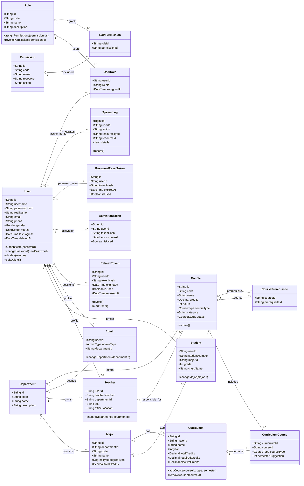
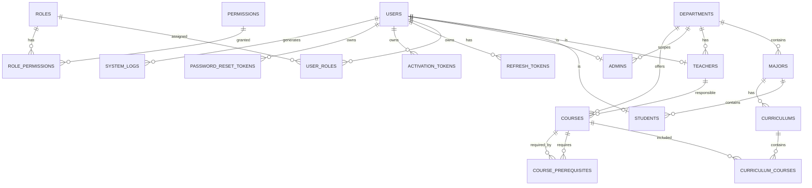
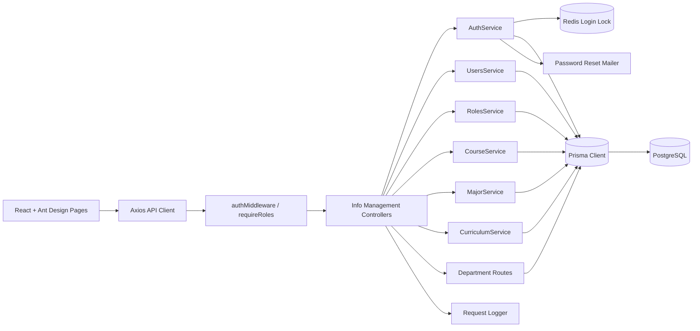
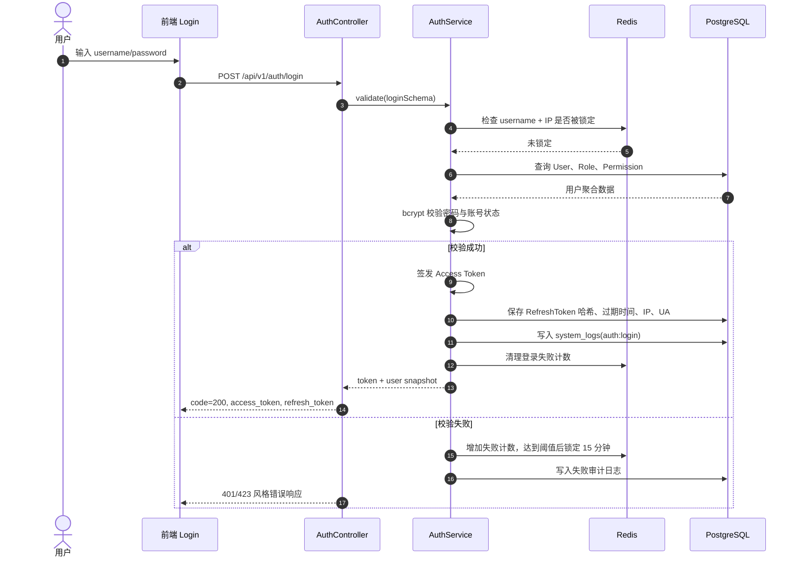
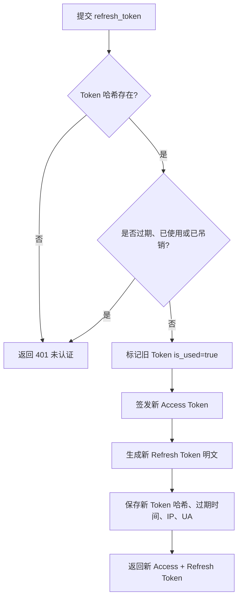
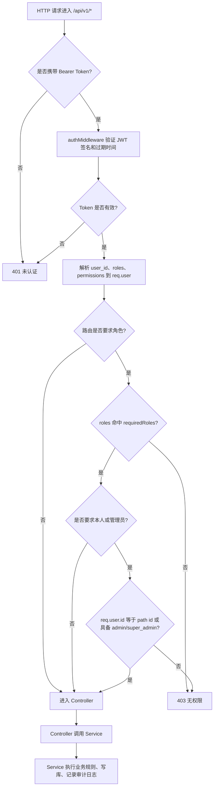
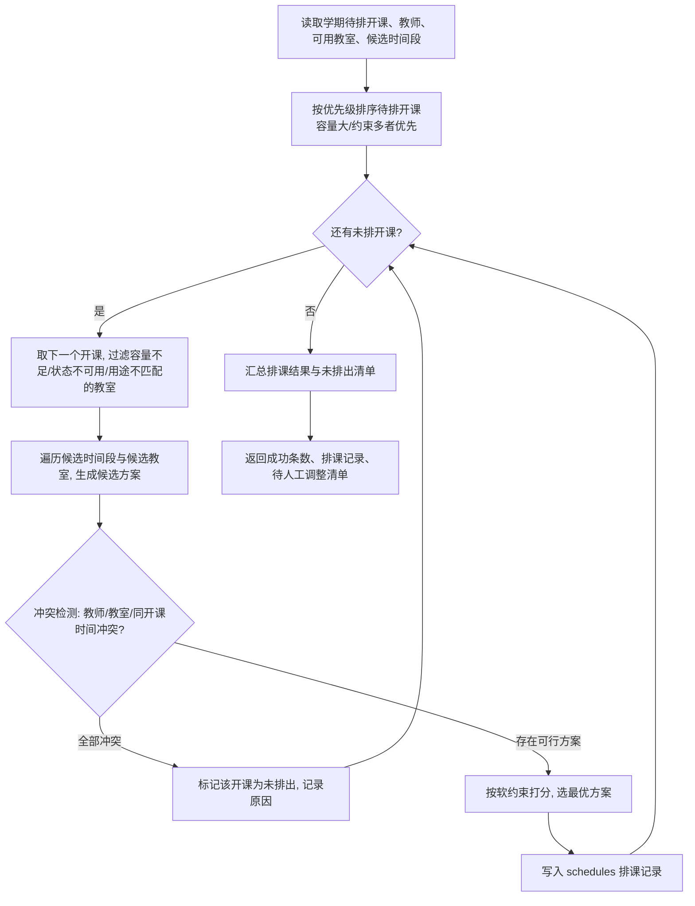
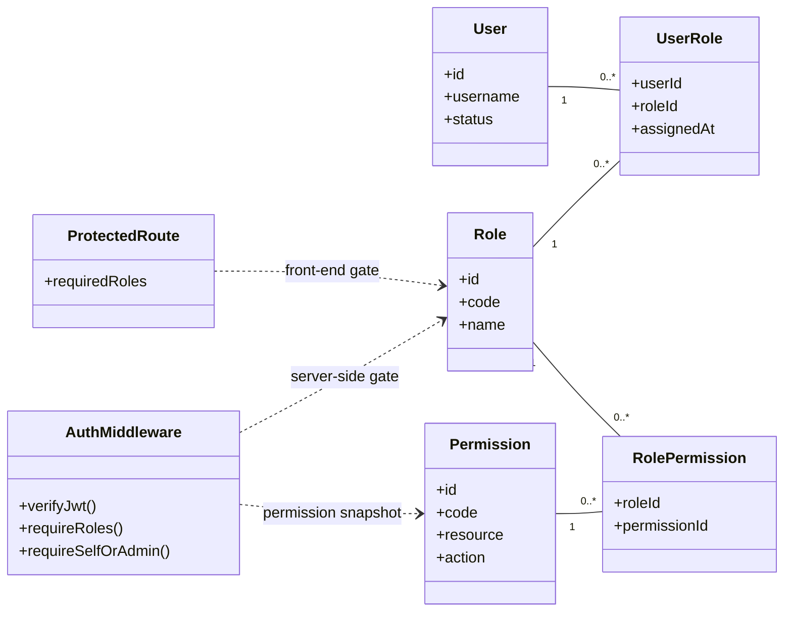

# Smart Teaching Service System 设计报告模板

> 写作定位：设计报告回答“如何实现需求”。重点写系统结构、数据/类设计、接口设计、组件设计、部署和关键设计决策。不要只堆技术栈，也不要把代码逐行搬进来。

---

## 0. 文档信息

### 0.1 文档版本

| 版本 | 日期       | 作者 | 修改说明 |
| ---- | ---------- | ---- | -------- |
| v1.0 | YYYY-MM-DD |      | 初稿     |
| v1.1 | YYYY-MM-DD |      | 修改说明 |

### 0.2 小组分工

| 子系统编号 | 子系统名称   | 负责小组 | 设计负责人 | 主要设计内容             |
| ---------- | ------------ | -------- | ---------- | ------------------------ |
| A          | 基础信息管理 | A 组     |            | 用户、权限、课程、安全   |
| B          | 自动排课     | B 组     |            | 教室资源管理、自动排课算法与冲突检测、手动调课、课表查询与打印 |
| C          | 智能选课     | C 组     |            | 培养方案、选课、AI 辅助  |
| D          | 论坛交流     | D 组     |            | 帖子、回复、检索、统计   |
| E          | 在线测试     | E 组     |            | 题库、组卷、答题、评分   |
| F          | 成绩管理     | F 组     |            | 成绩录入、修改、分析     |

---

## 1. 引言【全组统一写】

### 1.1 设计目的

写作指引：  
说明本文档用于指导 STSS 的编码、测试、集成和维护。强调设计与需求报告的对应关系。

### 1.2 设计范围

写作指引：  
说明本文档覆盖 A-F 六个子系统的总体架构、数据设计、接口设计、组件设计、部署设计等。

### 1.3 参考文档

- 项目要求文档：`docs/project-requirements.md`。
- A 组接口设计文档：`origin/dev/A:docs/apis/A-information-management.md`，版本 3.0.0，更新时间 2026-06-05。
- 数据库设计文档：`origin/dev/A:docs/database-design.md`，版本 1.5.0，更新时间 2026-06-18。
- A 组实现基线：`origin/dev/A` 最新提交 `4096bf7 fix(A): keep admin role in seed`。
- UML 图建模语义参考 [OMG UML 2.5.1 Specification](https://www.omg.org/spec/UML/2.5.1/About-UML)。
- Markdown 图表语法参考 Mermaid 官方文档：[classDiagram](https://mermaid.js.org/syntax/classDiagram.html)、[erDiagram](https://mermaid.js.org/syntax/entityRelationshipDiagram.html)、[sequenceDiagram](https://mermaid.js.org/syntax/sequenceDiagram.html)、[flowchart](https://mermaid.js.org/syntax/flowchart.html)。

---

## 2. 总体设计目标与约束【全组统一写】

### 2.1 设计目标

写作指引：  
用条目说明系统设计追求什么。

建议覆盖：

- 模块清晰，A-F 子系统职责明确。
- 支持统一用户、权限、课程基础数据。
- 支持系统扩展和后续维护。
- 支持基本安全控制和日志记录。
- 支持选课并发、排课冲突检测、成绩修改控制等关键场景。
- 对 AI 辅助功能保持可替换、可扩展设计。

### 2.2 设计约束

写作指引：  
列出你们实际项目采用的技术和限制。没有确定的内容可以写“待定”。

| 类别       | 约束说明                                    |
| ---------- | ------------------------------------------- |
| 前端技术   | 例如 Vue / React / HTML + CSS + JS          |
| 后端技术   | 例如 Spring Boot / Django / Node.js         |
| 数据库     | 例如 MySQL / PostgreSQL / SQLite            |
| 部署环境   | 例如本地部署 / 云服务器 / Docker            |
| AI 能力    | 例如调用大语言模型 API / 模拟 AI 推荐       |
| 浏览器兼容 | 例如 Chrome、Edge                           |
| 团队约束   | 例如 A-F 六组并行开发，需统一接口和数据模型 |

### 2.3 设计原则

写作指引：  
不要空泛喊口号。每条原则最好说明在本项目中的体现。

建议包括：

- 需求可追踪：设计元素应能对应到需求编号。
- 高内聚低耦合：每个子系统负责自己的核心业务。
- 统一身份与权限：A 子系统提供统一用户和权限基础。
- 接口清晰：跨子系统调用通过明确接口或共享数据结构完成。
- 可扩展：AI 辅助选课、成绩分析等能力应便于后续替换或增强。
- 可测试：关键模块应有明确输入、输出和异常路径。

---

## 3. 系统总体架构设计【全组统一主写，A-F 补充】

### 3.1 系统架构概述

写作指引：  
用一张总体架构图展示前端、后端、数据库、AI 服务、文件存储等组成。文字说明各层职责。

建议层次：

- 表现层：学生、教师、教务、管理员使用的页面。
- 业务层：A-F 子系统业务服务。
- 数据层：用户库、课程库、排课库、选课库、论坛库、题库、成绩库。
- 外部服务层：AI 服务、文件存储、导出服务等。

### 3.2 A-F 子系统关系图

写作指引：  
说明 A 是基础数据和权限中心，其他子系统依赖 A 的用户、角色、课程信息。

建议写法：

- A → B：提供教师、课程基础信息。
- A → C：提供学生、课程、权限基础信息。
- B → C：提供课程时间、教室、教师安排。
- C → F：提供学生选课结果，作为成绩登记对象。
- D → A：依赖用户身份和课程信息。
- E → F：在线测试成绩可作为成绩管理数据来源之一，若项目实现。
- F → C：查询培养方案和选课结果，计算学分进展。

### 3.3 架构风格

写作指引：  
说明你们采用什么架构。没有复杂微服务就不要硬写微服务。

可选写法：

- 本系统采用分层架构。
- 前端负责交互展示。
- 后端按子系统划分业务模块。
- 数据库保存系统核心数据。
- AI 辅助选课作为独立服务或独立模块接入 C 子系统。

### 3.4 关键架构决策

| 决策编号 | 决策内容                      | 原因                           | 影响范围 |
| -------- | ----------------------------- | ------------------------------ | -------- |
| AD-01    | 统一用户与权限由 A 子系统管理 | 避免各子系统重复管理用户       | A-F      |
| AD-02    | 选课依赖排课结果              | 选课需要判断时间冲突和课程容量 | B、C     |
| AD-03    | 成绩修改采用申请机制          | 保证成绩数据可信和可审计       | F        |

写作指引：  
只写对系统结构有实质影响的决策，不要把所有小实现都放进来。

---

## 4. 数据 / 类设计【全局统一类 + A-F 分组细化】

### 4.1 核心领域对象总览【全组统一整合】

| 类名       | 所属子系统  | 说明         |
| ---------- | ----------- | ------------ |
| User       | A           | 系统用户基类 |
| Student    | A/C/F       | 学生用户     |
| Teacher    | A/B/D/E/F   | 教师用户     |
| Course     | A/B/C/D/E/F | 课程基础信息 |
| Classroom  | B           | 教室资源     |
| Schedule   | B/C         | 排课结果     |
| Enrollment | C/F         | 学生选课记录 |
| Post       | D           | 论坛帖子     |
| Question   | E           | 题目         |
| Paper      | E           | 试卷         |
| Score      | F           | 成绩记录     |

写作指引：  
这里是统一命名表。各组后续设计必须使用统一类名或说明别名。

### 4.2 A 基础信息管理数据/类设计

A 子系统是 STSS 的身份、权限和基础主数据中心。以下设计以 `origin/dev/A` 的 `docs/apis/A-information-management.md` v3.0.0 和 `docs/database-design.md` v1.5.0 为准；若实现代码与文档存在细微差异，本节采用文档口径。

图示约定：类图采用 UML 类、关联、组合和多重性表达；实体关系图采用 Crow's Foot 多重性表达；Markdown 落地语法使用 Mermaid。

#### 4.2.1 A 子系统核心类图



#### 4.2.2 主要设计类

| 类名 | 职责 | 关键属性 | 主要行为/设计约束 |
| ---- | ---- | -------- | ---------------- |
| `User` | 所有登录主体的统一身份根对象 | `id`, `username`, `passwordHash`, `realName`, `email`, `phone`, `gender`, `status`, `lastLoginAt`, `deletedAt` | 登录认证、密码修改、状态变更、软删除；用户名和邮箱保持唯一；密码只保存哈希 |
| `Student` | 学生身份扩展信息 | `userId`, `studentNumber`, `majorId`, `grade`, `className` | 与 `User` 一对一；学号唯一；专业变更必须引用有效 `Major` |
| `Teacher` | 教师身份扩展信息 | `userId`, `teacherNumber`, `departmentId`, `title`, `officeLocation` | 与 `User` 一对一；工号唯一；为课程负责人、排课、题库和成绩模块提供教师主数据 |
| `Admin` | 管理员身份扩展信息 | `userId`, `adminType`, `departmentId` | 支持 `ACADEMIC`、`SUPER`、`SECURITY` 类型；超级管理员负责全局高危操作 |
| `Role` | RBAC 角色聚合根 | `id`, `code`, `name`, `description` | 管理角色生命周期；内置角色包括 `student`、`teacher`、`admin`、`super_admin` |
| `Permission` | 可授权操作的最小粒度 | `id`, `code`, `resource`, `action` | 权限编码采用 `resource:action`，如 `user:create`、`course:delete` |
| `UserRole` | 用户与角色的关联类 | `userId`, `roleId`, `assignedAt` | 复合主键防止重复授权；删除用户或角色时级联删除 |
| `RolePermission` | 角色与权限的关联类 | `roleId`, `permissionId` | 复合主键防止重复分配；撤销权限时需保护超级管理员关键权限 |
| `Department` | 院系主数据 | `id`, `code`, `name`, `description` | 关联专业、教师、管理员和课程；删除前必须满足无关联资源约束 |
| `Major` | 专业主数据 | `id`, `departmentId`, `code`, `name`, `degreeType`, `totalCredits` | 属于一个院系；关联学生和培养方案；删除前必须无关联学生 |
| `Course` | 课程基础主数据 | `id`, `code`, `name`, `credits`, `hours`, `courseType`, `category`, `departmentId`, `teacherId`, `status` | 支撑 B/C/D/E/F 子系统；课程代码唯一；删除前不能被培养方案引用 |
| `CoursePrerequisite` | 课程先修关系 | `courseId`, `prerequisiteId` | 课程自关联多对多；复合主键约束同一先修关系只能出现一次 |
| `Curriculum` | 培养方案聚合根 | `id`, `majorId`, `name`, `year`, `totalCredits`, `requiredCredits`, `electiveCredits` | 按专业和年份维护培养方案；通过 `CurriculumCourse` 纳入课程 |
| `CurriculumCourse` | 培养方案课程关联类 | `curriculumId`, `courseId`, `courseType`, `semesterSuggestion` | 复合主键；保存课程类别和建议修读学期 |
| `RefreshToken` | 长期会话令牌 | `id`, `userId`, `tokenHash`, `expiresAt`, `isUsed`, `lastUsedAt`, `revokedAt` | 只存哈希；刷新后旧令牌标记已使用；可按用户或单令牌吊销 |
| `ActivationToken` | 兼容历史账号激活流程 | `id`, `userId`, `tokenHash`, `expiresAt`, `isUsed` | 保留兼容接口；删除用户时级联删除 |
| `PasswordResetToken` | 密码重置凭证 | `id`, `userId`, `tokenHash`, `expiresAt`, `isUsed` | 支持忘记密码流程；一次性使用；只保存哈希 |
| `SystemLog` | 安全审计与操作追踪 | `id`, `userId`, `action`, `resourceType`, `resourceId`, `ipAddress`, `userAgent`, `details`, `createdAt` | 记录认证、用户状态、角色、院系专业变更等关键操作 |

#### 4.2.3 主要数据表

| 表名 | 说明 | 关键字段 | 主要关联 |
| ---- | ---- | -------- | -------- |
| `users` | 用户统一身份表 | `id`, `username`, `password_hash`, `real_name`, `status`, `deleted_at` | `students`, `teachers`, `admins`, `user_roles`, `refresh_tokens`, `system_logs` |
| `students` | 学生扩展表 | `user_id`, `student_number`, `major_id`, `grade`, `class_name` | `users`, `majors` |
| `teachers` | 教师扩展表 | `user_id`, `teacher_number`, `department_id`, `title`, `office_location` | `users`, `departments`, `courses` |
| `admins` | 管理员扩展表 | `user_id`, `admin_type`, `department_id` | `users`, `departments` |
| `roles` | 角色表 | `id`, `code`, `name`, `description` | `user_roles`, `role_permissions` |
| `permissions` | 权限表 | `id`, `code`, `resource`, `action` | `role_permissions` |
| `departments` | 院系表 | `id`, `code`, `name`, `description` | `majors`, `teachers`, `admins`, `courses` |
| `majors` | 专业表 | `id`, `department_id`, `code`, `name`, `degree_type`, `total_credits` | `departments`, `students`, `curriculums` |
| `courses` | 课程基础信息表 | `id`, `code`, `name`, `credits`, `course_type`, `department_id`, `teacher_id`, `status` | `departments`, `teachers`, `course_prerequisites`, `curriculum_courses` |
| `curriculums` | 培养方案表 | `id`, `major_id`, `name`, `year`, `total_credits` | `majors`, `curriculum_courses` |
| `system_logs` | 系统日志表 | `id`, `user_id`, `action`, `resource_type`, `resource_id`, `details` | `users` |

### 4.3 B 自动排课数据/类设计

B 自动排课子系统以 A 子系统维护的课程、开课、教师等基础数据为输入，围绕“教室资源 - 排课记录 - 冲突检测 - 课表视图”组织领域对象。持久化实体复用项目统一的 Prisma + PostgreSQL 数据模型（`Classroom`、`Schedule`），并依赖 `CourseOffering`、`Course`、`Teacher`、`Semester` 等 A/C 共用实体。

#### 4.3.1 主要设计类

| 类名 | 职责 | 主要属性 | 主要方法/行为 |
|---|---|---|---|
| Classroom | 表示一间可排课的教室资源 | id, building, roomNumber, campus, capacity, roomType, equipment, status | 创建/编辑/删除教室、按条件查询、切换可用状态、提供可用资源池 |
| Schedule | 表示一条课程时间地点安排 | id, courseOfferingId, classroomId, dayOfWeek, startWeek, endWeek, startPeriod, endPeriod, notes | 写入排课结果、调整时间或教室、按教师/教室聚合查询 |
| CourseOffering | 待排开课（A/C 共用实体） | id, courseId, semesterId, teacherId, capacity, status | 提供待排课程的容量、授课教师和所属学期 |
| SchedulingTask | 自动排课控制类，组织一次排课求解 | semesterId, pendingOfferings, successCount, unscheduledList | 加载待排开课与可用教室、按约束求解、生成排课结果、汇总未排出清单 |
| ConflictChecker | 冲突检测服务类 | — | 判定教师时间冲突、教室时间冲突、同开课时间矛盾，校验教室容量与可用状态 |
| Timetable | 课表视图边界类 | dimension(teacher/classroom), grid | 按教师或教室维度汇总排课记录，生成周课表网格与打印视图 |

#### 4.3.2 关系说明

`Classroom` 与 `Schedule` 是一对多关系：一间教室可承载多条排课记录，每条排课记录占用唯一教室。`CourseOffering` 与 `Schedule` 也是一对多关系：一个开课可能拆分为多条时间段安排（例如不同周次或不同节次），删除开课时其排课记录级联删除。`Schedule` 通过 `courseOfferingId` 间接关联 `Course`（课程名称、类型）、`Teacher`（授课教师）和 `Semester`（学期范围），这些信息由 A/C 子系统维护，B 子系统只读引用。

`SchedulingTask`、`ConflictChecker`、`Timetable` 是分析层控制/边界类，不一定独立落库：`SchedulingTask` 在排课时调用 `ConflictChecker` 校验候选方案，再把通过校验的安排写入 `Schedule`；`Timetable` 在查询时只读聚合 `Schedule` 生成课表。

冲突检测是排课核心，覆盖以下冲突类型：

- **教师时间冲突**：同一教师在相同周次区间、相同星期、相同节次区间存在两条排课。
- **教室时间冲突**：同一教室在相同周次区间、相同星期、相同节次区间被两条排课占用。
- **同开课时间矛盾**：同一开课的多条排课记录之间时间段自相重叠或越界。
- **容量不匹配**：分配教室容量小于开课选课容量。
- **教室状态不可用**：分配教室处于维护或停用状态。

时间冲突的判定基于周次区间 `[startWeek, endWeek]` 与节次区间 `[startPeriod, endPeriod]` 的双重重叠，且星期相同；任一区间不重叠即视为不冲突。数据模型在 `Schedule` 上建立 `(classroomId, dayOfWeek, startWeek, endWeek, startPeriod, endPeriod)` 复合索引以加速冲突检测查询。

### 4.4 C 智能选课数据/类设计【C 组填写】

建议类：

- TrainingProgram
- Enrollment
- SelectionPhase
- CourseCapacity
- CourseConflict
- AIRecommendation

写作指引：

- 说明培养方案与学生、课程类别、学分要求之间的关系。
- 说明选课记录与排课结果、课程容量之间的关系。
- AIRecommendation 要说明输入、输出和最终确认机制。

### 4.5 D 论坛交流数据/类设计【D 组填写】

建议类：

- Forum
- Announcement
- Post
- Reply
- Attachment
- SearchIndex
- ForumStatistic

写作指引：

- 帖子、回复、附件之间的关系要清晰。
- 如果实现全文检索，说明检索数据来源和返回结果结构。
- 如果未实现复杂检索，可说明采用标题/正文关键词匹配。

### 4.6 E 在线测试数据/类设计

E 在线测试子系统围绕“题库 - 试卷 - 答题结果 - 单题答案”组织领域对象。后端实现采用 Rust + Poem OpenAPI，数据持久化使用 PostgreSQL。

#### 4.6.1 主要设计类

| 类名           | 职责                      | 主要属性                                                                                          | 主要方法/行为                                  |
| -------------- | ------------------------- | ------------------------------------------------------------------------------------------------- | ---------------------------------------------- |
| QuestionBank   | 管理课程下的题库集合      | id, courseId, creatorId, name, description, status                                                | 创建题库、查询题库、删除空题库、统计题目数量   |
| Question       | 表示一道测试题            | id, bankId, questionType, content, answer, explanation, defaultPoints, difficulty, knowledgePoint | 创建题目、修改题目、查询详情、删除题目         |
| QuestionOption | 保存选择题/判断题选项     | id, questionId, optionText, optionOrder, isCorrect                                                | 按题目顺序返回选项、标记正确选项               |
| TestPaper      | 表示一份试卷              | id, courseOfferingId, creatorId, title, totalPoints, durationMinutes, startTime, endTime, status  | 创建试卷、更新配置、发布试卷、关闭试卷         |
| TestQuestion   | 维护试卷与题目的组合关系  | id, testPaperId, questionId, orderNum, points                                                     | 手动加入题目、自动抽题加入、移除题目、重排题号 |
| TestResult     | 表示学生一次答题会话/结果 | id, testPaperId, studentId, startTime, submitTime, totalScore, status, timeSpentSeconds           | 开始答题、恢复未完成答题、提交后更新总分和状态 |
| Answer         | 保存一次答题中的单题答案  | id, testResultId, testQuestionId, studentAnswer, isCorrect, score                                 | 保存学生答案、记录判题结果和单题得分           |

#### 4.6.2 关系说明

题库与题目是一对多关系，一个 `QuestionBank` 下包含多道 `Question`。题目与试卷不是直接嵌套关系，而是通过 `TestQuestion` 建立组合关系：一道题可以被多份试卷复用，一份试卷也可以包含多道题，因此逻辑上是多对多，关联表额外保存题号和本卷分值。

学生开始答题时创建或复用一条 `TestResult`，系统返回不含正确答案标记的题目与选项。学生提交后，系统将每一道题的作答写入 `Answer` 表，同时更新 `TestResult.totalScore`、`submitTime`、`status` 和 `timeSpentSeconds`，形成可追溯的答题记录。

自动评分目前覆盖单选题、多选题和判断题。单选题、判断题按选项序号直接比较；多选题先对学生答案和标准答案的序号集合排序，再进行集合一致性比较。完全正确得该题满分，错误或未作答得 0 分。

### 4.7 F 成绩管理数据/类设计【F 组填写】

建议类：

- Score
- ScoreRecord
- ScoreModificationRequest
- CreditProgress
- GPAStatistic
- CourseScoreAnalysis

写作指引：

- 成绩记录必须关联学生、课程、教师或教学班。
- 成绩修改申请要有状态。
- 成绩分析类不一定持久化，可作为计算服务说明。

---

## 5. 数据库设计【A-F 分组填写，统一整合】

### 5.1 数据库总体说明【全组统一写】

写作指引：  
说明数据库选型、命名规范、主键策略、外键策略、时间字段、删除策略。

### 5.2 A 基础信息管理数据表

A 子系统数据库基于 PostgreSQL 与 Prisma Schema 设计。主键默认采用 UUID；`system_logs.id` 采用自增 BIGSERIAL；接口响应统一转换为 snake_case。用户删除采用 `users.deleted_at` 软删除，用户相关角色、令牌和身份扩展表按外键规则级联清理，日志中的用户引用采用置空策略保留审计事实。

#### 5.2.1 A 子系统 E-R 图



#### 5.2.2 A 子系统表设计

| 表名 | 字段 | 类型 | 约束 | 说明 |
| ---- | ---- | ---- | ---- | ---- |
| `users` | `id`, `username`, `password_hash`, `email`, `phone`, `real_name`, `avatar_url`, `gender`, `status`, `last_login_at`, `deleted_at`, `created_at`, `updated_at` | UUID, VARCHAR, ENUM, TIMESTAMP | `id` PK；`username` UNIQUE；`email` UNIQUE；索引：`status`, `deleted_at`, `real_name`, `created_at` | 系统统一用户身份表；`deleted_at` 支持软删除；密码仅保存哈希 |
| `students` | `user_id`, `student_number`, `major_id`, `grade`, `class_name` | UUID, VARCHAR, INT | `user_id` PK/FK -> `users.id` ON DELETE CASCADE；`student_number` UNIQUE；索引：`major_id`, `grade` | 学生扩展信息；关联专业并向选课、测试、成绩模块提供学生主数据 |
| `teachers` | `user_id`, `teacher_number`, `department_id`, `title`, `office_location` | UUID, VARCHAR | `user_id` PK/FK -> `users.id` ON DELETE CASCADE；`teacher_number` UNIQUE；索引：`department_id` | 教师扩展信息；关联院系并作为课程负责人、排课、题库和成绩录入主体 |
| `admins` | `user_id`, `admin_type`, `department_id` | UUID, ENUM | `user_id` PK/FK -> `users.id` ON DELETE CASCADE；`department_id` FK -> `departments.id` | 管理员扩展信息；`admin_type` 为 `ACADEMIC`、`SUPER`、`SECURITY` |
| `departments` | `id`, `name`, `code`, `description`, `created_at`, `updated_at` | UUID, VARCHAR, TEXT, TIMESTAMP | `id` PK；`code` UNIQUE | 院系主数据；关联专业、教师、管理员和课程 |
| `majors` | `id`, `department_id`, `name`, `code`, `description`, `degree_type`, `total_credits`, `created_at`, `updated_at` | UUID, VARCHAR, TEXT, ENUM, DECIMAL, TIMESTAMP | `id` PK；`department_id` FK -> `departments.id`; `code` UNIQUE | 专业主数据；保存学位类型和毕业总学分要求 |
| `roles` | `id`, `name`, `code`, `description` | UUID, VARCHAR, TEXT | `id` PK；`name` UNIQUE；`code` UNIQUE | RBAC 角色定义；内置角色包括 `student`、`teacher`、`admin`、`super_admin` |
| `permissions` | `id`, `name`, `code`, `resource`, `action`, `description` | UUID, VARCHAR, TEXT | `id` PK；`code` UNIQUE | RBAC 权限定义；权限代码采用 `resource:action` |
| `user_roles` | `user_id`, `role_id`, `assigned_at` | UUID, TIMESTAMP | 复合 PK (`user_id`, `role_id`)；FK 均 ON DELETE CASCADE | 用户与角色多对多关联，记录分配时间 |
| `role_permissions` | `role_id`, `permission_id` | UUID | 复合 PK (`role_id`, `permission_id`)；FK 均 ON DELETE CASCADE | 角色与权限多对多关联 |
| `refresh_tokens` | `id`, `user_id`, `token_hash`, `expires_at`, `is_used`, `last_used_at`, `ip_address`, `user_agent`, `revoked_at`, `created_at` | UUID, VARCHAR, TIMESTAMP, BOOLEAN, TEXT | `id` PK；`token_hash` UNIQUE；`user_id` FK -> `users.id` ON DELETE CASCADE；索引：`user_id`, `expires_at` | JWT Refresh Token 持久化；只存哈希；支持一次性刷新和吊销 |
| `activation_tokens` | `id`, `user_id`, `token_hash`, `expires_at`, `is_used`, `created_at` | UUID, VARCHAR, TIMESTAMP, BOOLEAN | `id` PK；`token_hash` UNIQUE；`user_id` FK -> `users.id` ON DELETE CASCADE；索引：`user_id`, `expires_at` | 兼容历史账号激活流程 |
| `password_reset_tokens` | `id`, `user_id`, `token_hash`, `expires_at`, `is_used`, `created_at` | UUID, VARCHAR, TIMESTAMP, BOOLEAN | `id` PK；`token_hash` UNIQUE；`user_id` FK -> `users.id` ON DELETE CASCADE；索引：`user_id`, `expires_at` | 密码重置一次性令牌 |
| `system_logs` | `id`, `user_id`, `action`, `resource_type`, `resource_id`, `ip_address`, `user_agent`, `details`, `created_at` | BIGSERIAL, UUID, VARCHAR, TEXT, JSONB, TIMESTAMP | `id` PK；`user_id` FK -> `users.id` ON DELETE SET NULL；索引：`user_id`, `action`, `created_at`, (`user_id`, `created_at`) | 关键操作审计日志，覆盖登录、用户、角色、主数据变更 |
| `courses` | `id`, `code`, `name`, `credits`, `hours`, `course_type`, `category`, `department_id`, `teacher_id`, `description`, `assessment_method`, `status`, `created_at`, `updated_at` | UUID, VARCHAR, DECIMAL, INT, ENUM, TEXT, TIMESTAMP | `id` PK；`code` UNIQUE；`department_id` FK -> `departments.id`; `teacher_id` FK -> `teachers.user_id` | 课程基础信息，是排课、选课、论坛、在线测试和成绩管理的共享主数据 |
| `course_prerequisites` | `course_id`, `prerequisite_id` | UUID | 复合 PK (`course_id`, `prerequisite_id`)；两列均 FK -> `courses.id` ON DELETE CASCADE | 课程先修关系，自关联多对多 |
| `curriculums` | `id`, `major_id`, `name`, `year`, `total_credits`, `required_credits`, `elective_credits`, `created_at`, `updated_at` | UUID, VARCHAR, INT, DECIMAL, TIMESTAMP | `id` PK；`major_id` FK -> `majors.id` | 培养方案主表，按专业和年份组织毕业要求 |
| `curriculum_courses` | `curriculum_id`, `course_id`, `course_type`, `semester_suggestion` | UUID, ENUM, INT | 复合 PK (`curriculum_id`, `course_id`)；FK 均 ON DELETE CASCADE | 培养方案课程清单，保存课程类别和建议修读学期 |

### 5.3 B 自动排课数据表

B 子系统在统一的 PostgreSQL 实例中维护 `classrooms`（教室资源）和 `schedules`（排课记录）两张核心表，并只读引用 A/C 子系统的 `course_offerings`、`courses`、`teachers`、`semesters`。主键统一采用 UUID，外键删除策略与跨子系统一致性说明保持一致。

| 表名 | 字段 | 类型 | 约束 | 说明 |
| ---- | ---- | ---- | ---- | ---- |
| `classrooms` | `id`, `building`, `room_number`, `campus`, `capacity`, `room_type`, `equipment`, `status` | UUID, VARCHAR, INT, ENUM, JSONB | `id` PK；(`building`, `room_number`) UNIQUE；`room_type` 取 LECTURE/LAB/COMPUTER/MULTIMEDIA；`status` 取 AVAILABLE/MAINTENANCE/UNAVAILABLE，默认 AVAILABLE | 教室基础信息（教学楼、房间号、校区、容量、类型、设备清单、可用状态），是自动排课的资源池 |
| `schedules` | `id`, `course_offering_id`, `classroom_id`, `day_of_week`, `start_week`, `end_week`, `start_period`, `end_period`, `notes` | UUID, INT, TEXT | `id` PK；`course_offering_id` FK -> `course_offerings.id` ON DELETE CASCADE；`classroom_id` FK -> `classrooms.id`；`day_of_week` 取 1-7；索引：(`classroom_id`, `day_of_week`, `start_week`, `end_week`, `start_period`, `end_period`) | 一条课程的时间地点安排（星期、周次区间、节次区间），是冲突检测和课表查询的基础数据 |

> 说明：`equipment` 以 JSONB 保存教室设备清单（如投影、电脑、实验设备），便于按用途匹配排课；`schedules` 上的复合索引用于加速“同教室、同星期、相同周次与节次区间”的冲突检测查询。

### 5.4 C 智能选课数据表【C 组填写】

| 表名 | 字段 | 类型 | 约束 | 说明 |
| ---- | ---- | ---- | ---- | ---- |

### 5.5 D 论坛交流数据表【D 组填写】

| 表名 | 字段 | 类型 | 约束 | 说明 |
| ---- | ---- | ---- | ---- | ---- |

### 5.6 E 在线测试数据表

| 表名             | 字段                                                                                                                            | 类型                                                              | 约束                                                                      | 说明                                                                   |
| ---------------- | ------------------------------------------------------------------------------------------------------------------------------- | ----------------------------------------------------------------- | ------------------------------------------------------------------------- | ---------------------------------------------------------------------- |
| question_banks   | id, course_id, creator_id, name, description, status                                                                            | UUID/String, VarChar, Text, Enum                                  | id 为主键；关联课程和创建教师；状态默认可用                               | 保存课程题库基础信息，供题目管理和组卷功能引用                         |
| questions        | id, bank_id, question_type, content, answer, explanation, default_points, difficulty, knowledge_point                           | UUID/String, Enum, Text, Decimal, VarChar                         | id 为主键；关联题库；题型限定为单选、多选、判断；题干、答案和默认分值必填 | 保存题干、标准答案、分值、难度和知识点，是组卷与自动评分的基础数据     |
| question_options | id, question_id, option_text, option_order, is_correct                                                                          | UUID/String, VarChar, Int, Boolean                                | id 为主键；关联题目并随题目级联删除；按题目和选项顺序建立索引             | 保存题目选项及正确标记，学生答题时只返回选项文本和顺序                 |
| test_papers      | id, course_offering_id, creator_id, title, description, total_points, duration_minutes, start_time, end_time, is_random, status | UUID/String, VarChar, Text, Decimal, Int, DateTime, Boolean, Enum | id 为主键；关联开课和创建教师；状态默认为草稿                             | 保存试卷基础信息和生命周期状态，支持草稿、发布、关闭等控制             |
| test_questions   | id, test_paper_id, question_id, order_num, points                                                                               | UUID/String, Int, Decimal                                         | id 为主键；关联试卷和题目；试卷删除时级联删除关联记录                     | 维护试卷与题目的组合关系，记录题号和该题在本试卷中的分值               |
| test_results     | id, test_paper_id, student_id, start_time, submit_time, total_score, status, time_spent_seconds                                 | UUID/String, DateTime, Decimal, Enum, Int                         | id 为主键；关联试卷和学生；状态默认为答题中                               | 保存学生一次测试的开始、提交、总分、状态和用时，用于恢复答题和成绩查询 |
| answers          | id, test_result_id, test_question_id, student_answer, is_correct, score                                                         | UUID/String, Text, Boolean, Decimal                               | id 为主键；关联答题记录和试卷题目；答题记录删除时级联删除答案             | 保存逐题作答内容和自动评分结果，支撑答题详情展示                       |

### 5.7 F 成绩管理数据表【F 组填写】

| 表名 | 字段 | 类型 | 约束 | 说明 |
| ---- | ---- | ---- | ---- | ---- |

### 5.8 跨子系统数据一致性说明【全组统一整合】

写作指引：
说明跨系统共享数据如何保持一致。例如：

- 删除课程时如何影响排课、选课、论坛、测试、成绩。
- 修改用户角色时如何影响权限。
- 修改排课结果时如何影响选课。
- 修改成绩时如何记录审计。

---

## 6. 接口设计【全局规范 + A-F 分组填写】

### 6.1 接口设计规范【全组统一写】

写作指引：  
规定接口命名、请求方式、返回格式、错误码、鉴权方式。

建议格式：

| 项       | 约定                        |
| -------- | --------------------------- |
| URL 命名 | /api/{subsystem}/{resource} |
| 请求格式 | JSON                        |
| 返回格式 | code, message, data         |
| 鉴权     | 登录态 / Token / Session    |
| 错误码   | 统一定义                    |

### 6.2 A 基础信息管理接口

A 组接口统一挂载在 `/api/v1` 下，认证方式为 `Authorization: Bearer <access_token>`。请求体为 JSON；头像上传使用 `multipart/form-data`。响应遵循 `{ code, message, data }`，分页响应使用 `data.items` 和 `data.pagination`。字段响应统一使用 snake_case。

| 接口组 | 方法 | 路径 | 输入 | 输出 | 权限 |
| ------ | ---- | ---- | ---- | ---- | ---- |
| 用户登录 | POST | `/api/v1/auth/login` | `username`, `password` | `access_token`, `refresh_token`, `expires_in`, `user` | 未登录用户 |
| Token 刷新 | POST | `/api/v1/auth/refresh` | `refresh_token` | 新 `access_token` 与新 `refresh_token` | 持有有效 Refresh Token |
| 登出 | POST | `/api/v1/auth/logout` | `refresh_token` | 登出结果 | 登录用户 |
| 当前用户 | GET | `/api/v1/auth/me` | Access Token | 用户资料、角色、权限列表 | 登录用户 |
| 注册/激活/忘记密码 | POST/GET | `/api/v1/auth/register`, `/api/v1/auth/activate`, `/api/v1/auth/password/forgot`, `/api/v1/auth/password/reset/verify`, `/api/v1/auth/password/reset/confirm` | 注册资料、激活/重置 Token、新密码 | 注册、激活、重置结果 | 未登录用户或持有一次性 Token 用户 |
| 修改当前密码 | POST | `/api/v1/auth/change-password` | `old_password`, `new_password` | 修改结果 | 登录用户 |
| 用户列表与统计 | GET | `/api/v1/users`, `/api/v1/users/stats` | 分页、关键词、状态、角色、是否包含软删除 | 用户列表、分页、统计 | 列表：`admin`/`super_admin`；统计：登录用户 |
| 用户详情 | GET | `/api/v1/users/:id` | 用户 id | 用户基础资料、角色、学生/教师/管理员扩展信息 | 本人或 `admin`/`super_admin` |
| 创建/批量创建用户 | POST | `/api/v1/users`, `/api/v1/users/batch` | 用户基础资料、角色、学生/教师/管理员扩展资料 | 创建结果、批量成功/失败明细 | `super_admin` |
| 更新/删除用户 | PUT/DELETE | `/api/v1/users/:id` | 可更新字段或用户 id | 更新后用户、删除结果 | 更新：本人或 `admin`/`super_admin`；删除：`super_admin` |
| 用户状态与密码 | PATCH/POST | `/api/v1/users/:id/status`, `/api/v1/users/batch/status`, `/api/v1/users/:id/password`, `/api/v1/users/:id/password/reset` | 状态、原因、旧/新密码、批量用户 id | 状态变更、密码修改/重置结果 | 状态：`admin`/`super_admin`；本人改密；管理员重置 |
| 用户角色与权限 | GET/POST/DELETE | `/api/v1/users/roles`, `/api/v1/users/:id/roles`, `/api/v1/users/:id/roles/:role_id`, `/api/v1/users/:id/permissions` | 角色 id、用户 id | 角色列表、分配/撤销结果、权限列表 | 查询轻量角色：登录用户；角色变更：`admin`/`super_admin`；权限详情：本人或管理员 |
| 用户头像与身份归属 | POST/PATCH | `/api/v1/users/:id/avatar`, `/api/v1/users/:id/student/major`, `/api/v1/users/:id/teacher/department`, `/api/v1/users/:id/admin/department` | 头像文件、专业 id、院系 id | 头像 URL、归属更新结果 | 头像：本人或管理员；学生/教师归属：`admin`/`super_admin`；管理员归属：`super_admin` |
| 系统日志 | GET | `/api/v1/users/logs` | `user_id`, `action`, `resource_type`, 时间范围、分页 | 日志列表与分页 | `admin`/`super_admin` |
| 院系管理 | GET/POST/PUT/DELETE | `/api/v1/departments`, `/api/v1/departments/:id` | 分页、关键词、院系资料 | 院系列表、详情、创建/更新/删除结果 | 查询：登录用户；创建/删除：`super_admin`；更新：`admin`/`super_admin` |
| 专业管理 | GET/POST/PUT/DELETE | `/api/v1/majors`, `/api/v1/majors/:id` | 分页、院系、关键词、专业资料 | 专业列表、详情、创建/更新/删除结果 | 查询：登录用户；创建/删除：`super_admin`；更新：`admin`/`super_admin` |
| 课程管理 | GET/POST/PUT/DELETE | `/api/v1/courses`, `/api/v1/courses/:id`, `/api/v1/courses/batch` | 分页、院系、课程类型、状态、课程资料、先修课程 | 课程列表、详情、创建/更新/删除/批量结果 | 查询：登录用户；创建/更新/批量：`admin`/`super_admin`；删除：`super_admin` |
| 培养方案管理 | GET/POST/PUT/DELETE | `/api/v1/curriculums`, `/api/v1/curriculums/:id`, `/api/v1/curriculums/:id/courses`, `/api/v1/curriculums/:id/courses/batch`, `/api/v1/curriculums/:id/courses/:course_id` | 专业、年份、学分要求、课程 id、课程类型、建议学期 | 培养方案列表、详情、课程增删改结果 | 查询：登录用户；创建/更新/课程维护：`admin`/`super_admin`；删除方案：`super_admin` |
| 角色管理 | GET/POST/PUT/DELETE | `/api/v1/roles`, `/api/v1/roles/:id` | 关键词、内置角色筛选、角色资料、权限 id | 角色列表、详情、创建/更新/删除结果 | 查询：`admin`/`super_admin`；写入和删除：`super_admin` |
| 权限管理 | GET/POST/DELETE | `/api/v1/permissions`, `/api/v1/roles/:id/permissions`, `/api/v1/roles/:id/permissions/:permission_id` | 资源、操作、关键词、权限 id | 权限列表、分配/撤销结果 | 查询：`admin`/`super_admin`；分配/撤销：`super_admin` |
| 活跃令牌管理 | GET/DELETE/POST | `/api/v1/users/:id/tokens`, `/api/v1/users/:id/tokens/:token_id`, `/api/v1/users/:id/tokens/revoke-all` | 用户 id、令牌 id | 活跃令牌列表、吊销结果 | 本人或 `admin`/`super_admin` |

### 6.3 B 自动排课接口

B 组接口遵循项目统一规范：Base URL 为 `/api/v1`，通过 JWT Bearer Token 解析用户身份，响应字段统一 snake_case，列表接口支持 `page`/`page_size` 分页。按需求报告的角色边界控制能力：教室资源维护、自动排课、手动调课面向教务管理人员；课表查询对登录用户开放，教师查询本人课表、教务管理人员可查询任意教室课表。

| 接口组 | 方法 | 路径 | 输入 | 输出 | 权限 |
| ------ | ---- | ---- | ---- | ---- | ---- |
| 教室列表查询 | GET | `/api/v1/classrooms` | 校区、教学楼、教室类型、最小容量、状态、分页参数 | 教室分页列表（含容量、类型、设备、状态） | 登录用户 |
| 教室详情 | GET | `/api/v1/classrooms/:id` | 教室 id | 单个教室详情 | 登录用户 |
| 教室资源维护 | POST/PUT/DELETE | `/api/v1/classrooms`, `/api/v1/classrooms/:id` | 教学楼、房间号、校区、容量、教室类型、设备清单、状态 | 创建/更新/删除结果 | 教务管理人员 |
| 自动排课 | POST | `/api/v1/schedules/auto-generate` | 学期 id、待排开课范围、约束选项（容量匹配、用途匹配、分布偏好等） | 排课结果摘要：成功条数、生成的排课记录、未排出开课清单及原因 | 教务管理人员 |
| 排课记录查询 | GET | `/api/v1/schedules` | 学期、教师、教室、开课、星期等过滤条件，分页参数 | 排课记录分页列表 | 登录用户 |
| 冲突预检 | POST | `/api/v1/schedules/check-conflict` | 候选排课（开课、教室、星期、周次区间、节次区间） | 冲突标志及冲突类型明细（教师/教室/同开课/容量/状态） | 教务管理人员 |
| 手动调课 | POST/PUT/DELETE | `/api/v1/schedules`, `/api/v1/schedules/:id` | 开课 id、教室 id、星期、周次区间、节次区间、备注 | 调整结果；若存在冲突返回冲突明细并阻断写入 | 教务管理人员 |
| 教师课表查询 | GET | `/api/v1/schedules/teacher/:teacherId` | 教师 id、学期 id | 该教师周课表网格数据 | 教师本人/教务管理人员 |
| 教室课表查询 | GET | `/api/v1/schedules/classroom/:classroomId` | 教室 id、学期 id | 该教室周课表网格数据 | 教务管理人员 |
| 课表打印/导出 | GET | `/api/v1/schedules/export` | 维度（teacher/classroom）、对象 id、学期 id、导出格式 | 可打印的课表视图或导出文件 | 教师本人/教务管理人员 |

### 6.4 C 智能选课接口【C 组填写】

写作指引：
列出培养方案、课程搜索、选课、退课、选课结果、AI 推荐接口。

### 6.5 D 论坛交流接口【D 组填写】

写作指引：
列出公告、帖子、回复、附件、检索、统计接口。

### 6.6 E 在线测试接口

E 组接口由 Rust 后端 `backend-e-rust` 提供，统一前缀为 `/online-testing`，接口通过 Bearer Token 解析用户身份，并按需求报告中的角色边界控制能力：题库、题目、试卷和组卷写操作面向教务管理人员与系统管理员；开始答题和提交试卷面向学生；按试卷查看成绩面向教师、教务管理人员和系统管理员。

| 接口名称       | 方法                | 路径                                                                                                                                                  | 输入                                                   | 输出                                                 | 权限                                            |
| -------------- | ------------------- | ----------------------------------------------------------------------------------------------------------------------------------------------------- | ------------------------------------------------------ | ---------------------------------------------------- | ----------------------------------------------- |
| 联调验证       | GET                 | /online-testing/ping                                                                                                                                  | 无                                                     | module, from, status                                 | 登录用户                                        |
| 题库管理       | GET/POST/DELETE     | /online-testing/question-banks, /online-testing/question-banks/:id                                                                                    | 题库名称、描述或题库 id                                | 题库列表、题目数量、创建/删除结果                    | 查询为登录用户；写操作为教务管理人员/系统管理员 |
| 题目管理       | GET/POST/PUT/DELETE | /online-testing/questions, /online-testing/questions/:id                                                                                              | 题库、题型、题干、选项、正确选项、分值、难度、知识点等 | 题目分页列表、题目详情、创建/更新/删除结果           | 查询为登录用户；写操作为教务管理人员/系统管理员 |
| 试卷基础管理   | GET/POST/PUT        | /online-testing/test-papers, /online-testing/test-papers/:id                                                                                          | 试卷标题、说明、总分、考试时长、考试时间窗口等         | 试卷列表、试卷详情、创建/更新结果                    | 查询为登录用户；写操作为教务管理人员/系统管理员 |
| 试卷组卷管理   | POST/DELETE         | /online-testing/test-papers/:id/questions, /online-testing/test-papers/:id/auto-generate, /online-testing/test-papers/:id/questions/:test_question_id | 手动选题信息、自动抽题条件、试卷题目 id                | 已加入题目数量、移除结果、更新后的试卷题目关系       | 教务管理人员/系统管理员                         |
| 试卷发布控制   | POST                | /online-testing/test-papers/:id/publish, /online-testing/test-papers/:id/close                                                                        | 试卷 id                                                | 发布/关闭结果                                        | 教务管理人员/系统管理员                         |
| 在线答题       | POST                | /online-testing/test-papers/:id/start                                                                                                                 | 试卷 id                                                | 学生视角试题、选项、开始时间、剩余时间、答题记录标识 | 学生                                            |
| 提交与自动评分 | POST                | /online-testing/test-results/:id/submit                                                                                                               | 答题记录 id、学生答案列表                              | 总分、正确题数、用时、逐题判分明细                   | 学生                                            |
| 成绩查询       | GET                 | /online-testing/test-results/my, /online-testing/test-results/:id, /online-testing/test-papers/:id/results                                            | 学生本人身份、答题记录 id 或试卷 id                    | 个人测试记录、单次答题详情、试卷学生成绩列表         | 学生本人/教师/教务管理人员/系统管理员           |

### 6.7 F 成绩管理接口【F 组填写】

写作指引：
列出成绩录入、查询、修改申请、成绩分析接口。

### 6.8 跨子系统接口说明【全组统一整合】

| 调用方 | 被调用方 | 用途               | 说明                     |
| ------ | -------- | ------------------ | ------------------------ |
| C      | B        | 获取排课结果       | 判断选课时间冲突         |
| F      | C        | 获取学生选课结果   | 限制只能录入已选课程成绩 |
| D      | A        | 获取用户和课程信息 | 论坛身份与课程关联       |
| E      | A        | 获取教师和课程信息 | 题库和试卷归属           |

---

## 7. 用户界面设计【A-F 分组填写，统一风格】

### 7.1 UI 设计原则【全组统一写】

写作指引：
说明整体界面风格、导航规则、错误提示规则、权限菜单展示规则。

建议覆盖：

- 用户登录后只显示有权限的菜单。
- 重要操作需要确认。
- 表单输入需要校验。
- 错误提示应明确说明原因。
- 页面命名和按钮文案统一。

### 7.2 A 基础信息管理界面

A 组前端使用 React、React Router、Ant Design、TanStack Query 和 Axios 实现。基础信息管理菜单位于侧边栏“基础信息管理”分组，主要页面包括用户、院系、专业、角色权限、课程和培养方案；认证相关页面独立于登录保护路由。

| 页面 | 路由 | 使用角色 | 用途 | 主要字段/控件 | 主要操作与异常提示 |
| ---- | ---- | -------- | ---- | ------------- | ------------------ |
| 登录页 | `/login` | 未登录用户 | 认证入口，获取 Access Token 与 Refresh Token | 用户名、密码、登录按钮 | 登录失败时显示账号密码错误、账号禁用或请求失败信息；成功后写入认证状态并进入系统 |
| 注册页 | `/register` | 未登录用户 | 用户自助注册入口 | 用户名、密码、邮箱、姓名、电话、性别 | 前端校验密码强度和邮箱格式；后端返回重复用户名/邮箱时显示明确错误 |
| 忘记密码页 | `/forgot-password` | 未登录用户 | 发起密码重置流程 | 邮箱、提交按钮 | 邮箱格式错误或发送失败时提示；成功后提示用户查收重置链接 |
| 重置密码页 | `/reset-password` | 持有重置 Token 用户 | 通过一次性 Token 设置新密码 | Token、密码、确认密码 | Token 无效/过期时阻断提交；密码强度不满足时表单内提示 |
| 个人信息页 | `/profile` | 登录用户 | 查看和维护本人资料、头像和密码 | 头像、姓名、邮箱、电话、性别、最后登录时间、密码修改表单 | 用户只能维护自身资料；头像限制 JPG/PNG/WEBP 且最大 5MB；密码修改失败显示旧密码错误或强度不足 |
| 用户管理页 | `/users` | 登录用户；管理操作需 `admin`/`super_admin` | 管理系统用户及学生、教师、管理员扩展信息 | 搜索框、状态筛选、角色筛选、包含已删除开关、用户表格、用户表单、批量导入/状态弹窗 | `admin`/`super_admin` 显示编辑、状态、权限、令牌、角色操作；`super_admin` 额外显示删除、重置密码和批量创建；普通用户仅可查看受限信息 |
| 系统日志页 | `/users/logs` | `admin`/`super_admin` | 审计关键操作 | 用户、操作、资源类型、时间范围、分页表格 | 加载失败显示错误；按条件筛选登录、用户、角色、主数据变更日志 |
| 院系管理页 | `/info/departments` | 登录用户；写操作按角色控制 | 维护院系主数据 | 关键词搜索、院系列表、院系详情抽屉、院系表单 | 创建/删除仅 `super_admin`；更新为 `admin`/`super_admin`；删除前若有关联专业、教师、管理员或课程则提示前置条件失败 |
| 专业管理页 | `/info/majors` | 登录用户；写操作按角色控制 | 维护专业主数据及所属院系 | 院系筛选、关键词搜索、专业表格、专业详情、专业表单 | 创建/删除仅 `super_admin`；更新为 `admin`/`super_admin`；删除前若有关联学生则提示不可删除 |
| 角色权限页 | `/info/roles` | `admin`/`super_admin` | 维护 RBAC 角色和权限分配 | 角色列表、权限列表、权限分配弹窗、角色详情 | `admin` 可查看；`super_admin` 可创建、更新、删除角色并分配/撤销权限；内置角色和超级管理员关键权限受保护 |
| 课程信息页 | `/info/courses` | 登录用户；写操作按角色控制 | 维护课程基础信息及先修课程 | 院系筛选、课程类型/状态筛选、课程表格、课程详情、批量导入弹窗、先修课程选择 | 创建/更新/批量导入为 `admin`/`super_admin`；删除仅 `super_admin`；被培养方案引用时提示不可删除 |
| 培养方案页 | `/info/curriculums` | 登录用户；写操作按角色控制 | 维护专业培养方案和课程清单 | 专业筛选、年份筛选、方案表格、方案详情、课程添加/批量添加弹窗 | 创建/更新/课程维护为 `admin`/`super_admin`；删除方案为 `super_admin`；课程重复加入或课程不存在时显示具体失败原因 |

### 7.3 B 自动排课界面

| 页面 | 路由 | 使用角色 | 用途 | 主要字段/控件 | 主要操作与异常提示 |
| ---- | ---- | -------- | ---- | ------------- | ------------------ |
| 教室资源管理页 | `/scheduling/classrooms` | 教务管理人员 | 维护教室资源 | 校区/教学楼/类型/状态筛选、教室表格、容量、设备清单、状态标签、新增/编辑表单 | 新增、编辑、删除教室；删除存在排课的教室时提示先调课；(教学楼,房间号) 重复时提示已存在 |
| 自动排课页 | `/scheduling/auto` | 教务管理人员 | 发起自动排课 | 学期下拉、待排开课列表、约束选项（容量匹配、用途匹配、分布偏好）、开始排课按钮、进度提示 | 选择学期与约束后一键排课；完成后展示成功条数与未排出清单；无可用教室或开课为空时提示 |
| 排课结果页 | `/scheduling/result` | 教务管理人员/教师 | 查看排课总体结果 | 学期/教师/教室筛选、排课记录表格、冲突标记、未排出开课清单 | 按条件筛选查看排课；点击记录进入调课；存在冲突的记录高亮提示 |
| 手动调课页 | `/scheduling/adjust` | 教务管理人员 | 手动调整单条排课 | 开课、教室下拉、星期、周次区间、节次区间、备注、冲突预检按钮 | 修改时间或教室后先做冲突预检；存在冲突时展示冲突类型并阻断保存；保存成功提示 |
| 课表查询打印页 | `/scheduling/timetable` | 教师/教务管理人员 | 查询并打印课表 | 维度切换（教师/教室）、对象选择、学期选择、周课表网格、打印/导出按钮 | 教师查看本人课表，管理人员查看任意教室课表；点击打印生成可打印视图；无排课时提示暂无课表 |

### 7.4 C 智能选课界面【C 组填写】

页面建议：

- 培养方案页。
- 课程搜索页。
- 选课页。
- 选课结果页。
- AI 辅助选课页。
- 选课管理页。

### 7.5 D 论坛交流界面【D 组填写】

页面建议：

- 论坛首页。
- 公告页。
- 帖子列表页。
- 帖子详情页。
- 发帖页。
- 检索页。
- 统计页。

### 7.6 E 在线测试界面

| 页面                | 路由                | 使用角色                          | 用途                                                 | 主要字段/控件                                                        | 主要操作与异常提示                                                                                              |
| ------------------- | ------------------- | --------------------------------- | ---------------------------------------------------- | -------------------------------------------------------------------- | --------------------------------------------------------------------------------------------------------------- |
| 在线测试联调验证页  | /exam/ping          | 登录用户                          | 验证前端与 E 组 Rust 后端连通性                      | Ping 按钮、成功/失败提示                                             | 调用 `/online-testing/ping`；失败时显示请求错误信息                                                             |
| 题目管理页          | /exam/questions     | 教务管理人员/系统管理员           | 维护题库和题目                                       | 题库下拉框、题目表格、题型、选项、正确选项、分值、难度、知识点、解析 | 新建/删除题库，新增/编辑/删除题目；学生访问时显示无权访问                                                       |
| 组卷管理/试卷列表页 | /exam/papers        | 教务管理人员/系统管理员/学生      | 管理人员创建、组卷、发布和关闭试卷，学生查看可答试卷 | 试卷标题、总分、时长、考试时间、状态、题目数                         | 管理人员创建试卷、编辑配置、手动加题、按条件抽题、发布/关闭；学生对已发布试卷点击开始答题，已交卷试卷显示状态   |
| 在线答题页          | /exam/exam/:paperId | 学生                              | 完成在线考试                                         | 固定顶部考试信息、倒计时、答题进度、单选/多选/判断题控件             | 自动开始或恢复答题，答案暂存 sessionStorage，交卷前确认未答题数量，时间到自动交卷；非学生或不可答状态显示阻断页 |
| 成绩查看页          | /exam/results       | 学生/教师/教务管理人员/系统管理员 | 查看在线测试成绩和单题详情                           | 成绩表格、状态标签、详情抽屉、正确率、用时、每题判分                 | 学生查看本人历史成绩；教师或管理人员从试卷列表进入查看某试卷所有学生成绩；详情加载失败时提示错误                |

### 7.7 F 成绩管理界面【F 组填写】

页面建议：

- 成绩录入页。
- 成绩查询页。
- 成绩修改申请页。
- 学生学分进展页。
- 成绩分析页。

---

## 8. 组件级设计【A-F 分组分别写】

> 每个子系统写核心组件即可，不必把每个小函数都写进去。

### 8.1 A 基础信息管理组件设计

#### 8.1.1 组件依赖图



#### 8.1.2 后端服务组件

| 组件 | 职责 | 输入 | 输出 | 依赖 |
| ---- | ---- | ---- | ---- | ---- |
| `auth.routes` / `auth.controller` | 暴露登录、刷新、注册、登出、修改密码、密码重置接口 | HTTP 请求、Zod 校验后的 DTO、请求 IP/UA | 统一响应、JWT、Refresh Token、用户资料 | `authService`, `authMiddleware` |
| `authService` | 认证核心服务，负责密码校验、登录失败锁定、JWT 签发、Refresh Token 轮换、登出吊销、密码重置 | 用户名、密码、Refresh Token、重置 Token、请求上下文 | Access Token、Refresh Token、用户快照、系统日志 | Prisma、bcryptjs、jsonwebtoken、Redis、nodemailer |
| `authMiddleware` / `requireRoles` / `requireSelfOrAdmin` | 统一认证与授权拦截 | Bearer Token、目标用户 id、允许角色 | `req.user`、403/401 错误或放行 | JWT 配置、用户角色数据 |
| `users.routes` / `users.controller` | 用户列表、详情、创建、批量创建、更新、删除、状态、密码、角色、权限、头像、身份归属接口 | 用户 DTO、分页筛选、头像文件、角色 id、专业/院系 id | 用户详情、分页列表、批量结果、权限列表、头像 URL | `usersService`, multer, Zod schemas |
| `usersService` | 用户聚合服务，维护 `User` 与 `Student`/`Teacher`/`Admin` 扩展资料 | 用户基础字段、角色集合、身份扩展字段、状态变更原因 | 序列化用户、统计、系统日志 | Prisma、密码哈希、日志上下文 |
| `roles.routes` / `roles.controller` | 角色、权限和角色权限关系管理 | 角色 DTO、权限 id、查询条件 | 角色列表、角色详情、权限列表、授权结果 | `rolesService`, Zod schemas |
| `rolesService` | RBAC 管理服务，保护内置角色和超级管理员关键权限 | 角色代码/名称、权限集合、撤销请求 | 角色聚合、权限分配结果、冲突错误 | Prisma、内置角色规则 |
| `departments.routes` | 院系 CRUD 和详情聚合 | 院系 DTO、分页筛选 | 院系列表、详情、创建/更新/删除结果 | Prisma、请求用户上下文 |
| `majorService` | 专业 CRUD 和详情聚合 | 专业 DTO、院系 id、分页筛选 | 专业列表、详情、创建/更新/删除结果 | Prisma、院系存在性校验 |
| `courseService` | 课程 CRUD、批量创建、先修课程维护 | 课程 DTO、先修课程 id、筛选条件 | 课程列表、详情、创建/更新/删除/批量结果 | Prisma、院系/教师/先修课程校验 |
| `curriculumService` | 培养方案和方案课程管理 | 专业 id、年份、学分、课程 id、课程类型、建议学期 | 培养方案列表、详情、课程增删改结果 | Prisma、课程和专业存在性校验 |
| `requestLogger` / `SystemLog` | 请求日志和业务审计 | 请求上下文、用户 id、动作、资源、详情 | `system_logs` 记录 | Express middleware、Prisma |

#### 8.1.3 前端组件

| 组件 | 职责 | 输入 | 输出 | 依赖 |
| ---- | ---- | ---- | ---- | ---- |
| `authApi` / `authStore` | 登录态、Token 持久化和刷新 | 认证接口响应、用户资料 | Bearer Token、当前用户、角色状态 | Axios、Zustand |
| `ProtectedRoute` | 前端路由保护 | 当前用户、`requiredRoles` | 页面放行或跳转/无权限提示 | `authStore`, React Router |
| `UserList` + 用户弹窗组件 | 用户表格、筛选、批量、角色、状态、密码、令牌和权限查看 | 用户分页数据、角色列表、表单输入 | 用户变更请求、操作反馈 | `usersApi`, Ant Design Table/Modal |
| `DepartmentList` / `MajorList` | 院系和专业管理 | 分页筛选、表单输入 | 主数据变更请求、详情展示 | `departmentsApi`, `majorsApi` |
| `RoleList` + `AssignPermissionsModal` | 角色权限维护 | 角色列表、权限列表、权限选择 | 角色 CRUD、权限分配/撤销 | `rolesApi`, Ant Design Transfer/Modal |
| `CourseList` + 课程组件 | 课程表格、详情、批量导入和先修课程选择 | 院系、课程类型、课程表单、先修课程 | 课程 CRUD、批量创建结果 | `coursesApi`, `departmentsApi` |
| `CurriculumList` + 培养方案组件 | 方案列表、方案详情、课程清单维护 | 专业、课程、学分、建议学期 | 方案 CRUD、课程增删改 | `curriculumsApi`, `majorsApi`, `coursesApi` |
| `Profile` | 个人资料、头像和密码维护 | 当前用户、头像文件、密码表单 | 用户资料更新、密码修改结果 | `usersApi`, `authStore` |
| `SystemLogs` | 日志查询和分页展示 | 用户、操作、资源类型、时间范围 | 审计日志列表 | `usersApi`, Ant Design Table |

#### 8.1.4 跨子系统支撑职责

- B 自动排课依赖 A 的 `Teacher`、`Course`、`Department` 和认证角色，排课结果中的教师和课程均以 A 组主数据为源。
- C 智能选课依赖 A 的 `Student`、`Major`、`Curriculum`、`Course` 和 `CoursePrerequisite`，用于培养方案约束、可选课程范围和先修课程判定。
- D 论坛交流依赖 A 的 `User` 与 `CourseOffering` 归属信息，保证发帖、回复和课程讨论区身份可追溯。
- E 在线测试依赖 A 的教师、学生、课程和 Bearer Token，题库与试卷归属由 A 的课程与教师主数据约束。
- F 成绩管理依赖 A 的学生、教师、课程和权限模型，成绩录入、修改、查询均需要通过 A 的身份与角色边界控制。

### 8.2 B 自动排课组件设计

| 组件 | 职责 | 输入 | 输出 | 依赖 |
| ---- | ---- | ---- | ---- | ---- |
| ClassroomService | 教室资源增删改查、按条件筛选可用教室池 | 教室表单（教学楼、房间号、校区、容量、类型、设备、状态）、筛选条件 | 教室列表、教室详情、创建/更新/删除结果 | Prisma `classrooms` |
| ScheduleService | 写入与维护排课记录，按教师/教室/学期聚合查询 | 排课信息（开课、教室、星期、周次区间、节次区间、备注） | 排课记录、排课列表 | Prisma `schedules`、`course_offerings` |
| ConflictDetectionService | 校验教师/教室时间冲突、同开课时间矛盾、容量匹配与教室可用状态 | 候选排课、已有排课集合、开课容量、教室容量与状态 | 冲突标志及冲突类型明细 | ScheduleService、ClassroomService |
| AutoSchedulingService | 组织一次自动排课求解：加载待排开课与可用教室，按约束分配时间地点 | 学期 id、待排开课、约束选项 | 排课结果（成功条数、生成记录、未排出清单及原因） | ScheduleService、ConflictDetectionService、ClassroomService |
| ManualAdjustmentService | 手动调课，在写入前调用冲突检测并阻断冲突写入 | 待调整排课、目标教室/时间 | 调整结果或冲突明细 | ScheduleService、ConflictDetectionService |
| TimetableService | 按教师或教室维度聚合排课，生成周课表网格与打印/导出视图 | 维度、对象 id、学期 id | 课表网格数据、可打印视图/导出文件 | ScheduleService |
| AuthAndErrorMiddleware | 统一鉴权、角色校验、请求日志与统一错误返回 | JWT Bearer Token、请求信息 | 用户身份、统一错误响应 | A 组 JWT、Express 中间件 |

前端组件与后端服务按页面职责对应：教室资源管理页调用 ClassroomService，自动排课页调用 AutoSchedulingService，手动调课页调用 ManualAdjustmentService 与 ConflictDetectionService，课表查询打印页调用 TimetableService。自动排课与手动调课的核心是冲突检测：`ConflictDetectionService` 对每个候选排课依次校验教师时间冲突、教室时间冲突、同开课时间矛盾、容量匹配和教室可用状态，全部通过后才允许写入 `schedules`。

### 8.3 C 智能选课组件设计【C 组填写】

建议组件：

- TrainingProgramService
- CourseSearchService
- EnrollmentService
- CapacityControlService
- AIRecommendationService
- SelectionPhaseService

写作指引：
重点说明选课约束检查顺序：是否在选课阶段、是否符合培养方案、是否容量足够、是否时间冲突、是否重复选课。

### 8.4 D 论坛交流组件设计【D 组填写】

建议组件：

- AnnouncementService
- PostService
- ReplyService
- AttachmentService
- SearchService
- ForumStatisticService

### 8.5 E 在线测试组件设计

| 组件                   | 职责                                              | 输入                                                      | 输出                                   | 依赖                                                           |
| ---------------------- | ------------------------------------------------- | --------------------------------------------------------- | -------------------------------------- | -------------------------------------------------------------- |
| QuestionBankService    | 题库与题目管理，包括题库创建、题目 CRUD、选项校验 | 题库信息、题目表单、选项文本、正确选项序号                | 题库列表、题目列表、题目详情、删除结果 | PostgreSQL question_banks、questions、question_options         |
| PaperGenerationService | 试卷创建与组卷，支持手动加题和按条件自动抽题      | 试卷基础信息、题库 id、题型、难度、关键词、抽题数量、分值 | 试卷详情、已加入题目数、题号顺序       | TestPaper、TestQuestion、QuestionBankService                   |
| PaperLifecycleService  | 控制试卷从草稿到发布、关闭的生命周期              | 试卷 id、当前状态                                         | 发布/关闭结果                          | test_papers.status、权限校验                                   |
| TestSessionService     | 管理学生答题会话、计时和试题下发                  | 试卷 id、学生身份、考试时间窗口                           | 学生视角题目、testResultId、剩余时间   | TestPaper、TestQuestion、TestResult                            |
| AutoGradingService     | 提交后自动评分并保存单题结果                      | testResultId、学生答案列表                                | 总分、正确数、单题判分明细             | questions.answer、test_questions.points、answers、test_results |
| TestStatisticService   | 查询学生成绩与教师端试卷成绩                      | 学生 id、试卷 id、答题结果 id                             | 成绩列表、答题详情、正确率、用时       | test_results、answers、users                                   |
| AuthAndErrorMiddleware | 统一鉴权、角色校验、请求日志和错误返回            | Bearer Token、请求信息                                    | JwtPayload、统一错误响应、requestId    | A 组 JWT、Poem 中间件                                          |

前端组件与后端服务按页面职责对应：题目管理页调用 QuestionBankService，组卷页调用 PaperGenerationService 和 PaperLifecycleService，在线答题页调用 TestSessionService 与 AutoGradingService，成绩查看页调用 TestStatisticService。

### 8.6 F 成绩管理组件设计【F 组填写】

建议组件：

- ScoreEntryService
- ScoreQueryService
- ScoreModificationService
- CreditProgressService
- ScoreAnalysisService

写作指引：
重点说明成绩修改受控流程和成绩分析计算逻辑。

---

## 9. 关键算法与流程设计【按实际情况 A-F 分写】

### 9.1 A 认证、令牌与权限判定流程

#### 9.1.1 登录与双 Token 签发流程



设计要点：

1. Access Token 用于短期接口鉴权，Refresh Token 用于换发新令牌，Refresh Token 只存哈希值。
2. 登录失败采用 `username + ip_address` 维度计数，5 分钟窗口内达到阈值后锁定 15 分钟，降低暴力破解风险。
3. 登录成功返回用户基本信息、角色与权限快照，前端据此控制菜单、按钮和受保护路由。

#### 9.1.2 Refresh Token 轮换与吊销流程



关键规则：

- 修改密码、管理员重置密码、禁用账号、关键角色权限调整后，可通过 `/api/v1/users/:id/tokens/revoke-all` 吊销该用户全部活跃 Refresh Token。
- 登出接口可吊销当前 Refresh Token；令牌列表接口只返回未过期且未吊销的活跃令牌。

#### 9.1.3 受保护接口授权流程



#### 9.1.4 用户创建与身份扩展流程

1. `super_admin` 在用户管理页填写基础资料、角色集合以及可选的学生、教师或管理员扩展资料。
2. 后端使用 Zod 校验用户名、密码强度、邮箱格式、学号/工号、专业或院系引用。
3. `usersService` 在同一业务事务中写入 `users`、对应身份扩展表和 `user_roles`，密码写入前使用 bcrypt 哈希。
4. 创建成功后返回用户基础结果，失败时按冲突类型返回：用户名/邮箱/学号/工号重复、角色不存在、专业或院系不存在。
5. 用户创建、角色分配和状态变更均写入 `system_logs`，便于后续审计。

### 9.2 B 自动排课算法流程

自动排课采用“约束满足 + 启发式贪心”的求解思路：以待排开课为单位，逐个为其分配满足全部硬约束的时间段与教室，并在候选方案中按软约束择优。冲突检测贯穿整个流程，是保证排课结果可行的核心。

#### 9.2.1 约束定义

- **硬约束（必须满足，违反即不可排）**
  1. 同一教师在相同周次区间、相同星期、相同节次区间不能有两条排课（教师时间冲突）。
  2. 同一教室在相同周次区间、相同星期、相同节次区间不能被两条排课占用（教室时间冲突）。
  3. 同一开课的多条排课记录之间时间段不得自相重叠或越界。
  4. 分配教室容量不得小于开课选课容量（容量匹配）。
  5. 分配教室状态必须为 AVAILABLE（教室可用）。
- **软约束（尽量满足，用于候选方案择优）**
  1. 课程分布均匀，避免集中在少数时段或单日过载。
  2. 教室用途与课程类型匹配（如实验课优先 LAB、机房课优先 COMPUTER）。
  3. 尽量满足教师偏好时段。
  4. 提高教室资源利用率，减少大教室排小课。

#### 9.2.2 自动排课流程



#### 9.2.3 求解步骤说明

1. **加载数据**：按学期读取全部待排开课（含课程类型、容量、授课教师），以及状态为 AVAILABLE 的教室池和可排的星期/节次候选集合。
2. **开课排序**：按启发式优先级排序待排开课，容量大、可用教室少、约束多的开课优先安排，降低后续无解概率。
3. **过滤教室**：对当前开课过滤掉容量不足、状态不可用、用途不匹配的教室，得到候选教室集合。
4. **生成候选方案**：在候选时间段与候选教室的组合上生成候选排课方案（星期、周次区间、节次区间、教室）。
5. **冲突检测**：对每个候选方案调用冲突检测，依次校验教师时间冲突、教室时间冲突、同开课时间矛盾；时间冲突基于周次区间 `[start_week, end_week]` 与节次区间 `[start_period, end_period]` 的双重重叠且星期相同来判定，任一区间不重叠即不冲突。
6. **软约束择优**：在通过硬约束的可行方案中，按分布均匀度、用途匹配度、教师偏好、资源利用率综合打分，选取最优方案。
7. **写入结果**：将最优方案写入 `schedules`；若当前开课无任何可行方案，则标记为未排出并记录原因（如无可用教室、时段全冲突）。
8. **输出**：全部开课处理完毕后，返回成功排课条数、生成的排课记录，以及未排出开课清单供教务人员手动调课。

#### 9.2.4 冲突检测伪代码

```text
function hasConflict(candidate, existingSchedules):
    for s in existingSchedules:
        if s.dayOfWeek != candidate.dayOfWeek:
            continue
        if not weekOverlap(s, candidate):        # 周次区间不重叠
            continue
        if not periodOverlap(s, candidate):      # 节次区间不重叠
            continue
        if s.teacherId == candidate.teacherId:   # 教师时间冲突
            return TEACHER_CONFLICT
        if s.classroomId == candidate.classroomId:  # 教室时间冲突
            return CLASSROOM_CONFLICT
    if candidate.classroom.capacity < candidate.offering.capacity:
        return CAPACITY_NOT_MATCH
    if candidate.classroom.status != AVAILABLE:
        return ROOM_UNAVAILABLE
    return NO_CONFLICT

function weekOverlap(a, b):
    return a.startWeek <= b.endWeek and b.startWeek <= a.endWeek

function periodOverlap(a, b):
    return a.startPeriod <= b.endPeriod and b.startPeriod <= a.endPeriod
```

手动调课复用同一套冲突检测逻辑：教务人员调整某条排课的教室或时间后，系统先以新方案做冲突预检，若返回冲突则展示冲突类型并阻断保存，确保人工调整后的课表仍然可行。

### 9.3 C 选课约束检查流程【C 组重点写】

写作指引：
建议按以下顺序写：

1. 判断选课阶段是否开放。
2. 判断学生是否已制定培养方案。
3. 判断课程是否在可选范围。
4. 判断课程容量是否已满。
5. 判断是否时间冲突。
6. 判断是否重复选课。
7. 写入选课结果。
8. 返回成功或失败原因。

### 9.4 C AI 辅助选课流程【C 组重点写】

写作指引：
说明 AI 输入、处理、输出：

- 输入：学生培养方案、已修课程、兴趣偏好、课程列表。
- 输出：推荐课程、推荐理由、风险提示。
- 限制：AI 只提供建议，最终选课必须由学生确认。

### 9.5 E 自动组卷与评分流程

#### 9.5.1 自动组卷流程

1. 教务管理人员或系统管理员先创建试卷，填写试卷标题、说明、总分、考试时长，以及可选的开始时间和结束时间。新建试卷默认为草稿状态，学生端暂时不可见。
2. 进入试卷配置后，管理人员可以选择手动组卷或自动组卷。手动组卷由管理人员从指定题库中选择一道或多道题目，系统按照加入顺序形成试卷题目顺序。
3. 自动组卷由管理人员设置筛选条件，包括题库范围、题型、难度、题干关键词、抽题数量和每题分值等；单次自动抽题数量应控制在需求规定范围内。
4. 系统根据筛选条件从题库中随机选取符合要求、且尚未加入当前试卷的题目，避免同一试卷中重复出现相同题目。
5. 若管理人员设置了统一分值，系统按统一分值计算每题得分；若未设置，则沿用题目在题库中的默认分值。组卷完成后，系统展示实际加入数量、试卷当前包含的题目、顺序和分值，供管理人员继续调整。
6. 试卷发布前，系统检查试卷中是否至少包含一道题。发布后学生才可以开始答题；关闭试卷后，学生不能再进入新的答题过程。

#### 9.5.2 答题与计时流程

1. 学生在试卷列表中选择已发布试卷，调用开始答题接口。
2. 后端检查学生角色、试卷状态、考试时间窗口，以及该学生是否已有已评分记录。
3. 如果学生已经开始过该试卷但尚未交卷，系统恢复原有答题会话；如果是首次进入，则创建新的答题记录。
4. 系统只向学生返回题干和选项，不返回正确答案或正确选项标记，避免前端暴露答案。
5. 前端根据考试时长和试卷结束时间计算剩余时间，并在浏览器本地临时保存未提交答案，刷新页面后可恢复答题进度。
6. 倒计时归零时前端自动触发交卷；学生主动点击交卷时，若存在未作答题目，先弹出确认提示。

#### 9.5.3 自动评分流程

1. 学生交卷时，前端按试卷题目顺序提交每道题的作答内容。
2. 后端读取该试卷的标准答案和每题分值，逐题进行判分。
3. 单选题和判断题采用直接比对规则：学生选择的选项与标准答案一致即判为正确。
4. 多选题采用集合比对规则：系统忽略选项提交顺序，只判断学生选择的选项集合是否与标准答案集合完全一致。
5. 每题完全正确得该题满分，错误、漏选、多选或未作答均不得分。系统累计总分、答对题数、已判题数和答题用时。
6. 系统保存每题的学生答案、正确与否和得分，同时将本次答题状态更新为已评分，记录提交时间和总分。
7. 评分完成后，前端立即展示总分、正确率、用时和每题判分明细；学生和教师后续也可以在成绩查看页查询同一结果。

### 9.6 F 成绩分析流程【F 组重点写】

写作指引：
说明平均分、分布、排名、绩点、学分进展如何计算。

---

## 10. 安全、权限与异常处理设计【全组统一 + A-F 补充】

### 10.1 统一权限模型

A 子系统采用 RBAC 模型作为全系统统一权限基础：用户通过 `user_roles` 获得一个或多个角色，角色通过 `role_permissions` 获得权限，权限以 `resource:action` 编码表达资源和动作。后端接口首先校验 Bearer Token，再通过角色或本人/管理员规则放行；高危操作同时写入系统日志。



| 角色 | 代码 | 主要能力 |
| ---- | ---- | -------- |
| 学生 | `student` | 访问本人资料、课程相关只读信息、选课/测试/成绩等学生侧能力 |
| 教师 | `teacher` | 访问本人资料、课程教学相关能力，并支撑 B/D/E/F 子系统教师侧操作 |
| 教务管理员 | `admin` | 管理用户状态、普通资料、院系/专业/课程/培养方案等教学基础数据；查看日志和角色权限 |
| 超级管理员 | `super_admin` | 最高权限；创建/删除用户、创建/删除院系专业课程、维护角色权限、吊销令牌 |

| 权限资源 | 动作 | 权限代码示例 | 用途 |
| -------- | ---- | ------------ | ---- |
| 用户 | read/create/update/delete | `user:read`, `user:create` | 用户查询、创建、更新、删除 |
| 院系 | read/create/update/delete | `department:update` | 院系主数据维护 |
| 专业 | read/create/update/delete | `major:delete` | 专业主数据维护 |
| 课程 | read/create/update/delete | `course:create` | 课程基础信息维护 |
| 培养方案 | read/create/update/delete | `curriculum:update` | 培养方案维护 |
| 角色 | read/create/update/delete | `role:read` | 角色生命周期管理 |
| 权限 | read/assign/revoke | `permission:assign` | 角色权限分配与撤销 |
| 令牌 | read/revoke | `token:revoke` | 活跃 Refresh Token 查看与吊销 |
| 日志 | read | `log:read` | 系统日志查询 |

设计约束：

- 所有 `/api/v1/users`、`/api/v1/departments`、`/api/v1/majors`、`/api/v1/courses`、`/api/v1/curriculums`、`/api/v1/roles` 和 `/api/v1/permissions` 受保护接口必须先通过 `authMiddleware`。
- 本人资料访问使用 `requireSelfOrAdmin`，避免普通用户横向读取或修改其他用户资料。
- 系统内置角色不可被任意破坏；撤销权限时必须避免系统失去可用的超级管理员关键权限。
- 角色、密码、状态、令牌和关键主数据变更应写入 `system_logs`，记录操作者、动作、资源、IP、UA 和详情。

### 10.2 跨子系统权限控制

| 子系统 | 敏感操作                                    | 允许角色                     | 控制方式                                 |
| ------ | ------------------------------------------- | ---------------------------- | ---------------------------------------- |
| A      | 用户删除、角色权限维护、令牌吊销、院系/专业/课程/培养方案写操作 | `admin`/`super_admin`，其中删除和角色权限高危操作主要限 `super_admin` | Bearer Token + `requireRoles`/`requireSelfOrAdmin` + 系统日志 |
| B      | 发布排课结果                                | 教务管理人员                 | 权限校验                                 |
| C      | 手动加课                                    | 教务管理人员                 | 权限校验 + 日志                          |
| E      | 题库维护、题目维护、试卷创建/组卷/发布/关闭 | 教务管理人员/系统管理员      | Bearer Token + 角色校验 + 请求日志       |
| E      | 查看整卷学生测试成绩                        | 教师/教务管理人员/系统管理员 | Bearer Token + 角色校验 + 请求日志       |
| E      | 开始答题、提交试卷                          | 学生                         | Bearer Token + 学生身份校验 + 防重复提交 |
| F      | 修改成绩                                    | 教师/审核者                  | 申请流程 + 日志                          |

### 10.3 异常处理设计

A 模块异常按 HTTP 状态码和业务错误信息双层表达。接口返回统一包含 `code` 与 `message`，参数校验失败时额外返回 `errors` 数组，前端表单优先展示字段级错误，列表和详情页展示请求级错误。

| 异常类型 | HTTP 状态码 | 触发场景 | 处理方式 |
| -------- | ----------- | -------- | -------- |
| 参数错误 | 400 | Zod 校验失败、UUID 格式错误、分页参数越界、密码强度不足 | 返回字段级 `errors`；前端在表单项或消息提示中展示 |
| 未认证 | 401 | 缺少 Bearer Token、Access Token 过期或签名无效、Refresh Token 无效 | 前端清理登录态或尝试刷新；刷新失败跳转登录页 |
| 无权限 | 403 | 角色不满足 `requireRoles`，普通用户访问他人资料 | 返回无权限提示；前端隐藏或禁用无权按钮 |
| 资源不存在 | 404 | 用户、角色、院系、专业、课程、培养方案、令牌不存在 | 返回明确资源不存在信息；前端关闭详情或刷新列表 |
| 资源冲突 | 409 | 用户名、邮箱、学号、工号、角色代码、课程代码重复；删除被引用资源 | 返回冲突原因；前端阻止提交或提示先解除关联 |
| 业务规则不满足 | 422 | 内置角色 code 修改、撤销超级管理员关键权限、无效身份归属变更 | 返回业务规则说明；前端保留当前状态 |
| 认证安全异常 | 401/423 风格错误 | 登录失败次数过多、账号被禁用或封禁、Refresh Token 已吊销 | 记录系统日志；前端提示重试时间或联系管理员 |
| 系统内部错误 | 500 | 数据库连接异常、未知运行时异常 | 统一错误中间件返回通用错误；服务端记录 requestId 和堆栈 |

日志策略：

- 登录成功/失败、登出、密码修改、密码重置、Refresh Token 吊销、用户状态变更、角色分配、角色权限变更、院系/专业/课程/培养方案写操作均应记录审计日志。
- 系统日志保留 `user_id`、`action`、`resource_type`、`resource_id`、`ip_address`、`user_agent` 和 `details`，便于问题追踪与责任界定。
- 删除用户时历史日志不级联删除，`user_id` 置空后保留审计事实。

---

## 11. 部署设计【全组统一写】

### 11.1 部署结构

写作指引：
说明前端、后端、数据库、AI 服务、文件存储部署在哪里。

### 11.2 运行环境

| 项目         | 说明 |
| ------------ | ---- |
| 操作系统     |      |
| Web 服务器   |      |
| 后端运行环境 |      |
| 数据库       |      |
| 浏览器       |      |
| 其他依赖     |      |

### 11.3 构建与发布流程

写作指引：
简单说明如何构建、如何启动、如何初始化数据库、如何导入测试数据。

---

## 12. 需求到设计追踪矩阵【A-F 分组填写，统一整合】

| 需求编号 | 需求名称           | 设计类/组件            | 接口                                                                                     | 数据表                                           | 页面                  |
| -------- | ------------------ | ---------------------- | ---------------------------------------------------------------------------------------- | ------------------------------------------------ | --------------------- |
| FR-A-01  | 认证与会话管理     | AuthService            | /api/v1/auth/login, /api/v1/auth/refresh, /api/v1/auth/logout, /api/v1/auth/me           | users, refresh_tokens, system_logs              | 登录页、个人信息页    |
| FR-A-02  | 用户基本信息管理   | UsersService           | /api/v1/users, /api/v1/users/:id, /api/v1/users/batch                                    | users, students, teachers, admins, user_roles   | 用户管理页、个人信息页 |
| FR-A-03  | 用户状态、密码与头像管理 | UsersService, AuthService | /api/v1/users/:id/status, /api/v1/users/:id/password, /api/v1/users/:id/password/reset, /api/v1/users/:id/avatar | users, refresh_tokens, password_reset_tokens, system_logs | 用户管理页、个人信息页 |
| FR-A-04  | 用户角色与权限管理 | RolesService, UsersService | /api/v1/roles, /api/v1/permissions, /api/v1/users/:id/roles, /api/v1/users/:id/permissions | roles, permissions, user_roles, role_permissions | 角色权限页、用户管理页 |
| FR-A-05  | 令牌安全管理       | AuthService, UsersService | /api/v1/users/:id/tokens, /api/v1/users/:id/tokens/:token_id, /api/v1/users/:id/tokens/revoke-all | refresh_tokens, system_logs                     | 用户管理页、个人信息页 |
| FR-A-06  | 院系信息管理       | DepartmentRoutes       | /api/v1/departments, /api/v1/departments/:id                                             | departments, majors, teachers, admins, courses  | 院系管理页            |
| FR-A-07  | 专业信息管理       | MajorService           | /api/v1/majors, /api/v1/majors/:id                                                       | majors, departments, students                   | 专业管理页            |
| FR-A-08  | 课程基础信息管理   | CourseService          | /api/v1/courses, /api/v1/courses/:id, /api/v1/courses/batch                              | courses, course_prerequisites, departments, teachers | 课程信息页            |
| FR-A-09  | 培养方案管理       | CurriculumService      | /api/v1/curriculums, /api/v1/curriculums/:id, /api/v1/curriculums/:id/courses            | curriculums, curriculum_courses, majors, courses | 培养方案页            |
| FR-A-10  | 系统日志审计       | RequestLogger, UsersService | /api/v1/users/logs                                                                       | system_logs, users                              | 系统日志页            |
| FR-B-01  | 教学资源管理       | ClassroomService       | /api/v1/classrooms, /api/v1/classrooms/:id                                               | classrooms                                       | 教室资源管理页        |
| FR-B-02  | 自动排课           | AutoSchedulingService  | /api/v1/schedules/auto-generate                                                          | schedules, classrooms, course_offerings          | 自动排课页            |
| FR-B-03  | 冲突检测           | ConflictDetectionService | /api/v1/schedules/check-conflict                                                       | schedules                                        | 自动排课页/手动调课页 |
| FR-B-04  | 手动调课           | ManualAdjustmentService | /api/v1/schedules/:id                                                                    | schedules                                        | 手动调课页            |
| FR-B-05  | 课表查询与打印     | TimetableService       | /api/v1/schedules/teacher/:teacherId, /api/v1/schedules/classroom/:classroomId, /api/v1/schedules/export | schedules                        | 课表查询打印页        |
| FR-B-06  | 容量与用途匹配     | ConflictDetectionService | /api/v1/schedules/check-conflict                                                       | schedules, classrooms, course_offerings          | 自动排课页/手动调课页 |
| FR-B-07  | 课程时间均匀分布   | AutoSchedulingService  | /api/v1/schedules/auto-generate                                                          | schedules                                        | 自动排课页            |
| FR-B-08  | 教室状态管理       | ClassroomService       | /api/v1/classrooms/:id                                                                   | classrooms                                       | 教室资源管理页        |
| FR-C-03  | 选课与退课         | EnrollmentService      | /api/enrollments                                                                         | enrollments                                      | 选课页                |
| FR-E-01  | 题库管理           | QuestionBankService    | /online-testing/question-banks                                                           | question_banks                                   | 题目管理页            |
| FR-E-02  | 题目管理           | QuestionBankService    | /online-testing/questions                                                                | questions, question_options                      | 题目管理页            |
| FR-E-03  | 试卷基础信息管理   | PaperGenerationService | /online-testing/test-papers, /online-testing/test-papers/:id                             | test_papers                                      | 组卷管理页            |
| FR-E-04  | 试卷组卷           | PaperGenerationService | /online-testing/test-papers/:id/questions, /online-testing/test-papers/:id/auto-generate | test_papers, test_questions, questions           | 组卷管理页            |
| FR-E-05  | 试卷发布与关闭     | PaperLifecycleService  | /online-testing/test-papers/:id/publish, /online-testing/test-papers/:id/close           | test_papers                                      | 组卷管理页/试卷列表页 |
| FR-E-06  | 学生在线答题       | TestSessionService     | /online-testing/test-papers/:id/start                                                    | test_papers, test_questions, test_results        | 在线答题页            |
| FR-E-07  | 考试计时与作答约束 | TestSessionService     | /online-testing/test-papers/:id/start                                                    | test_papers, test_results                        | 在线答题页            |
| FR-E-08  | 自动评分           | AutoGradingService     | /online-testing/test-results/:id/submit                                                  | answers, test_results, test_questions, questions | 在线答题页/答题结果页 |
| FR-E-09  | 个人测试成绩查询   | TestStatisticService   | /online-testing/test-results/my, /online-testing/test-results/:id                        | test_results, answers                            | 成绩查看页            |
| FR-E-10  | 试卷测试成绩查看   | TestStatisticService   | /online-testing/test-papers/:id/results, /online-testing/test-results/:id                | test_results, answers, users                     | 试卷成绩页/成绩查看页 |

写作指引：  
这是检查设计完整性的表。每条核心需求应至少能追踪到组件、接口、数据和页面。

---

## 13. 设计风险与改进点【全组统一写，A-F 补充】

| 风险编号 | 风险描述                               | 影响范围 | 应对策略                                                               |
| -------- | -------------------------------------- | -------- | ---------------------------------------------------------------------- |
| R-01     | A-F 数据模型不统一                     | 全系统   | 统一核心类和字段命名                                                   |
| R-A-01   | 角色权限配置错误可能导致越权或系统无超级管理员可用 | A-F      | 内置角色保护；撤销超级管理员关键权限前做业务校验；高危权限变更写审计日志 |
| R-A-02   | Refresh Token 泄露或长期有效会扩大账号风险 | A-F      | Refresh Token 只保存哈希；刷新时轮换；支持单令牌和用户级全量吊销        |
| R-A-03   | 用户软删除后被其他模块引用可能出现孤儿数据或显示异常 | A-F      | `users.deleted_at` 作为统一软删除标记；跨模块查询过滤删除用户并保留日志事实 |
| R-A-04   | 课程、院系、专业等主数据被删除会影响排课、选课、测试和成绩 | A-F      | 删除前检查引用关系；高风险删除限定 `super_admin`；被引用资源返回 409 冲突 |
| R-A-05   | 登录暴力破解或弱密码导致账号被攻破       | A        | 密码强度校验；bcrypt 哈希；登录失败窗口计数与锁定；安全事件写入日志     |
| R-02     | 自动排课算法复杂度较高                 | B        | 先实现可运行版本，再优化                                               |
| R-03     | 选课并发可能导致容量超卖               | C        | 加事务或并发控制                                                       |
| R-E-01   | 在线答题重复提交或刷新页面导致答案丢失 | E        | 使用 test_results 状态限制重复提交，前端 sessionStorage 暂存未提交答案 |
| R-E-02   | 自动组卷条件过窄导致抽题数量不足       | E        | 接口返回实际加入数量，教师可调整题型、难度、关键词或改用手动加题       |
| R-E-03   | 客观题自动评分只能处理固定答案格式     | E        | 后端统一多选答案排序比较，后续若扩展主观题需引入人工阅卷状态           |
| R-04     | 成绩修改缺少审计会影响可信度           | F        | 引入修改申请和日志                                                     |

---

## 14. 附录

### 14.1 UML 图清单

| 图名           | 所属章节 | 负责人 |
| -------------- | -------- | ------ |
| 总体架构图     | 3        |        |
| 核心类图       | 4        |        |
| A 子系统类图   | 4.2      | A 组   |
| A 子系统 E-R 图 | 5.2      | A 组   |
| A 子系统组件依赖图 | 8.1      | A 组   |
| A 认证与双 Token 时序图 | 9.1      | A 组   |
| A Refresh Token 轮换流程图 | 9.1      | A 组   |
| A 受保护接口授权流程图 | 9.1      | A 组   |
| 统一 RBAC 类图 | 10.1     | A 组   |
| B 子系统类图   | 4.3      | B 组   |
| B 自动排课流程图 | 9.2      | B 组   |
| B 子系统组件图 | 8.2      | B 组   |

### 14.2 设计评审记录

| 日期 | 评审内容 | 参与者 | 问题 | 处理结果 |
| ---- | -------- | ------ | ---- | -------- |
