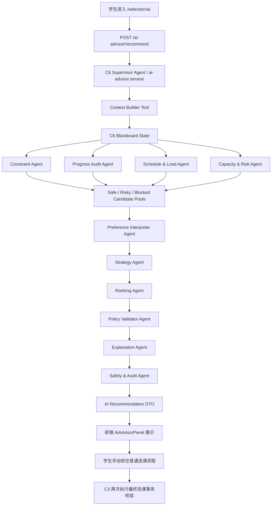
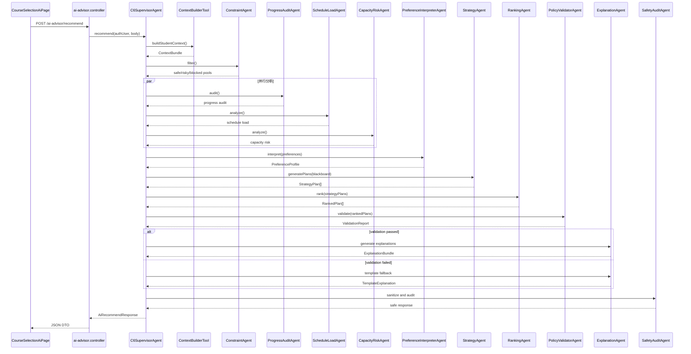

# STSS C6 AI 辅助选课模块完整落地方案

> 模块：C 组智能选课 / C6 AI 辅助选课
> 架构：Guarded Blackboard Supervisor Agent Architecture
> 适用分支：`dev/C`
> 适用对象：C 组负责人、成员 5、coding agent
> 核心原则：规则护栏保证正确性，LLM Agent 参与软推荐决策，C3 负责最终选课事务

---

## 0. 方案定位

C6 的定位不是“AI 自动选课器”，而是：

> 带硬规则护栏的 AI 选课规划 Agent。

它应当完成：

1. 读取当前学生的培养方案、已选课程、可选课程、容量、课表和选课阶段。
2. 使用确定性规则生成安全候选课程池。
3. 使用 LLM/Agent 参与学生偏好理解、方案组合、取舍推理和软排序建议。
4. 使用后端二次校验防止 LLM 越界、幻觉或推荐禁选课程。
5. 返回学生可理解的推荐方案、推荐理由、风险提示和学分影响。
6. 任何情况下都不创建、不修改、不删除 `Enrollment`。

一句话：

```text
C6 = 规则护栏 + 黑板状态 + 中央编排 + LLM 策略推荐 + 后端二次复核 + 学生最终确认
```

---

## 1. 设计目标

### 1.1 业务目标

C6 要让学生在正式选课前回答这些问题：

1. 我现在的培养方案进度怎样？
2. 我当前还缺哪些学分或课程类别？
3. 本学期哪些课程比较适合我？
4. 哪些课程风险较高？
5. 如果我想稳妥一点、补短板、轻负担，分别怎么选？
6. 为什么推荐这门课，而不是另一门课？
7. AI 建议和真正选课提交之间有什么区别？

### 1.2 工程目标

C6 必须满足：

1. 可落地：在现有 C 组模块结构中实现。
2. 可降级：无 API Key、LLM 超时或模型失败时仍可返回模板推荐。
3. 可审计：每次推荐的中间状态可追踪。
4. 可测试：规则过滤、Agent 输出、Validator、fallback 都可单测。
5. 可控：LLM 不能决定硬规则，不能写数据库。
6. 可演示：前端 `/selection/ai` 能展示三类方案、推荐理由、风险和降级提示。

---

## 2. 硬性边界

### 2.1 C6 可以做

C6 可以：

1. 推荐课程。
2. 解释课程。
3. 分析培养方案进度。
4. 分析学分缺口。
5. 分析课表负担。
6. 分析容量风险。
7. 生成三套推荐方案。
8. 生成 why / why-not 解释。
9. 根据学生偏好调整软排序。
10. 跳转普通选课页面或课程详情页。

### 2.2 C6 禁止做

C6 禁止：

1. 调用 `POST /api/v1/course-selection/enrollments`。
2. 调用 `PATCH /api/v1/course-selection/enrollments/:id/drop`。
3. 创建 `Enrollment`。
4. 修改 `Enrollment`。
5. 删除 `Enrollment`。
6. 修改 `CourseOffering.enrolled_count`。
7. 修改 `SelectionPeriod`。
8. 修改 `Curriculum`。
9. 修改 `Course`。
10. 新增数据库业务表。
11. 接收前端传入的 `student_id` 或 `studentId` 作为学生身份。
12. 让 LLM 判断课程是否最终可选。
13. 输出“已为你选课成功”“已锁定名额”“已抢到课程”等误导性表述。

---

## 3. 最终推荐架构

### 3.1 架构名称

本方案采用：

> Guarded Blackboard Supervisor Agent Architecture

中文说明：

> 带护栏的黑板式监督者 Agent 架构。

它由三层组成：

```text
第一层：规则护栏层
第二层：LLM 策略推荐层
第三层：验证与解释层
```

### 3.2 总体流程图



### 3.3 架构核心思想

C6 不采用“多个 Agent 自由聊天后投票”的模式。它采用企业流程型 Agent：

```text
固定流程 + 局部 LLM 决策 + 后端验证
```

原因：

1. 选课是强约束业务。
2. 容量、冲突、阶段、先修、培养方案必须可解释可复现。
3. LLM 可能幻觉，必须被规则夹住。
4. 推荐结果不能影响真实选课事务。
5. 前端展示必须稳定，不能依赖多轮 Agent 聊天是否成功。

---

## 4. C6 Agent 职责划分

### 4.1 Supervisor Agent

工程位置：

```text
backend/src/modules/course-selection/ai-advisor.service.ts
```

职责：

1. 接收 controller 的请求。
2. 校验当前用户必须是学生。
3. 初始化 Blackboard。
4. 调用 Context Builder。
5. 调度 Constraint / Progress / Schedule / Risk / Preference / Strategy / Ranking / Validator / Explanation / Safety。
6. 控制超时和 fallback。
7. 汇总最终响应 DTO。

性质：

```text
确定性 Orchestrator，不是自由 LLM Agent。
```

---

### 4.2 Context Builder Tool

工程位置：

```text
ai-advisor.service.ts 内部私有方法
或
backend/src/modules/course-selection/ai-advisor.context.ts
```

职责：

只读读取：

```text
Student
Curriculum
CurriculumCourse
Course
CourseOffering
Schedule
Enrollment
SelectionPeriod
CoursePrerequisite
```

输出：

```text
当前学生上下文快照。
```

禁止：

1. 写数据库。
2. 修改选课状态。
3. 信任前端传来的学生身份。

---

### 4.3 Constraint Agent

职责：

硬规则过滤。

它必须确定：

1. 是否已选。
2. 是否容量满。
3. 是否时间冲突。
4. 是否不在选课阶段。
5. 是否超过最大学分。
6. 是否不属于培养方案。
7. 是否不满足先修。
8. 是否课程或开课状态不可选。

输出三类池：

```text
safe_candidate_pool   可以被 Strategy Agent 推荐
risky_candidate_pool  有风险，可解释但默认不进主推
blocked_pool          明确不可推荐，只能进入 conflict_notes
```

性质：

```text
100% 规则实现，不调用 LLM。
```

---

### 4.4 Progress Audit Agent

职责：

分析学生培养方案和学分进展。

它回答：

1. 当前已选多少学分？
2. 距离目标学分还差多少？
3. 必修课、选修课、公共课分别缺多少？
4. 哪类缺口最紧急？
5. 哪些课程对毕业路径更关键？

性质：

```text
规则/统计型 Agent，不依赖 LLM。
```

---

### 4.5 Schedule & Load Agent

职责：

分析课表负担。

它不仅判断冲突，还判断：

1. 是否早八过多。
2. 是否某天课程过密。
3. 是否连续上课时间太长。
4. 是否课程分布过碎。
5. 是否有轻负担方案空间。

性质：

```text
规则型 Agent，可为轻负担推荐提供特征。
```

---

### 4.6 Capacity & Risk Agent

职责：

分析容量和选课风险。

它输出：

1. 剩余容量。
2. 课程填充率。
3. 容量风险等级。
4. 是否建议提供备选课程。
5. 是否属于高风险课程。

性质：

```text
规则型 Agent。
```

---

### 4.7 Preference Interpreter Agent

职责：

将学生自然语言偏好转成结构化偏好。

例如：

```text
我这学期想轻松一点，最好不要早八，但也别耽误毕业。
```

转成：

```json
{
  "prefer_low_load": true,
  "avoid_early_morning": true,
  "prefer_graduation_progress": true,
  "risk_tolerance": "low"
}
```

性质：

```text
LLM 可参与。
```

失败兜底：

```text
默认偏好 = 稳妥、低风险、优先培养方案进度。
```

---

### 4.8 Strategy Agent

这是 C6 的核心 AI 推荐 Agent。

职责：

在 `safe_candidate_pool` 内生成三类方案：

1. 稳妥方案。
2. 补短板方案。
3. 轻负担方案。

它负责：

1. 理解学生偏好。
2. 结合学分缺口设计方案。
3. 结合课表负担做组合。
4. 结合容量风险决定是否加入备选课程。
5. 生成方案级取舍说明。
6. 生成 why-not 初步依据。

性质：

```text
LLM 参与软推荐决策，但不能越过 safe_candidate_pool。
```

关键边界：

```text
Strategy Agent 只能在后端给定的安全候选池中选择课程。
```

---

### 4.9 Ranking Agent

职责：

将 Strategy Agent 的方案转为稳定分数和排序。

建议评分公式：

```text
final_score =
  0.30 * curriculum_match
+ 0.20 * credit_gap_fit
+ 0.15 * schedule_fit
+ 0.15 * preference_fit
+ 0.10 * capacity_fit
+ 0.10 * risk_inverse
```

性质：

```text
规则为主，LLM 可提供偏好权重建议，但最终分数由后端计算。
```

输出：

1. 课程推荐分。
2. 分项得分。
3. 推荐理由。
4. 风险标签。

---

### 4.10 Policy Validator Agent

职责：

复核 LLM / Strategy 输出是否越界。

必须检查：

1. LLM 推荐的所有课程是否都在 `safe_candidate_pool`。
2. 是否推荐了 `blocked_pool` 中的课程。
3. 是否生成了不存在的课程 ID。
4. 是否超过 `max_recommendations`。
5. 是否输出误导性文案。
6. 是否改变了硬规则结论。
7. 是否伪造容量、冲突、先修、教师、时间等事实。

性质：

```text
确定性校验，不调用 LLM。
```

如发现错误：

```text
丢弃错误课程 / 丢弃 LLM 输出 / 降级模板。
```

---

### 4.11 Explanation Agent

职责：

生成学生可读解释。

包括：

1. 为什么推荐这套方案。
2. 为什么推荐这门课。
3. 为什么不推荐另一门课。
4. 当前风险是什么。
5. 学分影响是什么。
6. 如果学生更重视轻松或毕业进度，推荐会如何变化。

性质：

```text
LLM 负责自然语言表达。
```

边界：

```text
Explanation Agent 只能解释已经通过 Policy Validator 的结果。
```

---

### 4.12 Safety & Audit Agent

职责：

最后安全处理。

包括：

1. 脱敏。
2. 过滤误导性文本。
3. 记录 fallback 状态。
4. 记录 request_id。
5. 记录 LLM 是否使用。
6. 记录模型名称。
7. 记录耗时。
8. 确保输出不包含学生敏感信息。

---

## 5. UML 类图

```mermaid
classDiagram
    class AiAdvisorController {
      +recommend(req, res)
      +explain(req, res)
    }

    class C6SupervisorAgent {
      +recommend(input: AiRecommendInput): Promise~AiRecommendResponse~
      +explain(input: AiExplainInput): Promise~AiExplainResponse~
      -initBlackboard(input): C6Blackboard
      -buildResponse(bb): AiRecommendResponse
    }

    class ContextBuilderTool {
      +buildStudentContext(userId, semesterId): Promise~ContextBundle~
    }

    class ConstraintAgent {
      +filter(bb: C6Blackboard): ConstraintOutput
      -checkCapacity(course): EligibilitySnapshot
      -checkConflict(course): EligibilitySnapshot
      -checkPrerequisite(course): EligibilitySnapshot
      -checkPeriod(course): EligibilitySnapshot
    }

    class ProgressAuditAgent {
      +audit(bb: C6Blackboard): ProgressAuditResult
    }

    class ScheduleLoadAgent {
      +analyze(bb: C6Blackboard): ScheduleLoadResult
    }

    class CapacityRiskAgent {
      +analyze(bb: C6Blackboard): CapacityRiskResult[]
    }

    class PreferenceInterpreterAgent {
      +interpret(input, bb): Promise~PreferenceProfile~
    }

    class StrategyAgent {
      +generatePlans(bb: C6Blackboard): Promise~StrategyPlan[]~
    }

    class RankingAgent {
      +rank(bb: C6Blackboard): RankedPlan[]
      -scoreCourse(course, bb): ScoreBreakdown
    }

    class PolicyValidatorAgent {
      +validate(bb: C6Blackboard): ValidationReport
    }

    class ExplanationAgent {
      +generate(bb: C6Blackboard): Promise~ExplanationBundle~
      +template(bb: C6Blackboard): ExplanationBundle
    }

    class SafetyAuditAgent {
      +sanitizeOutput(response): AiRecommendResponse
      +recordAudit(bb): void
    }

    class LlmClient {
      +complete(prompt): Promise~LlmResult~
    }

    AiAdvisorController --> C6SupervisorAgent
    C6SupervisorAgent --> ContextBuilderTool
    C6SupervisorAgent --> ConstraintAgent
    C6SupervisorAgent --> ProgressAuditAgent
    C6SupervisorAgent --> ScheduleLoadAgent
    C6SupervisorAgent --> CapacityRiskAgent
    C6SupervisorAgent --> PreferenceInterpreterAgent
    C6SupervisorAgent --> StrategyAgent
    C6SupervisorAgent --> RankingAgent
    C6SupervisorAgent --> PolicyValidatorAgent
    C6SupervisorAgent --> ExplanationAgent
    C6SupervisorAgent --> SafetyAuditAgent
    PreferenceInterpreterAgent --> LlmClient
    StrategyAgent --> LlmClient
    ExplanationAgent --> LlmClient
```



---

## 6. 推荐时序图



---

## 7. TypeScript Interface 设计

### 7.1 基础输入

```ts
export interface AiRecommendRequest {
  semester_id?: string;
  preferences?: AiStudentPreferences;
  max_recommendations?: number;
}

export interface AiStudentPreferences {
  target_credits?: number;
  preferred_course_types?: Array<'required' | 'elective' | 'general'>;
  avoid_early_morning?: boolean;
  prefer_low_load?: boolean;
  prefer_required_courses?: boolean;
  natural_language_preference?: string;
}

export interface AiExplainRequest {
  course_offering_id: string;
  question?: string;
}
```

---

### 7.2 Blackboard

```ts
export interface C6Blackboard {
  request_meta: {
    request_id: string;
    semester_id?: string;
    max_recommendations: number;
    started_at: string;
  };

  auth_context: {
    user_id: string;
    role: 'student';
  };

  student_context: StudentContextSnapshot;

  curriculum_snapshot: CurriculumSnapshot;
  selected_courses: SelectedCourseSnapshot[];
  available_offerings: OfferingSnapshot[];
  current_period?: SelectionPeriodSnapshot;

  eligibility_results: Record<string, EligibilitySnapshot>;

  progress_audit?: ProgressAuditResult;
  schedule_load?: ScheduleLoadResult;
  capacity_risks?: CapacityRiskResult[];

  safe_candidate_pool: CandidateCourse[];
  risky_candidate_pool: CandidateCourse[];
  blocked_pool: BlockedCourse[];

  preference_profile?: PreferenceProfile;
  strategy_plans?: StrategyPlan[];
  ranked_plans?: RankedPlan[];

  validation_report?: ValidationReport;
  explanations?: ExplanationBundle;

  fallback_info: FallbackInfo;
}
```

---

### 7.3 上下文快照

```ts
export interface StudentContextSnapshot {
  major_id: string;
  grade: number;
  class_name?: string;
}

export interface CurriculumSnapshot {
  curriculum_id: string;
  curriculum_name: string;
  total_credits?: number;
  required_credits?: number;
  elective_credits?: number;
  general_credits?: number;
  course_requirements: CurriculumCourseRequirement[];
}

export interface CurriculumCourseRequirement {
  course_id: string;
  course_code: string;
  course_name: string;
  course_type: 'required' | 'elective' | 'general';
  suggested_semester?: number;
}

export interface SelectedCourseSnapshot {
  enrollment_id: string;
  course_offering_id: string;
  course_id: string;
  course_code: string;
  course_name: string;
  credits: number;
  course_type: 'required' | 'elective' | 'general';
  status: 'enrolled' | 'dropped' | 'withdrawn';
  schedules: ScheduleSlot[];
}

export interface OfferingSnapshot {
  course_offering_id: string;
  course_id: string;
  course_code: string;
  course_name: string;
  credits: number;
  course_type: 'required' | 'elective' | 'general';
  teacher_name?: string;
  capacity: number;
  enrolled_count: number;
  remaining_capacity: number;
  offering_status: 'planned' | 'open' | 'closed' | 'cancelled';
  schedules: ScheduleSlot[];
}
```

---

### 7.4 规则结果

```ts
export interface EligibilitySnapshot {
  course_offering_id: string;
  is_available: boolean;
  is_enrolled: boolean;
  is_full: boolean;
  has_time_conflict: boolean;
  prerequisite_satisfied: boolean | 'unknown';
  within_curriculum: boolean;
  within_selection_period: boolean;
  under_max_credits: boolean;
  reasons: string[];
  blocked_by?: Array<
    | 'already_enrolled'
    | 'capacity'
    | 'time_conflict'
    | 'prerequisite'
    | 'curriculum'
    | 'selection_period'
    | 'max_credits'
    | 'offering_status'
  >;
}

export interface ConstraintOutput {
  safe_candidate_pool: CandidateCourse[];
  risky_candidate_pool: CandidateCourse[];
  blocked_pool: BlockedCourse[];
}

export interface CandidateCourse {
  course_offering_id: string;
  course_code: string;
  course_name: string;
  credits: number;
  course_type: 'required' | 'elective' | 'general';
  teacher_name?: string;
  eligibility_snapshot: EligibilitySnapshot;
  capacity_risk?: CapacityRiskResult;
}

export interface BlockedCourse {
  course_offering_id: string;
  course_name: string;
  blocked_by: string[];
  message: string;
}
```

---

### 7.5 分析 Agent 输出

```ts
export interface ProgressAuditResult {
  current_selected_credits: number;
  target_credits?: number;
  max_credits?: number;
  required_gap?: number;
  elective_gap?: number;
  general_gap?: number;
  priority_gaps: Array<{
    course_type: 'required' | 'elective' | 'general';
    gap_credits: number;
    urgency: 'low' | 'medium' | 'high';
    reason: string;
  }>;
}

export interface ScheduleLoadResult {
  early_morning_count: number;
  dense_days: string[];
  load_score: number;
  load_level: 'low' | 'medium' | 'high';
  notes: string[];
}

export interface CapacityRiskResult {
  course_offering_id: string;
  remaining_capacity: number;
  fill_rate: number;
  risk_level: 'low' | 'medium' | 'high';
  risk_reason: string;
}

export interface PreferenceProfile {
  target_credits?: number;
  avoid_early_morning: boolean;
  prefer_low_load: boolean;
  prefer_required_courses: boolean;
  prefer_graduation_progress: boolean;
  risk_tolerance: 'low' | 'medium' | 'high';
  preferred_course_types: Array<'required' | 'elective' | 'general'>;
  source: 'request_fields' | 'llm_interpreted' | 'default';
}
```

---

### 7.6 推荐方案

```ts
export type StrategyPlanType = 'safe' | 'gap_filling' | 'low_load';

export interface StrategyPlan {
  plan_type: StrategyPlanType;
  plan_name: string;
  summary: string;
  course_offering_ids: string[];
  target_reason: string;
  key_tradeoffs: string[];
  estimated_credits: number;
  risk_level: 'low' | 'medium' | 'high' | 'unknown';
}

export interface RankedPlan extends StrategyPlan {
  courses: RankedCourse[];
  plan_score: number;
}

export interface RankedCourse {
  course_offering_id: string;
  course_code: string;
  course_name: string;
  credits: number;
  teacher_name?: string;
  recommendation_score: number;
  score_breakdown: ScoreBreakdown;
  reasons: string[];
  risks: string[];
  eligibility_snapshot: EligibilitySnapshot;
}

export interface ScoreBreakdown {
  curriculum_match: number;
  credit_gap_fit: number;
  schedule_fit: number;
  preference_fit: number;
  capacity_fit: number;
  risk_inverse: number;
}
```

---

### 7.7 验证与解释

```ts
export interface ValidationReport {
  valid: boolean;
  invalid_course_offering_ids: string[];
  warnings: string[];
  action: 'accept' | 'drop_invalid_courses' | 'fallback_template' | 'disable_ai';
}

export interface ExplanationBundle {
  summary: string;
  plan_explanations: Record<string, string>;
  course_explanations: Record<string, CourseExplanation>;
  disclaimer: string;
}

export interface CourseExplanation {
  why_recommended: string[];
  why_not?: string[];
  risks: string[];
}

export interface FallbackInfo {
  mode: 'full' | 'rule_only' | 'template_only' | 'disabled';
  missing_components: string[];
  llm_used: boolean;
  model?: string;
  reason?: string;
}
```

---

### 7.8 API Response

```ts
export interface AiRecommendResponse {
  disclaimer: string;
  mode: 'full' | 'rule_only' | 'template_only' | 'disabled';
  degraded_mode: boolean;
  llm_used: boolean;
  model?: string;

  credit_progress_summary: {
    current_selected_credits: number;
    target_credits?: number;
    max_credits?: number;
    remaining_to_target?: number;
  };

  plans: RankedPlan[];

  recommendations: RankedCourse[];

  conflict_notes: Array<{
    course_offering_id: string;
    course_name: string;
    message: string;
  }>;

  explanation_summary: string;

  fallback_info: FallbackInfo;
}
```

---

## 8. Orchestrator 调度伪代码

```ts
export async function recommendForStudent(
  authUser: AuthUser,
  body: AiRecommendRequest
): Promise<AiRecommendResponse> {
  assertStudent(authUser);
  assertNoStudentIdInBody(body);

  const bb = initBlackboard(authUser, body);

  try {
    const context = await contextBuilder.buildStudentContext({
      userId: authUser.id,
      semesterId: body.semester_id,
    });

    hydrateBlackboard(bb, context);

    const constraintOutput = constraintAgent.filter(bb);
    bb.safe_candidate_pool = constraintOutput.safe_candidate_pool;
    bb.risky_candidate_pool = constraintOutput.risky_candidate_pool;
    bb.blocked_pool = constraintOutput.blocked_pool;

    if (bb.safe_candidate_pool.length === 0) {
      bb.fallback_info = {
        mode: 'template_only',
        missing_components: [],
        llm_used: false,
        reason: 'no safe candidate courses',
      };

      bb.explanations = explanationAgent.template(bb);
      return safetyAuditAgent.sanitizeOutput(buildResponse(bb));
    }

    const [progress, scheduleLoad, capacityRisks] = await Promise.all([
      progressAuditAgent.audit(bb),
      scheduleLoadAgent.analyze(bb),
      capacityRiskAgent.analyze(bb),
    ]);

    bb.progress_audit = progress;
    bb.schedule_load = scheduleLoad;
    bb.capacity_risks = capacityRisks;

    bb.preference_profile = await preferenceInterpreterAgent.interpret({
      rawPreferences: body.preferences,
      blackboard: bb,
    });

    bb.strategy_plans = await strategyAgent.generatePlans(bb);

    bb.ranked_plans = rankingAgent.rank(bb);

    bb.validation_report = policyValidatorAgent.validate(bb);

    if (!bb.validation_report.valid) {
      applyValidationAction(bb);
    }

    bb.explanations = await explanationAgent.generateOrTemplate(bb);

    const response = buildResponse(bb);

    return safetyAuditAgent.sanitizeOutput(response);
  } catch (error) {
    bb.fallback_info = {
      mode: 'template_only',
      missing_components: ['unexpected_error'],
      llm_used: false,
      reason: safeErrorMessage(error),
    };

    bb.explanations = explanationAgent.template(bb);

    return safetyAuditAgent.sanitizeOutput(buildResponse(bb));
  }
}
```

---

## 9. Agent 实现方式建议

### 9.1 不建议一期建复杂目录

不建议一期新建：

```text
backend/src/modules/course-selection/ai-advisor/agents/
backend/src/modules/course-selection/ai-advisor/dto/
backend/src/modules/course-selection/ai-advisor/prompts/
```

原因：

1. 当前 C 组模块大多是平铺结构。
2. 新目录会增加合并冲突。
3. coding agent 容易误改更多文件。
4. 一期重点是可交付，不是框架炫技。

### 9.2 推荐文件结构

建议只新增少量辅助文件：

```text
backend/src/modules/course-selection/
├── ai-advisor.controller.ts
├── ai-advisor.service.ts
├── ai-advisor.llm-client.ts
├── ai-advisor.prompts.ts
├── ai-advisor.templates.ts
├── course-selection.schemas.ts
├── course-selection.types.ts
└── README.md
```

前端：

```text
frontend/src/modules/course-selection/
├── pages/CourseSelectionAiPage.tsx
├── components/AiAdvisorPanel.tsx
├── api/ai-advisor.ts
├── hooks/useAiAdvisor.ts
├── types/ai.ts
└── README.md
```

---

## 10. OpenRouter 接入方案

### 10.1 默认模型

一期推荐：

```text
Provider: OpenRouter
Model: nvidia/nemotron-3-ultra-550b-a55b:free
```

### 10.2 环境变量

后端 `.env`：

```env
LLM_ENABLED=true
LLM_PROVIDER=openrouter
LLM_BASE_URL=https://openrouter.ai/api/v1
OPENROUTER_MODEL=nvidia/nemotron-3-ultra-550b-a55b:free
LLM_TIMEOUT_MS=20000
LLM_MAX_TOKENS=16000
LLM_PREFERENCE_MAX_TOKENS=16000
LLM_RECOMMENDATION_MAX_TOKENS=16000
LLM_EXPLANATION_MAX_TOKENS=16000
LLM_TOTAL_MAX_TOKENS=48000
LLM_TEMPERATURE=0.2
LLM_FALLBACK_MODE=template
OPENROUTER_API_KEY=
OPENROUTER_HTTP_REFERER=http://localhost:5173
OPENROUTER_APP_TITLE=STSS-C6-AI-Advisor
```

### 10.3 API Key 规则

必须遵守：

1. 只允许后端读取 `OPENROUTER_API_KEY`。
2. 前端不能读取 API Key。
3. 不能提交真实 API Key。
4. 不能在日志打印完整 API Key。
5. 无 Key 时自动走模板降级。

### 10.4 LLM 调用次数限制

一期强制：

```text
每次 /recommend 最多 2 次 LLM 调用：
1. Preference Interpreter
2. Strategy + Explanation 可合并一次

每次 /explain 最多 1 次 LLM 调用。
```

如果担心 free 模型额度，可以进一步压缩为：

```text
/recommend 只调用 1 次 LLM：Preference + Strategy + Explanation 合并
```

### 10.5 LLM Client 接口

```ts
export interface LlmClient {
  complete(input: LlmCompleteInput): Promise<LlmCompleteResult>;
}

export interface LlmCompleteInput {
  system: string;
  user: string;
  temperature?: number;
  max_tokens?: number;
  timeout_ms?: number;
}

export interface LlmCompleteResult {
  ok: boolean;
  content?: string;
  model?: string;
  error_type?:
    | 'missing_api_key'
    | 'timeout'
    | 'rate_limited'
    | 'payment_required'
    | 'provider_error'
    | 'invalid_response';
}
```

`llm-client` 不得向上抛出未处理异常。所有错误必须转成 `ok: false`。

---

## 11. Prompt 设计

### 11.1 通用 System Prompt

```text
你是智慧教学服务系统 STSS 的 C6 AI 辅助选课规划 Agent。

你的任务不是替学生选课，而是在后端已经计算出的安全候选课程池中，帮助学生理解哪些课程组合更适合当前学期。

你必须遵守：
1. 只能在提供的 safe_candidate_pool 中选择课程。
2. 不得新增、编造、修改任何课程、教师、容量、时间、学分、先修信息。
3. 不得改变 eligibility_snapshot 或 hard_rule_result。
4. 不得声称已经完成选课、锁定名额或抢课成功。
5. 不得输出任何写入 Enrollment 的表述。
6. 必须提醒最终选课结果以学生手动提交选课时的服务端校验为准。
7. 输出中文，简洁、清楚、适合本科学生阅读。
```

---

### 11.2 Preference Interpreter Prompt

```text
你是选课偏好解析 Agent。

请把学生输入的自然语言偏好和结构化偏好，转换成严格 JSON。

只能输出 JSON，不要输出 Markdown，不要解释。

字段定义：
{
  "target_credits": number | null,
  "avoid_early_morning": boolean,
  "prefer_low_load": boolean,
  "prefer_required_courses": boolean,
  "prefer_graduation_progress": boolean,
  "risk_tolerance": "low" | "medium" | "high",
  "preferred_course_types": ("required" | "elective" | "general")[],
  "explanation_style": "brief" | "detailed"
}

默认规则：
1. 如果学生说想轻松，prefer_low_load=true，risk_tolerance="low"。
2. 如果学生说想稳妥毕业，prefer_graduation_progress=true，prefer_required_courses=true。
3. 如果学生说想多修，target_credits 可略高，但不能超过后端 max_credits。
4. 如果没有明确偏好，默认 prefer_graduation_progress=true，risk_tolerance="low"。
5. 不要输出 student_id、姓名、学号等身份信息。

输入：
{{sanitized_preference_input}}
```

---

### 11.3 Strategy Agent Prompt

```text
你是 STSS C6 的选课策略规划 Agent。

你的任务：
在后端提供的 safe_candidate_pool 中，为学生生成三套选课建议方案：

1. safe：稳妥方案
   - 优先培养方案要求
   - 优先必修课
   - 优先容量风险低
   - 优先课表冲突风险低

2. gap_filling：补短板方案
   - 优先补足当前最紧急的学分缺口
   - 可以选择更有学业推进价值的课程
   - 需要说明取舍

3. low_load：轻负担方案
   - 优先课表舒适
   - 避免早八或过密课程
   - 控制负担
   - 不能牺牲硬规则

必须遵守：
1. 只能使用 safe_candidate_pool 中的 course_offering_id。
2. 不得推荐 blocked_pool 中的课程。
3. 不得新增不存在的课程。
4. 不得声称已经完成选课。
5. 如果某类方案无法生成，返回空 courses，并说明原因。
6. 输出严格 JSON，不要输出 Markdown。

输出 JSON 格式：
{
  "plans": [
    {
      "plan_type": "safe" | "gap_filling" | "low_load",
      "plan_name": string,
      "summary": string,
      "course_offering_ids": string[],
      "target_reason": string,
      "key_tradeoffs": string[],
      "risk_level": "low" | "medium" | "high" | "unknown"
    }
  ]
}

输入：
{{sanitized_strategy_context}}
```

---

### 11.4 Explanation Agent Prompt

```text
你是 STSS C6 的选课解释 Agent。

请根据已经通过后端校验的推荐方案，生成面向学生的中文解释。

要求：
1. 先总结当前学分进展。
2. 再分别解释三套方案：
   - 稳妥方案
   - 补短板方案
   - 轻负担方案
3. 对每门推荐课程给出 2 到 4 条推荐理由。
4. 如果有风险，必须明确说明。
5. 必须包含一句免责声明：AI 建议仅供参考，最终是否选课以提交选课时的服务端校验结果为准。
6. 不得输出“已选上”“已锁定”“已抢到”等表述。
7. 不得编造输入中不存在的课程事实。

输出严格 JSON：
{
  "summary": string,
  "plan_explanations": {
    "safe": string,
    "gap_filling": string,
    "low_load": string
  },
  "course_explanations": {
    "<course_offering_id>": {
      "why_recommended": string[],
      "risks": string[]
    }
  },
  "disclaimer": string
}

输入：
{{validated_recommendation_context}}
```

---

### 11.5 Explain Single Course Prompt

```text
你是 STSS C6 的单门课程解释 Agent。

请解释这门课为什么适合或不适合该学生当前学期选择。

必须遵守：
1. hard_rule_result 由后端给出，你不能修改。
2. 如果 hard_rule_result.is_selectable_now=false，必须优先解释不可选原因。
3. 如果课程可选，说明它对培养方案、学分进展、课表安排的帮助。
4. 如果有容量、先修、课表或阶段风险，必须说明。
5. 最后提醒：最终选课结果以提交选课时的服务端校验为准。
6. 不要输出“已经选课成功”。

输出 JSON：
{
  "explanation": string,
  "why_recommended": string[],
  "why_not": string[],
  "risks": string[],
  "disclaimer": string
}

输入：
{{single_course_context}}
```

---

## 12. API 契约

### 12.1 推荐接口

```text
POST /api/v1/course-selection/ai-advisor/recommend
Authorization: Bearer <access_token>
Content-Type: application/json
```

Request：

```json
{
  "semester_id": "optional uuid",
  "preferences": {
    "target_credits": 22,
    "preferred_course_types": ["required", "elective"],
    "avoid_early_morning": true,
    "prefer_low_load": false,
    "natural_language_preference": "我想稳妥一点，不要课太满"
  },
  "max_recommendations": 5
}
```

禁止字段：

```text
student_id
studentId
user_id
```

Response：

```json
{
  "code": 200,
  "message": "success",
  "data": {
    "disclaimer": "AI 建议仅供参考，最终选课必须通过系统选课入口并接受容量、冲突、阶段和培养方案校验。",
    "mode": "full",
    "degraded_mode": false,
    "llm_used": true,
    "model": "nvidia/nemotron-3-ultra-550b-a55b:free",
    "credit_progress_summary": {
      "current_selected_credits": 18.0,
      "target_credits": 22.0,
      "max_credits": 28.0,
      "remaining_to_target": 4.0
    },
    "plans": [
      {
        "plan_type": "safe",
        "plan_name": "稳妥方案",
        "summary": "优先推荐必修、无冲突、容量风险低的课程。",
        "total_credits": 4.0,
        "risk_level": "low",
        "plan_score": 0.91,
        "courses": [
          {
            "course_offering_id": "uuid",
            "course_code": "CS101",
            "course_name": "程序设计基础",
            "credits": 4.0,
            "teacher_name": "王老师",
            "recommendation_score": 0.91,
            "score_breakdown": {
              "curriculum_match": 0.3,
              "credit_gap_fit": 0.2,
              "schedule_fit": 0.15,
              "preference_fit": 0.15,
              "capacity_fit": 0.1,
              "risk_inverse": 0.1
            },
            "reasons": [
              "属于当前培养方案专业必修课",
              "补足本阶段目标学分",
              "与已选课程无时间冲突"
            ],
            "risks": [],
            "eligibility_snapshot": {
              "is_available": true,
              "is_enrolled": false,
              "is_full": false,
              "has_time_conflict": false,
              "prerequisite_satisfied": true,
              "within_curriculum": true,
              "within_selection_period": true,
              "under_max_credits": true,
              "reasons": []
            }
          }
        ],
        "key_tradeoffs": [
          "该方案风险较低，但探索性较弱。"
        ]
      }
    ],
    "recommendations": [],
    "conflict_notes": [
      {
        "course_offering_id": "uuid",
        "course_name": "编译原理",
        "message": "该课程容量已满，暂不推荐。"
      }
    ],
    "explanation_summary": "根据你的培养方案和当前已选课程，本轮建议优先补足必修学分。",
    "fallback_info": {
      "mode": "full",
      "missing_components": [],
      "llm_used": true,
      "model": "nvidia/nemotron-3-ultra-550b-a55b:free"
    }
  }
}
```

兼容要求：

```text
recommendations 字段应保留。
若新增 plans 字段，也应把默认方案中的课程同步填入 recommendations，避免旧前端失效。
```

---

### 12.2 解释接口

```text
POST /api/v1/course-selection/ai-advisor/explain
Authorization: Bearer <access_token>
Content-Type: application/json
```

Request：

```json
{
  "course_offering_id": "uuid",
  "question": "这门课为什么适合我本学期选择？"
}
```

Response：

```json
{
  "code": 200,
  "message": "success",
  "data": {
    "course_offering_id": "uuid",
    "course_name": "程序设计基础",
    "explanation": "这门课属于你的培养方案专业必修课，当前容量仍有剩余，并且与已选课程没有时间冲突。选择后你的本学期已选学分将从 18.0 增加到 22.0，仍低于当前阶段 28.0 学分上限。",
    "hard_rule_result": {
      "is_selectable_now": true,
      "reasons": []
    },
    "llm_used": true,
    "model": "nvidia/nemotron-3-ultra-550b-a55b:free",
    "degraded_mode": false,
    "disclaimer": "该解释仅辅助理解，最终是否选课以提交选课时的服务端校验结果为准。"
  }
}
```

---

## 13. 降级策略

### 13.1 模式

| mode            | 场景            | 行为                   |
| --------------- | ------------- | -------------------- |
| `full`          | 规则 + LLM 均成功  | 返回 Agent 推荐 + LLM 解释 |
| `rule_only`     | LLM 失败        | 返回规则推荐 + 模板解释        |
| `template_only` | 部分上下文不足       | 返回基础推荐/解释            |
| `disabled`      | 核心数据缺失或 AI 关闭 | 返回说明，不阻断普通选课         |

### 13.2 LLM 失败不能导致接口失败

以下情况必须降级：

1. `OPENROUTER_API_KEY` 缺失。
2. OpenRouter 超时。
3. OpenRouter 返回 429。
4. OpenRouter 返回 402。
5. OpenRouter 返回 5xx。
6. 模型输出为空。
7. 模型输出不是合法 JSON。
8. 模型推荐了不在 safe pool 的课程。
9. 模型输出包含误导性文案。

降级输出：

```json
{
  "degraded_mode": true,
  "llm_used": false,
  "mode": "rule_only",
  "fallback_info": {
    "mode": "rule_only",
    "missing_components": ["llm"],
    "llm_used": false,
    "reason": "LLM unavailable, template explanation used"
  }
}
```

---

## 14. C3 与 C6 冲突隔离协议

### 14.1 权限分离

| 模块       | 权限                  |
| -------- | ------------------- |
| C6       | 推荐、解释、模拟、提示风险       |
| C3       | 创建/更新/退选 Enrollment |
| 前端 AI 页面 | 展示建议、跳转课程详情或普通选课页   |

C6 不拥有任何写入选课结果的能力。

---

### 14.2 数据读写分离

C6 可读：

```text
Student
Curriculum
CurriculumCourse
Course
CourseOffering
Schedule
Enrollment
SelectionPeriod
CoursePrerequisite
```

C6 不可写：

```text
Enrollment
CourseOffering.enrolled_count
SelectionPeriod
Curriculum
Course
```

---

### 14.3 推荐结果不等于选课结果

C6 返回：

```text
recommendation_score
reasons
risks
plans
conflict_notes
disclaimer
```

C6 不返回：

```text
enrollment_created: true
reserved_seat: true
locked_capacity: true
selection_success: true
```

---

### 14.4 C3 必须重新校验

即使课程来自 C6 推荐，学生真正点击选课时，C3 仍必须重新校验：

```text
课程开设状态
容量
重复选课
选课阶段
课表冲突
最大学分
培养方案适配
先修课程
并发容量
```

### 14.5 前端按钮规则

AI 推荐卡片允许：

```text
查看详情
前往选课
查看解释
```

禁止：

```text
一键选课
AI 自动选课
帮我选上
锁定名额
```

---

## 15. 前端设计要求

### 15.1 CourseSelectionAiPage

页面顺序：

1. 标题：`AI 课程推荐`
2. 说明：`仅展示解释与建议，不会写入选课记录`
3. 免责声明 Alert。
4. 偏好表单。
5. 生成推荐按钮。
6. 学分进展摘要。
7. 三类方案卡片。
8. 推荐课程卡片。
9. 风险与冲突提示。
10. 降级提示。
11. 查看解释弹窗。

### 15.2 AiAdvisorPanel

必须支持状态：

1. initial
2. loading
3. success
4. empty
5. degraded
6. error

### 15.3 前端请求规则

前端调用：

```text
POST /api/v1/course-selection/ai-advisor/recommend
POST /api/v1/course-selection/ai-advisor/explain
```

禁止：

1. 请求体携带 `student_id`。
2. 请求体携带 `studentId`。
3. AI 面板调用 enrollment mutation。
4. 前端伪造推荐成功。
5. 前端在后端失败时使用 mock 数据冒充真实推荐。

---

## 16. 安全与脱敏

### 16.1 允许发送给 LLM

```text
course_code
course_name
course_type
credits
capacity
enrolled_count
remaining_capacity
schedule slots
eligibility flags
eligibility reasons
curriculum credit requirements
selected credits summary
risk flags
```

### 16.2 禁止发送给 LLM

```text
student_id
user_id
student_number
real_name
email
phone
avatar_url
password_hash
JWT
refresh token
完整身份信息
```

### 16.3 输出禁止词

如果 LLM 输出包含以下语义，必须丢弃或替换：

```text
已为你选课
已选上
已锁定名额
已抢课成功
保证能选上
不用再提交
系统已经帮你完成
```

---

## 17. 测试要求

### 17.1 后端单元测试

至少覆盖：

1. 无 API Key 时返回 `degraded_mode=true`。
2. LLM 超时时返回模板解释。
3. 请求包含 `student_id` 时拒绝。
4. C6 不调用 Enrollment 写入。
5. 已满课程不进入 `safe_candidate_pool`。
6. 时间冲突课程不进入推荐主列表。
7. LLM 推荐不在 safe pool 的课程时被 Validator 拦截。
8. explain 接口返回 `hard_rule_result`。
9. LLM 输出误导性文案时走模板降级。
10. `recommendations` 与 `plans` 字段兼容。

### 17.2 前端测试

至少覆盖：

1. AI 页面展示免责声明。
2. 推荐请求不包含 `student_id`。
3. degraded mode 显示降级提示。
4. 推荐卡片展示 reasons 和 risks。
5. 无推荐时显示空状态。
6. explain 按钮调用 `/ai-advisor/explain`。
7. AI 面板不触发 `/enrollments` 请求。

---

## 18. Docker 校验命令

后端：

```bash
./scripts/codex-docker-run.sh 'pnpm --filter @stss/shared build && pnpm --filter @stss/server typecheck'
```

前端：

```bash
CODEX_DOCKER_SERVICE=web CODEX_DOCKER_WORKDIR=/app ./scripts/codex-docker-run.sh 'pnpm --filter @stss/web typecheck'
```

测试：

```bash
./scripts/codex-docker-run.sh 'pnpm --filter @stss/server test:run -- src/__tests__/modules/course-selection'
```

如果当前环境无法访问 Docker socket，PR 中必须记录失败原因，不能伪造通过。

---

## 19. Coding Agent 执行流程

### Step 1：阅读文档

必须阅读：

```text
docs/srs/C-smart-course-selection-srs.md
docs/apis/C-smart-course-selection.md
docs/modules/course-selection-design.md
docs/tasks/C-member5-frontend-admin-teacher-ai-guide.md
docs/tasks/C-integration-and-acceptance-guide.md
backend/src/modules/course-selection/README.md
frontend/src/modules/course-selection/README.md
```

### Step 2：检查当前代码

检查：

```text
backend/src/modules/course-selection/ai-advisor.controller.ts
backend/src/modules/course-selection/ai-advisor.service.ts
backend/src/modules/course-selection/course-selection.schemas.ts
backend/src/modules/course-selection/course-selection.types.ts
frontend/src/modules/course-selection/pages/CourseSelectionAiPage.tsx
frontend/src/modules/course-selection/components/AiAdvisorPanel.tsx
frontend/src/modules/course-selection/api/ai-advisor.ts
frontend/src/modules/course-selection/hooks/useAiAdvisor.ts
frontend/src/modules/course-selection/types/ai.ts
```

### Step 3：实现后端

按顺序：

1. schema。
2. types。
3. Blackboard interface。
4. Context Builder。
5. Constraint Agent。
6. Progress/Schedule/Capacity 分析。
7. Preference Interpreter。
8. Strategy Agent。
9. Ranking Agent。
10. Policy Validator。
11. Explanation Agent。
12. Safety/Audit。
13. OpenRouter client。
14. Template fallback。

### Step 4：实现前端

按顺序：

1. `types/ai.ts`
2. `api/ai-advisor.ts`
3. `hooks/useAiAdvisor.ts`
4. `CourseSelectionAiPage.tsx`
5. `AiAdvisorPanel.tsx`
6. explain modal
7. degraded state
8. empty state

### Step 5：补测试

按第 17 节补最小测试。

### Step 6：执行 Docker 校验

按第 18 节执行。

### Step 7：PR 描述

PR 描述必须包含：

```text
1. 对应子模块：C6 AI 辅助选课。
2. 覆盖需求：FR-C-38~FR-C-43，NFR-C-09~NFR-C-11。
3. 是否接入 OpenRouter。
4. 是否配置 OPENROUTER_API_KEY：本地环境变量，不提交。
5. LLM 不可用时如何降级。
6. 是否修改数据库 schema：否。
7. 是否新增业务表：否。
8. 是否写 Enrollment：否。
9. 是否影响 C3 选课事务：否。
10. Docker wrapper 校验结果。
11. 手动验证路径：/selection/ai。
```

---

## 20. 最终验收标准

C6 通过标准：

1. `/selection/ai` 页面可访问。
2. 学生能请求 AI 推荐。
3. 推荐请求不包含 `student_id`。
4. 返回三类方案：稳妥、补短板、轻负担。
5. 每门推荐课程包含理由、风险、可选性快照。
6. 返回学分进展说明。
7. 返回冲突/容量/先修风险提示。
8. explain 接口能解释单门课程。
9. AI 建议包含免责声明。
10. 未配置 OpenRouter Key 时仍能模板降级。
11. LLM 超时不影响普通课程搜索、查看和选课。
12. C6 不创建、不更新、不删除 `Enrollment`。
13. C6 不修改 `CourseOffering.enrolled_count`。
14. 前端 AI 面板不调用选课 mutation。
15. 后端 typecheck 通过。
16. 前端 typecheck 通过。
17. 无法执行 Docker 时，交付说明中明确记录原因。

---

## 21. 给 coding agent 的最终指令

```text
你现在实现 STSS C 组 C6 AI 辅助选课模块。

必须遵守：
1. C6 只做推荐、解释、风险提示和学分说明。
2. C6 不写 Enrollment，不调用 POST /enrollments，不调用 PATCH /drop。
3. 学生身份必须来自 JWT，不允许前端传 student_id/studentId。
4. 推荐必须基于后端已有培养方案、可选课程、已选课程、课表、容量和 eligibility 快照。
5. 采用 Guarded Blackboard Supervisor Agent Architecture。
6. Constraint Agent 只做确定性硬规则过滤。
7. LLM 只参与偏好理解、方案组合、取舍推理和解释表达。
8. Strategy Agent 只能从 safe_candidate_pool 中选择课程。
9. Policy Validator 必须拦截所有不在 safe_candidate_pool 中的 AI 推荐。
10. 默认接入 OpenRouter，模型使用 nvidia/nemotron-3-ultra-550b-a55b:free。
11. OPENROUTER_API_KEY 只能从后端环境变量读取，不能进前端，不能提交。
12. 无 key、超时、429、402、5xx、输出异常时必须降级模板解释，接口不能因此整体失败。
13. 不新增 Prisma 表，不改 A/B/D/E/F 组业务代码。
14. 保持接口与 docs/apis/C-smart-course-selection.md 对齐。
15. 完成后执行 Docker wrapper typecheck，并记录结果。

优先修改：
backend/src/modules/course-selection/ai-advisor.controller.ts
backend/src/modules/course-selection/ai-advisor.service.ts
backend/src/modules/course-selection/course-selection.schemas.ts
backend/src/modules/course-selection/course-selection.types.ts
frontend/src/modules/course-selection/pages/CourseSelectionAiPage.tsx
frontend/src/modules/course-selection/components/AiAdvisorPanel.tsx
frontend/src/modules/course-selection/api/ai-advisor.ts
frontend/src/modules/course-selection/hooks/useAiAdvisor.ts
frontend/src/modules/course-selection/types/ai.ts

可新增：
backend/src/modules/course-selection/ai-advisor.llm-client.ts
backend/src/modules/course-selection/ai-advisor.prompts.ts
backend/src/modules/course-selection/ai-advisor.templates.ts
```

---

## 22. 最终一句话总结

C6 的最终形态不是“规则推荐器 + AI 解释器”，也不是“LLM 自动选课器”，而是：

```text
规则系统负责安全边界；
LLM Agent 负责偏好理解、方案设计和取舍推理；
Ranking Agent 负责稳定排序；
Policy Validator 负责防幻觉和防越权；
学生最终手动提交；
C3 最终决定选课是否成功。
```
