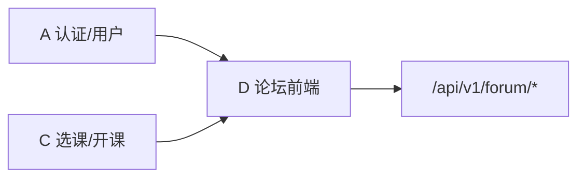

# D 组 · 论坛交流子系统 — 前端分工与任务拆解（v3）

> **文档用途**：D 组两名前端同学的执行清单（含紧急 Demo 与正式开发）。  
> **最后更新**：2026-05-17  
> **依据（本地文件）**：  
> - `docs/apis/D-discussion-forum.md`（合作者更新，六大接口域）  
> - `Smart Teaching Service System.md`（设计报告 §D 模块，约 549–832 行）  
> - `docs/project-requirements.md`、`docs/development-specifications.md`、`docs/database-design.md`  
> - 代码：`backend/src/modules/forum/*`、`frontend/src/App.tsx`、`frontend/src/shared/config/menu.tsx`  
> **建议工作分支**：`feat/D-demo-0517`（Demo）/ `feat/D-frontend-post-ui-0517`（正式迭代）

---

## 〇、当前仓库状态（基于本地代码）

### 后端（已完成 · 同组同学）

| 项目 | 状态 |
| ---- | ---- |
| 路由挂载 | `app.use('/api/v1/forum', forumRoutes)` |
| 实现文件 | `forum.routes.ts` / `forum.controller.ts` / `forum.service.ts` / `forum.schemas.ts` / `forum.types.ts` |
| 功能域 | 帖子、评论、公告、检索、统计、附件（与设计报告一致） |
| 认证 | 全部接口需 JWT（`authMiddleware`） |
| 课程隔离 | `verifyCourseAccess`：仅选课/授课范围内可读写 |
| 附件 | **Base64 JSON**，单文件 ≤10MB，支持批量最多 10 个 |
| 评论 | 服务端返回 **树形 `children`**，`depth` 限制（设计报告：一级回复展示） |
| 审计 | 发帖/删帖/置顶/隐藏等写 `SystemLog` |

**已合并进本地的同事分支**：`feat/D-核心api-0422` → `feat/D-announcement-attachment-0517` → 你的 `feat/D-frontend-post-ui-0517` / `feat/D-demo-0517`（提交链：`059352f` → `7d584e7` → `eca65d5`）。

### 前端（未完成 · 你们两人）

| 项目 | 状态 |
| ---- | ---- |
| `frontend/src/modules/forum/` | ❌ 不存在 |
| `App.tsx` 论坛路由 | ❌ 三条均为 `ComingSoon` |
| `menu.tsx` | ⚠️ 仅：帖子列表 / 我的发布 / 消息通知 |
| API 文档 | ✅ `docs/apis/D-discussion-forum.md` 已覆盖 6 类接口（路径为相对 `/forum`） |
| 私信/通知 | ❌ 设计报告明确 **范围外**，菜单「消息通知」建议 Demo 后隐藏或占位 |

### 设计报告对前端的命名约定（`Smart Teaching Service System.md` §D 构件设计）

| 类型 | 规划构件名 |
| ---- | ---------- |
| 页面 | `ForumHome`、`PostDetail`、`AnnouncementList`、`SearchResult`、`StatsPage` |
| 弹窗/子组件 | `PostEditor`、`CommentEditor`、`AttachmentUpload`、`StatFilter` |
| API | `forum.ts`（或按域拆 `posts.ts` / `comments.ts` 等） |

下文任务与分工 **对齐以上命名**，便于与设计报告、答辩材料一致。

---

## 一、D 模块要做什么（需求与设计对齐）

### 1.1 课程项目要求（5 项）

| 编号 | 功能 | 设计报告/接口文档对应 |
| ---- | ---- | --------------------- |
| D-1 | 论坛公告 | `POST/GET/PATCH/DELETE /forum/announcements` |
| D-2 | 发帖 + 附件 | `POST /forum/posts` + `POST /forum/attachments` |
| D-3 | 回帖留言 | `POST/GET /forum/posts/:id/comments`（树形） |
| D-4 | 文章管理 / 热帖 | `/forum/stats*`、`/forum/stats/hot-posts` |
| D-5 | 帖子检索 | `GET /forum/search` |

### 1.2 角色与前端可见能力（设计报告 §D 模块需求边界）

| 角色 | 代码中角色码 | 前端需体现的差异 |
| ---- | ------------ | ---------------- |
| 学生 | `student` | 选课范围内浏览/发帖/评论/搜索/上传附件 |
| 教师 | `teacher` | + 公告、置顶 `PATCH .../pin` |
| 论坛管理员 | `forum_admin` | + 隐藏/恢复评论、跨课程管理 |
| 教务管理员 | `academic_admin` | + 统计只读、CSV 导出（不可改帖） |
| 系统管理员 | `admin` | 与教师/管理侧能力叠加（按路由权限） |

权限判断：复用 `useAuthStore` 的 `user.roles`；按钮显隐 + 以接口 403 为准。

### 1.3 跨模块依赖



- **A 组**：`@/shared/utils/request`、登录态、Layout（已有，直接复用）。
- **C 组 / 开课数据**：帖子/公告必传 `courseOfferingId`（UUID）。**后端未提供「我的课程列表」接口**；见 §4.3。

---

## 二、接口速查（与 `docs/apis/D-discussion-forum.md` 一致）

> 前端 `request` 的 `baseURL` 已含 `/api/v1`，调用写 **`/forum/...`**。  
> 响应经拦截器解包为 `data` 并转 **camelCase**。

### 2.1 帖子 ` /forum/posts`

| 方法 | 路径 | 权限（文档） |
| ---- | ---- | ------------ |
| POST | `/forum/posts` | 登录；公告需教师 |
| GET | `/forum/posts` | 登录；自动按选课范围过滤 |
| GET | `/forum/posts/:id` | 登录；浏览量 +1 |
| PATCH | `/forum/posts/:id` | 作者/管理员 |
| DELETE | `/forum/posts/:id` | 作者/管理员；软删 |
| PATCH | `/forum/posts/:id/pin` | 教师/管理员；body: `{ pinned: boolean }` |

**列表响应（与 A 组用户列表不同）**：

```ts
// 拦截器之后大致为：
{ data: Post[]; pagination: { page; pageSize; total; totalPages } }
```

### 2.2 评论 ` /forum/posts/:id/comments` 等

| 方法 | 路径 | 说明 |
| ---- | ---- | ---- |
| POST | `/forum/posts/:id/comments` | body: `{ content, parentId? }` |
| GET | `/forum/posts/:id/comments` | **树形**根数组，项含 `children` |
| DELETE | `/forum/comments/:id` | 软删 |
| PATCH | `/forum/comments/:id/hide` | admin / forum_admin |
| PATCH | `/forum/comments/:id/restore` | admin / forum_admin |
| GET | `/forum/comments/hidden` | admin / forum_admin / teacher |

### 2.3 公告 ` /forum/announcements`

| 方法 | 路径 | 权限 |
| ---- | ---- | ---- |
| POST | `/forum/announcements` | teacher / admin / forum_admin |
| GET | `/forum/announcements` | 登录；query: `courseOfferingId`, 分页 |
| PATCH | `/forum/announcements/:id` | 教师/管理员 |
| DELETE | `/forum/announcements/:id` | 教师/管理员 |

### 2.4 检索 ` /forum/search`

| 方法 | 路径 | 说明 |
| ---- | ---- | ---- |
| GET | `/forum/search` | 必填 `keyword`；可选课程、作者、类型、日期、排序 |

### 2.5 统计 ` /forum/stats*`

| 方法 | 路径 | 权限 |
| ---- | ---- | ---- |
| GET | `/forum/stats` | 教师/管理员；必填 `startDate`, `endDate` |
| GET | `/forum/stats/hot-posts` | 登录；`period=week\|month` |
| GET | `/forum/stats/user/:userId?` | 本人或管理员 |
| GET | `/forum/stats/course-activity` | 教师/管理员；**可作课程下拉数据源** |
| GET | `/forum/stats/export` | admin / academic_admin；**CSV 文件流** |

### 2.6 附件 ` /forum/attachments`（Base64）

| 方法 | 路径 | 说明 |
| ---- | ---- | ---- |
| POST | `/forum/attachments` | `{ fileName, fileType?, content }` |
| POST | `/forum/attachments/batch` | `{ files: [...] }` 最多 10 个 |
| DELETE | `/forum/attachments/:id` | 删库 + 物理文件 |

**发帖绑附件流程**：先上传拿 `id` → `POST /forum/posts` 传 `attachmentIds: string[]`。

### 2.7 PostType 展示常量

| 枚举 | 中文 | 建议 Tag |
| ---- | ---- | -------- |
| QUESTION | 提问 | blue |
| DISCUSSION | 讨论 | green |
| SHARE | 分享 | cyan |
| ANNOUNCEMENT | 公告 | gold |

---

## 三、前端工程约定

| 项 | 规范 |
| -- | ---- |
| 目录 | `frontend/src/modules/forum/{api,components,pages,hooks,types,constants}` |
| 技术栈 | React 19、TS 5.7、Ant Design 5、TanStack Query 5、React Router 7、Zod |
| 参考实现 | `frontend/src/modules/info-management/`（`UserList` + `usersApi` + Query） |
| 安全 | 正文禁止未消毒 `dangerouslySetInnerHTML` |
| 测试 | Vitest + Playwright；设计报告要求 Demo 截图覆盖首页/详情/评论/附件 |
| Commit | `feat(D): ...` / `docs(D): ...`；Scope `D` |

---

## 四、信息架构（路由与菜单）

### 4.1 建议路由（替换 `App.tsx` 中 ComingSoon）

| 路径 | 页面组件（设计报告名） | 菜单 | 优先级 |
| ---- | ---------------------- | ---- | ------ |
| `/forum/posts` | `ForumHome` | 课程论坛 | P0 |
| `/forum/posts/:postId` | `PostDetail` | （无，列表进入） | P0 |
| `/forum/posts/new` | `PostEditor` | 发帖（或首页按钮） | P0 |
| `/forum/posts/:postId/edit` | `PostEditor` | — | P1 |
| `/forum/my` | `MyPosts` | 我的发布 | P0 |
| `/forum/announcements` | `AnnouncementList` | 课程公告（教师） | P0 Demo |
| `/forum/search` | `SearchResult` | 帖子检索 | P1 |
| `/forum/stats` | `StatsPage` | 论坛统计 | P1 |
| `/forum/notifications` | — | **建议移除或 ComingSoon** | 不做 |

### 4.2 建议目录结构

```plaintext
modules/forum/
├── api/
│   ├── posts.ts
│   ├── comments.ts
│   ├── announcements.ts
│   ├── attachments.ts
│   ├── search.ts
│   └── stats.ts
├── components/
│   ├── course-forum-selector.tsx
│   ├── post-card.tsx
│   ├── post-type-tag.tsx
│   ├── post-filters.tsx
│   ├── announcement-banner.tsx      # ForumHome 顶部
│   ├── comment-list.tsx
│   ├── comment-editor.tsx           # 设计报告 CommentEditor
│   ├── attachment-upload.tsx
│   ├── attachment-list.tsx
│   └── stat-filter.tsx
├── hooks/
│   ├── use-forum-course.ts
│   └── use-forum-permissions.ts
├── pages/
│   ├── forum-home.tsx               # ForumHome
│   ├── post-detail.tsx
│   ├── post-editor.tsx              # PostEditor
│   ├── my-posts.tsx
│   ├── announcement-list.tsx
│   ├── search-result.tsx
│   └── stats-page.tsx
├── types/
│   └── index.ts                     # 对齐 backend forum.types.ts
└── constants/
    └── forum.ts
```

### 4.3 课程开设选择器（必做公共件）

后端要求所有帖子/公告绑定 `courseOfferingId`，但 **无** `GET /forum/my-courses`。

| 角色 | P0 数据源 |
| ---- | --------- |
| 教师/管理员 | `GET /forum/stats/course-activity`（取 `courseOfferingId` + 课程名） |
| 学生 | `GET /forum/posts?pageSize=100` 结果中对 `courseOffering` **去重** |
| 兜底 | 联调用的固定 UUID（向后端要 seed）+ `localStorage` 记忆上次选择 |

---

## 五、开发阶段

### 5.1 紧急 Demo（`feat/D-demo-0517`）

设计报告占位：**论坛首页、帖子详情、评论树、附件上传**（§D 模块末尾截图位）。

| 顺序 | 目标 | 最低可用 |
| ---- | ---- | -------- |
| D0 | 脚手架 + 选课器 + 登录联调 | 能选 `courseOfferingId`，调通 `GET /forum/posts` |
| D1 | ForumHome + PostDetail + CommentEditor | 列表、详情、发一条评论 |
| D2 | PostEditor + AttachmentUpload | 发一条带附件的帖 |
| D3 | 公告条 + 教师发公告 | `AnnouncementBanner` + 简单发布公告 |
| D4 | 截图 / 录屏 | 满足设计报告 Demo 占位 |

Demo **允许**简化：统计/搜索/隐藏评论可不做；样式与 A 组 `MainLayout` 统一即可。

### 5.2 正式交付（`feat/D-frontend-post-ui-0517` 或合并回该分支）

在 Demo 通过基础上补齐：SearchResult、StatsPage、编辑/删除、置顶、角色权限完整、单测/E2E、菜单与文档一致。

---

## 六、双人分工（各约 50% 工时）

> **原则**：按设计报告页面边界切分；公共件第 1 天两人一起落地；API 按读写拆分减少冲突。

### 6.0 公共任务（各 0.5～1 人日，建议第 1 天）

| ID | 任务 | 负责人 |
| -- | ---- | ------ |
| D-F01 | 创建 `modules/forum` 目录骨架 | A 主导，B Review |
| D-F02 | `types/index.ts` + `ForumPaginatedResult<T>` | A |
| D-F03 | `constants/forum.ts`（PostType 中文、10MB、角色码） | A |
| D-F04 | `use-forum-permissions.ts` | B |
| D-F05 | `use-forum-course.ts` + `CourseForumSelector` | B |
| D-F06 | `App.tsx` 路由 + `menu.tsx`（增 search/stats/announcements，通知改占位） | B |
| D-F07 | Docker 冒烟：`teacher`/`student` 登录后 `GET /forum/posts` | 一起 |

---

### 6.1 同学 A — 浏览与互动（ForumHome / PostDetail / 评论）

**设计报告对应**：课程论坛首页、帖子详情、评论树、序列图中的「浏览/评论」路径。

| ID | 任务 | API / 页面 | 预估 |
| -- | ---- | ---------- | ---- |
| D-A01 | `api/posts.ts`（读） | GET 列表/详情；适配 `{ data, pagination }` | 1d |
| D-A02 | `api/comments.ts` | GET 树、POST 回复、DELETE 自己的评论 | 0.5d |
| D-A03 | `post-card` / `post-type-tag` / `post-filters` | 对齐 query：`postType`、`sortBy`、`keyword` | 0.5d |
| D-A04 | **`forum-home.tsx`（ForumHome）** | 置顶样式；嵌入 `AnnouncementBanner`（只读） | 1d |
| D-A05 | **`post-detail.tsx`（PostDetail）** | 正文、附件只读、浏览量 | 1d |
| D-A06 | **`comment-list` + `comment-editor`** | 递归 `children`；`parentId` 回复 | 1d |
| D-A07 | **`my-posts.tsx`** | `GET /forum/posts?authorId=当前用户` | 0.5d |
| D-A08 | `api/announcements.ts`（仅 GET） | 供 Banner 拉公告 | 0.25d |
| D-A09 | 单测 + E2E | 登录→选课程→列表→详情→评论 | 0.5d |

**同学 A 交付物**：师生可在**已选课程**下浏览论坛、看公告条、打开详情、树形评论并回复；在「我的发布」查看自己的帖子。

---

### 6.2 同学 B — 创作、公告、检索与统计

**设计报告对应**：PostEditor、AttachmentUpload、AnnouncementList、SearchResult、StatsPage、StatFilter。

| ID | 任务 | API / 页面 | 预估 |
| -- | ---- | ---------- | ---- |
| D-B01 | `api/attachments.ts` | FileReader→Base64；单文件/批量；大小类型校验 | 1d |
| D-B02 | `api/posts.ts`（写） | POST/PATCH/DELETE；`attachmentIds` | 0.5d |
| D-B03 | `api/announcements.ts`（写） | 教师公告 CRUD | 0.5d |
| D-B04 | **`attachment-upload` + `attachment-list`** | 与后端白名单一致 | 0.5d |
| D-B05 | **`post-editor.tsx`（PostEditor）** | 新建/编辑；类型 Select | 1.5d |
| D-B06 | **`announcement-list.tsx`** + 教师发布入口 | 对接公告 API | 0.5d |
| D-B07 | `api/search.ts` + **`search-result.tsx`** | 防抖搜索、跳转详情 | 1d |
| D-B08 | `api/stats.ts` + **`stats-page.tsx` + `stat-filter`** | 概览、热帖 Tab、课程活跃度、CSV 下载 | 1.5d |
| D-B09 | 教师置顶 UI | `PATCH /forum/posts/:id/pin` | 0.25d |
| D-B10 | 单测 + E2E | 发帖+附件→搜索命中 | 0.5d |

**P2（正式阶段，不阻塞 Demo）**：`forum_admin` 隐藏评论管理（`/forum/comments/hidden`）。

**同学 B 交付物**：发帖/编辑/删帖、附件上传、教师公告管理、全文搜索、统计看板与导出。

---

### 6.3 分工总览

| 模块 | 同学 A | 同学 B |
| ---- | :----: | :----: |
| 类型/常量/帖子读 API | ✅ | |
| 评论 UI + comments API | ✅ | |
| ForumHome / PostDetail / MyPosts | ✅ | |
| PostEditor / 附件 / 公告写 | | ✅ |
| AnnouncementList / Banner 数据 | 只读展示 | 教师 CRUD |
| SearchResult / StatsPage | | ✅ |
| 路由/菜单/权限/选课器 | 协助 | ✅ |
| 消息通知页 | — | 不做（范围外） |

**每人合计**：Demo 约 **4～5 人日**；正式补齐约 **7～9 人日**。

---

## 七、Git 协作

### 7.1 分支建议

| 分支 | 用途 |
| ---- | ---- |
| `feat/D-demo-0517` | 紧急 Demo，可含临时 UI |
| `feat/D-frontend-post-ui-0517` | 正式前端分工迭代 |
| `dev/D` | 组集成（需组长创建远程分支） |

规范要求从 `dev/D` 拉 `feat/*`；若远程尚无 `dev/D`，Demo 期间可先用 `feat/D-demo-0517`，完成后与组长对齐合并策略。

### 7.2 减少冲突

| 路径 | 主负责人 |
| ---- | -------- |
| `api/posts.ts` | 拆 `posts.read.ts`（A）/ `posts.write.ts`（B） |
| `api/comments.ts` | A |
| `api/attachments.ts`、`announcements.ts`（写）、`search.ts`、`stats.ts` | B |
| `pages/forum-home.tsx`、`post-detail.tsx`、`my-posts.tsx` | A |
| `pages/post-editor.tsx`、`announcement-list.tsx`、`search-result.tsx`、`stats-page.tsx` | B |
| `App.tsx`、`menu.tsx` | B 改，A 提需求 |

### 7.3 推送示例

```powershell
cd E:\SE\Smart-Teaching-Service-System
git checkout feat/D-demo-0517
git add frontend/src/modules/forum
git commit -m "feat(D): add forum home and post detail pages"
git push origin feat/D-demo-0517
```

---

## 八、验收标准

### Demo（P0）

- [ ] 登录后进入真实论坛页（非 ComingSoon）
- [ ] 可选课程并展示帖子列表（含置顶/类型标签）
- [ ] 帖子详情 + 树形评论 + 发表回复
- [ ] 发帖（可选附件 Base64 流程）
- [ ] 教师发布公告并在首页展示
- [ ] 设计报告截图位可替换为实际页面截图

### 正式（P1）

- [ ] 我的发布、搜索、统计（按角色显示）
- [ ] 编辑/删除自己的帖子；教师置顶
- [ ] `docs/apis/D-discussion-forum.md` 与实现一致（路径已齐，可选补请求/响应示例）
- [ ] 单测/E2E 覆盖两条主路径；Lint/Typecheck 通过

---

## 九、风险与待办

| 项 | 说明 | 处理 |
| -- | ---- | ---- |
| 无课程列表 API | 发帖必选 `courseOfferingId` | §4.3 |
| 列表分页字段 | 用 `data` 非 `items` | 封装类型时写死 |
| 附件下载 URL | 需确认 `fileUrl` 字段与静态资源访问方式 | 联调时问后端 |
| `menu` 消息通知 | 需求/设计均无 | 隐藏或占位 |
| 评论深度 | 设计报告：一级回复 | UI 展示 2 层即可，更深折叠 |
| seed 无论坛数据 | 列表为空 | 请后端 seed 或 Postman 造数 |

---

## 十、附录：需求 → 文档 → 代码 → 负责人

| 需求 | API 文档 § | 设计报告 § | 后端路由 | 前端页面 | A | B |
| ---- | ---------- | ---------- | -------- | -------- | - | - |
| D-1 公告 | §3 | 公告管理 | `/announcements` | AnnouncementList + Banner | 展示 | CRUD |
| D-2 发帖+附件 | §1、§6 | 发帖流程 | `/posts`、`/attachments` | PostEditor | | ✅ |
| D-3 评论 | §2 | 评论流程 | `/posts/:id/comments` | PostDetail + CommentEditor | ✅ | |
| D-4 统计 | §5 | 数据统计 | `/stats*` | StatsPage | | ✅ |
| D-5 检索 | §4 | 全文检索 | `/search` | SearchResult | | ✅ |
| 论坛首页 | §1 列表 | ForumHome | `GET /posts` | ForumHome | ✅ | |

---

**文档变更记录**

| 版本 | 说明 |
| ---- | ---- |
| v1 | 初版（后端未完成、API 草案） |
| v2 | 合并同事分支后的后端实况 |
| v3 | 依据 `D-discussion-forum.md`（96 行完整接口表）+ `Smart Teaching Service System.md` D 章节 + 本地代码重写；对齐设计报告构件名；明确 Demo/正式两阶段与 50/50 分工 |
